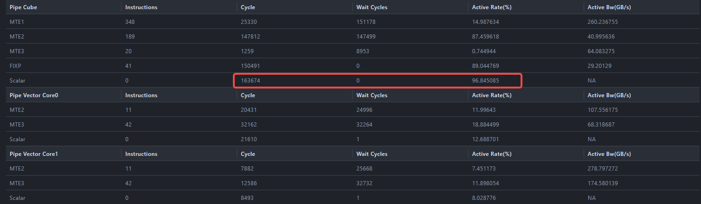
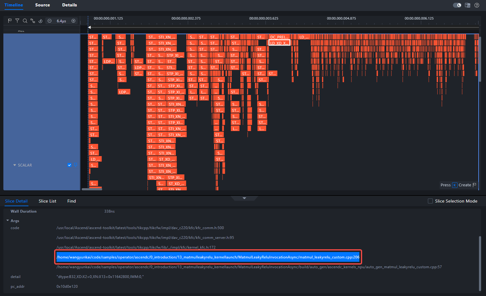
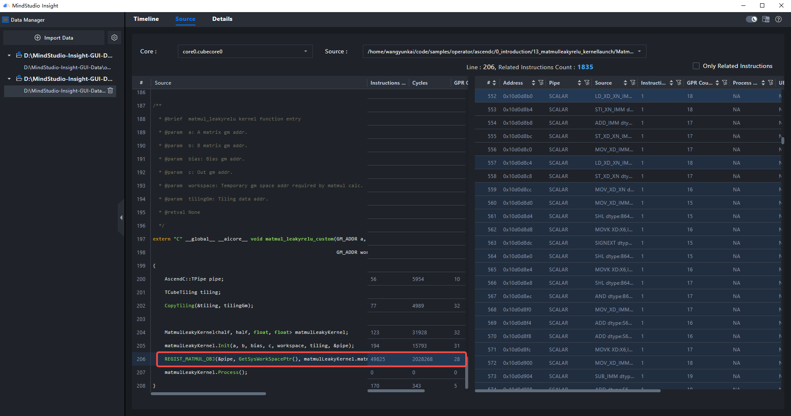

# 快速入门（算子调优篇）

MindStudio Insight 支持导入 [msOpProf](https://gitcode.com/Ascend/msopprof) 工具采集的、运行在昇腾 AI 处理器上的算子性能数据。用户可根据展现的算子关键性能指标，快速定位算子的软、硬件性能瓶颈，进行算子性能调优。

本文以 `matmul_leakyrelu` 算子为例，演示如何从上板数据发现性能异常，再通过仿真数据定位到可能需要优化的用户代码行。

## 1. 适用范围与前置条件

### 1.1 适用范围

本文适用于希望快速体验 MindStudio Insight 算子调优能力的开发者，重点演示以下流程：

1. 导入 msOpProf 采集的算子上板数据，查看算子整体耗时和流水占比。
2. 导入 msOpProf 仿真数据，查看 Timeline（时间线）和 Source（源码）信息。
3. 根据热点行为定位可能导致性能瓶颈的用户代码位置。

> [!NOTE]
> 本文使用已准备好的样例数据演示分析路径，不展开 msOpProf 数据采集命令。若需要采集真实算子数据，请参考 [MindStudio Insight 算子调优](../user_guide/operator_tuning.md) 中的数据说明和 msOpProf 工具文档。

### 1.2 开始前检查

| 检查项 | 要求 |
| --- | --- |
| 工具安装 | 已完成 MindStudio Insight 安装，安装方法请参见 [MindStudio Insight 安装指南](../install_guide/mindstudio_insight_install_guide.md)。 |
| 版本配套 | MindStudio Insight、CANN 与采集工具版本需匹配，版本关系请参见 [版本发布说明](../release_notes/release_notes.md)。 |
| 样例数据 | 已下载本文提供的算子样例数据，并能在本地访问。 |
| 数据来源 | 样例数据由 [msOpProf](https://gitcode.com/Ascend/msopprof) 采集，包含上板数据和仿真数据。 |
| 适用场景 | 适用于 Ascend 算子性能分析入门，尤其适合学习 Details、Timeline、Source 页签之间的定位关系。 |

### 1.3 样例数据

算子数据：[点击下载](https://gitcode.com/zhangruoyu2/msinsight-quick-start-demo/blob/main/operator)

下载后请确认目录中包含以下两类数据：

```text
├─msprof-op                  # 上板数据，用于查看真实硬件执行耗时和基础性能指标
│  ├─core_inter_load
│  ├─details
│  ├─ratio
│  ├─roofline
│  ├─source
│  └─timeline
└─msprof-op-simulator         # 仿真数据，用于查看细粒度 Timeline 和源码热点
```

本文后续会分别导入：

- `msprof-op/details/visualize_data.bin`：查看上板数据。
- `msprof-op-simulator/visualize_data.bin`：查看仿真数据。

### 1.4 术语速查

| 术语 | 说明 |
| --- | --- |
| 上板数据 | 在真实昇腾硬件上运行算子后采集的数据，适合观察真实耗时、流水占比和硬件利用情况。 |
| 仿真数据 | 通过仿真器采集的数据，适合观察更细粒度的指令流水、代码热点和行为分布。 |
| Details（详情） | 用于查看算子基础信息、内存负载、流水占比等汇总指标。 |
| Timeline（时间线） | 用于按时间顺序查看算子运行过程中的行为和流水状态。 |
| Source（源码） | 用于将热点行为关联到用户源码位置。 |
| Scalar | 标量计算单元。Scalar 活跃度过高通常意味着存在较多标量控制或配置类操作。 |
| Cube | 矩阵计算相关的计算单元。矩阵类算子通常希望主要耗时集中在 Cube 计算上。 |

## 2. 操作步骤

### 2.1 查看上板数据

**操作：** 导入 `msprof-op/details/visualize_data.bin` 上板数据文件，切换到 Details（详情）页签。

**观察目标：** 先查看算子整体耗时，判断是否明显偏离预期。


在基础信息部分，发现算子用时约 **90+ μs**。

> 对于 `matmul_leakyrelu` 算子，性能主要取决于矩阵乘法部分，LeakyReLU 的计算量相对很小。

根据该样例的先验基准，在 Ascend 910 上计算 FP16 的小矩阵（`1024 × 1024 × 1024`），`matmul_leakyrelu` 算子的预期用时通常在 **16–30 μs** 范围内。当前样例约 **90+ μs**，明显高于预期，因此可以初步判断该算子存在优化空间。

> [!NOTE]
> 预期耗时会受硬件型号、CANN / msOpProf 版本、算子实现和输入规模影响。本文中的数值用于说明分析方法，真实业务中应以同环境基线或优化目标作为判断依据。

**下一步：** 继续查看流水占比，判断耗时是否集中在不符合预期的计算单元上。



在内存负载分析部分，查看流水情况，发现 Cube 流水中 Scalar 活跃度较高。对于矩阵乘法主导的算子，通常期望主要计算耗时集中在 Cube 相关计算上；如果 Scalar 行为占比明显偏高，说明算子中可能存在较多标量配置、控制或对象初始化操作，需要继续定位具体来源。

> 初步结论：算子整体耗时高于预期，且 Scalar 行为占比较高，建议继续通过仿真数据定位具体代码位置。

### 2.2 查看仿真数据

**操作：** 导入 `msprof-op-simulator/visualize_data.bin` 仿真数据文件，切换到 Timeline（时间线）页签。

**观察目标：** 查看 Scalar 泳道中的行为分布，确认上板数据中观察到的 Scalar 活跃问题是否能在时间线上定位。


在 Timeline（时间线）页签查看算子运行过程的行为。可以看到 Scalar 泳道中的行为较多，这与上板数据中“Scalar 活跃度较高”的初步结论一致。

**操作：** 鼠标框选 Scalar 泳道，挑选发生次数最多或耗时最明显的行为，查看是哪段代码导致的。

**判断依据：** 如果某类 Scalar 行为出现次数多，或在时间线上形成密集片段，通常说明该行为可能对整体耗时有明显贡献，应优先定位其源码来源。


选中目标行为后，在详情区域查看关联源码位置。



从详情区域可以定位到用户代码位置，示例路径如下：

```text
/path/to/samples/operator/ascendc/0_introduction/13_matmulleakyrelu_kernellaunch/MatmulLeakyReluInvocationAsync/matmul_leakyrelu_custom.cpp:206
```

> [!NOTE]
> 实际路径会随样例代码存放位置不同而变化。分析时请优先关注路径中的用户源码文件和行号，而不是工具链内部文件路径。

**操作：** 切换到 Source（源码）页签，打开之前找到的用户代码。



```c
206     REGIST_MATMUL_OBJ(&pipe, GetSysWorkSpacePtr(), matmulLeakyKernel.matmulObj, &matmulLeakyKernel.tiling);
```

`REGIST_MATMUL_OBJ` 是一个宏，用于初始化 Matmul 对象并设置 Tiling 参数。根据昇腾官方文档，这个宏内部会执行一系列标量操作来配置 Cube 计算单元，因此它可能是本例中 Scalar 行为较多的重要来源。

> 结论：通过“上板数据发现异常 → 仿真数据查看时间线 → Source 页签定位源码”的路径，可以定位到可能需要优化的代码行。下一步应由算子开发工程师结合算子实现，评估是否可以减少重复初始化、优化 Tiling 设计或调整 Matmul 对象使用方式。

## 3. 常见问题与排查入口

| 现象 | 建议处理 |
| --- | --- |
| 导入 `visualize_data.bin` 后无数据显示 | 先确认导入的是上板或仿真数据中正确的 `visualize_data.bin` 文件，再参考 [FAQ](../support/faq.md) 中的数据导入相关问题。 |
| 页面显示与本文截图不完全一致 | 不同 MindStudio Insight、CANN 或 msOpProf 版本的界面字段可能略有差异，请以 Details、Timeline、Source 页签中的关键指标和源码定位信息为准。 |
| 无法定位到源码 | 检查 msOpProf 采集时是否包含源码信息，或参考 [MindStudio Insight 算子调优](../user_guide/operator_tuning.md) 的数据说明。 |
| 想了解 Timeline 泳道含义 | 参考 [Timeline 泳道介绍](../best_practices/Timeline_Common_Lanes_and_Interface.md)。 |

## 4. 下一步阅读

- 了解数据导入、打开视图和基础操作：参考 [MindStudio Insight 基础操作](../user_guide/basic_operations.md)。
- 深入学习算子调优能力：参考 [MindStudio Insight 算子调优](../user_guide/operator_tuning.md)。
- 了解 Timeline 常见泳道和交互：参考 [Timeline 泳道介绍](../best_practices/Timeline_Common_Lanes_and_Interface.md)。
- 遇到导入或界面异常：参考 [FAQ](../support/faq.md)。
