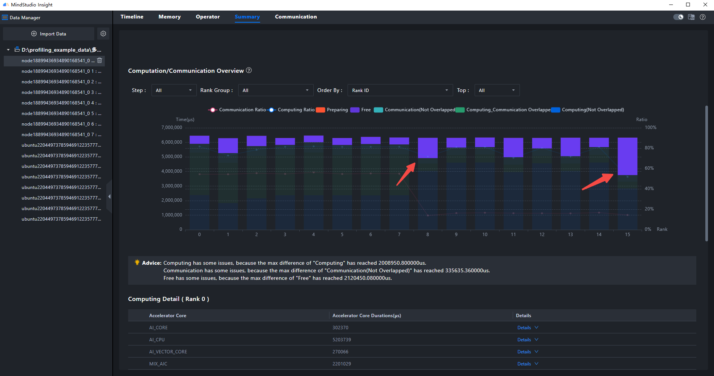
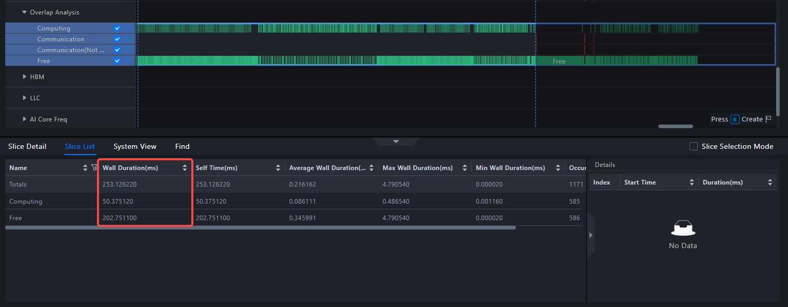

# 快速入门（系统调优篇）

MindStudio Insight 支持导入 [msProf](https://gitcode.com/Ascend/msprof) 工具采集的、运行在昇腾 AI 处理器上的模型系统性能数据。用户可根据展现的模型关键性能指标，快速定位模型的软、硬件性能瓶颈，进行系统性能调优。

本文以双机 16 卡样例数据为例，演示如何从 Summary、Communication 和 Timeline 三个页签逐步定位快慢卡（即卡性能不均衡）导致的系统性能瓶颈。

## 1. 适用范围与前置条件

### 1.1 适用范围

本文适用于希望快速体验 MindStudio Insight 系统调优能力的开发者，重点演示以下流程：

1. 导入 msProf 采集的系统性能数据。
2. 在 Summary（概览）页签观察整体资源利用情况。
3. 在 Communication（通信）页签判断可能的性能瓶颈卡。
4. 在 Timeline（时间线）页签进一步确认空闲与计算分布。

> [!NOTE]
> 本文使用已准备好的样例数据演示分析路径，不展开 msProf 数据采集命令。若需要采集真实系统数据，请参考 [MindStudio Insight 系统调优](../user_guide/system_tuning.md) 中的数据说明和 msProf 工具文档。

### 1.2 开始前检查

| 检查项 | 要求 |
| --- | --- |
| 工具安装 | 已完成 MindStudio Insight 安装，安装方法请参见 [MindStudio Insight 安装指南](../install_guide/mindstudio_insight_install_guide.md)。 |
| 版本配套 | MindStudio Insight、CANN 与采集工具版本需匹配，版本关系请参见 [版本发布说明](../release_notes/release_notes.md)。 |
| 样例数据 | 已下载本文提供的系统性能样例数据，并能在本地访问。 |
| 数据来源 | 样例数据由 [msProf](https://gitcode.com/Ascend/msprof) 采集，包含 Summary、Communication、Timeline 所需信息。 |
| 适用场景 | 适用于多卡训练或推理场景的系统性能入门分析，尤其适合学习快慢卡、通信耗时和空闲时间分析。 |

### 1.3 样例数据

系统数据：[点击下载](https://gitcode.com/zhangruoyu2/msinsight-quick-start-demo/blob/main/system)

下载后请确认目录中包含如下结构：

```text
└─MultiProfLevel2MemoryUB_db
    ├─cluster_analysis_output
    ├─node1_2166651_20240619060505060_ascend_pt
    │  ├─ASCEND_PROFILER_OUTPUT
    │  ├─FRAMEWORK
    │  └─PROF_000001_20240619140505099_GNIJBPBEBIHIHCKB
    ├─node1_2166652_20240619060505059_ascend_pt
    │  ├─ASCEND_PROFILER_OUTPUT
    │  ├─FRAMEWORK
    │  └─PROF_000001_20240619140505221_GOGOEMKAROGRMIMC
    ├─node1_2166653_20240619060505061_ascend_pt
    │  ├─ASCEND_PROFILER_OUTPUT
    │  ├─FRAMEWORK
    │  └─PROF_000001_20240619140505106_OBPMMFGEPENJQFGB
    ├─node1_2166654_20240619060505060_ascend_pt
    │  ├─ASCEND_PROFILER_OUTPUT
    │  ├─FRAMEWORK
    │  └─PROF_000001_20240619140505226_QDMBAQFOGNGMDQKA
    ├─node1_2166655_20240619060505059_ascend_pt
    │  ├─ASCEND_PROFILER_OUTPUT
    │  ├─FRAMEWORK
    │  └─PROF_000001_20240619140505102_CAMQMCOANGFPNHKC
    ├─node1_2166656_20240619060505059_ascend_pt
    │  ├─ASCEND_PROFILER_OUTPUT
    │  ├─FRAMEWORK
    │  └─PROF_000001_20240619140505221_HEKHQMKAREGIKAQB
    ├─node1_2166657_20240619060505060_ascend_pt
    │  ├─ASCEND_PROFILER_OUTPUT
    │  ├─FRAMEWORK
    │  └─PROF_000001_20240619140505169_QQNFRMQFEEKHCIFA
    ├─node1_2166658_20240619060505060_ascend_pt
    │  ├─ASCEND_PROFILER_OUTPUT
    │  ├─FRAMEWORK
    │  └─PROF_000001_20240619140505196_CHIRLGBCBGMLEFJC
    ├─ubuntu2204_1660963_20240619060440181_ascend_pt
    │  ├─ASCEND_PROFILER_OUTPUT
    │  ├─FRAMEWORK
    │  └─PROF_000001_20240619060440316_NDJQFQRGIMPECACC
    ├─ubuntu2204_1660964_20240619060440179_ascend_pt
    │  ├─ASCEND_PROFILER_OUTPUT
    │  ├─FRAMEWORK
    │  └─PROF_000001_20240619060440323_JQBHAHKEDBPDBBDC
    ├─ubuntu2204_1660965_20240619060440181_ascend_pt
    │  ├─ASCEND_PROFILER_OUTPUT
    │  ├─FRAMEWORK
    │  └─PROF_000001_20240619060440310_CGDJCKDFAOCOKNMB
    ├─ubuntu2204_1660966_20240619060440181_ascend_pt
    │  ├─ASCEND_PROFILER_OUTPUT
    │  ├─FRAMEWORK
    │  └─PROF_000001_20240619060440326_QKMBONEJDLBAHCOA
    ├─ubuntu2204_1660970_20240619060440179_ascend_pt
    │  ├─ASCEND_PROFILER_OUTPUT
    │  ├─FRAMEWORK
    │  └─PROF_000001_20240619060440334_AGCKEFNHPCNEHKHB
    ├─ubuntu2204_1660971_20240619060440180_ascend_pt
    │  ├─ASCEND_PROFILER_OUTPUT
    │  ├─FRAMEWORK
    │  └─PROF_000001_20240619060440319_OAEDHALJOJOJKECC
    ├─ubuntu2204_1660972_20240619060440181_ascend_pt
    │  ├─ASCEND_PROFILER_OUTPUT
    │  ├─FRAMEWORK
    │  └─PROF_000001_20240619060440320_RAGMCOQPGDMOJECA
    └─ubuntu2204_1660973_20240619060440181_ascend_pt
        ├─ASCEND_PROFILER_OUTPUT
        ├─FRAMEWORK
        └─PROF_000001_20240619060440316_MONIINKACEIFDCRA
```

导入时请注意：本文的分析对象是整个 `MultiProfLevel2MemoryUB_db` 目录，而不是其中某一个子目录。

### 1.4 术语速查

| 术语 | 说明 |
| --- | --- |
| msProf | 用于采集系统性能数据的工具。本文使用其导出的分析数据进行系统调优。 |
| Summary（概览） | 用于查看整体计算/通信概况、资源利用情况和初步瓶颈判断。 |
| Communication（通信） | 用于查看通信耗时和通信算子分布，帮助判断是否存在慢卡。 |
| Timeline（时间线） | 用于查看卡在时间上的行为分布，确认计算、通信和空闲状态。 |
| Overlap Analysis | 时间线中的分析泳道，用于同时观察 Computing、Communication 和 Free 的关系。 |
| Computing | 表示卡正在计算。 |
| Communication | 表示卡正在通信。 |
| Free | 表示卡处于空闲状态。 |
| 快慢卡 | 指集群中不同卡的性能不均衡现象。 |

## 2. 操作步骤

### 2.1 分析 Summary（概览）页签

**操作：** 导入 `MultiProfLevel2MemoryUB_db` 文件夹，切换到 Summary（概览）页签。

**观察目标：** 先看整体计算/通信概览，判断是否存在明显资源未被充分利用的卡。



在计算/通信概览部分，发现 8 卡、15 卡的空闲时间很明显。这表明这些卡的资源没有被充分利用，系统性能存在优化空间。

> 初步结论：系统存在性能优化空间。

### 2.2 分析 Communication（通信）页签

**操作：** 切换到 Communication（通信）页签，选择 “Communication Duration Analysis（通信耗时分析）” 单选项。

**观察目标：** 查看各卡通信耗时是否存在明显差异，判断是否有卡进入同步阶段过早或过晚。


观察通信算子缩略图，发现 15 卡的第一个通信算子耗时最短。对于多卡并行场景，通信阶段通常包含“等待其他卡到达同步点”的时间；如果某张卡的通信耗时明显偏短，说明它在该通信算子上等待时间较少，但结合 Summary 中该卡空闲时间明显的现象，需要进一步查看通信前后是否存在长时间 Free 状态，从而判断瓶颈是否来自卡空闲或 Host 侧未及时下发任务。

> _注意：这份数据使用了并行策略，因此每隔一段时间需要通过“通信”同步各个卡的数据。_
>
> _通信耗时不能单独作为快慢判断依据，需要结合 Summary 中的空闲时间和 Timeline 中通信前后的 Computing / Free 分布综合判断。_
>
> 第二步结论：15 卡需要重点分析，下一步应跳转 Timeline 查看它在通信前后的行为。

### 2.3 分析 Timeline（时间线）页签

**操作：** 右键通信算子缩略图中 15 卡的最小通信算子，选择 “Find in Timeline（跳转至时间线视图）” 项目，然后适当缩放，查看 15 卡在通信之前的行为。

**观察目标：** 确认这张卡在通信前是处于计算、通信还是空闲状态，从而判断导致同步差异的原因。


**操作：** 框选 Overlap Analysis 泳道，查看 15 卡的行为。

> _注意：Overlap Analysis 泳道中，Computing 子泳道是上方 Ascend Hardware 泳道的投影，表示卡正在计算；Communication 子泳道是上方 Communication 泳道的投影，表示卡正在通信；Free 子泳道表示卡正在空闲。_



观察框选后的 Slice List（选中列表）部分，发现 Free 用时是计算用时的 3 倍左右。卡空闲通常的原因有：用户代码纯 CPU 操作耗时长、Host 系统线程抢占等。此时应继续补充 Host 侧数据，进一步分析为什么这张卡在通信前处于空闲状态。

> 结论：性能瓶颈更可能来自卡空闲时间过多。下一步需要检查用户代码、采集 Host 数据，继续分析导致卡空闲的根因。

## 3. 常见问题与排查入口

| 现象 | 建议处理 |
| --- | --- |
| 导入 `MultiProfLevel2MemoryUB_db` 后无数据显示 | 先确认导入的是整个根目录，而不是某个子目录；如果仍然无数据显示，请参考 [FAQ](../support/faq.md) 中的数据导入问题。 |
| 页面显示与本文截图不完全一致 | 不同 MindStudio Insight、CANN 或 msProf 版本的界面字段可能略有差异，请以 Summary、Communication、Timeline 页签中的关键指标为准。 |
| 无法判断哪张卡是瓶颈 | 先在 Communication 页签观察通信耗时，再在 Timeline 页签确认该卡在通信前的计算/空闲状态。 |
| 想了解 Timeline 泳道含义 | 参考 [Timeline 泳道介绍](../best_practices/Timeline_Common_Lanes_and_Interface.md)。 |

## 4. 下一步阅读

- 了解数据导入、打开视图和基础操作：参考 [MindStudio Insight 基础操作](../user_guide/basic_operations.md)。
- 深入学习系统调优能力：参考 [MindStudio Insight 系统调优](../user_guide/system_tuning.md)。
- 了解 Timeline 常见泳道和交互：参考 [Timeline 泳道介绍](../best_practices/Timeline_Common_Lanes_and_Interface.md)。
- 进一步理解 Host 侧空闲和瓶颈分析：参考 [基于 Linux Kernel Trace 的 Host Bound 问题分析](../best_practices/Host_Bound_Analysis_with_Linux_Kernel_Trace.md)。
- 遇到导入或界面异常：参考 [FAQ](../support/faq.md)。
