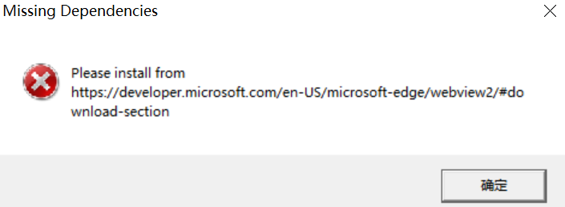
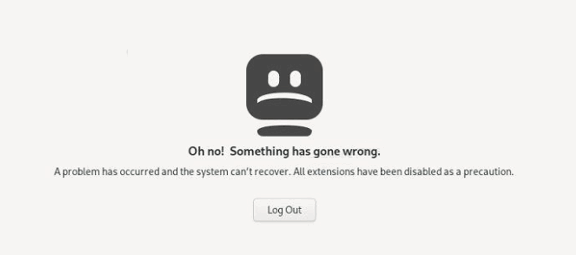
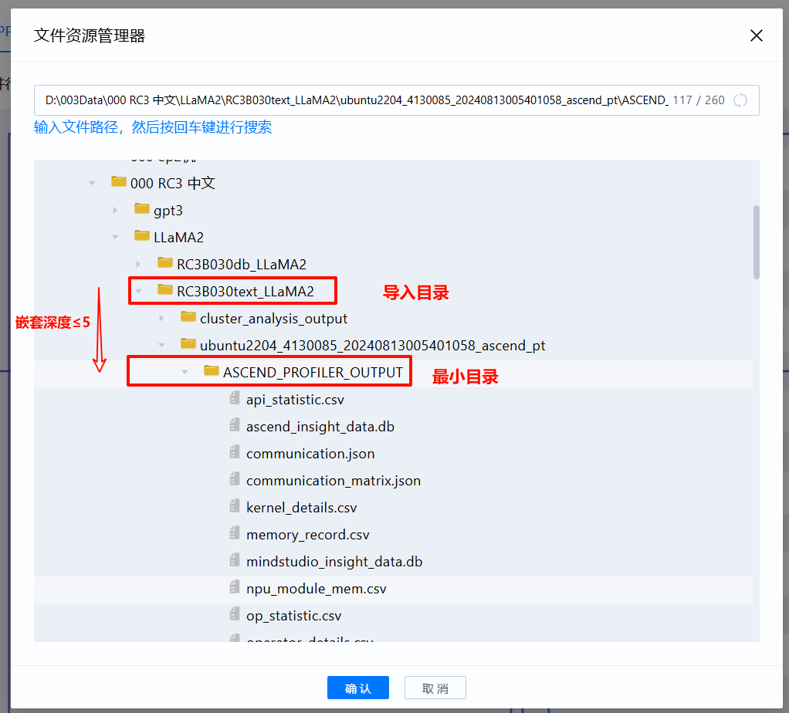
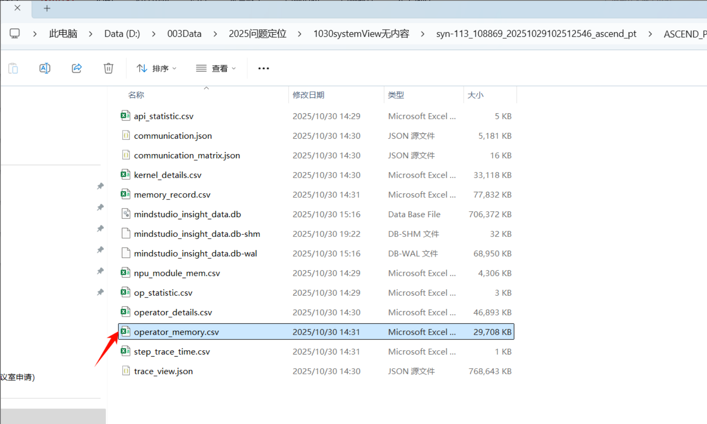
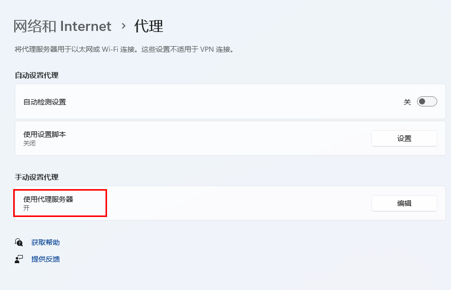
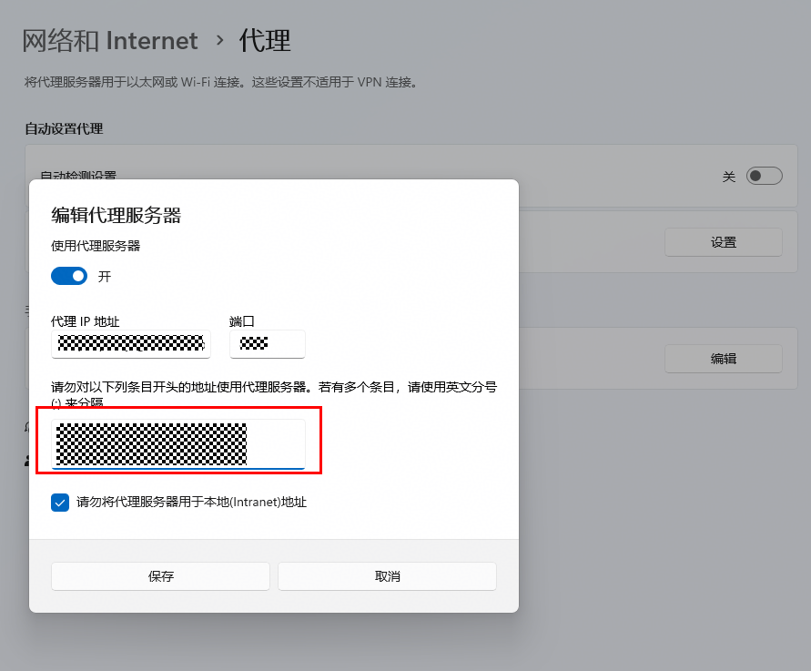
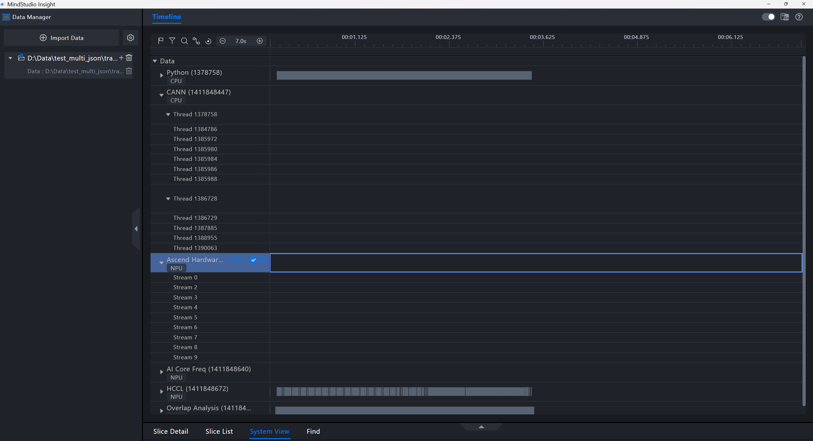
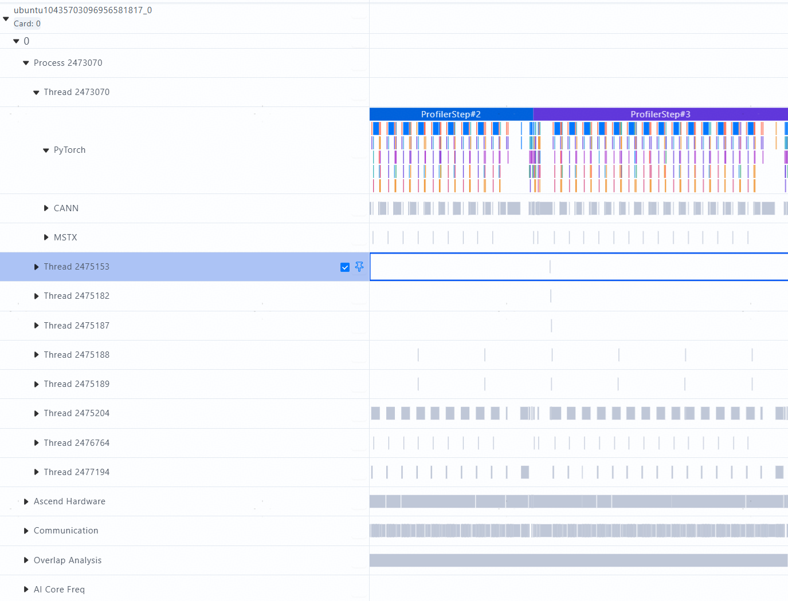
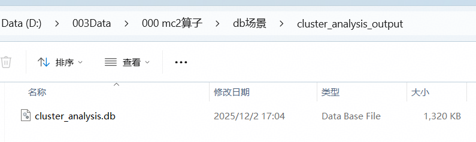
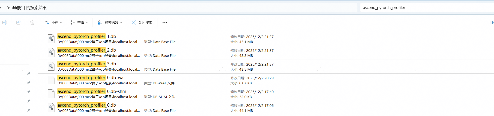

# **FAQ**

<a id="faq-missing-dependencies"></a>

## 1. Windows 运行 MindStudio Insight 时出现 Missing Dependencies 报错怎么办？

**问题现象**

在 Windows 系统运行 MindStudio Insight 时，出现 Missing Dependencies 报错弹窗，且工具无法启动。



**原因分析**

系统缺少 MindStudio Insight 运行依赖的 WebView2 Runtime 组件。

**解决方案**

1. 单击[链接](https://developer.microsoft.com/en-US/microsoft-edge/webview2/#download-section)，进入 Microsoft 官网。
2. 下载 “Evergreen Standalone Installer” 中的 x64 安装包，如[**图 1**  WebView2 安装包](#WebView2 安装包)所示。

    **图 1**  WebView2 安装包<a id="WebView2 安装包"></a>
    

3. 安装完成后，重新运行 MindStudio Insight。

## 2. 如何重新解析 text 格式的 Profiling 文件？

**问题现象**

在同一版本的 MindStudio Insight 中，再次导入 text 格式的 Profiling 文件时，工具不会重新解析数据。如果需要重新解析数据，可以按如下方法处理。

**解决方案**

删除 Profiling 数据目录中的解析结果文件 `mindstudio_insight_data.db` 后，再次导入数据即可重新解析。

<a id="faq-euleros-import-dialog"></a>

## 3. EulerOS 等系统无法弹出数据导入选择框怎么办？

**问题现象**

在 EulerOS 等系统上运行 MindStudio Insight 时，单击界面左上方工具栏中的，无法弹出导入选择框。

**解决方案**

1. 登录到待安装 MindStudio Insight 的环境。
2. 执行以下命令，设置环境变量。

    ```shell
    export WEBKIT_DISABLE_COMPOSITING_MODE=1
    ```

3. 执行以下命令，启动 MindStudio Insight。

    ```shell
    ./MindStudio-Insight
    ```

<a id="faq-x11-paste-error"></a>

## 4. X11 转发方式下输入框粘贴内容有误怎么办？

**问题现象**

在 Linux 系统中，通过 X11 转发方式运行 MindStudio Insight 时，在输入框已存在信息情况下，重新粘贴所需信息时会出现错误。

**原因分析**

在 Linux 系统中，通过 X11 转发方式运行 MindStudio Insight 时，默认开启了“copy on select”，导致剪贴板的信息会变为输入框已存在信息，造成输入框信息粘贴有误。

**解决方案**

方案一：

1. 在远程登录工具菜单栏单击“Settings \> Configuration“。此处以 MobaXterm 工具为例。
2. 选择“X11”页签，在“Clipboard”选项中选择“disable"copy on select"”，如[**图 1**  MobaXterm Configuration](#MobaXterm Configuration)所示。

    **图 1**  MobaXterm Configuration<a id="MobaXterm Configuration"></a>
    

3. 单击“OK”。
4. 完成配置后，重新运行 MindStudio Insight。

方案二：

在 MindStudio Insight 界面，先删除输入框中已存在的信息，再重新复制粘贴所需信息。

<a id="faq-network-disk-import"></a>

## 5. 拖入网络磁盘目录无法加载数据怎么办？

**问题现象**

在 MindStudio Insight 导入数据时，选择网络磁盘目录，无法导入。

**原因分析**

MindStudio Insight 仅支持导入本地磁盘目录，而网络磁盘未映射至本地，无法导入。

**解决方案**

1. 打开电脑的文件资源管理器。
2. 单击“此电脑 \> 映射网络驱动器”，弹出“映射网络驱动器”弹窗，如[**图 1**  映射网络驱动器](#映射网络驱动器)。

    **图 1**  映射网络驱动器<a id="映射网络驱动器"></a>
    

3. 下拉“驱动器\(D\)”选框，选择连接指定的驱动器号。
4. 单击“文件夹\(O\)”后的“浏览”，选择所需映射的网络目录。
5. 单击“完成\(F\)”，完成网络目录至本地的映射操作。
6. 打开 MindStudio Insight，重新选择映射后的目录，即可正常导入。

## 6. 运行时出现 Out of Memory 报错怎么办？

**问题现象**

在 MindStudio Insight 运行时，页面出现错误代码：Out of Memory。

**原因分析**

当前使用的电脑系统整体内存不足。

**解决方案**

1. 自行关闭消耗大量内存的程序和不必要的应用，释放电脑系统内存。
2. 在 MindStudio Insight 报错页面单击“刷新”按钮，重新加载页面。

<a id="faq-drag-file-disabled"></a>

## 7. Windows 安装后拖入文件显示禁用怎么办？

**问题现象**

在 Windows 系统上安装 MindStudio Insight 时，选择勾选“Run MindStudio Insight“自动打开MindStudio Insight的情况下，拖入文件显示禁用。

**解决方案**

1. 关闭当前已打开的 MindStudio Insight。
2. 双击桌面的“MindStudio Insight”快捷方式图标，或安装目录下的“MindStudio-Insight.exe”，重新打开 MindStudio Insight。
3. 拖入文件，即可正常显示。

## 8. Linux 启动时出现 swrast_dri.so 缺失报错怎么办？

**问题现象**

在 Linux 系统中使用“X11 方式”或“VNC 方式”启动 MindStudio Insight 时，工具界面白屏，出现“cannot open shared object file swrast\_dri.so”报错信息，如[**图 1**  报错截图](#报错截图)所示。

**图 1**  报错截图<a id="报错截图"></a>


**原因分析**

可能是缺少依赖。

**解决方案**

1. 执行以下命令，安装转发依赖文件。

    ```shell
    yum install -y mesa-dri-drivers
    ```

2. 安装完成后，重新打开 MindStudio Insight即可。

## 9. 启动 VNC 时出现 “Oh no! Something has gone wrong.” 报错怎么办？

**问题现象**

在 Linux 系统上，使用“VNC 方式”启动 MindStudio Insight 时，启动VNC，出现“Oh no! Something has gone wrong.”报错弹窗，如[**图 1**  报错信息](#报错信息)所示。

**图 1**  报错信息<a id="报错信息"></a>


**原因分析**

可能是未开启AllowTcpForwarding。

VNC在某些情况下需要通过SSH通道来实现连接，而TCP转发正是支持这个功能的关键。如果AllowTcpForwarding被关闭，则SSH不允许使用端口转发，因此无法通过SSH通道访问VNC服务。开启AllowTcpForwarding后，就能在本地或远程通过SSH通道连接到VNC服务。

**解决方案**

需要配置SSH服务端。

1. 进入/etc/ssh/路径，打开sshd\_config文件。
2. 修改文件中的AllowTcpForwarding为“yes”。
3. 执行以下命令，重启SSH服务端。

    ```shell
    systemctl restart sshd
    ```

4. 重启成功后，重新打开新的窗口启动 VNC。

## 10. OpenEuler 及其衍生系统安装依赖时提示找不到依赖怎么办？

**问题现象**

在 Linux 操作系统上，OpenEuler 及其衍生操作系统在安装依赖时，提示找不到相关依赖。

**原因分析**

配置的源没有相关依赖。

**解决方案**

可参见[链接](https://www.hiascend.com/forum/thread-02101178181671140059-1-1.html)配置新的源，并重新安装对应依赖。

## 11. 导入数据时页面显示黑屏怎么办？

**问题现象**

在MindStudio Insight 页面，第一次导入数据显示正常，第二次导入相同的数据时，“概览”界面和“通信”界面显示黑屏。

**解决方案**

方案一：关闭当前MindStudio Insight，重启即可恢复正常。

方案二：在当前MindStudio Insight工具页，查看或导入其他的数据后，再次选择查看刚才的数据，页面即可恢复正常。

## 12. 导入数据后通信界面未显示数据怎么办？

**问题现象**

使用 MindStudio Insight 导入数据后，通信界面未显示数据。

**原因分析**

当前导入的性能数据目录与以ascend\_ms结尾的目录之间存在多层子文件夹，例如：profiling/rank\_x/dyn\_prof\_data/rank\_x\_start\_xxx\_end\_xxx/xxx\_ascend\_ms，此时，MindStudio Insight 会将导入的数据识别为集群数据，导致通信界面显示异常。

**解决方案**

找到以ascend\_ms结尾的目录，将其拷贝至新创建的目录下，保证该目录层级为_目录名称_/ascend\_ms结尾的目录，在 MindStudio Insight 中重新导入该目录，即可正常显示。

## 13. TencentOS Server 4.4_x86 中启动失败怎么办？

**问题现象**

在Linux的TencentOS Server 4.4\_x86操作系统中，启动 MindStudio Insight，启动失败，报错信息如下：

```tex
** (MindStudio-Insight:302256): WARNING **: 08:07:35.531: webkit_settings_set_enable_offline_web_application_cache is deprecated and does nothing.
JIT session error: Missing definitions in module fs789_variant0_6-jitted-objectbuffer: [ fs_variant_whole ]
Failed to materialize symbols: { (fs789_variant0_6, { fs_variant_partial, fs_variant_whole }) }
JIT session error: Could not find symbol at given index, did you add it to JITSymbolTable? index: 4, shndx: 0 Size of table: 5
Failed to materialize symbols: { (fs790_variant0_7, { fs_variant_partial }) }
```

**解决方案**

执行以下命令后，重新启动 MindStudio Insight。

```shell
export JSC_useJIT=0
export JSC_useDFGJIT=0
export JSC_useFTLJIT=0
export WEBKIT_DISABLE_COMPOSITING_MODE=1
unset HTTPS_PROXY
unset HTTP_PROXY
```

## 14. 导入文件时提示路径过长或嵌套层数过深怎么办？

**问题现象**

The nesting depth of the imported sub-file exceeds 5 or the sub-file path length exceeds


**解决方案**

1. 首先排查是否文件路径过长，如果**文件路径长度超过260**则可以修改文件路径名称；
2. 然后排查是否文件嵌套过深，如以**导入目录到trace_view.json文件的嵌套层数**是否超过5层来判断，如果超过5层则可以修改嵌套深度；

   
3. 检查导入文件是否为有效数据，文件是否有损坏或不完整
4. 如果以上方法均无法解决问题，请联系 MindStudio Insight 工具接口人进一步定位。

## 15. System view 和 Operator 页签没有内容怎么办？

**问题现象**

在采集配置正常的情况下，采集到的 Profiling 数据在 MindStudio Insight 中 System view 没有内容，情况如下：


也可能表现为 Operator 页签无内容，如下：


**原因分析**

使用 `torch_npu` 旧版本，如 2.5.1.post1.dev20250722 时，采集到的 `operator_memory.csv` 文件中 Device 信息不正确，在进行 `ASCEND_RT_VISIBLE_DEVICES` 资源配置时，每个 Device 会存在 Device ID 和 Device 索引值两个概念，`operator_memory.csv` 中记录了 Device 索引值，与其他文件的 Device ID 不一致，导致 System view、Operator 界面无法正常显示。2025/08/06 后的 `torch_npu` 已修复此问题。



**解决方案**

1. 手动修改 `operator_memory.csv` 内容

根据配置的 `ASCEND_RT_VISIBLE_DEVICES` 信息，修改 `operator_memory.csv` 文件中的 `Device Type` 列内容。


注意，此处应修改为局部 Device ID，而非全局 Rank ID。举例，若单节点 8 卡，双节点共 16 卡，全局 Rank ID 为 0 至 15，而 Device ID 为 0 至 7；Rank ID = 8 为第二个节点 Device ID 为 0 的卡，Rank ID = 9 为第二个节点 Device ID 为 1 的卡，以此类推。
2. 版本更新
2025/08/06 后的 `torch_npu` 已修复此问题，请更新 `torch_npu` 到 2025/08/06 后的版本。

## 16. 启动后提示 WebSocket 断连怎么办？

**问题现象**

WebSocket is already in CLOSING or CLOSED state! You are advised to restart MindStudio Insight.


**解决方案**

1. 首先排查是否为代理设置问题，进入主机设置界面，查看***网络代理和 Internet > 代理 > 手动设置代理***；

   
2. 点击编辑进行查看；

   
3. 查看上图代理白名单中是否有**<-loopback>**关键字，如果有的话删除后保存；

   
4. 若去掉该白名单后影响本地 Web 的一些访问，可以增加关键字，然后重新打开 MindStudio Insight 使用；
5. 若不存在该关键字且修改后无效，请联系 MindStudio Insight 工具接口人进一步定位。

## 17. 同一文件夹下多个 JSON 文件的 Timeline 显示异常怎么办？

**问题现象**

当在同一文件夹下放置多个 JSON 文件时，多开 MindStudio Insight 并同时查看多个 JSON 文件对应的 Timeline 页面时，会出现只有一个页面能显示对的情况，其它页面会出现无显示或者显示错误的情况，举例如下：

无显示



显示错误


示例版本号


**原因分析**

MindStudio Insight 解析 JSON 文件后会生成 DB 文件，方便后续查询，如果一个目录下有多个 JSON 文件，仍然只会生成一个 DB 文件，所以后解析的文件内容会覆盖先解析的文件内容，导致先打开的文件内容不对。

**解决方案**

删除 DB 文件后，将多个 JSON 文件分开在不同文件夹下，重新导入。

## 18. Profiling DB 与 text 数据混合时如何只查看 text 数据？

**问题现象**

**现象一：泳道显示与预期不一致**

想要这样的👇


但得到了这样的👇



**现象二：常见 CSV 交付件未显示**

想要这样的：


但得到了这样的：



**原因分析**

Profiling 采集交付件分为**Text 类型**与 **DB 类型**，8.1.RC1 之后的 CANN 包进行 Profiling 采集时，若选择输出 Text 交付件，会同时生成 Text 与 DB 类型数据，MindStudio Insight 会优先识别为 DB 数据。

DB 数据的优点是磁盘占用小，文件解析加载更快。但部分用户可能不习惯新的 DB 交付件，和新的泳道排布关系，想要恢复为 text 场景。

**解决方案**

在数据目录搜索并删除所有 DB 交付件，包括 `ascend_pytorch_profiler_x.db`、`analysis.db` 文件，则 MindStudio Insight 只会识别 Text 数据。




