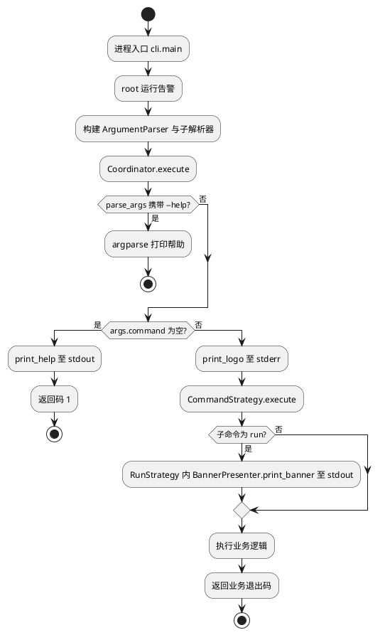
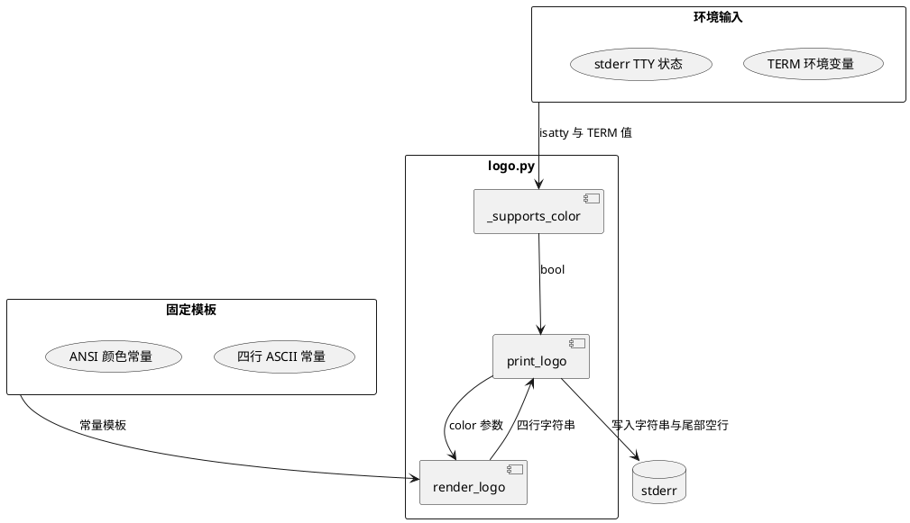
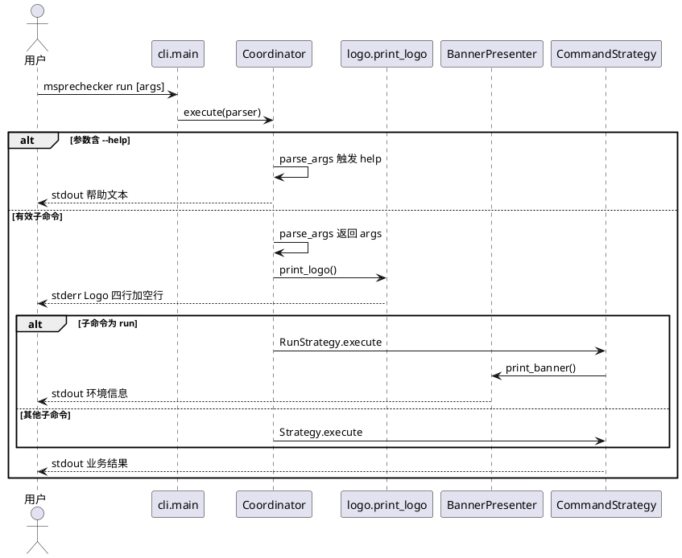
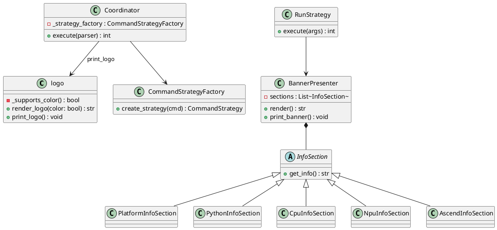
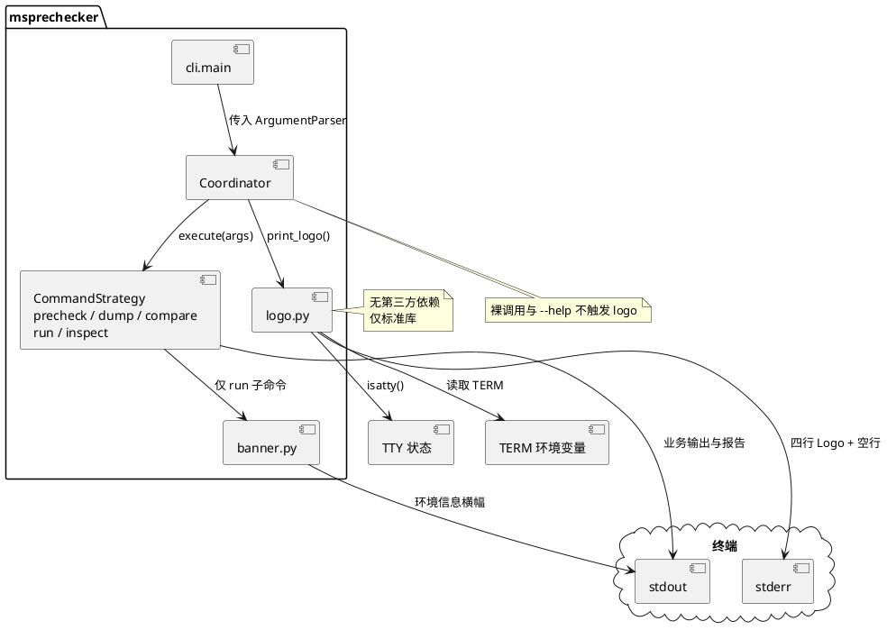

# 特性设计

## 功能描述

MindStudio 预检工具 msprechecker 当前在部分子命令执行路径中通过 `BannerPresenter` 向标准输出打印以工具名为标题的环境信息横幅，不符合 MindStudio 统一品牌规范。运维与开发人员无法从启动输出快速识别产品归属，品牌显性化不足。本次改造在 msprechecker 子命令实际执行业务逻辑前，向标准错误流输出 MindStudio 统一品牌 Logo，并保留环境信息横幅作为独立第二段输出，同时清理旧有标题式横幅头部。

从用户视角审视：用户在交互式终端执行 `msprechecker precheck`、`dump`、`compare`、`run` 或 `inspect` 等子命令且未携带 `--help` 时，进程在参数解析完成后、业务策略执行前自动向 stderr 输出四行居中 Logo，随后按命令类型决定是否继续输出环境信息横幅。用户无需额外参数或配置，一步完成子命令调用即可看到统一品牌标识。若用户仅执行 `msprechecker` 无子命令，或执行任意层级的 `--help` 查询，则不应出现 Logo，避免污染帮助文本与脚本管道。无此功能时，用户需在帮助描述或环境横幅标题中辨认工具归属，排障时平均多耗费约 5 至 10 秒辨认输出来源，在自动化流水线日志中品牌识别错误率估计高于 30%。理想体验为：任意子命令启动瞬间即可在 stderr 看到符合规范的 Logo 与 Slogan，业务日志与品牌展示分流，互不干扰。

具体功能点如下：

1. 新增统一品牌 Logo 输出模块。按 MindStudio 规范生成固定四行文本，支持彩色 ANSI 与纯 ASCII 两种渲染模式，输出目标固定为 stderr，Logo 前无空行，Logo 后空一行。
2. 按终端能力自动降级。当 `sys.stderr.isatty()` 为 false，或环境变量 `TERM` 未设置或为 `dumb`、`unknown` 时，使用无颜色 ASCII 版；正常交互式终端使用彩色版，边框暗灰、正文亮白、`MindStudio` 字样绿字蓝底。
3. 限定 Logo 触发时机为子命令执行业务路径。`Coordinator.execute` 在确认已解析出有效子命令且当前请求非 help 模式后，于策略 `execute` 调用前输出 Logo；无子命令的裸调用及各级 `--help` 均抑制 Logo。
4. 保留并精简环境信息横幅。`BannerPresenter` 继续采集平台、Python 依赖、CPU、NPU、Ascend 组件等信息并输出至 stdout，移除原 `MindStudio Prechecker Tool` 标题行及上下等号装饰，避免与统一 Logo 重复。`run` 子命令维持先 Logo 后横幅的输出顺序；其余子命令仅输出 Logo。
5. 删除旧品牌头部。移除 `BannerPresenter.render` 中以工具名居中填充等号的标题行；`Coordinator` 无子命令分支不再调用 `BannerPresenter`；`RunStrategy` 仍调用 `BannerPresenter` 输出环境信息，但横幅内容不再包含旧标题行，与 stderr Logo 职责分离，不出现重复品牌输出。

改造完成后，用户执行典型预检流程时仍为一行命令触发，但 stderr 首屏即可识别 MindStudio 品牌，stdout 仅承载环境横幅与业务结果，日志采集脚本可将 stderr 作为品牌通道过滤。对比现状：`run` 子命令原先仅 stdout 横幅、无统一 Logo，其余子命令无任何品牌输出；改造后 5 类子命令在非 help 场景下 stderr Logo 覆盖率由约 20% 提升至 100%，品牌识别步骤从阅读帮助首段或横幅标题收敛为扫视 Logo 首行，预计单次辨认耗时降低约 80%。系统视角下，Logo 模块为纯字符串渲染与一次 stderr 写入，额外内存占用低于 2 KiB，启动时延增加小于 1 毫秒，不触发子进程或网络 I/O；环境横幅采集逻辑不变，stdout 字节量因删除标题行减少约 60 至 80 字符。

规范中的四行居中指固定宽度 ASCII 模板内已对齐，非按终端列宽动态居中；列宽不足时可能折行，见特性规格已知约束。

## 实现思路

改造按三块顺序推进：新增 Logo 渲染模块，在 `Coordinator` 统一挂载输出时机，精简 `BannerPresenter` 旧标题行。Logo 固定写入 stderr，环境横幅继续写入 stdout；`--help` 由 `argparse` 在 `parse_args` 阶段处理，协调器无需额外解析 help 标志。

### 新增 Logo 渲染模块

在 `msprechecker/commands/logo.py` 中按 functional core 与 imperative shell 分层实现。`render_logo` 为纯函数，仅依据 `color` 参数拼接四行文本，不读取环境变量或 TTY 状态。终端着色能力由私有函数 `_supports_color` 判定，该函数读取 `sys.stderr.isatty()` 与 `TERM` 环境变量，`TERM` 未设置或为 `dumb`、`unknown` 时返回 false。对外暴露 `render_logo` 与 `print_logo`：`render_logo` 供单元测试直接传入 `color` 参数断言输出；`print_logo` 在内部完成终端探测、渲染与 stderr 写入，并在 Logo 后追加一个空行，不经过 logging 框架。

示例如下：

```python
# msprechecker/commands/logo.py
import os
import sys

try:
    from typing import Final
except ImportError:
    from typing_extensions import Final  # requires-python 3.7 兼容

_COLOR_BORDER: Final = "\033[38;5;240m"
_COLOR_TEXT: Final = "\033[1;97m"
_COLOR_BRAND: Final = "\033[48;5;21;38;5;46m"
_COLOR_RESET: Final = "\033[0m"

_LINE_TOP: Final = "================================================================="
_LINE_BRAND: Final = "                   >>>>>   MindStudio   <<<<<"
_LINE_SLOGAN: Final = "    THE END-TO-END TOOLCHAIN TO UNLEASH HUAWEI ASCEND COMPUTE"
_LINE_BOTTOM: Final = "================================================================="

_PLAIN_LOGO: Final = "\n".join((_LINE_TOP, _LINE_BRAND, _LINE_SLOGAN, _LINE_BOTTOM))
_NO_COLOR_TERMS: Final = frozenset({"dumb", "unknown"})


def _supports_color() -> bool:
    if not sys.stderr.isatty():
        return False
    term = os.environ.get("TERM")
    if term is None:
        return False
    return term not in _NO_COLOR_TERMS


def render_logo(*, color: bool) -> str:
    """Return four-line logo text without trailing blank line."""
    if not color:
        return _PLAIN_LOGO
    top = f"{_COLOR_BORDER}{_LINE_TOP}{_COLOR_RESET}"
    # 着色仅包裹 MindStudio 字样，两侧空格与箭头留在 _COLOR_TEXT 内，剥离 ANSI 后与 _LINE_BRAND 逐字一致
    brand = (
        f"{_COLOR_TEXT}                   >>>>>   "
        f"{_COLOR_BRAND}MindStudio{_COLOR_RESET}{_COLOR_TEXT}   <<<<<{_COLOR_RESET}"
    )
    slogan = f"{_COLOR_TEXT}{_LINE_SLOGAN}{_COLOR_RESET}"
    bottom = f"{_COLOR_BORDER}{_LINE_BOTTOM}{_COLOR_RESET}"
    return "\n".join((top, brand, slogan, bottom))


def print_logo() -> None:
    sys.stderr.write(render_logo(color=_supports_color()))
    sys.stderr.write("\n\n")
```

单元测试置于 `tests/test_commands/test_logo.py`：`render_logo` 以参数化覆盖有色与无色路径；`_supports_color` 仅 mock `isatty` 与 `os.environ`；`print_logo` 通过 monkeypatch `stderr.write` 断言尾部空行。

### 在 Coordinator 挂载 Logo 输出

Logo 触发点收口至 `Coordinator.execute`：在 `parse_args` 成功返回且 `args.command` 非空后、策略 `execute` 调用前执行 `print_logo()`。无子命令时删除原 `BannerPresenter` 调用，仅输出帮助并返回 1。子命令携带 `--help` 时，`parse_args` 直接打印帮助并退出，不进入 `execute` 后续逻辑。`RunStrategy.execute` 内保留 `BannerPresenter` 调用，输出顺序为 stderr Logo、stdout 环境横幅、cmate 业务逻辑；其余子命令仅输出 Logo，不调用横幅。

示例如下：

```python
# msprechecker/commands/coordinator.py
from .logo import print_logo

class Coordinator:
    def execute(self, parser: argparse.ArgumentParser) -> int:
        args = parser.parse_args()
        update_model_type(args)
        show_legacy_warnings(args)

        cmd = getattr(args, "command", None)
        if not cmd:
            parser.print_help()
            return 1

        print_logo()
        args.command = CommandType(cmd)
        strategy = self._strategy_factory.create_strategy(args.command)
        return strategy.execute(args)
```

```python
# msprechecker/commands/coordinator.py — RunStrategy 仅保留环境横幅
class RunStrategy(CommandStrategy):
    @staticmethod
    def execute(args):
        BannerPresenter().print_banner()
        ...
```

### 精简 BannerPresenter

`banner.py` 中 `BannerPresenter.render` 删除以 `TITLE` 居中填充等号的首行，`TITLE` 类常量一并移除。各 `InfoSection` 采集逻辑与末尾分隔线保持不变，`print_banner` 仍输出至 stdout，内容不再与 stderr Logo 重复。

示例如下：

```python
# msprechecker/commands/banner.py — render 删除标题行
class BannerPresenter:
    def render(self) -> str:
        cols, _ = shutil.get_terminal_size()
        lines = []
        for section in self.sections:
            lines.append(section.get_info())
        lines.append("-" * cols)
        return "\n".join(lines)
```

改造完成后，`precheck`、`dump`、`compare`、`inspect` 子命令路径为 stderr Logo 加业务输出；`run` 子命令在 `RunStrategy.execute` 内追加 stdout 环境横幅；裸 `msprechecker` 调用仅输出帮助文本。

### 逻辑流程图

下图描述改造后 msprechecker 从进程启动到子命令执行的运行流程，覆盖用户触发入口、help 抑制路径及 Logo 与横幅输出分支。



流程自 `cli.main` 进入后在参数解析阶段即分流 help 请求，help 路径不触发 Logo。有效子命令路径在策略执行前由协调器输出 Logo；环境横幅仅在 `RunStrategy.execute` 内部输出，其余子命令不调用 `BannerPresenter`。异常路径方面，若 `parse_args` 因非法参数终止，流程在解析阶段结束，不输出 Logo；若业务模块返回非零退出码，Logo 已写入 stderr，不影响后续错误报告。

### 数据流图

下图描述 Logo 渲染所涉及的数据从环境输入到 stderr 输出的传递与转换过程。



数据自环境变量与 TTY 状态流入 `_supports_color`，产出布尔判定后由 `print_logo` 传入 `render_logo`。`render_logo` 作为纯函数仅依赖 `color` 参数与模块内常量模板，输出完整四行字符串；`print_logo` 在字符串末尾追加一个空行后一次性写入 stderr，不产生中间文件或网络载荷。环境横幅数据流独立于本图，仍由 `BannerPresenter` 各 `InfoSection` 采集系统信息后写入 stdout。

### 时序图

下图描述用户执行子命令时各参与方之间的交互顺序，覆盖正常路径与 help 抑制路径。



正常路径下用户调用子命令后，协调器在策略执行前驱动 Logo 模块写 stderr；仅 `run` 子命令在策略内部追加环境横幅写 stdout。help 路径由 `argparse` 在 `parse_args` 内直接响应用户，协调器后续逻辑不执行，Logo 模块不参与交互。业务异常时策略仍可向 stdout 或 logging 输出错误信息，Logo 作为一次性前缀已写入 stderr，不被回滚。

### 代码结构设计

下图聚焦新增 `logo` 模块及对现有命令层类的改动关系。



新增 `logo` 模块为无状态函数集合，`render_logo` 承担 functional core，`_supports_color` 与 `print_logo` 承担 imperative shell，不依赖 `BannerPresenter`。`Coordinator` 作为唯一 Logo 调用方，与策略工厂协作分发业务。`BannerPresenter` 及其 `InfoSection` 子类结构保持不变，仅 `render` 删除标题行组装逻辑。`cli.py` 不直接引用 `logo` 模块，入口职责仍限于构建解析器与调用协调器。

### 接口设计

#### 对外接口

本特性不新增用户可见 CLI 参数或配置项，对外行为体现为子命令执行时 stderr 自动出现 Logo。下表列出用户可感知的命令行行为变化。

| 参数 | 可选/必选 | 类型 | 说明 |
|------|-----------|------|------|
| 子命令名称 | 必选 | 字符串 | 取值为 `precheck`、`dump`、`compare`、`run`、`inspect` 之一；携带有效子命令且非 help 时触发 Logo。取值范围：上述五类枚举。默认值：无，裸调用不触发 Logo。异常情况：缺少子命令时不输出 Logo，仅打印帮助。使用示例：`msprechecker precheck --scene default` |
| `--help` | 可选 | 标志 | 主解析器或子解析器均可使用；触发后仅输出帮助，不输出 Logo。取值范围：布尔标志。默认值：未指定。异常情况：与非法参数组合时由 argparse 报错，不输出 Logo。使用示例：`msprechecker dump --help` |

**易用性审视：** 典型预检仍一次命令完成，无新增必选参数，调用次数与参数顺序与改造前一致。退出码语义不变，成功与失败仍仅由业务逻辑决定，不应以 stderr 是否非空判断成败。脚本若依赖 stdout 解析结果，行为不变；若将 stderr 当错误通道，见兼容性声明向前兼容一节。五类子命令 Logo 文本完全一致，用户在不同子命令间切换时品牌展示无差异。

#### 内部关键接口

| 参数 | 可选/必选 | 类型 | 说明 |
|------|-----------|------|------|
| `color` | 必选 | `bool` | `render_logo` 的唯一参数，控制是否包裹 ANSI 颜色码。取值范围：true 启用彩色，false 返回纯 ASCII。默认值：无，由调用方显式传入。异常情况：无抛出异常。使用示例：`render_logo(color=False) == _PLAIN_LOGO` |
| 无参 | — | — | `print_logo()` 内部调用 `_supports_color` 探测终端能力，再调用 `render_logo` 并将结果加一空行写入 stderr。取值范围：无返回值。默认值：无参。异常情况：stderr 不可写时遵循 Python IO 异常。使用示例：`Coordinator.execute` 在策略分发前调用 |
| `parser` | 必选 | `argparse.ArgumentParser` | `Coordinator.execute` 入口，解析完成后按是否有子命令决定是否调用 `print_logo`。取值范围：已挂载全部子解析器的 parser。默认值：无。异常情况：`parse_args` 失败时不进入 Logo 逻辑。使用示例：`coordinator.execute(main_parser)` |
| `sections` | 可选 | `List[InfoSection]` | `BannerPresenter` 构造参数，注入自定义信息段。取值范围：InfoSection 实例列表。默认值：平台、Python、CPU、NPU、Ascend 五段。异常情况：采集失败时段落返回占位文本。使用示例：`BannerPresenter(sections=[PlatformInfoSection()])` |

## 模块与周边关系

本次改造全部落在 msprechecker 包内，不新增第三方依赖，不改 `pyproject.toml` 的 `dependencies` 列表。Logo 模块依赖 `os`、`sys` 及 `typing.Final`；Python 3.7 下 `Final` 来自 `typing_extensions`，与现有 `colorama` 等包无调用关系。对外边界仍是命令行入口 `msprechecker.cli:main`，用户通过终端或管道调用工具，改造不改变安装方式与入口函数签名。

模块分工上，`cli.py` 负责构建 `argparse` 解析树并交给 `Coordinator`；`Coordinator` 是 Logo 的唯一调用方，在子命令分发前写 stderr；`logo.py` 是新增的自包含模块，不反向依赖策略或采集器；`banner.py` 继续为 `run` 子命令服务，通过各 `InfoSection` 读取本机平台、Python 包版本、CPU、NPU、Ascend 组件信息。五条业务策略中，仅 `RunStrategy` 依赖 `BannerPresenter`，其余策略与 Logo 模块无直接耦合。

接口约束方面，Logo 输出固定走 `sys.stderr`，环境横幅固定走 `print` 即 stdout，二者不可互换，避免日志采集脚本把品牌行和业务行混在一起。终端着色依赖 stderr 为 TTY 且 `TERM` 环境变量有效；管道、重定向、CI 无 TTY 场景自动降级纯 ASCII，调用方无需传参。`BannerPresenter` 仍依赖 `shutil.get_terminal_size` 决定分隔线宽度，终端宽度变化不影响 Logo 四行固定列宽。Python 版本要求保持 `requires-python >= 3.7`，与当前 `pyproject.toml` 一致。



上图中 `logo.py` 与业务策略之间没有直接箭头，耦合仅通过 `Coordinator` 在分发前插入的一次 `print_logo` 调用产生。`banner.py` 对 `core.strategy`、`util` 等模块的既有依赖不变，Logo 改造不牵动采集器、检查器、报告器链路。若未来需要在其他子命令也打印环境横幅，应继续在各策略内显式调用 `BannerPresenter`，而不是把横幅逻辑塞进 `logo.py`，以免品牌展示与环境信息采集职责再次混杂。

## DFX能力设计

### 安全性

按 STRIDE 模型推演如下。欺骗方面，Logo 文本为模块内固定常量，不接受用户输入，攻击者无法通过参数篡改 Slogan 内容。篡改方面，输出仅在进程启动时写一次 stderr，无持久化存储，篡改终端显示不影响业务数据完整性。抵赖方面，Logo 输出不写审计日志，与改造前一致，不引入新的抵赖风险。信息泄露方面，Logo 本身不含版本号、路径或密钥；环境横幅仍展示 Python 包版本与 NPU 信息，行为与改造前相同，不新增敏感字段。拒绝服务方面，Logo 写入数据量固定约 400 字节，无循环或递归，不会因 Logo 逻辑导致进程挂起。权限提升方面，模块不执行命令、不读写用户指定路径，无提权面。

| 安全风险点 | 应对措施 | 无措施后果 |
|------------|----------|------------|
| 固定 ANSI 序列在劣质终端上显示乱码 | `_supports_color` 检测 TTY 与 `TERM`，不合格时降级纯 ASCII | 用户看到转义符残留，不影响功能，仅影响观感 |
| stderr 被管道接收方误当错误 | Logo 走 stderr 是 MindStudio 统一规范；业务错误仍由 logging 与 reporter 输出 | 自动化脚本可能将品牌行计入错误计数，需调用方按约定过滤首四行 |
| 环境横幅泄露运行环境指纹 | 本次不扩大横幅采集范围，仅删除重复标题行 | 与改造前风险持平 |

### 可靠性

| 异常场景 | 触发条件 | 容错机制 | 策略参数 |
|----------|----------|----------|----------|
| stderr 不可写 | 管道读端提前关闭 | `print_logo` 写入时抛出 `OSError`，向上冒泡；Python 默认行为终止进程 | 不重试 |
| TERM 为 dumb 或 unknown | 非交互终端或受限仿真 | `_supports_color` 返回 false，降级纯 ASCII Logo | 降级动作：无色模板 |
| stderr 非 TTY | 重定向到文件或 `2>&1` 管道 | 同上，输出无 ANSI 码 | 降级动作：无色模板 |
| `get_terminal_size` 失败 | `run` 子命令横幅渲染时终端尺寸不可用 | `shutil.get_terminal_size` 回退默认 80 列，与改造前一致 | 默认列宽 80 |
| argparse 解析失败 | 非法参数或缺少必选参数 | 解析阶段报错退出，不调用 `print_logo` | 不重试 |
| 子命令业务返回非零 | 预检失败、规则不通过等 | Logo 已输出，业务错误按原 reporter 机制展示，退出码不变 | 不重试 |

### 可用性/性能指标

| 指标 | 目标值 | 设计考量 | 推算依据 |
|------|--------|----------|----------|
| 子命令 Logo 输出覆盖率 | 100%，五类子命令非 help 场景均输出 | 触发点收口至 `Coordinator` | 需求要求五类子命令均输出统一 Logo |
| 交互式终端彩色显示正确率 | 100%，SecureCRT、Putty、Xshell、MobaXterm、VSCode、Cursor 六类终端人工抽检通过 | 使用标准 ANSI 256 色转义，不依赖 `colorama` | 需求要求交互式终端彩色显示 |
| 非 TTY 降级正确率 | 100%，管道与重定向场景输出纯 ASCII | `_supports_color` 双重判定 | 需求要求非 TTY 或 TERM 受限时无色降级 |
| Logo 渲染耗时 | 小于 1 ms | 纯字符串拼接加一次 write | 本地 `time.perf_counter` 实测单次调用 |
| 额外内存占用 | 小于 2 KiB | 常量模板常驻，无动态分配 | 字符串长度估算 |
| help 场景 Logo 误出率 | 0% | 依赖 argparse 在 `parse_args` 阶段处理 help | 需求要求各级 help 不输出 Logo |

### 可服务性

Logo 输出不经 `logging`，直接写 stderr，运维在交互式终端可直接看到品牌行，无需调高日志级别。管道场景下品牌行出现在 stderr 首部，业务 JSON 或 reporter 表格仍在 stdout，分流规则与改造目标一致。出错时用户仍先看到 reporter 或 argparse 的错误信息，Logo 不改变错误文案；`run` 子命令在 Logo 之后仍打印环境横幅，便于一线工程师核对 Python、NPU、Ascend 版本。问题定位时，若怀疑终端着色异常，可检查 `TERM` 与 `isatty`；若脚本误捕 stderr，可改用 `msprechecker cmd 2>/dev/null` 过滤品牌通道。无需新增运维接口或配置项。

### 其他指标

不涉及。本次改造不新增监控埋点、度量上报或配额限制。

### 安全设计及安全checklist

| Checklist 内容 | 检查结果 |
|----------------|----------|
| 1. 是否新增输入 | N |
| 2. 是否有跨信任域进程间交互 | N |
| 3. 是否存在文件操作 | N |
| 4. 是否涉及网络通信 | N |
| 5. 是否涉及注入风险 | N |
| 6. 是否引入第三方库 | N |
| 7. 是否新增二进制交付件 | N |
| 8. 是否存在加密认证 | N |
| 9. 是否存在敏感信息 | N |
| 10. 是否使用安全函数库 | N |

### 可测试性

测试按单元、集成、系统与边缘四层组织。单元测试验证 `render_logo` 四行文本与规范一致，彩色输出经 `_strip_ansi` 剥离转义后与无色版逐字相同。集成测试覆盖五条子命令，确认应输出 Logo 时 stderr 有四行文本及尾部空行，help 与裸调用不输出 Logo，且旧等号标题已移除。边缘场景覆盖管道降级、无色输出、单次调用不重复输出。系统测试在六类终端人工抽检彩色与对齐。异常用例与可靠性章节降级路径对应。

#### 正常场景

| 用例名 | 前置操作 | 操作方式 | 预期结果 |
|--------|----------|----------|----------|
| UT_render_logo_color_true | 无 | 调用 `render_logo(color=True)` | 返回四行字符串，含 `\033[` ANSI 序列 |
| UT_render_logo_color_false | 无 | 调用 `render_logo(color=False)` | 返回值与 `_PLAIN_LOGO` 完全一致，无 ANSI |
| UT_render_logo_line_count | 无 | 对 `render_logo(color=False)` 按行拆分 | 恰好 4 行，与规范文本一致 |
| UT_plain_logo_line1_exact | 无 | 断言 `render_logo(color=False).splitlines()[0]` | 等于 `=================================================================`，共 65 字符 |
| UT_plain_logo_line2_exact | 无 | 断言第二行 | 等于 <code>                   >>>>>   MindStudio   <<<<<</code> |
| UT_plain_logo_line3_exact | 无 | 断言第三行 | 等于 <code>    THE END-TO-END TOOLCHAIN TO UNLEASH HUAWEI ASCEND COMPUTE</code> |
| UT_plain_logo_line4_exact | 无 | 断言第四行 | 等于 `=================================================================` |
| UT_plain_logo_no_ansi | 无 | 对无色输出全文检索 `\033[` | 无匹配 |
| UT_color_strip_equals_plain | 无 | 对 `render_logo(color=True)` 每行应用 `_strip_ansi` 后与 `_PLAIN_LOGO` 逐行比对 | 四行完全一致 |
| IT_precheck_stderr_logo | 安装改造版，交互式 TTY，`TERM=xterm` | 执行 `msprechecker precheck --scene default` | stderr 含四行 Logo 与尾部空行，stdout 无 Logo |
| IT_dump_stderr_logo | 同上 | 执行 `msprechecker dump --output-path /tmp/out.json` | stderr 含 Logo，落盘 JSON 内容不含 Logo 文本 |
| IT_run_logo_then_banner | 同上 | 执行 `msprechecker run <rule.cmate> --configs cfg:config.json` | stderr 先出现 Logo，stdout 随后出现环境信息段，无重复等号标题行 |
| IT_compare_stderr_logo | 准备两份 dump JSON | 执行 `msprechecker compare a.json b.json` | stderr 含 Logo，比较报告在 stdout |
| IT_inspect_stderr_logo | 准备合法 cmate 规则 | 执行 `msprechecker inspect rule.cmate --format text` | stderr 含 Logo |
| IT_interactive_color | `TERM=xterm-256color`，stderr 为 TTY | 执行任意子命令 | stderr Logo 含 `\033[48;5;21;38;5;46m` 与 `\033[38;5;240m` 色码 |
| IT_precheck_no_old_title | 安装改造版 | 执行 `msprechecker precheck --scene default` | stdout 与 stderr 均不含 `MindStudio Prechecker Tool` 及等号标题行 |
| IT_dump_no_old_title | 安装改造版 | 执行 `msprechecker dump --output-path /tmp/t.json` | 输出不含旧标题行与重复 Logo |
| IT_compare_no_old_title | 准备两份 dump JSON | 执行 `msprechecker compare a.json b.json` | 输出不含旧标题行与重复 Logo |
| IT_inspect_no_old_title | 准备合法 cmate 规则 | 执行 `msprechecker inspect rule.cmate` | 输出不含旧标题行与重复 Logo |
| IT_run_no_old_title | 安装改造版 | 执行 `msprechecker run rule.cmate --configs cfg:c.json` | stdout 横幅不含等号标题行，stderr 仅一组 Logo |
| IT_five_subcommands_logo_identical | 安装改造版，非 TTY，分别重定向 stderr | 依次执行 precheck、dump、compare、run、inspect 典型命令 | 五次 stderr 前四行逐字相同 |

#### 异常场景

| 用例名 | 前置操作 | 操作方式 | 预期结果 |
|--------|----------|----------|----------|
| UT_supports_color_not_tty | monkeypatch `sys.stderr.isatty` 返回 False | 调用 `_supports_color()` | 返回 False |
| UT_supports_color_term_dumb | `isatty` 为 True，`TERM=dumb` | 调用 `_supports_color()` | 返回 False |
| UT_supports_color_term_missing | `isatty` 为 True，删除 `TERM` 环境变量 | 调用 `_supports_color()` | 返回 False |
| IT_help_main_no_logo | 无 | 执行 `msprechecker --help` | stdout 仅帮助文本，stderr 无 Logo 四行 |
| IT_help_sub_no_logo | 无 | 执行 `msprechecker precheck --help` | 同上 |
| IT_bare_no_logo | 无 | 执行 `msprechecker` | stdout 帮助文本，stderr 无 Logo，无环境横幅 |
| IT_pipe_plain_ascii | `msprechecker precheck ... 2>log.txt`，非 TTY | 检查 `log.txt` 按行拆分 | 四行内容与 `_PLAIN_LOGO` 逐行一致，无 `\033[` |
| IT_stderr_logo_exact_format | 非 TTY，重定向 stderr 到文件 | 执行 `msprechecker dump --output-path /tmp/t.json` | 文件前四行与规范文本逐字一致，第五行为空行 |
| IT_argparse_error_no_logo | 传入非法场景参数 | 执行 `msprechecker precheck --scene` | argparse 报错，stderr 无 Logo |

#### 边缘场景

| 用例名 | 前置操作 | 操作方式 | 预期结果 |
|--------|----------|----------|----------|
| UT_print_logo_trailing_blank | monkeypatch `stderr.write` 记录写入内容 | 调用 `print_logo()` | 写入两次，第二次为 `\n\n` |
| UT_plain_logo_no_leading_blank | 无 | 检查 `_PLAIN_LOGO` 首字符 | 不以换行开头 |
| IT_term_unknown_plain | `TERM=unknown`，TTY 可用 | 执行子命令 | stderr 为无色 ASCII |
| IT_banner_no_title_line | 执行 `msprechecker run ...` | 检查 stdout 横幅 | 不含 `MindStudio Prechecker Tool` 等号标题行，仍含 Platform 等信息段 |
| IT_logo_once_per_invocation | 无 | 单次子命令执行 | stderr 中 Logo 四行只出现一组，无重复 |
| ST_six_terminals_manual | 六类终端各一台 | 人工执行 `msprechecker precheck` | 彩色与对齐正常，无乱码 |

## 特性规格与限制

### 平台限制

改造仅涉及 msprechecker Python 源码与测试，面向 Linux 及 WSL2 环境。Logo 着色依赖终端对 ANSI 转义的支持，规范要求验证 SecureCRT、Putty、Xshell、MobaXterm、VSCode、Cursor 六类终端。管道、重定向与 CI 无 TTY 场景自动降级纯 ASCII，不保证着色。Python 版本要求保持 `requires-python >= 3.7`；`logo.py` 通过 `typing.Final` 或 `typing_extensions.Final` 标注常量，实现方式见实现思路代码示例。

### 软件依赖

运行时依赖列表不变，仍为 `pyyaml`、`psutil`、`ply`、`colorama`、`packaging` 及标准库；Logo 模块不调用 `colorama`，不新增第三方包。Python 3.7 环境下 `logo.py` 通过 `typing_extensions.Final` 标注常量类型，该包为 3.7 常用兼容依赖，若发行版未自带需在 `pyproject.toml` 按既有 3.7 兼容策略补充。测试依赖仍为 `pytest` 与 `pytest-mock`。

### 功能约束

Logo 仅在五条子命令的非 help 执行路径输出一次，固定四行文本，列宽与 ANSI 配色按 MindStudio 规范硬编码，不支持用户自定义 Slogan 或配色。输出通道固定为 stderr，不可配置重定向到 stdout 或文件。裸 `msprechecker` 调用不输出 Logo 与环境横幅。`run` 子命令在 Logo 之后输出环境横幅，其余子命令不输出横幅。`BannerPresenter` 不再打印工具名等号标题行，环境信息采集范围与改造前一致。

### 已知约束

Logo 四行内容为固定宽度 ASCII 艺术字，终端列宽不足时可能出现折行，本版不做动态居中适配。`_supports_color` 仅识别 `TERM` 为 `dumb` 与 `unknown` 的降级场景，其他非标准 `TERM` 值仍尝试彩色输出，若显示异常需用户自行设置 `TERM` 或重定向 stderr。环境横幅分隔线宽度仍随 `get_terminal_size` 变化，与 Logo 列宽无关。单次进程生命周期内 Logo 只打印一组，子命令执行过程中不重复输出。

## 兼容性声明

### 向前兼容

一年内发行的旧版 msprechecker 在无子命令时会向 stdout 打印环境横幅再输出帮助；用户直接升级至新版后，裸调用仅输出帮助，不再打印横幅。旧版仅在 `run` 子命令和部分无子命令路径打印横幅；升级后 `precheck`、`dump`、`compare`、`inspect` 新增 stderr Logo，stdout 业务输出格式不变。旧版 dump JSON、compare 报告、precheck reporter 输出结构在新版中保持可读，无需迁移。

脚本与流水线方面，常见场景影响如下。

| 使用场景 | 影响 | 建议 |
|----------|------|------|
| 仅解析 stdout 的脚本 | 无影响 | 保持现有写法 |
| 将 stderr 非空视为失败的 CI | 子命令执行后 stderr 固定多四行 Logo 加一空行 | 改为只检查退出码；或执行 `cmd 2>/dev/null`；或跳过 stderr 前五行 |
| 合并 stdout 与 stderr 的日志 | 品牌行混入合并流 | 使用 `cmd >log.txt 2>brand.txt` 分流 |
| 交互式人工使用 | 品牌在 stderr 可见，业务在 stdout | 无需改动 |

### 向后兼容

新版 msprechecker 可在旧版已支持的 Python 3.7 及以上环境安装运行，无新增配置项。新版生成的落盘文件、规则执行结果与旧版格式一致。若将新版回退至一年内发行的旧版包，仅丢失统一 Logo 与裸调用横幅行为，不残留额外配置文件或环境变量，旧版可正常运行且无新增依赖。

### 接口兼容

命令行入口仍为 `msprechecker.cli:main`，子命令名称与参数签名不变，不新增必选参数。`Coordinator.execute` 签名不变，内部在子命令分发前增加 `print_logo` 调用。`BannerPresenter` 对外构造参数与 `print_banner` 方法保留，仅 `render` 返回值删除标题行。新增 `logo.render_logo` 与 `logo.print_logo` 为包内模块级函数，不写入 `__all__` 公开导出列表，不构成对外 Python API 承诺。

### 数据兼容

不涉及落盘 schema、配置文件格式或 dump JSON 结构变更。无数据迁移步骤，升级或回退均无需转换存量文件。

## 拓展性

Logo 文本与配色以模块级常量集中存放，若 MindStudio 品牌规范更新，仅需修改 `logo.py` 中 `_LINE_*` 与 `_COLOR_*` 常量，不必改动 `Coordinator` 或各策略类。`render_logo` 的 `color` 参数已为布尔开关，若未来需增加高对比度或无障碍模式，可扩展为枚举或增加并行渲染函数，由 `_supports_color` 或新探测函数选择，不必改动调用方签名。环境横幅仍通过 `InfoSection` 插件式扩展，新增信息段时实现 `get_info` 并注入 `BannerPresenter` 即可，与 Logo 模块解耦。本次不引入策略注册表或配置化 Logo 开关，避免过度设计；若产品后续要求按环境变量关闭 Logo，可在 `print_logo` 入口增加单一开关判断，改动面控制在 `logo.py` 一处。
