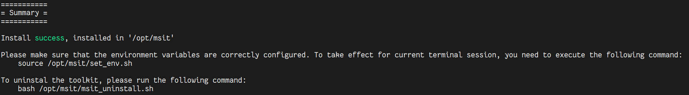

# **MindStudio Inference Tools Installation Guide**

## Installation Description

MindStudio Inference Tools (msIT) provides capabilities commonly used in the inference development of both large language models and traditional models, including model compression, debugging, and tuning. It supports performance tuning in inference serving scenarios, helping users achieve optimal inference performance. This document describes how to install msIT.

## Preparing for Installation

> [!Note]Note
> Installing msIT as the `root` user may pose privilege escalation risks. You are advised to install it as a non-root user.

**Obtaining the Installation Package**

1. **Access the OBS artifact repository.**
    * Access the OpenLibing (OBS artifact repository).
    * Find and click the **"ascend-package"** directory.
    * Go to the directory and click the **"msit"** subdirectory.

2. **Download the installation package of the corresponding architecture.**
    The msit installation package is available in two CPU architectures. Download the installation package based on the architecture of your server.
    * **x86_64**:
        If you use a server based on Intel or AMD processors, download this installation package. [Click](https://ascend-package.obs.cn-north-4.myhuaweicloud.com/msit/Ascend-mindstudio-inference-toolkit_linux-x86_64.run) to download the package.
    * **AArch64:**
        If you use a server based on an Arm processor such as Kunpeng processors, download this installation package. [Click](https://ascend-package.obs.cn-north-4.myhuaweicloud.com/msit/Ascend-mindstudio-inference-toolkit_linux-aarch64.run) to download the package.

3. **(Optional) Download the installation package using `wget` on the terminal.**
    You can also run the `wget` command on the server terminal to download the installation package. Replace the following link with the link of the required architecture:

    ```bash
    # Download the x86_64 installation package.
    wget https://ascend-package.obs.cn-north-4.myhuaweicloud.com/msit/Ascend-mindstudio-inference-toolkit_linux-x86_64.run

    # Download the AArch64 installation package.
    wget https://ascend-package.obs.cn-north-4.myhuaweicloud.com/msit/Ascend-mindstudio-inference-toolkit_linux-aarch64.run
    ```

4. **Save the software package to the local host.**
    After any of the preceding operations is performed, the corresponding `.run` installation file is downloaded to the local host or the target server directory.

**(Optional) Installing CANN**

The following components can only run when the CANN ecosystem is installed. To use the following tools, you need to install CANN before installing msIT:

- [**msProf (MindStudio Profiler)**](https://gitcode.com/Ascend/msprof)<br>
    **Data collection tool**: builds basic performance tuning capabilities for all Ascend scenarios, and collects CANN and NPU performance data to improve the tuning efficiency.

- [**msServiceProfiler (MindStudio Service Profiler)**](https://gitcode.com/Ascend/msserviceprofiler)<br>
    **Service profiler**: It is an Ascend-compatible profiler. It supports request scheduling and model execution visualization, improving service performance analysis efficiency.

- [**msMemScope (MindStudio MemScope)**](https://gitcode.com/Ascend/msmemscope)<br>
    **Memory tool**: It is a dedicated tool for Ascend memory debugging and tuning. It provides multi-dimensional memory data collection, automatic diagnosis, and tuning analysis for the entire network.

> [!WARNING]Warning
> If both CANN and msIT are installed, source CANN `set_env.sh` to use CANN components, or source CANN `set_env.sh`
> and then source msIT `set_env.sh` to use the msIT components. If you only source the msIT `set_env.sh` without sourcing CANN `set_env.sh` first, the msIT components will fail because CANN dependencies cannot be found.

**(Optional) Changing the PyPI Source**

During msIT installation, dependencies may be downloaded and installed using PyPI source. You can run the following commands to change the PyPI source: The following example uses the Huawei Cloud source. You can replace it with other sources.

```sh
pip3 config set global.index-url https://repo.huaweicloud.com/repository/pypi/simple/
pip3 config set global.trusted-host repo.huaweicloud.com
```

## Installation Procedure

### Software Package Installation

1. Before installation, grant the execute permission to the .run package.

    ```shell
    chmod +x Ascend-mindstudio-inference-toolkit_linux-*.run
    ```

2. Perform the installation.

    ```shell
    ./Ascend-mindstudio-inference-toolkit_linux-*.run --install
    ```

> [!NOTE]Note
> For the `root` user, msIT is installed in the `/usr/local/Ascend` directory by default. For the common user, it is installed in the `${HOME}/Ascend` directory by default.<br>
> To install the tool to a specified path, add `--install-path`. For example, the following command installs it to the `/path/to/install` directory:
>
> ```shell
> ./Ascend-mindstudio-inference-toolkit_linux-*.run --install --install-path=/path/to/install
> ```
>
> [!WARNING]Warning
> To install the tool to a specified path, add `--install-path`.<br>
>
> 1. Use `--install-path=/path/to/install` rather than `--install-path /path/to/install`, where the equal sign `=` must be contained.
> 2. The specified installation path must be an absolute path. If a relative path is entered, an installation error is reported.

## Post-installation Configuration

After successful installation, the tool displays a success message. To ensure that the tool runs properly, you need to set up the environment variables. As shown in the following figure, the environment variables are set by running `source /opt/msit/set_env.sh`.



## Upgrade

To replace the installed msit package with the .run package, run the following command:

```sh
./Ascend-mindstudio-inference-toolkit_linux-*.run --upgrade
```

> [!NOTE]Note
> For the `root` user, the default upgrade path is `/usr/local/Ascend`. For the non-root user, the default upgrade path is `${HOME}/Ascend`.<br>
> To specify an upgrade path, add `--install-path`. The usage is the same as that during installation.

## Uninstallation

After successful installation, the `msit_uninstall.sh` script is generated in the installation directory. Run this script to uninstall the tool.  

```sh
bash /usr/local/Ascend/msit/msit_uninstall.sh
```
