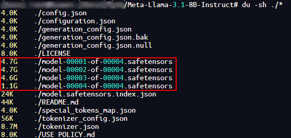

# **Quick Start**

## Overview

MindStudio Inference Tools (msIT) is a one-stop inference development tool dedicated to accelerating model problem locating and improving model inference performance.

This document uses the Llama-3.1-8B-Instruct model as an example to describe how to use LLM inference tools for model quantization, inference data dump, automatic precision comparison, and performance tuning.

**Instructions**

The following table describes the functions of each tool during LLM inference.

| Tool| Description|
|-----------------------|-----------------------|
| Model quantization tool: msModelSlim| It provides model compression capability. It reduces model memory footprint and computational requirements by lowering the numerical precision of model weights and activations. It typically converts high-bit floating-point numbers to low-bit fixed-point numbers, directly reducing the size of model weights. This model quantization tool takes a working model and data as input, and outputs usable quantized weights and quantization factors.|
| Data dump tool: msit llm dump| It can dump intermediate data generated during acceleration library model inference. The dumped data is used for subsequent precision comparison.|
| Precision comparison tool: msit llm compare| It provides the one-click precision comparison function, enabling rapid whole-network precision comparison in inference scenarios.|
| Performance profiling tool| It collects and analyzes key performance metrics at each execution stage of AI tasks running on Ascend AI Processors.|
| MindStudio Insight | It visualizes profile data collected by the performance profiling tool. It can quickly locate hardware and software performance bottlenecks to improve AI task performance analysis efficiency.|

**Environment Preparation:**

- Set up the development environment. For details, see "Installing MindIE > [Method 1: Image Deployment](https://www.hiascend.com/document/detail/en/mindie/230/envpre/instg/mindie_instg_0001.html) in the *MindIE Installation Guide*.

- Install the msit tool package. For details, see [Installing msit](https://gitcode.com/Ascend/msit/tree/master/msit/docs/install). Source code installation is recommended.

- Install the msModelSlim software. For details, see [msModelSlim Installation Guide](https://gitcode.com/Ascend/msmodelslim/blob/master/docs/en/getting_started/install_guide.md).

- Install the large language model debug tool. For details, see [Large Language Model Debug Tool](https://gitcode.com/Ascend/msit/tree/master/msit/docs/llm).

- Install the matching CANN Toolkit and ops operator packages, and configure CANN environment variables. For details, see the *CANN Installation Guide*.

- Install MindStudio Insight. For details, see [MindStudio Insight Installation Guide](https://gitcode.com/Ascend/msinsight/blob/master/docs/en/user_guide/mindstudio_insight_install_guide.md).

## Model Inference

### Model Quantization

1. Download the Llama-3.1-8B-Instruct weight and model files to your local machine, as shown in the following figure. To download the files, click the [link] (<https://huggingface.co/meta-llama/Llama-3.1-8B-Instruct>).<a id="1"></a>

    

2. Run the following command to navigate to the `Llama` directory:

    ```bash
    cd ${HOME}/msmodelslim/example/Llama
    ```

    *HOME* indicates the custom path for installing msmodelslim.

3. Execute the quantization script to generate quantized weight files and save them to a custom storage path. The following example command is the `w8a16` quantization command.

    ```bash
    python3 quant_llama.py --model_path ${model_path} --save_directory ${save_directory} --device_type npu --w_bit 8 --a_bit 16
    ```
 
    `model_path` indicates the path for saving the downloaded model file, and `save_directory` indicates the path for saving the generated quantized weight files. For quantization examples of other model files, see [Llama Quantization Examples](https://gitcode.com/Ascend/msmodelslim/blob/master/example/Llama/README.md#llama-%E9%87%8F%E5%8C%96%E8%AF%B4%E6%98%8E).

    > [!NOTE]Note 
    > If the quantized weight files need to be deployed on MindIE 2.1.RC1 or earlier versions, add the `--mindie_format` parameter when running the quantization command:
    `python3 quant_llama.py --model_path ${model_path} --save_directory ${save_directory} --device_type npu --w_bit 8 --a_bit 16 --mindie_format`
    
4. After quantization is complete, the `safetensors` file is compressed from 15.1 GB to 8.5 GB, as shown in the following figure.

    

5. The generated `w8a16` quantized weight files are as follows:

    ```tex
    ├── config.json                          # Configuration file
    ├── generation_config.json               # Configuration file
    ├── quant_model_description.json         # Weight description file after w8a16 quantization
    ├── quant_model_weight_w8a16.safetensors # Weight file after w8a16 quantization
    ├── tokenizer.json                       # Tokenizer of the model file
    ├── tokenizer_config.json                # Tokenizer configuration file of the model file
    ```

### Precision Debugging

**Prerequisites**

- Model quantization has been completed as described in [Model Quantization](#model-quantization).
- A floating-point model has been prepared as described in [1](#1) in section "Model Quantization".

**Dumping the quantized model**

1. Run the following command to check whether the quantized model can be used for inference:

    ```bash
    bash ${ATB_SPEED_HOME_PATH}/examples/models/llama3/run_pa.sh ${save_directory} ${max_output_length}
    ```

    The parameters are described as follows:

    - `ATB_SPEED_HOME_PATH`: The default path is `/usr/local/Ascend/atb-models`, which is configured when sourcing the `set_env.sh` script in the model repository.
    - `max_output_length`: indicates the maximum number of output tokens in the conversation test.

    If the command output contains the following information, the quantized model can be used for inference:

    ```tex
    Question[0]: What's deep learning?
    Answer[0]:  Deep learning is a subset of machine learning that uses artificial neural networks to analyze data. It's called
    Generate[0] token num: (0, 20)
    ```

2. Run the following command to dump the quantized model and save the result to a user-specified output path. The following table describes the parameters in the command. The following uses the second token as an example. For more parameter information, see [Acceleration Library Model Data Dump](https://gitcode.com/Ascend/msit/blob/master/msit/docs/llm/%E5%B7%A5%E5%85%B7-DUMP%E5%8A%A0%E9%80%9F%E5%BA%93%E6%95%B0%E6%8D%AE%E4%BD%BF%E7%94%A8%E8%AF%B4%E6%98%8E.md).

    ```bash
    msit llm dump --exec "bash ${ATB_SPEED_HOME_PATH}/examples/models/llama3/run_pa.sh ${save_directory} ${max_output_length}" --type model tensor -er 2,2 -o ${quant_dump_path}
    ```

    | Parameter| Description| Example|
    |------------|------------------|------------|
    | --exec | Specifies the command to execute the program containing ATB.<br> Redirection characters are not supported. To redirect the output, you are advised to write the command to the shell script and then start the shell script.| `--exec "bash run.sh patches/models"`|
    |--type |Specifies the dump type. The default value is `['tensor', 'model']`.<br> The options are as follows: <br> `-model`: indicates model topology information (by default). When dump type is `model`, layer information is also dumped.<br> `-layer`: indicates topology information in the operation dimension.<br>`-tensor`: indicates tensor data (by default).|`--type layer tensor`|
    |-er, --execute-range|Specifies the token number range to dump. The interval is inclusive on both ends. Multiple interval sequences are supported. Default is the 0th token.<br>Ensure that the total length of multiple intervals does not exceed 500 characters.|`-er 2,2`<br> `-er 3,5,7,7`: indicates the range [3,5] and [7,7], that is, the 3rd, 4th, 5th, and 7th tokens.|
    |-o, --output|Specifies the output directory for dumped data. The default value is `./`.|`-o /home/projects/output`|

3. After the quantized model is dumped, the data dump directory structure is as follows:

    ```tex
    ├── {quant_dump_path}/              # Data storage path  
    │    └── msit_dump_{timestamp}/     # Data dump timestamp directory
        │    ├── layer/                 # Network structure subdirectory
        │    ├── model/                 # Model information directory
        │    ├── tensors/               # Tensor subdirectory
    ```

**Dumping the floating-point model**

1. Run the following command to check whether the floating-point model can be used for inference:

    ```bash
    bash ${ATB_SPEED_HOME_PATH}/examples/models/llama3/run_pa.sh --model_path ${model_path} ${max_output_length}
    ```

    If the command output contains the following information, the floating-point model can be used for inference:

    ```tex
    Question[0]: What's deep learning?
    Answer[0]:  Deep learning is a subset of machine learning that uses artificial neural networks to analyze data. It's called
    Generate[0] token num: (0, 20)
    ```

2. Dump the floating-point model and save the result to a user-specified output path. The following uses the second token as an example.

    ```bash
    msit llm dump --exec "bash ${ATB_SPEED_HOME_PATH}/examples/models/llama3/run_pa.sh --model_path ${model_path} ${max_output_length}" --type model tensor -er 2,2 -o ${float_dump_path}
    ```

3. After the floating-point model is dumped, the `msit_dump_*{timestamp}*` folder is generated in the `float_dump` folder. The data dump directory structure is as follows:

    ```tex
    ├── {float_dump_path}/              # Data storage path  
    │    └── msit_dump_{timestamp}/     # Data dump timestamp directory
        │    ├── layer/                 # Network structure subdirectory
        │    ├── model/                 # Model information directory
        │    ├── tensors/               # Tensor subdirectory
    ```

**Comparing precision**

1. Run the following command to perform a precision comparison between the dumped data from the quantized model and the floating-point model. The following table describes the parameters in the command.

    ```bash
    msit llm compare -gp ${float_dump_path}/msit_dump_{timestamp}/tensors/{device_id}_{process_id}/2/ -mp ${quant_dump_path}/msit_dump_{timestamp}/tensors/{device_id}_{process_id}/2/ -o ${compare_result_dir}
    ```

    |Parameter|Description|
    |--------|-----------------|
    |-gp|Specifies the golden data path, that is, the directory containing the data dumped from the floating-point model.|
    |-mp|Specifies the path to the data to compare against, that is, the directory containing the data dumped from the quantized model.|
    |-o|Specifies the path for saving comparison results.|

2. The precision comparison output is as follows. For details about the parameters in the comparison result file, see [Precision Comparison Result Parameters](https://gitcode.com/Ascend/msit/blob/master/msit/docs/llm/%E7%B2%BE%E5%BA%A6%E6%AF%94%E5%AF%B9%E7%BB%93%E6%9E%9C%E5%8F%82%E6%95%B0%E8%AF%B4%E6%98%8E.md).

    ```tex
    msit_llm_logger - INFO - golden_layer_type: Prefill_layer
    msit_llm_logger - INFO - my_layer_type: Prefill_layer
    msit_llm_logger - INFO - golden_layer_type: Decoder_layer
    msit_llm_logger - INFO - my_layer_type: Decoder_layer
    msit_llm_logger - INFO - Saved comparing results: ./msit_cmp_report_{timestamp}.csv
    ```

### Performance Tuning

**Prerequisites**

Before using the profiling tools, read about the restrictions in [Before You Start](https://www.hiascend.com/document/detail/zh/mindstudio/830/T&ITools/Profiling/atlasprofiling_16_0002.html) in the *Profiling Tools User Guide*.

**Profile Data Collection**

The msProf command line tool of the profiling tool collects and parses profile data such as AI task profile data and system data of Ascend AI processors.

1. Log in to the environment where the CANN-Toolkit is located and navigate to the CANN software installation directory under `/cann/tools/profiler/bin`.

2. Run the following command to collect profile data. The following describes how to collect profile data from a floating-point model.

    ```shell
    msprof --output=${output_dir} bash ${ATB_SPEED_HOME_PATH}/examples/models/llama3/run_pa.sh --model_path ${model_path} ${max_output_length}
    ```

    `--output` indicates the path for storing the collected data. `max_output_length` indicates the maximum number of output tokens in the conversation test.

3. Verify that the command output contains the following information, which indicates that the collection is completed.

    ```tex
    [INFO] Start export data in PROF_000001_20241118061102981_MORBFBJDEPNJEQPA.
    [INFO] Export all data in PROF_000001_20241118061102981_MORBFBJDEPNJEQPA done.
    [INFO] Start query data in PROF_000001_20241118061102981_MORBFBJDEPNJEQPA.
    Job Info Device ID Dir Name Collection Time            Model ID Iteration Number Top Time Iteration Rank ID 

    NA                host     2024-11-18 06:11:02.985433 N/A      N/A              N/A                1       

    NA       1         device_1 2024-11-18 06:11:07.222675 N/A      N/A              N/A                1 

    [INFO] Query all data in PROF_000001_20241118061102981_MORBFBJDEPNJEQPA done.   
    [INFO] Profiling finished.
    [INFO] Process profiling data complete. Data is saved in {output_dir}/PROF_000001_20241118061102981_MORBFBJDEPNJEQPA
    ```

4. After the collection is complete, the `PROF_000001_20241118061102981_MORBFBJDEPNJEQPA` directory is generated under the path specified by `--output`, storing the collected data.
The `mindstudio_profiler_output` directory under the `PROF_000001_20241118061102981_MORBFBJDEPNJEQPA` directory stores the parsed profile data. The file structure is as follows:<a id="4"></a>

    ```tex
    ├── host   # Save the original data (no user intervention required).
    │    └── data
    ├── device_{id}   # Save the original data (no user intervention required).
    │    └── data
    ├── mindstudio_profiler_log   # Collection logs
    │    └── log
    └── mindstudio_profiler_output
        ├── msprof_20241118061314.json        # Summary of timeline data
        ├── op_summary_20241118061317.csv     # AI Core and AICPU operator data
        ├── task_time_20241118061317.csv # Task scheduling information of Task Scheduler
        ├── op_statistic_20241118061317.csv   # AI Core and AICPU operator call count and time statistics
        ├── api_statistic_20241118061317.csv  # CANN layer API execution time statistics
        └── README.txt
    ```

**Profile Data Analysis**

You can use MindStudio Insight to visualize the collected profile data, making it easier to identify performance bottlenecks.

1. Open MindStudio Insight.

2. Copy the profile data collected in [4](#4) to your local machine.

3. Click **Import Data** in the upper left corner of the MindStudio Insight page. In the pop-up dialog box, select the profile data file or directory and click **Confirm**, as shown in the following figure.

    

4. Visualize the profile data using MindStudio Insight, as shown in the following figure.

    

5. Analyze the profile data.

    After visualizing the profile data using MindStudio Insight, you can analyze performance bottlenecks easily. For detailed analysis methods, see [MindStudio Insight User Guide](https://www.hiascend.com/document/detail/zh/mindstudio/830/GUI_baseddevelopmenttool/msascendinsightug/Insight_userguide_0002.html).

### Tuning in Serving Scenarios

Performance tuning for serving frameworks often feels like a "black box," making issues difficult to locate (for example, slower responses as requests increase, performance differences in different devices).
msServiceProfiler provides end-to-end performance profiling. It clearly displays the performance of framework scheduling and model inference, helping users quickly locate performance bottlenecks and effectively improve performance.

**Prerequisites** 

- Before using the profiling tools, read about the restrictions in [Before You Start](https://www.hiascend.com/document/detail/zh/mindstudio/830/T&ITools/Profiling/atlasprofiling_16_0002.html) " in the *Profiling Tools User Guide*.

- Ensure that MindIE Motor can run properly.

**Procedure**

1. Configure environment variables. <a id="tuning-in-serving-scenarios-1"></a> 
    To enable msServiceProfiler's profiling capability, set the environment variable `SERVICE_PROF_CONFIG_PATH` before MindIE Motor service deployment. If the environment variable is misspelled or not set before deploying the MindIE Motor service, the msServiceProfiler collection capability cannot be enabled.
    
    The following uses `ms_service_profiler_config.json` as an example to describe how to set environment variables.

    ```shell
    export SERVICE_PROF_CONFIG_PATH="./ms_service_profiler_config.json"
    ```

    The value of `SERVICE_PROF_CONFIG_PATH` must point to the JSON file name. The JSON file is the configuration file for controlling profile data collection. For example, it specifies the path for storing profile metadata and enables or disables operator collection. For details about the fields, see [3](#tuning-in-serving-scenarios-3). If no configuration file exists at the specified path, the tool automatically generates a default configuration (with the profiling feature disabled by default).

    > [!CAUTION]<br>
    > In multi-node deployments, it is advised not to place the configuration file or its specified data storage path in a shared directory (such as a network shared location). Because data writing may involve additional network or buffering steps rather than direct disk writing, such configurations may lead to unexpected system behavior or results in certain situations.

2. Run the MindIE Motor service.

    If the environment variables are correctly configured, the tool outputs the following logs starting with [msservice_profiler] before the service deployment is complete, indicating that msServiceProfiler has been started:

    ```tex
    [msservice_profiler] [PID:225] [INFO] [ParseEnable:179] profile enable_: false
    [msservice_profiler] [PID:225] [INFO] [ParseAclTaskTime:264] profile enableAclTaskTime_: false
    [msservice_profiler] [PID:225] [INFO] [ParseAclTaskTime:265] profile msptiEnable_: false
    [msservice_profiler] [PID:225] [INFO] [LogDomainInfo:357] profile enableDomainFilter_: false
    ```

    If the configuration file specified by `SERVICE_PROF_CONFIG_PATH` does not exist, the tool outputs logs indicating automatic creation. Using the configuration in step [1](#tuning-in-serving-scenarios-1) as an example, the tool outputs the following logs:

    ```tex
    [msservice_profiler] [PID:225] [INFO] [SaveConfigToJsonFile:588] Successfully saved profiler configuration to: ./ms_service_profiler_config.json
    ```

3. Collect data. <a id="tuning-in-serving-scenarios-3"></a>

    After the MindIE Motor service is successfully deployed, you can precisely control collection behavior by modifying fields in the configuration file.

    ```shell
    {
        "enable": 1,
        "prof_dir": "${PATH}/prof_dir/",
        "acl_task_time": 0
        ...              # Only the three fields are shown as an example.
        }
    ```

    Table 1 Parameters 

    |Parameter|Description|Required (Yes/No)|
    |-----|-----|-----|
    |enable|Globally enables or disables profile data collection. The options are as follows:<br> - `0`: disabled.<br> - `1`: enabled.<br> If this parameter is set to `0`, no data collection occurs even if other parameters enable their corresponding features. If only this parameter is set to `1`, only serving profile data is collected.|Yes|
    |prof_dir|Path for storing the collected profile data. The default value is `${HOME}/.ms_server_profiler`.<br> This path stores the original profile data. Subsequent parsing steps are required to obtain visualizable profile data files for analysis.<br> If `prof_dir` is modified when `enable` is `0`, the change takes effect when `enable` is later changed to `1`. If `prof_dir` is modified when `enable` is `1`, the change does not take effect.|No|
    |acl_task_time|Enables or disables profiling for operator delivery time and execution time. The options are as follows:<br> - `0`: disabled. Default value. Setting this parameter to `0` or any other invalid value disables this feature.<br> - `1`: enabled.<br> Enabling this function introduces performance overhead, which may cause inaccurate profile data. For further detailed analysis, you are advised to enable this function only when model execution is abnormal.<br> Operator collection generates large amounts of data. Generally, it is advised to collect data for 3 to 5 seconds. Longer collection time consumes additional disk space and increases parsing time, prolonging performance issue location.<br> The default operator collection level is L0. To enable other operator collection levels, see [Service Profiler](https://www.hiascend.com/document/detail/zh/canncommercial/83RC1/devaids/Profiling/mindieprofiling_0001.html) for more parameter information.|No|
    
    Generally, if `enable` is set to `1` continuously, the tool collects data from the moment the MindIE Motor inference service receives a request until the request ends. The size of the directory under `prof_dir` will continue to grow. Therefore, it is advised to collect data only during key time periods.

    Whenever the `enable` field changes, the tool outputs corresponding logs to indicate the change.

    ```tex
    [msservice_profiler] [PID:3259] [INFO] [DynamicControl:407] Profiler Enabled Successfully!
    ```

    ```tex
    [msservice_profiler] [PID:3057] [INFO] [DynamicControl:411] Profiler Disabled Successfully!
    ```

    Whenever `enable` is changed from `0` to `1`, all fields in the configuration file are reloaded by the tool, enabling dynamic updates.

4. Parse data.

    1. Install environment dependencies.

        ```shell
        python >= 3.10
        pandas >= 2.2
        numpy >= 1.24.3
        psutil >= 5.9.5
        ```

    2. Run the parsing command.

        ```shell
        python3 -m ms_service_profiler.parse --input-path=${PATH}/prof_dir
        ```

        --`input-path` specifies the path set by `prof_dir` in step [3](#tuning-in-serving-scenarios-1). After parsing, parsed profile data files are generated in the directory where the command is executed.

5. Tuning Analysis

    The parsed profile data includes `db`, `csv`, and `json` formats. You can quickly analyze from different dimensions such as requests and scheduling using CSV files, or import `db` or `json` files into MindStudio Insight for visualized analysis. For detailed operations, see [MindStudio Insight Serving Tuning](https://www.hiascend.com/document/detail/zh/mindstudio/830/GUI_baseddevelopmenttool/msascendinsightug/Insight_userguide_0112.html).

## Advanced Development

To explore more advanced features of the LLM inference tools, see the respective tool documentation:

- msModelSlim: See [msModelSlim](https://gitcode.com/Ascend/msmodelslim) for more information.

- For details about the Large Language Model Debug Tool, see [Large Language Model Debug Tool](https://gitcode.com/Ascend/msit/blob/master/msit/docs/llm/v1.0/%E5%A4%A7%E6%A8%A1%E5%9E%8B%E6%8E%A8%E7%90%86%E7%B2%BE%E5%BA%A6%E5%B7%A5%E5%85%B7%E8%AF%B4%E6%98%8E%E6%96%87%E6%A1%A3.md).

- For details about profiling tools, see [Profiling Tools User Guide](https://www.hiascend.com/document/detail/zh/mindstudio/830/T&ITools/Profiling/atlasprofiling_16_0001.html).

- For details about MindStudio Insight, see [MindStudio Insight](https://gitcode.com/Ascend/msinsight/blob/14f56b2a945c848c9a92487ce94b2f9dfc90ee02/README.md).
