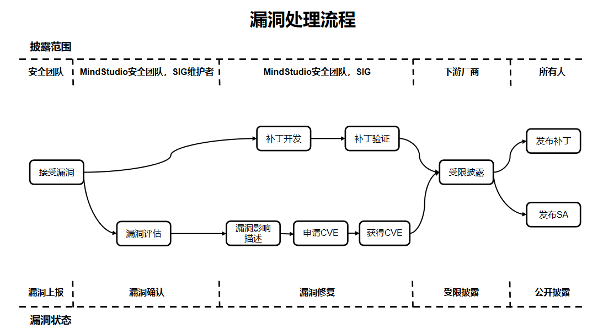

# **MindStudio Vulnerability Mechanism Description**

The MindStudio community places great emphasis on the security of its community versions. A dedicated Vulnerability Management Specialist has been assigned to handle vulnerability-related matters. To build a more secure end-to-end AI toolchain, your participation is also highly welcomed.

## Vulnerability Handling Process

For every security vulnerability, the MindStudio community assigns personnel to track and handle it. The end-to-end vulnerability handling process is illustrated in the figure below.

The following will focus on explaining the processes for vulnerability reporting, vulnerability assessment, and vulnerability disclosure.

## Vulnerability Reporting

You can contact the MindStudio community team by submitting an issue. We will arrange for a dedicated security vulnerability specialist to contact you as soon as possible.
Note: To ensure security, please do not describe specific information involving security and privacy in the issue.

### Report Response

1. The MindStudio community will confirm, analyze, and report the security vulnerability issue within 3 working days, and simultaneously initiate the security handling process.
2. After confirming a security vulnerability issue, the MindStudio security team will distribute and follow up on the issue.
3. During the process of classifying, identifying, fixing, and releasing a security vulnerability issue, we will update the report in a timely manner.

## Vulnerability Assessment

The industry commonly uses the CVSS standard to assess the severity of vulnerabilities. When using CVSS v3.1 for vulnerability assessment, MindStudio needs to set an attack scenario for the vulnerability and conduct the assessment based on the actual impact within that scenario. Severity Level assessment refers to evaluating the ease of exploit, as well as the impact on Confidentiality, Integrity, and Availability after exploitation, and generating a score.

### Vulnerability Assessment Criteria

MindStudio evaluates the severity level of a vulnerability using the following vectors:

- Attack Vector (AV): Represents the "remoteness" of the attack and how this vulnerability can be exploited.
- Attack Complexity (AC): Describes the difficulty of executing the attack and what factors are required for a successful attack.
- User Interaction (UI): Determines whether user participation is required for the attack.
- Privileges Required (PR): Documents the level of user authentication required to successfully carry out the attack.
- Scope (S): Determines whether an attacker can affect components with different privilege levels.
- Confidentiality (C): Measures the degree of impact caused by information disclosure to unauthorized parties.
- Integrity (I): Measures the degree of impact caused by information tampering.
- Availability (A): Measures the degree to which users are affected when needing to access data or services.

### Assessment Principles

- Assess the Severity Level of the vulnerability, not the risk.
- The assessment must be based on an Attack Scenario, and it must be ensured that in this scenario, a successful attack by the attacker can impact the Confidentiality, Integrity, and Availability of the system.
- When a Security Vulnerability has multiple Attack Scenarios, the scenario that causes the greatest impact, i.e., the one with the highest CVSS score, should be used as the basis.
- For vulnerabilities in embedded or invoked libraries, the assessment must be conducted after determining the Attack Scenario based on how the library is used within the product.
- If a security defect cannot be triggered or does not affect CIA (Confidentiality, Integrity, Availability), the CVSS score is 0.

### Assessment Steps

When assessing the severity level of a vulnerability, follow the steps below:

1. Define possible attack scenarios and score based on the attack scenarios.
2. Identify the Vulnerable Component and the Impact Component.

3. Select the values for the base metrics.

   - Exploitability Metrics (Attack Vector, Attack Complexity, Privileges Required, User Interaction, Scope): Select metric values based on the vulnerable component.

   - Impact Metrics (Confidentiality, Integrity, Availability): Reflect either the impact on the vulnerable component or the impact on the affected component, whichever results in the most severe outcome.

### Severity Level Classification

| **Severity Rating** | **CVSS Score** | **Vulnerability Fix Time** |
| ------------------- | -------------- | -------------------------- |
| Critical            | 9.0~10.0       | 7 days                     |
| High                | 7.0~8.9        | 14 days                    |
| Medium              | 4.0~6.9        | 30 days                    |
| Low                 | 0.1~3.9        | 30 days                    |

## Vulnerability Disclosure

After a security vulnerability is fixed, the MindStudio community will release a Security Advisory (SA) and a Security Notice (SN). The Security Advisory includes information such as the technical details of the vulnerability, its type, the reporter, the CVE ID, and the affected and fixed versions.
To protect the security of MindStudio users, the MindStudio community will not publicly disclose, discuss, or confirm security issues in MindStudio products before investigation, fixing, and the release of a Security Advisory.

## Appendix

### MindStudio Security Advisory (SA)

Currently maintained versions have no security vulnerabilities.

### MindStudio Security Notice (SN)

Vulnerability Notes for Third-Party Open Source Components:

| CVE ID | Third-Party Component Name | Affected MindStudio Tool/Plugin Name | Status | Description |
| ------- | ------------ | --------------------------- | ---- | ---- |
|  -       |     -         |        -                     |  -    | -     |
