# MindStudio Kernel Performance Prediction Architecture Design Specifications

## 1. Overview

MindStudio Kernel Performance Prediction (msKPP) allows users to input operator expressions to predict the peak performance of an operator in the algorithm implementation.
msKPP is a performance simulation tool that delivers an order-of-magnitude increase in simulation speed compared to cycle-level simulators. Since performance prediction requires only the execution time of corresponding algorithms based on input and output sizes, and not actual computation, performance results can be provided within seconds.

## 2. msKPP Function List

### 2.1 Modeling

| Type    | Function                              | Description                                                       | Supported System Feature                                      |
| -------- | -------------------------------------- | --------------------------------------------------------------- | ---------------------------------------------------- |
| Service function| Operator transfer channel modeling                      | Models the data transfer channels for each memory unit of the operator.                       | Operator performance modeling -> Operator computing and transferring specification analysis -> Operator transfer instruction modeling|
| Service function| Operator channel conversion modeling                      | Automatically converts the special computing data format to the specific data format of the target storage unit.         | Operator performance modeling -> Operator computing and transferring specification analysis -> Operator transfer instruction modeling|
| Service function| Cache hit rate modeling                       | Models the hit rate of the high-bandwidth transfer channel between the operator GM space and the Vector Core/Cube Core.| Operator performance modeling -> Operator computing and transferring specification analysis -> Operator transfer instruction modeling|
| Service function| Tensor splitting                        | Splits tensors and simulates conversion of a large tensor into smaller tensors.                     | Operator performance modeling -> Operator computing and transferring specification analysis -> Operator transfer instruction modeling|
| Service function| Comparison between theoretical values of pipeline information and values measured by msprof| Compares the modeling data with the theoretical and measured values.                                     | Operator performance modeling -> Operator computing and transferring specification analysis -> Operator transfer pipeline statistics|
| Service function| Instruction statistics                          | Collects statistics on the total amount of transferred data, number of operations, and time consumption across different instruction dimensions.       | Operator performance modeling -> Operator computing and transferring specification analysis -> Operator instruction statistics|
| Service function| Instruction pipeline chart                            | Uses trace to visualize the pipeline arrangement of instructions executed by an operator.                  | Operator performance modeling -> Operator computing and transferring specification analysis -> Operator instruction pipeline    |
| Service function| Instruction Proportion Pie Chart                          | Uses a pie chart to visualize the proportion of time consumed by each instruction executed by an operator.               | Operator performance modeling -> Operator computing and transferring specification analysis -> Operator instruction proportion    |
| DFX      | Debug mode                             | Provides a debugging tool to help users quickly identify the instruction enqueue and dequeue issues in the DSL language, improving the tool's fault identification efficiency.  | Operator performance modeling -> Instruction pipeline -> Instruction scheduling analysis                |
| DFX      | Profile data supplementation                          | Supplements profile data for user-defined instructions.                               | Operator performance modeling -> Instruction pipeline -> Instruction supplementation                    |

### 2.2 Auto Tuning

**The function list is presented in the table format.**

| Type    | Function                                  | Description                                                                                                            | Supported System Feature                       |
| -------- | ------------------------------------------ | -------------------------------------------------------------------------------------------------------------------- | ------------------------------------- |
| Service function| Automatic generation of operator delivery code with Python interface support| Provides Python interfaces to generate C++ code for delivering operators in the template library. The generated code can be imported and extended by Python, allowing developers to deliver operators in Python. | msKPP supports automatic compilation and running of the template library.      |
| Service function| Automatic compilation of the template library                  | Provides Python interfaces to compile operators in the template library using the built-in compile option template or custom compile options entered by developers.                                | msKPP supports automatic compilation and running of the template library.      |
| Service function| Automatic compilation of delivered code                      | Provides Python APIs to compile the automatically generated operator delivery code to implement the operator delivery function.                                                | msKPP supports automatic compilation and running of the template library.      |
| Service function| Kernel metrics support              | Allows the use of the tuning tool's APIs to collect time consumption data of operators delivered by msKPP.                                                     | msKPP supports automatic compilation and running of the template library.      |
| Service function| Operator tool access and collaborative use                | Allows other operator tools to start the msKPP operator running script normally.                                                                         | msKPP supports automatic compilation and running of the template library.      |
| Service function| Automatic replacement of specified tunable parameters                | Supports automatic change of template code and collaborates with the compilation module to instantiate the code; supports inputs in KV format and correctly matches the tunable variables identified in the template library.| msKPP operates in conjunction with the template library to enable automatic change of template parameters.|
| Service function| Lightweight scheduling of msOpGen projects                | Supports code generation, compilation, and execution for the tiling function of msOpGen projects, as well as code generation, compilation, and execution for kernel functions.| msKPP supports automatic compilation and running of msOpGen projects.|

## 3. Implementation Objectives and Key Elements of Software Design

### 3.1 Overall Objectives

1. Easy code extension: Operator performance modeling relies on existing instruction profile data, and there are hundreds of basic Ascend instructions. To allow users to easily extend instructions for modeling operators that utilize them, providing an open and easy-to-use instruction registration feature is a key objective. Additionally, standard tiling functions and kernel function delivery code generation, compilation, and execution capabilities should be provided to facilitate easy extensibility for different operator projects.

2. Data consistency: Operator performance modeling relies on the time-consuming computation of different instructions on different pipelines. A mechanism is required to ensure consistent computation of different transfer and computation instructions, and to ensure data flow normalization during instruction extension.

3. Low scheduling latency: Performance modeling provides an external DSL to simulate operators. During the modeling process, a large number of instructions are computed. Instruction scheduling and computation latency directly impact the ease of operator modeling. A faster scheduling of algorithms is required for cross-language invocation.

### 3.2 Key Element Design

| Key Element| Design Objective                                                                                                                                           |
| -------- | --------------------------------------------------------------------------------------------------------------------------------------------------- |
| Implementation model| Easy code extension: Operator modeling on different chip platforms relies on a large number of basic instructions. During instruction scheduling, autonomous registration of various instruction data must be supported.                                                   |
| Interaction model| Data consistency: Operator performance modeling relies on the time-consuming computation of different instructions on different pipelines. A mechanism is required to ensure consistent computation of different transfer and computation instructions, and to ensure data flow normalization during instruction extension.               |
| Concurrency model| High query concurrency: Performance modeling provides an external DSL to simulate operators. During the modeling process, a large number of instructions are computed. Instruction scheduling and computation latency directly impact the ease of operator modeling. A faster scheduling of algorithms is required for cross-language invocation.|

## 4. Development View

### 4.1 Implementation Model

#### 4.1.1 Performance Modeling

##### 4.1.1.1 Overview

Instruction set breakdown: Breaks down the DSL language into unified instruction sets and scheduling tasks.

Instruction scheduling: Simulates chip behavior to uniformly schedule input instructions, obtaining the scheduling time and start/end time for different instructions.

Data parsing: Generates instruction analysis data in different dimensions based on the instruction scheduling result, such as instruction time consumption statistics and instruction pipeline.

##### 4.1.1.2 Context View

As shown in the following, msKPP provides a series of instruction `a` interfaces for external user A to model operator performance.

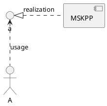

##### 4.1.1.3 Logical View

The main logic of msKPP is as follows: The `INSTR_TASK` module disassembles external instructions and constructs instruction scheduling tasks. The `INSTR_SCHEDULE` instruction scheduling system receives instruction tasks and existing profile
data `PROF_DATA`. After instruction scheduling is complete, and `TRACE` data and `METRICS` profile data are generated separately.

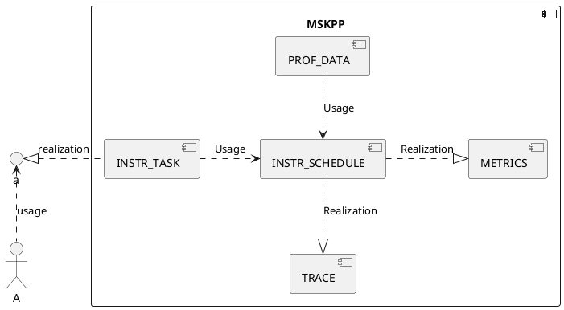

List of software units:

| Software Unit      | Description                      | External Interface             | Internal Interface    | Relationship Description                                          |
| -------------- | -------------------------- | --------------------- | ------------ | -------------------------------------------------- |
| INSTR_TASK     | Instruction task creation module, which is internally implemented.| Tensor, Chip, and Core| RawTask      | Disassembles external input instructions to form a set of instruction tasks.                  |
| INSTR_SCHEDULE | Instruction scheduling module, which is internally implemented.    |                       | add_task and run| Adds disassembled tasks to form a task queue and simulates chip behavior to schedule instructions.|
| PROF_DATA      | Instruction profile data calculation, which is internally implemented.|                       | prof_data    | Loads the calculation results of different instructions based on the instruction type.                |
| TRACE          | Instruction pipeline chart, which is internally implemented.      |                       | Trace        | Generates an instruction pipeline chart based on the instruction scheduling result.                  |
| METRICS        | Instruction profile data, which is internally implemented.    |                       | Metrics      | Generates multiple types of instruction profile data based on the instruction scheduling result.            |

##### 4.1.1.4 Software Implementation Unit Design

According to the software unit list, the main software modules involved in msKPP are the instruction task creation module (`INSTR_TASK`), instruction task scheduling module (`INSTR_SCHEDULE`), instruction profile data
calculation module (`PROF_DATA`), and msKPP profile data parsing modules (`TRACE` and `METRICS`). For details about the instruction task scheduling module, see the algorithm implementation section. The msKPP profile data analysis module provides
a foundational public method for recording and parsing scheduling instructions. Its primary function is to generate a visualized instruction pipeline trace (`trace.json`) along with corresponding statistical charts and tables. This section presents a static block diagram for the instruction task creation module and the instruction task profile data calculation module.

The following figure shows the static structure of the `INSTR_TASK` instruction task creation module. Instruction tasks include `ComputationInstruction` and `MemoryInstruction`. Among them, `ComputationInstruction` is registered using the factory pattern.

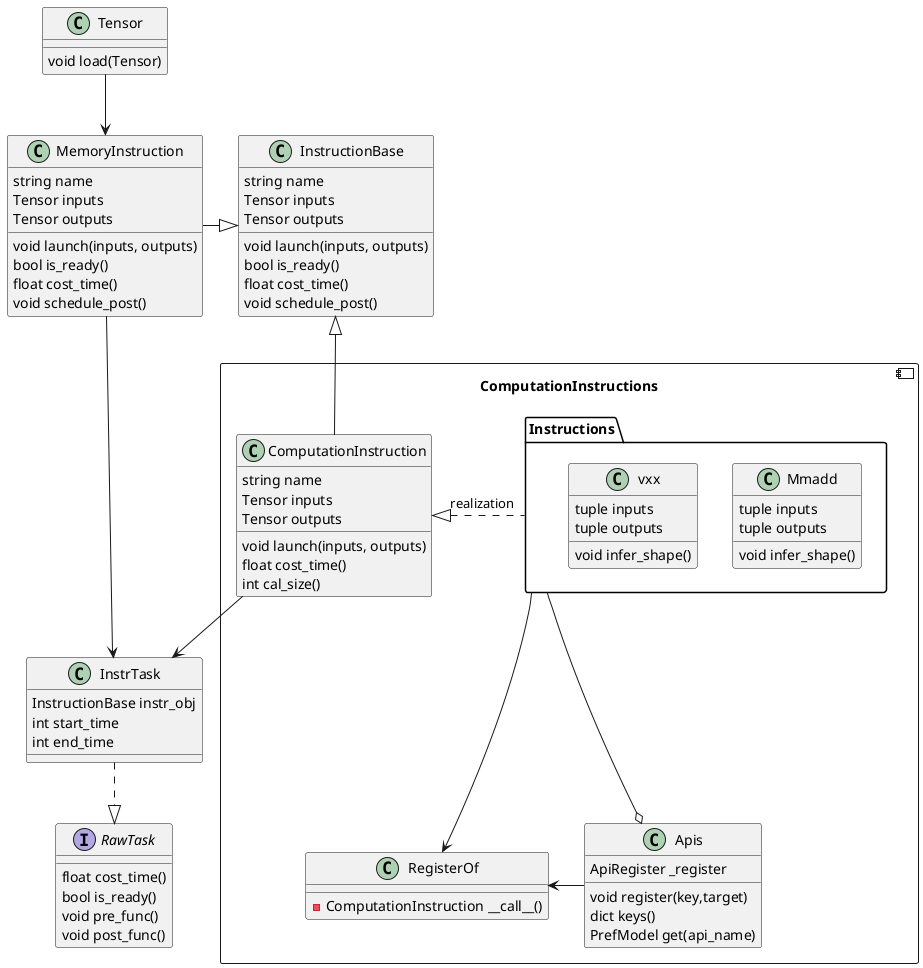

The following shows the static structure of the instruction profile data calculation module `PROF_DATA`. The `Instructions_Data` component provides the data calculation interface for C++.

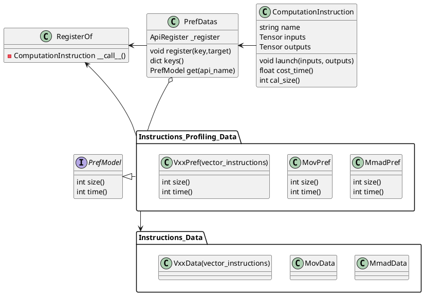

The `Instructions_Data` class diagram in C++ is implemented as follows:

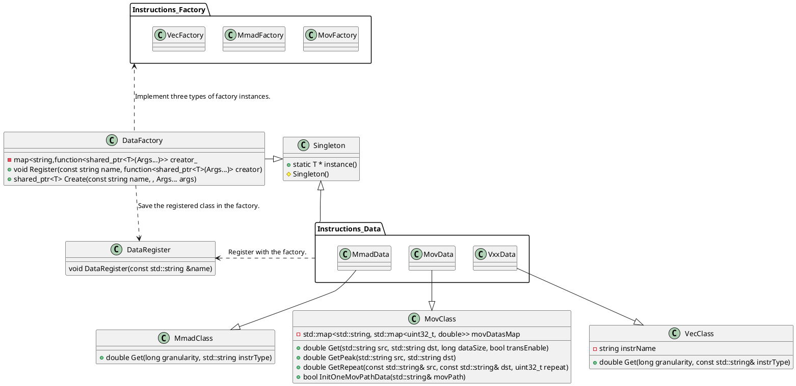

#### 4.1.2 Auto Tuning

##### 4.1.2.1 Overview

The msKPP operator auto tuning module provides functions such as delivery code generation, automatic compilation, real running, and auto tuning for operators in the template library. Developers only need to enter the operator code path and the name of the kernel to be tested. This eliminates the need for manual operator access and adaptation. Instead, the Python interfaces are used to automatically run operators on the board and tune parameters.

Functions:

1. Automatically generates operator delivery code and provides Python interfaces.
2. Automatically generates compilation scripts and completes compilation.
3. Dynamically calls the operator delivery interface and supports access to performance measurement and other operator tools.
4. Supports auto tuning of template library parameters.

Based on the above functions, four software implementation submodules are derived, while an additional submodule is added to receive user input information and generate a configuration object for use by the other submodules.

* Code generation submodule
* Compiler submodule
* Runtime submodule
* Auto tuning submodule
* Test object configuration submodule

Actor role description:

* Operator developer: Uses the APIs provided by msKPP to quickly test and verify template library operators on the board.

##### 4.1.2.2 Context View

The msKPP auto tuning function provides Python APIs for developers. It is deployed in the CANN package and depends on the following components:

1. Runtime: delivers operators.
2. AscendCL: manages device context.
3. Bisheng compiler: compiles code.
4. mspti: collects profile data.

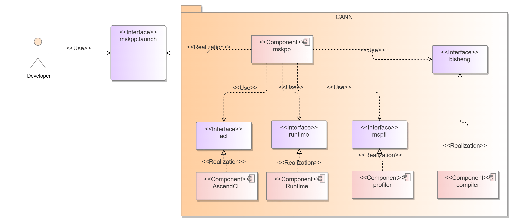

##### 4.1.2.3 Logical View

The submodules provide the following APIs:

1. `code_gen`: generates operator delivery code.
2. `compile`: compiles and delivers the operator code to generate an executable binary operator.
3. `launch`: allows developers to pass operator input parameters and implement stream creation, device management, and operator delivery.
4. `autotune`: automatically searches for the optimal parameter combination in the defined search space.
5. `context`: stores input and output contexts across the above modules, enabling shared use among the modules.

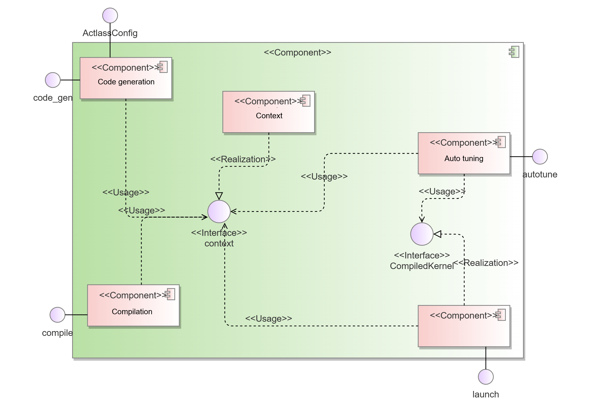

List of software units

| Software Unit| Description                                            | External Interface | Internal Interface| Relationship Description                                                                                |
| -------- | ------------------------------------------------ | --------- | -------- | ---------------------------------------------------------------------------------------- |
| Code generation| Generates operator delivery code.                                | code\_gen | /        | Implements the <code>code_gen</code> interface for external systems and the auto tuning module to update the context module.                             |
| Compiling    | Compiles and delivers the operator code to generate an executable binary.          | compile   | /        | Implements the <code>compile</code> interface for external systems and the auto tuning module to update the context module.                               |
| Running    | Implements stream creation, device management, and operator delivery.                  | launch    | /        | Implements the <code>launch</code> interface for external systems and the auto tuning module to update the context module.                                |
| Auto tuning| Searches for the optimal parameter combination in the search space.              | autotune  | /        | Implements the <code>autotune</code> interface for external use, obtains operator information using the context module, and calls the code generation, compilation, and execution interfaces.|
| Context  | Stores input and output contexts across the above modules, enabling shared use among the modules.| context   | /        | Saves the context information for use by other modules.                                                          |

##### 4.1.2.4 Software Implementation Unit Design

Static structure diagram of the code generation submodule
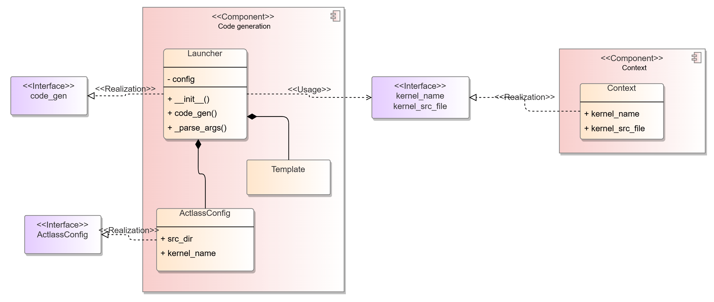

Static structure diagram of the compilation and running modules
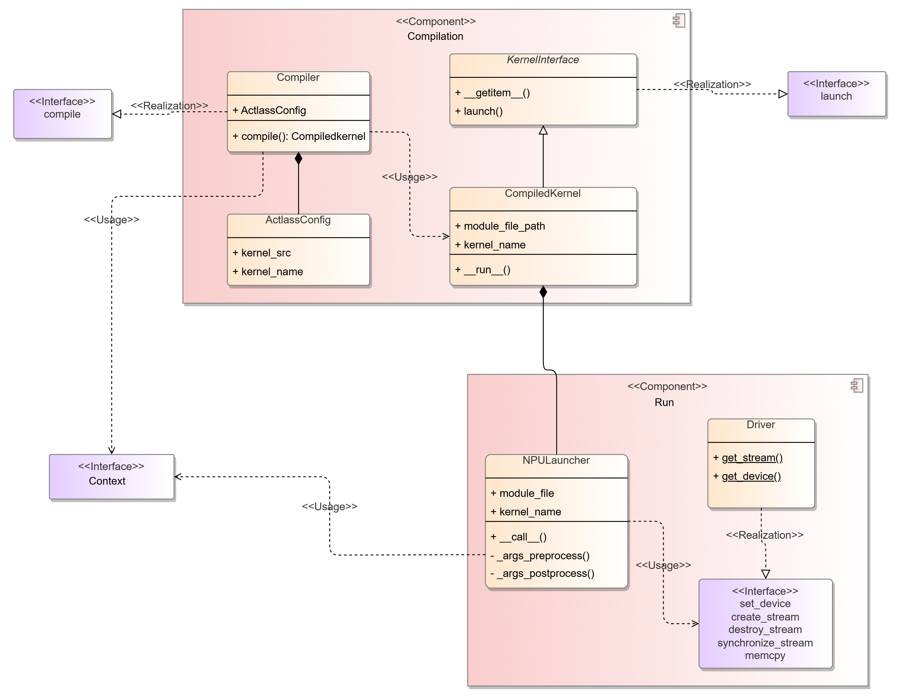

### 4.2 Interfaces

#### 4.2.1 Performance Modeling

##### 4.2.1.1 Overall Design

msKPP provides an easy-to-use DSL to help users quickly implement their operator designs. The DSL is presented as a set of interfaces, primarily divided into basic functional interfaces and specific instruction interfaces.

Basic functional interfaces are used to simulate the chip platform and basic data on which operator computation depends. Specific instruction interfaces facilitate the simulation of specific operator instruction operations, including vector and cube computing instructions.

These interfaces are called inside the msKPP to receive the inputs for operator computation scopes, operator movement instructions, and computation instructions.

##### 4.2.1.2 Design Objectives

1. msKPP should provide external interfaces with a single function, with different interfaces handling separate operator behaviors.

2. To meet users' requirements for modeling different instructions, the interface should be easy to extend.

3. Highly homogeneous interfaces should be highly abstract and easy to reuse.

4. The interface definition should be testable.

##### 4.2.1.3 Design Constraints

In the msKPP-DSL language, which focuses solely on operator performance, the modeling approach virtually constructs tensors that contain data size, and internally contain neither any real data nor any actual memory footprint.

The instruction-tuning interface, as a frequently-called interface, must deliver high reliability and low latency to rapidly compute instruction performance metrics. For security, the KPP interfaces must provide sufficient redundancy to handle varied inputs, executing normally for valid inputs and reporting errors for invalid ones.

##### 4.2.1.4 Technology Selection

N/A

##### 4.2.1.5 C++-based Scheduling and Profile Data Compute Units

KPP provides a Python-based DSL, but in practice, the large number of instructions required for operator behavior simulation makes it difficult to meet performance goals. To accelerate specific scheduling and data computation steps, implement them in C++ and expose the interfaces to Python.

1. Interface description

    Instruction scheduling unit: receives external instruction data and models chip behavior to generate scheduled start and end times for each instruction.

    ```Python
    # Instructions are accumulated and then dispatched with a single unified trigger.
    for i in range("Number of instructions"):
        task_schedule.add_task(task)
    duration = task_schedule.run()
    ```

    Profile data processing unit: Prior to instruction scheduling, the profile data of the current instruction is used as part of the instruction task and provided to the instruction scheduling unit.

    ```Python
    # Here uses the Vadd instruction as an example. The scheduling time of the Vadd instruction is obtained through the profile data calculation module.
    def time(self):
        real_perf = prof_data.VaddData().get(tile_size, instr_type)
        cycles = ceil(dtype_size * tile_size / real_perf)
        return cycles

    def cost_time(self):
        return PrefDatas.get("Vadd")(inputs, outputs).time()
    ```

2. Interface information model

    Instruction scheduling unit:

    ```Python
    self.name = instr_obj.task_name # Scheduling task name
    self.owner = pipe_name          # Name of the pipe to which the instruction belongs
    self.instr_obj = instr_obj      # Scheduling instruction object
    self.start_time = 0             # Start time of the instruction task
    self.end_time = 0               # End time of the instruction task
    ```

3. Interface list

    ```text
    Name: cost_time
    Function: Calculates the instruction scheduling time based on the existing profile data.
    Type/Protocol: Python/C++
    Direction:
    Input: None
    Output: None
    Return: On success, returns the command scheduling time; on failure, returns 0.
    Precautions: None

    Name: size
    Function: Returns the size of the scheduling command.
    Type/Protocol: Python/C++
    Direction:
    Input: None
    Output: None
    Return: On success, returns the command size; on failure, returns 0.
    Precautions: None

    Name: is_ready
    Function: Returns whether the command is ready before scheduling.
    Type/Protocol: Python/C++
    Direction:
    Input: None
    Output: None
    Return: On success, returns the command ready status; on failure, returns true.
    Precautions: None

    Name: post_func
    Function: Performs operations after scheduling a command, including trace recording, profile data collection, and tensor validity transfer.
    Type/Protocol: Python/C++
    Direction:
    Input: None
    Output: None
    Return: On success, the command completes the corresponding operation; on failure, the operation is invalid and message transfer is interrupted.
    Precautions: None

    Name: xxxData (a naming paradigm for interfaces encompassing data transfer, cube compute, and vector compute instructions.)
    Function: Before creating an instruction scheduling task, integrate the total time consumed by the instruction. This API collects existing profile data and returns the calculation result.
    Type/Protocol: C++ API
    Direction:
    Input: For data transfer instructions, the start memory unit, data size, and channel conversion flag need to be specified. For compute instructions, the data scale and data type need to be specified.
    Output: None
    Return: On success, returns the instruction calculation time; on failure, returns an empty value.
    Precautions: None
    ```

#### 4.2.2 Auto Tuning

##### 4.2.2.1 Overall Objectives

msKPP provides basic functions such as code generation, compilation, and execution as a Python library, with auto-tuning built on top of them. The auto tuning interface must be isolated from performance modeling interface due to CANN dependency.

##### 4.2.2.2 Design Objectives

The external interfaces are for developers, organized by functionality, with clearly defined functional scopes and extensible parameters reserved for future expansion.
The interfaces between internal submodules should be as simple as possible.

##### 4.2.2.3 Design Constraints

The input and output relationships between submodules are as follows. The input and output parameters of the interfaces must meet the constraints shown in the figure.

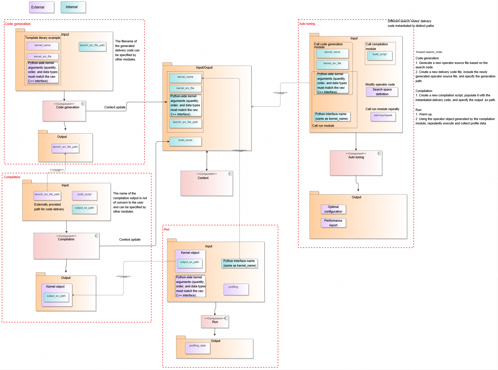

##### 4.2.2.4 Technology Selection

The following figures show the interface design.

Option 1:

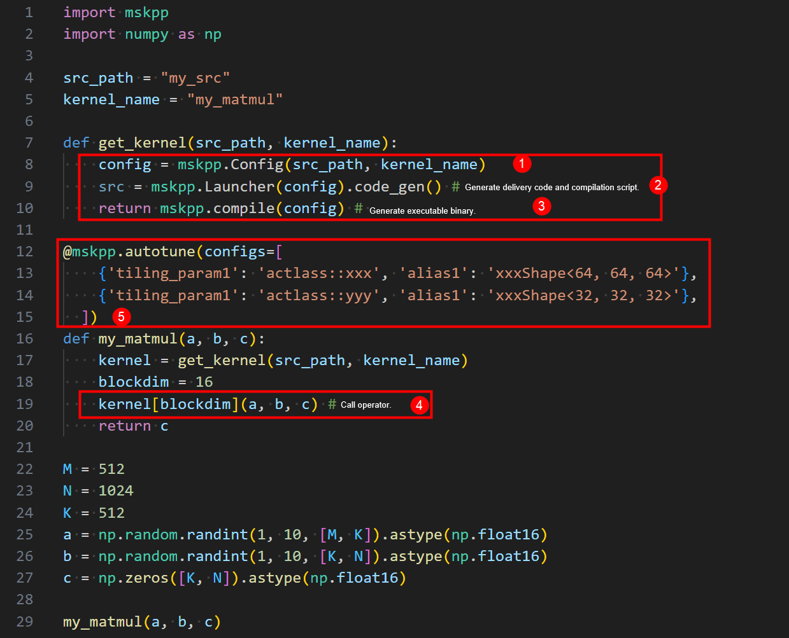

1. Configure kernel information.
2. Generate the kernel delivery code.
3. Compile the kernel delivery code and kernel.
4. Call the kernel.
5. Configure auto tuning.

Option 2:
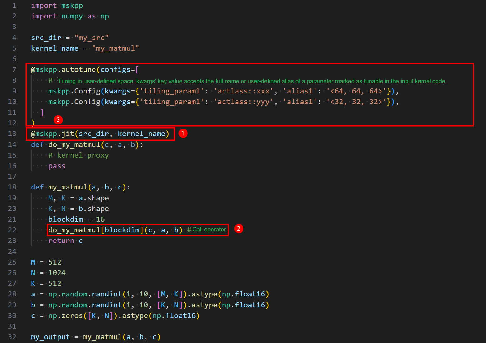

1. Configure kernel information.
2. Call the kernel.
3. Configure auto tuning.

Option 2 exposes fewer interfaces, lacks atomic separation of configuration, compilation, and code generation functions, has a JIT command misaligned with its actual functionality. For future JIT features under consideration, this implementation adopts Option 1 for the interface design.

##### 4.2.2.5 Software Unit - Code Generation Submodule

In the code generation submodule, the externally provided struct object, along with its scenario association, is passed to the Launcher's constructor to construct the code generator for the current scenario. To extend to other potential scenarios, simply define and pass a new structure to the Launcher to construct a code generator object for the target scenario, without changing the code generation interface.

Template library scenario: `KernelInvokeConfig`

```Python
class KernelInvokeConfig:
    """
    A configuration descriptor for a possible kernel developed based on an Act example
    """

    def __init__(self, kernel_src_file, kernel_name):
        pass
```

Tiling call scenario of the custom operator project: `TilingConfig`

```Python
class TilingConfig:
    def __init__(self, op_type: str, inputs: list, outputs: list, lib_path: str = None,
                 inputs_info: list = None, outputs_info: list = None, attr=None, soc_version: str = None):
        pass
```

Kernel call scenario of the custom operator project: `KernelBinaryInvokeConfig`

```Python
class KernelBinaryInvokeConfig:
    def __init__(self, kernel_binary_file: str, kernel_type: str = None, tiling_key: int = None):
        pass
```

---

`code_gen`

Function: Generates kernel delivery code based on the input kernel information of the template library.

Prototype: `gen_file = mskpp.Launcher(config).code_gen()`

Parameter description:

| Parameter  | Data Type| Required (Yes/No)| Description                                                       |
| -------- | -------- | ---- | ----------------------------------------------------------- |
| gen_file | str      | Y    | Path of the kernel delivery code file. The default value is <code>_gen_launch.cpp</code>.|

Return: file path of the generated code.

Example:

```Python
config = mskpp.KernelInvokeConfig(src_path, kernel_name)
gen_file = mskpp.Launcher(config).code_gen()
```

Remarks: related class/structure definition

```Python
class Launcher:

    def __init__(self, config: KernelInvokeConfig):
        """
        a class that generates launch source code for a kernel

        Args:
            config (KernelInvokeConfig): An configuration descriptor for a kernel
        """
        pass

    def code_gen(self, gen_file: str = "_gen_launch.cpp"):
        """
        Generate launch source code (glue code) for a kernel.
        Support the following launch mode: 1. kernel invocation <<<>>>

        Args:
            gen_file (str, optional): Specify the generated launch source code file path for kernel.
                                      Defaults to "_gen_launch.cpp".

        Returns:
            str: The file path of generated launch source file.

        Note:
        """
```

---

`tiling_func`

Function: Inputs the operator tiling function information to generate, compile, and run the code for calling the tiling function.

Prototype:

```python
def tiling_func(op_type: str, inputs: list, outputs: list, lib_path: str = None,
                inputs_info: list = None, outputs_info: list = None, attr=None,
                soc_version: str = None) -> TilingOutput:
```

Parameter description:

| Parameter  | Data Type| Required (Yes/No)| Description                                                       |
| -------- | -------- | ---- | ----------------------------------------------------------- |
| op_type| str      | Y    | Operator name|
| inputs | list      | Y    | List of input tensors of the operator.|
| outputs | str      | Y    | List of output tensors of the operator.|
| inputs_info| str      | N    | Details about the input tensors of the operator.|
| outputs_info| str      | N    | Details about the output tensors of the operator.|
| attr | str      | N   | Operator tiling attributes|
| lib_path | str      | N    | Dynamic library where the operator tiling function is located|
| soc_version | str      | N    | Information of hardware that runs operators|

Return: `TilingOutput`

Example:

```Python
config = mskpp.KernelInvokeConfig(src_path, kernel_name)
gen_file = mskpp.Launcher(config).code_gen()

tiling_output = mskpp.tiling_func(
    op_type="MatmulLeakyreluCustom",
    inputs_info=inputs_info, outputs_info=outputs_info,
    inputs=[input_a, input_b, input_bias], outputs=[output],
    attr=attr, # Optional
    lib_path="./build_out/_CPack_Packages/Linux/External/custom_opp_ubuntu_aarch64.run/packages/vendors/customize/op_impl/ai_core/tbe/op_tiling/liboptiling.so",  # (Optional) Tiling code compilation product
    # soc_version="", # Optional
)
blockdim = tiling_output.blockdim
workspace_size = tiling_output.workspace_size
tiling_data = tiling_output.tiling_data # Returned as a NumPy array.
workspace = np.zeros(workspace_size).astype(np.uint8) # The workspace needs to be allocated by the user.
```

Remarks: related class/structure definition

```Python
class TilingOutput:
    def __init__(self, tiling_output: dict):
        self.blockdim = tiling_output["blockdim"]
        self.workspace_size = tiling_output["workspace_size"]
        self.tiling_data = np.array(tiling_output["tiling_data"], dtype=np.uint8)
        self.tiling_key = tiling_output["tiling_key"]
```

---

`get_kernel_from_binary`

Function: Inputs information such as the operator binary path to generate, compile, and run the code for calling the kernel function.

Prototype:

```python
def get_kernel_from_binary(kernel_binary_file: str, kernel_type: str = None, tiling_key: int = None) -> CompiledKernel:
```

Parameter description:

| Parameter  | Data Type| Required (Yes/No)| Description                                                       |
| -------- | -------- | ---- | ----------------------------------------------------------- |
| kernel_binary_file| str      | Y    | Path of the operator .o file|
| kernel_type| str      | N    | Operator type|
| tiling_key| int      | N    | Operator Tilingkey|

Return: `CompiledKernel`

Example:

```Python
# This function's input arguments must exactly match the kernel function.
def run_kernel(input_a, input_b, input_bias, output, workspace, tiling_data):
    kernel_binary_file = "MatmulLeakyreluCustom_97ef75830e63ebe749e7c029d8d403c5.o"
    kernel = mskpp.get_kernel_from_binary(kernel_binary_file)
    return kernel(input_a, input_b, input_bias, output, workspace, tiling_data, device_id=1)
```

##### 4.2.2.6 Software Unit - Compilation Submodule

`compile`

Function: Compiles the kernel delivery code and returns an executable kernel object.

Prototype: `kernel = compile(build_script, gen_file)`

Parameter description:

| Parameter         | Data Type| Required (Yes/No)| Description                                                              |
| --------------- | -------- | ---- | ------------------------------------------------------------------ |
| build_script    | str      | Y    | Script for compiling the kernel in the template library.             |
| gen_file        | str      | Y    | Path of the kernel delivery code file. Generally, the return value of the `code_gen` API is used.          |
| output_bin_path | str      | N    | Path of the executable file generated after compilation. Default value: `_gen_module.so`            |
| use_cache       | bool     | N    | After this parameter is enabled, no compilation is performed but the file specified by `output_bin_path` is loaded. The default value is `False`.|

Return: `CompiledKernel` object. The kernel can be called in the following way: `kernel[blockdim](arg1, arg2, ...)`.

Example:

```Python
kernel = compile(build_script, gen_file)
kernel[blockdim](arg1, arg2, ...) # Operator calling
```

Remarks: related class/structure definition

````Python
class KernelInterface(Generic[T]):
    """
    Kernel interface class, providing a way to launch function in the form: kernel[blockdim](x, y, z)
    """
    launch: T

    def __getitem__(self, blockdim) -> T:
        return lambda *args, **kwargs: self.launch(blockdim=blockdim, *args, **kwargs)

class CompiledKernel(KernelInterface[T]):
    """
    Object class representing a kernel, provides an interface to launching kernel.
    Support kernel invocation in form of "kernel[blockdim](a, b, c)".
    """
    def __init__(self, output_bin_path, kernel_name):
        self.module_path = output_bin_path
        self.kernel_name = kernel_name
        self.__run__ = Launcher(self.module_path)

    def launch(self, *args, blockdim, **kwargs):
        pass
````

---

`compile_executable`

Function: Compiles the kernel delivery code and returns an executable kernel object.

Prototype: `executable = compile_executable(build_script, src_file)`

Parameter description:

| Parameter         | Data Type| Required (Yes/No)| Description                                                              |
| --------------- | -------- | ---- | ------------------------------------------------------------------ |
| build_script    | str      | Y    | Path of the script file used to compile the application to be tuned.             |
| gen_file        | str      | Y    | Code file path.          |
| output_bin_path | str      | N    | Path of the executable file generated after compilation. The default value is `_gen_executable`.            |
| use_cache       | bool     | N    | After this parameter is enabled, no compilation is performed but the file specified by `output_bin_path` is loaded. The default value is `False`.|
| profiling_cmd       | str     | N    | Reserved. Enter the `msprof op` command.|

Return: executable program object. The type is `CompiledExecutable`. It can be called in the following mode: `executable(arg1, arg2, ...)`, where `arg1`, `arg2`, ... are user-defined input parameters.

Example:

```Python
executable = compile_executable(build_script, src_file)
executable(a, b, c)
```

Remarks: related class/structure definition

````Python
class CompiledExecutable:
       """
       Object class representing an executable file, provides an interface to execute itself in subprocess.
       """
       def __init__(self, _executable_path: str):
           pass

       def __call__(self, *args, **kwargs):
           return self._launch(*args, **kwargs)

       def _launch(self, *args, **kwargs):
           pass
````

---

`compile_tiling`

Function: Compiles the tiling call code and returns an executable tiling function.

Prototype: `tiling_func = compile_tiling(gen_file)`

Parameter description:

| Parameter         | Data Type| Required (Yes/No)| Description                                                              |
| --------------- | -------- | ---- | ------------------------------------------------------------------ |
| gen_file        | str      | Y    | Path of the tiling calling code file. Generally, the return value of the `code_gen` API is used.          |

Return: tiling function.

Example:

```Python
run_tiling_func = compile_tiling(gen_file)
tiling_output = run_tiling_func() # Tiling calling
```

`compile_kernel_binary`

Function: Compiles the tiling call code and returns an executable tiling function.

Prototype: `tiling_func = compile_tiling(gen_file)`

Parameter description:

| Parameter         | Data Type| Required (Yes/No)| Description                                                              |
| --------------- | -------- | ---- | ------------------------------------------------------------------ |
| gen_file        | str      | Y    | Path of the tiling calling code file. Generally, the return value of the `code_gen` API is used.          |

Return: tiling function.

Example:

```Python
run_tiling_func = compile_tiling(gen_file)
tiling_output = run_tiling_func() # Tiling calling
```

##### 4.2.2.7 Software Unit - Auto Tuning Submodule

`autotune`:

Function: Uses the kernel function as the object, traverses `configs` in the search space, repeatedly runs the kernel function to obtain the time consumed by each `configs`, and identifies the optimal parameter set.

Prototype: `def autotune(configs: List[Dict], warmup: int = 300, repeat: int = 1, device_ids=[0])`

Parameter description:

| Parameter    | Data Type  | Required (Yes/No)| Description                                                                                               |
| ---------- | ---------- | ---- | --------------------------------------------------------------------------------------------------- |
| configs    | list[dict] | Y    | Search space definition, in key-value format. During tuning, the value is used to replace the code line corresponding to the key marked with `// tunable` in the kernel code.|
| warmup     | int        | N    | Preheating time before performance collection, in μs. Default value: `300` μs.                                                |
| repeat     | int        | N    | Number of repeat times. The average running duration of multiple repeats is used as the operator duration. Default value: `1`.                                |
| device_ids | list[int]  | N    | Device ID list. Currently, only the single-device mode is supported. If multiple device IDs are entered, only the first one takes effect. Default value: `[0]`.|

Return: None

Remarks:

Example:

```Python
@mskpp.autotune(configs=[
    {'L1TileShape': 'MatmulShape<64, 64, 64>', 'L0Shape': 'MatmulShape<128, 256, 64>'},
    {'L1TileShape': 'MatmulShape<64, 64, 128>', 'L0Shape': 'MatmulShape<128, 256, 64>'},
    {'L1TileShape': 'MatmulShape<64, 128, 128>', 'L0Shape': 'MatmulShape<128, 256, 64>'},
    {'L1TileShape': 'MatmulShape<64, 128, 128>', 'L0Shape': 'MatmulShape<64, 256, 64>'},
    {'L1TileShape': 'MatmulShape<128, 128, 128>', 'L0Shape': 'MatmulShape<128, 256, 64>'},
], warmup=500, repeat=10, device_ids=[0])
def basic_matmul(problem_shape, a, layout_a, b, layout_b, c, layout_c):
    kernel = get_kernel()
    blockdim = 20
    return kernel[blockdim](problem_shape, a, layout_a, b, layout_b, c, layout_c)
```

---

`autotune_v2`:

Function: Uses the operator application as the object, traverses `configs` in the search space, repeatedly runs the complete operator program to obtain the time consumed by each `configs`, and identifies the optimal parameter set.

Prototype: `def autotune_v2(configs: list, warmup_times: int = 5)`

Parameter description:

| Parameter    | Data Type  | Required (Yes/No)| Description                                                                                               |
| ---------- | ---------- | ---- | --------------------------------------------------------------------------------------------------- |
| configs    | list[dict] | Y    | Search space definition, in key-value format. During tuning, the value is used to replace the code line corresponding to the key marked with `// tunable` in the kernel code.|
| warmup_times     | int        | N    | Number of device preheating times before performance collection. Default value: `5`.                                                |

Return: None

Example:

```Python
@mskpp.autotune_v2(configs=[
    {'L1TileShape': 'GemmShape<128, 256, 256>', 'L0TileShape': 'GemmShape<128, 256, 64>'},
    {'L1TileShape': 'GemmShape<256, 128, 256>', 'L0TileShape': 'GemmShape<256, 128, 64>'},
    {'L1TileShape': 'GemmShape<128, 128, 256>', 'L0TileShape': 'GemmShape<128, 128, 64>'},
    {'L1TileShape': 'GemmShape<128, 128, 512>', 'L0TileShape': 'GemmShape<128, 128, 64>'},
    {'L1TileShape': 'GemmShape<64, 256, 128>', 'L0TileShape': 'GemmShape<64, 256, 64>'},
], warmup_times=10)
def run_executable(m, n, k, device_id):
    src_file = "./basic_matmul.cpp"
    build_script = "./jit_build_executable.sh" # executable compile script
    executable = mskpp.compile_executable(build_script=build_script, src_file=src_file, use_cache=False)
    return executable(m, n, k, device_id)
```

### 4.3 Data Model

#### 4.3.1 Performance Modeling

##### 4.3.1.1 Design Objectives

During KPP scheduling, instruction time calculations leverage existing profile data, and the key to module functionality is rapidly returning the computed results for different instruction types to their respective instructions. To address this, two methods are employed.
For the UML class diagram, see the `Instructions_Data` class diagram in section 4.1.4.

##### 4.3.1.2 Design Constraints

1. With msKPP's evolving support for diverse user commands and chip platforms, enabling easy expansion of baseline data is a key design focus.

2. Modeling data relies on real-time computation of existing data, so design should account for increased overall time consumption due to computational overhead.

##### 4.3.1.3 Design Selection

1. Using C++ to implement data computation and retrieval to reduce the overhead from frequent interface calls.

2. The abstract factory pattern is used to abstract data factories for transfer, cube computation, and vector computation based on data type, unifying calculations for similar data types to facilitate large-scale data management and easy addition of new data types.

##### 4.3.1.4 Data Model Design

Data model design

The msKPP data model design consists of two parts: Python-side command data addition and C++-side data computation. The former provides a unified interface for users to easily add custom commands and profile data as needed. While the latter abstracts common calculation methods and factory classes for different data class diagrams, allowing callers to retrieve instruction data through abstract interfaces without concerning themselves with internal computation logic—achieving interface isolation, separation of computation from invocation, and easy maintenance and extensibility by creating instruction data computation instances via the abstract factory interface.
 
In Section 4.1.4, "Instruction Profile Data Calculation Module," users can add a new instruction profile data type by simply inheriting from `PrefModel`, implementing the `size` and `time` methods for the instruction, and registering it with `@RegisterPrefOf()`, enabling real-time size and timing calculations via the registration interface when an instruction task is created.
 
In the 4.1.4 Instructions_Data class diagram, three data computation classes—MmadData, MovData, and VxxData—are implemented according to different instruction types, all inheriting a unified timing calculation interface. Three data computation types
are registered with factory classes to instantiate three respective abstract factories, allowing external callers to retrieve corresponding profile data results simply by specifying the instruction name and passing the appropriate parameters.

### 4.3.2 Auto Tuning

N/A

### 4.4 Algorithm Implementation

#### 4.4.1 Performance Modeling

##### 4.4.1.1 Design Objectives

For an operator composed of instructions scheduled by the TS, msKPP models this process using a discrete event system with zero-wait scheduling, aligning with the "theoretical" concept.
In addition, the specific performance parameters for scheduling each instruction are obtained through profiling.
For scale considerations, while the Ascend chip contains multiple cores, simulating a single core is sufficient to represent the overall results from a parallel design perspective, making per-core scheduling unnecessary.

##### 4.4.1.2 Design Constraints

Instruction time is derived from existing profile data, enabling zero-wait transitions between instructions. For different pipes within a single core, instruction execution parallelism needs to be implemented.

##### 4.4.1.3 Technology Selection

1. To simulate the result of data parallelism, consider multi-thread implementation.
2. Build on existing third-party Python discrete-event libraries.
3. Abstract modeling of instruction scheduling, using priority queues for modeling.
Analyze the mathematical model, problem type, data, algorithm performance, and algorithm application results to select the most appropriate algorithm and document the decision-making basis.
The core of instruction scheduling is to issue ready instructions, stall those not ready, and upon completion, record execution duration and pass on readiness downstream.
The ready states for instructions are categorized as follows: (1) the initial state—where GM-resident tensors acting as the source memory for data transfer and computation default to ready; (2) UB-type instructions—used as intermediate memory
—default to invalid; (3) after scheduling, output tensors within an instruction task must be ready; and (4) for instruction splitting, child tensors inherit the state of the parent tensor.

For case (2), while the existing third-party discrete scheduling library offers simple and understandable logic, its low Python runtime efficiency under large-scale instruction scheduling fails to meet the second-level performance modeling requirements. Therefore, it should be excluded first.  

For case (1), C++ multithreading can quickly implement parallel execution of multi-pipe instructions during scheduling. However, the implementation of C++ multithreading is complex, and merely introducing it to achieve pipe parallelism will increase management costs. Additionally, the blocking and waiting of multiple instructions between threads can also lead to poor scheduling performance.

For case (3), scheduling tasks can be abstractly modelled where the core principle is to prioritize the instruction that should be executed first—within a single pipe, instructions are scheduled in order of task creation, while across different pipes, the instruction with the shortest execution time should be prioritized. For
multi-pipe parallelism, each pipe is isolated by name and maintains its own timeline for instruction recording. When displayed on a unified timeline, instructions from different pipes appear in parallel. The advantages of this solution are simple to implement and fast to deploy, with a short scheduling path for high performance.

##### 4.4.1.4 Algorithm Implementation

The algorithm implementation is described following technology selection:

1. Instruction tasks from the Python are added to task queues that are distinguished by pipe names, until all scheduling instructions are added.
2. The scheduling task is started. The first schedulable task queue is obtained. Active and blocked queues are distinguished prior to this operation.
3. The first task is popped from the active queue for execution. The task sets time range for executing the scheduling instruction and the last update time of the queue, and transparently updates the ready status of the instruction.
4. The active and blocked queues are refreshed, and the next active queue that can be executed is obtained. (If there are multiple active queues, the queue with the shortest execution time of the first task is executed first.)
5. The cycle of task retrieval and status update continues until no active queue exists.

#### 4.4.2 Auto Tuning

N/A

### 4.5 Security Design

#### 4.5.1 Performance Modeling

##### 4.5.1.1 Security Design Objectives

msKPP receives instructions from the external DSL, generates scheduling tasks, and records the instruction execution data and generates deliverables after the scheduling is complete. Therefore, the main risks come from external input and data calculation.
These include interface input validity, input data range, and data computation security.
In implementation, invalid input data should be intercepted and a clear message should be displayed. For valid input values that exceed the input range, a clear message should be displayed to specify the secure input range. Security risks such as data overflow and division by zero should be intercepted.

##### 4.5.1.2 Security Design Context

```text
From the perspective of software implementation, review the threat modeling information generated during the system design, including the valuable assets and exposure surfaces related to this component.
Understand the valuable assets associated with this component and the potential threats, in order to design defense measures against these threats.
Note: This section usually discusses the threat modeling information generated during the system design and performs security analysis from the perspective of software design.
```

##### 4.5.1.3 Identification of High-Risk Modules

###### 4.5.1.3.1 Identification of High-Risk Modules

| Module  | Module Function                                       | Security Analysis                                                                       | Code Directory                                                 | Language| Remarks|
| ---------- | ------------------------------------------------------- | ------------------------------------------------------------------------------------------- | ------------------------------------------------------------- | -------- | ---- |
| INSTR_TASK | This module provides the operation interface for instruction tasks to the scheduling module.   | This module directly receives input parameters from external users. If the module is attacked, the validity of instruction tasks will be affected.           | workload_analysis/mskpp/mskpp/core/tensor.py                  | Python   |      |
| PROF_DATA  | This module provides the operation interface for profile data calculation to the scheduling module.| This module directly calls existing profile data to provide numerical calculation results. If the module is attacked, the validity of instruction time consumption will be affected.| workload_analysis/mskpp/mskpp/csrc/prof_data/data_adapter.cpp | C++      |      |

###### 4.5.1.3.2 Identification of High-Risk APIs

| High-risk API                        | API Description                                                      | Function Analysis                             | Code Directory                                                      | Language| Remarks|
| --------------------------------- | -------------------------------------------------------------- | ----------------------------------------------- | ------------------------------------------------------------------ | -------- | ---- |
| Tensor                            | Creates a tensor object. Pay attention to the validity of the input content.                          | Tensor and tensor constructor (such as `__init__()`/`load()`)| workload_analysis/mskpp/mskpp/core/tensor.py->L14                  | Python   |      |
| MovClass/MmadClass/VecClass Get() | Obtains the profile data of an instruction based on the content of the input instruction. Pay attention to the validity of the input and calculation.| Profile data calculation (such as `LinearInterpolate()`)        | workload_analysis/mskpp/mskpp/csrc/prof_data/data_adapter.cpp->L39 | C++      |      |

##### 4.5.1.4 Code Security Protection

Security hardening for high-risk modules

**1. Error handling**  
Design proper error-handling strategies to prevent software crashes.
Define exception-handling policies for modules based on component context, including programming framework and operating system.

Security hardening for high-risk APIs

**1. Input validation**  
Strictly validate parameters in API requests to ensure data integrity and prevent malicious attacks.
Input validation ensures the API receives only expected, properly formatted data. It mitigates issues caused data corruption, crashes, or unpredictable behaviors. Specific risks prevented include injection attacks and malicious file uploads.

In terms of software design, the following points should be considered:

- Consistency of data types and formats: Ensure that data input meets expectations and prevent type confusion and data format errors.
- Ranges and restrictions of input values: Define input value ranges and restrictions per API requirements. Supplement based on specific interface implementation to reduce potential API abuse.
- Prevention of malicious input: Implement prevention mechanisms against potential malicious input, such as malicious file upload attacks.
- Impact of input validation on performance: Complex validation mechanisms may affect API performance, such as response time. Consider both the input validation and API performance.

**2. Error and Exception Handling**  
A robust error and exception handling mechanism ensures that the API terminates in a controlled manner under exceptional conditions and returns appropriate error information to the user.
Error and exception capture and handling and fault recovery can be implemented in code. The design document should describe the parts that need further explanation beyond the code:

- Decision-making and trade-offs in error and exception handling policies: Explain why a specific error and exception handling policy is chosen, including alternative solutions and trade-offs.
- Error message design: In API design, further explain how to clearly convey error causes to users without disclosing sensitive information.
- Expected API behavior and exception handling process: The design document should provide detailed descriptions and diagrams to help readers understand the API's handling process when errors and exceptions occur.

The design document should record the following:

- Design decisions and trade-offs, and reasons for selecting a verification mechanism.

#### 4.5.2 Auto Tuning

##### 4.5.2.1 Security Design Objectives

The auto tuning interface should ensure that user code is not modified and prevent injection attacks.

##### 4.5.2.2 Security Design Context

##### 4.5.2.3 Identification of High-Risk Modules

###### 4.5.2.3.1 Identification of High-Risk Modules

| Module| Module Function                                | Security Analysis                                                                                                    | Code Directory                                            | Language| Remarks|
| -------- | ------------------------------------------------ | ------------------------------------------------------------------------------------------------------------------------ | -------------------------------------------------------- | -------- | ---- |
| Code generation| Provides the delivery code generation interface for external systems.                        | The code generation module flushes a file to the local drive. The path can be controlled externally. Note that file path attacks may occur.                                            | workload_analysis/mskpp/mskpp/launcher/code_generator.py | Python   |      |
| Compiling    | Provides the kernel and delivery code compilation interface for external systems.              | The compilation module receives the external compilation script path. Risks such as privilege escalation and injection must be prevented.                                                                  | workload_analysis/mskpp/mskpp/launcher/compiler.py       | Python   |      |
| Auto tuning| Provides an interface for traversing the search space to find the optimal parameter combination.| The auto tuning module backs up user code and instantiates the configuration defined by the search space. Batch files are generated during the process. Upon task completion, cache files are cleared in batch. File path injection attacks must be prevented.| workload_analysis/mskpp/mskpp/optune/tuner.py            | Python   |      |

###### 4.5.2.3.2 Identification of High-Risk APIs

| High-risk API  | API Description                                    | Function Analysis                                           | Code Directory                                            | Language| Remarks|
| ----------- | -------------------------------------------- | ------------------------------------------------------------- | -------------------------------------------------------- | -------- | ---- |
| code_gen    | Generates the kernel delivery code and supports the external specification of the file flushing path.| The input parameters of the `open` function for opening a file need to be validated.                             | workload_analysis/mskpp/mskpp/launcher/code_generator.py | Python   |      |
| compile     | Executes the input script to generate an executable kernel.            | The script path will be used by the `subprocess.run`. The content passed to the `run` interface needs to be validated.| workload_analysis/mskpp/mskpp/launcher/compiler.py       | Python   |      |
| clean_files | Clears the internal cache files.                  | An allowlist and validation checks should be set for files to be cleared.                         | workload_analysis/mskpp/mskpp/optune/tuner.py            | Python   |      |
| get_kernel_from_binary| Imports the external operator binary file, generates the operator delivery code, and compiles the code into the final binary.                  | The permissions of the input external binary file and the permissions to flush the newly compiled file to drive must be verified.                         | workload_analysis/mskpp/mskpp/optune/opgen_workflow.py            | Python   |      |
| tiling_func| Imports the external dynamic library file, generates the code for calling the tiling function, and compiles and runs the code.                  | The permissions of the input external dynamic library file and the permissions to flush the newly compiled file to drive must be verified.                         | workload_analysis/mskpp/mskpp/optune/opgen_workflow.py            | Python   |      |

##### 4.5.2.4 Code Security Protection

**1. Input validation**  
Strictly validate parameters in API requests to ensure data integrity and prevent malicious attacks.
Input validation ensures the API receives only expected, properly formatted data. It mitigates issues caused data corruption, crashes, or unpredictable behaviors. Specific risks prevented include injection attacks and malicious file uploads.

The following points should be considered:

- Consistency of data types and formats: Ensure that data input meets expectations and prevent type confusion and data format errors.
- Prevention of malicious input: Implement prevention mechanisms against potential malicious input, such as malicious file upload attacks.

Check whether the input parameter `build_script` of the `compile` function contains privilege escalation commands. When the `autotune` API clears cache files, check whether an allowlist of files to be cleared is set to prevent soft link attacks.

**2. Error and Exception Handling**  
A robust error and exception handling mechanism ensures that the API terminates in a controlled manner under exceptional conditions and returns appropriate error information to the user.

During auto tuning, if a search node encounters an exception, resources should be properly reclaimed and the fault should be isolated without interrupting the main tuning process, ensuring software availability. The user should be notified of the faulty search node.

When an error that affects the correct running of the main process occurs, the process should be interrupted promptly, an exception should be thrown, and the exception information and call stack should be displayed.

### 4.6 Developer Testing Model

#### 4.6.1 Performance Modeling

##### 4.6.1.1 Design Objectives

Defines the key element model for msKPP developer testing (DT) as a Layer 0 public design. This includes software testability design and layered testing strategies. It covers DT environments, test project design, general and domain-specific frameworks, and DFX testing for various layers.

##### 4.6.1.2 Design Constraints

Comply with architecture design constraints.

##### 4.6.1.3 Testability Design

###### 4.6.1.3.1 Decoupling the Instruction Task Creation and Scheduling Modules

msKPP builds external instructions into tasks and feeds them to the instruction scheduler, which then generates scheduling time and profile data. In testability design, the instruction task creation module and scheduling module are
implemented in different languages. For this purpose, separate the language-specific implementations to improve system testability.

##### 4.6.1.4 Layered Testing

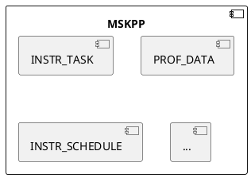

| Layer| Test Type| Test Object        | Test Value                        |
| ---- | -------- | ---------------- | -------------------------------- |
| IT   | Component testing| `instr_schedule` | Verify the core workflow from command creation to scheduling.|
| UT   | Unit testing| `prof_data`      | Verify that the data building process is correct.        |
| UT   | Unit testing| `metric`         | Verify that the profile data generation function is correct.        |

##### 4.6.1.5 Key Testing Solutions

1. Test Project design

    For the instruction task creation Python module, use HDT-PYTHON. For the instruction scheduling module, use GTest and gMock.

2. Physical design

    The design is independent of the service code directory and unifies the UT and IT projects.

    ```text
    mskpp/
    ├── requirements.txt
    ├── mskpp
    └── test
        ├── case
        |   └── test_xxx_normal.py
        └── utils
            ├── __init__.py
            └── test_base.py
    ```

3. Operating environment

    The running depends on the Python language environment, which does not need to be built additionally. It also needs to be added to the MR gate. For the UT of the C++ module, add the dependency on the open-source test repository during the build.

4. Test double design

    None.

5. DSL design

    None.

6. Data construction design

    Use real data to implement component or end-to-end acceptance tests. Construct the msKPP-DSL language that is the same as the external implementation to create and schedule instruction tasks and verify the generated data results. Because the preceding process is not random, the result data can be verified.

7. Fixture design

    Test case instructions depend on separate input data, and fixture design is not required.

8. Matcher design

    None.

#### 4.6.2 Auto Tuning

##### 4.6.2.1 Design Objectives

Defines the key element model for msKPP developer testing (DT) as a Layer 0 public design. This includes software testability design and layered testing strategies. It covers DT environments, test project design, general and domain-specific frameworks, and DFX testing for various layers.

##### 4.6.2.2 Design Constraints

Comply with architecture design constraints.

##### 4.6.2.3 Testability Design

The auto tuning feature is exposed externally through Python library interfaces. Functionally, it can be divided into base functionalities—code generation, compilation, and execution, and the auto-tuning capability built upon these base functionalities. All modules cooperate through defined interfaces and are architecturally decoupled with no mutual dependencies. During testing, in addition to auto-tuning, each base functional interface shall support independent system testing (ST).

##### 4.6.2.4 Layered Testing

ST: Performs end-to-end integration tests on the `code_gen`, `compile`, `kernel`, and `autotune` interfaces.

UT: Verifies that the functions of individual functions and classes within the preceding interfaces work as expected.

| Layer| Test Type| Test Object            | Test Value                        |
| ---- | -------- | -------------------- | -------------------------------- |
| ST   | Integration testing| code_gen()           | End-to-end verification of the code generation function.          |
| ST   | Integration testing| compile()            | End-to-end verification of the compilation function.              |
| ST   | Integration testing| kernel()           | End-to-end verification of the kernel running function.        |
| ST   | Integration testing| autotune             | End-to-end verification of the auto tuning function.          |
| ST   | Integration testing| tiling_func             | End-to-end verification of the tiling calling function.          |
| ST   | Integration testing| get_kernel_from_binary             | End-to-end verification of the kernel calling function.          |
| UT   | Unit testing| Internal functions and classes of the preceding APIs| Verifies that the minimal implementation units work as expected.|

##### 4.6.2.5 Key Testing Solutions

1. Test project design

    Use pytest.

2. Physical design

    The design is independent of the service code directory and unifies the UT and ST projects.

    ```text
    mskpp/
    ├── requirements.txt
    ├── mskpp
    └── test
        ├── launcher
            ├── test_code_gen_xxx.py
            ├── test_compiler.py
            ├── test_driver.py
        |   └── test_opgen_workflow.py
        ├── op_tune
        |   └── test_autotune_xxx.py
        └── utils
            ├── __init__.py
            └── test_base.py
    ```

3. Operating environment

   The running depends on the Python language environment, which does not need to be built additionally. It also needs to be added to the MR gate. For the UT of the C++ module, add the dependency on the open-source test repository during the build.

4. Test double design

   N/A

5. DSL design

   N/A

6. Data construction design

   Use the interface example as the end-to-end test case with deterministic outputs.

7. Fixture design

   N/A

8. Matcher design

   N/A

## 5. Runtime View

### 5.1 Interaction Model

#### 5.1.1 Performance Modeling

##### 5.1.1.1 Design Objectives

msKPP provides a series of modeling interfaces to model the running of operators in the Ascend AI Processors. The modeling flow, in order of execution, consists of the following core stages: runtime environment setup, instruction modeling, instruction task creation, instruction task scheduling, and operator modeling data analysis.

##### 5.1.1.2 Design Constraints

The modeling phase should be separate and isolated, with instruction flow as the core.

##### 5.1.1.3 Interaction Model Design

msKPP instruction loading and scheduling process

```plantuml
hide footbox
actor "Actor" as U

activate U

participant "Tensor" as L1
participant "instr_api" as L2
participant "MemoryInstruction" as L3
participant "ComputationInstruction" as L4
participant "InstrTask" as L5
participant "prof_data" as L6
participant "TaskSchedule" as L7

group Processing of transfer instructions
U->> L1: load tensor
activate L1
L1->> L3: launch
deactivate L1
activate L3
L3->> L5: InstrTask()
deactivate L3
activate L5
L5 -> L6: get time
activate L6
L6 -> L5: cost time
deactivate L6
L5->> L7: add task
deactivate L5
activate L7
end

group Processing of computing instructions
U->> L2: mmad/vxx
activate L2
L2->> L4: launch
deactivate L2
activate L4
L4 -> L6: get time
activate L6
L6 -> L4: cost time
deactivate L6
L4 ->> L5: InstrTask()
deactivate L4
activate L5
L5 ->> L7: add task
deactivate L5
end

U->> L7: run task
L7 -> L7: task schedule
L7->> U: total duration
@enduml
```

#### 5.1.2 Auto Tuning

##### 5.1.2.1 Design Objectives

Auto tuning shall invoke the code generation, compilation, and execution module interfaces in parallel, ensuring the entire process remains transparent to the end user.

##### 5.1.2.2 Design Constraints

N/A

##### 5.1.2.3 Interaction Model Design

Auto tuning interaction process:

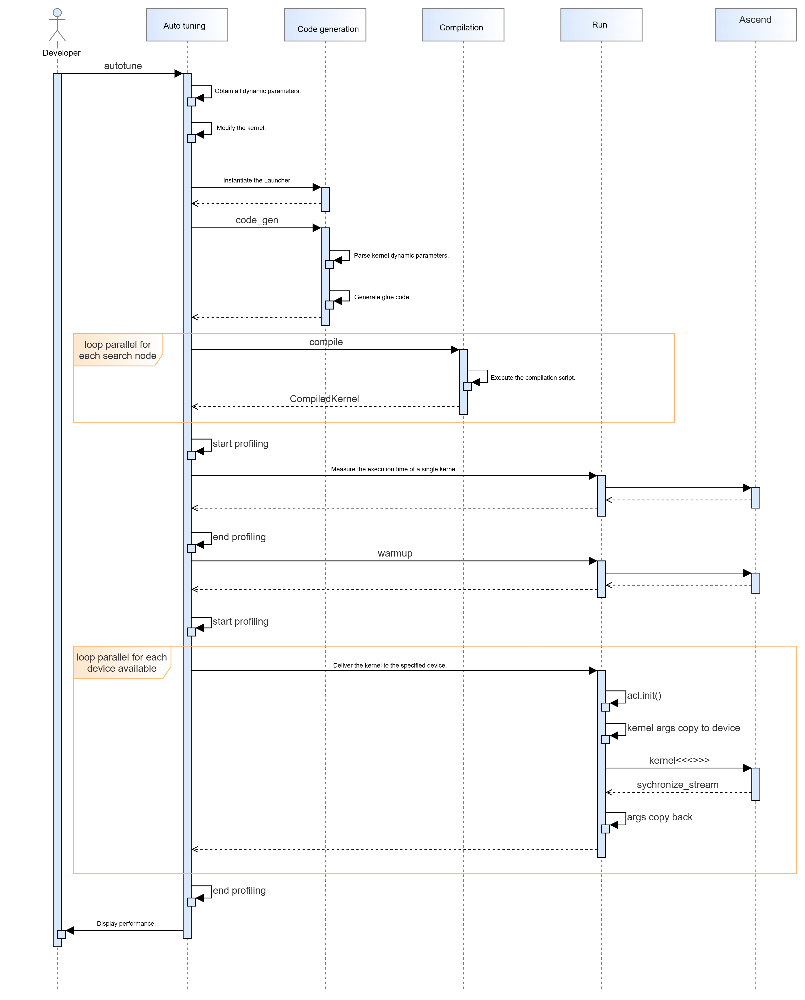

### 5.2 Concurrency Model

#### 5.2.1 Performance Modeling

##### 5.2.1.1 Design Objectives

msKPP performs instruction-level modeling for operators running on Ascend AI Processors, taking into account instruction concurrency during actual operator execution.

##### 5.2.1.2 Design Constraints

msKPP only needs to model the parallel characteristics of instruction scheduling; it does not actually require parallelism. When designing parallelism for instruction scheduling, ensure that CPU and memory constraints are taken into account in accordance with the software concurrency requirements to prevent service failures. If the purpose is only concurrency
simulation, the validity and reliability of the scheduling results must be taken into consideration.

##### 5.2.1.3 Concurrency Model Design

1. Instruction scheduling concurrency model

    It is recommended to employ scheduling concurrency simulation to model individual pipe instructions separately. The resulting output should explicitly illustrate the concurrent instruction scheduling behavior.

2. (Optional) Alternative solution

    N/A

3. (Optional) Technical decision-making

    N/A

4. Instruction scheduling concurrency sequence diagram

    ```plantuml
    hide footbox
    actor "Actor" as U

    activate U

    participant "RawTask" as L1
    participant "TaskGenerator" as L2
    participant "Pipeline" as L3
    participant "TaskSchedule" as L4
    group Instruction creation
    U->> L1: add task
    activate L1
    end
    L1->> L2: add task
    activate L2

    group Task adding to pipeline
    L2->> L3
    activate L3
    end

    U->L4: run task
    activate L4
    group Active and block instruction division
    L4 -> L2 : GetNextPipe()
    end

    L2 -> L2:RefreshPipesStatus
    L2 -> L4:pipesActive.pop()
    group pipe!=nullptr
        L4 -> L3:step
        L3 -> L1:get cutTask
        L1 -> L1:SetDuration
        L1 -> U:RunPreFunc\RunImplFunc\RunPostFunc
        L1 -> L3:update lastExecTime and pipeline block status
        L3 -> L4:totalDuration += lastExecTime
        L4 -> L2:GetNextPipe()
    end
    @enduml
    ```

#### 5.2.2 Auto Tuning

##### 5.2.2.1 Design Objectives

Ensure auto tuning efficiency.

##### 5.2.2.2 Design Constraints

Auto tuning involves parallel compilation and delivery.

The compilation process is performed on the CPU and can be parallelized across all CPU cores. The delivery process is performed on the neural network processing unit. To avoid performance evaluation exceptions, ensure that only one kernel is running on a single device at a time. Parallel execution is supported across multiple devices.

##### 5.2.2.3 Concurrency Model Design

Each search node can be decomposed into two serial tasks: compilation and delivery. The compilation task can be directly parallelized across multiple CPU cores.

The different kernels generated after compilation are placed in a queue. When there are free device resources, a kernel is extracted from the queue and delivered to the device.

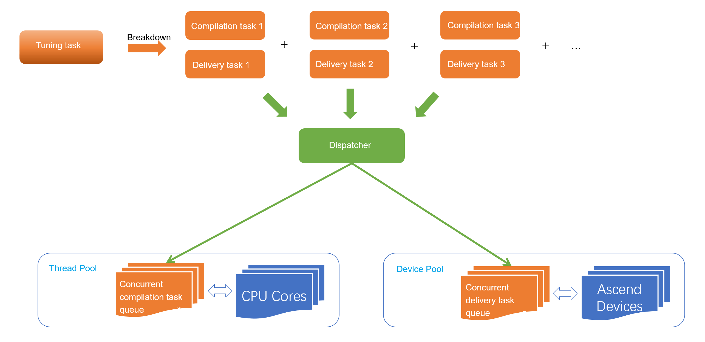

## 6. Code Directory Structure

```text
├── docs  // Project documentation 
├── mskpp // Python code directory 
│      ├──\_\_init\_\_.py  
│      └── ....  
├── csrc  // CPP source code directory 
│     └── CMakeList.txt  // CMake used for C code 
├── example  // Directory for storing tool examples 
│     └── README.md  // Tool samples description 
├── setup.py  // Packaging script 
├── test  // Testing directory, which needs to provide coverage statistics script 
│     └── build_test.py  // Build test scenarios without wheel packaging 
├── output  // Script generation directory, which stores the deliverables generated after compilation 
├── build.py  // End-to-end build script 
├── CMakeLists.txt  // General build configuration 
├── requirements.txt  // Python dependencies 
└── README.md  // Repository description
```
