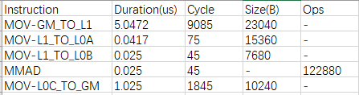
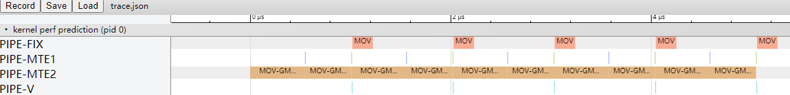
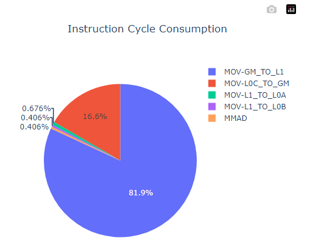

# **MindStudio Kernel Performance Prediction User Guide**

## Overview

MindStudio Kernel Performance Prediction (msKPP) is an operator design tool that provides performance modeling and analysis functions. Before operator development, you can use the mathematical logic of an operator as the input and the APIs provided by msKPP to write an expression solution for the operator implementation, and obtain the performance modeling result of the solution. Since performance prediction requires only the execution time of corresponding algorithms based on input and output sizes, and not actual computation, performance modeling results can be provided within seconds.

## Preparations

**Environment Requirements**

Before developing an operator, install the driver, firmware, CANN Toolkit, and ops operator package. For details, see *CANN Software Installation Guide*. No installation example is provided in this section.

Configure the required environment variables according to the requirements. After the configuration is complete, you can directly use the performance modeling function of the msKPP tool. For details, see [Performance Modeling Functions](#performance-modeling-functions).

> [!NOTE]NOTE  
> If you need the instruction proportion pie chart (`instruction_cycle_consumption.html`), install the third-party Python library plotly as it is a dependency for generating the pie chart.
>
> ```py
> pip3 install plotly
> ```

**Constraint**

- You can create an operator model based on the msKPP APIs in any directory. Pay attention to the following points during the implementation:
  - Before modeling an operator, you need to import instructions for tensor, chip, and operator implementation (in lowercase).
  - Use the `with` statement to enable the entry of the operator implementation code. The `enable_trace` and `enable_metrics` APIs can be used to enable the trace dotting and instruction statistics functions. For details, see the `main.py` file in [Peak Performance Analysis](#peak-performance-analysis).
  - For details about the APIs for operator modeling, see *msKPP_API*.

- Ensure that the input data is reliable and secure during secondary development.

## Performance Modeling Functions

To achieve the theoretical performance, msKPP models the performance of computation and transfer instructions for actual processors based on [Table 1](#111).

**Table 1** Assumptions for msKPP modeling <a name="111"></a>

|Performance Assumption|Overview|
|--|--|
|The internal memory (local memory) is unlimited. However, the memory available to users within the lifetime is limited.|This assumption means that the memory capacity limitations are not taken into account during the modeling process of actual processors. This allows users and developers to allocate and use memory resources without worrying about insufficient memory. In practice, despite the limitations of physical memory, this assumption has the benefit of simplifying the model, enabling users and developers to focus on other performance-related factors.|
|The instruction capability evaluated by statistics represents the theoretical performance.|This assumption posits that theoretical processor performance can be inferred through statistical analysis of executed instructions, and that the average performance achieved during instruction execution is indicative of the processors' maximum performance potential. This assumption helps improve processor performance through statistical model prediction during design and optimization.|
|There is no bottleneck in delivery.|This assumption implies that there will be no bottlenecks or limitations encountered during the process of delivering data or instructions to the chip execution units. That is, data transfer and instruction scheduling can be performed seamlessly without any performance degradation due to any hardware or software limitations.|

- [Operator Feature Modeling](#operator-feature-modeling)

    msKPP supports tensor splitting, debug mode, comparison between theoretical values of pipeline information and values measured by msprof, and modeling of operator features (transfer channel, channel conversion, and cache hit ratio). You can select a function as required.

- [Operator Computing and Transferring Specification Analysis](#operator-computing-and-transferring-specification-analysis)

    The matmul operator is used as an example to describe the analysis of operator computing and transferring specifications.

- [Peak Performance Analysis](#peak-performance-analysis)

    The matmul operator is used as an example to describe the peak performance analysis function.

- [Operator Tiling Preliminary Design](#operator-tiling-preliminary-design)

    The simulation of a tiling policy is reflected in the `for` loop of an operator function. During tiling, ensure that the amount of data processed in each `for` loop is the same.

## Operator Feature Modeling

**Function**

msKPP supports tensor splitting, debug mode, comparison between theoretical values of pipeline information and values measured by msprof, and modeling of operator features (transfer channel, channel conversion, and cache hit ratio). You can select a function as required. After the modeling is complete, you can perform [Operator Computing and Transferring Specification Analysis](#operator-computing-and-transferring-specification-analysis), [Peak Performance Analysis](#peak-performance-analysis), and [Operator Tiling Preliminary Design](#operator-tiling-preliminary-design).

**Precautions**

Replace `Ascendxxxyy` in this document with the actual processor type.

**Example**

- Transfer channel modeling (Atlas A2 training products/Atlas A2 inference products).

    In the Atlas A2 training products/Atlas A2 inference products, the channels from L1 to the fixpipe buffer (FP) and from L1 to the bias table (BT) are added. The former stores the scale parameter for quantization conversion during `L0C_TO_OUT` channel-based format conversion, and the latter stores one-dimensional bias data. In this tool, the transfer channel is modeled in the sequence of GM -> L1 -> FP/BT.

    ```py
    in_x = Tensor("GM", "FP16", [64], format="ND")
    l1_x = Tensor("L1")
    fp_x = Tensor("FB")
    bt_x = Tensor("BT")
    l1_x.load(in_x)
    l1_x_to_fp = l1_x[0:32]
    l1_x_to_bt = l1_x[32:64]
    fp_x.load(l1_x_to_fp)
    bt_x.load(l1_x_to_bt)
    ```

- Channel conversion modeling

    In the Cube unit of the Ascend AI Processor, the data format for calculation must be a special private NZ format. Generally, data in the GM is in ND format. Therefore, the data format needs to be converted during Cube calculation. In the Atlas A2 training products/Atlas A2 inference products, the transfer channel from the GM to the Cube-related storage unit has the ND-to-NZ format conversion capability.

    In msKPP, if the user-defined GM tensor is in ND format and the L1 tensor is in NZ format for GM-L1, or if the user-defined L0C tensor is in NZ format and the GM tensor is in ND format for L0C-GM, then enable channel-based format conversion and retrieve relevant empirical data.

    ```py
    in_x = Tensor("GM", "FP16", [128, 256], format="ND")
    l1_x1 = Tensor("L1", format="NZ")
    l1_x2 = Tensor("L1", format="NZ")
    l1_x1.load(in_x[128, 0:128])
    l1_x2.load(in_x[128, 128:])
    ```

- Cache hit ratio

    L2 cache refers to the high-bandwidth transfer channel between part of the GM space and vector core and cube core. When the L2 cache hit ratio is close to 100% compared to when it is near 0%, there can be more than a twofold difference in bandwidth. Currently, msKPP allows users to manually adjust the L2 cache hit ratio.

    ```py
    with Chip("Ascendxxxyy") as chip:
        config = {"cache_hit_ratio": 0.6}
        chip.set_cache_hit_ratio(config)
    ```

- Tensor splitting

    In msKPP, tensor splitting is to split a large tensor into small tensors. For example:

    ```py
    in_x = Tensor("GM", "FP16", [128, 256], format="ND")
    in_x_1 = in_x[128, 0:128]    # Size: 1 × 128
    in_x_2 = in_x[128, 64:]    # Size: 1 × 64
    ```

- Debug mode

    This mode enables users to preliminarily locate the instructions that encounter dequeue and enqueue issues during operator modeling, thereby enhancing the efficiency of fault location with tool development. The enabling method is as follows:

    ```py
    with Chip("Ascendxxxyy", debug_mode=True) as chip:
    ```

- Comparison between theoretical values of pipeline information and values measured by msprof

    The following uses an Ascend C operator as an example. You can use the `--application` mode to call msprof, output the `PipeUtilization.csv` file in the `OPPROF__{timestamp}__XXX` directory.

    ```py
    with Chip("Ascendxxxyy") as chip:
        chip.enable_metrics()  
        chip.set_prof_summary_path("/home/xx/OPPROF_{timestamp}_XXX/PipeUtilization.csv")
    ```

    The generated `Pipe_statistic.csv` file contains two columns: `ProfDuration(us)_0` and `ProfRatio_0`. The values in the `ProfDuration(us)_0` column are the same as those in the `PipeUtilization.csv` file. `ProfRatio_0` indicates the ratio of the measured value to the theoretical value. `ProfRatio` is a multiple of the measured value relative to the theoretical value. A larger multiple indicates a larger optimization space.

    **Figure 1** Pipe_statistic.csv file
    

**Output Description**

None

## Operator Computing and Transferring Specification Analysis

**Function**

The matmul operator is used as an example to describe the analysis of operator computing and transferring specifications.

**Precautions**

Replace `Ascendxxxyy` in this document with the actual processor type.

**Example**

The following case uses the matmul operator as an example. The case handles the matrix multiplication of [160, 240] and [240, 80], which are broken down into five respective smaller matrices of [32, 48], [48, 16], and [32, 16] for efficient multiplication. The following is an example of the `main.py` script implemented by calling the APIs provided by msKPP:

```py
from mskpp import mmad, Tensor, Chip
def my_mmad(gm_x, gm_y, gm_z):
    # Basic data paths for matrix multiplication:
    # Left matrix x: GM-L1-L0A
    # Right matrix y: GM-L1-L0B
    # Result matrix z: L0C (initialized)-GM
    # Sample mathematical expression: z = x @ y + b
    # Define and allocate variables on L1.
    l1_x = Tensor("L1")
    l1_y = Tensor("L1")
    # Define and allocate variables on L0A and L0B.
    x = Tensor("L0A")
    y = Tensor("L0B")
    # Define and allocate the offset on L0C. Theoretically, the offset should be allocated to the accumulator buffer. Allocating the offset to L0C does not affect the performance.
    b = Tensor("L0C", "FP32", [32, 16], format="NC1HWC0")
    # Move the data on the GM to the memory space corresponding to L1.
    l1_x.load(gm_x)
    l1_y.load(gm_y)
    # Move the left and right matrices on L1 to L0A and L0B.
    x.load(l1_x)
    y.load(l1_y)
    # The current data has been loaded to L0A and L0B. Call the calculation instruction and save the result to L0C. out is the variable allocated by the mmad function in L0C.
    out = mmad(x, y, b, True)()
    # Move the data on L0C to the address space of the GM variable gm_z.
    gm_z.load(out[0])
    return gm_z
if __name__ == '__main__':
    with Chip("Ascendxxxyy") as chip:
        chip.enable_trace() # Enable the operator simulation pipeline chart function to generate the trace.json file.
        chip.enable_metrics() # Enable single instruction and pipeline information to generate the Instruction_statistic.csv and Pipe_statistic.csv files.
        # Simulate the scenario where a large matrix is split into five small matrices for computation.
        for _ in range(5):
            # Use the operator for AI Core computation.
            in_x = Tensor("GM", "FP16", [32, 48], format="ND")
            in_y = Tensor("GM", "FP16", [48, 16], format="ND")
            in_z = Tensor("GM", "FP32", [32, 16], format="NC1HWC0")
            my_mmad(in_x, in_y, in_z)
```

After the `main.py` script is executed using Python, the `Pipe_statistic.csv` file for pipeline statistics and `Instruction_statistic.csv` file for instruction statistics are generated in the `current path//MSKPP_TIMESTAMP` directory. You can view the msKPP modeling results.

> [!NOTE]NOTE  
> *TIMESTAMP* indicates the current timestamp.

**Output Description**

**Transfer Pipeline Statistics**

The `Pipe_statistic.csv` file collects statistics on the total amount of moved data, number of operations, and time consumptions of different pipelines.

**Figure 1** Pipe_statistic.csv


The following table describes the key fields.

**Table 1** Field description

|Field|Description|
|--|--|
|Pipe|Name of a pipe unit in an Ascend NPU.|
|Duration(us)|Pipeline time consumption (unit: μs).|
|Cycle|Number of cycles consumed each time an instruction is executed.|
|Size(B)|Transfer volume of a transfer pipeline (unit: B).|
|Ops|Size of a calculation element in pipelines of the calculation class.|

For the pipeline that takes the longest time and clearly bottlenecks transfer performance, the optimization roadmap is as follows:

- If a large amount of data needs to be transferred, maximize the data transferred at once to fully utilize the transfer bandwidth.
- Ensure that the pipeline with the performance bottleneck remains continuously operational.

**Instruction Statistics**

The `Instruction_statistic.csv` file collects statistics on the total amount of transferred data, number of operations, and time consumptions across different instruction dimensions. It can be found that the bottleneck at the instruction layer lies in `MOV-GM_TO_L1` (belonging to `PIPE-MTE2`). This helps pinpoint the performance bottleneck from the instruction layer.

**Figure 2** Instruction_statistic.csv


The following table describes the key fields.

**Table 2** Field description

|Field|Description|
|--|--|
|Instruction|Instruction name.|
|Duration(us)|Pipeline time consumption (unit: μs).|
|Cycle|Number of cycles consumed each time an instruction is executed.|
|Size(B)|Transfer volume of a transfer pipeline (unit: B).|
|Ops|Size of a calculation element in pipelines of the calculation class.|

## Peak Performance Analysis

**Function**

The matmul operator is used as an example to describe the peak performance analysis function.

**Precautions**

Replace `Ascendxxxyy` in this document with the actual processor type.

**Example**

The following case uses the matmul operator as an example. The case handles the matrix multiplication of [160, 240] and [240, 80], which are broken down into five respective smaller matrices of [32, 48], [48, 16], and [32, 16] for efficient multiplication. The following is an example of the `main.py` script implemented by calling the APIs provided by msKPP:

```py
from mskpp import mmad, Tensor, Chip
def my_mmad(gm_x, gm_y, gm_z):
    # Basic data paths for matrix multiplication:
    # Left matrix x: GM-L1-L0A
    # Right matrix y: GM-L1-L0B
    # Result matrix z: L0C (initialized)-GM
    # Sample mathematical expression: z = x @ y + b
    # Define and allocate variables on L1.
    l1_x = Tensor("L1")
    l1_y = Tensor("L1")
    # Define and allocate variables on L0A and L0B.
    x = Tensor("L0A")
    y = Tensor("L0B")
    # Define and allocate the offset on L0C. Theoretically, the offset should be allocated to the accumulator buffer. Allocating the offset to L0C does not affect the performance.
    b = Tensor("L0C", "FP32", [32, 16], format="NC1HWC0")
    # Move the data on the GM to the memory space corresponding to L1.
    l1_x.load(gm_x)
    l1_y.load(gm_y)
    # Move the left and right matrices on L1 to L0A and L0B.
    x.load(l1_x)
    y.load(l1_y)
    # The current data has been loaded to L0A and L0B. Call the calculation instruction and save the result to L0C. out is the variable allocated by the mmad function in L0C.
    out = mmad(x, y, b, True)()
    # Move the data on L0C to the address space of the GM variable `gm_z`.
    gm_z.load(out[0])
    return gm_z
if __name__ == '__main__':
    with Chip("Ascendxxxyy") as chip:
        chip.enable_trace() # Enable the operator simulation pipeline chart function to generate the trace.json file.
        chip.enable_metrics() # Enable single instruction and pipeline information to generate the Instruction_statistic.csv and Pipe_statistic.csv files.
        # Simulate the scenario where a large matrix is split into five small matrices for computation.
        for _ in range(5):
            # Use the operator for AI Core computation.
            in_x = Tensor("GM", "FP16", [32, 48], format="ND")
            in_y = Tensor("GM", "FP16", [48, 16], format="ND")
            in_z = Tensor("GM", "FP32", [32, 16], format="NC1HWC0")
            my_mmad(in_x, in_y, in_z)
```

After the `main.py` script is executed using Python, the instruction pipeline chart (`trace.json`) and instruction proportion pie chart (`instruction_cycle_consumption.html`) are generated in the `current path/MSKPP_TIMESTAMP_` directory. You can view the msKPP modeling result.

> [!NOTE]NOTE  
> *TIMESTAMP* indicates the current timestamp.

**Output Description**

Instruction pipeline chart

By examining the `trace.json` file, you can find that in an ideal pipeline, `PIPE-MTE2`, which is a performance bottleneck, needs to operate continuously.

> [!NOTE]NOTE  
> Enter "chrome://tracing" in the address box of Google Chrome, drag the .json file to the blank space to open it, and press the shortcut keys (**W**: zoom in; **S**: zoom out; **A**: move left; **D**: move right) on the keyboard to view the file.

**Figure 1** trace.json


Click the `MOV-GM_TO_L1` instruction in the pipeline to view the number of cycles and bandwidth of the instruction under the current transfer volume and calculation volume, as shown in [Figure 2](#222).

**Figure 2** Instruction details <a name="222"></a>


**Instruction proportion pie chart**

From the `instruction_cycle_consumption.html` file, it can be seen that `MOV-GM_TO_L1` is the biggest bottleneck among the operators.

**Figure 3** Instruction duration statistics



## Operator Tiling Preliminary Design

**Function**

The simulation of a tiling policy is reflected in the `for` loop of an operator function. During tiling, ensure that the amount of data processed in each `for` loop is the same.

**Precautions**

Replace `Ascendxxxyy` in this document with the actual processor type.

**Example**

The matmul operator is used as an example to simulate the scenario where a large matrix is split into small matrices for matrix multiplication. The operator function needs to be implemented based on the user operator logic solution. As mentioned before, the simulation of a tiling policy is reflected in the `for` loop (bold part in the following code) of an operator function. For example, if the matrix multiplication of [160, 240] and [240, 80] is processed on a single core, 25 respective smaller matrices of [32, 48] and [48, 16] are required. That is, the `for` loop needs to be executed 25 times, while creating a GM tensor with a size of [32, 48] and [48, 16] each time.

```py
from mskpp import mmad, Tensor, Chip
def my_mmad(gm_x, gm_y, gm_z):
    # Basic data paths for matrix multiplication:
    # Left matrix A: GM-L1-L0A
    # Right matrix B: GM-L1-L0B
    # Result matrix C: L0C (initialized)-GM
    l1_x = Tensor("L1")
    l1_y = Tensor("L1")
    l1_x.load(gm_x)
    l1_y.load(gm_y)
    x = Tensor("L0A")
    y = Tensor("L0B")
    x.load(l1_x)
    y.load(l1_y)
    z = Tensor("L0C", "FP32", [32, 16], format="NC1HWC0")
    out = mmad(x, y, z, True)() # The output needs to be returned.
    z = out[0]
    return z

if __name__ == '__main__':
    with Chip("Ascendxxxyy") as chip:
        chip.enable_trace()    # Enable the operator simulation pipeline chart function to generate the trace.json file.
        chip.enable_metrics()   # Enable single instruction and pipeline information to generate the Instruction_statistic.csv and Pipe_statistic.csv files.
        # Here comes the processing logic for data tiling, which involves breaking down a large block of GM data into smaller blocks and transferring them in batches.
        # Buffer sharding and multi-buffer transfer are covered by the tiling policy. Here, we simulate the single-buffer scenario.
        # A tiling policy for performing matrix multiplication between [160, 240] and [240, 80], by dividing them into 25 respective small matrices of size [32, 48] and [48, 16] and processing them in batches.
        for _ in range(25):
            in_x = Tensor("GM", "FP16", [32, 48], format="ND")
            in_y = Tensor("GM", "FP16", [48, 16], format="ND")
            in_z = Tensor("GM", "FP32", [32, 16], format="NC1HWC0")
            out_z = my_mmad(in_x, in_y, in_z)
            in_z.load(out_z)
```

**Output Description**

None
