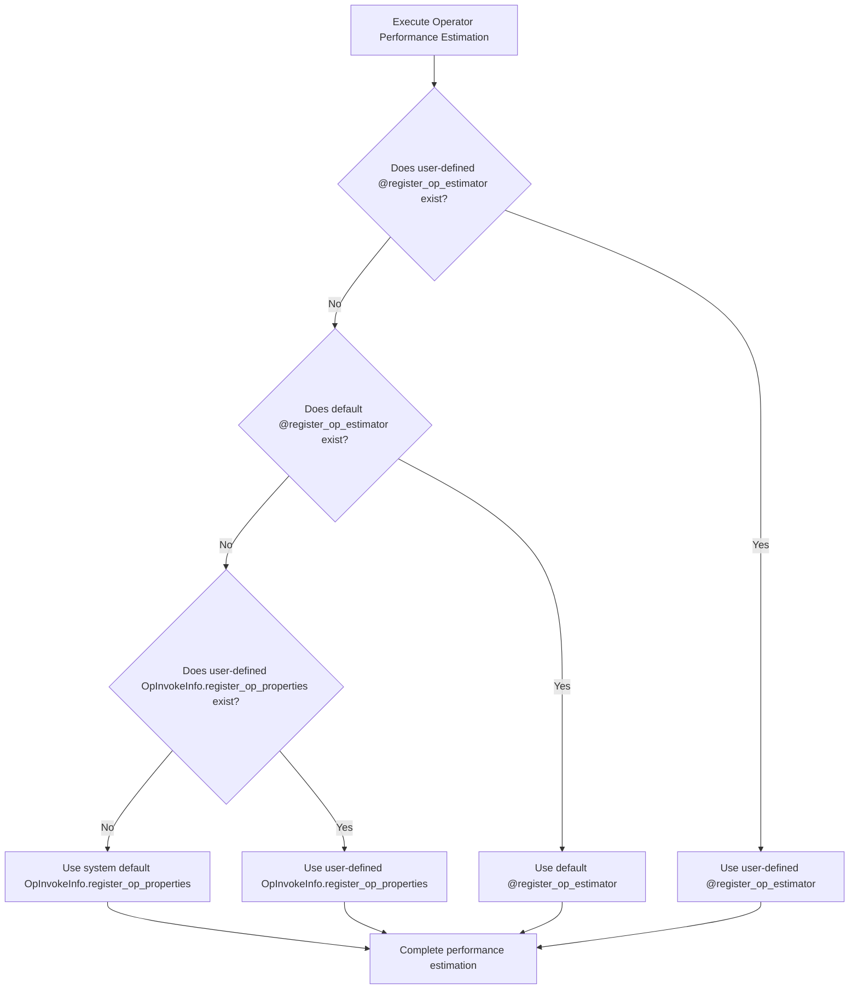
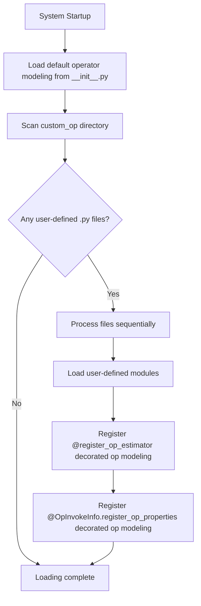

# RFC: Support for Custom Operator Modeling

## Metadata

| Item | Content                                        |
| :--- |:------------------------------------------|
| **Status** | Approved                                       |
| **Author** | genius52                                  |
| **Created Date** | 2026-1-19                                 |
| **Related Links** | https://gitcode.com/Ascend/msmodeling/pull/50 |

---

## 1. Overview

Need to provide unified performance modeling capabilities for user-defined PyTorch operators, support brand new operator implementations and existing operator overrides, to accurately evaluate memory footprint and computational overhead for performance analysis and optimization.

## 2. Solution Design

### 2.1 Recommended Solution

#### 2.1.1 Core Design

Provide operator performance modeling functionality based on a two-level registration mechanism:

- **Direct Estimation**: Use `@register_op_estimator` for direct execution time estimation, applicable to any operator type
- **Detailed Analysis**: Use `@OpInvokeInfo.register_op_properties` for detailed computation and memory access analysis

This design supports users providing performance models for new operators or overriding existing ones, to accurately evaluate memory footprint and computational overhead for performance analysis and optimization.

#### 2.1.2 User-defined Operator Loading

At system startup, scan all `.py` files under the `tensor_cast/performance_model/custom_op/` directory to automatically load all registered operator performance modeling functions.

#### 2.1.3 Operator Override Support

The operator override mechanism has been implemented. When users register with the same operator signature, user-defined performance modeling will automatically override the default implementation.

#### 2.1.4 Performance Estimation Priority Mechanism

When estimating performance for the same operator, the system selects performance modeling implementations in the following priority order:



### 2.1.5 Startup Loading Registration Process

System startup loads and registers operator performance modeling implementations:



### 2.2 Alternative Solutions

#### Solution 2: Configuration File-driven Approach

Define operator performance properties through JSON/YAML configuration files, but not recommended for the following reasons:

1. **Poor Expressiveness**: Unable to handle complex logic, dynamic computation, and runtime information
2. **Difficult Maintenance**: Configuration and code separation make debugging difficult and version control complex
3. **Insufficient Extensibility**: Difficult to adapt to future hardware characteristics and complex algorithm requirements

### 2.3 Solution Analysis

#### Advantages of Recommended Solution (Code Implementation)

- **Simple Implementation**: Clear code path, easy to understand and maintain
- **High Flexibility**: Supports various types of operators without architectural modifications
- **Accurate Computation Precision**: Supports multiple data types and complex logic
- **Good Integration with Existing Systems**: Extended based on existing registration mechanisms
- **Code Template**: Easy to reuse with low learning curve

#### Limitations of Recommended Solution

- **Requires Manual Implementation**: Users must manually write modeling logic
- **Technical Threshold**: Performance evaluation of complex operators requires domain knowledge

## 3. Implementation Plan

### 3.1 Completed Features

- **Core Framework Implementation**: Operator performance modeling mechanism based on `OpInvokeInfo.register_op_properties`
- **Custom Operator Loading**: System automatically loads user-defined modeling by scanning `tensor_cast/performance_model/custom_op/` directory
- **Operator Override Support**: Complete operator override mechanism implemented, custom modeling automatically overrides default implementation

### 3.2 Next Steps

- **Template and Example Optimization**: Develop universal operator performance modeling templates and improve example code, providing more practical modeling cases
- **User Experience Improvement**: Simplify implementation complexity of user-defined modeling and reduce usage threshold

---

## 4. Implementation Guide

### 4.1 Code Organization

**Place custom code in the `tensor_cast/performance_model/custom_op` directory**

This directory is specifically designed for storing user-defined performance modeling functions and related performance analysis code. Organizing your code in this location has several advantages:

1. **High code purity**: Keeps core implementations separate from user customizations
2. **Easy to manage**: Dedicated space for custom implementations
3. **Clear code layering**: Establishes a clean separation of concerns

### 4.2 Two-Level Operator Performance Modeling Registration Design

The framework uses a two-level approach for operator performance modeling, providing different levels of flexibility and precision:

#### **Direct Estimation with `@register_op_estimator`**

This provides direct execution time estimation for **any** operator type.

**Purpose**: Direct time estimation for any operator type

```python
from tensor_cast.performance_model.op_estimator_registry import register_op_estimator
from tensor_cast.performance_model.model import PerformanceModel

@register_op_estimator(torch.ops.your_op.Operator, None, True)
def _estimate_your_op(op_invoke_info, device_profile) -> object:
    """Direct time estimation for any operator type"""
    input_tensors = op_invoke_info.args
    total_elements = sum(tensor.numel() for tensor in input_tensors)
    base_time = 0.001
    compute_time = total_elements * 1e-9

    return PerformanceModel.Result(base_time + compute_time)
```

#### **Detailed Analysis with `@OpInvokeInfo.register_op_properties`**

Provides detailed computational complexity and memory access analysis.

**Purpose**: Provide computational foundation for default estimator

```python
from tensor_cast.performance_model.op_invoke_info import OpInvokeInfo
import torch

@OpInvokeInfo.register_op_properties(torch.ops.your_op.Operator)
def _(op_invoke_info: OpInvokeInfo) -> OpInvokeInfo.PerformanceProperties:
    """Provide detailed analysis properties for operators"""
    properties = op_invoke_info.get_memory_access_properties()

    # Add computation by data type
    compute_ops = properties.compute_ops.setdefault(
        op_invoke_info.args[0].dtype, OpInvokeInfo.ComputeOps())
    compute_ops.mma_ops = calculated_ops

    return properties
```

#### **How It Works**

For the same operator, `@register_op_estimator` always takes priority over `@OpInvokeInfo.register_op_properties`. When a `@register_op_estimator` is registered, the system will directly use this estimator. When there is no registration, the system will use the default estimator, which will check if there is a `@OpInvokeInfo.register_op_properties` registration and then use these properties for the final performance modeling.

#### **Usage Guidelines**

- **Simple Scenarios**: Use `@register_op_estimator` for direct time estimation
- **Complex Scenarios**: Use `@OpInvokeInfo.register_op_properties` for detailed computation attributes
- **Specialized Ops**: Choose appropriate methods based on specific requirements
- **Computation Ops**: Can choose appropriate methods based on complexity
- **Mixed Scenarios**: Both decorators can be used for the same op in different scenarios

#### **Parameters for `@register_op_estimator`**

1. **Operator**: Any PyTorch operator to estimate
2. **Device Profile**: Device-specific configuration (can be `None`)
3. **Override**: Whether to allow override of existing estimators

### 4.3 Performance Modeling Templates

```python
from tensor_cast.performance_model.op_invoke_info import OpInvokeInfo
import torch

@OpInvokeInfo.register_op_properties(torch.ops.your_op.Operator)
def _(op_invoke_info: OpInvokeInfo) -> OpInvokeInfo.PerformanceProperties:
    properties = op_invoke_info.get_memory_access_properties()

    # Add computation by data type
    compute_ops = properties.compute_ops.setdefault(
        op_invoke_info.args[0].dtype, OpInvokeInfo.ComputeOps())
    compute_ops.mma_ops = calculated_ops

    return properties
```

#### 4.4 `@register_op_estimator` Template

Use this to directly estimate execution time for any operator type:

```python
from tensor_cast.performance_model.op_estimator_registry import register_op_estimator
from tensor_cast.performance_model.model import PerformanceModel

@register_op_estimator(torch.ops.tensor_cast.all_to_all.default, None, True)
def _estimate_all_to_all(op_invoke_info, device_profile) -> object:
    input_tensor = op_invoke_info.args[0]
    message_size = input_tensor.numel() * input_tensor.element_size()

    # Simple time estimate
    return PerformanceModel.Result(0.001 + message_size / (10.0 * 1e9))
```

### 4.5 Parameter Mapping

- `op_invoke_info.args[0]`: First argument (e.g., key tensor)
- `op_invoke_info.args[1]`: Second argument (e.g., value tensor)
- `op_invoke_info.args[2]`: Third argument (e.g., kv_cache tensor)
- `op_invoke_info.args[3]`: Fourth argument (e.g., slot_mapping)

### 4.6 Common Patterns

#### 4.6.1 Memory Access Properties

```python
# Base memory properties
properties = op_invoke_info.get_memory_access_properties()

# Update memory read/write
properties.memory_read_bytes += input_tensor.numel() * input_tensor.element_size()
properties.memory_write_bytes += output_tensor.numel() * output_tensor.element_size()
```

#### 4.6.2 Computation Operations

```python
# Add computation by data type
compute_ops = properties.compute_ops.setdefault(tensor.dtype, OpInvokeInfo.ComputeOps())
compute_ops.mma_ops = calculated_ops  # Heavy computation (matrix ops)
compute_ops.gp_ops = scalar_ops       # Element-wise computation
```

### 4.7 Operator Types Suitable for Direct Estimation

operator types that are suitable for using `@register_op_estimator` include:

- **Simple Operators**: With straightforward computation patterns that suit direct time estimation
- **Constrained Environments**: Lightweight deployment scenarios where detailed analysis is not feasible
