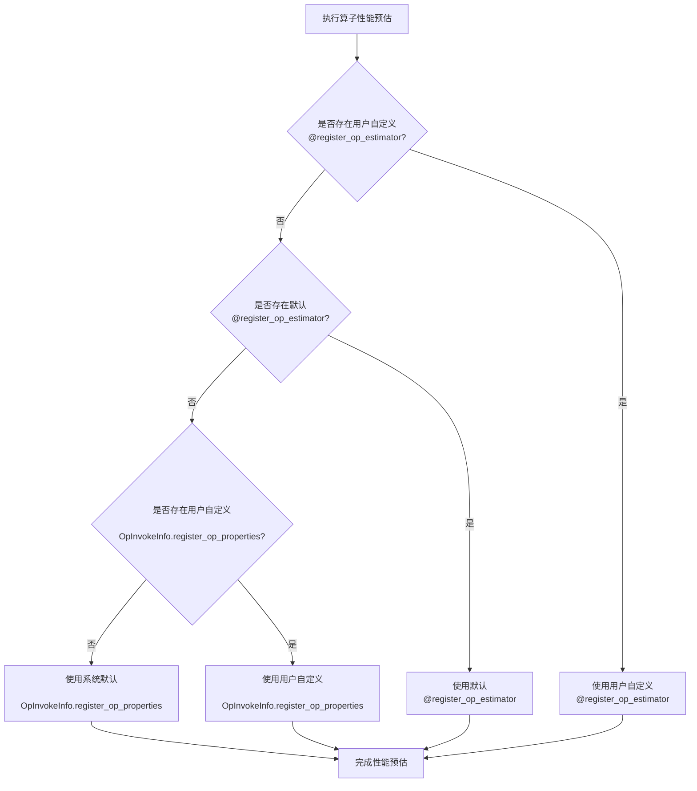
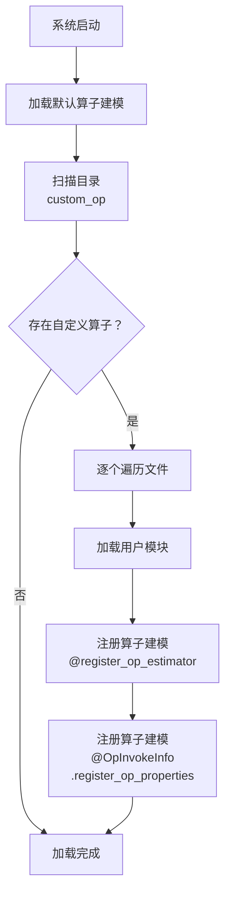

# RFC: 支持用户自定义算子建模

## 元数据

| 项目 | 内容                                        |
| :--- |:------------------------------------------|
| **状态** | 已批准                                       |
| **作者** | genius52                                  |
| **创建日期** | 2026-1-19                                 |
| **相关链接** | https://gitcode.com/Ascend/msmodeling/pull/50 |

---

## 1. 概述

需要为用户自定义PyTorch算子提供统一的性能建模能力，支持全新算子实现和已有算子覆盖，使其能够准确评估内存占用和计算开销，以便进行性能分析和优化。

## 2. 方案设计

### 2.1 推荐方案

#### 2.1.1 核心设计

提供基于两级注册机制的算子性能建模功能：

- **直接估计**：使用 `@register_op_estimator` 直接估计算子执行时间，适用于任何算子类型
- **详细分析**：使用 `@OpInvokeInfo.register_op_properties` 提供算子详细计算和内存访问属性

该设计支持用户为新算子提供性能模型，或覆盖已有算子的性能建模，以提高性能分析和优化的准确性。

#### 2.1.2 用户自定义算子加载

系统启动时扫描 `tensor_cast/performance_model/custom_op/` 目录下的所有 `.py` 文件，自动加载所有注册的算子性能建模函数。

#### 2.1.3 算子覆盖支持

算子覆盖机制已实现。当用户使用相同算子签名注册时，用户自定义的性能建模会自动覆盖默认实现。

#### 2.1.4 性能估算优先级机制

对于同一算子进行性能预估时，系统按照以下优先级顺序选择性能建模实现：



### 2.1.5 启动时加载注册流程

系统启动时会加载和注册算子性能建模实现：



### 2.2 替代方案

#### 方案2：基于配置文件驱动的方式

通过JSON/YAML配置文件定义算子性能属性，但不推荐，理由如下：

1. **表达能力差**：无法处理复杂逻辑、动态计算和运行时信息
2. **维护困难**：配置与代码分离，调试困难，版本控制复杂
3. **扩展不足**：难以适应未来硬件特性和复杂算法需求

### 2.3 方案分析

#### 推荐方案（代码实现）优势

- **实现简单**：代码路径清晰，易于理解和维护
- **灵活性高**：支持各种类型算子，无需架构修改
- **计算精度准确**：支持多数据类型和复杂逻辑
- **与现有系统集成良好**：基于现有注册机制扩展
- **代码模板化**：易于复用，学习成本低

#### 推荐方案局限性

- **需要手动实现**：用户必须手动编写建模逻辑
- **技术门槛**：对复杂算子的性能评估需要领域知识

## 3. 实施计划

### 3.1 已完成功能

- **核心框架实现**：基于 `OpInvokeInfo.register_op_properties` 的算子性能建模机制
- **自定义算子加载**：系统扫描 `tensor_cast/performance_model/custom_op/` 目录自动加载用户自定义建模
- **算子覆盖支持**：完整实现算子覆盖机制，自定义建模自动覆盖默认实现

### 3.2 下一步计划

- **模板和示例优化**：开发通用的算子性能建模模板和完善示例代码，提供更多实用的建模案例
- **用户体验改进**：简化用户自定义建模的实现复杂度，降低使用门槛

---

## 4. 实施指南

### 4.1 代码组织

**将自定义代码放在 `tensor_cast/performance_model/custom_op` 目录中**

该目录专门用于存放用户自定义的性能建模函数和相关性能分析代码。在此位置组织代码有以下几个优点：

1. **代码纯净性高**：将核心实现与用户自定义代码分离
2. **便于管理**：为自定义实现提供专用空间
3. **代码分层清晰**：建立明确的关注点分离

### 4.2 两级算子性能建模注册设计

框架采用两级方法进行算子性能建模，提供不同级别的灵活性和精确度：

#### **直接估计（使用 `@register_op_estimator`）**

为**任意**算子类型提供直接执行时间估计。

**用途**：直接提供算子执行时间估算

```python
from tensor_cast.performance_model.op_estimator_registry import register_op_estimator
from tensor_cast.performance_model.model import PerformanceModel

@register_op_estimator(torch.ops.your_op.Operator, None, True)
def _estimate_your_op(op_invoke_info, device_profile) -> object:
    """直接估计任何算子类型的执行时间"""
    input_tensors = op_invoke_info.args
    total_elements = sum(tensor.numel() for tensor in input_tensors)
    base_time = 0.001
    compute_time = total_elements * 1e-9

    return PerformanceModel.Result(base_time + compute_time)
```

#### **详细分析（使用 `@OpInvokeInfo.register_op_properties`）**

当直接估计不可用时，提供详细的计算复杂性和内存访问分析。

**目的**：捕获详细的计算和内存模式
**用途**：当register_op_estimator未定义时的后备机制
**优先级**：次高优先级，为默认估算器提供计算基础
**关系**：当直接估计不存在时，为最终的建模提供计算基础

```python
from tensor_cast.performance_model.op_invoke_info import OpInvokeInfo
import torch

@OpInvokeInfo.register_op_properties(torch.ops.your_op.Operator)
def _(op_invoke_info: OpInvokeInfo) -> OpInvokeInfo.PerformanceProperties:
    """为缺少直接估计的算子提供详细分析"""
    properties = op_invoke_info.get_memory_access_properties()

    # 按数据类型添加计算量
    compute_ops = properties.compute_ops.setdefault(
        op_invoke_info.args[0].dtype, OpInvokeInfo.ComputeOps())
    compute_ops.mma_ops = calculated_ops

    return properties
```

#### **工作机制**

对于同一个算子，`@register_op_estimator` 的优先级始终高于 `@OpInvokeInfo.register_op_properties`。当存在 `@register_op_estimator` 注册时，系统会直接使用该估算器。当没有注册时，系统会使用默认估算器，该估算器会查找是否有 `@OpInvokeInfo.register_op_properties` 注册，然后使用这些属性进行最终的性能建模。

#### **使用指南**

- **简单场景**：使用 `@register_op_estimator` 直接提供时间估计
- **复杂场景**：使用 `@OpInvokeInfo.register_op_properties` 提供详细计算属性
- **特定场景**：根据实际需求选择适合的方法
- **计算算子**：可以根据复杂性选择适当的方法
- **混合场景**：可以同时使用两种装饰器，用于不同用途

#### **`@register_op_estimator`的参数**

1. **Operator**：要估计的任意PyTorch算子
2. **Device Profile**：特定设备的配置（可以是 `None`）
3. **Override**：是否允许覆盖现有估计器

### 4.3 性能建模模板

```python
from tensor_cast.performance_model.op_invoke_info import OpInvokeInfo
import torch

@OpInvokeInfo.register_op_properties(torch.ops.your_op.Operator)
def _(op_invoke_info: OpInvokeInfo) -> OpInvokeInfo.PerformanceProperties:
    properties = op_invoke_info.get_memory_access_properties()

    # 按数据类型添加计算量
    compute_ops = properties.compute_ops.setdefault(
        op_invoke_info.args[0].dtype, OpInvokeInfo.ComputeOps())
    compute_ops.mma_ops = calculated_ops

    return properties
```

#### 4.4 `@register_op_estimator` 模板

使用此模板来直接估计任何算子类型的执行时间：

```python
from tensor_cast.performance_model.op_estimator_registry import register_op_estimator
from tensor_cast.performance_model.model import PerformanceModel

@register_op_estimator(torch.ops.tensor_cast.all_to_all.default, None, True)
def _estimate_all_to_all(op_invoke_info, device_profile) -> object:
    input_tensor = op_invoke_info.args[0]
    message_size = input_tensor.numel() * input_tensor.element_size()

    # 简单的时间估计
    return PerformanceModel.Result(0.001 + message_size / (10.0 * 1e9))
```

### 4.5 参数映射

- `op_invoke_info.args[0]`：第一个参数（例如，key张量）
- `op_invoke_info.args[1]`：第二个参数（例如，value张量）
- `op_invoke_info.args[2]`：第三个参数（例如，kv_cache张量）
- `op_invoke_info.args[3]`：第四个参数（例如，slot_mapping）

### 4.6 常见模式

#### 4.6.1 内存访问属性

```python
# 基础内存属性
properties = op_invoke_info.get_memory_access_properties()

# 更新内存读写
properties.memory_read_bytes += input_tensor.numel() * input_tensor.element_size()
properties.memory_write_bytes += output_tensor.numel() * output_tensor.element_size()
```

#### 4.6.2 计算操作

```python
# 按数据类型添加计算量
compute_ops = properties.compute_ops.setdefault(tensor.dtype, OpInvokeInfo.ComputeOps())
compute_ops.mma_ops = calculated_ops  # 重计算（矩阵运算）
compute_ops.gp_ops = scalar_ops       # 元素级计算
```

### 4.7 适合直接估计的算子类型

以下类型的算子适合使用 `@register_op_estimator`：

- **简单算子**：计算模式简单，适合直接时间估算
- **受限环境**：无法进行详细分析的轻量级部署环境
