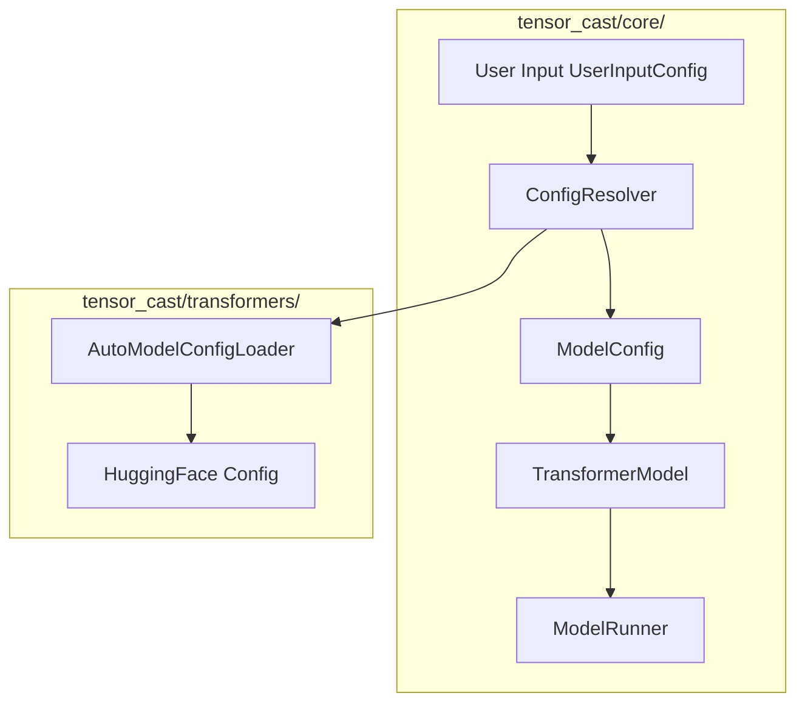
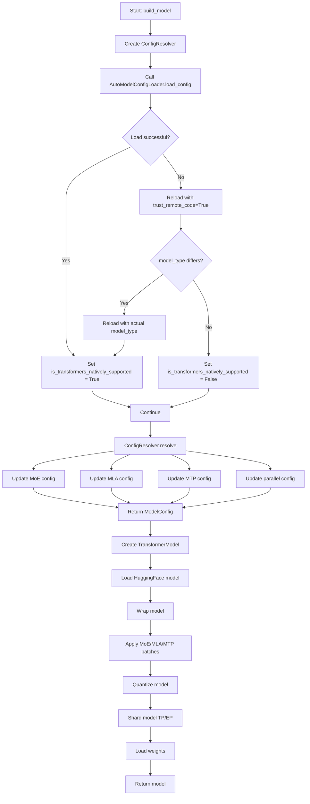
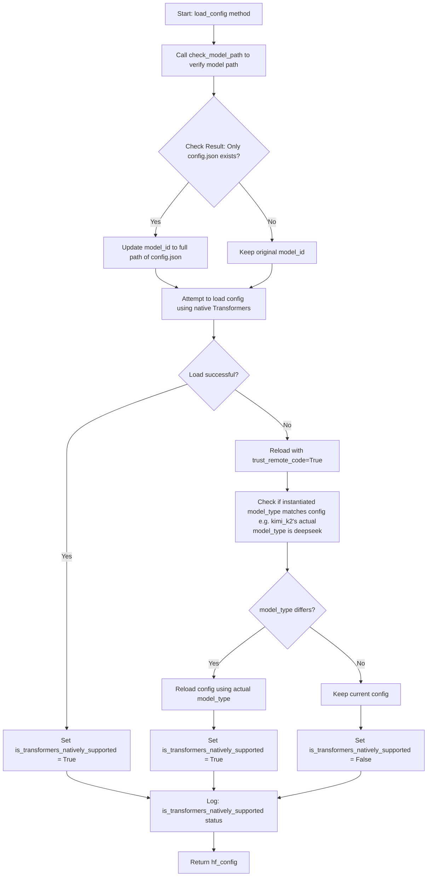
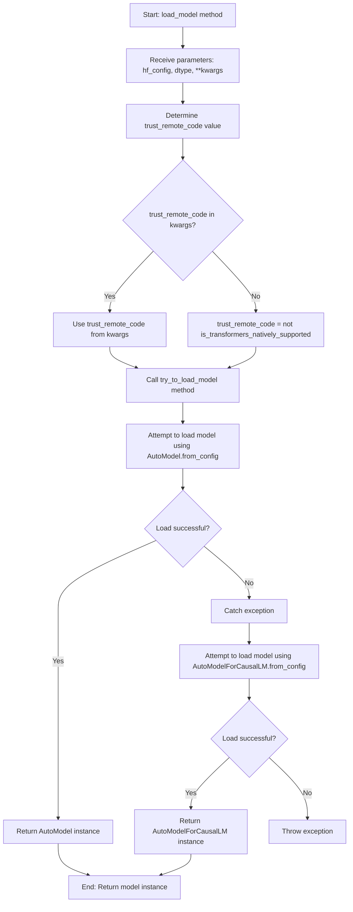

# RFC: General Model and Configuration Loading Optimization Proposal

## Metadata

| Item | Details |
|:-----|:--------|
| **Status** | Completed |
| **Author** | wqh17101 |
| **Creation Date** | 2025-12-19 |
| **Last Updated** | 2025-12-29 |
| **Related Links** | [1. Optimize model and config loading logic 2. Add model_type support for mapping (remove model_id mapping later)](https://gitcode.com/Ascend/msit/pull/4845)<br/><br/>[Add Xiaomi model loading, fix reload config logic & adaptive LMHead addition & DT synchronization & optimize quantization logic](https://gitcode.com/Ascend/msit/pull/4880)<br/><br/>[Core Module Refactoring: Rebuild model configuration loading, execution, etc. around tensor_cast/core/](https://gitcode.com/Ascend/msit/pull/4906) |

---

## 1. Overview

This proposal aims to address insufficient capabilities in model loading and general configuration loading within the project. The solution focuses on optimizing the architecture and configuration, removing redundant configurations, adopting adaptive methods for automatic configuration whenever possible, and maximizing the reuse of transformers library capabilities.

**Latest Progress**: Core module refactoring has been completed, rebuilding model configuration loading, execution, and other logic around the `tensor_cast/core/` directory, achieving clearer separation of responsibilities and a more flexible configuration system.

## 2. Detailed Design

### 2.0 Core Module Refactoring

The refactored core architecture revolves around the `tensor_cast/core/` directory and includes the following components:



#### 2.0.1 Core Component Descriptions

**1. UserInputConfig** ([user_config.py](../../tensor_cast/core/user_config.py))

- User input configuration class containing all user-configurable parameters
- Supports device configuration, model configuration, parallel configuration, quantization configuration, etc.
- Provides `get_parallel_config()` and `get_quant_config()` methods to generate runtime configurations

**2. ConfigResolver** ([config_resolver.py](../../tensor_cast/core/config_resolver.py))

- Configuration resolver responsible for converting user input into runtime configuration
- Uses `AutoModelConfigLoader` to load HuggingFace configuration
- Automatically parses and configures special modules like MoE, MLA, MTP
- Supports automatic matching of model features based on `model_type`

**3. ModelRunner** ([model_runner.py](../../tensor_cast/core/model_runner.py))

- Model runner responsible for executing inference and collecting performance metrics
- Encapsulates initialization logic for device configuration, performance model, model construction, etc.
- Provides `run_inference()` method to execute inference and return detailed performance metrics

**4. build_model()** ([model_builder.py](../../tensor_cast/core/model_builder.py))

- Model construction entry function
- Coordinates ConfigResolver and TransformerModel to complete model construction
- Supports optional torch.compile compilation

**5. RequestInfo & ModelRunnerMetrics** ([input_generator.py](../../tensor_cast/core/input_generator.py))

- `RequestInfo`: Encapsulates request information (query_len, seq_len, concurrency, etc.)
- `ModelRunnerMetrics`: Encapsulates inference performance metrics (memory usage, execution time, etc.)

#### 2.0.2 Configuration Loading Flow



#### 2.0.3 Model Type Mapping

After refactoring, `model_type` is used as the key for model feature mapping, supporting the following mappings:

- **MoE Configuration Mapping** ([utils.py](../../tensor_cast/transformers/utils.py)):
  - `deepseek_v3` → `DeepseekV3MoE`
  - `glm4_moe` → `Glm4MoeMoE`
  - `minimax_m2` → `MiniMaxM2SparseMoeBlock`
  - `qwen3_moe` → `Qwen3MoeSparseMoeBlock`
  - `qwen3_next` → `Qwen3NextSparseMoeBlock`
  - `mimo_v2_flash` → `MiMoV2MoE`
  - `ernie4_5_moe` → `Ernie4_5_MoeSparseMoeBlock`

- **MLA Module Mapping** ([utils.py](../../tensor_cast/transformers/utils.py)):
  - `deepseek_v3` → `DeepseekV3Attention`

- **MTP Module Mapping** ([utils.py](../../tensor_cast/transformers/utils.py)):
  - `deepseek_v3` → `DeepseekV3DecoderLayer`
  - `glm4_moe` → `Glm4MoeDecoderLayer`
  - `mimo_v2_flash` → `MiMoV2DecoderLayer`

### 2.1 Original Design (Refactored)

To ensure single responsibility, we designed an independent `AutoModelConfigLoader` class to implement functions of loading models and loading general configurations.
For model structure registration and mapping, `model_type` should be used as the key instead of `model_id`.
`ModelConfig` refactoring

#### 2.1.1 General Configuration Files

For standard `config.json`, we use `AutoConfig.from_pretrained` method for reading.



#### 2.1.2 General Model Loading

We use `AutoModel` or `AutoModelForCausalLM` for loading, where `AutoModelForCausalLM = AutoModelWithLMHead`.



### 2.2 Alternative Solutions

1. **Maintain Status Quo**: Continue managing model and config loading functions across various modules
   - **Disadvantages**: Will lead to more circular dependency issues, difficult to maintain and extend

2. **Use Inheritance Instead of Composition**: Extend model loading functionality through inheritance
   - **Disadvantages**: Increases complexity of class hierarchy, less flexible

### 2.3 Solution Analysis

#### Advantages of Proposed Solution

1. Solves circular dependency issues between modules, improving code quality
2. Improves model type recognition, enhancing system compatibility
3. Follows single responsibility principle, improving code maintainability
4. Adopts layered architecture design, facilitating extension and maintenance
5. Supports configuration-driven approach, enhancing system flexibility
6. **After core module refactoring**: Clearer separation of responsibilities, more flexible configuration system, easier to extend new model types

#### Limitations of Proposed Solution

1. Requires updating existing model and config loading usage patterns
2. Adds new modules, requiring corresponding documentation and training
3. Requires large-scale refactoring of existing code

## 3. Implementation Plan

### General config and model loading refactoring

- [x] Extract a model loader class for responsibility separation
- [x] Support model loading for various scenarios
- [x] Use model_type instead of model_id as key for model structure mapping dictionary
- [x] Unify use of ModelRunner
- [ ] generate_input normalization (generate_inputs_varlen)
- [x] Implement ConfigResolver configuration resolver
- [x] Implement build_model model construction function
- [x] Implement ModelRunner model runner

### ModelConfig refactoring

- [x] Remove enable_lmhead
- [x] Remove disable_auto_map
- [x] Remove hf_config_json
- [x] Add num_hidden_layers_override support
- [x] Add enable_repetition support
- [x] Improve MoE, MLA, MTP configurations

### User Interaction Refactoring

- [x] Implement UserInputConfig unified user input configuration
- [x] Support parallel configuration (TP, DP, PP, EP)
- [x] Support quantization configuration (Linear, Attention)
- [x] Support special module configuration (MoE, MLA, MTP)

### Core Module Refactoring (Completed 2025-12-29)

- [x] Create tensor_cast/core/ directory
- [x] Implement UserInputConfig configuration class
- [x] Implement ConfigResolver configuration resolver
- [x] Implement ModelRunner model runner
- [x] Implement build_model model construction function
- [x] Implement RequestInfo and ModelRunnerMetrics data classes
- [x] Implement quantization configuration creation functions (create_quant_config, etc.)
- [x] Implement input generation functions (generate_inputs, generate_inputs_varlen)
- [x] Unify model type mapping (model_type → MoE/MLA/MTP configuration)

---

## Technical Implementation Details

### Core Components

#### AutoModelConfigLoader

This class serves as the central hub for all configuration and model loading operations:

- **Configuration Loading**: Handles various configuration formats and sources
- **Model Loading**: Supports different model architectures and loading strategies
- **Intelligent Fallback**: Automatically attempts native support and trust_remote_code modes
- **Type Detection**: Automatically detects and corrects model_type inconsistencies

#### ConfigResolver

Configuration resolver responsible for coordinating configuration loading and transformation:

- **Automatic Configuration**: Automatically matches MoE, MLA, MTP configurations based on model_type
- **User Override**: Supports user-specified configuration overrides
- **Parallel Configuration**: Automatically calculates and validates parallel configurations
- **Quantization Configuration**: Supports multiple quantization strategies and granularities

#### ModelRunner

Model runner encapsulating inference execution and performance analysis:

- **Initialization Management**: Unified management of device, performance model, model construction
- **Inference Execution**: Supports single and batch inference
- **Performance Collection**: Automatically collects memory, time, and other performance metrics
- **Result Output**: Provides detailed performance analysis reports

#### TransformerModel

Model builder responsible for model loading and transformation:

- **Model Loading**: Uses AutoModelConfigLoader to load HuggingFace models
- **Model Wrapping**: Unifies model interface, supports CausalLM and regular models
- **Module Replacement**: Automatically replaces special modules like MoE, MLA, MTP
- **Model Quantization**: Supports multiple quantization strategies
- **Model Sharding**: Supports parallel strategies like TP, EP

### Key Design Principles

1. **Single Responsibility**: Each component has a clear, focused purpose
2. **Extensibility**: New model architectures can be easily integrated
3. **Compatibility**: Works synergistically with existing transformers library features
4. **Performance**: Optimized for production environments
5. **Maintainability**: Clear separation of concerns reduces complexity
6. **Automation**: Automatically infers configurations whenever possible to reduce user configuration burden

### Migration Strategy

Implementation follows a phased approach:

1. Core infrastructure setup (Completed)
2. Configuration system unification (Completed)
3. Model loading integration (Completed)
4. User interface optimization (Completed)
5. Performance validation and tuning (In Progress)

### Configuration Examples

#### Basic Usage

```python
from tensor_cast.core import ModelRunner, UserInputConfig

# Create user configuration
user_input = UserInputConfig(
    device="TEST_DEVICE",
    model_id="Qwen/Qwen3-32B",
    num_queries=2,
    query_len=10,
    context_length=100,
)

# Create model runner
runner = ModelRunner(user_input)

# Execute inference
result = runner.run_inference()
```

#### Advanced Configuration

```python
# Support parallel configuration
user_input = UserInputConfig(
    model_id="deepseek-ai/DeepSeek-V3",
    world_size=8,
    tp_size=2,
    pp_size=2,
    dp_size=2,
    ep=True,
)

# Support quantization configuration
user_input = UserInputConfig(
    model_id="deepseek-ai/DeepSeek-V3",
    quantize_linear_action=QuantizeLinearAction.W8A8_DYNAMIC,
    quantize_attention_action=QuantizeAttentionAction.INT8,
    quantize_lmhead=False,
)

# Support special module configuration
user_input = UserInputConfig(
    model_id="deepseek-ai/DeepSeek-V3",
    num_mtp_tokens=4,
    enable_redundant_experts=True,
    enable_external_shared_experts=True,
)
```

### Directory Structure

```text
tensor_cast/
├── core/                      # Core modules
│   ├── config_resolver.py     # Configuration resolver
│   ├── input_generator.py     # Input generator (contains RequestInfo)
│   ├── model_builder.py       # Model builder (contains build_model)
│   ├── model_runner.py        # Model runner (contains ModelRunnerMetrics)
│   ├── user_config.py         # User input configuration class
│   ├── utils.py               # Utility functions
│   └── quantization/          # Quantization configuration
│       ├── config.py          # Quantization configuration creation functions
│       └── datatypes.py       # Quantization datatype definitions
├── transformers/              # Transformers integration
│   ├── model.py               # TransformerModel
│   └── utils.py               # AutoModelConfigLoader, model type mappings, etc.
├── model_config.py            # Configuration data classes
├── layers/                    # Custom layer implementations
├── ops/                       # Custom operators
└── ...
```

This RFC represents a significant architectural improvement that will enhance system flexibility, maintainability, and performance while providing better support for different model types. The core module refactoring has been completed, achieving clearer separation of responsibilities and a more flexible configuration system.
