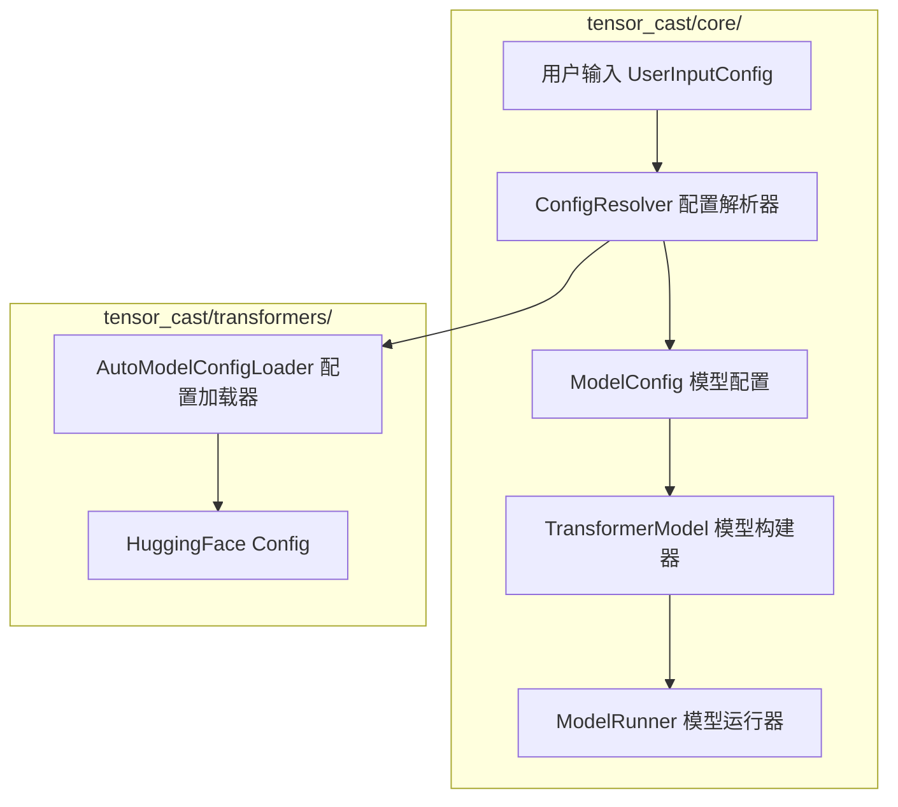
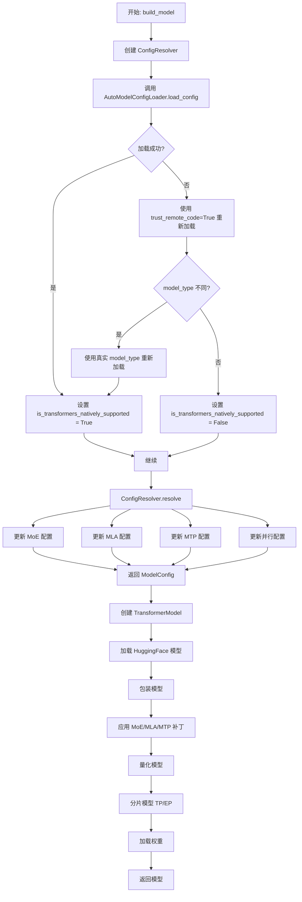
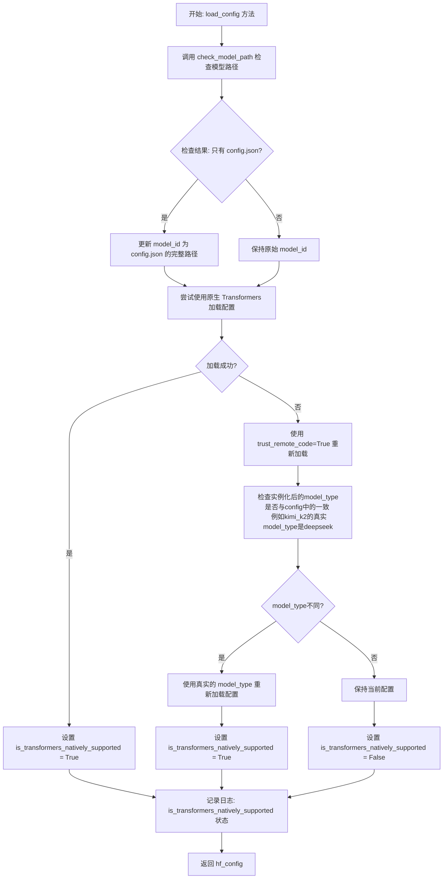
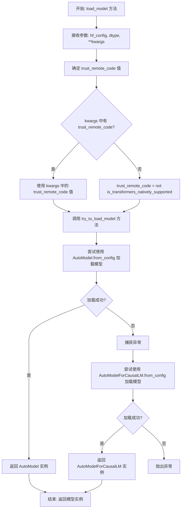

# RFC: 通用模型加载与配置加载优化方案

## 元数据

| 项目 | 内容 |
|:-----|:--------|
| **状态** | 已完成 |
| **作者** | wqh17101 |
| **创建日期** | 2025-12-19 |
| **最后更新** | 2025-12-29 |
| **相关链接** | [1.优化模型和配置加载逻辑 2.映射增加model_type支持（后续移除model_id的映射）](https://gitcode.com/Ascend/msit/pull/4845)<br/><br/>[增加小米模型加载，修正reload config逻辑&自适应增加LMHead & DT 同步适配&优化量化逻辑](https://gitcode.com/Ascend/msit/pull/4880)<br/><br/>[核心模块重构：围绕 tensor_cast/core/ 重建模型配置加载、运行等逻辑](https://gitcode.com/Ascend/msit/pull/4906) |

---

## 1. 概述

本提案旨在解决项目中的模型加载和通用配置加载能力不足的问题。方案专注于优化架构和配置，删除冗余配置，尽可能采用自适应方法进行自动配置，并最大化复用transformers库的能力。

**最新进展**：已完成核心模块重构，围绕 `tensor_cast/core/` 目录重建了模型配置加载、运行等逻辑，实现了更清晰的职责分离和更灵活的配置系统。

## 2. 详细设计

### 2.0 核心模块重构

重构后的核心架构围绕 `tensor_cast/core/` 目录展开，主要包含以下组件：



#### 2.0.1 核心组件说明

**1. UserInputConfig** ([user_config.py](../../tensor_cast/core/user_config.py))

- 用户输入配置类，包含所有用户可配置的参数
- 支持设备配置、模型配置、并行配置、量化配置等
- 提供 `get_parallel_config()` 和 `get_quant_config()` 方法生成运行时配置

**2. ConfigResolver** ([config_resolver.py](../../tensor_cast/core/config_resolver.py))

- 配置解析器，负责将用户输入转换为运行时配置
- 使用 `AutoModelConfigLoader` 加载 HuggingFace 配置
- 自动解析并配置 MoE、MLA、MTP 等特殊模块
- 支持根据 `model_type` 自动匹配模型特性

**3. ModelRunner** ([model_runner.py](../../tensor_cast/core/model_runner.py))

- 模型运行器，负责执行推理并收集性能指标
- 封装了设备配置、性能模型、模型构建等初始化逻辑
- 提供 `run_inference()` 方法执行推理并返回详细的性能指标

**4. build_model()** ([model_builder.py](../../tensor_cast/core/model_builder.py))

- 模型构建入口函数
- 协调 ConfigResolver 和 TransformerModel 完成模型构建
- 支持可选的 torch.compile 编译

**5. RequestInfo & ModelRunnerMetrics** ([input_generator.py](../../tensor_cast/core/input_generator.py))

- `RequestInfo`: 封装请求信息（query_len、seq_len、concurrency等）
- `ModelRunnerMetrics`: 封装推理性能指标（内存使用、执行时间等）

#### 2.0.2 配置加载流程



#### 2.0.3 模型类型映射

重构后使用 `model_type` 作为键值进行模型特性映射，支持以下映射：

- **MoE 配置映射** ([utils.py](../../tensor_cast/transformers/utils.py)):
  - `deepseek_v3` → `DeepseekV3MoE`
  - `glm4_moe` → `Glm4MoeMoE`
  - `minimax_m2` → `MiniMaxM2SparseMoeBlock`
  - `qwen3_moe` → `Qwen3MoeSparseMoeBlock`
  - `qwen3_next` → `Qwen3NextSparseMoeBlock`
  - `mimo_v2_flash` → `MiMoV2MoE`
  - `ernie4_5_moe` → `Ernie4_5_MoeSparseMoeBlock`

- **MLA 模块映射** ([utils.py](../../tensor_cast/transformers/utils.py)):
  - `deepseek_v3` → `DeepseekV3Attention`

- **MTP 模块映射** ([utils.py](../../tensor_cast/transformers/utils.py)):
  - `deepseek_v3` → `DeepseekV3DecoderLayer`
  - `glm4_moe` → `Glm4MoeDecoderLayer`
  - `mimo_v2_flash` → `MiMoV2DecoderLayer`

### 2.1 原有设计（已重构）

为确保职责单一，我们设计了一个独立的`AutoModelConfigLoader`类来实现加载模型、加载通用配置的功能。
对于模型结构的注册和映射，应该采用`model_type`作为键值而非`model_id`。
`ModelConfig`重构

#### 2.1.1 通用配置文件

对于标准的`config.json`，我们使用`AutoConfig.from_pretrained`方法进行读取。



#### 2.1.2 通用模型加载

我们使用`AutoModel`或`AutoModelForCausalLM`进行加载，两者的区别在于`AutoModelForCausalLM = AutoModelWithLMHead`。



### 2.2 替代方案

1. **保持现状**：继续在各个模块中分散管理模型和配置加载功能
   - **缺点**：会导致更多的循环依赖问题，难以维护和扩展

2. **使用继承而非组合**：通过继承的方式扩展模型加载功能
   - **缺点**：增加了类层次结构的复杂性，不够灵活

### 2.3 方案分析

#### 主推方案优点

1. 解决了模块间的循环依赖问题，提高了代码质量
2. 改进了模型类型识别，提高了系统的兼容性
3. 遵循单一职责原则，提高了代码的可维护性
4. 采用分层架构设计，便于扩展和维护
5. 支持配置驱动，提高了系统的灵活性
6. **核心模块重构后**：职责分离更清晰，配置系统更灵活，易于扩展新模型类型

#### 主推方案局限性

1. 需要更新现有的模型和配置加载使用方式
2. 增加了新的模块，需要相应的文档和培训
3. 需要对现有代码进行较大规模的重构

## 3. 实施计划

### 通用config和model加载改造

- [x] 抽取一个模型加载类，职责分离
- [x] 支持各种场景的模型加载
- [x] 使用model_type而非model_id作为模型结构映射字典的key
- [x] 统一使用ModelRunner
- [ ] generate_input 归一化（generate_inputs_varlen）
- [x] 实现ConfigResolver配置解析器
- [x] 实现build_model模型构建函数
- [x] 实现ModelRunner模型运行器

### ModelConfig重构

- [x] 删除enable_lmhead
- [x] 删除disable_auto_map
- [x] 删除hf_config_json
- [x] 添加num_hidden_layers_override支持
- [x] 添加enable_repetition支持
- [x] 完善MoE、MLA、MTP配置

### 用户交互重构

- [x] 实现UserInputConfig统一用户输入配置
- [x] 支持并行配置（TP、DP、PP、EP）
- [x] 支持量化配置（Linear、Attention）
- [x] 支持特殊模块配置（MoE、MLA、MTP）

### 核心模块重构（2025-12-29完成）

- [x] 创建 tensor_cast/core/ 目录
- [x] 实现 UserInputConfig 配置类
- [x] 实现 ConfigResolver 配置解析器
- [x] 实现 ModelRunner 模型运行器
- [x] 实现 build_model 模型构建函数
- [x] 实现 RequestInfo 和 ModelRunnerMetrics 数据类
- [x] 实现量化配置创建函数（create_quant_config等）
- [x] 实现输入生成函数（generate_inputs、generate_inputs_varlen）
- [x] 统一模型类型映射（model_type → MoE/MLA/MTP配置）

---

## 技术实现细节

### 核心组件

#### AutoModelConfigLoader

此类作为所有配置和模型加载操作的中心枢纽：

- **配置加载**：处理各种配置格式和来源
- **模型加载**：支持不同的模型架构和加载策略
- **智能回退**：自动尝试原生支持和 trust_remote_code 模式
- **类型检测**：自动检测并修正 model_type 不一致的情况

#### ConfigResolver

配置解析器，负责协调配置加载和转换：

- **自动配置**：根据 model_type 自动匹配 MoE、MLA、MTP 配置
- **用户覆盖**：支持用户指定的配置覆盖
- **并行配置**：自动计算并验证并行配置
- **量化配置**：支持多种量化策略和粒度

#### ModelRunner

模型运行器，封装推理执行和性能分析：

- **初始化管理**：统一管理设备、性能模型、模型构建
- **推理执行**：支持单次和批量推理
- **性能收集**：自动收集内存、时间等性能指标
- **结果输出**：提供详细的性能分析报告

#### TransformerModel

模型构建器，负责模型加载和转换：

- **模型加载**：使用 AutoModelConfigLoader 加载 HuggingFace 模型
- **模型包装**：统一模型接口，支持 CausalLM 和普通模型
- **模块替换**：自动替换 MoE、MLA、MTP 等特殊模块
- **模型量化**：支持多种量化策略
- **模型分片**：支持 TP、EP 等并行策略

### 关键设计原则

1. **单一职责**：每个组件都有明确、专注的用途
2. **可扩展性**：新模型架构可以轻松集成
3. **兼容性**：与现有transformers库功能协同工作
4. **性能**：针对生产环境优化
5. **可维护性**：清晰的关注点分离降低了复杂性
6. **自动化**：尽可能自动推断配置，减少用户配置负担

### 迁移策略

实现遵循分阶段方法：

1. 核心基础设施搭建（已完成）
2. 配置系统统一（已完成）
3. 模型加载集成（已完成）
4. 用户界面优化（已完成）
5. 性能验证和调优（进行中）

### 配置示例

#### 基本使用

```python
from tensor_cast.core import ModelRunner, UserInputConfig

# 创建用户配置
user_input = UserInputConfig(
    device="TEST_DEVICE",
    model_id="Qwen/Qwen3-32B",
    num_queries=2,
    query_len=10,
    context_length=100,
)

# 创建模型运行器
runner = ModelRunner(user_input)

# 执行推理
result = runner.run_inference()
```

#### 高级配置

```python
# 支持并行配置
user_input = UserInputConfig(
    model_id="deepseek-ai/DeepSeek-V3",
    world_size=8,
    tp_size=2,
    pp_size=2,
    dp_size=2,
    ep=True,
)

# 支持量化配置
user_input = UserInputConfig(
    model_id="deepseek-ai/DeepSeek-V3",
    quantize_linear_action=QuantizeLinearAction.W8A8_DYNAMIC,
    quantize_attention_action=QuantizeAttentionAction.INT8,
    quantize_lmhead=False,
)

# 支持特殊模块配置
user_input = UserInputConfig(
    model_id="deepseek-ai/DeepSeek-V3",
    num_mtp_tokens=4,
    enable_redundant_experts=True,
    enable_external_shared_experts=True,
)
```

### 目录结构

```text
tensor_cast/
├── core/                      # 核心模块
│   ├── config_resolver.py     # 配置解析器
│   ├── input_generator.py     # 输入生成器（包含 RequestInfo）
│   ├── model_builder.py       # 模型构建器（包含 build_model）
│   ├── model_runner.py        # 模型运行器（包含 ModelRunnerMetrics）
│   ├── user_config.py         # 用户输入配置类
│   ├── utils.py               # 通用工具函数
│   └── quantization/          # 量化配置
│       ├── config.py          # 量化配置创建函数
│       └── datatypes.py       # 量化数据类型定义
├── transformers/              # Transformers集成
│   ├── model.py               # TransformerModel
│   └── utils.py               # AutoModelConfigLoader、模型类型映射等
├── model_config.py            # 配置数据类
├── layers/                    # 自定义层实现
├── ops/                       # 自定义算子
└── ...
```

本RFC代表了重大的架构改进，将增强系统的灵活性、可维护性和性能，同时为不同模型类型提供更好的支持。核心模块重构已完成，实现了更清晰的职责分离和更灵活的配置系统。
