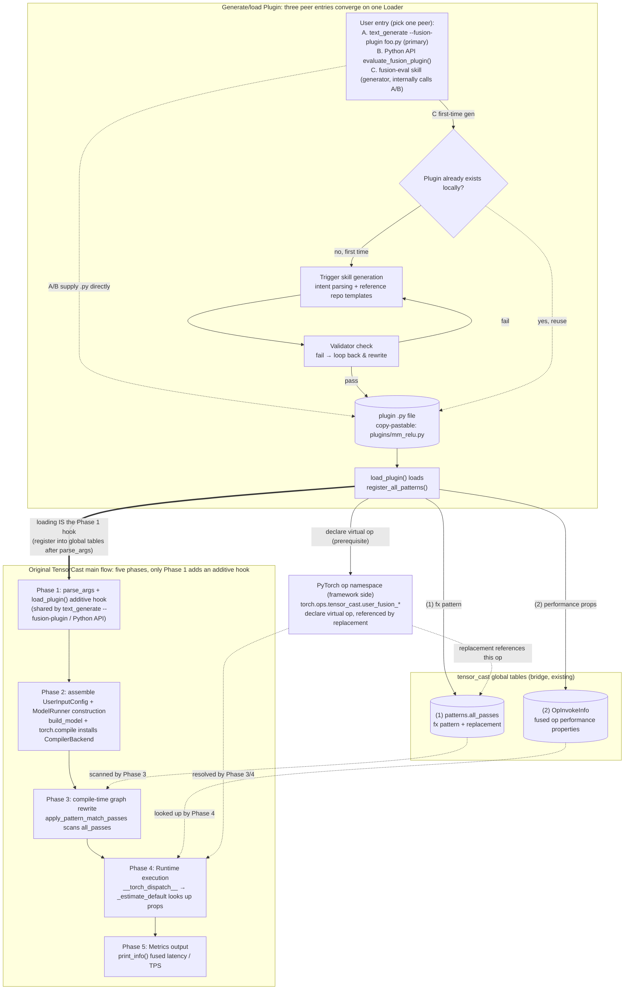

# RFC: User-Defined Fusion Op Performance Evaluation v2 (Plugin Mode)

## Metadata

| Field | Value |
| :--- | :--- |
| **Status** | Draft |
| **Author** | HDY |
| **Created** | 2026-05-30 |
| **Related** | `rfc_swiglu_fusion_support_en.md`, `performance_database_collection_tooling.md` |

---

## 1. Background & Problem

### 1.1 Current Pain Points

The "extreme performance tuning guidance" use case of the simulation tool needs the ability to "estimate whole-model E2E time after a specified fusion". Current situation:

| # | Problem | Impact |
|---|---------|--------|
| 1 | Fusion passes are all hand-written fx patterns | Requires domain experts; adding new op combinations is costly |
| 2 | No tool can quickly answer "given a fusion set, how fast is whole-model E2E" | To try a fusion combination, you must wait until the fx pattern + AscendC kernel are fully implemented before running ModelRunner — very slow feedback |

### 1.2 Scope: Plugin Mode

> **Recommended**: run this RFC with the default `--performance-model analytic` (no need to pass it explicitly). The profiling mode runs and won't fail, but the fused segment falls back to roofline and gets mixed with surrounding profiling-hit ops, causing an inconsistent estimation basis.
>
> **Required**: Plugin Mode must run with `--compile` (i.e. `do_compile=True`). The fusion is a compile-time fx graph rewrite (Phase 3); without `torch.compile` the `CompilerBackend` is never installed, the plugin's pattern registers but never fires, and the estimate silently equals the no-plugin baseline. All three entries enforce this: the CLI `--fusion-plugin` without `--compile` is an error (§3.3a), the Python API sets `do_compile=True` for you (§4.2), and the skill always passes it (§3.4 step 4).

This RFC provides a **Plugin Mode** whose core idea is to **decouple** "defining a fusion" from "running one analysis":

- **Deliverable = a self-contained, copy-pastable plugin `.py`**. It packages a fusion's complete definition (virtual op declaration + pattern/replacement + props functor) into a single file, depends only on the repo's public APIs, and **depends on no skill**. Copy it to another user, drop it into their plugin directory, and it works.
- **Running goes through standard, peer entries**: once the Loader registers the plugin into the global tables, it can be run via any of **(A) the `text_generate` CLI `--fusion-plugin` hook** (primary path, gets the CLI's full power directly), **(B) the Python API `evaluate_fusion_plugin()`** (automation/notebook), or **(C) the `fusion-eval` skill** (a convenience generator, see below). All three share the same Loader/Validator base.
- **The `fusion-eval` skill is a "generator", not the sole harness**: on first evaluation the skill parses intent, generates and validates the plugin, **runs one E2E for you** (internally calling the standard CLI/API), and hands back the copy-pastable plugin `.py` plus an equivalent CLI command, so you can later rerun it yourself via the CLI / your own private skill / the API.

> **Why this trade-off**: the original design ("CLI untouched, skill as the sole entry") demoted the plugin to a second-class citizen usable only from a custom entry — it could not be handed to another user or composed into the user's existing CLI / throughput_optimizer flow. Adding **one additive** load hook to the CLI is better than "untouched": fully backward compatible, while making the plugin a first-class, independently reusable deliverable.

User-facing flow (for the user who initiates the evaluation; **still one step by default**):

1. **Give the fusion to try**: provide an op sequence (e.g. `aten.mm, aten.relu`) or a YAML rule file to the `fusion-eval` skill or Python API to trigger generation (full entry semantics in §3); if a plugin already exists, just supply the `.py` via the §3.3a CLI `--fusion-plugin`, no skill needed
2. **Skill generates & validates the plugin**: on first call the `fusion-eval` skill generates the `.py` referencing the repo's built-in plugin templates; once the Validator passes (static + runtime) it lands in the local plugin directory; if a matching plugin already exists, generation is skipped (Phase 0)
3. **Load the plugin & launch ModelRunner**: the Loader registers the plugin into the global tables before ModelRunner construction (the skill goes through the §3.3 Python API, equivalent to CLI `--fusion-plugin`), then runs one normal inference, identical to running without fusion (Phase 1)
4. **Read the fused E2E + get the copy-pastable artifact**: `ModelRunner.print_info()` prints the fused latency / TPS (Phase 2-5); the skill also hands back the plugin `.py` and an equivalent CLI command

> The user does not need to hand-write fx patterns, modify model code, or manually construct ModelRunner; how the plugin registers into the compilation flow is in §2. The fused E2E is emitted naturally by ModelRunner's standard metrics (the fx graph is already rewritten at compile time). For baseline comparison see §5.3. Another user who receives the plugin needs **no skill** — a single `text_generate --fusion-plugin <name>.py --compile ...` reproduces it (see §3.3a).

**Core flow** (top-to-bottom is the actual run order; left = plugin generation & loading, right = the original TensorCast main flow with zero changes, bridged by the global tables. The three peer entries CLI / API / skill all converge on the same Loader):



**Key points**:

- **Additive CLI hook (non-invasive extension)**: the original `text_generate` only **adds one** `--fusion-plugin` flag (optional, defaults to None — omit it and behavior is identical to today); after parse_args and before `ModelRunner` construction it calls `load_plugin()` to register into the global tables. Fully backward compatible, and it makes the CLI a first-class run entry for plugins.
- **Three peer entries, copy-pastable plugin**: CLI / Python API / skill share the same Loader; the plugin `.py` is self-contained, so copying it to another user and dropping it into their plugin directory lets them run it via the CLI, with no skill dependency.
- **Zero change to the main flow**: the original TensorCast Phase 2-5 is identical to running without fusion; plugin artifacts are merely scanned by Phase 3/4 through the global tables.
- **First-time cost + local reuse**: the first call triggers skill generation and validation; if a matching local plugin exists, generation is skipped; once generated it becomes a copy-pastable asset and no longer needs the skill.

### 1.3 How a Fusion Op Works (prerequisite)

Before the Plugin protocol, clarify "what makes a fusion take effect in tensor_cast". A fusion op must satisfy three things simultaneously — be recognized and replaced at compile time, be dispatched at runtime, and yield a fused estimate:

1. **Declare the virtual op**: `register_tensor_cast_op(name)` registers `torch.ops.tensor_cast.<name>` into the PyTorch op namespace via `torch.library.custom_op`, with a meta implementation that only infers shape/dtype. This is the prerequisite for the next two steps — without this op, the replacement has nothing to reference.
2. **Compile-time graph rewrite**: `register_pattern(pattern, replacement, ...)` registers "match subgraph (e.g. `aten.relu(aten.mm(x,w))`) → replace with `tensor_cast.<name>(x,w)`" into `patterns.all_passes`. Phase 3's `apply_pattern_match_passes` traverses the fx graph and, at each hit, **replaces several low-level op nodes with one virtual op node** — this is the physical embodiment of "fusion" in the graph: many ops collapse into one.
3. **Runtime estimation**: the rewritten graph is dispatched op-by-op in Phase 4 via `Runtime.__torch_dispatch__`; when it hits `tensor_cast.<name>`, `OpInvokeInfo` looks up the `PerformanceProperties` registered for that op (`register_op_properties`) and computes the segment's cost via roofline `max(compute_time, memory_time)`, folding it into the whole-model E2E.

**Why fusion saves time**: the virtual op's schema declares only **boundary inputs and outputs**; intermediate tensors (e.g. the mm output) are **not in the schema**, so `get_memory_access_properties()` does not count their HBM read/write when bucketing — matching the physical meaning of "intermediate results stay in on-chip SRAM, never spilled to HBM". The memory-side bytes drop, so roofline time drops accordingly; `compute_ops` is accumulated from the low-level ops (mm's MMA + relu's elementwise), keeping the compute side accurate.

> The Plugin protocol (§2) simply packages the three steps above into one `.py` file: step 1 = virtual op declaration, step 2 = pattern+replacement, step 3 = props functor. The built-in swiglu / rms_norm are ready-made examples of these three steps.

---

## 2. Plugin Protocol

### 2.1 Standard Template

```python
# my_plugins/mm_relu.py
"""
Fusion op plugin: mm + relu epilogue
Purpose: evaluate E2E performance of GEMM + ReLU activation fusion
Generated by: fusion-eval skill
"""

import torch
from tensor_cast.utils import register_tensor_cast_op
from tensor_cast.performance_model.op_invoke_info import OpInvokeInfo
from tensor_cast.compilation.patterns import register_pattern

# ========== 0. Plugin namespace (prefix for the virtual op name) ==========
# The virtual op name MUST be "<__plugin_namespace__>_<pattern_name>" so two
# plugins of the same fusion type never clash. Teams override with their own
# prefix (e.g. "my_team"); when omitted the Validator (L1) injects the default
# "user_fusion". Here namespace "user_fusion" + name "mm_relu" → user_fusion_mm_relu.
__plugin_namespace__ = "user_fusion"

# Virtual op name: derived from namespace. All references below use this
# variable; renaming __plugin_namespace__ requires no manual sync.
_OP_NAME = f"{__plugin_namespace__}_mm_relu"

# ========== 1. Virtual op declaration ==========
@register_tensor_cast_op(_OP_NAME)
def _meta_impl(x: torch.Tensor, w: torch.Tensor) -> torch.Tensor:
    """Meta impl: infers shape/dtype only, no real compute"""
    return torch.empty(x.size(0), w.size(1), dtype=x.dtype, device="meta")

# ========== 2. FX Pattern + Replacement ==========
def _pattern(x, w):
    """Op sequence to match"""
    return torch.ops.aten.relu(torch.ops.aten.mm(x, w))

def _replacement(x, w):
    """Replaced virtual op"""
    return getattr(torch.ops.tensor_cast, _OP_NAME)(x, w)

# ========== 3. Performance properties ==========
@OpInvokeInfo.register_op_properties(
    getattr(torch.ops.tensor_cast, _OP_NAME).default
)
def _performance_props(info: OpInvokeInfo) -> OpInvokeInfo.PerformanceProperties:
    """
    Performance model of the fused op:
    - boundary memory: auto-bucketed by schema (input/output)
    - compute_ops: accumulate the low-level ops' compute
    - spill: auto-computed when exceeding on-chip buffer
    """
    x, w = info.args
    m, k, n = x.size(0), x.size(1), w.size(1)

    props = info.get_memory_access_properties()
    props.compute_ops[x.dtype] = OpInvokeInfo.ComputeOps(
        mma_ops=m * n * k * 2,  # mm FMA ops
        gp_ops=m * n,           # relu elementwise compare
    )
    return props

# ========== 4. Plugin entry ==========
def register_all_patterns():
    """Plugin Loader calls this to complete registration"""
    example_inputs = [
        torch.empty(1, 1, dtype=torch.float16, device="meta"),
        torch.empty(1, 1, dtype=torch.float16, device="meta"),
    ]
    register_pattern(
        # Use namespace prefix to avoid collision: two plugins with name="mm_relu"
        # would trigger ValueError('Pattern already registered') on second load.
        name=_OP_NAME,
        pattern=_pattern,
        replacement=_replacement,
        example_inputs=example_inputs,
        # level=0 (default): stand-alone base pattern.
        # Use level=1 if your pattern matches a subgraph that includes a virtual
        # op produced by a level-0 pattern (e.g. add_rms_norm after rms_norm).
    )

# ========== 5. Metadata (optional, for docs/debug) ==========
__plugin_meta__ = {
    "ops": ["aten.mm", "aten.relu"],
    "dtype_support": ["fp16", "bf16"],
    "notes": "GEMM + ReLU activation fusion, for MLP layers",
    "generated_by": "fusion-eval skill",
    "created_at": "2026-05-30",
    "plugin_schema_version": "1.0",  # required for loader version check (§9.4)
}
```

### 2.2 Registration API Overview

A plugin calls the APIs below; artifacts land in the existing in-process global structures (the same ones used by the built-in swiglu / rms_norm), writing no new files:

| API (source) | Purpose | Artifact produced | Stored where (in-process global) | Required |
|-----|---------|-------------------|----------------------------------|----------|
| `register_tensor_cast_op(name)`<br/>(`tensor_cast/utils.py`) | Declare virtual fusion op | virtual op + meta/fake impl | `torch.ops.tensor_cast.<name>` (`custom_op` namespace) | Yes |
| `register_pattern(...)`<br/>(`compilation/patterns/__init__.py`) | Register fx pattern+replacement | `(pattern, replacement)` tuple | `patterns.all_passes[level].pattern_replacements[name]`<br/>**`level`**: 0 = base patterns (default, e.g. swiglu, rms_norm core); 1 = composite patterns that depend on level-0 results (e.g. add_rms_norm, which expects the inner rms_norm already fused); 2 = post-processing. Use level=0 for stand-alone fusions; use level=1 when your pattern matches a subgraph that includes a level-0 virtual op. | Yes |
| `OpInvokeInfo.register_op_properties(op)`<br/>(`performance_model/op_invoke_info.py`) | Register performance-property functor | props functor | `OpInvokeInfo._op_properties_functors[op]` (class-level dict) | Yes |
| `register_op_estimator(op, device)`<br/>(`performance_model/op_estimator_registry.py`) | Custom estimator | estimator function | `_op_estimator_table[device][op]` (module-level dict) | Optional |

> These are all **in-process in-memory registries**, lifetime = process lifetime, **not persisted to files**; the plugin's `.py` source is the only on-disk artifact. Compile-time Phase 3 scans `all_passes` and runtime Phase 4 looks up `_op_properties_functors` to consume these in-memory artifacts (see §1.3).

### 2.3 Naming Conventions

**Virtual op naming**:

- Format: `<__plugin_namespace__>_<name>` — the plugin's `__plugin_namespace__` prefix joined with the fusion name
- Namespace: `torch.ops.tensor_cast.<__plugin_namespace__>_*`
- Conflict resolution: the prefix comes from `__plugin_namespace__` (see §4.4). When the field is **omitted the Validator (L1) injects the default `user_fusion`**, so a lone plugin still works; teams shipping multiple plugins of the same fusion type **should set a unique prefix** (e.g. `my_team`) to avoid an op-name clash. The final virtual op name is always `torch.ops.tensor_cast.<__plugin_namespace__>_<name>`.

**Pattern naming**:

- Format: `<__plugin_namespace__>_<fusion_type>` (same namespace prefix as the virtual op name, to avoid collision when two plugins use the default template)
- Examples: `user_fusion_mm_relu`, `my_team_attention_layernorm`

---

## 3. User Input Interface

### 3.1 Natural-Language Input (recommended)

Via the `fusion-eval` skill (a pure-file convention of `SKILL.md` + accompanying prompts, tool-agnostic; runnable in any agent environment that supports the skill protocol, e.g. Claude Code):

```bash
# Form 1: concise command
/fusion-eval mm+relu fp16 Qwen3-32B

# Form 2: natural description
"evaluate the fusion of attention output followed by layernorm, on Qwen3-32B prefill"

# Form 3: explicit parameters
/fusion-eval ops=aten.mm,aten.relu dtype=fp16 model=Qwen3-32B device=ATLAS_800_A3_752T_128G_DIE
```

All three forms are parsed into a uniform `{ops, dtype, model, device}` structure; the skill's full internal flow after receiving them is in §3.4.

### 3.2 YAML Rule File (batch scenario)

```yaml
# fusion_rules.yaml
schema_version: "2.0"

plugins:
  - name: mm_relu
    ops: [aten.mm, aten.relu]
    dtype: [fp16, bf16]
    notes: "GEMM + ReLU activation fusion"

  - name: attention_layernorm
    ops: [aten.scaled_dot_product_attention, aten.layer_norm]
    dtype: [fp16]
    notes: "Attention + LayerNorm fusion"
    # optional: generation params
    constraints:
      requires_shape_match: true
```

**Usage**: hand the YAML to the `fusion-eval` skill or Python API, which batch-generates/loads plugins per rule and estimates each (see §3.3); each generated plugin is equally reusable on its own via the §3.3a CLI `--fusion-plugin`. `evaluate_fusion_plugins` spawns an independent subprocess per plugin so metrics are not cross-contaminated (see §3.3 batch evaluation).

```python
from tensor_cast.plugin_framework import evaluate_fusion_plugins

metrics_list = evaluate_fusion_plugins(
    rules="fusion_rules.yaml",
    model_id="Qwen/Qwen3-32B",
    device="ATLAS_800_A3_752T_128G_DIE",
)
```

### 3.3 Python API (automation scenario)

```python
from tensor_cast.plugin_framework import evaluate_fusion_plugin

# single-plugin evaluation
metrics = evaluate_fusion_plugin(
    plugin_path="./plugins/mm_relu.py",
    model_id="Qwen/Qwen3-32B",
    device="ATLAS_800_A3_752T_128G_DIE",
    num_queries=1,
    query_len=128,
)
# ModelRunnerMetrics exposes per-model dicts (key = model_name), not scalars:
#   execution_time_s: Dict[str, float], tps_per_model: Dict[str, float]
metrics.print_info()  # or iterate the dicts yourself:
for name, t in metrics.execution_time_s.items():
    print(f"{name}: {t:.4f}s, TPS: {metrics.tps_per_model.get(name, 0):.2f}")

# batch evaluation (recommended: independent subprocess per plugin, no cross-contamination)
from pathlib import Path
from tensor_cast.plugin_framework import evaluate_fusion_plugins

metrics_list = evaluate_fusion_plugins(
    plugin_paths=[str(p) for p in Path("./plugins").glob("*.py")],
    model_id="Qwen/Qwen3-32B",
    device="ATLAS_800_A3_752T_128G_DIE",
)
# evaluate_fusion_plugins spawns an independent subprocess per plugin (reusing
# the §5.3 compare_with_baseline subprocess isolation), ensuring the Nth
# plugin's "fused E2E" reflects only that plugin's effect, not the cumulative
# effect of plugins 1..N.

# --- In-process loop (only for measuring combined effect, NOT individual gain) ---
# WARNING: plugin registration is process-level, one-way, and irrevocable (§4.4).
# Loading multiple plugins in the same process means the Nth plugin's "fused E2E"
# is actually the combined effect of plugins 1..N, not that plugin alone. To
# evaluate each fusion's independent gain, use evaluate_fusion_plugins() above
# (subprocess isolation).
# for plugin in plugins:
#     metrics = evaluate_fusion_plugin(str(plugin), model_id=..., device=...)
#     for name, t in metrics.execution_time_s.items():
#         print(f"{plugin.name} [{name}]: {t:.4f}s")
```

### 3.3a CLI Entry: `--fusion-plugin` (primary path for copy-pastable plugins)

Once generated, a plugin is a self-contained, copy-pastable asset that **no longer depends on the skill**. The `text_generate` CLI gains **one additive flag** `--fusion-plugin`, so any user who receives the `.py` (no agent environment, no skill needed) can reproduce the evaluation directly and naturally get the CLI's full power (parallelism, quantization, profiling mode, etc.):

```bash
# drop someone else's plugin into any directory; one command reproduces the fused E2E
text_generate Qwen/Qwen3-32B \
    --fusion-plugin ./plugins/mm_relu.py \
    --compile \
    --num-queries 8 --query-length 512 \
    --device ATLAS_800_A3_752T_128G_DIE
```

Semantics and constraints:

- **Additive, backward compatible**: `--fusion-plugin` is optional, defaults to `None`; omit it and the CLI behaves byte-for-byte like today. May be passed multiple times to load multiple plugins.
- **Load timing**: after `parse_args()` and before `ModelRunner` construction, it calls `load_plugin()` (the Loader dedups idempotently) to register the plugin into the global tables — sharing the same load logic as the Python API.
- **`--compile` guard**: passing `--fusion-plugin` without `--compile` is a CLI error (otherwise the pattern registers but never fires, and the estimate silently degrades to the no-plugin baseline; see §1.2).
- **Peer with skill / API**: all three entries produce a consistent basis; when the skill runs the E2E it calls this very CLI (or the equivalent API) and hands the command above back to the user.
- **Composable into private skills**: a user's existing private skill that wraps `text_generate` or `throughput_optimizer` only needs to add `--fusion-plugin` to its command line to incorporate fusion evaluation — no binding to `fusion-eval`.

### 3.4 fusion-eval Skill Implementation

The `fusion-eval` skill is a **convenience generator**, not the sole run harness. Supplying op names / YAML triggers it: in an agent environment supporting the skill protocol (e.g. Claude Code) it produces the plugin file per the protocol, runs the validator, then **runs one E2E for the user** (internally via the §3.3 Python API, equivalent to the §3.3a CLI `--fusion-plugin`), and hands back the **copy-pastable plugin `.py` plus an equivalent CLI command**. The skill internally doing the `parse_args` work (assembling `UserInputConfig`, setting `config.enable_*`, forcing `do_compile=True`) is merely the "run it the first time for you" convenience; afterwards the user can rerun via the CLI / their own private skill / the API, **no longer depending on this skill**. The skill itself still does not modify `text_generate` source — the CLI-side load capability is provided by the framework's single new `--fusion-plugin` hook (§3.3a / §6.2).

**Skill delivery form** (pure files, under `.agents/skills/fusion-eval/` per §7.1):

```text
fusion-eval/
├── SKILL.md              # entry: frontmatter (name/description) + workflow
├── generate-prompt.md    # prompt to generate the plugin (§2 protocol + skeleton rules)
├── validate-prompt.md    # prompt to run validator + loop-back fix
└── ref/
    ├── plugin-template.py # plugin .py skeleton template (per §2.1)
    └── pattern-examples/  # built-in swiglu / rms_norm as rewrite references
```

`SKILL.md` frontmatter uses `name: fusion-eval` + `description` (when to trigger); the body is the workflow below. The skill contains no executable code — it relies on prompts + refs to guide the agent to produce a protocol-compliant plugin; the validator and loader are repo-side Python code (§6.1 deliverables).

**Skill internal workflow**:

```text
1. Parse user intent
   ├─ extract op sequence (or infer from description)
   ├─ extract dtype / shape / model / device
   └─ ask the user to clarify when ambiguous

2. Produce plugin referencing repo examples
   ├─ read built-in plugins like compilation/patterns/swiglu.py as templates
   ├─ write my_plugins/<name>.py per the §2 Plugin protocol
   └─ include full fx pattern + replacement + performance properties

3. Call the validator
   ├─ static check (protocol compliance / correct API usage)
   ├─ runtime check (pattern matches a minimal fx graph / props returns valid)
   └─ on failure → feed the error back to itself, iterate on the plugin

4. Run one E2E (via a standard entry, not a custom harness)
   ├─ call §3.3 evaluate_fusion_plugin() (equivalent to §3.3a CLI --fusion-plugin):
   │   load_plugin(<name>.py) → register_all_patterns() writes global tables
   ├─ assemble UserInputConfig (model / device / num_queries / decode, etc.),
   │   set config.enable_*, and set do_compile=True (required — without
   │   torch.compile Phase 3 never runs and the fusion silently no-ops,
   │   see §1.2 / §4.2)
   └─ ModelRunner(user_input).run_inference() drives the main flow

5. Report results + hand back copy-pastable artifacts
   ├─ ModelRunner.print_info() latency / TPS
   ├─ whether the virtual op node appears in the fx graph
   ├─ baseline comparison (run the same config without the plugin in a separate process, see §4.4)
   └─ hand back the plugin .py path + equivalent CLI command for the user to reproduce later
```

**The Validator is the sole quality gatekeeper for plugins**. The biggest risk is the skill producing a plugin that "runs but estimates wrong" (the fx pattern literally mismatches the real graph → `match_count = 0`; the props function misses `compute_ops` → estimation bias). The Validator must do **reverse calibration**:

- **At least 4 baseline anchors**: have the skill rewrite the repo's existing `register_pattern`-based patterns — swiglu / rms_norm / rotary_embedding / rms_norm_quant_pattern (level=0; matches `rms_norm → quantize`, distinct from the level=1 `AddRMSNormQuantPattern` composite; at least these 4, covering both memory-bound and compute-bound) — and compare against measured results for the built-in patterns. All four reach `all_passes` via `register_pattern`, so the skill can reproduce them through the Plugin protocol; freezing passes like `grouped_matmul_swiglu` (a `GroupedMatmulSwigluPass`, not a `register_pattern` path) are deliberately excluded — the Plugin protocol cannot reproduce them, so they cannot validate skill-generated pattern quality.
- **Multiple samples + interval decision**: a single case meeting `|delta_pct| ≤ 10%` does not prove generation quality is stable. Run multiple shape/dtype groups per anchor with repeated measurements and decide by a **95% confidence interval** rather than a single point — an anchor passes only if the CI upper bound is `≤ 10%`
- **Release only when all pass**: as the skill's launch quality gate, release requires **all anchors passing**; the reverse-calibration cases serve as the skill's long-term regression tests
- a plugin that fails the Validator **must not** run ModelRunner

**Skill boundaries** (enforced by skill prompt + validator together):

| Action | Allowed |
|--------|---------|
| Write .py files in the plugin directory | Yes |
| Call the validator to verify artifacts | Yes |
| Launch ModelRunner via the §3.3 Python API (or equivalent §3.3a CLI) | Yes |
| Hand back a copy-pastable plugin .py + equivalent CLI command | Yes |
| Modify `text_generate` source / argparse | No (the `--fusion-plugin` hook is added once by the framework, not by the skill) |
| Modify other source in the main repo | No |
| Import repo-private (underscore-prefixed) functions in the plugin | No |
| Report metrics without calling the validator | No |

### 3.5 Correctness Assurance

First reduce error probability proactively, then verify layer by layer, then bounded repair on failure.

**A. Proactive** — constrain generation into low-degrees-of-freedom fill-in rather than relying on prompting: the plugin structure is fixed by the §2 protocol (4 slots), the skill only fills the content; the deterministic-structure parts like `get_inputs`/`replacement`/`register_pattern` are **code-generated** by a template from the op sequence, and the LLM only writes the "op sequence → `pattern()` body" segment, mandatorily referencing the validated built-in swiglu / rms_norm; clarify first when intent is ambiguous. (The repo's patterns are already a `get_inputs`/`pattern`/`replacement`/`register_pattern` four-part skeleton, mechanically reusable.)

**B. Verify** — four-layer check; failing any layer marks it unusable and stops:

| Layer | Check | Pass signal |
|-------|-------|-------------|
| L1 static | import + protocol compliance + no private imports + namespace resolution | no exception + AST passes; `__plugin_namespace__` present or defaulted to `user_fusion`, and the declared op name carries that prefix |
| L2 registration | calling `register_all_patterns()` raises in none of the three register_* | no name clash / `already registered` |
| L3 hit | run `PatternMatchPass` on a minimal fx graph + the whole-model graph | `matched_cnt ≥ expected_match_count` (declared by plugin, default 1) and **whole-model hit ratio meets threshold** (see below) |
| L4 estimation | run props functor, check return validity | bytes non-negative, dtype complete, estimate positive-finite |

L3 is the core: `matched_cnt = 0` = loads but does not trigger fusion, estimation degrades to non-fused — the most insidious case. But `matched_cnt ≥ 1` alone is weak: if the target subgraph occurs N times in the whole model and only 1 is matched (the rest unfused), the fusion gain is badly underestimated. So L3 uses two gates: (1) on a minimal fx graph, `matched_cnt ≥ 1` (pattern literal correctness); (2) on the whole-model graph, **hit ratio = matched_cnt / candidate_op_count ≥ threshold** (default 0.9), where `candidate_op_count` is estimated by scanning the whole-model graph for nodes matching the pattern's head op; a plugin may declare `expected_match_count` in `__plugin_meta__` to override the default decision. A sub-threshold hit ratio → warn and report the actual hit distribution, hinting the pattern may miss variants (e.g. in-place / dtype differences). On top of that, reverse calibration (rewrite built-in swiglu etc. and compare to measured with `|delta_pct| ≤ 10%`) covers "runs but estimates wrong".

> **L3① vs L3② (implemented in v2.0)**: the above L3 is a **proxy check** — it validates that the pattern was registered and matches on a minimal graph, but does not run the real model. A complementary **Phase 2b real check** (L3②) is implemented in `tensor_cast/plugins/l3_real.py`: after Validator OK, it runs the plugin in a subprocess against the actual compiled model and counts how many times the virtual op node actually appears in the post-rewrite graph (`fire_count`). If `fire_count = 0` and `candidate_count > 0`, it returns a `diagnostic_section` (the real pre-rewrite graph section around the seed op) for targeted loop-back repair. L3① (Validator) and L3② (Phase 2b) are complementary: L3① catches structural errors fast without a real model; L3② catches silent failures that pass L3① but fire 0 times in practice.

**C. Failure repair**: (1) the validator feeds back a **specific failure signal** (e.g. "L3 `aten.relu` vs the graph's actual `aten.relu_` mismatch"); the skill rewrites targetedly, with a bounded iteration cap (e.g. 3); (2) if still failing at the cap, stop, report the cause + draft to the user, hand off to manual edit (escape hatch same as the built-in `patterns/<name>.py`), or give an "unsupported" conclusion for shapes beyond v1; (3) **never silently pass**: any layer not passing forbids running ModelRunner for numbers.

---

## 4. Plugin Lifecycle Management

### 4.1 Generation Stage (Phase 0)

**Triggers**:

- the user calls the `fusion-eval` skill for the first time
- a plugin in the YAML file has not yet been generated
- the Python API is given an op sequence but no matching local plugin exists

**Generation action**: performed by the `fusion-eval` skill — intent parsing → generate `.py` referencing built-in plugins → Validator check with loop-back. Full workflow and boundaries in §3.4; check layering and quality gates in §3.5.

**Output**:

- generate the plugin `.py` file locally (directory in §7)
- `__plugin_meta__` records generation params (ops / dtype / generated-by) for traceability

### 4.2 Loading Stage (Phase 1)

**Plugin Loader implementation**:

```python
# tensor_cast/plugins/loader.py

_loaded_plugins: set[str] = set()  # idempotency guard

def load_plugin(plugin_path: Optional[str],
                raise_on_error: bool = False) -> None:
    """Load a single plugin file, calling register_all_patterns().

    plugin_path=None is the explicit no-plugin baseline (see §5.3): return
    immediately so the same evaluate_fusion_plugin() entry can drive both the
    baseline and the fused run without a TypeError on Path(None).

    raise_on_error: when True (callers that pass an explicit path, e.g.
    evaluate_fusion_plugin() and the CLI --fusion-plugin hook), load failure
    raises RuntimeError rather than silently continuing — a plugin the caller
    named explicitly but that fails to load must never let estimation proceed
    against an unreported absent plugin.  When False (load_plugin_dir batch
    scan), failures are logged as warnings and skipped.
    """
    if plugin_path is None:
        return  # no-plugin baseline; nothing to register

    abs_path = str(Path(plugin_path).resolve())

    # idempotency guard: load each file only once
    if abs_path in _loaded_plugins:
        return

    # Mark before load (mark-before-exec pattern): add to the guard set
    # before exec_module so that a partially-failed load (e.g. Pattern already
    # registered on retry) does not produce infinite retries.  On true failure
    # the path stays in the set and future calls skip it silently — correct
    # for directory scans; callers that need a hard error pass raise_on_error=True.
    _loaded_plugins.add(abs_path)

    # use a unique module name so two plugins never collide in sys.modules
    module_name = f"tc_plugin_{Path(abs_path).stem}_{abs(hash(abs_path))}"
    try:
        spec = importlib.util.spec_from_file_location(module_name, abs_path)

        # Version check (§9.4): MUST happen before exec_module() to prevent
        # an incompatible plugin's module-level decorators (@register_tensor_cast_op,
        # PatternMatchPass.register_pattern) from polluting the process-global tables
        # before we can reject it. Pre-parse __plugin_meta__ from source without
        # executing the module.
        SUPPORTED_PLUGIN_SCHEMA_VERSION = "1.0"
        import ast as _ast, tokenize as _tok, io as _io
        try:
            src = spec.loader.get_source(module_name) or ""
            tree = _ast.parse(src)
            _plugin_ver = None
            for node in _ast.walk(tree):
                if (isinstance(node, _ast.Assign) and
                        any(isinstance(t, _ast.Name) and t.id == "__plugin_meta__"
                            for t in node.targets)):
                    if isinstance(node.value, _ast.Dict):
                        for k, v in zip(node.value.keys, node.value.values):
                            if (isinstance(k, _ast.Constant) and
                                    k.value == "plugin_schema_version" and
                                    isinstance(v, _ast.Constant)):
                                _plugin_ver = v.value
            if _plugin_ver and _plugin_ver != SUPPORTED_PLUGIN_SCHEMA_VERSION:
                msg = (f"Plugin {abs_path} schema version {_plugin_ver!r} "
                       f"!= supported {SUPPORTED_PLUGIN_SCHEMA_VERSION!r}")
                _loaded_plugins.discard(abs_path)
                if raise_on_error:
                    raise RuntimeError(msg)
                logging.warning(msg)
                return
        except (SyntaxError, OSError):
            pass  # fall through to exec_module; runtime import will raise naturally

        module = importlib.util.module_from_spec(spec)
        spec.loader.exec_module(module)

        if hasattr(module, "register_all_patterns"):
            module.register_all_patterns()
        else:
            msg = f"Plugin {abs_path} missing register_all_patterns()"
            _loaded_plugins.discard(abs_path)
            if raise_on_error:
                raise RuntimeError(msg)
            logging.warning(msg)
    except Exception as e:
        # "already registered" has two cases:
        #   - Same abs_path re-entering (re-import in same process): idempotent no-op.
        #   - Different plugin colliding on the same op/pattern name: this is a real
        #     conflict. Distinguish by checking whether abs_path was already committed
        #     to _loaded_plugins before we entered — if it was NOT in the set when we
        #     entered (first load of this path), the collision came from a different plugin.
        if "already registered" in str(e):
            if abs_path in _loaded_plugins:
                # This path was already successfully loaded; re-entry is idempotent.
                logging.debug("Plugin %s already registered (idempotent), skipping: %s", abs_path, e)
                return
            else:
                # First load of this path but collides with a different plugin's name —
                # this is a real cross-plugin name collision, not idempotent re-entry.
                _loaded_plugins.discard(abs_path)
                collision_msg = (f"Plugin {abs_path} registration collision: {e}. "
                                 f"A different plugin already registered the same op/pattern name.")
                if raise_on_error:
                    raise RuntimeError(collision_msg) from e
                logging.warning(collision_msg)
                return
        msg = f"Plugin {abs_path} load failed: {e}"
        if raise_on_error:
            # Explicit-path callers get a hard error. Also remove from the guard
            # set so a retry after the user fixes the file is not silently skipped.
            _loaded_plugins.discard(abs_path)
            raise RuntimeError(msg) from e
        logging.warning(msg)
        # does not affect the main flow, continue

def load_plugin_dir(plugin_dir: str) -> None:
    """Scan a directory and load all .py files"""
    for py_file in Path(plugin_dir).glob("*.py"):
        load_plugin(str(py_file))  # raise_on_error=False: skip failures in batch scan
```

**Python API integration (shares one load path with the §3.3a CLI)** — replicating the path in `main()` from `parse_args` to `ModelRunner`; the CLI `--fusion-plugin` hook reuses this same `load_plugin → build UserInputConfig → ModelRunner` segment:

```python
# tensor_cast/plugin_framework/__init__.py
from tensor_cast.core.input_generator import generate_inputs  # same as text_generate
from tensor_cast.core.model_runner import ModelRunner
from tensor_cast.core.user_config import UserInputConfig
from tensor_cast import config

def evaluate_fusion_plugin(plugin_path, model_id, device,
                           disable_default_patterns=False, **runner_kwargs):
    # 1. load plugin into global tables (must precede ModelRunner construction)
    #    plugin_path=None is the no-plugin baseline; the loader early-returns on None
    #    raise_on_error=True for an explicit path: if load fails the call should
    #    raise rather than silently run with zero-plugin state (§3.5 "never silent").
    load_plugin(plugin_path, raise_on_error=(plugin_path is not None))
    # 2. optionally disable built-in fusion, reusing existing config switches (no new flag)
    #    NOTE: lazy_init() is @lru_cache(None)-cached, so these switches only take
    #    effect on the FIRST torch.compile of the process. In a process that has
    #    already compiled (pytest multi-case / notebook re-run) the built-in patterns
    #    are already in all_passes and toggling here is silently ineffective —
    #    real isolation must use a separate process (see §4.4).
    if disable_default_patterns:
        config.compilation.fusion_patterns.enable_swiglu = False
        config.compilation.fusion_patterns.enable_rms_norm = False
        config.compilation.fusion_patterns.enable_rope = False
        config.compilation.fusion_patterns.enable_rms_norm_quant = False
        config.compilation.fusion_patterns.enable_add_rms_norm = False
        config.compilation.fusion_patterns.enable_matmul_allreduce = False
        # NOTE: this list covers the known flag-controlled built-in patterns; if new
        # flags are added to fusion_patterns, they must be mirrored here to maintain
        # isolation semantics. For guaranteed full isolation, use §4.4 subprocess
        # isolation, which starts a fresh process with no pre-registered patterns.
    # 3. construct UserInputConfig directly (the CLI uses from_args; here we build it equivalently)
    #    note: use the target field names (query_len / world_size, not the CLI's
    #    query_length / num_devices)
    #    do_compile=True is REQUIRED: without torch.compile the CompilerBackend is never
    #    installed, Phase 3 never runs, and the plugin's pattern never fires (§1.2 / CRIT)
    user_input = UserInputConfig(model_id=model_id, device=device,
                                 do_compile=True, **runner_kwargs)
    # 4. drive the main flow; generate_inputs_func must be passed explicitly to match text_generate
    runner = ModelRunner(user_input)
    metrics = runner.run_inference(generate_inputs_func=generate_inputs)
    metrics.print_info()
    return metrics
```

> Feasibility verified: after `parse_args`, `main()` only does "set a few `config.*` + `UserInputConfig.from_args` + `ModelRunner` + `run_inference(generate_inputs_func=generate_inputs)`". `UserInputConfig` is an all-defaults dataclass, directly constructible; `run_inference`'s `generate_inputs_func` defaults to `generate_inputs_varlen`, so it **must explicitly pass `generate_inputs`** to match CLI behavior. **`do_compile` defaults to `False`** (`user_config.py`), and `torch.compile` (hence the `CompilerBackend` that runs Phase 3's `apply_pattern_match_passes`) is only installed when `do_compile=True` (`model_builder.py`); without it the plugin registers into `all_passes` but Phase 3 never runs and the fusion silently no-ops — so Plugin Mode **must** set `do_compile=True` (equivalently, the CLI must pass `--compile`). Apart from the new `--fusion-plugin` load hook (§3.3a / §6.2), the path logic from `parse_args` to `ModelRunner` is unchanged.

### 4.3 Execution Stage (Phase 2-5)

Fully reuses the existing tensorcast flow:

- Phase 2: ModelRunner construction
- Phase 3: compile-time graph rewrite (scans global table (1))
- Phase 4: Runtime execution (looks up global table (2))
- Phase 5: Metrics output

**Zero change to the main flow.**

### 4.4 Process Isolation & Idempotency Guard

**Process isolation** (contract):

- plugin loading is **process-level, one-way, irreversible**
- baseline comparison **must use a separate process**
- the Python API scenario uses `subprocess` for isolation
- disabling built-in patterns is **only reliable in a fresh process**: `patterns.lazy_init()` is `@lru_cache(None)`-cached and registers the built-ins on the first `torch.compile`, so toggling `config.compilation.fusion_patterns.enable_*` in a process that has already compiled is silently ineffective. The in-process `disable_default_patterns` switch (§4.2) therefore only affects a process's first compile; any reliable "with vs. without built-ins" comparison must run in separate processes.

**Idempotency guard** (crash prevention):

```python
# repeated load of the same plugin in one process:
# - pytest multi-case
# - Python API loop calls
# - Jupyter notebook re-execution

# the loader dedups via _loaded_plugins
# avoiding virtual-op redefinition + props re-registration crashes
```

**Multi-plugin name conflict** (namespace prefix):

```python
# declare a unique prefix in the plugin file; when omitted the Validator (L1)
# injects the default "user_fusion", so a single plugin still loads cleanly
__plugin_namespace__ = "my_team"  # optional; defaults to "user_fusion"

# final virtual op name:
# torch.ops.tensor_cast.my_team_mm_relu   (default → user_fusion_mm_relu)
```

---

## 5. E2E Evaluation Flow

### 5.1 First-Time Evaluation

```text
User: "evaluate mm+relu performance on Qwen3-32B"
  ↓
Intent parsing: ops=[aten.mm, aten.relu], model=Qwen3-32B, dtype=fp16
  ↓
Cache check: ./plugins/mm_relu.py does not exist
  ↓
AI generation: reference swiglu.py template, generate mm_relu.py
  ↓
Validator: static check OK, runtime check OK
  ↓
Run one E2E (via a standard entry): load_plugin → register_all_patterns() → Phase 2-5
  · skill internally calls the §3.3 Python API (equivalent to CLI: text_generate --fusion-plugin mm_relu.py --compile ...)
  ↓
Output metrics: latency=0.245s, TPS=8.16
  ↓
Hand back copy-pastable artifacts: "plugin saved to ./plugins/mm_relu.py;
  reproduce later via skill / Python API / CLI (text_generate --fusion-plugin ...), any entry"
```

### 5.2 Subsequent Reuse (cache hit; may skip the skill entirely)

```text
Pick any entry (the plugin is already a copy-pastable asset; reuse needs no skill):

A. CLI directly (no agent / skill needed):
   text_generate Qwen/Qwen3-32B --fusion-plugin ./plugins/mm_relu.py --compile \
       --num-queries 8 --query-length 512 --device ...
     ↓ after parse_args, load_plugin() → register_all_patterns() → Phase 2-5

B. Python API: evaluate_fusion_plugin("./plugins/mm_relu.py", model_id=..., device=...)

C. skill: intent parsing → cache hit ./plugins/mm_relu.py → skip generation → same load path as A/B
  ↓
Output metrics: latency=0.245s, TPS=8.16
```

**Key advantages**:

- First-time cost: AI generation + validation (~2-5 min, including skill loop-backs)
- Subsequent reuse: hit the local .py, skip AI generation, leaving only plugin import + register (**~10s, this step only, excluding ModelRunner init**)

> **On timing scope**: the ~10s above refers **only** to the plugin's import + `register_all_patterns()`, excluding ModelRunner construction and weight loading. A full E2E estimation = plugin import/register (~10s) + ModelRunner init (build_model + weight loading, often 30s+ for large models) + one inference. Since plugin registration is process-level and irreversible (§4.4), baseline comparison must use separate processes, each paying its own ModelRunner init cost — "reuse" saves the minute-scale AI-generation cost, not the ModelRunner init cost.

### 5.3 Baseline Comparison

**Recommended: two separate processes** (plugin registration is process-level and irreversible; baseline must use a separate process to avoid contamination)

```python
# Pseudocode — these two calls must run in separate processes; plugin
# registration is process-level and irreversible (§4.4). Use
# compare_with_baseline() for the real implementation (see below).
# Process 1: no plugin → baseline (plugin_path=None; load_plugin early-returns on None)
evaluate_fusion_plugin(plugin_path=None, model_id="Qwen/Qwen3-32B",
                       device="ATLAS_800_A3_752T_128G_DIE", num_queries=2)
# Process 2: with plugin → fused
evaluate_fusion_plugin(plugin_path="./plugins/mm_relu.py",
                       model_id="Qwen/Qwen3-32B", device="ATLAS_800_A3_752T_128G_DIE", num_queries=2)
# compare latency / TPS of the two processes
```

> Same with the CLI: the baseline process omits `--fusion-plugin` (equivalent to `plugin_path=None`), the fused process passes `--fusion-plugin <name>.py`, both pass `--compile`; compare the outputs — no skill / API needed.

**Python API form**:

```python
from tensor_cast.plugin_framework import compare_with_baseline

result = compare_with_baseline(
    plugin_path="./plugins/mm_relu.py",
    model_id="Qwen/Qwen3-32B",
    device="ATLAS_800_A3_752T_128G_DIE",
    # internally isolates via subprocess and runs the baseline automatically
)
print(f"Fused: {result.fused_latency_s:.4f}s")
print(f"Baseline: {result.baseline_latency_s:.4f}s")
print(f"Speedup: {result.speedup:.2f}x")
```

---

## 6. Relationship to the Existing System

### 6.1 Deliverables

**I. Framework deliverables** (implemented by this RFC and shipped with the repo, each with a distinct role):

| Deliverable | Form | Responsibility |
|-------------|------|----------------|
| Plugin Loader | new `tensor_cast/plugins/loader.py` | load plugin, call `register_all_patterns()`, idempotent dedup, skip on error |
| Validator | new `tensor_cast/plugins/validator.py` | static + runtime check + reverse calibration; sole plugin quality gatekeeper (see §3.5) |
| Python API | new `tensor_cast/plugin_framework/__init__.py` | `evaluate_fusion_plugin()` one-stop: load_plugin → assemble UserInputConfig → launch ModelRunner; `evaluate_fusion_plugins(plugin_paths, ...)` batch evaluation, each plugin in an independent subprocess so metrics are not cross-contaminated (see §3.3); `compare_with_baseline(plugin_path, model_id, device, **kwargs)` runs baseline + fused in two isolated subprocesses and returns `CompareResult(baseline_latency_s, fused_latency_s, speedup)` |
| CLI load hook | `cli/inference/text_generate.py` gains the `--fusion-plugin` flag (additive) | calls `load_plugin()` after parse_args, before ModelRunner construction; `--compile` guard (see §3.3a) |
| ServingCast entry (same hook) | `serving_cast` calls the same `load_plugin()` before launching `ModelRunner` (see §7) | makes fusion plugins apply to system-level throughput simulation too; plugin body unchanged |
| `fusion-eval` skill | `.agents/skills/fusion-eval/` (`SKILL.md` + accompanying prompts + ref) | parse intent → write plugin → run validator → run one E2E → hand back copy-pastable plugin + CLI command |

> Relationship: the Loader is the foundation (without it a plugin cannot enter the main flow); the CLI hook / Python API are two peer run entries sharing the Loader; the skill is the "first-time-cost" convenience generator that hands back a copy-pastable plugin once produced; the Validator is the output quality gate. **The skill is only the user-facing generation layer; once a plugin is written, runtime depends only on the Loader + any entry (CLI / API), not the skill.**

**II. `.py` files produced during runtime** (skill / user output, not framework deliverables):

| File | Produced by | Content | Ownership |
|------|-------------|---------|-----------|
| `my_plugins/<name>.py` | skill-generated or user-written | a fusion's full protocol: virtual op declaration + pattern/replacement + props functor (see §2) | user asset, lives in the plugin directory, lifecycle owned by the user |
| (calibration artifact, optional) temporarily rewritten `swiglu.py` etc. | generated by the skill during Validator reverse calibration | temporary plugins compared to built-in patterns (error ≤10%) | generally not committed; used as skill regression cases |

### 6.2 Module Change Footprint

| Module | Change | Note |
|--------|--------|------|
| `cli/inference/text_generate.py` | **adds 1 flag `--fusion-plugin`** (additive, optional) | calls `load_plugin()` after parse_args; omit it and behavior matches today (see §3.3a) |
| `tensor_cast/plugins/loader.py` | **new +120 LOC** | plugin loading + idempotent dedup |
| `tensor_cast/plugins/validator.py` | **new +150 LOC** | runtime check + reverse calibration |
| `tensor_cast/plugin_framework/__init__.py` | **new +100 LOC** | Python API wrapper |
| `serving_cast` entry | **same hook calls `load_plugin()`** (see §7) | reuses the same load logic, applies to system-level throughput simulation |
| `fusion-eval` skill | **new skill** (`.agents/skills/fusion-eval/`, see §7) | intent parsing + plugin generation + handing back copy-pastable artifacts |

**Completely untouched**:

- `runtime.py` / `compile_backend.py` / `model_runner.py` (the CLI only adds 1 optional flag; main-flow logic unchanged)
- `compilation/patterns/__init__.py` (only called by plugins)
- `performance_model/op_invoke_info.py` (only called by plugins)
- built-in patterns (swiglu/rms_norm/rotary_embedding)

### 6.3 Reuse of Existing APIs

Called inside the plugin, no new public interface needed:

```python
# virtual op declaration
from tensor_cast.utils import register_tensor_cast_op

# fx pattern registration
from tensor_cast.compilation.patterns import register_pattern

# performance properties
from tensor_cast.performance_model.op_invoke_info import OpInvokeInfo

# helpers
props = info.get_memory_access_properties()  # auto-bucket boundary memory
props.compute_ops[dtype] = OpInvokeInfo.ComputeOps(mma_ops=..., gp_ops=...)
```

---

## 7. Decided Items

### 7.1 Skill storage directory (finalized)

The `fusion-eval` skill is archived uniformly under **`.agents/skills/fusion-eval/`**, alongside the repo's existing `device_config` / `op-mapping` / `microbench` skills, following the "Skill development spec" in `AGENTS.md` (uppercase `SKILL.md` entry + `ref/` reference dir; frontmatter with `name` / `description` / `version` / `source`). The earlier candidates ("`docs/perf_database/skills/`" or top-level `skills/`") are dropped — the repo's actual convention is `.agents/skills/<name>/`.

### 7.2 ServingCast compatibility (same load hook)

A fusion plugin takes effect by "registering into the global tables (`patterns.all_passes` + `OpInvokeInfo`) + being scanned by Phase 3/4 under `torch.compile`", which is **independent of whether the upper layer is TensorCast or ServingCast**. ServingCast's `ModelRunner` (`serving_cast/model_runner.py`) already wraps TensorCast's `ModelRunner` and forwards `do_compile`, so:

- **Mechanism inherited for free**: as long as the same `load_plugin()` is called before ServingCast constructs its `ModelRunner` (sharing one piece of logic with the §3.3a CLI hook and §3.3 Python API), the plugin `.py` applies to system-level throughput simulation **unchanged**.
- **Entry differs only at the driver layer**: TensorCast goes through `text_generate --fusion-plugin` / `evaluate_fusion_plugin()`; ServingCast goes through its own entry + the same `load_plugin()`. As a copy-pastable asset the plugin is peer to both.
- **`do_compile` guards the same way**: the ServingCast side must also enable compilation (`do_compile=True`), or the fusion silently no-ops (see §1.2).

> This RFC's scope centers on the TensorCast entry; wiring `load_plugin()` into the ServingCast side is listed as an adjacent compatibility item (implementation is merely reusing the same hook at the serving entry), introducing no new mechanism.

---

## 8. Implementation Plan

### 8.1 Sprint Plan

| Sprint | Task | Deliverable |
|--------|------|-------------|
| 0 | Validator infrastructure | static checker + runtime check framework |
| 1 | Plugin Loader | `loader.py` (importlib load + idempotent dedup) |
| 2 | AI Skill | `fusion-eval` skill + intent parsing |
| 3 | Python API | `plugin_framework/__init__.py` |
| 4 | Reverse calibration | 4 anchor cases (swiglu / rms_norm / rotary_embedding / rms_norm_quant) + error tests |

### 8.2 Timeline

- **Week 1**: Sprint 0 (Validator)
- **Week 2**: Sprint 1 (Loader) + Sprint 2 (Skill)
- **Week 3**: Sprint 3 (API) + Sprint 4 (calibration)
- **Week 4**: end-to-end testing + docs

### 8.3 Quality Gates

**Sprint exit criteria**:

- [ ] swiglu reverse-calibration error ≤ 10%
- [ ] rms_norm_quant reverse-calibration error ≤ 10%
- [ ] E2E flow: user input → plugin generation → metrics output
- [ ] process-isolated baseline comparison works
- [ ] docs: plugin template + API usage guide

---

## 9. Risks & Mitigations

### 9.1 AI Generation Quality Risk (with perforation findings)

**Risk**: the skill produces a plugin that runs but does not fire / estimates wrong. We perforated the "skill's code-generation ability for fusion passes"; the measured boundaries are listed honestly below rather than optimistically:

| # | Measured behavior | Nature | Current handling |
|---|-------------------|--------|------------------|
| R1 | Only `register_pattern`-path built-ins are reproducible (swiglu / rms_norm family / apply_rope, ~32 total); freezing passes like `grouped_matmul_swiglu` / `dispatch_ffn_combine` **cannot be reproduced via the Plugin protocol** | Capability **hard boundary** | Documented; such shapes get a "v1 unsupported" verdict, no number emitted |
| R2 | An LLM hand-writing `_pattern()` from op names alone often mismatches the **AOT-decomposed real graph** (op overload / eps constant / dtype-cast placement / aliased example_inputs), giving a **low first-attempt success rate** (most real cases need loop-back) | ✅ **v2.0 partially addressed** | Phase 0.5 (graph_extractor) injects real graph structure as ground truth, turning LLM generation from "guess op overloads" into "transcribe real graph" — eliminates F3/F5 failure modes; Phase 2b (l3_real) converts remaining silent failures into explicit loop-back signals. Deterministic harness (fully capping iteration) is v2.1. |
| R3 | The route that **captures** the pattern from the real compiled graph (`pattern_capture` / `pattern_codegen` prototype) produces structurally/constant-correct artifacts, but "the generated plugin definitely fires" is **not yet stably reproduced** (a generated version `fire=0` vs an equivalent hand-written `fire=3`, root cause unlocated) | ✅ **v2.0 implemented** | **A+B solution delivered**: (A) `graph_extractor.py` (Phase 0.5) captures real graph topology with exact op overloads and injects it as ground truth for LLM transcription, bypassing blind hand-writing; (B) `l3_real.py` (Phase 2b) measures real `fire_count` in a subprocess and returns a `diagnostic_section` when `fire=0`. E2E verified on GLM5: first-attempt success on rms_norm (fired 3/3) and swiglu (fired 1/1). `pattern_capture` / `pattern_codegen` deprecated in favour of `graph_extractor`. |

**Mitigation** (layered, with the decoupled architecture as a backstop):

- **Verification backstop**: §3.5's four-layer check (L3 hit incl. whole-model hit-ratio gate, L4 estimation) + mandatory reverse-calibration gate; a plugin that fails the validator must not run ModelRunner — most of R2 is caught before any number is emitted.
- **Decoupling backstop (key)**: the skill is no longer the sole harness. When R2/R3 make skill generation fail or partially succeed it is **not a dead end** — the user gets a copy-pastable draft and, after a hand-edit, can still run it via the §3.3a CLI `--fusion-plugin`; an escape hatch exists by construction.
- **Honest labeling**: R1's irreproducible shapes and R3's hit-ratio risk are **stated explicitly** in the output report (L3 whole-model hit ratio + whether the virtual op node actually appears), never silently passed.

> **On "stable execution of the generate + validate workflow"**: the v2.0 implementation addresses R2/R3 via Phase 0.5 (real graph capture → ground-truth injection) and Phase 2b (subprocess fire-count check → diagnostic loop-back). The remaining gap is a fully deterministic harness (fixed-script orchestration, capped iterations) for v2.1; this round records the status honestly.

### 9.2 Process Isolation Cost

**Risk**: baseline comparison needs two processes, high overhead.

**Mitigation**:

- each independent call is already a fresh process, naturally satisfying isolation
- the Python API parallelizes via subprocess, overhead is manageable
- a "snapshot restore" mechanism may be considered later (v3)

### 9.3 Plugin Maintenance Cost

**Risk**: plugins become hard to maintain as their count grows.

**Mitigation**:

- the `__plugin_meta__` metadata field supports search/classification
- the plugin naming convention enforces a namespace
- periodic cleanup of inactive plugins (configurable policy)

### 9.4 Plugin Cross-Version Compatibility

**Risk**: what a plugin writes via `register_*` lands in in-process global tables (`OpInvokeInfo._op_properties_functors` / `patterns.all_passes`), depending on existing API signatures and structures like `OpInvokeInfo.PerformanceProperties`. After a main-repo refactor (renaming APIs, changing signatures, adjusting props fields), a user's already-saved plugin `.py` breaks outright or silently mis-estimates.

**Mitigation**:

- the plugin `.py` declares `plugin_schema_version` in `__plugin_meta__`, recording the Loader runtime contract version it depends on
- the loader does a **version check** on load: if the plugin's `plugin_schema_version` is incompatible with the framework's currently supported version → warn and skip, rather than silently estimating with a broken plugin
- the framework maintains a "protocol changelog" with plugin migration guidance on major version bumps; the reverse-calibration anchor cases (§3.5) also serve as a compatibility regression baseline, so an API refactor that breaks the anchors is caught by CI

> **Two independent version fields**: `schema_version` in §3.2 YAML files is the YAML grammar/syntax version (generator-side, evolves with YAML schema changes). `plugin_schema_version` in `__plugin_meta__` is the Loader runtime contract version (loader-side, checked by `SUPPORTED_PLUGIN_SCHEMA_VERSION`). The two fields evolve independently and are not aligned in value; bumping one does not imply bumping the other.

---

## 10. Future Work

### v2.0 (implemented in companion PR — pending merge)

> The code deliverables below are implemented in the companion code PR (feat/fusion-plugin-framework); this RFC documents the design. All items verified on GLM5 E2E.

- 🚧 **Phase 0.5 — graph capture & ground-truth injection** (`tensor_cast/plugins/graph_extractor.py`): run one real compile, extract the elementwise subgraph anchored at the seed op with topology-based boundary detection (no whitelist), and inject `SubgraphInfo.to_prompt_str()` as ground truth for the LLM to transcribe rather than invent. Eliminates F3/F4/F5 first-attempt failure modes. Verified on GLM5: rms_norm (3/3) and swiglu (1/1) fire on first attempt. (Addresses §9.1 R2 + R3)
- 🚧 **Phase 2b — real fire-count check** (`tensor_cast/plugins/l3_real.py`): after Validator OK, run the plugin in an isolated subprocess against the actual compiled model, count `fire_count` (pre-rewrite candidate_count − remaining after PatternMatchPass), and return `diagnostic_section` when `fire=0`. Converts silent L3 failures into explicit, actionable signals with the exact real graph section attached. (Addresses §9.1 R3)
- 🚧 **`pattern_capture` / `pattern_codegen` deprecated**: superseded by `graph_extractor`; deprecated notices added to both files.

### v2.1

- **Deterministic generate→validate harness**: turn plugin generation + validation + failure loop-back into fixed-script orchestration (capped iterations, structured failure signals) replacing pure prompt-driving, raising first-attempt success and reproducibility (addresses §9.1 R2)
- ~~**Finalize capture-based codegen**~~: resolved in v2.0 via A+B approach (graph_extractor + l3_real)
- graphical fx range selection (Jupyter integration)
- automatic discovery of fusion candidates (profiling-based)

### v3.0

- support multi-input multi-output fusion
- support branch/merge dataflow
- integrate with the kernel generator (AscendC templates)
