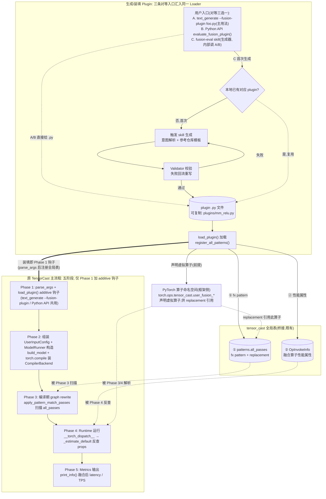

# RFC: 用户自定义融合算子性能评估 v2 (Plugin模式)

## 元数据

| 项目 | 内容 |
| :--- | :--- |
| **状态** | 草案 |
| **作者** | HDY |
| **创建日期** | 2026-05-30 |
| **相关链接** | `rfc_swiglu_fusion_support_zh.md`、`performance_database_collection_tooling.md` |

---

## 1. 背景与解决问题

### 1.1 现状痛点

仿真工具「极致性能调优指导」需要「指定融合后整模型 E2E 时间预估」能力。当前现状：

| # | 问题 | 影响 |
|---|------|------|
| 1 | 融合 pass 全靠手写 fx pattern | 需领域专家,新增算子组合的成本高 |
| 2 | 没有工具能快速回答「指定一组融合后,整模型 E2E 多快」 | 想试某种融合组合的效果,必须等 fx pattern + AscendC kernel 实现完才能跑 ModelRunner,反馈极慢 |

### 1.2 实现范围:Plugin 模式

> **推荐**:跑本 RFC 时使用默认的 `--performance-model analytic`(无需显式传)。profiling 模式虽然能跑且不会失败,但融合段会因 fallback 走 roofline,与周边 profiling-hit 算子混合估时,口径不一致。
>
> **必需**:Plugin 模式必须带 `--compile`(即 `do_compile=True`)运行。融合是编译期 fx graph rewrite(Phase 3),不开 `torch.compile` 则不装 `CompilerBackend`,plugin 的 pattern 注册了也永不触发,估时静默等同无插件 baseline。三条入口都守这条:CLI `--fusion-plugin` 未带 `--compile` 直接报错(§3.3a),Python API 已替你置 `do_compile=True`(§4.2),skill 也始终传入(§3.4 第 4 步)。

本次 RFC 提供一个 **Plugin 模式**,核心是把「一条融合的定义」与「怎么跑一次分析」**解耦**:

- **交付物 = 一个自包含、可复制的 plugin .py**。它把一条融合的完整定义(虚拟算子声明 + pattern/replacement + props functor)打包进单个文件,只依赖仓库公开 API,**不依赖任何 skill**。复制给别的用户、丢进其 plugin 目录即可使用。
- **运行走标准入口,三者对等**:plugin 由 Loader 注册进全局表后,可经 **(A) `text_generate` CLI 的 `--fusion-plugin` 加载钩子**(主用法,直接拿到 CLI 的全部能力)、**(B) Python API `evaluate_fusion_plugin()`**(自动化/notebook)、或 **(C) `fusion-eval` skill**(便捷生成器,见下)任一入口运行。三条路共用同一个 Loader/Validator 底座。
- **`fusion-eval` skill 是「生成器」而非唯一 harness**:首次评估时 skill 解析意图、生成并校验 plugin、**替你跑一次 E2E**(内部调标准 CLI/API),并把可复制的 plugin .py + 等价 CLI 命令交还给你,供你日后自行用 CLI / 自己的 private skill / API 重跑。

> **为什么这样取舍**:原设计「CLI 一行不改、skill 是唯一入口」把 plugin 降成了「只能从定制入口用」的二等公民——复制给别人用不了、无法组合进用户已有的 CLI / throughput_optimizer 流程。改为「CLI 加一个 **additive** 加载钩子」比「一行不改」更好:完全向后兼容,又让 plugin 成为可独立复用的一等交付物。

用户视角的使用流程(以发起评估的用户为例,**默认仍是一步**):

1. **给出想试的融合**:向 `fusion-eval` skill 或 Python API 给出算子序列(如 `aten.mm, aten.relu`)或 YAML 规则文件触发生成(完整入口语义见 §3);若已有现成 plugin,直接经 §3.3a CLI `--fusion-plugin` 给 .py 即可,无需 skill
2. **skill 生成并校验 plugin**:首次调用时 `fusion-eval` skill 参考仓库内置 plugin 模板生成 .py,Validator 静态 + 运行时校验通过后落到本地 plugin 目录;命中已有 plugin 则跳过生成(Phase 0)
3. **加载 plugin 并启动 ModelRunner**:Loader 在 ModelRunner 构造前把 plugin 注册到全局表(skill 走 §3.3 Python API,或等价于 CLI `--fusion-plugin`),起一次正常推理,与不开融合时完全一致(Phase 1)
4. **从标准输出读融合后 E2E + 拿到可复制产物**:`ModelRunner.print_info()` 打印融合后的 latency / TPS(Phase 2-5);skill 同时交还 plugin .py 与等价 CLI 命令

> 用户不需要手写 fx pattern、不需要改模型代码、不需要手动构造 ModelRunner;plugin 内部如何注册到编译流程见 §2。融合后 E2E 由 ModelRunner 标准 metrics 自然输出(fx graph 在编译阶段已 rewrite)。对比 baseline 的方法见 §5.3。拿到 plugin 的另一个用户**无需 skill**,一条 `text_generate --fusion-plugin <name>.py --compile ...` 即可复现(见 §3.3a)。

**核心流程**(自上而下为实际运行顺序;左列=plugin 生成与装填,右列=原 TensorCast 主流程零改动,经中间全局表桥接。三条对等入口 CLI / API / skill 都汇入同一个 Loader):



**关键点**:

- **CLI additive 钩子(非侵入式扩展)**: 原 `text_generate` 仅**新增一个** `--fusion-plugin` flag(可选,默认 None,不传则行为与今天完全一致),parse_args 后、`ModelRunner` 构造前调 `load_plugin()` 注册到全局表。完全向后兼容,且让 CLI 成为 plugin 的一等运行入口
- **三条入口对等、plugin 可复制**: CLI / Python API / skill 共用同一 Loader;plugin .py 自包含,复制给别的用户、放进其 plugin 目录即可经 CLI 运行,不绑定 skill
- **主流程零改动**: 原 TensorCast Phase 2-5 与不开融合时完全一致,plugin 产物仅经全局表被 Phase 3/4 自然扫描到
- **首次成本 + 本地复用**: 首次触发 skill 生成 plugin 并校验,命中本地已有 plugin 则跳过生成;生成完即成可复制资产,后续不再需要 skill

### 1.3 融合算子工作原理(前提)

理解 Plugin 协议前,先厘清「一条融合在 tensor_cast 里靠什么生效」。一个融合算子要同时满足三件事——编译期能被识别替换、运行期能被 dispatch、能算出融合后估时:

1. **声明虚拟算子**:`register_tensor_cast_op(name)` 经 `torch.library.custom_op` 把 `torch.ops.tensor_cast.<name>` 注册进 PyTorch 算子命名空间,并给一个只推 shape/dtype 的 meta 实现。这是后两步的前提——没有这个算子,replacement 无从引用。
2. **编译期 graph rewrite**:`register_pattern(pattern, replacement, ...)` 把「待匹配子图(如 `aten.relu(aten.mm(x,w))`)→ 替换为 `tensor_cast.<name>(x,w)`」登记进 `patterns.all_passes`。Phase 3 的 `apply_pattern_match_passes` 遍历 fx graph,命中处把若干底层算子节点**替换成一个虚拟算子节点**——这就是「融合」在图上的物理体现:多个 op 塌缩成一个。
3. **运行期估时**:改写后的 graph 在 Phase 4 经 `Runtime.__torch_dispatch__` 逐算子分发,遇到 `tensor_cast.<name>` 时,`OpInvokeInfo` 反查该算子注册的 `PerformanceProperties`(`register_op_properties`),用 roofline `max(compute_time, memory_time)` 算出这一融合段的耗时,汇入整模型 E2E。

**为什么融合能省时间**:虚拟算子的 schema 只声明**边界输入与输出**,中间 tensor(如 mm 的输出)**不在 schema 中**,因此 `get_memory_access_properties()` 自动分桶时不计其 HBM 读写——对应「中间结果留片上 SRAM、不落 HBM」的物理含义,memory 端字节下降,roofline 时间随之降低;`compute_ops` 则按底层算子累加(mm 的 MMA + relu 的逐元素),保证算力侧不失真。

> Plugin 协议(§2)就是把上述三步打包进一个 .py 文件:第 1 步=虚拟算子声明,第 2 步=pattern+replacement,第 3 步=props functor。仓库内置 swiglu / rms_norm 就是这三步的现成范例。

---

## 2. Plugin协议

### 2.1 标准模板

```python
# my_plugins/mm_relu.py
"""
融合算子插件: mm + relu epilogue
用途: 评估 GEMM + ReLU 激活融合的E2E性能
生成方式: fusion-eval skill 自动生成
"""

import torch
from tensor_cast.utils import register_tensor_cast_op
from tensor_cast.performance_model.op_invoke_info import OpInvokeInfo
from tensor_cast.compilation.patterns import register_pattern

# ========== 0. Plugin 命名空间(虚拟算子名前缀) ==========
# 虚拟算子名必须为 "<__plugin_namespace__>_<pattern_name>",使同类型融合的
# 两个 plugin 不冲突。团队可用自己的前缀(如 "my_team");省略时 Validator(L1)
# 注入默认 "user_fusion"。此处 namespace "user_fusion" + name "mm_relu" → user_fusion_mm_relu。
__plugin_namespace__ = "user_fusion"

# 虚拟算子名:由 namespace 派生,以下所有引用统一使用此变量。
# 修改 __plugin_namespace__ 时无需手动同步任何字面量。
_OP_NAME = f"{__plugin_namespace__}_mm_relu"

# ========== 1. 虚拟算子声明 ==========
@register_tensor_cast_op(_OP_NAME)
def _meta_impl(x: torch.Tensor, w: torch.Tensor) -> torch.Tensor:
    """Meta实现: 仅推导shape/dtype,不涉及真实计算"""
    return torch.empty(x.size(0), w.size(1), dtype=x.dtype, device="meta")

# ========== 2. FX Pattern + Replacement ==========
def _pattern(x, w):
    """待匹配的算子序列"""
    return torch.ops.aten.relu(torch.ops.aten.mm(x, w))

def _replacement(x, w):
    """替换后的虚拟算子"""
    return getattr(torch.ops.tensor_cast, _OP_NAME)(x, w)

# ========== 3. 性能属性 ==========
@OpInvokeInfo.register_op_properties(
    getattr(torch.ops.tensor_cast, _OP_NAME).default
)
def _performance_props(info: OpInvokeInfo) -> OpInvokeInfo.PerformanceProperties:
    """
    融合算子的性能建模:
    - boundary memory: 自动按schema分桶(input/output)
    - compute_ops: 累加底层算子的计算量
    - spill: 超on-chip buffer时自动计算
    """
    x, w = info.args
    m, k, n = x.size(0), x.size(1), w.size(1)

    props = info.get_memory_access_properties()
    props.compute_ops[x.dtype] = OpInvokeInfo.ComputeOps(
        mma_ops=m * n * k * 2,  # mm的FMA操作
        gp_ops=m * n,           # relu逐元素比较
    )
    return props

# ========== 4. Plugin入口 ==========
def register_all_patterns():
    """Plugin Loader调用此函数完成注册"""
    example_inputs = [
        torch.empty(1, 1, dtype=torch.float16, device="meta"),
        torch.empty(1, 1, dtype=torch.float16, device="meta"),
    ]
    register_pattern(
        # 用 namespace 前缀避免 collision: 两个 plugin 同用 name="mm_relu" 时
        # 第二次注册会触发 ValueError('Pattern already registered')。
        name=_OP_NAME,
        pattern=_pattern,
        replacement=_replacement,
        example_inputs=example_inputs,
        # level=0(默认):独立基础 pattern。
        # level=1:当 pattern 包含 level-0 产生的虚拟算子时使用
        # (如在 rms_norm 已融合后匹配 add_rms_norm)。
    )

# ========== 5. 元信息(可选,用于文档/调试) ==========
__plugin_meta__ = {
    "ops": ["aten.mm", "aten.relu"],
    "dtype_support": ["fp16", "bf16"],
    "notes": "GEMM + ReLU激活融合,适用于MLP层",
    "generated_by": "fusion-eval skill",
    "created_at": "2026-05-30",
    "plugin_schema_version": "1.0",  # Loader 版本检查必需字段(§9.4)
}
```

### 2.2 注册API一览

plugin 调下列 API,产物落入进程内既有全局结构(与内置 swiglu / rms_norm 同一份),不写新文件:

| API（来源） | 作用 | 生成的产物 | 存到哪(进程内全局) | 必需 |
|-----|------|-----------|---------------------|------|
| `register_tensor_cast_op(name)`<br/>(`tensor_cast/utils.py`) | 声明虚拟融合算子 | 虚拟算子 + meta/fake 实现 | `torch.ops.tensor_cast.<name>`(`custom_op` 命名空间) | ✅ |
| `register_pattern(...)`<br/>(`compilation/patterns/__init__.py`) | 注册 fx pattern+replacement | `(pattern, replacement)` 二元组 | `patterns.all_passes[level].pattern_replacements[name]`<br/>**`level`**: 0=基础 pattern(默认,如 swiglu、rms_norm 核心);1=复合 pattern,依赖 level-0 结果(如 add_rms_norm 需先完成内层 rms_norm 融合);2=后置处理。独立融合用 level=0;若 pattern 含 level-0 虚拟算子则用 level=1。 | ✅ |
| `OpInvokeInfo.register_op_properties(op)`<br/>(`performance_model/op_invoke_info.py`) | 注册性能属性函数 | props functor | `OpInvokeInfo._op_properties_functors[op]`(类级 dict) | ✅ |
| `register_op_estimator(op, device)`<br/>(`performance_model/op_estimator_registry.py`) | 自定义 estimator | estimator 函数 | `_op_estimator_table[device][op]`(模块级 dict) | ⚪ |

> 这些都是**进程内内存注册表**,生命周期 = 进程生命周期,**不落地为文件**;plugin 的 .py 源文件才是磁盘持久产物。编译期 Phase 3 扫 `all_passes`、运行期 Phase 4 反查 `_op_properties_functors`,即消费这些内存产物(详见 §1.3)。

### 2.3 命名规范

**虚拟算子命名**:

- 格式: `<__plugin_namespace__>_<name>`——plugin 的 `__plugin_namespace__` 前缀拼上融合名
- 命名空间: `torch.ops.tensor_cast.<__plugin_namespace__>_*`
- 冲突解决: 前缀取自 `__plugin_namespace__`(见 §4.4)。**字段省略时由 Validator(L1)注入默认 `user_fusion`**,单个 plugin 仍可工作;同类型融合要出多个 plugin 的团队**应指定唯一前缀**(如 `my_team`)以避免算子重名。最终虚拟算子名恒为 `torch.ops.tensor_cast.<__plugin_namespace__>_<name>`。

**Pattern命名**:

- 格式: `<__plugin_namespace__>_<fusion_type>`（与虚拟算子名使用同一 namespace 前缀，避免两个 plugin 使用默认模板时发生 collision）
- 示例: `user_fusion_mm_relu`, `my_team_attention_layernorm`

---

## 3. 用户输入接口

### 3.1 自然语言输入 (推荐)

通过 `fusion-eval` skill(`SKILL.md` + 配套 prompt 的纯文件约定,与工具无关;任何支持 skill 协议的 agent 环境均可运行,如 Claude Code):

```bash
# 方式1: 简洁命令
/fusion-eval mm+relu fp16 Qwen3-32B

# 方式2: 自然描述
"帮我评估一下attention输出后接layernorm的融合,在Qwen3-32B上prefill场景"

# 方式3: 详细参数
/fusion-eval ops=aten.mm,aten.relu dtype=fp16 model=Qwen3-32B device=ATLAS_800_A3_752T_128G_DIE
```

三种格式统一解析为 `{ops, dtype, model, device}` 结构;skill 收到后的完整内部流程见 §3.4。

### 3.2 YAML规则文件 (批量场景)

```yaml
# fusion_rules.yaml
schema_version: "2.0"

plugins:
  - name: mm_relu
    ops: [aten.mm, aten.relu]
    dtype: [fp16, bf16]
    notes: "GEMM + ReLU激活融合"

  - name: attention_layernorm
    ops: [aten.scaled_dot_product_attention, aten.layer_norm]
    dtype: [fp16]
    notes: "Attention + LayerNorm融合"
    # 可选:指定生成参数
    constraints:
      requires_shape_match: true  # 要求shape匹配
```

**使用方式**:把 YAML 交给 `fusion-eval` skill 或 Python API,由其按规则批量生成/加载 plugin 并逐条估时(见 §3.3);生成的每个 plugin 同样可经 §3.3a CLI `--fusion-plugin` 独立复用。`evaluate_fusion_plugins` 内部为每个 plugin 起独立子进程,确保各 plugin 的指标互不污染(见 §3.3 批量评估)。

```python
from tensor_cast.plugin_framework import evaluate_fusion_plugins

metrics_list = evaluate_fusion_plugins(
    rules="fusion_rules.yaml",
    model_id="Qwen/Qwen3-32B",
    device="ATLAS_800_A3_752T_128G_DIE",
)
```

### 3.3 Python API (自动化场景)

```python
from tensor_cast.plugin_framework import evaluate_fusion_plugin

# 单plugin评估
metrics = evaluate_fusion_plugin(
    plugin_path="./plugins/mm_relu.py",
    model_id="Qwen/Qwen3-32B",
    device="ATLAS_800_A3_752T_128G_DIE",
    num_queries=1,
    query_len=128,
)
# ModelRunnerMetrics 暴露的是按模型名分桶的 dict(key=model_name),非标量:
#   execution_time_s: Dict[str, float], tps_per_model: Dict[str, float]
metrics.print_info()  # 或自行遍历 dict:
for name, t in metrics.execution_time_s.items():
    print(f"{name}: {t:.4f}s, TPS: {metrics.tps_per_model.get(name, 0):.2f}")

# 批量评估(推荐:每个 plugin 独立子进程,指标互不污染)
from pathlib import Path
from tensor_cast.plugin_framework import evaluate_fusion_plugins

metrics_list = evaluate_fusion_plugins(
    plugin_paths=[str(p) for p in Path("./plugins").glob("*.py")],
    model_id="Qwen/Qwen3-32B",
    device="ATLAS_800_A3_752T_128G_DIE",
)
# evaluate_fusion_plugins 内部为每个 plugin 起独立子进程(复用 §5.3
# compare_with_baseline 的 subprocess 隔离),确保第 N 个 plugin 的
# 「融合后 E2E」只反映该 plugin 自身的效果,不叠加前 N-1 个。

# --- 同进程循环(仅适用于评估组合效果,不适用于单融合独立收益) ---
# WARNING: plugin 注册是进程级、单向、不可撤销(§4.4)。同进程内循环加载
# 多个 plugin 时,评估第 N 个 plugin 的「融合后 E2E」实际是 plugin 1..N
# 的叠加效果,而非该 plugin 单独的效果。若需逐个评估各融合的独立收益,
# 必须使用上面的 evaluate_fusion_plugins()(子进程隔离)。
# for plugin in plugins:
#     metrics = evaluate_fusion_plugin(str(plugin), model_id=..., device=...)
#     for name, t in metrics.execution_time_s.items():
#         print(f"{plugin.name} [{name}]: {t:.4f}s")
```

### 3.3a CLI 入口:`--fusion-plugin`(可复制 plugin 的主用法)

plugin 一旦生成,即是自包含、可复制的资产,**不再依赖 skill**。`text_generate` CLI 新增**一个 additive flag** `--fusion-plugin`,任何拿到 .py 的用户(无需 agent 环境、无需 skill)都能直接复现评估,并自然获得 CLI 的全部能力(并行、量化、profiling 模式等):

```bash
# 把别人发来的 plugin 丢进任意目录,一条命令复现融合后 E2E
text_generate Qwen/Qwen3-32B \
    --fusion-plugin ./plugins/mm_relu.py \
    --compile \
    --num-queries 8 --query-length 512 \
    --device ATLAS_800_A3_752T_128G_DIE
```

语义与约束:

- **additive、向后兼容**:`--fusion-plugin` 可选,默认 `None`;不传则 CLI 行为与今天逐字节一致。可重复传多次加载多个 plugin。
- **加载时机**:`parse_args()` 后、`ModelRunner` 构造前调 `load_plugin()`(Loader 幂等去重),把 plugin 注册进全局表——与 Python API 共用同一段加载逻辑。
- **`--compile` 守门**:带 `--fusion-plugin` 却未带 `--compile` 时 CLI 报错(否则 pattern 注册了也永不触发,估时静默退化成无插件 baseline,见 §1.2)。
- **与 skill / API 对等**:三条入口产出口径一致;skill 内部跑 E2E 时调的就是这条 CLI(或等价 API),并把上面这条命令一并交还用户。
- **可组合进 private skill**:用户既有的、封装 `text_generate` 或 `throughput_optimizer` 的 private skill,只需在其命令里加 `--fusion-plugin` 即可纳入融合评估,无需绑定 `fusion-eval`。

### 3.4 fusion-eval skill 实现说明

`fusion-eval` skill 是**便捷生成器**,不是唯一运行 harness。用户给出算子名 / YAML 即触发它:skill 在支持 skill 协议的 agent 环境(如 Claude Code)里按 plugin 协议产出 plugin 文件、跑 validator 校验,然后**替用户跑一次 E2E**(内部经 §3.3 Python API,等价于 §3.3a CLI `--fusion-plugin`),并把**可复制的 plugin .py + 等价 CLI 命令**交还用户。skill 内部承接 `parse_args` 的工作(组装 `UserInputConfig`、写 `config.enable_*`、置 `do_compile=True`)只是「替你跑第一次」的便利;后续用户可改用 CLI / 自己的 private skill / API 自行重跑,**不再依赖本 skill**。skill 自身仍不修改 `text_generate` 源码——CLI 侧的加载能力由框架统一新增的 `--fusion-plugin` 钩子提供(§3.3a / §6.2)。

**Skill 交付物形态**(纯文件,见 §7.1,归档到 `.agents/skills/fusion-eval/`):

```text
fusion-eval/
├── SKILL.md              # 入口:frontmatter(name/description)+ 工作流说明
├── generate-prompt.md    # 生成 plugin 的 prompt(含 §2 协议约束 + 骨架生成规则)
├── validate-prompt.md    # 调 validator + 失败回流修复的 prompt
└── ref/
    ├── plugin-template.py # plugin .py 骨架模板(对应 §2.1)
    └── pattern-examples/  # 内置 swiglu / rms_norm 作改写参照
```

`SKILL.md` 的 frontmatter 用 `name: fusion-eval` + `description`(描述何时触发);正文即下面的工作流。skill 不含可执行代码,靠 prompt + ref 引导 agent 按协议产出 plugin,validator 与 loader 是仓库侧 Python 代码(§6.1 交付件)。

**Skill 内部工作流**:

```text
1. 解析用户意图
   ├─ 提取 ops 序列(或从描述推导)
   ├─ 提取 dtype / shape / 模型 / 设备
   └─ 不明确时反问用户澄清

2. 参考仓库样例产出 plugin
   ├─ 读 compilation/patterns/swiglu.py 等仓库内置 plugin 作模板
   ├─ 按 §2 Plugin 协议写出 my_plugins/<name>.py
   └─ 含完整 fx pattern + replacement + 性能属性

3. 调用 validator 校验
   ├─ 静态校验(协议合规 / API 用法正确)
   ├─ 运行时校验(pattern 能匹配最小 fx graph / props 函数返回合法)
   └─ 校验失败 → 把报错回流给自己,迭代修改 plugin

4. 跑一次 E2E(经标准入口,非定制 harness)
   ├─ 调 §3.3 evaluate_fusion_plugin()(等价于 §3.3a CLI --fusion-plugin):
   │   load_plugin(<name>.py) → register_all_patterns() 写全局表
   ├─ 组装 UserInputConfig(model / device / num_queries / decode 等),
   │   写 config.enable_*,并置 do_compile=True(必需——不开 torch.compile
   │   则 Phase 3 永不执行、融合静默失效,见 §1.2 / §4.2)
   └─ ModelRunner(user_input).run_inference() 起后续主流程

5. 报告结果 + 交还可复制产物
   ├─ ModelRunner.print_info() 的 latency / TPS
   ├─ fx graph 中是否出现对应虚拟算子节点
   ├─ baseline 对比(另起一个进程跑不装 plugin 的同配置,见 §4.4)
   └─ 交还 plugin .py 路径 + 等价 CLI 命令,供用户日后自行复现
```

**Validator 是 plugin 质量的唯一守门员**。skill 写出「能跑但估时偏」的 plugin 是最大风险(fx pattern 字面对不上真实 graph → `match_count = 0`;props 函数漏算 compute_ops → 估时偏差)。Validator 必须做**反向校准**:

- **基线锚点 ≥ 4 个**:让 skill 重写仓库已有的 `register_pattern` 路径 pattern——swiglu / rms_norm / rotary_embedding / rms_norm_quant_pattern（level=0；匹配 `rms_norm → quantize`，与 level=1 的 `AddRMSNormQuantPattern` 复合 pattern 不同；至少这 4 个,覆盖 memory-bound 与 compute-bound）——与既有 pattern 实测对比。这 4 个都经 `register_pattern` 进 `all_passes`,skill 可经 Plugin 协议复现;`grouped_matmul_swiglu` 这类 freezing pass(由 `GroupedMatmulSwigluPass` 实现,非 `register_pattern` 路径)刻意排除——Plugin 协议无法复现它,故不能用于校验 skill 生成的 pattern 质量。
- **多样本 + 区间判定**:单个 case 满足 `|delta_pct| ≤ 10%` 不能证明生成质量稳定。每个锚点跑多组 shape/dtype 取多次实测,以 **95% 置信区间**而非单点判定——CI 上界 `≤ 10%` 才算该锚点通过
- **全通过才 release**:作为 skill 上线质量门槛,**全部锚点通过**方可发布;反向校准用例长期作为 skill 回归测试
- Validator 不通过的 plugin **不能**跑 ModelRunner

**Skill 边界**(由 skill prompt + validator 共同保证):

| 行为 | 是否允许 |
|------|---------|
| 在 plugin 目录写 .py 文件 | ✅ |
| 调 validator 验证产物 | ✅ |
| 经 §3.3 Python API(或等价 §3.3a CLI)起 ModelRunner 跑估时 | ✅ |
| 交还可复制 plugin .py + 等价 CLI 命令给用户 | ✅ |
| 修改 `text_generate` 源码 / argparse | ❌(`--fusion-plugin` 钩子由框架统一新增,非 skill 改) |
| 修改仓库主仓其他源码 | ❌ |
| 在 plugin 文件里 import 仓库私有(下划线开头)函数 | ❌ |
| 不调 validator 直接报告 metrics | ❌ |

### 3.5 正确性保障

先正向降低出错概率,再逐层验证,不对则有界修复。

**A. 正向**——把生成约束成低自由度填空,而非靠提示词:plugin 结构由 §2 协议固定(4 槽位),skill 只填内容;`get_inputs`/`replacement`/`register_pattern` 等确定结构部分由模板按算子序列**代码生成**,LLM 只写「算子序列 → `pattern()` body」一段,并强制参照已验证的内置 swiglu / rms_norm 改写;意图不明先反问。(仓库 pattern 本就是 `get_inputs`/`pattern`/`replacement`/`register_pattern` 四段式,骨架可机械套用。)

**B. 验证**——四层校验,任一层不过即判不可用、不进下一层:

| 层 | 校验 | 判定信号 |
|----|------|---------|
| L1 静态 | import + 协议合规 + 不 import 私有函数 + 命名空间解析 | 无异常 + AST 通过;`__plugin_namespace__` 存在或默认为 `user_fusion`,且声明的算子名带该前缀 |
| L2 注册 | 调 `register_all_patterns()` 三个 register_* 不报错 | 无重名 / `already registered` |
| L3 命中 | 最小 fx graph + 整模型 graph 跑 `PatternMatchPass` | `matched_cnt ≥ expected_match_count`(plugin 声明,默认 1)且**整模型命中率达标**(见下) |
| L4 估时 | 跑 props functor 查返回合法 | 字节非负、dtype 齐、估时正有限 |

L3 是核心:`matched_cnt = 0` = 能加载但不触发融合,估时退化成未融合,最隐蔽。但仅 `matched_cnt ≥ 1` 偏弱——若整模型里目标子图出现 N 次而只命中 1 次(其余未 fuse),fusion 收益会被严重低估。故 L3 用两道关:① 最小 fx graph 上 `matched_cnt ≥ 1`(pattern 字面正确性);② 整模型 graph 上 **命中率 = matched_cnt / candidate_op_count ≥ 阈值**(默认 0.9),`candidate_op_count` 由扫描整模型 graph 中匹配该 pattern 头算子的节点数估出;plugin 可在 `__plugin_meta__` 里声明 `expected_match_count` 覆盖默认判定。命中率不达标 → 警告并报告实际命中分布,提示 pattern 可能漏匹配变体(如 in-place / dtype 差异)。再叠反向校准(重写内置 swiglu 等与实测比 `|delta_pct| ≤ 10%`)兜「能跑但估时偏」。

> **L3① vs L3②(v2.0 实现)**:上述 L3 是**代理检查**——验证 pattern 被注册且在最小图上匹配,但不跑真实模型。v2.0 新增 **Phase 2b 真实检查 (L3②)**,实现于 `tensor_cast/plugins/l3_real.py`:Validator 通过后,在子进程中对真实编译模型跑插件,统计虚拟算子节点在 post-rewrite graph 中的实际出现次数(`fire_count`)。若 `fire_count = 0` 且 `candidate_count > 0`,返回 `diagnostic_section`(seed op 附近的真实 pre-rewrite graph 段)供精准回流修复。L3① (Validator) 与 L3② (Phase 2b) 互补:L3① 快速拦截结构性错误(无需真实模型);L3② 拦截通过 L3① 但实际 fire=0 的静默失败。

**C. 失败修复**:① validator 回传**具体失败信号**(如「L3 `aten.relu` vs graph 实际 `aten.relu_` 不符」),skill 针对性改写,迭代设上限(如 3 次);② 到上限仍不过则停,告知用户原因 + 草稿,转人工手改(逃生口同内置 `patterns/<name>.py`),或对 v1 能力外形态给「不支持」结论;③ **永不静默放行**:任一层未过都不许跑 ModelRunner 出数。

---

## 4. Plugin生命周期管理

### 4.1 生成阶段 (Phase 0)

**触发条件**:

- 用户首次调用`fusion-eval` skill
- YAML文件中的plugin尚未生成
- Python API 给定算子序列但本地无对应 plugin

**生成动作**:由 `fusion-eval` skill 完成——意图解析 → 参考仓库内置 plugin 生成 .py → Validator 校验回流。完整工作流与边界见 §3.4,校验分层与质量门槛见 §3.5。

**产出**:

- 生成 plugin .py 文件到本地(目录见 §7)
- `__plugin_meta__` 记录生成参数(ops / dtype / 生成方式),用于追溯

### 4.2 加载阶段 (Phase 1)

**Plugin Loader实现**:

```python
# tensor_cast/plugins/loader.py

_loaded_plugins: set[str] = set()  # 幂等保护

def load_plugin(plugin_path: Optional[str],
                raise_on_error: bool = False) -> None:
    """加载单个plugin文件,调用register_all_patterns()。

    plugin_path=None 是显式的无插件 baseline(见 §5.3):直接返回,使同一
    evaluate_fusion_plugin() 入口既能跑 baseline 又能跑融合,而不会因
    Path(None) 抛 TypeError。

    raise_on_error: 为 True 时(调用方明确传入路径,如 evaluate_fusion_plugin()
    和 CLI --fusion-plugin 钩子),加载失败抛 RuntimeError 而不是静默继续——
    调用方显式指定的 plugin 若加载失败,绝不能让估时在无感知的情况下退化成
    无插件 baseline。为 False 时(load_plugin_dir 批量扫描),失败记 warning
    并跳过。
    """
    if plugin_path is None:
        return  # 无插件 baseline,无需注册

    abs_path = str(Path(plugin_path).resolve())

    # 幂等保护: 同一文件只加载一次
    if abs_path in _loaded_plugins:
        return

    # 先标记再加载(mark-before-exec 模式): exec_module 前就加入保护集合,
    # 防止加载局部失败(如 Pattern already registered 重试)时产生无限重试。
    # 真正加载失败时路径仍留在集合中,后续调用静默跳过——对批量扫描是正确的;
    # 需要硬错误的调用方传 raise_on_error=True。
    _loaded_plugins.add(abs_path)

    # 用唯一模块名,避免两个 plugin 在 sys.modules 里互相覆盖
    module_name = f"tc_plugin_{Path(abs_path).stem}_{abs(hash(abs_path))}"
    try:
        spec = importlib.util.spec_from_file_location(module_name, abs_path)

        # 版本检查(§9.4):必须在 exec_module() 之前完成,防止不兼容插件的
        # 模块级装饰器(@register_tensor_cast_op、PatternMatchPass.register_pattern)
        # 在被拒绝前已写入进程全局注册表。通过 AST 预解析 __plugin_meta__,
        # 不执行模块代码。
        SUPPORTED_PLUGIN_SCHEMA_VERSION = "1.0"
        import ast as _ast
        try:
            src = spec.loader.get_source(module_name) or ""
            tree = _ast.parse(src)
            _plugin_ver = None
            for node in _ast.walk(tree):
                if (isinstance(node, _ast.Assign) and
                        any(isinstance(t, _ast.Name) and t.id == "__plugin_meta__"
                            for t in node.targets)):
                    if isinstance(node.value, _ast.Dict):
                        for k, v in zip(node.value.keys, node.value.values):
                            if (isinstance(k, _ast.Constant) and
                                    k.value == "plugin_schema_version" and
                                    isinstance(v, _ast.Constant)):
                                _plugin_ver = v.value
            if _plugin_ver and _plugin_ver != SUPPORTED_PLUGIN_SCHEMA_VERSION:
                msg = (f"Plugin {abs_path} schema version {_plugin_ver!r} "
                       f"!= supported {SUPPORTED_PLUGIN_SCHEMA_VERSION!r}")
                _loaded_plugins.discard(abs_path)
                if raise_on_error:
                    raise RuntimeError(msg)
                logging.warning(msg)
                return
        except (SyntaxError, OSError):
            pass  # 继续 exec_module,运行时 import 会自然抛错

        module = importlib.util.module_from_spec(spec)
        spec.loader.exec_module(module)

        if hasattr(module, "register_all_patterns"):
            module.register_all_patterns()
        else:
            msg = f"Plugin {abs_path} missing register_all_patterns()"
            _loaded_plugins.discard(abs_path)
            if raise_on_error:
                raise RuntimeError(msg)
            logging.warning(msg)
    except Exception as e:
        # "already registered" 有两种情形:
        #   - 同一 abs_path 重入(进程内重复 import):幂等 no-op。
        #   - 不同 plugin 的 op/pattern 命名冲突:这是真实 collision。
        # 区分方式:若 abs_path 在进入时不在 _loaded_plugins 中(首次加载),
        # 则冲突来自不同 plugin,需发 warning(raise_on_error=True 时抛异常)。
        if "already registered" in str(e):
            if abs_path in _loaded_plugins:
                # 已成功加载过的路径重入,幂等 no-op
                logging.debug("Plugin %s already registered (幂等),跳过: %s", abs_path, e)
                return
            else:
                # 首次加载此路径,但与已有 plugin 命名冲突——真实跨插件 collision
                _loaded_plugins.discard(abs_path)
                collision_msg = (f"Plugin {abs_path} registration collision: {e}。"
                                 f"另一个 plugin 已注册了同名 op/pattern。")
                if raise_on_error:
                    raise RuntimeError(collision_msg) from e
                logging.warning(collision_msg)
                return
        msg = f"Plugin {abs_path} load failed: {e}"
        if raise_on_error:
            # 显式路径调用方得到硬错误;同时从集合中移除,允许用户修复后重试。
            _loaded_plugins.discard(abs_path)
            raise RuntimeError(msg) from e
        logging.warning(msg)
        # 不影响主流程,继续

def load_plugin_dir(plugin_dir: str) -> None:
    """扫描目录,加载所有.py文件"""
    for py_file in Path(plugin_dir).glob("*.py"):
        load_plugin(str(py_file))  # raise_on_error=False: 批量扫描跳过失败项
```

**Python API 集成(与 §3.3a CLI 共用同一加载链路)**——复刻 `main()` 中 `parse_args` 之后到 `ModelRunner` 的链路;CLI `--fusion-plugin` 钩子也复用这同一段 `load_plugin → 构造 UserInputConfig → ModelRunner`:

```python
# tensor_cast/plugin_framework/__init__.py
from tensor_cast.core.input_generator import generate_inputs  # 与 text_generate 同源
from tensor_cast.core.model_runner import ModelRunner
from tensor_cast.core.user_config import UserInputConfig
from tensor_cast import config

def evaluate_fusion_plugin(plugin_path, model_id, device,
                           disable_default_patterns=False, **runner_kwargs):
    # 1. 装填 plugin 到全局表(必须在 ModelRunner 构造前)
    #    plugin_path=None 即无插件 baseline,loader 对 None 早返回(见 §5.3)
    #    raise_on_error=True 用于显式路径调用:load 失败应 raise 而非静默继续
    #    以零 plugin 状态运行(§3.5「永不静默放行」)
    load_plugin(plugin_path, raise_on_error=(plugin_path is not None))
    # 2. 可选禁用内置融合,复用既有 config 开关(无需新 flag)
    #    注意:lazy_init() 被 @lru_cache(None) 固化,这些开关仅对进程的「首次」
    #    torch.compile 生效。若进程已编译过(pytest 多 case / notebook 重跑),
    #    内置 pattern 已进 all_passes,此处再切开关静默无效——
    #    真正的隔离必须用独立进程(见 §4.4)。
    if disable_default_patterns:
        config.compilation.fusion_patterns.enable_swiglu = False
        config.compilation.fusion_patterns.enable_rms_norm = False
        config.compilation.fusion_patterns.enable_rope = False
        config.compilation.fusion_patterns.enable_rms_norm_quant = False
        config.compilation.fusion_patterns.enable_add_rms_norm = False
        config.compilation.fusion_patterns.enable_matmul_allreduce = False
        # 注意:此列表覆盖已知的 flag 控制内置 pattern;若新增 flag 须同步追加,
        # 以维持隔离语义。如需保证完全隔离,使用 §4.4 独立子进程方案,
        # 新进程启动时无任何已注册 pattern。
    # 3. 直接构造 UserInputConfig(CLI 走 from_args,此处等价地直接构造)
    #    注意用目标字段名(query_len / world_size,非 CLI 的 query_length / num_devices)
    #    do_compile=True 为必需:不开 torch.compile 则不装 CompilerBackend,
    #    Phase 3 永不执行,plugin 的 pattern 永不触发(见 §1.2 / CRIT)
    user_input = UserInputConfig(model_id=model_id, device=device,
                                 do_compile=True, **runner_kwargs)
    # 4. 起主流程;generate_inputs_func 须与 text_generate 一致显式传入
    runner = ModelRunner(user_input)
    metrics = runner.run_inference(generate_inputs_func=generate_inputs)
    metrics.print_info()
    return metrics
```

> 可行性已核实:`main()` 中 `parse_args` 之后只做「设若干 `config.*` + `UserInputConfig.from_args` + `ModelRunner` + `run_inference(generate_inputs_func=generate_inputs)`」。`UserInputConfig` 是全默认值 dataclass,可直接构造;`run_inference` 的 `generate_inputs_func` 默认是 `generate_inputs_varlen`,**必须显式传 `generate_inputs`** 才与 CLI 行为一致。另外 **`do_compile` 默认为 `False`**(`user_config.py`),只有 `do_compile=True` 时才装 `torch.compile`(进而装跑 Phase 3 `apply_pattern_match_passes` 的 `CompilerBackend`,见 `model_builder.py`);不开则 plugin 只写入 `all_passes` 但 Phase 3 永不执行、融合静默失效——故 Plugin 模式**必须**置 `do_compile=True`(等价 CLI 须传 `--compile`)。除新增的 `--fusion-plugin` 加载钩子外(§3.3a / §6.2),`parse_args` 之后到 `ModelRunner` 的链路逻辑不变。

### 4.3 运行阶段 (Phase 2-5)

完全复用现有tensorcast流程:

- Phase 2: ModelRunner构造
- Phase 3: 编译期graph rewrite (扫描全局表①)
- Phase 4: Runtime运行 (反查全局表②)
- Phase 5: Metrics输出

**主流程零改动**。

### 4.4 进程隔离与幂等保护

**进程隔离** (契约):

- Plugin加载是**进程级、单向、不可撤销**
- Baseline对比**必须用独立进程**
- Python API场景用`subprocess`隔离
- 禁用内置 pattern **只在全新进程里可靠**:`patterns.lazy_init()` 被 `@lru_cache(None)` 固化,首次 `torch.compile` 即把内置 pattern 注册进 `all_passes`,此后在已编译过的进程里再切 `config.compilation.fusion_patterns.enable_*` 静默无效。故 §4.2 的进程内 `disable_default_patterns` 开关只对进程首次编译生效;任何可靠的「带/不带内置」对比都必须用独立进程。

**幂等保护** (防崩溃):

```python
# 同一plugin重复加载场景:
# - pytest多case
# - Python API循环调用
# - Jupyter notebook多次执行

# Loader通过_loaded_plugins去重
# 避免虚拟算子重复定义 + props重复注册崩溃
```

**多plugin命名冲突** (命名空间前缀):

```python
# 在plugin文件中声明唯一前缀;省略时由 Validator(L1)注入默认 "user_fusion",
# 单个 plugin 仍能干净加载
__plugin_namespace__ = "my_team"  # 可选;默认为 "user_fusion"

# 虚拟算子最终命名:
# torch.ops.tensor_cast.my_team_mm_relu   (默认 → user_fusion_mm_relu)
```

---

## 5. E2E评估流程

### 5.1 首次评估流程

```text
用户: "评估 mm+relu 在 Qwen3-32B 上的性能"
  ↓
意图解析: ops=[aten.mm, aten.relu], model=Qwen3-32B, dtype=fp16
  ↓
检查缓存: ./plugins/mm_relu.py 不存在
  ↓
AI生成: 参考 swiglu.py 模板,生成 mm_relu.py
  ↓
Validator: 静态校验 ✓, 运行时校验 ✓
  ↓
跑一次 E2E(经标准入口): load_plugin → register_all_patterns() → Phase 2-5
  · skill 内部调 §3.3 Python API(等价于 CLI: text_generate --fusion-plugin mm_relu.py --compile ...)
  ↓
输出metrics: latency=0.245s, TPS=8.16
  ↓
交还可复制产物: "plugin 已保存到 ./plugins/mm_relu.py;
  后续可用 skill / Python API / CLI(text_generate --fusion-plugin ...)任一入口复现"
```

### 5.2 后续复用流程(命中已有 plugin,可完全不经 skill)

```text
入口任选其一(plugin 已是可复制资产, 复用不依赖 skill):

A. CLI 直跑(无需 agent / skill):
   text_generate Qwen/Qwen3-32B --fusion-plugin ./plugins/mm_relu.py --compile \
       --num-queries 8 --query-length 512 --device ...
     ↓ parse_args 后 load_plugin() → register_all_patterns() → Phase 2-5

B. Python API: evaluate_fusion_plugin("./plugins/mm_relu.py", model_id=..., device=...)

C. skill: 意图解析 → 命中缓存 ./plugins/mm_relu.py → 跳过生成 → 走 A/B 同一加载链路
  ↓
输出metrics: latency=0.245s, TPS=8.16
```

**关键优势**:

- 首次成本: AI 生成 + 校验(~2-5 分钟,含 skill 多轮回流)
- 后续复用: 命中本地 .py,跳过 AI 生成,只剩 plugin import + register(**~10 秒,仅指此步,不含 ModelRunner 初始化**)

> **关于耗时口径**:上面 ~10 秒**仅指** plugin 的 import + `register_all_patterns()` 注册,不含 ModelRunner 构造与权重加载。一次完整 E2E 估时 = plugin import/register(~10s) + ModelRunner 初始化(build_model + 权重加载,大模型常 30s+) + 一次推理。由于 plugin 注册是进程级、不可撤销(§4.4),baseline 对比须用独立进程,每个进程都要各自付一次 ModelRunner 初始化成本——"复用"省的是 AI 生成的分钟级成本,不是 ModelRunner 的初始化成本。

### 5.3 Baseline对比

**推荐方式: 两个独立进程**(plugin 注册进程级、不可撤销,baseline 必须用独立进程避免串味)

```python
# 伪代码 — 以下两次调用必须在独立进程中执行；
# plugin 注册是进程级、不可撤销(§4.4)。
# 真实实现请使用 compare_with_baseline()(见下方)。
# 进程 1: 不装 plugin → baseline(plugin_path=None;loader 对 None 早返回)
evaluate_fusion_plugin(plugin_path=None, model_id="Qwen/Qwen3-32B",
                       device="ATLAS_800_A3_752T_128G_DIE", num_queries=2)
# 进程 2: 装 plugin → fused
evaluate_fusion_plugin(plugin_path="./plugins/mm_relu.py",
                       model_id="Qwen/Qwen3-32B", device="ATLAS_800_A3_752T_128G_DIE", num_queries=2)
# 对比两进程的 latency / TPS
```

> CLI 同理:baseline 进程不带 `--fusion-plugin`(等价 `plugin_path=None`),fused 进程带 `--fusion-plugin <name>.py`,两次都带 `--compile`,对比输出即可——无需 skill / API。

**Python API方式**:

```python
from tensor_cast.plugin_framework import compare_with_baseline

result = compare_with_baseline(
    plugin_path="./plugins/mm_relu.py",
    model_id="Qwen/Qwen3-32B",
    device="ATLAS_800_A3_752T_128G_DIE",
    # 内部用subprocess隔离,自动跑baseline
)
print(f"Fused: {result.fused_latency_s:.4f}s")
print(f"Baseline: {result.baseline_latency_s:.4f}s")
print(f"Speedup: {result.speedup:.2f}x")
```

---

## 6. 与现有系统的关系

### 6.1 交付物清单

**一、框架交付件**(本 RFC 实现并随仓库发布,各司其职):

| 交付件 | 形态 | 职责 |
|--------|------|------|
| Plugin Loader | 新建 `tensor_cast/plugins/loader.py` | 加载 plugin、调 `register_all_patterns()`、幂等去重、出错跳过 |
| Validator | 新建 `tensor_cast/plugins/validator.py` | 静态 + 运行时校验 + 反向校准,plugin 质量唯一守门员(见 §3.5) |
| Python API | 新建 `tensor_cast/plugin_framework/__init__.py` | `evaluate_fusion_plugin()` 一站式:load_plugin → 组装 UserInputConfig → 起 ModelRunner；`evaluate_fusion_plugins(plugin_paths, ...)` 批量评估,每个 plugin 起独立子进程,指标互不污染(见 §3.3)；`compare_with_baseline(plugin_path, model_id, device, **kwargs)` 在两个独立子进程中分别跑 baseline 和 fused,返回 `CompareResult(baseline_latency_s, fused_latency_s, speedup)` |
| CLI 加载钩子 | `cli/inference/text_generate.py` 新增 `--fusion-plugin` flag(additive) | parse_args 后、ModelRunner 构造前调 `load_plugin()`;`--compile` 守门(见 §3.3a) |
| ServingCast 入口(同钩子) | `serving_cast` 起 `ModelRunner` 前接同一 `load_plugin()`(见 §7) | 让融合 plugin 同样作用于系统级吞吐仿真,plugin body 不变 |
| `fusion-eval` skill | `.agents/skills/fusion-eval/`(`SKILL.md` + 配套 prompt + ref) | 解析意图 → 写 plugin → 跑 validator → 跑一次 E2E → 交还可复制 plugin + CLI 命令 |

> 关系:Loader 是地基(没它 plugin 无法进主流程);CLI 钩子 / Python API 是两条对等的运行入口,共用 Loader;skill 是"首次成本"的便捷生成器,产出后即交还可复制 plugin。Validator 是产出质量门槛。**skill 只是面向用户的生成那一层;plugin 写好后运行时只依赖 Loader + 任一入口(CLI / API),不再依赖 skill**。

**二、运行过程中产生的 .py 文件**(skill / 用户产出,非框架交付件):

| 文件 | 由谁产生 | 内容 | 归属 |
|------|---------|------|------|
| `my_plugins/<name>.py` | skill 生成或用户手写 | 一条融合的完整协议:虚拟算子声明 + pattern/replacement + props functor(见 §2) | 用户资产,落在 plugin 目录,生命周期由用户掌控 |
| (校准产物,可选) 临时重写的 `swiglu.py` 等 | Validator 反向校准时 skill 临时生成 | 与内置 pattern 实测对比(误差 ≤10%)的临时 plugin | 一般不入库,作 skill 回归测试用例 |

### 6.2 模块改动量

| 模块 | 改动 | 说明 |
|------|------|------|
| `cli/inference/text_generate.py` | **新增 1 个 flag `--fusion-plugin`**(additive,可选) | parse_args 后调 `load_plugin()`;不传则行为与今天一致(见 §3.3a) |
| `tensor_cast/plugins/loader.py` | **新建 +120 LOC** | Plugin加载+幂等去重 |
| `tensor_cast/plugins/validator.py` | **新建 +150 LOC** | 运行时校验+反向校准 |
| `tensor_cast/plugin_framework/__init__.py` | **新建 +100 LOC** | Python API封装 |
| `serving_cast` 入口 | **同钩子接 `load_plugin()`**(见 §7) | 复用同一加载逻辑,作用于系统级吞吐仿真 |
| `fusion-eval` skill | **新建 skill**(`.agents/skills/fusion-eval/`,见 §7) | 意图解析+plugin生成+交还可复制产物 |

**完全不动**:

- `runtime.py` / `compile_backend.py` / `model_runner.py`(CLI 仅新增 1 个可选 flag,主流程逻辑不变)
- `compilation/patterns/__init__.py` (仅被plugin调用)
- `performance_model/op_invoke_info.py` (仅被plugin调用)
- 仓库内置pattern (swiglu/rms_norm/rotary_embedding)

### 6.3 复用既有API

Plugin内部调用,无需新增公开接口:

```python
# 虚拟算子声明
from tensor_cast.utils import register_tensor_cast_op

# fx pattern注册
from tensor_cast.compilation.patterns import register_pattern

# 性能属性
from tensor_cast.performance_model.op_invoke_info import OpInvokeInfo

# 工具函数
props = info.get_memory_access_properties()  # 自动分桶boundary memory
props.compute_ops[dtype] = OpInvokeInfo.ComputeOps(mma_ops=..., gp_ops=...)
```

---

## 7. 已决策事项

### 7.1 skill 存放目录(已定稿)

`fusion-eval` skill 统一归档到 **`.agents/skills/fusion-eval/`**,与仓库现有的 `device_config` / `op-mapping` / `microbench` 等 skill 同处,遵循 `AGENTS.md` 的「Skill 开发规范」(`SKILL.md` 大写入口 + `ref/` 参考目录;frontmatter 含 `name` / `description` / `version` / `source`)。原先「`docs/perf_database/skills/` 或顶层 `skills/`」的候选作废——仓库实际约定即 `.agents/skills/<name>/`。

### 7.2 ServingCast 兼容(同一加载钩子)

融合 plugin 的生效机制是「注册进全局表(`patterns.all_passes` + `OpInvokeInfo`)+ `torch.compile` 时被 Phase 3/4 扫描」,**与上层是 TensorCast 还是 ServingCast 无关**。ServingCast 的 `ModelRunner`(`serving_cast/model_runner.py`)本就包装 TensorCast 的 `ModelRunner` 并透传 `do_compile`,因此:

- **机制天然继承**:只要在 ServingCast 构造其 `ModelRunner` 前调用同一个 `load_plugin()`(与 §3.3a CLI 钩子、§3.3 Python API 共用一段逻辑),plugin .py **一字不改**即可作用于系统级吞吐仿真。
- **入口差异仅在驱动层**:TensorCast 走 `text_generate --fusion-plugin` / `evaluate_fusion_plugin()`;ServingCast 走其自身入口 + 同一 `load_plugin()`。plugin 作为可复制资产对两者对等。
- **`do_compile` 同样守门**:ServingCast 侧也必须开启编译(`do_compile=True`),否则融合静默失效(见 §1.2)。

> 本 RFC 范围以 TensorCast 入口为主;ServingCast 侧的 `load_plugin()` 接入作为紧邻的兼容项列出(实现上仅是在 serving 入口复用同一钩子),不引入新机制。

---

## 8. 实施计划

### 8.1 Sprint规划

| Sprint | 任务 | 交付物 |
|--------|------|--------|
| 0 | Validator基础设施 | 静态校验器 + 运行时校验框架 |
| 1 | Plugin Loader | `loader.py`(importlib 加载 + 幂等去重) |
| 2 | AI Skill | `fusion-eval` skill + 意图解析 |
| 3 | Python API | `plugin_framework/__init__.py` |
| 4 | 反向校准 | 4个锚点用例(swiglu / rms_norm / rotary_embedding / rms_norm_quant) + 误差测试 |

### 8.2 时间线

- **Week 1**: Sprint 0 (Validator)
- **Week 2**: Sprint 1 (Loader) + Sprint 2 (Skill)
- **Week 3**: Sprint 3 (API) + Sprint 4 (校准)
- **Week 4**: 端到端测试 + 文档

### 8.3 质量门槛

**Sprint出口标准**:

- [ ] swiglu反向校准误差 ≤ 10%
- [ ] rms_norm_quant反向校准误差 ≤ 10%
- [ ] E2E流程: 用户输入 → plugin生成 → metrics输出
- [ ] 进程隔离baseline对比功能可用
- [ ] 文档: Plugin模板 + API使用指南

---

## 9. 风险与缓解

### 9.1 AI 生成质量风险(含穿刺实测结论)

**风险**: skill 生成「能跑但不触发 / 估时偏」的 plugin。已对「skill 生成融合 Pass 的代码生成能力」做穿刺,实测边界如下,据实列出而非乐观估计:

| # | 实测现象 | 性质 | 当前处置 |
|---|---------|------|---------|
| R1 | 仅能复现 `register_pattern` 路径的内置 pattern(swiglu / rms_norm 系 / apply_rope 等约 32 个);`grouped_matmul_swiglu` / `dispatch_ffn_combine` 这类 **freezing pass 无法经 Plugin 协议复现** | 能力**硬边界** | 文档明示;此类形态给「v1 不支持」结论,不出数 |
| R2 | LLM 仅凭算子名手写 `_pattern()`,常对不上 **AOT 分解后的真实图**(算子 overload / eps 常量 / dtype-cast 位置 / 别名化 example_inputs),**一次成功率低**(实战多数需回流) | ✅ **v2.0 部分解决** | Phase 0.5 (graph_extractor) 把真实图结构作为 ground truth 注入,将 LLM 从「猜 op overload」变为「抄写真实图」,消除 F3/F5 失败模式；Phase 2b (l3_real) 把剩余的静默失败转成带诊断信息的显式信号。完全确定性 harness(封顶迭代)为 v2.1 工作项。 |
| R3 | 从真实编译图**捕获** pattern 的路线(`pattern_capture` / `pattern_codegen` 原型)产物结构/常量正确,但「生成的 plugin 一定触发」**尚未稳定复现**(出现生成版 `fire=0` vs 手写等价版 `fire=3`,根因未定位) | ✅ **v2.0 已实现** | **A+B 方案已交付**:(A) `graph_extractor.py`(Phase 0.5)捕获真实图拓扑含精确 op overload 名,注入作为 LLM 转录依据,绕过盲写；(B) `l3_real.py`(Phase 2b)在子进程中实测 `fire_count`,fire=0 时返回 `diagnostic_section`。已在 GLM5 E2E 验证:rms_norm 一次成功(3/3)、swiglu 一次成功(1/1)。`pattern_capture` / `pattern_codegen` 已标注为 deprecated,由 `graph_extractor` 替代。 |

**缓解**(分层,且解耦架构提供兜底):

- **验证兜底**:§3.5 四层校验(L3 命中含整模型命中率门槛、L4 估时)+ 反向校准强制门槛;validator 不通过的 plugin 不得跑 ModelRunner——R2 大部分被拦在出数前。
- **解耦兜底(关键)**:skill 不再是唯一 harness。R2/R3 导致 skill 生成失败或部分成功时**不是死路**——用户拿到可复制草稿,手改后照样经 §3.3a CLI `--fusion-plugin` 跑通,逃生口天然存在。
- **诚实标注**:R1 的不可复现形态、R3 的命中率风险,在出数报告里**显式声明**(L3 整模型命中率 + 是否真实出现虚拟算子节点),不静默放行。

> **关于「generate + validate workflow 稳定执行」**:v2.0 已通过 Phase 0.5(真实图捕获→ground truth 注入)和 Phase 2b(子进程 fire_count 实测→诊断回流)解决 R2/R3。尚缺的是完全确定性 harness(固定脚本编排、封顶迭代),作为 v2.1 工作项;本轮先据实记录。

### 9.2 进程隔离成本

**风险**: Baseline对比需启动双进程,开销大

**缓解**:

- 每次独立调用本就是新进程,天然满足隔离
- Python API用subprocess并行,实际开销可控
- 未来可考虑"快照恢复"机制(v3)

### 9.3 Plugin维护成本

**风险**: Plugin数量增长后难以维护

**缓解**:

- 元信息字段(`__plugin_meta__`)支持搜索/分类
- Plugin命名规范强制namespace
- 定期清理不活跃plugin(可配置策略)

### 9.4 Plugin 跨版本兼容性

**风险**: plugin 通过 `register_*` 写入的是 in-process 全局表(`OpInvokeInfo._op_properties_functors` / `patterns.all_passes`),依赖既有 API 的签名与 `OpInvokeInfo.PerformanceProperties` 等结构。主仓重构(重命名 API、改签名、调整 props 字段)后,用户本地已落地的 plugin .py 会直接失效或静默估错。

**缓解**:

- plugin .py 在 `__plugin_meta__` 里声明 `plugin_schema_version`,记录其依赖的 Loader 运行时合约版本
- loader 加载时做**版本检查**:plugin 的 `plugin_schema_version` 与当前框架支持的版本不兼容 → 警告 + 跳过,而非静默用坏掉的 plugin 估时
- 框架维护一份"协议变更日志",major 版本变更时给出 plugin 迁移指引;reverse-calibration 锚点用例(§3.5)也作为协议兼容性的回归基线,API 重构若破坏锚点会被 CI 拦下

> **两个独立版本字段**:§3.2 YAML 文件的 `schema_version` 是 YAML 语法/语法结构版本(生成侧,随 YAML schema 演化)。`__plugin_meta__` 中的 `plugin_schema_version` 是 Loader 运行时合约版本(加载侧,由 `SUPPORTED_PLUGIN_SCHEMA_VERSION` 检查)。两者独立演化,数值不对齐;升级一方不意味着升级另一方。

---

## 10. 后续工作

### v2.0（配套 PR 实现中，待合入）

> 以下代码交付件已在配套 PR（feat/fusion-plugin-framework）中实现；本 RFC 先行落地设计。所有条目已完成 GLM5 E2E 验证。

- 🚧 **Phase 0.5 — 图捕获与 ground truth 注入**(`tensor_cast/plugins/graph_extractor.py`):跑一次真实编译,用拓扑边界检测(无白名单)提取以 seed op 为锚点的 elementwise 子图,将 `SubgraphInfo.to_prompt_str()` 作为 ground truth 注入 LLM 供转录而非猜测,消除 F3/F4/F5 一次成功率失败模式。已在 GLM5 E2E 验证:rms_norm(3/3)、swiglu(1/1)首次命中。(对应 §9.1 R2 + R3)
- 🚧 **Phase 2b — 真实 fire_count 检查**(`tensor_cast/plugins/l3_real.py`):Validator 通过后,在隔离子进程中对真实编译模型跑插件,统计 `fire_count`(pre-rewrite candidate_count − PatternMatchPass 后残留),fire=0 时返回附带真实图段的 `diagnostic_section`,将静默 L3 失败转为可操作的显式信号。(对应 §9.1 R3)
- 🚧 **`pattern_capture` / `pattern_codegen` deprecated**:被 `graph_extractor` 取代,两个文件已加 deprecated 注释。

### v2.1

- **确定性 generate→validate harness**:把 plugin 生成 + 校验 + 失败回流做成固定脚本编排(capped 迭代、结构化失败信号),替代纯 prompt 驱动,提升一次成功率与可复现性(对应 §9.1 R2)
- ~~**capture-based codegen 收尾**~~:已在 v2.0 通过 A+B 方案解决(graph_extractor + l3_real)
- 图形化fx范围选择(Jupyter集成)
- 自动发现候选融合(基于profiling)

### v3.0

- 支持多输入多输出融合
- 支持分支/合并dataflow
- 与kernel生成器集成(AscendC模板)
