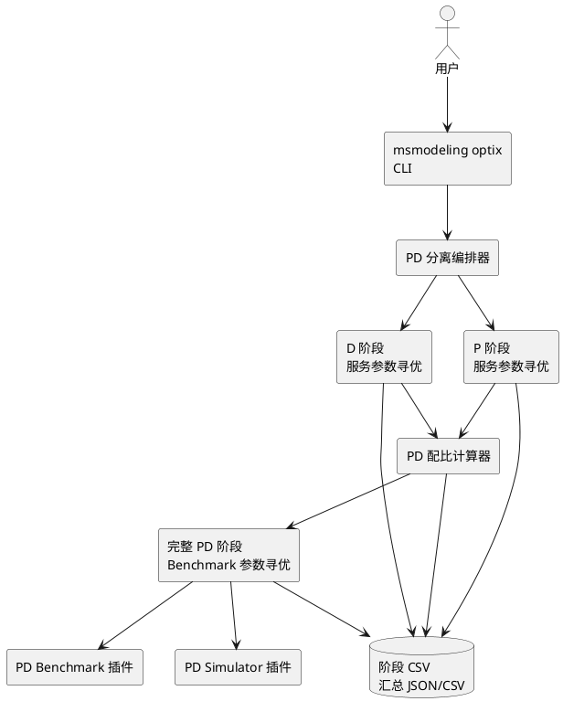
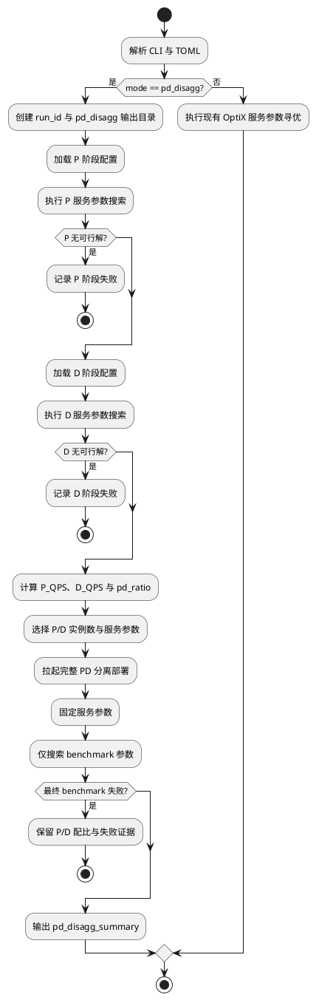

# RFC: OptiX 实测寻优适配 PD 分离场景

## 修订记录

### 文档元数据

| 项目          | 内容       |
| :------------ | :--------- |
| 状态          | Draft      |
| 作者          | 待确认     |
| 创建日期      | 2026-08-04 |
| 最后更新      | 2026-08-20 |
| 相关 Issue/PR | 待确认     |

### 版本记录

| 日期       | 修订版本 | 修改描述                                           | 作者   | RFC文档                                                    |
| ---------- | -------- | -------------------------------------------------- | ------ | ---------------------------------------------------------- |
| 2026-08-04 | 1.0      | 初稿完成                                           | 待确认 | `docs/RFC/rfc_optix_pd_disaggregation_real_tuning_zh.md` |
| 2026-08-05 | 1.1      | 补充方案前提、优缺点分析、选择矩阵和分阶段交付建议 | 待确认 | `docs/RFC/rfc_optix_pd_disaggregation_real_tuning_zh.md` |
| 2026-08-20 | 1.2      | 明确 D QPS 仅由并发和 TPOT 计算，并统一相关示例和测试口径 | 待确认 | `docs/RFC/rfc_optix_pd_disaggregation_real_tuning_zh.md` |
| 2026-08-20 | 1.3      | 移除 PD 编排层的冗余负载配置及相关约束 | 待确认 | `docs/RFC/rfc_optix_pd_disaggregation_real_tuning_zh.md` |

## 背景描述

PD 分离场景将大模型推理请求拆成 Prefill 节点和 Decode 节点分别部署。Prefill 节点主要受 TTFT、输入 token 长度、首 token 产出能力影响；Decode 节点主要受 TPOT、输出 token 长度、持续解码能力影响。真实部署前需要确定两类节点的服务化参数、压测参数和实例配比，否则容易出现 P 侧排队、D 侧空转，或 D 侧成为整体吞吐瓶颈。

OptiX 当前定位为服务化参数实测寻优工具，已支持通过 `msmodeling optix` 读取 TOML 配置、拉起 MindIE/vLLM 服务、调用 AISBench/vLLM benchmark、执行 PSO 搜索并输出 CSV。现有机制中，服务化参数和 benchmark 参数都可以通过 `target_field` 表达，`CONCURRENCY`、`REQUESTRATE` 等压测参数也已经能参与搜索或被固定。`Scheduler` 还具备 `rerun_benchmark_only()` 能力，可在服务不重启的情况下重新执行 benchmark。

面向 PD 分离，目前可行但易用性较差的拆分流程如下：

1. 搜一次 P：通过 benchmark 参数控制和 PD 混部能力，模拟单个 Prefill 节点能力，对 P 节点服务化参数做实测寻优，得到较优 P 配置和 P QPS。
2. 搜一次 D：通过 benchmark 参数控制和 PD 混部能力，模拟单个 Decode 节点能力，对 D 节点服务化参数做实测寻优，得到较优 D 配置和 D QPS。
3. 搜一次 benchmark：根据 P/D QPS 推导 PD 配比，使用搜索得到的 P/D 服务化参数拉起完整 PD 分离部署，此时服务化参数不再搜索，只对 benchmark 侧负载参数做实测寻优。该阶段与已上线的极光平台 benchmark 参数搜索能力对齐，具体平台接口与插件名待确认。

当前痛点集中在流程编排和产物衔接：

| 痛点         | 说明                                                                                 |
| ------------ | ------------------------------------------------------------------------------------ |
| 步骤割裂     | 用户需要手动准备 P、D、完整 PD 三份配置，手动传递搜索结果和配比                      |
| 易错成本高   | P/D 阶段 SLO、benchmark 参数、服务参数固定方式容易配错                               |
| 结果不可串联 | 三次寻优分别输出 CSV，缺少统一 run 视图、PD 配比摘要和最终 benchmark 结论            |
| 插件覆盖不足 | 完整 PD 分离部署依赖专用 simulator/benchmark 插件，未覆盖场景仍需要额外配置或 Agent 编排 |

核心价值：

1. 将 PD 分离实测寻优从“三次手动操作”提升为“一次任务、三阶段自动编排”。
2. 用真实 P/D 阶段 QPS 推导实例配比，降低仅依赖经验配比的风险。
3. 在最终完整 PD 分离阶段复用已选服务化参数，只搜索 benchmark 参数，缩短搜索周期并贴近线上压测入口。
4. 同时保留 Agent Skill 编排路径，在底层已有可执行命令或脚本的前提下，覆盖暂未产品化为 PD 分离插件的场景和定制化实验。

目标：

1. OptiX 新增 PD 分离实测寻优模式，自动完成 P 服务参数搜索、D 服务参数搜索和完整 PD benchmark 参数搜索。
2. 自动计算并输出 P QPS、D QPS、PD ratio、推荐 P/D 实例数、最终 benchmark 指标和对应参数。
3. 新增或适配 PD 分离插件，支持完整 PD 分离部署的启动、停止、健康检查、日志备份和性能指标解析。
4. 最终阶段支持固定服务参数，仅搜索 benchmark 参数，并优先复用 `Scheduler.rerun_benchmark_only()` 降低重启成本。
5. 输出统一的阶段目录和汇总文件，便于用户复盘、断点恢复、PR 验证和后续 Skill 消费。
6. 后续新增 OptiX PD 分离 Skill，将当前能力串联给 Agent 使用，覆盖已有底层脚本但未适配正式插件的场景和探索性实验。

非目标：

1. 不替代 ServingCast 中已有的 PD 配比仿真能力；本提案面向 OptiX 真机实测。
2. 不在首版实现生产环境自动扩缩容、流量切换或在线发布。
3. 不承诺所有推理框架和 benchmark 工具天然支持 PD 分离；未适配的组合需要新增插件、提供可调用脚本或保留人工流程。
4. 不改变现有 `msmodeling optix -e <engine> -b <benchmark>` 默认服务化参数寻优行为。
5. 不在首版重写 PSO 算法，仅在编排、搜索范围控制、结果组合和插件协议上扩展。

## 方案设计

### 场景用例

| 场景                   | 触发条件                                             | 输入                                                     | 输出                                               |
| ---------------------- | ---------------------------------------------------- | -------------------------------------------------------- | -------------------------------------------------- |
| P 节点能力搜索         | 用户需要评估单个 Prefill 节点能力                    | P 阶段配置、TTFT SLO、P 侧 benchmark 控制参数            | P 最优服务化参数、P QPS、P 阶段 CSV                |
| D 节点能力搜索         | 用户需要评估单个 Decode 节点能力                     | D 阶段配置、TPOT SLO、D 侧 benchmark 控制参数            | D 最优服务化参数、D QPS、D 阶段 CSV                |
| 完整 PD benchmark 搜索 | 已得到 P/D 服务化参数和配比                          | 完整 PD 部署配置、P/D 参数、实例配比、benchmark 搜索空间 | 最终 benchmark 最优负载参数、端到端 TTFT/TPOT/吞吐 |
| Agent 串联             | 正式插件未覆盖但已有可执行脚本，或用户希望自动拆配置 | 用户自然语言场景、已有 OptiX 配置、运行环境信息          | 三阶段命令、配置草案、结果解析和下一步建议         |

### 整体思路

建议“两条路线都做”，但不把它们视为互斥方案。OptiX 内置模式属于确定性执行层，负责参数校验、阶段状态、失败恢复、产物协议和自动化测试；Agent Skill 属于交互与编排层，负责理解自然语言需求、生成配置、调用工具、解释结果以及处理长尾场景。两者应复用同一组 CLI、阶段定义和输出协议，避免分别实现 QPS 计算、配比选择与结果解析。

| 路线                             | 主要价值                                                                                     | 主要局限                                                                                                         | 适合承担的职责                                             | 建议节奏                                          |
| -------------------------------- | -------------------------------------------------------------------------------------------- | ---------------------------------------------------------------------------------------------------------------- | ---------------------------------------------------------- | ------------------------------------------------- |
| OptiX 内置 PD 分离模式 + PD 插件 | 一次命令完成固定流程，输入输出契约明确，便于复现、回归、CI 验收和平台集成                    | 首期要开发编排器、状态管理及至少一个 PD 适配插件；不同推理框架与 benchmark 组合可能形成适配矩阵                  | 稳定场景的三阶段执行、参数校验、断点恢复、统一产物和错误码 | 近期优先交付最小闭环                              |
| Agent Skill 编排                 | 能把自然语言转成配置和命令，可复用已有脚本处理临时平台、探索性实验和插件尚未产品化的长尾场景 | 运行成功仍依赖底层已有可调用命令或适配脚本；Agent 决策受上下文和模型版本影响，需要额外记录输入、命令、配置及产物 | 配置生成、流程引导、工具调用、结果解释和长尾场景接入       | 核心 CLI 与产物协议稳定后适配，可提前用于需求验证 |

需要特别澄清以下前提：

1. “Skill 不需要插件”只表示不要求先开发正式注册的专用 PD 插件，不表示不需要底层集成。若某个 PD 平台没有可调用的启动、停止、健康检查和压测命令，Skill 同样无法完成实测。
2. “工具模式可复现”指相同配置、软件栈和硬件环境下执行路径确定，并不保证实测数值完全一致。RFC 仍需通过环境快照、重复测量和误差阈值控制结果波动。
3. PD 插件只解决部署和指标接入问题，不自动保证 P/D 单节点模拟语义正确。P/D 阶段的流量构造、指标口径和 QPS 公式必须分别校准。
4. `rerun_benchmark_only()` 仅在 benchmark 参数不会改变服务拓扑、缓存状态或服务启动参数时成立，不能作为所有插件的默认能力。

工具内置模式作为主路径：在 `msmodeling optix` 增加 `pd_disagg` 模式，由一个 PD 编排器负责顺序执行三个阶段。前两个阶段仍复用现有 OptiX 服务参数寻优能力，只是通过阶段配置固定 P/D 的 benchmark 语义。第三阶段拉起完整 PD 分离部署，把 P/D 服务化参数固定为前两阶段最优值，只开放 benchmark 侧 `target_field` 参与搜索。

插件作为部署和 benchmark 语义隔离层：核心编排器不硬编码某个推理框架的 PD 启动命令，也不硬编码“如何模拟 P 节点或 D 节点”的 benchmark 参数。相关逻辑由 PD simulator/benchmark 插件表达，插件负责命令拼接、参数注入、健康检查和指标解析。首版建议把稳定场景沉淀为插件；未覆盖场景由 Skill 生成三份配置并指导用户运行。

### 方案选择分析

方案评审不应只比较首期开发量，还应同时考虑交付对象、复现要求、场景稳定度和长期维护责任：

| 决策维度         | OptiX 内置模式 + 插件                             | Agent Skill 编排                                          | 选择时需要确认的问题                                   |
| ---------------- | ------------------------------------------------- | --------------------------------------------------------- | ------------------------------------------------------ |
| 用户易用性       | 稳定场景下一键执行，操作成本最低                  | 可通过对话降低配置门槛，但异常时可能需要多轮确认          | 目标用户需要自助重复运行，还是由专家辅助完成一次实验？ |
| 确定性与可复现性 | 流程、校验和产物协议可固化，适合正式验收          | 依赖 Agent 上下文、模型版本和运行记录，默认确定性较弱     | 结果是否需要进入 CI、版本对比或正式性能报告？          |
| 场景覆盖速度     | 每种新部署或 benchmark 语义通常需要适配和测试     | 可先串联已有命令与脚本，长尾场景接入较快                  | 底层是否已经有可调用、可解析的命令？                   |
| 首期开发成本     | 较高，需要编排、插件协议、状态恢复和测试闭环      | 已有命令完备时较低；若底层能力缺失，成本不会因 Skill 消失 | 当前需求是单一稳定平台，还是多个快速变化的平台？       |
| 长期维护成本     | 插件矩阵增大后，需要版本兼容、契约测试和责任人    | Prompt、Skill、工具输出变化均可能导致漂移，也需要回归样例 | 谁负责平台适配、Skill 维护和失败定位？                 |
| 故障恢复         | 可实现阶段状态机、断点续跑、稳定错误码            | 可根据日志灵活调整，但自动恢复行为较难形成稳定契约        | 长任务失败后是否必须无人值守恢复？                     |
| 可观测与审计     | 可统一 run ID、配置快照、环境信息和阶段指标       | 必须额外记录 Agent 输入、生成配置、实际命令及修改过程     | 是否要求结果可追责、可比较、可被其他系统消费？         |
| 安全边界         | 插件可限制允许执行的命令和参数                    | 长尾脚本编排的命令面更宽，需要确认和白名单约束            | 是否会接触生产环境、共享集群或敏感启动参数？           |
| 平台集成         | API/CLI 和结构化结果稳定后易被极光、CI 等系统调用 | 更适合作为人的入口，不宜成为平台间强契约                  | 调用方是人还是自动化平台？                             |

按典型场景选择：

| 场景                                                | 推荐路径                               | 原因                                         |
| --------------------------------------------------- | -------------------------------------- | -------------------------------------------- |
| 极光平台等正式需求交付，目标环境和 benchmark 已明确 | 优先 OptiX 内置模式 + 首个参考插件     | 需要稳定接口、自动验收和重复执行             |
| 新平台可通过现有脚本运行，但接口仍频繁变化          | 先由 Skill 编排验证，再沉淀为插件      | 先确认阶段语义和参数边界，降低过早固化成本   |
| 一次性实验或低频内部场景                            | Skill 或保留手动三阶段流程             | 专用插件的开发和维护收益不足                 |
| 多用户、高频运行、结果需要横向比较                  | OptiX 内置模式，Skill 仅作为入口       | 核心执行和产物必须确定，Agent 不承担结果契约 |
| 底层没有 PD 启停或压测能力                          | 两条路线都不能直接解决，应先补底层适配 | Skill 不能替代真实部署、发压和指标采集能力   |

建议使用以下门槛做决策，而不是仅按“开发快慢”判断：

1. 满足以下任一条件时，应建设工具内置模式或正式插件：进入正式交付或 CI；同一场景预计重复使用；需要无人值守执行；结果需要被平台消费；失败恢复和审计有明确要求。
2. 同时满足以下条件时，可先使用 Skill：底层命令已经可执行；场景仍在快速变化；运行频率较低；由专家参与；允许人工确认和失败干预。
3. 当一个 Skill 场景的输入字段、命令模板和指标解析连续稳定后，应将其下沉为插件，并保留 Skill 作为配置和解释入口。

### 分阶段交付建议

推荐采用“执行能力先闭环，Skill 随后复用”的组合路径：

1. 阶段 0，先定义公共契约：明确三个阶段的输入、状态、错误码、指标单位、配置快照和 `pd_disagg_summary.json`。公共 QPS 与配比计算只实现一份。在不改动代码的情况下可以先跑通一版。
2. 阶段 1，交付 OptiX 最小闭环：实现 `pd_disagg` 编排器，并只支持一个已明确的推理框架、PD 部署方式和 benchmark 组合；插件矩阵不在首版一次铺开。
3. 阶段 2，交付 Agent Skill：读取同一配置和结果协议，完成自然语言配置生成、执行调用、失败解释与结果总结，不在 Skill 中复制核心算法。
4. 阶段 3，扩展长尾适配：对稳定且高频的 Skill 场景沉淀正式插件；低频场景继续通过受控外部命令或人工确认执行。

从需求交付角度，阶段 1 应优先于阶段 2；但 Skill 不必等待全部插件稳定，只需等待最小 CLI 和产物契约稳定。这样既能保证当前需求有确定性验收入口，也能让后续未覆盖场景快速接入。

PD 配比由 P/D 阶段 QPS 计算。OptiX 指标内部以秒为单位时使用：

```text
P_QPS = prefill_concurrency / ttft_s
D_QPS = decode_concurrency / tpot_s
pd_ratio = D_QPS / P_QPS
```

本 RFC 中 QPS 以请求为单位。D QPS 仅由 Decode 阶段并发请求数和 TPOT 计算。P 阶段可以直接采用 benchmark 输出的请求 QPS。

若 benchmark 直接给出阶段请求吞吐 `throughput`，且插件确认其语义为阶段 QPS，则优先使用 `throughput`；否则使用上述公式兜底。若指标单位来自外部平台或 CSV 是毫秒，则在插件层归一化为秒，避免核心流程重复处理单位。插件必须记录 QPS 的来源是 benchmark 直接值还是公式计算值，便于结果审计。

`pd_ratio` 与 ServingCast 既有文档保持一致，表示推荐的 `P instances : D instances` 比例。例如 P QPS 为 10 req/s，D QPS 为 15 req/s，则 `pd_ratio = 1.5`，含义是每 1 个 D 实例约需要 1.5 个 P 实例才能供需均衡。

### 系统架构



该图表达 PD 分离模式的核心关系：CLI 只负责解析入口，PD 编排器负责阶段顺序，P/D 搜索仍复用 OptiX 优化器，完整 PD 阶段通过插件接入真实部署和 benchmark。

### 核心流程



该流程强调三阶段之间的数据传递。任一阶段失败都应保留已完成阶段产物，用户可以修复配置后从指定阶段恢复。

### 阶段设计

#### 阶段一：Prefill 节点实测寻优

P 阶段使用单个 P 节点等价能力进行服务参数搜索。具体实现上，插件通过 benchmark 参数控制运行形态，使请求主要度量 Prefill 能力，例如输入长度、是否启用 PD 混部模拟、首 token 统计字段等。具体参数名依赖 AISBench、vLLM benchmark 或极光平台插件，首版在插件配置中声明，不写死在核心编排器。

P 阶段优化目标：

1. 以 TTFT SLO、成功率和阶段吞吐作为主要 fitness 输入。
2. 搜索 P 侧服务化参数，例如 `maxPrefillBatchSize`、`maxPrefillTokens`、`MAX_NUM_BATCHED_TOKENS`、Prefill 相关调度参数等。
3. benchmark 侧压力参数可搜索或固定，但必须能产出稳定 P QPS。
4. 输出 P 最优参数、P 阶段 CSV、P QPS 和 P 阶段配置快照。

#### 阶段二：Decode 节点实测寻优

D 阶段使用单个 D 节点等价能力进行服务参数搜索。插件通过 benchmark 参数控制运行形态，使请求主要度量 Decode 能力，例如上下文长度、TPOT 统计字段、decode-only 或近似 decode-only 压测模式等。

D 阶段优化目标：

1. 以 TPOT SLO、成功率和阶段吞吐作为主要 fitness 输入。
2. 搜索 D 侧服务化参数，例如 Decode batch、KV cache 相关参数、`MAX_NUM_SEQS`、并行度相关参数等。
3. 输出 D 最优参数、D 阶段 CSV、D QPS 和 D 阶段配置快照。

#### 阶段三：完整 PD 分离 Benchmark 参数寻优

完整 PD 阶段使用前两阶段的 P/D 服务化参数和配比，拉起完整 PD 分离部署。该阶段不再搜索服务化参数，只搜索 benchmark 侧参数，例如并发、请求发送速率、请求数、输入输出分布或平台压测参数。

实现重点：

1. 将 P/D 服务化参数注入 PD simulator 插件，并标记为固定参数。
2. 仅把 benchmark 侧 `target_field` 作为 PSO 维度；服务字段要么不进入 `target_field`，要么以 `constant` 形式保留。
3. 首次启动完整 PD 服务后，优先复用 `Scheduler.rerun_benchmark_only()` 对 benchmark 参数进行迭代，避免每个候选都重启 P/D 集群。
4. 若 benchmark 参数变更需要重启服务，插件需显式声明 `requires_service_restart = true`，编排器退回常规 `Scheduler.run()`。
5. 输出最终端到端 TTFT、TPOT、请求吞吐、成功率、benchmark 最优参数和完整部署配置。

### PD 配比与实例数计算

首版推荐输出两类结果：

1. 浮点配比：`pd_ratio = D_QPS / P_QPS`，表示推荐 `P instances : D instances`。
2. 整数实例数：若用户提供总设备数和单实例设备数，则枚举满足资源约束的 `(P_instances, D_instances)`，选择实际比例最接近 `pd_ratio` 且平衡 QPS 最大的组合。

资源约束：

```text
P_instances * prefill_devices_per_instance
  + D_instances * decode_devices_per_instance
  <= total_devices

P_instances >= 1
D_instances >= 1
P_instances / D_instances ≈ pd_ratio
balanced_qps = min(P_instances * P_QPS, D_instances * D_QPS)
```

当用户要求用满设备时使用等号约束；未要求用满时允许小于等于，并在结果中展示剩余设备数。

### 数据模型与配置变更

建议新增 `PdDisaggConfig`，挂载在 `Settings` 下的 `[pd_disagg]` 配置段。字段名称为草案，最终以实现评审为准。

| 配置                                       | 类型 | 默认值        | 说明                                                           |
| ------------------------------------------ | ---- | ------------- | -------------------------------------------------------------- |
| `pd_disagg.enabled`                      | bool | `false`     | 是否启用 PD 分离编排；也可由 CLI `--mode pd_disagg` 覆盖     |
| `pd_disagg.total_devices`                | int  | `0`         | 可选，总设备数；为 0 时只输出浮点配比                          |
| `pd_disagg.prefill_devices_per_instance` | int  | 待确认        | 单个 P 实例设备数                                              |
| `pd_disagg.decode_devices_per_instance`  | int  | 待确认        | 单个 D 实例设备数                                              |
| `pd_disagg.top_k`                        | int  | `3`         | 从 P/D 阶段各取 Top K 组合计算候选配比                         |
| `pd_disagg.use_full_device`              | bool | `true`      | 是否要求整数实例分配用满 `total_devices`                     |
| `pd_disagg.resume_phase`                 | str  | `""`        | 可选，从 `prefill`、`decode`、`final_benchmark` 阶段恢复 |
| `pd_disagg.phase_output_dir`             | str  | `pd_disagg` | 阶段产物目录名                                                 |

建议为三类阶段配置增加独立段落：

| 配置段                          | 说明                                                            |
| ------------------------------- | --------------------------------------------------------------- |
| `[pd_disagg.prefill]`         | P 阶段 engine、benchmark、SLO、配置文件覆盖、benchmark 控制参数 |
| `[pd_disagg.decode]`          | D 阶段 engine、benchmark、SLO、配置文件覆盖、benchmark 控制参数 |
| `[pd_disagg.final_benchmark]` | 完整 PD 阶段插件名、benchmark 搜索空间、SLO、是否复用服务       |

建议新增或复用以下输出文件：

| 输出                                                             | 说明                                   |
| ---------------------------------------------------------------- | -------------------------------------- |
| `result/pd_disagg/<run_id>/prefill/data_storage_*.csv`         | P 阶段原始搜索结果                     |
| `result/pd_disagg/<run_id>/decode/data_storage_*.csv`          | D 阶段原始搜索结果                     |
| `result/pd_disagg/<run_id>/final_benchmark/data_storage_*.csv` | 完整 PD benchmark 搜索结果             |
| `result/pd_disagg/<run_id>/pd_ratio_candidates.csv`            | P/D Top K 组合和配比候选               |
| `result/pd_disagg/<run_id>/pd_disagg_summary.json`             | 最终推荐配置、指标、阶段路径和失败信息 |

### 插件设计

| 插件                  | 注册名草案                                | 职责                                                               |
| --------------------- | ----------------------------------------- | ------------------------------------------------------------------ |
| `PdDisaggSimulator` | `pd_disagg_vllm` / `pd_disagg_mindie` | 拉起完整 P/D 分离服务，注入 P/D 参数，提供健康检查、停止和日志备份 |

### Agent Skill 编排路线

在核心 CLI、阶段定义和产物协议稳定后，新增 OptiX PD 分离 Skill，面向以下场景：

1. 用户只有自然语言需求，没有三阶段配置。
2. 完整 PD 插件暂未覆盖某个内部平台或定制 benchmark，但已有可调用的部署和压测脚本。
3. 用户希望基于现有 P/D CSV 继续计算配比或生成 final benchmark 配置。
4. 用户希望让 Agent 逐阶段执行、解析结果、生成下一阶段配置。

Skill 的主要动作：

1. 读取用户场景、硬件、模型、负载特征、SLO 和现有 `config.toml`。
2. 生成 P 阶段、D 阶段、final benchmark 阶段配置。
3. 调用 `msmodeling optix` 或新 `--mode pd_disagg` 命令执行。
4. 解析 `data_storage_*.csv`，计算 P/D QPS 和配比。
5. 生成完整 PD benchmark 配置，并记录阶段证据。

Skill 路线不替代工具内置模式，也不替代底层部署和压测接入。它的价值是把尚未产品化为插件的已有命令和临时实验先串起来，让需求探索不被正式插件适配节奏阻塞。

### 异常流程与回退策略

| 异常                       | 处理                                                                              |
| -------------------------- | --------------------------------------------------------------------------------- |
| P 阶段无可行解             | 停止后续阶段，输出 P 阶段失败原因和 CSV 路径                                      |
| D 阶段无可行解             | 保留 P 阶段结果，输出 D 阶段失败原因和 CSV 路径                                   |
| QPS 为 0 或缺失            | 标记配比计算失败，提示检查指标解析或 benchmark 语义                               |
| 无法满足整数实例约束       | 输出浮点配比，并展示最接近的若干候选                                              |
| 完整 PD 插件缺失           | 若已有受支持的部署和压测脚本，则退回 Skill/手动三阶段流程；否则提示先完成底层适配 |
| final benchmark 失败       | 保留 P/D 推荐配比和完整 PD 阶段失败证据                                           |
| benchmark 参数要求重启服务 | 插件声明后退回常规 `Scheduler.run()`，不使用 benchmark-only 复用                |

### 功能与性能影响

功能影响：

1. 新增可选 PD 分离模式，不影响默认 OptiX 服务参数寻优。
2. 新增阶段化输出，便于用户从一次任务中看到 P、D、完整 PD 三类结果。
3. 新增插件后，插件作者需要声明阶段、指标单位和服务复用能力。

性能影响：

1. 完整流程至少包含 P、D、final benchmark 三段搜索，总耗时约为单次寻优的 2 到 3 倍，具体取决于 `n_particles`、`iters`、服务启动时间和 benchmark 数据量。
2. final benchmark 阶段若复用服务，仅重跑 benchmark，可显著降低重启完整 PD 集群的成本。
3. P/D 阶段仍然会频繁重启服务，因为服务化参数参与搜索。

兼容性：

1. 现有 `config.toml`、CLI 默认参数和输出 CSV 不变。
2. 新模式只在显式 `--mode pd_disagg` 或 `pd_disagg.enabled = true` 时启用。
3. 老版本无法识别的新配置段应通过 `extra=allow` 或文档说明避免误报，具体行为需实现时确认。

安全性和可靠性：

1. 不新增凭证读取能力。
2. 外部命令仍走 OptiX 部署环境隔离和 `required_executable` 预检。
3. 阶段失败必须以非零退出码或明确异常结束，不得输出“成功但无有效结果”的摘要。
4. `pd_disagg_summary.json` 不写入 token、私有密钥或用户未显式允许的敏感环境变量。

### 影响范围

| 范围                                               | 变更                                                |
| -------------------------------------------------- | --------------------------------------------------- |
| `optix/optimizer/optimizer.py`                   | CLI 增加模式参数，分发到 PD 编排器                  |
| `optix/config/config.py`                         | 增加 `PdDisaggConfig`、阶段配置和校验             |
| `optix/config.toml`                              | 增加 PD 分离配置示例                                |
| `optix/optimizer/`                               | 新增 PD 编排器、配比计算器、benchmark-only 搜索封装 |
| `optix/optimizer/plugins/` 或 `contrib/optix/` | 新增 PD 分离 simulator/benchmark 插件               |
| `optix/optimizer/store.py`                       | 增加阶段汇总、Top K 配比候选或 summary 输出能力     |
| `docs/zh/user_guide/optix_user_guide.md`         | 增加 PD 分离模式使用说明                            |
| `docs/zh/user_guide/optix_plugin_user_guide.md`  | 增加 PD 插件开发约束                                |
| `tests/regression/optix/`                        | 增加配置解析、配比计算、阶段编排和插件 mock 测试    |
| `.agents/skills/`                                | 后续新增 OptiX PD 分离 Skill                        |

## 使用说明

### 使用入口

新增 CLI 入口草案：

```bash
msmodeling optix --mode pd_disagg -c ./pd_disagg_config.toml
```

保留现有入口：

```bash
msmodeling optix -e vllm -b ais_bench -c ./config.toml
```

`--mode` 参数草案：

| 参数                  | 可选/必选 | 默认值            | 说明                                                                             |
| --------------------- | --------- | ----------------- | -------------------------------------------------------------------------------- |
| `--mode`            | 可选      | `service_param` | `service_param` 表示现有服务参数寻优；`pd_disagg` 表示 PD 分离三阶段实测寻优 |
| `--config`          | 可选      | 默认搜索路径      | PD 分离模式建议显式指定配置文件                                                  |
| `--load_breakpoint` | 可选      | `false`         | 后续支持从阶段输出恢复，恢复粒度由 `pd_disagg.resume_phase` 控制               |
| `--backup`          | 可选      | `false`         | 开启阶段日志和配置备份                                                           |

### 配置示例

以下为草案示例，具体插件名、benchmark 参数名和极光平台字段待实现时确认。

```toml
n_particles = 10
iters = 5

[pd_disagg]
enabled = true
total_devices = 16
prefill_devices_per_instance = 4
decode_devices_per_instance = 2
top_k = 3
use_full_device = true
phase_output_dir = "pd_disagg"

[pd_disagg.prefill]
engine = "vllm"
benchmark_policy = "pd_phase_benchmark"
ttft_penalty = 1
tpot_penalty = 0
ttft_slo = 2.0
phase = "prefill_probe"

[pd_disagg.decode]
engine = "vllm"
benchmark_policy = "pd_phase_benchmark"
ttft_penalty = 0
tpot_penalty = 1
tpot_slo = 0.05
phase = "decode_probe"

[pd_disagg.final_benchmark]
engine = "pd_disagg_vllm"
benchmark_policy = "pd_final_benchmark"
search_scope = "benchmark"
reuse_service = true
ttft_slo = 2.0
tpot_slo = 0.05
```

P/D 服务参数仍使用现有 `[[vllm.target_field]]` 或 `[[mindie.target_field]]` 表达。最终 benchmark 阶段可以通过独立的 benchmark `target_field` 表达压测参数：

```toml
[[pd_disagg.final_benchmark.target_field]]
name = "CONCURRENCY"
config_position = "env"
min = 1
max = 1000
dtype = "int"
value = 100

[[pd_disagg.final_benchmark.target_field]]
name = "REQUESTRATE"
config_position = "env"
min = 1
max = 1000
dtype = "float"
value = 100
```

### 输出摘要示例

`pd_disagg_summary.json` 建议包含以下字段：

```json
{
  "run_id": "3f2a19bc",
  "status": "success",
  "prefill": {
    "qps": 10.0,
    "ttft_s": 0.4,
    "concurrency": 4,
    "best_params": {}
  },
  "decode": {
    "qps": 15.0,
    "tpot_s": 0.2,
    "concurrency": 3,
    "best_params": {}
  },
  "pd_ratio": 1.5,
  "instances": {
    "prefill": 3,
    "decode": 2,
    "prefill_devices": 12,
    "decode_devices": 4
  },
  "final_benchmark": {
    "throughput": 24.0,
    "ttft_s": 0.6,
    "tpot_s": 0.04,
    "success_rate": 1.0,
    "best_benchmark_params": {}
  },
  "artifacts": {
    "prefill_csv": "result/pd_disagg/3f2a19bc/prefill/data_storage_xxx.csv",
    "decode_csv": "result/pd_disagg/3f2a19bc/decode/data_storage_xxx.csv",
    "final_csv": "result/pd_disagg/3f2a19bc/final_benchmark/data_storage_xxx.csv"
  }
}
```

### 使用约束

1. P/D 阶段 benchmark 必须能稳定表达单 P 或单 D 能力，否则 QPS 和配比没有工程意义。
2. 完整 PD 阶段必须有可用 simulator 插件，能拉起真实 P/D 分离部署。
3. 插件输出的 TTFT、TPOT 必须统一为秒，QPS 必须统一为 req/s。
4. 若总设备数或单实例设备数缺失，则只能输出浮点配比，不能给出整数实例推荐。
5. 实测寻优会反复拉起服务和压测，建议在独占或资源稳定的环境运行。
6. benchmark-only 阶段只有在插件确认服务参数不变且 benchmark 参数不要求重启服务时才复用服务。

### 兼容与迁移

1. 老用户继续使用 `msmodeling optix -e vllm -b ais_bench`，行为不变。
2. 已有 OptiX 配置可以拆分为 P、D、final benchmark 三段后迁移到 `[pd_disagg]`。
3. 未安装 PD 插件时，工具应 fail-fast 并提示安装或退回手动三阶段流程。
4. 后续 Skill 可以读取旧配置并生成 PD 分离配置草案，降低迁移成本。

## 测试设计

| 用例名                    | 测试类型   | 前置条件                                                             | 操作方式                                   | 预期结果                                      |
| ------------------------- | ---------- | -------------------------------------------------------------------- | ------------------------------------------ | --------------------------------------------- |
| UT-解析默认模式           | 单元测试   | 默认配置                                                             | 构造无 `pd_disagg` 配置的 Settings       | 现有 OptiX 默认模式不变                       |
| UT-解析 PD 配置           | 单元测试   | 含 `[pd_disagg]` TOML                                              | 加载 Settings                              | 正确生成 `PdDisaggConfig`，必填字段校验生效 |
| UT-QPS 公式秒单位         | 单元测试   | P 并发 4、TTFT 0.4 秒；D 并发 3、TPOT 0.2 秒                         | 调用配比计算器                             | P QPS=10、D QPS=15、pd_ratio=1.5              |
| UT-QPS 公式毫秒归一       | 单元测试   | 插件输入毫秒指标                                                     | 插件归一化后计算                           | 核心计算只接收秒，不重复乘 1000               |
| UT-整数实例分配           | 单元测试   | `total_devices=16`、P 单实例 4 卡、D 单实例 2 卡、`pd_ratio=1.5` | 调用实例分配函数                           | 输出 P=3、D=2 或最接近候选                    |
| UT-无可行实例分配         | 单元测试   | 设备数不足或比例不可满足                                             | 调用实例分配函数                           | 输出浮点配比和失败原因，不崩溃                |
| UT-search_scope=benchmark | 单元测试   | 服务字段固定、benchmark 字段可调                                     | 构造 final 阶段 target_field               | PSO 维度只包含 benchmark 字段                 |
| IT-P 阶段 mock 搜索       | 集成测试   | mock simulator/benchmark                                             | 执行 P 阶段                                | 产生 P CSV、P 最优参数和 P QPS                |
| IT-D 阶段 mock 搜索       | 集成测试   | mock simulator/benchmark                                             | 执行 D 阶段                                | 产生 D CSV、D 最优参数和 D QPS                |
| IT-final benchmark-only   | 集成测试   | mock PD simulator 支持复用服务                                       | 执行 final 阶段多候选 benchmark            | simulator 启动一次，benchmark 多次运行        |
| IT-final 需重启服务       | 集成测试   | mock 插件声明 `requires_service_restart=true`                      | 执行 final 阶段                            | 每个候选走常规 `Scheduler.run()`            |
| IT-阶段失败保留产物       | 集成测试   | D 阶段返回无可行解                                                   | 执行 PD 编排器                             | 保留 P 阶段产物，summary 标记失败             |
| E2E-完整 PD mock          | 端到端测试 | mock P/D/final 三阶段插件                                            | 执行 `msmodeling optix --mode pd_disagg` | 生成 `pd_disagg_summary.json` 和三阶段 CSV  |
| E2E-真实环境冒烟          | 端到端测试 | 具备 NPU、推理框架、benchmark、PD 插件                               | 使用小搜索空间运行                         | 能完成三阶段或给出明确环境失败原因            |
| 异常-插件缺失             | 异常测试   | 未注册 PD 插件                                                       | 执行 PD 模式                               | 启动前 fail-fast，提示安装或改配置            |
| 异常-指标缺失             | 异常测试   | benchmark 不返回 TTFT/TPOT/throughput                                | 执行阶段搜索                               | 阶段失败，summary 记录缺失指标                |
| 异常-单位错误             | 异常测试   | 插件声明未知指标单位                                                 | 加载插件或执行阶段                         | 配置校验失败，提示插件修正                    |
| 兼容-现有 OptiX 回归      | 回归测试   | 现有 optix 测试集                                                    | 运行 `tests/regression/optix/`           | 默认模式现有测试通过                          |

性能验证：

1. 使用 mock benchmark 验证 final benchmark-only 阶段的服务启动次数为 1。
2. 对比 `reuse_service=true` 和 `reuse_service=false` 的阶段耗时，确认复用路径减少服务重启开销。
3. 在真实环境中用小搜索空间验证三阶段总耗时符合预期，不出现无界等待。

验收标准：

1. 默认 OptiX 服务参数寻优无行为回归。
2. PD 分离模式能在 mock E2E 中产出完整 summary。
3. 插件缺失、指标缺失、P/D 无可行解等异常路径均有明确错误和阶段产物。
4. 用户指南、插件开发指南和本 RFC 中的 CLI/配置说明保持一致。
