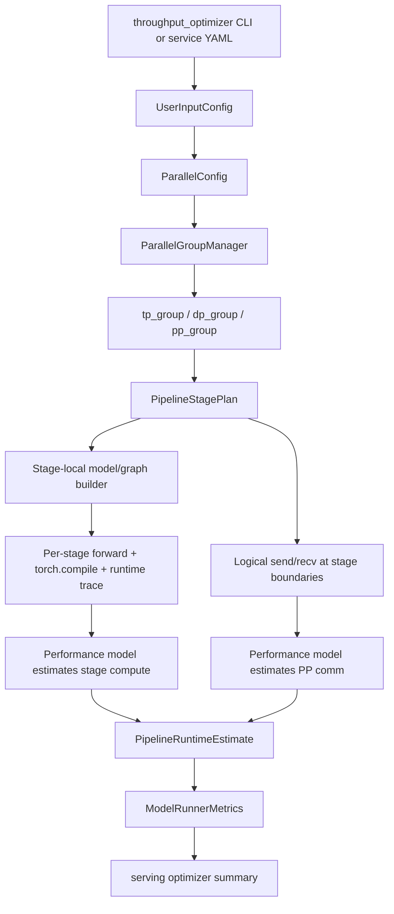
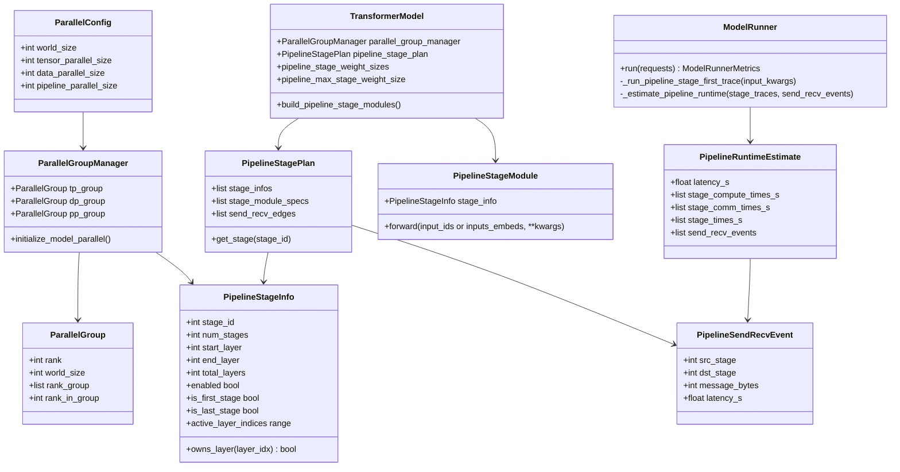

# RFC: Pipeline Parallel Simulation Support

## Metadata

| Item | Content |
| :--- | :--- |
| **Status** | Designing |
| **Author** | Secluded_Ocean |
| **Creation Date** | 2026-05-11 |
| **Updated Date** | 2026-05-19 |
| **Related Links** | <https://gitcode.com/Ascend/msmodeling/pull/187> |
| **Chinese Version** | [rfc_pipeline_parallel_support_zh.md](rfc_pipeline_parallel_support_zh.md) |

---

## 1. Problem Statement

TensorCast and the serving throughput optimizer need Pipeline Parallel (PP) configuration support on top of existing TP/DP/EP/MoE estimation. PP partitions one decoder-only LLM replica into multiple pipeline stages by layer. Each stage owns only part of the decoder layers and its stage-local KV cache, and adjacent stages exchange hidden states. If the throughput optimizer keeps estimating the model as a full single-stage graph, it overestimates per-rank weights/cache memory and cannot reflect inter-stage communication, pipeline bubbles, or the `tp_size * pp_size * dp_size == world_size` constraint in search results.

This RFC adopts a **stage-first PP trace** design: split the model into PP stages before runtime tracing, run stage-local forward, `torch.compile`/runtime trace, and performance-model estimation for each stage separately, then insert logical `send/recv` events between adjacent stages and use a pipeline scheduler to aggregate latency, bubbles, and breakdowns.

This avoids the previous full-model-first approach. A full-model trace may include cross-layer fusion, compiler graph optimizations, or framework overhead that crosses a future PP boundary. In real PP execution, stage boundaries and `send/recv` break those optimizations. Splitting or attributing a full-model trace after the fact can therefore overestimate or underestimate stage compute in corner cases.

### 1.1 Goals

- Add `--pp-sizes` to the throughput optimizer CLI and combine it with `--tp-sizes`, `--ep-sizes`, and `--moe-dp-sizes` to generate valid search spaces.
- Expose `parallel_config.pp_size` in serving YAML and pass it to TensorCast `UserInputConfig`.
- Add `pp_group` in `ParallelGroupManager`, sharing the same dimensional layout semantics as TP/DP rank groups.
- Build stage-local models/graphs before runtime trace, so each stage only contains its own decoder layers and edge-stage modules.
- Run forward, `torch.compile`, runtime trace, and performance-model estimation independently for each stage, preventing cross-PP-boundary fused ops from polluting estimates.
- Insert logical `send/recv` events between adjacent stages and estimate communication time from hidden-state message size, topology bandwidth, and latency.
- Estimate weights memory, KV cache per token, and total KV cache in a stage-aware way when PP is enabled.
- Present `PP Compute`, `PP Comm`, and `PP Bubble` separately in serving result breakdowns.
- Preserve current behavior, search results, and output format when `pp_size=1`.

### 1.2 Non-Goals

- The first version does not implement real cross-process distributed execution. `send/recv` are logical communication events in runtime trace and performance modeling, not real tensor transfers.
- The first version does not implement strict event-level 1F1B, interleaved PP, or virtual pipeline stage scheduling.
- The first version does not parse `_pp_plan` automatically and does not support user-declared non-uniform stage partitions.
- The first version does not provide full stage-local behavior for VL, MTP, or multimodal models. These models fall back to conservative estimates or skip stage-first tracing on related paths.
- The first version does not redefine the combination semantics of MoE/EP rank groups and PP stages. MoE groups continue to use the existing global `EP * MOE-TP * MOE-DP == world_size` semantics.
- The first version does not require profiling databases to already contain stage-local samples. Profiling/empirical PP support can be added through a separate contract later.

## 2. Design

### 2.1 Recommended Approach

The recommended approach is a layered design: configuration search, stage-first graph partitioning, per-stage tracing/modeling, logical send/recv, and pipeline scheduling.



The design does not hard-code PP estimation in CLI or serving. CLI and serving only produce candidates and pass `pp_size`; the TensorCast model and runner handle the stage plan, stage-local graph construction, memory estimation, runtime traces, communication events, and latency aggregation; the serving summary only formats PP breakdowns.

#### 2.1.1 Class Diagram



#### 2.1.2 Sequence Diagram

```mermaid
sequenceDiagram
    participant CLI as CLI/Serving Optimizer
    participant UIC as UserInputConfig
    participant TM as TransformerModel
    participant PGM as ParallelGroupManager
    participant PP as pipeline_parallel helpers
    participant MR as ModelRunner
    participant RT as Runtime
    participant PM as Performance Model
    participant OUT as Metrics/Summary

    CLI->>UIC: Set world_size/tp_size/pp_size/dp_size
    UIC->>TM: Build TensorCast model
    TM->>PGM: Initialize TP/DP/PP groups from ParallelConfig
    PGM-->>TM: Return pp_group.rank_in_group/world_size
    TM->>PP: build_pipeline_stage_plan(total_layers, pp_group)
    PP-->>TM: PipelineStagePlan
    MR->>MR: Generate inputs, KV cache, and attention metadata
    loop Each pipeline stage
        MR->>TM: build_pipeline_stage_module(stage_info)
        TM-->>MR: stage-local model/graph
        MR->>PP: build_pipeline_stage_inputs(...)
        PP-->>MR: Stage 0 uses input_ids; later stages use inputs_embeds
        MR->>RT: stage-local forward / torch.compile / runtime trace
        RT-->>MR: stage-local op trace
        MR->>PM: Model stage-local trace
        PM-->>MR: stage_compute_time_s
    end
    MR->>PP: build_pipeline_send_recv_events(...)
    PP-->>MR: logical send/recv events
    MR->>PM: Model send/recv events
    PM-->>MR: stage_comm_times_s
    MR->>PP: estimate_pipeline_runtime_from_stage_times(...)
    PP-->>MR: latency_s, compute, comm, bubble
    MR->>OUT: Write ModelRunnerMetrics.breakdowns
    OUT-->>CLI: Display PP Compute / PP Comm / PP Bubble
```

### 2.2 Configuration and Search Space

#### 2.2.1 CLI Argument

`cli/inference/throughput_optimizer.py` adds `--pp-sizes`:

```bash
python -m cli.inference.throughput_optimizer \
  --input-length 2048 \
  --output-length 512 \
  --num-devices 8 \
  --tp-sizes 1 2 \
  --pp-sizes 1 2 4 \
  Qwen/Qwen3-32B
```

CLI contract:

| Argument State | Behavior |
| :--- | :--- |
| No search-size argument is specified | Backward-compatible behavior: search TP by default and fix `pp_size` to 1. |
| `--pp-sizes` is not specified | `resolve_search_sizes(None, num_devices, 1)`, so PP is fixed to `[1]`. |
| `--pp-sizes` is specified with values | Use explicit values; each value must be a positive integer not greater than `num_devices`. |
| `--pp-sizes` is specified without values | Use `resolve_search_sizes([], num_devices, 1)` to generate powers-of-two candidates. |
| Search combinations are invalid | If no candidate combination satisfies divisibility constraints, argument parsing exits with an error. |

#### 2.2.2 serving YAML

`serving_cast.config.ParallelConfig` adds `pp_size: int = 1`. service YAML can declare:

```yaml
parallel_config:
  world_size: 8
  tp_size: 2
  pp_size: 2
  dp_size: 2
```

`serving_cast.model_runner.ModelRunner.init_tensor_cast_model_runner()` passes `pp_size` when constructing TensorCast `UserInputConfig`, so serving configuration and TensorCast runtime share the same PP entry point.

#### 2.2.3 Search Space Generation

`serving_cast.parallel_runner.ParallelRunner._get_user_config()` extends the search space from:

```text
tp_sizes x ep_sizes x moe_dp_sizes
```

to:

```text
tp_sizes x pp_sizes x ep_sizes x moe_dp_sizes
```

Candidate filtering rules:

| Rule | Meaning |
| :--- | :--- |
| `target_devices % (tp * pp) == 0` | TP and PP together determine the number of devices for one complete pipeline replica. |
| `dp_size = target_devices // (tp * pp)` | DP is the number of complete pipeline replicas. |
| `target_devices % ep == 0` | Preserve the existing EP divisibility constraint. |
| `target_devices % (ep * moe_dp) == 0` | Preserve the existing MoE-DP divisibility constraint. |
| `moe_tp_size = target_devices // (ep * moe_dp)` | MoE-TP is still derived from the existing global formula. |

### 2.3 Rank Group Semantics

`ParallelGroupManager.initialize_model_parallel()` reshapes global ranks with the following dimensions:

```text
[-1, data_parallel_size, pipeline_parallel_size, expert_parallel_size, tensor_parallel_size]
```

Group expansion semantics:

| Group | Dimensional Meaning | Behavior |
| :--- | :--- | :--- |
| `tp_group` | Tensor parallel ranks within the same stage | Passes `pipeline_parallel_size`, so TP groups are generated locally inside the PP dimension. |
| `dp_group` | Data parallel ranks across complete pipeline replicas | Passes `pipeline_parallel_size`, so DP groups are separated from the PP dimension. |
| `pp_group` | Cross-stage ranks at the same TP/DP coordinate | Adds `ParallelGroupType.PIPELINE_PARALLEL` and generates rank groups along the PP dimension. |
| `ep_group` / `moe_tp_group` / `moe_dp_group` | Existing MoE groups | Temporarily pass `pipeline_parallel_size=1`, preserving global MoE semantics without introducing stage-local MoE combinations. |

Example: with `world_size=8, tp_size=2, pp_size=4, dp_size=1`, ranks are organized by `[DP, PP, TP]`. For `rank=4`, `pp_group.rank_group == [0, 2, 4, 6]` and `rank_in_group == 2`. This means rank 4 is the second pipeline stage on the same TP lane.

### 2.4 Pipeline Stage Modeling

#### 2.4.1 `PipelineStageInfo`

`tensor_cast/pipeline_parallel.py` defines an immutable dataclass:

```python
@dataclasses.dataclass(frozen=True)
class PipelineStageInfo:
    stage_id: int
    num_stages: int
    start_layer: int
    end_layer: int
    total_layers: int
```

Derived properties:

| Property or Method | Meaning |
| :--- | :--- |
| `enabled` | True when `num_stages > 1`. |
| `is_first_stage` | Whether the current stage is the first stage. |
| `is_last_stage` | Whether the current stage is the last stage. |
| `active_layer_indices` | The `[start_layer, end_layer)` range. |
| `owns_layer(layer_idx)` | Whether a layer belongs to the current stage. |

#### 2.4.2 Uniform Layer Partitioning

The first version partitions by decoder layer count:

```text
layers_per_stage = ceil(total_layers / num_stages)
start_layer = min(stage_id * layers_per_stage, total_layers)
end_layer = min((stage_id + 1) * layers_per_stage, total_layers)
```

Characteristics:

- Earlier stages receive the `ceil` layer count first.
- The last stage is clamped with `min()` to avoid out-of-range indices.
- When `num_stages > total_layers`, later stages may own an empty layer range. Actual configurations should be evaluated through candidate filtering or tests.
- Partitioning is only by decoder layer. Embedding, norm, and lm_head are non-layer modules and are handled separately by edge-stage rules.

#### 2.4.3 Stage-First Graph Construction

PP tracing should not run the full model first and then split the trace result. The recommended approach builds a stage-local graph before tracing:

| Component | Responsibility |
| :--- | :--- |
| `PipelineStagePlan` | Stores all `PipelineStageInfo` objects, per-stage module ownership, stage boundaries, and send/recv edges. |
| `build_pipeline_stage_module(stage_info)` | Builds a stage-local module/view from the full model, so the current stage contains only modules it should execute. |
| `PipelineStageModule` | Exposes the stage-local forward entry point. The first stage receives `input_ids`; later stages receive `inputs_embeds`. |
| `build_pipeline_stage_inputs()` | Builds runtime trace inputs for each stage; non-first stages receive correctly shaped hidden states. |
| `restore`/context management | If temporary module views or wrappers are used, the original model state must be restored through context management. |

With this strategy, `torch.compile` and runtime trace see the stage-local graph. Cross-stage fused ops are broken by the stage module boundary and logical `send/recv`, which is closer to real PP deployment.

#### 2.4.4 Non-Layer Module Ownership

The PP stage-local graph must avoid executing edge-only modules in middle stages:

| Module Category | stage 0 | Middle Stage | Last Stage |
| :--- | :--- | :--- | :--- |
| embedding / input ids | Kept | Not included; simulate upstream hidden states with `inputs_embeds` | Not included; simulate upstream hidden states with `inputs_embeds` |
| decoder layers | Keep only current stage layers | Keep only current stage layers | Keep only current stage layers |
| norm | Not included | Not included | Kept |
| lm_head | Not included | Not included | Kept |

`build_pipeline_stage_inputs()` builds empty `inputs_embeds` for non-first stages:

```text
inputs_embeds.shape = (*token_shape, hidden_size)
```

`token_shape` is derived from `input_ids` or `position_ids`. This allows middle and last stages to trace from the hidden states entry point without embedding.

### 2.5 TransformerModel Integration

`TransformerModel.__init__()` calls the following after `ParallelGroupManager` initialization:

```python
self.pipeline_stage_plan = build_pipeline_stage_plan(
    self.text_config.num_hidden_layers,
    self.parallel_group_manager.pp_group,
)
```

New properties and methods:

| Interface | Behavior |
| :--- | :--- |
| `pipeline_stage_plan` | Describes every stage's layer range, module ownership, and communication boundaries. |
| `build_pipeline_stage_modules()` | Builds all stage-local modules or stage-local module views. |
| `pipeline_stage_weight_size` | Weight memory estimate for the current stage. |
| `pipeline_stage_weight_sizes` | Weight memory estimates for all stages. |
| `pipeline_max_stage_weight_size` | Maximum weight memory among all stages; `ModelRunner` uses it as the model weight memory in PP mode. |
| `get_language_layers()` | Locates the decoder layer list through `custom_model_registry.get_language_layers(model_type)`. |

Weight memory estimation rules:

| Model or Stage | Estimation |
| :--- | :--- |
| `pp_size=1` | Return full-model weights. |
| VL or MTP model | Fall back to full-model weights and log a warning. |
| Unable to locate language layers | Fall back to full-model weights and log a warning. |
| First stage | `embedding + active_layer_size`. |
| Middle stage | `active_layer_size`. |
| Last stage | `active_layer_size + norm + lm_head`. |

If the framework cannot precisely split non-layer weights yet, it can temporarily use a conservative estimate:

```text
edge_stage_weight = active_layer_size + non_layer_size
```

and report `pipeline_max_stage_weight_size` externally to avoid underestimating peak per-card weight memory.

### 2.6 KV Cache and Indexer Cache Estimation

`tensor_cast/core/input_generator.py` connects cache estimation to the stage plan:

| Function | PP Behavior |
| :--- | :--- |
| `_get_kv_cache_info()` | `kv_cache_by_layers` may keep metadata for all layers, but `kv_cache_per_token` only accumulates active layers for the current stage. |
| `get_kv_cache_info()` | Same behavior for the generic KV cache path. |
| `get_dsa_indexer_cache_info()` | DSA indexer cache per token only accumulates active layers for the current stage. |

When PP is enabled, `ModelRunner.run()` traverses all stages in `PipelineStagePlan` and reports the maximum KV cache size among stages:

```text
kv_cache_size_gb = max(stage_kv_cache_bytes) / 1024^3
```

The reported value is the largest single-stage KV cache requirement rather than the global sum across all model layers.

### 2.7 Pipeline Communication and Latency Model

#### 2.7.1 Hidden States Message Size

The first version models logical `send/recv` of hidden states between adjacent stages:

```text
message_bytes = num_tokens * hidden_size * dtype_size
```

Implementation entry:

```python
estimate_hidden_states_message_bytes(num_tokens, hidden_size, dtype)
```

Inputs require `num_tokens >= 0` and `hidden_size >= 0`.

#### 2.7.2 Send/Recv Communication Events

`build_pipeline_send_recv_events()` generates logical communication edges between adjacent stages:

```text
stage_i --send(hidden_states)--> stage_i+1
stage_i+1 <--recv(hidden_states)-- stage_i
```

`estimate_pipeline_send_recv_time()` uses `CommAnalyticModel(device_profile)` and queries bandwidth and latency through PP group ranks:

```text
one_way_time_s = latency + message_bytes / bandwidth
```

Communication terms by stage:

| Stage | incoming | outgoing |
| :--- | :--- | :--- |
| First stage | 0 | one-way time |
| Middle stage | one-way time | one-way time |
| Last stage | one-way time | 0 |
| `pp_size=1` or `message_bytes=0` | 0 | 0 |

The first version may represent send/recv as pseudo ops in runtime trace or pass them through a side channel as `PipelineSendRecvEvent` objects. The key constraint is that communication events are placed at stage boundaries, not attributed vaguely after full-model tracing.

#### 2.7.3 Stage Compute Time

Stage compute time comes from each stage-local graph's independent trace and performance-model estimate:

```text
stage_compute_time[i] = performance_model(stage_i_runtime_trace)
```

It no longer depends on distributing full-model analytic time. If a stage trace cannot be generated, a short-term fallback is allowed:

```text
stage_compute_time[i] =
    estimated_full_model_time * stage_layer_count[i] / assigned_layers
```

but the result must be marked as an approximation so users do not mistake it for completed stage-first tracing.

#### 2.7.4 Pipeline Latency Formula

Each stage time is:

```text
stage_time[i] = stage_compute_time[i] + stage_comm_time[i]
```

Overall pipeline latency is:

```text
latency_s = sum(stage_times) + (num_microbatches - 1) * max(stage_times)
```

`num_microbatches` can be derived from `len(input_kwargs["attention_meta"].query_lens)` and is at least 1. The formula is a fill-drain approximation: the first microbatch passes through all stages, and later microbatches progress at the pace of the slowest stage.

`PipelineRuntimeEstimate` stores:

| Field | Meaning |
| :--- | :--- |
| `latency_s` | Overall latency after PP adjustment. |
| `stage_compute_times_s` | Compute time for each stage. |
| `stage_comm_times_s` | Incoming + outgoing communication time for each stage. |
| `stage_times_s` | Compute + communication time per stage. |
| `send_recv_events` | Logical inter-stage communication events. |

### 2.8 ModelRunner Flow and Outputs

When PP is enabled, `ModelRunner.run()` performs:

1. Generate inputs, KV cache, and attention metadata.
2. Build `PipelineStagePlan` from `pp_size`, `pp_group`, and decoder layer count.
3. Build a stage-local model/graph for each stage.
4. Run forward, `torch.compile`, runtime trace, and performance-model estimation independently for each stage to get `stage_compute_time_s`.
5. Build logical `send/recv` events from `input_ids.numel()`, `hidden_size`, dtype, and PP rank groups, then estimate `stage_comm_time_s`.
6. Use `estimate_pipeline_runtime_from_stage_times()` to aggregate PP latency.
7. Use `PipelineRuntimeEstimate.latency_s` as the total execution time for the corresponding performance model.
8. Add `{model_name}_pipeline_parallel` to breakdowns:

```python
{
    "compute": sum(estimate.stage_compute_times_s),
    "communication": sum(estimate.stage_comm_times_s),
    "bubble": max(0.0, estimate.latency_s - sum(estimate.stage_times_s)),
}
```

Then, `serving_cast.service.utils.format_breakdowns()` formats ordinary op-bound breakdowns and PP breakdowns separately:

```text
Mem 25.00 | Comm 25.00 | Cube 50.00 | Vec 0.00 | PP Compute 50.00 | PP Comm 16.67 | PP Bubble 33.33
```

### 2.9 Compatibility and Constraints

| Scenario | Constraint |
| :--- | :--- |
| `pp_size=1` | Does not build multi-stage graphs, does not insert send/recv, and degrades to the existing single-stage behavior. |
| analytic-only | Stage-first tracing primarily serves the analytic performance model; if no analytic model is present, it may fall back to an approximation and mark it. |
| profiling/empirical | Profiling + PP needs a stage-local profiling data contract; until then, profiling mode must not claim complete PP modeling. |
| VL/MTP | Stage-local graph construction and weight estimation fall back or are skipped to avoid incorrectly pruning non-standard model structures. |
| MoE | EP/MoE groups are not included in the PP stage dimension for now, preserving existing global MoE semantics. |
| Cross-layer fusion | `torch.compile` and runtime trace must run on stage-local graphs to avoid cross-PP-boundary fusion. |
| Output fields | The `parallel` label can continue to display `TP=... \| PP=... \| DP=...`; the new PP breakdown does not change existing columns such as `ttft`, `tpot`, and `token/s`. |

## 3. Alternatives

### 3.1 Only Extend Configuration and Search

This option adds only `--pp-sizes`, serving `pp_size`, and `pp_group`, while still estimating the model with the full layer count and full KV cache.

Advantages:

- Minimal change scope.
- Lower risk to existing TP/EP paths.

Disadvantages:

- Search results overestimate PP per-card memory and ignore or underestimate inter-stage communication and bubbles.
- Differences between `pp_size > 1` and `pp_size=1` mainly come from DP derivation rather than PP itself.
- Users can easily assume complete PP performance modeling already exists.

This RFC does not choose this option.

### 3.2 Full-Model Forward/Trace First, Then Split PP Results

This option first runs TensorCast forward/runtime trace on the unsplit full model, obtains full-model analytic time, then attributes time to stages through stage-local replacement or layer-count ratios.

Advantages:

- Smaller change scope.
- Reuses existing full-model trace and fallback logic.
- Simple compatibility path for `pp_size=1`.

Disadvantages:

- Full-model trace may include cross-layer fused ops across future PP boundaries, which does not match real PP stage boundaries.
- Shared overhead requires after-the-fact attribution and is sensitive to model structure, wrappers, and compile graphs.
- Send/recv can only be appended as a formula and does not naturally appear at stage boundaries in trace.
- It does not match deployment semantics such as vLLM-Ascend, where stages are split before compile/trace.

This RFC keeps this option only as a short-term fallback, not the recommended main path.

### 3.3 Real Pipeline Runtime Simulation

This option explicitly constructs send/recv ops, microbatch events, stage queues, and overlap in Runtime, and outputs Chrome traces.

Advantages:

- Higher precision and explainability.
- Future support for 1F1B, interleaved PP, virtual stages, and communication-computation overlap becomes natural.

Disadvantages:

- Requires changes to Runtime scheduling, input generation, trace schema, and performance model interfaces.
- Has broad impact on both analytic and profiling performance models.
- Implementation cost is too high for the first stage of PP search support.

This RFC uses stage-first tracing plus a fill-drain latency approximation as an intermediate architecture before real pipeline runtime simulation.

### 3.4 Model-Declared `_pp_plan`

This option reads `_pp_plan` or `base_model_pp_plan` from HuggingFace or model configuration and partitions stages according to model declarations.

Advantages:

- Closer to real deployment strategies.
- Can express embedding, norm, lm_head, special blocks, and non-uniform layer assignments.

Disadvantages:

- Declaration formats and completeness differ across models.
- Requires maintaining mappings from model structure to TensorCast wrappers.
- Not required for first-version PP search and memory trend validation.

This RFC uses uniform decoder layer partitioning and leaves `_pp_plan` for later extensions.

## 4. Implementation Plan and Future Evolution

### 4.1 Implementation Items

| Item | Status | Implementation Scope | Acceptance Gate |
| :--- | :--- | :--- | :--- |
| CLI PP search entry | To do | Add `--pp-sizes`, candidate validation, and trailing model id normalization. | Tests cover explicit PP sizes and invalid combination exits. |
| serving PP configuration | To do | Add `serving_cast.config.ParallelConfig.pp_size` and pass it into TensorCast `UserInputConfig`. | Tests cover YAML parsing and `ModelRunner` argument propagation. |
| PP rank group | To do | Add `ParallelGroupType.PIPELINE_PARALLEL` and `pp_group`. | Tests cover PP rank group dimensions. |
| Stage plan and stage-local graph | To do | Add `PipelineStagePlan`, uniform partitioning, stage-local modules, and edge-stage module ownership. | Tests cover even/uneven partitioning and first/middle/last stage graph behavior. |
| Stage-aware memory estimation | To do | Add `pipeline_max_stage_weight_size`, active-layer KV cache per token, and maximum stage KV cache. | Tests cover weight and KV cache active-layer behavior. |
| Stage-first runtime trace | To do | Run per-stage forward, compile, trace, and performance-model estimation. | Tests cover no cross-stage fusion, stage trace fallback, and runtime estimates. |
| Logical send/recv modeling | To do | Add hidden-states message bytes, stage-boundary send/recv pseudo events, and communication latency. | Tests cover communication boundaries, first/middle/last communication direction, and topology bandwidth selection. |
| PP latency estimation | To do | Add stage compute + comm, fill-drain latency, and bubble calculation. | Tests cover latency formula and microbatch boundaries. |
| serving breakdown display | To do | Separate op-bound breakdowns from PP breakdowns in `format_breakdowns()`. | Tests cover `PP Compute`, `PP Comm`, and `PP Bubble` formatting. |

### 4.2 Test Plan

Minimum test gate:

```bash
python -m pytest tests/test_throughput_optimizer.py -q
python -m pytest tests/test_tensor_cast/test_pipeline_parallel.py -q
python -m pytest serving_cast/tests/ut/test_config.py -q
python -m pytest serving_cast/tests/ut/test_service/test_common.py -q
python -m pytest serving_cast/tests/ut/test_service/test_base_optimizer.py -q
python -m pytest serving_cast/tests/ut/test_service/test_parallel_runnner.py -q
python -m pytest serving_cast/tests/ut/test_tensor_cast_model_runner.py -q
```

Required coverage:

| Area | Required Coverage |
| :--- | :--- |
| CLI arguments | Explicit `--pp-sizes`, defaults, invalid combinations, and trailing model id. |
| Search space | `tp * pp` divisibility filtering, `dp_size = num_devices // (tp * pp)`. |
| Configuration propagation | service YAML to serving `ParallelConfig`, then to TensorCast `UserInputConfig`. |
| Rank groups | PP dimension rank groups, `rank_in_group`, and relationship with TP/DP dimensions. |
| Stage partitioning | Even/uneven layer split, empty-stage boundary, and active layer indices. |
| Stage-local graph | First stage keeps embedding, middle stages use `inputs_embeds`, and last stage keeps norm/lm_head. |
| Compile/trace boundary | `torch.compile` and runtime trace execute on stage-local graphs and do not fuse across PP boundaries. |
| Cache estimation | KV cache and DSA indexer cache only accumulate active stage layers. |
| Communication modeling | Message bytes, send/recv pseudo events, first/middle/last communication direction, topology bandwidth, and latency. |
| Latency model | Stage compute, stage comm, fill-drain latency, microbatch count, and bubble. |
| Output format | PP breakdown is displayed separately from the original op-bound breakdown. |

### 4.3 Future Evolution

| Evolution Item | Trigger | Scope | Exit Criteria |
| :--- | :--- | :--- | :--- |
| Configurable stage partition | Uniform partitioning does not match target model deployment. | Support manual stage layer ranges or `_pp_plan`. | RFC updated and non-uniform partition tests added. |
| VL/MTP/multimodal PP | Target models need PP search. | Define ownership for vision tower, MTP head, language layers, and output layers. | No full-model weight fallback; stage traces run stably. |
| PP + MoE stage-local groups | MoE models need simultaneous PP and EP search. | Redefine stage-local EP/MoE-TP/MoE-DP groups and global group relationships. | Rank groups, cache, dispatch/combine communication all have test coverage. |
| Real send/recv kernels | Real distributed communication or end-to-end pipeline execution is needed. | Evolve logical send/recv pseudo events into real Runtime ops. | Real communication kernels appear in trace and align with device execution. |
| Strict microbatch scheduling | Fill-drain approximation error is not acceptable. | Support event-level 1F1B, interleaved PP, and bubble/overlap simulation. | Aligned with real scheduling or a reference simulator, with error reports. |
| Profiling/empirical PP | Profiling database needs to support PP. | Define stage-local profiling data, communication CSV, and empirical stage aggregation contract. | PP output in profiling mode is explainable and has coverage metrics. |

### 4.4 Runtime Constraints

- Users must ensure `world_size == tp_size * pp_size * dp_size`; invalid combinations should surface during configuration validation or candidate filtering.
- PP estimation primarily targets decoder-only LLMs. Non-standard model structures require explicit validation.
- PP latency is a simulation estimate and does not mean TensorCast has performed real distributed pipeline execution.
- `torch.compile`, runtime trace, and performance-model estimation must use stage-local graphs instead of post-processing a full-model trace.
- In the first version, `send/recv` are logical communication events; real communication kernels and overlap modeling are future work.
- `pipeline_max_stage_weight_size` and maximum stage KV cache are conservative per-rank peak metrics and are not equal to global total memory.
- `PP Bubble` comes from the fill-drain formula. When the microbatch count is 1, bubble is 0.
