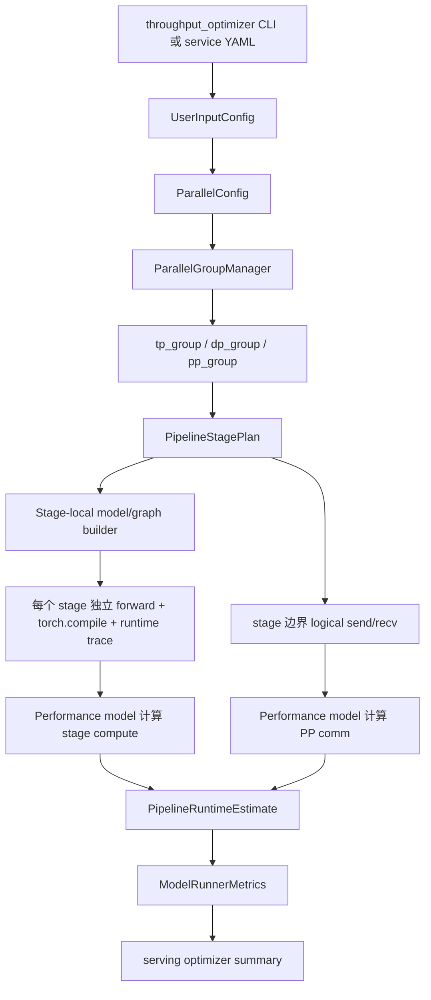
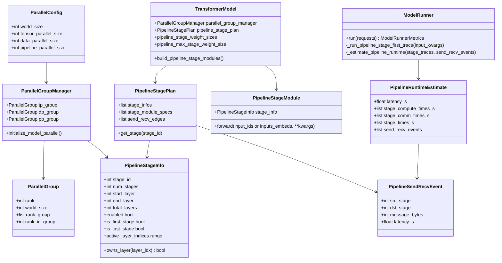
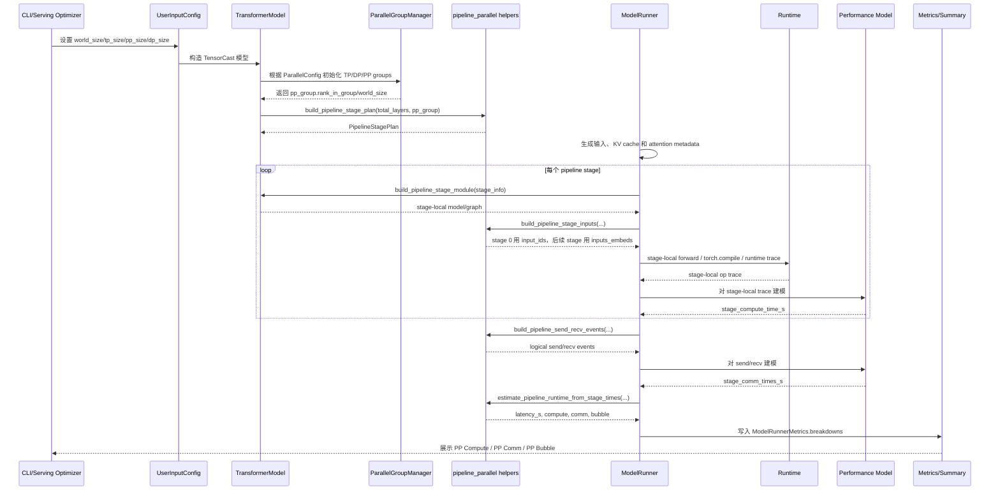

# RFC: Pipeline Parallel 并行仿真支持

## 元数据

| 项目 | 内容 |
| :--- | :--- |
| **状态** | 设计中 |
| **作者** | Secluded_Ocean |
| **创建日期** | 2026-05-11 |
| **更新日期** | 2026-05-19 |
| **相关链接** | <https://gitcode.com/Ascend/msmodeling/pull/187> |
| **英文版本** | [rfc_pipeline_parallel_support_en.md](rfc_pipeline_parallel_support_en.md) |

---

## 1. 问题陈述（概述）

TensorCast 和 serving 吞吐优化器需要在现有 TP/DP/EP/MoE 估算能力之上支持 Pipeline Parallel（PP）并行配置。PP 会把同一个 decoder-only LLM 副本按 layer 划分成多个 pipeline stage，每个 stage 只承担一部分 layer 的计算与 KV cache 显存，并在相邻 stage 之间传递 hidden states。若吞吐优化器仍按完整模型单 stage 估算，会高估单 rank 权重/缓存显存，也无法体现 stage 间通信、pipeline bubble 和 `tp_size * pp_size * dp_size == world_size` 约束对搜索结果的影响。

本 RFC 采用 **stage-first PP trace** 方案：在 runtime trace 之前先切分 PP stage，每个 stage 分别走 stage-local forward、`torch.compile`/runtime trace 和 performance model 建模，然后在 stage 边界插入逻辑 `send/recv` 通信事件，最后由 pipeline scheduler 汇总整体 latency、bubble 和 breakdown。

该方案避免先对完整模型 forward/trace 后再拆分或组装 PP 结果。完整模型 trace 可能包含跨 stage 边界的跨层融合、编译器图优化或框架级共享开销；这些优化在真实 PP 执行中会被 stage 边界和 `send/recv` 打断，若先 trace 完整模型再拆分，容易在 corner case 下高估或低估 stage compute。

### 1.1 目标

- 在吞吐优化器 CLI 中新增 `--pp-sizes`，并与 `--tp-sizes`、`--ep-sizes`、`--moe-dp-sizes` 共同生成合法搜索空间。
- 在 serving YAML 配置中暴露 `parallel_config.pp_size`，并传递到 TensorCast `UserInputConfig`。
- 在 `ParallelGroupManager` 中建立 `pp_group`，使 PP rank group 与 TP/DP rank group 共享同一维度展开语义。
- 在 runtime trace 之前构造 stage-local model/graph，使每个 stage 只包含自己负责的 decoder layers 和 edge-stage 模块。
- 对每个 stage 独立执行 forward、`torch.compile`、runtime trace 和 performance model 建模，避免跨 PP 边界的融合算子污染估算。
- 在相邻 stage 之间插入逻辑 `send/recv` 通信事件，并基于 hidden states 消息大小、设备拓扑带宽和延迟估算通信耗时。
- 对 PP 模式下的权重显存、KV cache per token 和总 KV cache 采用 stage-aware 估算。
- 在 serving 结果 breakdown 中单独展示 `PP Compute`、`PP Comm` 和 `PP Bubble`，避免与原有 op-bound breakdown 混淆。
- 保持 `pp_size=1` 时的现有行为、搜索结果和输出格式兼容。

### 1.2 非目标

- 首版不实现真实跨进程分布式执行；`send/recv` 是 runtime trace 和性能模型中的逻辑通信事件，不要求真实传输 tensor。
- 首版不实现严格事件级 1F1B、interleaved PP 或虚拟 pipeline stage 调度。
- 首版不做自动 `_pp_plan` 解析，不支持用户手动声明非均匀 stage partition。
- 首版不为 VL、MTP、多模态模型提供完整 stage-local 行为；这些模型在相关路径上回退到保守估算或跳过 stage-first trace。
- 首版不重新定义 MoE/EP rank group 与 PP stage 的组合语义。MoE group 仍沿用 `EP * MOE-TP * MOE-DP == world_size` 的既有全局语义。
- 首版不强制要求 profiling database 已经存在 stage-local 采样数据；profiling/empirical PP 可作为后续独立契约扩展。

## 2. 方案设计

### 2.1 推荐方案

推荐方案采用“配置搜索 + stage-first graph partition + per-stage trace/modeling + logical send/recv + pipeline scheduler”的分层设计：



该方案不把 PP 估算硬编码到 CLI 或 serving 层。CLI/serving 只负责产生候选并传递 `pp_size`；TensorCast 模型和 runner 负责 stage 计划、stage-local graph 构造、显存估算、runtime trace、通信事件和 latency 汇总；serving summary 只负责格式化 PP breakdown。

#### 2.1.1 类图



#### 2.1.2 时序图



### 2.2 配置与搜索空间

#### 2.2.1 CLI 参数

`cli/inference/throughput_optimizer.py` 新增 `--pp-sizes`：

```bash
python -m cli.inference.throughput_optimizer \
  --input-length 2048 \
  --output-length 512 \
  --num-devices 8 \
  --tp-sizes 1 2 \
  --pp-sizes 1 2 4 \
  Qwen/Qwen3-32B
```

CLI 契约：

| 参数状态 | 行为 |
| :--- | :--- |
| 未指定任何 search-size 参数 | 向后兼容，默认搜索 TP，`pp_size` 固定为 1。 |
| 未指定 `--pp-sizes` | `resolve_search_sizes(None, num_devices, 1)`，即 PP 固定为 `[1]`。 |
| 指定 `--pp-sizes` 且带值 | 使用显式值，并要求每个值为正整数且不超过 `num_devices`。 |
| 指定 `--pp-sizes` 但不带值 | 使用 `resolve_search_sizes([], num_devices, 1)` 生成 powers-of-two 候选。 |
| 搜索组合非法 | 若不存在满足整除约束的候选组合，CLI 解析阶段报错退出。 |

#### 2.2.2 serving YAML

`serving_cast.config.ParallelConfig` 新增 `pp_size: int = 1`。service YAML 可以声明：

```yaml
parallel_config:
  world_size: 8
  tp_size: 2
  pp_size: 2
  dp_size: 2
```

`serving_cast.model_runner.ModelRunner.init_tensor_cast_model_runner()` 在构造 TensorCast `UserInputConfig` 时传递 `pp_size`，使 serving 配置与 TensorCast 运行时使用同一 PP 入口。

#### 2.2.3 搜索空间生成

`serving_cast.parallel_runner.ParallelRunner._get_user_config()` 将搜索空间从：

```text
tp_sizes x ep_sizes x moe_dp_sizes
```

扩展为：

```text
tp_sizes x pp_sizes x ep_sizes x moe_dp_sizes
```

候选过滤规则：

| 规则 | 含义 |
| :--- | :--- |
| `target_devices % (tp * pp) == 0` | TP 与 PP 共同决定一个完整 pipeline 副本的设备数。 |
| `dp_size = target_devices // (tp * pp)` | DP 表示完整 pipeline 副本数量。 |
| `target_devices % ep == 0` | 保持既有 EP 整除约束。 |
| `target_devices % (ep * moe_dp) == 0` | 保持既有 MoE-DP 整除约束。 |
| `moe_tp_size = target_devices // (ep * moe_dp)` | MoE-TP 仍按既有全局公式推导。 |

### 2.3 Rank Group 语义

`ParallelGroupManager.initialize_model_parallel()` 使用如下维度 reshape 全局 rank：

```text
[-1, data_parallel_size, pipeline_parallel_size, expert_parallel_size, tensor_parallel_size]
```

不同 group 的展开方式：

| Group | 维度语义 | 行为 |
| :--- | :--- | :--- |
| `tp_group` | 同一 stage 内的 tensor parallel ranks | 传入 `pipeline_parallel_size`，保证 TP group 在 PP 维度内局部生成。 |
| `dp_group` | 完整 pipeline 副本之间的数据并行 ranks | 传入 `pipeline_parallel_size`，DP group 与 PP 维度解耦。 |
| `pp_group` | 同一 TP/DP 坐标下跨 stage ranks | 新增 `ParallelGroupType.PIPELINE_PARALLEL`，按 PP 维度生成 rank group。 |
| `ep_group` / `moe_tp_group` / `moe_dp_group` | MoE 既有 group | 暂时传入 `pipeline_parallel_size=1`，保持 MoE 全局语义，不引入 stage-local MoE 组合。 |

示例：`world_size=8, tp_size=2, pp_size=4, dp_size=1` 时，rank 会按 `[DP, PP, TP]` 组织。对于 `rank=4`，`pp_group.rank_group == [0, 2, 4, 6]`，`rank_in_group == 2`。这表示 rank 4 是同一 TP lane 上第 2 个 pipeline stage。

### 2.4 Pipeline Stage 建模

#### 2.4.1 `PipelineStageInfo`

`tensor_cast/pipeline_parallel.py` 定义不可变 dataclass：

```python
@dataclasses.dataclass(frozen=True)
class PipelineStageInfo:
    stage_id: int
    num_stages: int
    start_layer: int
    end_layer: int
    total_layers: int
```

派生属性：

| 属性或方法 | 含义 |
| :--- | :--- |
| `enabled` | `num_stages > 1` 时为 true。 |
| `is_first_stage` | 当前 stage 是否为第一个 stage。 |
| `is_last_stage` | 当前 stage 是否为最后一个 stage。 |
| `active_layer_indices` | `[start_layer, end_layer)` 范围。 |
| `owns_layer(layer_idx)` | 判断 layer 是否归当前 stage 所有。 |

#### 2.4.2 均匀 layer 切分

首版按 decoder layer 数量做均匀切分：

```text
layers_per_stage = ceil(total_layers / num_stages)
start_layer = min(stage_id * layers_per_stage, total_layers)
end_layer = min((stage_id + 1) * layers_per_stage, total_layers)
```

该算法的特点：

- 前面的 stage 会优先拿到 `ceil` 后的 layer 数。
- 最后一个 stage 使用 `min()` 截断，避免越界。
- 当 `num_stages > total_layers` 时，后续 stage 可能拥有空 layer 范围；实际配置应通过候选过滤或测试评估是否合理。
- 切分只以 decoder layer 为单位；embedding、norm、lm_head 属于 non-layer 模块，按 edge-stage 规则单独处理。

#### 2.4.3 Stage-first graph 构造

PP trace 不应先运行完整模型再在 trace 结果上拆分。推荐在 trace 之前构造 stage-local graph：

| 组件 | 职责 |
| :--- | :--- |
| `PipelineStagePlan` | 保存所有 `PipelineStageInfo`、每个 stage 的模块归属、stage 边界和 send/recv edge。 |
| `build_pipeline_stage_module(stage_info)` | 基于完整模型构造 stage-local module/view，使当前 stage 只包含需要执行的模块。 |
| `PipelineStageModule` | 暴露 stage-local forward 入口，首 stage 接收 `input_ids`，后续 stage 接收 `inputs_embeds`。 |
| `build_pipeline_stage_inputs()` | 为不同 stage 构造 runtime trace 输入，非首 stage 使用形状正确的 hidden states。 |
| `restore`/上下文管理 | 若采用临时 module view 或 wrapper，必须通过上下文管理恢复原模型状态。 |

该策略使 `torch.compile` 和 runtime trace 看到的就是 stage-local graph。跨 stage 边界的算子融合会被 stage module 边界和逻辑 `send/recv` 打断，更贴近真实 PP 部署。

#### 2.4.4 Non-layer 模块归属

PP stage-local graph 需要避免中间 stage 执行只属于首尾 stage 的模块：

| 模块类别 | stage 0 | 中间 stage | 最后 stage |
| :--- | :--- | :--- | :--- |
| embedding / input ids | 保留 | 不包含；用 `inputs_embeds` 模拟上游 hidden states | 不包含；用 `inputs_embeds` 模拟上游 hidden states |
| decoder layers | 只包含本 stage layers | 只包含本 stage layers | 只包含本 stage layers |
| norm | 不包含 | 不包含 | 保留 |
| lm_head | 不包含 | 不包含 | 保留 |

`build_pipeline_stage_inputs()` 对非首 stage 构造空的 `inputs_embeds`：

```text
inputs_embeds.shape = (*token_shape, hidden_size)
```

其中 `token_shape` 从 `input_ids` 或 `position_ids` 推导。这样中间/末尾 stage 的 trace 可以从 hidden states 入口开始，而不需要 embedding。

### 2.5 TransformerModel 集成

`TransformerModel.__init__()` 在 `ParallelGroupManager` 初始化后调用：

```python
self.pipeline_stage_plan = build_pipeline_stage_plan(
    self.text_config.num_hidden_layers,
    self.parallel_group_manager.pp_group,
)
```

新增属性和方法：

| 接口 | 行为 |
| :--- | :--- |
| `pipeline_stage_plan` | 描述所有 stage 的 layer 范围、模块归属和通信边界。 |
| `build_pipeline_stage_modules()` | 构造所有 stage-local modules 或 stage-local module views。 |
| `pipeline_stage_weight_size` | 当前 stage 的权重显存估算。 |
| `pipeline_stage_weight_sizes` | 所有 stage 的权重显存估算列表。 |
| `pipeline_max_stage_weight_size` | 所有 stage 中最大权重显存；`ModelRunner` 用它作为 PP 模式下的模型权重显存。 |
| `get_language_layers()` | 通过 `custom_model_registry.get_language_layers(model_type)` 定位 decoder layer 列表。 |

权重显存估算规则：

| 模型或 stage | 估算方式 |
| :--- | :--- |
| `pp_size=1` | 返回完整模型权重。 |
| VL 或 MTP 模型 | 回退完整模型权重，并记录 warning。 |
| 无法定位 language layers | 回退完整模型权重，并记录 warning。 |
| 首 stage | `embedding + active_layer_size`。 |
| 中间 stage | `active_layer_size`。 |
| 末 stage | `active_layer_size + norm + lm_head`。 |

若当前框架无法精确拆分 non-layer 权重，可以短期使用保守估算：

```text
edge_stage_weight = active_layer_size + non_layer_size
```

并对外报告 `pipeline_max_stage_weight_size`，避免低估单卡峰值权重显存。

### 2.6 KV Cache 与 Indexer Cache 估算

`tensor_cast/core/input_generator.py` 的 cache 估算接入 stage plan：

| 函数 | PP 行为 |
| :--- | :--- |
| `_get_kv_cache_info()` | `kv_cache_by_layers` 可保留所有 layer metadata，但 `kv_cache_per_token` 只累计当前 stage active layers。 |
| `get_kv_cache_info()` | 同上，用于通用 KV cache 路径。 |
| `get_dsa_indexer_cache_info()` | DSA indexer cache per token 只累计当前 stage active layers。 |

`ModelRunner.run()` 在汇总 `kv_cache_size_gb` 时，如果 PP 启用，会遍历 `PipelineStagePlan` 的所有 stage，并取各 stage KV cache size 的最大值：

```text
kv_cache_size_gb = max(stage_kv_cache_bytes) / 1024^3
```

这样对外报告的是单 stage 最大 KV cache 需求，而不是完整模型所有 layer cache 的总和。

### 2.7 Pipeline 通信与时延模型

#### 2.7.1 Hidden states 消息大小

首版建模相邻 stage 之间 hidden states 的逻辑 `send/recv`：

```text
message_bytes = num_tokens * hidden_size * dtype_size
```

实现入口：

```python
estimate_hidden_states_message_bytes(num_tokens, hidden_size, dtype)
```

输入校验要求 `num_tokens >= 0` 且 `hidden_size >= 0`。

#### 2.7.2 Send/recv 通信事件

`build_pipeline_send_recv_events()` 为相邻 stage 生成逻辑通信边：

```text
stage_i --send(hidden_states)--> stage_i+1
stage_i+1 <--recv(hidden_states)-- stage_i
```

`estimate_pipeline_send_recv_time()` 使用 `CommAnalyticModel(device_profile)`，并通过 PP group 的 rank 信息查询带宽和延迟：

```text
one_way_time_s = latency + message_bytes / bandwidth
```

不同 stage 的通信项：

| Stage | incoming | outgoing |
| :--- | :--- | :--- |
| 首 stage | 0 | one-way time |
| 中间 stage | one-way time | one-way time |
| 末 stage | one-way time | 0 |
| `pp_size=1` 或 `message_bytes=0` | 0 | 0 |

首版可以把 send/recv 作为 runtime trace 中的 pseudo op，也可以在 trace 旁路中作为 `PipelineSendRecvEvent` 进入性能模型；关键约束是通信事件必须位于 stage 边界，而不是完整模型 trace 之后再含糊归因。

#### 2.7.3 Stage compute time

Stage compute time 来自每个 stage-local graph 的独立 trace 和 performance model 建模：

```text
stage_compute_time[i] = performance_model(stage_i_runtime_trace)
```

该时间不再依赖完整模型 analytic 时间分摊。若某个 stage trace 无法生成，允许短期 fallback：

```text
stage_compute_time[i] =
    estimated_full_model_time * stage_layer_count[i] / assigned_layers
```

但 fallback 必须在结果中标记为近似路径，避免用户误以为已完成 stage-first trace。

#### 2.7.4 Pipeline latency 公式

每个 stage 的总耗时：

```text
stage_time[i] = stage_compute_time[i] + stage_comm_time[i]
```

整体 pipeline latency：

```text
latency_s = sum(stage_times) + (num_microbatches - 1) * max(stage_times)
```

其中 `num_microbatches` 可由 `len(input_kwargs["attention_meta"].query_lens)` 推导，并至少为 1。该公式等价于 fill-drain 近似：第一批需要经过所有 stage，后续 microbatch 按最慢 stage 的节拍推进。

`PipelineRuntimeEstimate` 保存：

| 字段 | 含义 |
| :--- | :--- |
| `latency_s` | PP 调整后的整体 latency。 |
| `stage_compute_times_s` | 每个 stage 的 compute time。 |
| `stage_comm_times_s` | 每个 stage 的 incoming + outgoing comm time。 |
| `stage_times_s` | compute + comm 后的每 stage 总时间。 |
| `send_recv_events` | stage 间逻辑通信事件列表。 |

### 2.8 ModelRunner 时序与输出

`ModelRunner.run()` 在 PP 启用时执行以下步骤：

1. 生成输入、KV cache 和 attention metadata。
2. 根据 `pp_size`、`pp_group` 和 decoder layer 数构造 `PipelineStagePlan`。
3. 对每个 stage 构造 stage-local model/graph。
4. 对每个 stage 独立执行 forward、`torch.compile`、runtime trace 和 performance model 建模，得到 `stage_compute_time_s`。
5. 根据 `input_ids.numel()`、`hidden_size`、dtype 和 PP rank group 构造逻辑 `send/recv` 事件并估算 `stage_comm_time_s`。
6. 使用 `estimate_pipeline_runtime_from_stage_times()` 汇总 PP latency。
7. 用 `PipelineRuntimeEstimate.latency_s` 作为对应性能模型的总执行时间。
8. 在 breakdowns 中新增 `{model_name}_pipeline_parallel`：

```python
{
    "compute": sum(estimate.stage_compute_times_s),
    "communication": sum(estimate.stage_comm_times_s),
    "bubble": max(0.0, estimate.latency_s - sum(estimate.stage_times_s)),
}
```

随后，`serving_cast.service.utils.format_breakdowns()` 将普通 op-bound breakdown 与 PP breakdown 分开格式化：

```text
Mem 25.00 | Comm 25.00 | Cube 50.00 | Vec 0.00 | PP Compute 50.00 | PP Comm 16.67 | PP Bubble 33.33
```

### 2.9 兼容性与行为约束

| 场景 | 约束 |
| :--- | :--- |
| `pp_size=1` | 不构造多 stage graph，不插入 send/recv，退化为原有单 stage 行为。 |
| analytic-only | stage-first trace 优先服务 analytic 性能模型；没有 analytic 模型时可以回退近似路径并标记。 |
| profiling/empirical | profiling + PP 需要定义 stage-local profiling 数据契约；未完成前不可声称 profiling 模式已有完整 PP 建模。 |
| VL/MTP | stage-local graph 构造和权重估算回退或跳过，避免错误裁剪非标准模型结构。 |
| MoE | EP/MoE group 暂不纳入 PP stage 维度，保留既有全局 MoE 语义。 |
| 跨层融合 | `torch.compile` 和 runtime trace 必须在 stage-local graph 上执行，避免跨 PP 边界融合。 |
| 输出字段 | `parallel` 标签继续可以显示 `TP=... \| PP=... \| DP=...`；新增 PP breakdown 不改变原有 `ttft`、`tpot`、`token/s` 等列名。 |

## 3. 替代方案

### 3.1 只扩展配置和搜索，不做 stage-aware 估算

该方案只新增 `--pp-sizes`、serving `pp_size` 和 `pp_group`，但模型仍按完整层数和完整 KV cache 估算。

优点：

- 改动范围最小。
- 对现有 TP/EP 路径风险较低。

缺点：

- 搜索结果会高估 PP 单卡显存，低估或忽略 stage 间通信和 bubble。
- `pp_size > 1` 与 `pp_size=1` 的结果差异主要来自 DP 推导，而不是 PP 本身。
- 容易让用户误以为已经有完整 PP 性能建模。

本 RFC 不采用该方案。

### 3.2 先完整 forward/trace，再拆分组装 PP 结果

该方案先按未切 PP 的完整模型执行 TensorCast forward/runtime trace，获得完整模型 analytic 时间，再通过 stage-local 替换或 layer 数比例把时间归因到不同 stage。

优点：

- 改动范围较小。
- 便于复用既有 full-model trace 和 fallback 逻辑。
- 对 `pp_size=1` 兼容路径简单。

缺点：

- 完整模型 trace 可能包含跨 PP 边界的跨层融合算子，与真实 PP stage 边界不一致。
- shared overhead 需要事后归因，容易受模型结构、wrapper 和 compile graph 影响。
- send/recv 只能作为公式追加，无法自然出现在 stage 边界 trace 中。
- 对 vLLM-Ascend 这类先切 stage 再 compile/trace 的部署语义拟合度不足。

本 RFC 将该方案保留为短期降级路径，而不是推荐主路径。

### 3.3 真实 pipeline runtime 模拟

该方案在 Runtime 中显式构造 send/recv op、microbatch event、stage queue 和 overlap，并输出 Chrome trace。

优点：

- 精度和可解释性更高。
- 后续可以自然支持 1F1B、interleaved PP、virtual stage、通信计算 overlap。

缺点：

- 需要修改 Runtime 调度模型、输入生成、trace schema 和性能模型接口。
- 对当前 analytic/profiling 两套性能模型都会产生较大影响。
- 首版实现成本高，不适合作为 PP 搜索接入的第一阶段。

本 RFC 采用 stage-first trace 加 fill-drain latency 近似，作为真实 pipeline runtime 模拟之前的中间架构。

### 3.4 基于模型声明的 `_pp_plan`

该方案优先读取 HuggingFace 或模型配置中的 `_pp_plan` / `base_model_pp_plan`，按模型声明进行非均匀 stage 切分。

优点：

- 更贴近真实部署策略。
- 能表达 embedding、norm、lm_head、特殊 block 和非均匀 layer 分配。

缺点：

- 各模型声明格式和完整度不统一。
- 需要维护模型结构到 TensorCast wrapper 的映射。
- 对首版 PP 搜索和显存趋势验证不是必要条件。

本 RFC 采用均匀 decoder layer 切分，并把 `_pp_plan` 留作后续扩展。

## 4. 实施内容与后续演进

### 4.1 实施内容

| 条目 | 状态 | 实现范围 | 验收结果/门禁 |
| :--- | :--- | :--- | :--- |
| CLI PP 搜索入口 | 待实现 | 新增 `--pp-sizes`、候选校验、末尾 model id 归一化。 | 覆盖显式 PP sizes 和非法组合退出测试。 |
| serving PP 配置 | 待实现 | `serving_cast.config.ParallelConfig.pp_size`，传入 TensorCast `UserInputConfig`。 | 覆盖 YAML 解析和 `ModelRunner` 传参测试。 |
| PP rank group | 待实现 | 新增 `ParallelGroupType.PIPELINE_PARALLEL` 和 `pp_group`。 | 覆盖 PP rank group 维度测试。 |
| Stage plan 与 stage-local graph | 待实现 | `PipelineStagePlan`、均匀切分、stage-local modules、edge-stage 模块归属。 | 覆盖均匀/非均匀切分、首中末 stage graph 行为。 |
| Stage-aware 显存估算 | 待实现 | `pipeline_max_stage_weight_size`、active-layer KV cache per token、PP 最大 stage KV cache。 | 覆盖权重和 KV cache active layer 测试。 |
| Stage-first runtime trace | 待实现 | 每个 stage 单独 forward、compile、trace 和 performance model 建模。 | 覆盖无跨 stage fusion、stage trace fallback 和 runtime estimate 测试。 |
| Logical send/recv 建模 | 待实现 | hidden states message bytes、stage 边界 send/recv pseudo event、comm latency。 | 覆盖通信边界、首中末通信方向和拓扑带宽选择。 |
| PP latency 估算 | 待实现 | stage compute + comm、fill-drain latency、bubble 计算。 | 覆盖 latency 公式和 microbatch 边界。 |
| serving breakdown 展示 | 待实现 | `format_breakdowns()` 分离 op-bound 与 PP breakdown。 | 覆盖 `PP Compute`、`PP Comm`、`PP Bubble` 格式化测试。 |

### 4.2 测试计划

最小测试门禁：

```bash
python -m pytest tests/test_throughput_optimizer.py -q
python -m pytest tests/test_tensor_cast/test_pipeline_parallel.py -q
python -m pytest serving_cast/tests/ut/test_config.py -q
python -m pytest serving_cast/tests/ut/test_service/test_common.py -q
python -m pytest serving_cast/tests/ut/test_service/test_base_optimizer.py -q
python -m pytest serving_cast/tests/ut/test_service/test_parallel_runnner.py -q
python -m pytest serving_cast/tests/ut/test_tensor_cast_model_runner.py -q
```

测试覆盖要求：

| 领域 | 必要覆盖 |
| :--- | :--- |
| CLI 参数 | `--pp-sizes` 显式值、默认值、无合法组合、末尾 model id。 |
| 搜索空间 | `tp * pp` 可整除过滤，`dp_size = num_devices // (tp * pp)`。 |
| 配置传递 | service YAML 到 serving `ParallelConfig`，再到 TensorCast `UserInputConfig`。 |
| Rank group | PP 维度 rank group、`rank_in_group`、与 TP/DP 维度关系。 |
| Stage 切分 | even/uneven layer split、空 stage 边界、active layer indices。 |
| Stage-local graph | 首 stage 保留 embedding，中间 stage 使用 `inputs_embeds`，末 stage 保留 norm/lm_head。 |
| Compile/trace 边界 | `torch.compile` 和 runtime trace 在 stage-local graph 上执行，不跨 PP 边界融合。 |
| Cache 估算 | KV cache 和 DSA indexer cache 只累计 active stage layers。 |
| 通信建模 | message bytes、send/recv pseudo event、首中末通信方向、拓扑带宽和延迟。 |
| 时延模型 | stage compute、stage comm、fill-drain latency、microbatch 数和 bubble。 |
| 输出格式 | PP breakdown 与原 op-bound breakdown 分开展示。 |

### 4.3 后续演进

| 演进项 | 启动条件 | 范围 | 退出标准 |
| :--- | :--- | :--- | :--- |
| Stage partition 配置化 | 均匀切分无法满足目标模型真实部署时 | 支持手动 stage layer ranges 或 `_pp_plan`。 | RFC 更新并覆盖非均匀 partition 测试。 |
| VL/MTP/多模态 PP | 目标模型需要 PP 搜索时 | 明确视觉塔、MTP head、语言层和输出层的 stage 所属关系。 | 不再回退完整模型权重，stage trace 可稳定运行。 |
| PP + MoE stage-local group | MoE 模型需要同时搜索 PP 和 EP 时 | 重新定义 stage 内 EP/MoE-TP/MoE-DP group 与全局 group 的关系。 | rank group、cache、dispatch/combine 通信都有测试覆盖。 |
| 真实 send/recv kernel | 需要真实分布式通信或端到端 pipeline 执行时 | 从 logical send/recv pseudo event 演进为真实 Runtime op。 | trace 中可见真实通信 kernel，并与设备执行对齐。 |
| 严格 microbatch 调度 | fill-drain 近似误差不可接受时 | 支持 1F1B、interleaved PP、bubble/overlap 事件级模拟。 | 与真实调度或参考 simulator 对齐，并提供误差报告。 |
| Profiling/empirical PP | 需要 profiling database 支持 PP 时 | 定义 stage-local profiling 数据、通信 CSV 和 empirical stage 汇总契约。 | profiling 模式下 PP 输出可解释且有覆盖率指标。 |

### 4.4 运行约束

- 用户必须保证 `world_size == tp_size * pp_size * dp_size`，非法组合应在配置校验或候选过滤阶段暴露。
- PP 估算以 decoder-only LLM 为首要目标；非标准模型结构需要显式验证。
- PP latency 是仿真估算，不代表真实分布式执行已经在 TensorCast 中发生。
- `torch.compile`、runtime trace 和 performance model 建模必须基于 stage-local graph，而不是完整模型 trace 后处理。
- `send/recv` 在首版中是逻辑通信事件；真实通信 kernel 和 overlap 建模属于后续演进。
- `pipeline_max_stage_weight_size` 和最大 stage KV cache 是面向单 rank 峰值的保守指标，不等价于全局总显存。
- `PP Bubble` 来源于 fill-drain 公式，是估算项；当 microbatch 数为 1 时，bubble 为 0。
