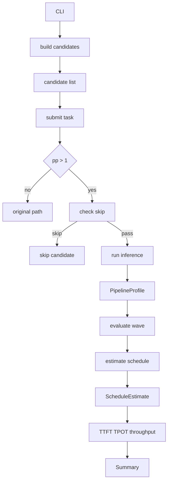
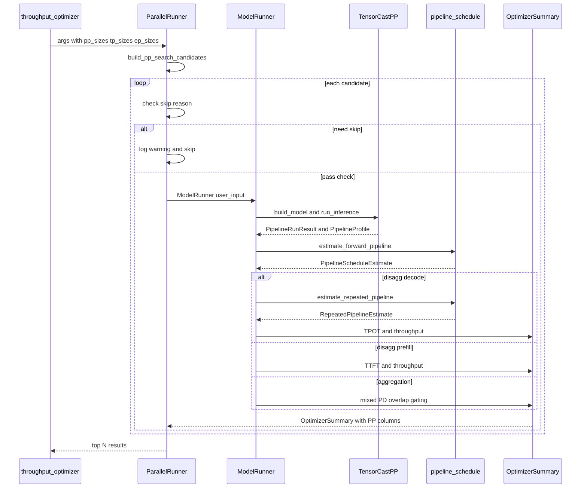
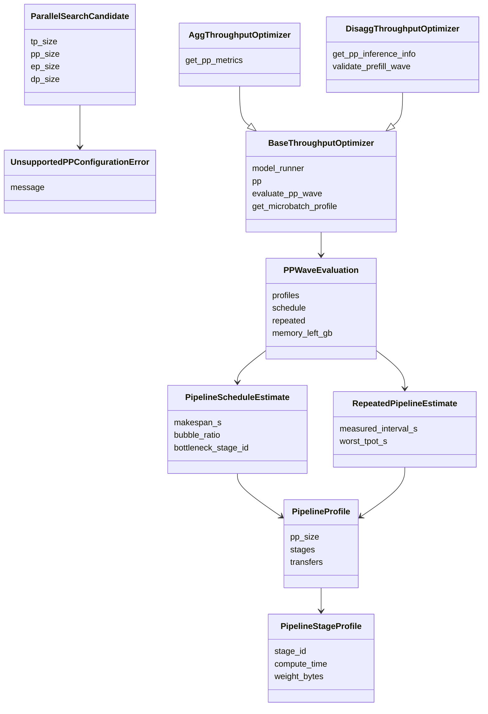

# RFC: Pipeline Parallel Throughput Optimizer Support

## Metadata

| Field | Value |
| :--- | :--- |
| **Status** | Implemented (PR #711, in review) |
| **Author** | hanxinlong |
| **Created** | 2026-08-03 |
| **Related** | TensorCast PP RFC: [rfc_pipeline_parallel_support_en.md](rfc_pipeline_parallel_support_en.md); PR #367 (TensorCast PP) + PR #711 (ServingCast PP implementation) |
| **Dependencies** | TensorCast PP simulation capability (PR #367 merged) |
| **Chinese version** | [rfc_pipeline_parallel_throughput_optimizer_zh.md](rfc_pipeline_parallel_throughput_optimizer_zh.md) |

---

## 1. Problem Statement

TensorCast-side Pipeline Parallel (PP) simulation capability was merged via PR #367, supporting stage-first trace, stage-local model construction, logical send/recv communication modeling, and per-stage memory estimation. However, the ServingCast throughput optimizer (`throughput_optimizer`) does not yet leverage this capability:

1. **Search space lacks PP dimension**: Existing `--tp-sizes`, `--ep-sizes`, `--moe-dp-sizes` only search TP/EP/MoE-DP. Users cannot specify `--pp-sizes` to let the optimizer evaluate different PP configurations.
2. **Inaccurate throughput for PP>1**: TensorCast PP returns `PipelineRunResult` with per-stage compute time, inter-stage transfer time, and pipeline breakdown. But ServingCast's `BaseThroughputOptimizer` still calculates TTFT/TPOT/throughput based on single-stage forward latency, unable to reflect pipeline bubble, inter-stage communication, and multi-microbatch scheduling impact.
3. **Memory estimation not stage-aware**: For PP>1, a single rank only holds partial layer weights and KV cache, but the optimizer estimates memory based on the full model, overestimating per-card peak.
4. **Result report lacks PP metrics**: The optimizer output table has no `pp_size`, `pp_bubble_ratio`, `pp_bottleneck_stage` fields. Users cannot judge PP configuration quality.

### 1.1 Goals

- Add `--pp-sizes`, `--pp-layer-partitions` CLI parameters to `throughput_optimizer`. Existing `--dcp-sizes` is preserved (DCP and PP are orthogonal).
- Use stage-local arithmetic in search space generation: `dp = num_devices // (tp * pp)`, `moe_tp = (num_devices // pp) // (ep * moe_dp)`.
- For PP>1 candidates, use forward blocking pipeline scheduler (`pipeline_schedule.py`) to compute makespan, bubble ratio, bottleneck stage, and per-stage communication buffers.
- Integrate PP>1 evaluation paths in both aggregation and disaggregation strategies to compute schedule-aware TTFT/TPOT/throughput.
- Expose PP scheduling metrics (`PP_RESULT_COLUMNS`) in the result table.
- Maintain backward compatibility when `pp_size=1`: existing column names and values stay unchanged; PP=1 rows get PP scheduling columns filled with defaults (`pp_size=1`, `pp_bubble_ratio=0`, `pp_makespan_ms` etc. = None).
- PP>1 supports chunked prefill: when the effective prompt exceeds `max_batched_tokens`, each chunk is fed as a separate microbatch into the pipeline schedule, mirroring vLLM's 1F1B cross-stage pipelining, instead of rejecting PP>1.
- Explicitly skip unsupported PP scenarios (VL/MTP multimodal models, variable-length input distribution) with logging. Profiling mode is now supported (TensorCast PP's StageRunner uses passed-in perf_models; EmpiricalPerformanceModel auto-fallbacks to AnalyticPerformanceModel).

### 1.2 Non-Goals

- No 1F1B, interleaved PP, or virtual pipeline stage scheduling; first version uses forward blocking (no-overlap) scheduling.
- No communication-compute overlap modeling.
- No stage-local profiling data contract; profiling + PP is supported (EmpiricalPerformanceModel auto-fallbacks to AnalyticPerformanceModel).
- No PP evaluation path for VL/MTP/multimodal models (TensorCast model_builder raises `UnsupportedPPConfigurationError`).
- No support for variable-length input distribution (`length_distribution`) with PP>1 (raises `UnsupportedPPConfigurationError`).
- No modification to TensorCast-side PP simulation logic (PR #367 is complete).

---

## 2. Design

### 2.1 Overall Architecture



#### 2.1.1 ServingCast PP Sequence Diagram



#### 2.1.2 ServingCast PP Class Diagram



#### 2.1.3 Flow-to-File Mapping

| Step | Function | File |
| :--- | :--- | :--- |
| 1 | CLI parameter parsing | `cli/inference/throughput_optimizer.py` |
| 2 | Candidate generation `build_pp_search_candidates` | `serving_cast/service/utils.py` |
| 3 | Skip check VL/MTP | `serving_cast/parallel_runner.py` |
| 4 | Model construction `build_pipeline_model` | `tensor_cast/core/model_builder.py` |
| 5 | Inference execution `PipelineRunner` | `tensor_cast/pipeline_parallel.py` |
| 6 | Profile construction `PipelineProfile` | `tensor_cast/pipeline_parallel.py` |
| 7 | Scheduler `estimate_forward_pipeline` | `serving_cast/service/pipeline_schedule.py` |
| 8 | PP wave evaluation `evaluate_pp_wave` | `serving_cast/service/base_throughput_optimizer.py` |
| 9 | Strategy evaluation Agg/Disagg | `agg_throughput_optimizer.py` / `disagg_throughput_optimizer.py` |
| 10 | Result reporting `PP_RESULT_COLUMNS` | `serving_cast/service/optimizer_summary.py` |

### 2.2 CLI Parameters

Two new parameters in `cli/inference/throughput_optimizer.py` (existing `--dcp-sizes` preserved):

| Parameter | Type | Default | Description |
| :--- | :--- | :--- | :--- |
| `--pp-sizes` | `nargs="*"`, `check_positive_integer` | `None` (resolved to PP=1) | PP size search list. When unspecified, PP is fixed to 1 (backward compatible). When specified without values, generates powers-of-two. When specified with values, searches only those values. |
| `--pp-layer-partitions` | `type=str` (JSON) | `None` | Explicit layer partitions as JSON list of lists. E.g. `'[[31,30],[16,15,15,15]]'`. Each inner list length must equal its `pp_size`, sum must equal `num_hidden_layers`. Only effective for PP>1. Uses balanced partitioning when unspecified. |

CLI contract:

| Parameter state | Behavior |
| :--- | :--- |
| No search-size parameters specified (including pp_sizes) | Backward compatible, defaults to TP search, `pp_size` fixed to 1. |
| `--pp-sizes` not specified | PP fixed to `[1]`, search space identical to current. |
| `--pp-sizes` with values | Uses explicit values, each must be positive integer not exceeding `num_devices`. |
| `--pp-sizes` without values | Generates powers-of-two candidates (`1, 2, 4, ..., num_devices`). |
| Invalid combinations | If no valid combination satisfies stage-local divisibility constraints, CLI exits with error. |

Usage examples:

Example 1: Basic PP search (using default layer partitions):

```bash
python -m cli.inference.throughput_optimizer \
  --input-length 2048 \
  --output-length 512 \
  --num-devices 32 \
  --tp-sizes 8 \
  --pp-sizes 2 4 \
  --ep-sizes 8 \
  --moe-dp-sizes 1 \
  deepseek-ai/DeepSeek-V3.1
```

Example 2: With explicit layer partitions:

```bash
python -m cli.inference.throughput_optimizer \
  --input-length 2048 \
  --output-length 512 \
  --num-devices 32 \
  --tp-sizes 8 \
  --pp-sizes 2 4 \
  --pp-layer-partitions '[[31,30],[16,15,15,15]]' \
  --ep-sizes 8 \
  --moe-dp-sizes 1 \
  deepseek-ai/DeepSeek-V3.1
```

`--pp-layer-partitions` rules:

- Uses JSON list of lists format, e.g. `'[[31,30],[16,15,15,15]]'`.
- Each inner list represents one partition, auto-matched to its `pp_size` by length (`[31,30]` length=2 matches PP=2, `[16,15,15,15]` length=4 matches PP=4).
- Partition sum must equal `num_hidden_layers` (DeepSeek-V3.1 has 61 layers, 31+30=61, 16+15+15+15=61).
- When unspecified, uses balanced partitioning (remainder layers placed on earlier stages, avoiding the last stage carrying both norm + lm_head).

### 2.3 Search Space Generation

#### 2.3.1 `ParallelSearchCandidate`

New frozen dataclass in `serving_cast/service/utils.py`:

```python
@dataclass(frozen=True)
class ParallelSearchCandidate:
    tp_size: int
    pp_size: int
    ep_size: int
    moe_dp_size: int
    moe_tp_size: int
    dp_size: int
    num_mtp_tokens: int
    layer_partition: Optional[tuple[int, ...]]
    dcp_size: int = 1
    schedule: str = "forward"
```

`dp_size` and `moe_tp_size` derived via stage-local arithmetic:

- `dp_size = num_devices // (tp_size * pp_size)`
- `moe_tp_size = (num_devices // pp_size) // (ep_size * moe_dp_size)`

The `dcp_size` field enables joint PP+DCP search: once in the PP-aware path, `build_pp_search_candidates` includes `dcp_sizes` in the cartesian product instead of silently dropping explicit `--dcp-sizes` candidates.

#### 2.3.2 `build_pp_search_candidates()`

Replaces `resolve_parallel_search_candidates()`. Enumerates cartesian product of `pp_sizes x tp_sizes x ep_sizes x moe_dp_sizes x dcp_sizes x mtp_sizes`, filtered by stage-local divisibility:

| Filter | Meaning |
| :--- | :--- |
| `num_devices % pp == 0` | PP divides device count |
| `(num_devices // pp) % tp == 0` | Stage-local TP divides |
| `(num_devices // pp) % ep == 0` | Stage-local EP divides |
| `(num_devices // pp) % (ep * moe_dp) == 0` | Stage-local MoE-DP divides |
| `pp <= num_hidden_layers` | PP does not exceed decoder layer count |
| `sum(layer_partition) == num_hidden_layers` | Explicit partition sums to total layers |

PP=1 compatibility: when `pp_sizes` is `None`, only PP=1 candidates are generated, TP/EP defaults match legacy `resolve_parallel_search_candidates`.

#### 2.3.3 `UnsupportedPPConfigurationError`

Dedicated candidate-level exception, defined in `tensor_cast/pipeline_parallel.py` and re-exported to ServingCast via the `import UnsupportedPPConfigurationError as UnsupportedPPConfigurationError` idiom in `serving_cast/service/utils.py`. Both the TensorCast model_builder and ServingCast optimizer raise this type; `ParallelRunner._submit_task` only catches this type to skip candidates, while other `ValueError`s propagate. Used for graceful skip of unsupported PP scenarios.

### 2.4 Forward Pipeline Scheduler

`serving_cast/service/pipeline_schedule.py` is the core new file (~980 lines), implementing a forward blocking (no-overlap) pipeline schedule estimator.

> **Caveat**: forward blocking (no-overlap) scheduling systematically overestimates bubble and underestimates PP>1 throughput — real 1F1B / gpipe scheduling reclaims most of the bubble. The v1 PP>1 throughput is a **conservative lower bound**; do not read it as "PP is always worse". The 1F1B / interleaved evolution (see §6) will improve this significantly.

#### 2.4.1 Scheduling Model

- Each stage owns one serialized execution resource (compute + transfer shared).
- Inter-stage boundary transfers (send/recv) occupy both source and target stages simultaneously (rendezvous blocking).
- Communication buffer = `max(incoming, outgoing)` (not sum), because blocking scheduling ensures a stage never holds incoming and outgoing payloads simultaneously.

#### 2.4.2 Core Functions

| Function | Purpose |
| :--- | :--- |
| `estimate_forward_pipeline()` | Single forward pipeline schedule, input is `PipelineProfile`, output is `PipelineScheduleEstimate`. |
| `estimate_repeated_pipeline()` | Two identical decode wave schedules, computes steady-state period and TPOT. |
| `split_batch_size()` | Splits batch into uniform microbatches + remainder. |
| `estimate_pipeline_stage_memory_across_profiles()` | Per-stage memory estimation, uses `communication_buffer = max(incoming, outgoing)`. |
| `estimate_mixed_pd_stage_memory_across_profiles()` | Mixed Prefill/Decode overlap memory peak estimation. |

#### 2.4.3 `PipelineScheduleEstimate`

```python
@dataclass(frozen=True)
class PipelineScheduleEstimate:
    makespan_s: float              # End-to-end wall-clock time
    first_completion_s: float      # First microbatch completion time
    warmup_s: float                # Warmup phase
    steady_s: float                # Steady-state phase
    cooldown_s: float              # Cooldown phase
    aggregate_bubble_s: float      # Aggregate stage idle capacity
    bubble_ratio: float            # bubble / (pp_size * makespan)
    bottleneck_stage_id: int       # Bottleneck stage
    stage_busy_s: tuple[float, ...]    # Per-stage busy time
    stage_idle_s: tuple[float, ...]    # Per-stage idle time
    microbatch_completion_s: tuple[float, ...]  # Per-microbatch completion time
    # ... plus per-stage intervals and communication buffer fields
```

### 2.5 PP Evaluation Infrastructure

#### 2.5.1 `BaseThroughputOptimizer` Changes

- `initialize()` changed from abstract to concrete, extracting common initialization logic.
- Added `_pp_profile_cache`: PP>1 microbatch `PipelineProfile` cache, keyed by `(is_decode, query_len, seq_len, microbatch_size)`.
- Added `_evaluate_pp_wave()`: Full profile -> schedule -> memory-gate pipeline, returns `_PPWaveEvaluation`. New `chunk_shapes: list[tuple[int, int]] | None` parameter: when the effective prompt exceeds `max_batched_tokens`, each chunk's `(query_len, seq_len)` is fed as a separate microbatch into the pipeline schedule, mirroring vLLM 1F1B cross-stage pipelining.
- Added `_validate_pp_prefill_wave()`: validates the PP prefill contract. When the current batch exceeds the token budget but smaller batches may still be valid, it returns `EARLY_STOP_PREFILL_OOM` so the binary search shrinks its upper bound instead of discarding the candidate; only candidate-level incompatibilities (variable-length input distribution, or prompt too large even for batch=1) raise `UnsupportedPPConfigurationError`.
- PP>1 decode concurrency fix: `model_concurrency = batch_size * dp` (removed erroneous `* pp`).
- PP>1 disables two-point linear TTFT/TPOT extrapolation (forces exponential search).

#### 2.5.2 Aggregation Strategy PP>1 Path

`AggThroughputOptimizer` PP>1 uses mixed P/D overlap memory gating:

- Skip decode path when `output_length == 1` (prefill already produces the only output token).
- Decode throughput uses `measured_interval_s` (steady-state period) instead of `worst_tpot_s`.
- Sets `pp_mixed_pd_overlap_approx = True` flag.

#### 2.5.3 Disaggregation Strategy PP>1 Path

`DisaggThroughputOptimizer` PP>1 evaluation:

| Mode | Latency formula | Throughput formula |
| :--- | :--- | :--- |
| Prefill | `TTFT = wave_makespan + serving_cost` | `token/s = total_input_tokens * dp / TTFT * 1000` |
| Decode | `TPOT = worst_tpot + serving_cost` | `token/s = batch_size * dp / (measured_interval_s + serving_cost)` |

- `concurrency = batch_size * dp` (no longer multiplied by PP).
- PP>1 supports chunked prefill: when `len(chunk_plan) > 1`, each chunk is fed as a separate microbatch into `_evaluate_pp_wave` (via the `chunk_shapes` parameter) instead of raising.
- Only candidate-level incompatibilities raise `UnsupportedPPConfigurationError`: variable-length input distribution (`length_distribution is not None`), and prompts exceeding `max_batched_tokens` even at batch=1. When the current batch exceeds the budget but a smaller batch is feasible, `EARLY_STOP_PREFILL_OOM` is returned so the binary search shrinks its upper bound.

### 2.6 Unsupported Scenario Skip

PP>1 candidates are checked in `ParallelRunner._submit_task`; matching conditions are skipped with warning:

| Scenario | Skip reason | Implementation |
| :--- | :--- | :--- |
| VL / multimodal model | TensorCast model_builder raises `UnsupportedPPConfigurationError`: stage-local graph does not support vision tower | `_build_pipeline_model` + `_check_pp_skip_reason` |
| MTP model | TensorCast model_builder raises `UnsupportedPPConfigurationError`: MTP head stage ownership undefined | `_build_pipeline_model` + `_check_pp_skip_reason` |
| Variable-length input distribution | `length_distribution is not None`; PP>1 does not support variable-length input | `_validate_pp_prefill_wave` |
| `pp > num_hidden_layers` | Filtered at candidate generation, never enters evaluation | `build_pp_search_candidates` |

Note: chunked prefill (effective prompt exceeding `max_batched_tokens`) **is supported** for PP>1 — each chunk is fed as a separate microbatch into the pipeline schedule, no longer skipped. Profiling mode is also **supported** for PP. TensorCast PP's `StageRunner` uses `ModelRunner`'s perf_models (including `EmpiricalPerformanceModel`); each stage-local trace is processed by the empirical model, with unmatched ops auto-falling back to `AnalyticPerformanceModel`.

### 2.7 Result Reporting

#### 2.7.1 PP Result Columns

`optimizer_summary.py` adds `PP_RESULT_COLUMNS`:

```python
PP_RESULT_COLUMNS = (
    "tp_size", "pp_size", "dp_size", "ep_size", "moe_dp_size",
    "pp_layer_partition",
    "pp_schedule", "pp_makespan_ms", "pp_warmup_ms", "pp_steady_ms",
    "pp_cooldown_ms", "pp_bubble_ratio", "pp_bottleneck_stage",
    "pp_mixed_pd_overlap_approx",
)
```

#### 2.7.2 Result Sorting

`rank_optimizer_result_rows()` uses throughput-anchored grouping + SLO/bubble/memory sorting:

- Primary: throughput descending.
- Within same throughput group: `pp_bubble_ratio` ascending (lower bubble is better).
- Then: `pp_size` ascending (lower PP means lower latency).

#### 2.7.3 Breakdown Display

`format_breakdowns()` extended: recognizes `*_pipeline_parallel` suffix breakdown dicts, appends `PP Compute / PP Comm / PP Bubble`:

```text
Mem 25.00 | Comm 25.00 | Cube 50.00 | Vec 0.00 | PP Compute 50.00 | PP Comm 16.67 | PP Bubble 33.33
```

### 2.8 Log Format

`_submit_task` log changed from `"Start processing TP size: %d"` to:

```text
Start processing TP=8, PP=4, EP=8, MOE-DP=1
```

Chrome trace filename includes `pp{pp_size}`:

```text
trace_tp8pp4dp1mtp0.json
```

### 2.9 Example Output

Simulated run output (Qwen/Qwen3-8B, 4 devices, TP=1/2 x PP=1/2, EP=1, TEST_DEVICE):

```text
Input Configuration:
  model_id: Qwen/Qwen3-8B
  input_length: 128
  output_length: 16
  num_devices: 4
  device: TEST_DEVICE

Overall Best Configuration:
  Top 1: TP=2 PP=1 DP=2, throughput=4523.1 token/s, TTFT=12.3ms, TPOT=8.5ms

Top 4 Aggregation Configurations:
+-----+-------------+--------+--------+---------+---------+----------------+--------+----------+--------+-----------+----------+----------+-----------+------+
| Top | Throughput  | TTFT   | TPOT   | concurre| parallel       | batch  | pp_size | pp_bubble| pp_bott| pp_makesp| pp_warmup| pp_steady | pp_ov|
|     | (token/s)   | (ms)   | (ms)   | ncy     |                | _size  |         | _ratio  | lneck  | _ms      | _ms      | _ms       | erla|
+-----+-------------+--------+--------+---------+---------+----------------+--------+----------+--------+-----------+----------+----------+-----------+------+
|  1  | 4523.1      | 12.3   | 8.5    |    4    | TP=2 PP=1 DP=2 |    2   |    1    | 0.00     | None   | None     | None     | None      | False|
|  2  | 3201.5      | 18.7   | 12.1   |    4    | TP=1 PP=1 DP=4 |    1   |    1    | 0.00     | None   | None     | None     | None      | False|
|  3  | 2890.3      | 25.4   | 15.2   |    2    | TP=2 PP=2 DP=1 |    2   |    2    | 0.12     | 0      | 22.1     | 4.5      | 15.2      | True |
|  4  | 1876.8      | 38.2   | 22.8   |    2    | TP=1 PP=2 DP=2 |    1   |    2    | 0.15     | 1      | 35.6     | 7.2      | 24.1      | True |
+-----+-------------+--------+--------+---------+---------+----------------+--------+----------+--------+-----------+----------+----------+-----------+------+

Stats breakdowns:
  analytic: Mem 30.12, Comm 15.23, Cube 40.56, Vec 14.09
  analytic_pipeline_parallel: PP Compute 85.33, PP Comm 12.67, PP Bubble 2.00
```

Key observations:

- PP=1 candidates (rows 1, 2) have `pp_bubble_ratio` = 0, `pp_makespan_ms` = None (no scheduler).
- PP=2 candidates (rows 3, 4) have `pp_bubble_ratio` of 12% and 15%, `pp_bottleneck_stage` identifies the bottleneck.
- `pp_mixed_pd_overlap_approx=True` indicates aggregation PP>1 uses mixed P/D overlap approximation.
- Row 3 (TP=2 PP=2) has lower TTFT than the other PP=2 row (Row 4, 38.2ms vs 25.4ms), which may be preferable when memory is tight but per-request latency still matters (note PP=2 TTFT is still higher than PP=1's Row 1 at 12.3ms).

---

## 3. Implementation

| Item | Status | Scope |
| :--- | :--- | :--- |
| CLI PP search parameters | Implemented | `--pp-sizes`, `--pp-layer-partitions` (existing `--dcp-sizes` preserved) |
| Candidate generation | Implemented | `ParallelSearchCandidate`, `build_pp_search_candidates`, `UnsupportedPPConfigurationError` |
| Forward pipeline scheduler | Implemented | `pipeline_schedule.py`, `PipelineScheduleEstimate` |
| PP evaluation infrastructure | Implemented | `_evaluate_pp_wave`, `_pp_profile_cache`, `_PPWaveEvaluation` |
| Aggregation PP>1 path | Implemented | Mixed P/D overlap memory gating |
| Disaggregation PP>1 path | Implemented | Prefill TTFT / Decode TPOT + steady-state throughput |
| Skip logic | Implemented | VL/MTP skip (profiling supported) |
| Result reporting | Implemented | `PP_RESULT_COLUMNS`, sorting, breakdown display |
| TensorCast Profile exposure | Implemented | `PipelineProfile` / `PipelineStageProfile` / `PipelineTransferProfile` |
| UserConfig extension | Implemented | `pp_layer_partition` field |
| Log format | Implemented | TP/PP/EP/MOE-DP format |
| Breakdown PP display | Implemented | `format_breakdowns` appends PP Compute/Comm/Bubble |

### 3.1 Files Changed

| File | Change | Description |
| :--- | :--- | :--- |
| `cli/inference/throughput_optimizer.py` | Modified | 2 new CLI parameters (`--pp-sizes`, `--pp-layer-partitions`), `--dcp-sizes` preserved |
| `serving_cast/parallel_runner.py` | Modified | Candidate traversal, skip logic, log format |
| `serving_cast/service/utils.py` | Modified | `ParallelSearchCandidate`, `build_pp_search_candidates`, `format_breakdowns` PP display |
| `serving_cast/service/pipeline_schedule.py` | **New** | Forward pipeline scheduler |
| `serving_cast/service/base_throughput_optimizer.py` | Modified | PP evaluation infrastructure |
| `serving_cast/service/agg_throughput_optimizer.py` | Modified | Aggregation PP>1 path |
| `serving_cast/service/disagg_throughput_optimizer.py` | Modified | Disaggregation PP>1 path |
| `serving_cast/service/optimizer_summary.py` | Modified | PP result columns, sorting |
| `serving_cast/service/pd_ratio_throughput_optimizer.py` | Modified | PP overlap flag passthrough |
| `tensor_cast/pipeline_parallel.py` | Modified | New `PipelineProfile` etc. dataclasses |
| `tensor_cast/core/user_config.py` | Modified | `pp_layer_partition` field |
| `tensor_cast/core/model_builder.py` | Modified | Pass `pp_layer_partition` |
| `tensor_cast/core/model_runner.py` | Modified | Propagate `pipeline_profile` |
| `tensor_cast/core/config_resolver.py` | Modified | PP config resolution |

---

## 4. Test Plan

### 4.1 Test Files

| Test file | Coverage |
| :--- | :--- |
| `tests/regression/cli/test_throughput_optimizer.py` | CLI parameter parsing, defaults, invalid values |
| `tests/regression/serving_cast/test_service/test_parallel_runnner.py` | Candidate generation, stage-local derivation, skip logic, chrome trace |
| `tests/regression/serving_cast/test_service/test_pipeline_schedule.py` | Scheduler timing, bubble computation, communication buffers |
| `tests/regression/serving_cast/test_service/test_agg_optimizer.py` | Aggregation PP>1 evaluation |
| `tests/regression/serving_cast/test_service/test_disagg_optimizer.py` | Disaggregation PP>1 evaluation |
| `tests/regression/serving_cast/test_service/test_optimizer_summary.py` | PP result columns, sorting |
| `tests/regression/tensor_cast/test_pipeline_parallel_model_builder.py` | `PipelineProfile` exposure |

### 4.2 Minimum Test Gate

```bash
python -m pytest tests/regression/cli/test_throughput_optimizer.py -q
python -m pytest tests/regression/serving_cast/test_service/test_parallel_runnner.py -q
python -m pytest tests/regression/serving_cast/test_service/test_pipeline_schedule.py -q
python -m pytest tests/regression/serving_cast/test_service/test_agg_optimizer.py -q
python -m pytest tests/regression/serving_cast/test_service/test_disagg_optimizer.py -q
python -m pytest tests/regression/serving_cast/test_service/test_optimizer_summary.py -q
python -m pytest tests/regression/tensor_cast/test_pipeline_parallel_model_builder.py -q
```

### 4.3 Test Coverage Requirements

| Area | Required coverage |
| :--- | :--- |
| CLI parameters | `--pp-sizes` explicit values, defaults, empty list, over-limit rejection, no-valid-combination error |
| Search space | stage-local `dp = num_devices // (tp * pp)`, `moe_tp = local_world_size // (ep * moe_dp)` |
| Candidate filtering | `pp` not dividing `num_devices`, `tp` not dividing `local_world_size` |
| Skip logic | MTP > 0, VL/multimodal model (for PP>1 the model_builder raises `UnsupportedPPConfigurationError` and the candidate is skipped; the profiling mode itself supports PP and is unrelated to this VL skip) |
| Scheduler | makespan, bubble ratio, bottleneck stage, communication buffer = max(incoming, outgoing) |
| Aggregation | PP>1 TTFT/TPOT, mixed P/D overlap memory gating |
| Disaggregation | PP>1 prefill TTFT = wave_makespan, decode TPOT = worst_tpot |
| Result reporting | `PP_RESULT_COLUMNS` fields present, sorting logic |
| Compatibility | `pp_size=1` search space, result format, throughput identical to original |

---

## 5. Compatibility and Constraints

| Scenario | Constraint |
| :--- | :--- |
| `pp_size=1` | No scheduler, no PP evaluation path, degrades to original single-stage behavior. Existing column names and throughput values stay compatible; the result table appends PP scheduling columns to PP=1 rows filled with defaults (`pp_size=1`, `pp_bubble_ratio=0`, `pp_makespan_ms` etc. = None). |
| `pp_size>1` + analytic | Uses stage-first trace + forward blocking scheduler for schedule-aware throughput. |
| `pp_size>1` + profiling | Supported. EmpiricalPerformanceModel processes stage-local trace, unmatched ops fallback to AnalyticPerformanceModel. |
| `pp_size>1` + chunked prefill | Supported. When the effective prompt exceeds `max_batched_tokens`, each chunk is fed as a separate microbatch into `_evaluate_pp_wave` (via the `chunk_shapes` parameter), mirroring vLLM 1F1B cross-stage pipelining. |
| `pp_size>1` + batch over budget | When the current batch exceeds the token budget but a smaller batch is feasible, returns `EARLY_STOP_PREFILL_OOM` so the binary search shrinks its upper bound instead of discarding the candidate. |
| `pp_size>1` + variable-length input | Not supported, raises `UnsupportedPPConfigurationError`. |
| VL/MTP + PP | Not supported, model_builder raises `UnsupportedPPConfigurationError`, skip candidate with warning. |
| MoE + PP | EP/MoE group derived from stage-local world_size, no stage-local MoE group combination. |
| Aggregation + PP>1 | Mixed P/D overlap memory gating, `pp_mixed_pd_overlap_approx = True`. |
| Disaggregation + PP>1 | Prefill TTFT=wave_makespan, Decode throughput=measured_interval_s. |
| PD ratio + PP | PD ratio sub-phases passthrough PP overlap flag. |
| Output fields | `parallel` label shows `TP=... \| PP=... \| DP=...`; PP breakdown and PP_RESULT_COLUMNS do not change existing column names. |

---

## 6. Future Evolution

| Item | Trigger | Scope | Exit criteria |
| :--- | :--- | :--- | :--- |
| 1F1B / interleaved PP | Need more precise bubble modeling | Replace forward blocking scheduler with 1F1B or interleaved | Align with real scheduling, provide error report |
| Comm-compute overlap | Need to model communication-compute overlap | Support overlap event-level simulation in scheduler | Communication buffer from max to sum, throughput improvement quantifiable |
| Profiling + PP | Supported | EmpiricalPerformanceModel auto-fallback to Analytic | Stage-local profiling data precision improvement |
| VL/MTP + PP | Target model needs PP search | Define vision tower, MTP head stage ownership | No longer skip, stage trace runs stably |
| Stage-local MoE group | MoE model needs simultaneous PP and EP search | Redefine stage-internal EP/MoE-TP/MoE-DP groups | Rank group, cache, dispatch/combine communication tested |
| Real send/recv kernel | Need real distributed communication | Evolve from logical send/recv to real Runtime op | Real communication kernel visible in trace |
