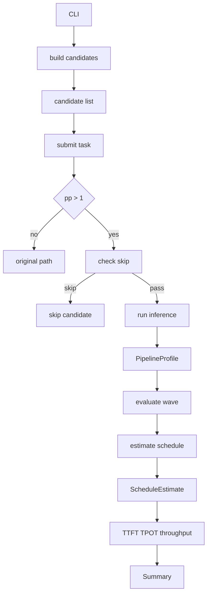
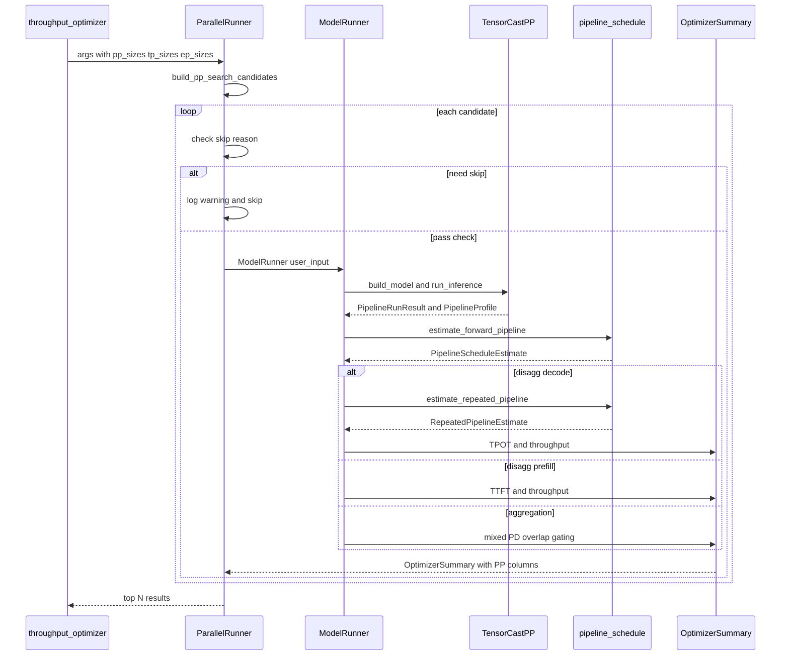
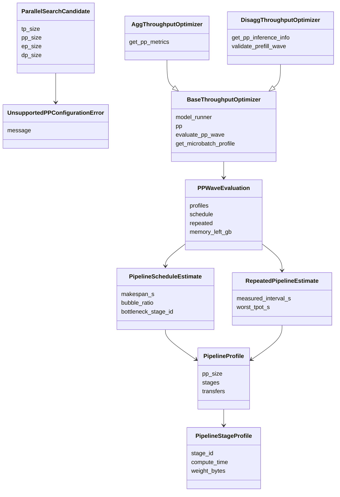

# RFC: Pipeline Parallel 吞吐量寻优支持

## 元数据

| 项目 | 内容 |
| :--- | :--- |
| **状态** | 已实现（PR #711 代码实现，检视中） |
| **作者** | hanxinlong |
| **创建日期** | 2026-08-03 |
| **相关链接** | TensorCast PP RFC: [rfc_pipeline_parallel_support_zh.md](rfc_pipeline_parallel_support_zh.md)；PR #367 (TensorCast PP) + PR #711 (ServingCast PP 代码实现) |
| **依赖** | TensorCast PP 仿真能力（PR #367 已合入） |

---

## 1. 问题陈述

TensorCast 侧的 Pipeline Parallel（PP）仿真能力已通过 PR #367 合入，支持 stage-first trace、stage-local 模型构造、逻辑 send/recv 通信建模和 per-stage 显存估算。但 ServingCast 吞吐量优化器（`throughput_optimizer`）尚未利用该能力：

1. **搜索空间缺失 PP 维度**：现有 `--tp-sizes`、`--ep-sizes`、`--moe-dp-sizes` 只搜索 TP/EP/MoE-DP，不搜索 PP。用户无法通过 CLI 指定 `--pp-sizes` 让优化器自动评估不同 PP 配置的吞吐量。
2. **PP>1 时吞吐量计算不准确**：TensorCast PP 返回的 `PipelineRunResult` 包含 per-stage compute time、stage 间 transfer time 和 pipeline breakdown，但 ServingCast 的 `BaseThroughputOptimizer` 仍按单 stage 前向延迟计算 TTFT/TPOT 和吞吐量，无法体现 pipeline bubble、stage 间通信和多 microbatch 调度对端到端性能的影响。
3. **显存估算未做 stage-aware**：PP>1 时单 rank 只持有部分 layer 的权重和 KV cache，但优化器仍按完整模型估算显存，高估单卡峰值。
4. **结果报告缺少 PP 指标**：优化器输出表中没有 `pp_size`、`pp_bubble_ratio`、`pp_bottleneck_stage` 等字段，用户无法判断 PP 配置的优劣。

### 1.1 目标

- 在 `throughput_optimizer` CLI 中新增 `--pp-sizes`、`--pp-layer-partitions` 参数。保留原有 `--dcp-sizes` 参数（DCP 与 PP 正交，互不影响）。
- 在搜索空间生成中使用 stage-local 算术：`dp = num_devices // (tp * pp)`，`moe_tp = (num_devices // pp) // (ep * moe_dp)`。
- 对 PP>1 候选，使用前向阻塞式流水线调度器（`pipeline_schedule.py`）计算 makespan、bubble ratio、bottleneck stage 和 per-stage 通信缓冲区。
- 在聚合策略和分离策略中分别接入 PP>1 评估路径，计算 schedule-aware 的 TTFT/TPOT/吞吐量。
- 在结果表中暴露 PP 调度指标（`PP_RESULT_COLUMNS`）。
- 保持 `pp_size=1` 时既有列的列名与数值完全兼容；PP=1 行追加的 PP 调度列以默认值填充（`pp_size=1`、`pp_bubble_ratio=0`、`pp_makespan_ms` 等为 None），不改变既有列。
- PP>1 支持 chunked prefill：当 effective prompt 超过 `max_batched_tokens` 时，每个 chunk 作为独立 microbatch 送入流水线调度，模拟 vLLM 1F1B 跨 stage 流水，而非直接拒绝 PP>1。
- 对暂不支持的 PP 场景（VL/MTP 多模态模型、变长输入分布）显式 skip 并记录日志。profiling 模式已支持 PP（TensorCast PP 的 StageRunner 使用传入的 perf_models，EmpiricalPerformanceModel 会自动 fallback 到 AnalyticPerformanceModel）。

### 1.2 非目标

- 不实现 1F1B、interleaved PP 或 virtual pipeline stage 调度；首版使用前向阻塞式（no-overlap）调度。
- 不实现通信计算 overlap 建模。
- 不为 profiling 性能模型提供 stage-local 数据契约；profiling + PP 已支持（EmpiricalPerformanceModel 自动 fallback 到 AnalyticPerformanceModel）。
- 不为 VL/MTP/多模态模型提供 PP 评估路径（TensorCast model_builder 明确抛 `UnsupportedPPConfigurationError`）。
- 不支持变长输入分布（`length_distribution`）与 PP>1 共存（抛 `UnsupportedPPConfigurationError`）。
- 不修改 TensorCast 侧的 PP 仿真逻辑（PR #367 已完成）。

---

## 2. 方案设计

### 2.1 总体架构



#### 2.1.1 ServingCast PP 时序图



#### 2.1.2 ServingCast PP 类图



#### 2.1.3 流程与文件对应表

| 步骤 | 功能 | 文件 |
| :--- | :--- | :--- |
| 1 | CLI 参数解析 | `cli/inference/throughput_optimizer.py` |
| 2 | 候选生成 `build_pp_search_candidates` | `serving_cast/service/utils.py` |
| 3 | skip 检查 VL/MTP | `serving_cast/parallel_runner.py` |
| 4 | 模型构建 `build_pipeline_model` | `tensor_cast/core/model_builder.py` |
| 5 | 推理执行 `PipelineRunner` | `tensor_cast/pipeline_parallel.py` |
| 6 | Profile 构建 `PipelineProfile` | `tensor_cast/pipeline_parallel.py` |
| 7 | 调度器 `estimate_forward_pipeline` | `serving_cast/service/pipeline_schedule.py` |
| 8 | PP wave 评估 `evaluate_pp_wave` | `serving_cast/service/base_throughput_optimizer.py` |
| 9 | 策略评估 Agg/Disagg | `agg_throughput_optimizer.py` / `disagg_throughput_optimizer.py` |
| 10 | 结果报告 `PP_RESULT_COLUMNS` | `serving_cast/service/optimizer_summary.py` |

### 2.2 CLI 参数

在 `cli/inference/throughput_optimizer.py` 新增两个参数（保留原有 `--dcp-sizes`）：

| 参数 | 类型 | 默认值 | 说明 |
| :--- | :--- | :--- | :--- |
| `--pp-sizes` | `nargs="*"`, `check_positive_integer` | `None`（解析为 PP=1） | PP size 搜索列表。不指定时 PP 固定为 1（向后兼容）；指定但不带值时生成 powers-of-two（`1, 2, 4, ..., num_devices`）；指定带值时只搜指定值。 |
| `--pp-layer-partitions` | `type=str`（JSON） | `None` | 显式层划分，JSON list of lists 格式。如 `'[[31,30],[16,15,15,15]]'`。每个内层 list 长度必须等于对应的 `pp_size`，和必须等于 `num_hidden_layers`。仅 PP>1 时生效。不指定时使用均匀切分。 |

CLI 契约：

| 参数状态 | 行为 |
| :--- | :--- |
| 未指定任何 search-size 参数（含 pp_sizes） | 向后兼容，默认搜索 TP，`pp_size` 固定为 1。 |
| 未指定 `--pp-sizes` | PP 固定为 `[1]`，搜索空间与当前完全一致。 |
| 指定 `--pp-sizes` 且带值 | 使用显式值，每个值需为正整数且不超过 `num_devices`。 |
| 指定 `--pp-sizes` 但不带值 | 生成 powers-of-two 候选（`1, 2, 4, ..., num_devices`）。 |
| 搜索组合非法 | 若不存在满足 stage-local 整除约束的候选组合，CLI 解析阶段报错退出。 |

使用示例：

示例 1：基本 PP 搜索（不指定 layer-partitions，使用默认均匀切分）：

```bash
python -m cli.inference.throughput_optimizer \
  --input-length 2048 \
  --output-length 512 \
  --num-devices 32 \
  --tp-sizes 8 \
  --pp-sizes 2 4 \
  --ep-sizes 8 \
  --moe-dp-sizes 1 \
  deepseek-ai/DeepSeek-V3.1
```

示例 2：指定显式层划分：

```bash
python -m cli.inference.throughput_optimizer \
  --input-length 2048 \
  --output-length 512 \
  --num-devices 32 \
  --tp-sizes 8 \
  --pp-sizes 2 4 \
  --pp-layer-partitions '[[31,30],[16,15,15,15]]' \
  --ep-sizes 8 \
  --moe-dp-sizes 1 \
  deepseek-ai/DeepSeek-V3.1
```

`--pp-layer-partitions` 的传参规则：

- 使用 JSON list of lists 格式，如 `'[[31,30],[16,15,15,15]]'`。
- 每个内层 list 表示一个 partition，自动按长度匹配对应的 `pp_size`（`[31,30]` 长度=2 匹配 PP=2，`[16,15,15,15]` 长度=4 匹配 PP=4）。
- partition 的和必须等于模型的 `num_hidden_layers`（DeepSeek-V3.1 有 61 层，31+30=61，16+15+15+15=61）。
- 不指定时使用均匀切分（余数放在前面的 stage，避免最后 stage 同时背 norm + lm_head）。

### 2.3 搜索空间生成

#### 2.3.1 `ParallelSearchCandidate`

`serving_cast/service/utils.py` 新增 frozen dataclass，封装一个完整的并行候选：

```python
@dataclass(frozen=True)
class ParallelSearchCandidate:
    tp_size: int
    pp_size: int
    ep_size: int
    moe_dp_size: int
    moe_tp_size: int
    dp_size: int
    num_mtp_tokens: int
    layer_partition: Optional[tuple[int, ...]]
    dcp_size: int = 1
    schedule: str = "forward"
```

`dp_size` 和 `moe_tp_size` 按 stage-local 算术推导：

- `dp_size = num_devices // (tp_size * pp_size)`
- `moe_tp_size = (num_devices // pp_size) // (ep_size * moe_dp_size)`

`dcp_size` 字段使 PP+DCP 联合搜索成为可能：进入 PP-aware 路径后，`build_pp_search_candidates` 将 `dcp_sizes` 纳入笛卡尔积，不再静默丢弃显式 `--dcp-sizes` 候选。

#### 2.3.2 `build_pp_search_candidates()`

替代原有 `resolve_parallel_search_candidates()` 的候选生成逻辑。枚举 `pp_sizes x tp_sizes x ep_sizes x moe_dp_sizes x dcp_sizes x mtp_sizes` 的笛卡尔积，按 stage-local 整除约束过滤：

| 过滤条件 | 含义 |
| :--- | :--- |
| `num_devices % pp == 0` | PP 整除设备数 |
| `(num_devices // pp) % tp == 0` | stage-local TP 整除 |
| `(num_devices // pp) % ep == 0` | stage-local EP 整除 |
| `(num_devices // pp) % (ep * moe_dp) == 0` | stage-local MoE-DP 整除 |
| `pp <= num_hidden_layers` | PP 不超过 decoder layer 数 |
| `sum(layer_partition) == num_hidden_layers` | 显式层划分总和等于总层数 |

PP=1 兼容：当 `pp_sizes` 为 `None` 时，只生成 PP=1 候选，TP/EP 默认值与原有 `resolve_parallel_search_candidates` 完全一致。

#### 2.3.3 `UnsupportedPPConfigurationError`

专用候选级异常，定义在 `tensor_cast/pipeline_parallel.py`，`serving_cast/service/utils.py` 通过 `import UnsupportedPPConfigurationError as UnsupportedPPConfigurationError` 惯用法 re-export 供 ServingCast 使用。TensorCast model_builder 和 ServingCast optimizer 均抛此类型；`ParallelRunner._submit_task` 只捕获此类型跳过候选，其他 `ValueError` 继续上抛。用于在不支持的 PP 场景下优雅跳过而非崩溃。

### 2.4 前向流水线调度器

`serving_cast/service/pipeline_schedule.py` 是本特性的核心新文件（约 980 行），实现前向阻塞式（no-overlap）流水线调度估计器。

> **Caveat**：前向阻塞式（no-overlap）调度会系统性高估 bubble、低估 PP>1 吞吐——真实 1F1B / gpipe 调度能回收大部分 bubble。v1 给出的 PP>1 吞吐是**保守下界**，不应据此断定"PP 一定更差"；后续 1F1B / interleaved 演进（见 §6）会显著改善。

#### 2.4.1 调度模型

- 每个 stage 拥有一个串行执行资源（compute + transfer 共享）。
- stage 间的边界传输（send/recv）同时占用源 stage 和目标 stage（rendezvous blocking）。
- 通信缓冲区 = `max(incoming, outgoing)`（而非求和），因为阻塞式调度下 stage 不会同时持有 incoming 和 outgoing payload。

#### 2.4.2 核心函数

| 函数 | 用途 |
| :--- | :--- |
| `estimate_forward_pipeline()` | 单次前向流水线调度，输入为 `PipelineProfile`（来自 TensorCast PP），输出为 `PipelineScheduleEstimate`。 |
| `estimate_repeated_pipeline()` | 两波相同 decode wave 调度，计算稳态周期和 TPOT。 |
| `split_batch_size()` | 将 batch 拆分为均匀微批次 + 余数。 |
| `estimate_pipeline_stage_memory_across_profiles()` | 每阶段内存估计，使用 `communication_buffer = max(incoming, outgoing)`。 |
| `estimate_mixed_pd_stage_memory_across_profiles()` | 混合 Prefill/Decode 重叠内存峰值估计。 |

#### 2.4.3 `PipelineScheduleEstimate`

```python
@dataclass(frozen=True)
class PipelineScheduleEstimate:
    makespan_s: float              # 端到端 wall-clock 时间
    first_completion_s: float      # 首个 microbatch 完成时间
    warmup_s: float                # warmup 阶段
    steady_s: float                # steady-state 阶段
    cooldown_s: float              # cooldown 阶段
    aggregate_bubble_s: float      # 聚合 stage 空闲容量
    bubble_ratio: float            # bubble / (pp_size * makespan)
    bottleneck_stage_id: int       # 瓶颈 stage
    stage_busy_s: tuple[float, ...]    # per-stage 忙碌时间
    stage_idle_s: tuple[float, ...]    # per-stage 空闲时间
    microbatch_completion_s: tuple[float, ...]  # per-microbatch 完成时间
    # ... 以及 per-stage 区间和通信缓冲区字段
```

### 2.5 PP 评估基础设施

#### 2.5.1 `BaseThroughputOptimizer` 改动

- `initialize()` 从 abstract 改为 concrete，提取公共初始化逻辑。
- 新增 `_pp_profile_cache`：PP>1 microbatch `PipelineProfile` 缓存，按 `(is_decode, query_len, seq_len, microbatch_size)` 键缓存，避免重复 profiling。
- 新增 `_evaluate_pp_wave()`：完整的 profile → schedule → memory-gate 管线，返回 `_PPWaveEvaluation`。新增 `chunk_shapes: list[tuple[int, int]] | None` 参数：当 effective prompt 超过 `max_batched_tokens` 时，每个 chunk 的 `(query_len, seq_len)` 作为独立 microbatch 送入流水线调度，模拟 vLLM 1F1B 跨 stage 流水。
- 新增 `_validate_pp_prefill_wave()`：校验 PP prefill 契约。当当前 batch 超出 token budget 但更小 batch 仍可能合法时，返回 `EARLY_STOP_PREFILL_OOM` 让二分搜索收缩上界，而非丢弃整个候选；仅候选级不兼容（变长输入分布、即使 batch=1 也放不下）才抛 `UnsupportedPPConfigurationError`。
- PP>1 修复 decode 并发计算：`model_concurrency = batch_size * dp`（去掉错误的 `* pp`）。
- PP>1 禁用两点线性 TTFT/TPOT 外推（改为强制指数搜索）。

#### 2.5.2 聚合策略 PP>1 路径

`AggThroughputOptimizer` 中 PP>1 的聚合使用混合 P/D overlap 内存门控：

- `output_length == 1` 时跳过 decode 路径（prefill 已产生唯一输出 token）。
- decode 吞吐量使用 `measured_interval_s`（稳态周期）而非 `worst_tpot_s`。
- 设置 `pp_mixed_pd_overlap_approx = True` 标记。

#### 2.5.3 分离策略 PP>1 路径

`DisaggThroughputOptimizer` 中 PP>1 的评估：

| 模式 | 延迟公式 | 吞吐量公式 |
| :--- | :--- | :--- |
| Prefill | `TTFT = wave_makespan + serving_cost` | `token/s = total_input_tokens * dp / TTFT * 1000` |
| Decode | `TPOT = worst_tpot + serving_cost` | `token/s = batch_size * dp / (measured_interval_s + serving_cost)` |

- `concurrency = batch_size * dp`（不再乘 PP）。
- PP>1 支持 chunked prefill：`len(chunk_plan) > 1` 时每个 chunk 作为独立 microbatch 进入 `_evaluate_pp_wave`（经 `chunk_shapes` 参数），不再抛异常。
- 仅候选级不兼容才抛 `UnsupportedPPConfigurationError`：变长输入分布（`length_distribution is not None`）、以及即使 batch=1 也超过 `max_batched_tokens` 的 prompt。当前 batch 超 budget 但更小 batch 可行时返回 `EARLY_STOP_PREFILL_OOM` 让二分搜索收缩上界。

### 2.6 不支持场景 Skip

PP>1 时在 `ParallelRunner._submit_task` 中检查以下条件，命中则跳过候选并记录 warning：

| 场景 | Skip 原因 | 实现位置 |
| :--- | :--- | :--- |
| VL / 多模态模型 | TensorCast model_builder 抛 `UnsupportedPPConfigurationError`：stage-local graph 不支持视觉塔 | `_build_pipeline_model` + `_check_pp_skip_reason` |
| MTP 模型 | TensorCast model_builder 抛 `UnsupportedPPConfigurationError`：MTP head 的 stage 所属关系未定义 | `_build_pipeline_model` + `_check_pp_skip_reason` |
| 变长输入分布 | `length_distribution is not None`，PP>1 不支持变长输入 | `_validate_pp_prefill_wave` |
| `pp > num_hidden_layers` | 候选生成阶段过滤，不会进入评估 | `build_pp_search_candidates` |

注意：chunked prefill（effective prompt 超过 `max_batched_tokens`）**已支持** PP>1——每个 chunk 作为独立 microbatch 进入流水线调度，不再 skip。profiling 模式也**已支持** PP。TensorCast PP 的 `StageRunner` 使用 `ModelRunner` 传入的 perf_models（包括 `EmpiricalPerformanceModel`），每个 stage-local trace 会被 empirical 模型处理，未匹配的算子自动 fallback 到 `AnalyticPerformanceModel`。

### 2.7 结果报告

#### 2.7.1 PP 结果列

`optimizer_summary.py` 新增 `PP_RESULT_COLUMNS`：

```python
PP_RESULT_COLUMNS = (
    "tp_size", "pp_size", "dp_size", "ep_size", "moe_dp_size",
    "pp_layer_partition",
    "pp_schedule", "pp_makespan_ms", "pp_warmup_ms", "pp_steady_ms",
    "pp_cooldown_ms", "pp_bubble_ratio", "pp_bottleneck_stage",
    "pp_mixed_pd_overlap_approx",
)
```

#### 2.7.2 结果排序

`rank_optimizer_result_rows()` 使用 throughput 锚定分组 + SLO/bubble/memory 排序：

- 优先按 throughput 降序。
- 同 throughput 组内按 `pp_bubble_ratio` 升序（bubble 越小越好）。
- 再按 `pp_size` 升序（PP 越小延迟越低）。

#### 2.7.3 Breakdown 展示

`format_breakdowns()` 扩展：识别 `*_pipeline_parallel` 后缀的 breakdown dict，追加展示 `PP Compute / PP Comm / PP Bubble`：

```text
Mem 25.00 | Comm 25.00 | Cube 50.00 | Vec 0.00 | PP Compute 50.00 | PP Comm 16.67 | PP Bubble 33.33
```

### 2.8 日志格式

`_submit_task` 日志从 `"Start processing TP size: %d"` 改为：

```text
Start processing TP=8, PP=4, EP=8, MOE-DP=1
```

Chrome trace 文件名加入 `pp{pp_size}`：

```text
trace_tp8pp4dp1mtp0.json
```

### 2.9 示例输出

以下是一次模拟运行的输出示例（Qwen/Qwen3-8B，4 设备，TP=1/2 x PP=1/2，EP=1，TEST_DEVICE）：

```text
Input Configuration:
  model_id: Qwen/Qwen3-8B
  input_length: 128
  output_length: 16
  num_devices: 4
  device: TEST_DEVICE

Overall Best Configuration:
  Top 1: TP=2 PP=1 DP=2, throughput=4523.1 token/s, TTFT=12.3ms, TPOT=8.5ms

Top 4 Aggregation Configurations:
+-----+-------------+--------+--------+---------+---------+----------------+--------+----------+--------+-----------+----------+----------+-----------+------+
| Top | Throughput  | TTFT   | TPOT   | concurre| parallel       | batch  | pp_size | pp_bubble| pp_bott| pp_makesp| pp_warmup| pp_steady | pp_ov|
|     | (token/s)   | (ms)   | (ms)   | ncy     |                | _size  |         | _ratio  | lneck  | _ms      | _ms      | _ms       | erla|
+-----+-------------+--------+--------+---------+---------+----------------+--------+----------+--------+-----------+----------+----------+-----------+------+
|  1  | 4523.1      | 12.3   | 8.5    |    4    | TP=2 PP=1 DP=2 |    2   |    1    | 0.00     | None   | None     | None     | None      | False|
|  2  | 3201.5      | 18.7   | 12.1   |    4    | TP=1 PP=1 DP=4 |    1   |    1    | 0.00     | None   | None     | None     | None      | False|
|  3  | 2890.3      | 25.4   | 15.2   |    2    | TP=2 PP=2 DP=1 |    2   |    2    | 0.12     | 0      | 22.1     | 4.5      | 15.2      | True |
|  4  | 1876.8      | 38.2   | 22.8   |    2    | TP=1 PP=2 DP=2 |    1   |    2    | 0.15     | 1      | 35.6     | 7.2      | 24.1      | True |
+-----+-------------+--------+--------+---------+---------+----------------+--------+----------+--------+-----------+----------+----------+-----------+------+

Stats breakdowns:
  analytic: Mem 30.12, Comm 15.23, Cube 40.56, Vec 14.09
  analytic_pipeline_parallel: PP Compute 85.33, PP Comm 12.67, PP Bubble 2.00
```

从结果表可以看出：

- PP=1 的候选（行 1、2）`pp_bubble_ratio` 为 0，`pp_makespan_ms` 等字段为 None（不走调度器）。
- PP=2 的候选（行 3、4）`pp_bubble_ratio` 分别为 12% 和 15%，`pp_bottleneck_stage` 指出瓶颈在 stage 0 或 1。
- `pp_mixed_pd_overlap_approx=True` 表示聚合策略 PP>1 使用了混合 P/D overlap 近似。
- 行 3 的 TP=2 PP=2 相比同为 PP=2 的行 4（TTFT=38.2ms）TTFT 更低（25.4ms），在显存紧张但仍需较低单请求延迟的场景下可能是更优选择（注意 PP=2 的 TTFT 仍高于 PP=1 的行 1，12.3ms）。

---

## 3. 实施内容

| 条目 | 状态 | 实现范围 |
| :--- | :--- | :--- |
| CLI PP 搜索参数 | 已实现 | `--pp-sizes`、`--pp-layer-partitions`（保留 `--dcp-sizes`） |
| 候选生成 | 已实现 | `ParallelSearchCandidate`、`build_pp_search_candidates`、`UnsupportedPPConfigurationError` |
| 前向流水线调度器 | 已实现 | `pipeline_schedule.py`，`PipelineScheduleEstimate` |
| PP 评估基础设施 | 已实现 | `_evaluate_pp_wave`、`_pp_profile_cache`、`_PPWaveEvaluation` |
| 聚合策略 PP>1 路径 | 已实现 | 混合 P/D overlap 内存门控 |
| 分离策略 PP>1 路径 | 已实现 | Prefill TTFT / Decode TPOT + 稳态吞吐量 |
| Skip 逻辑 | 已实现 | VL/MTP 场景显式 skip（profiling 已支持） |
| 结果报告 | 已实现 | `PP_RESULT_COLUMNS`、排序逻辑、breakdown 展示 |
| TensorCast Profile 暴露 | 已实现 | `PipelineProfile` / `PipelineStageProfile` / `PipelineTransferProfile` |
| UserConfig 扩展 | 已实现 | `pp_layer_partition` 字段 |
| 日志格式 | 已实现 | TP/PP/EP/MOE-DP 格式 |
| Breakdown PP 展示 | 已实现 | `format_breakdowns` 追加 PP Compute/Comm/Bubble |

### 3.1 涉及文件

| 文件 | 变更类型 | 说明 |
| :--- | :--- | :--- |
| `cli/inference/throughput_optimizer.py` | 修改 | 新增 2 个 CLI 参数（`--pp-sizes`、`--pp-layer-partitions`），保留 `--dcp-sizes` |
| `serving_cast/parallel_runner.py` | 修改 | 候选遍历、skip 逻辑、日志格式 |
| `serving_cast/service/utils.py` | 修改 | `ParallelSearchCandidate`、`build_pp_search_candidates`、`format_breakdowns` PP 展示 |
| `serving_cast/service/pipeline_schedule.py` | **新增** | 前向流水线调度器 |
| `serving_cast/service/base_throughput_optimizer.py` | 修改 | PP 评估基础设施 |
| `serving_cast/service/agg_throughput_optimizer.py` | 修改 | 聚合策略 PP>1 路径 |
| `serving_cast/service/disagg_throughput_optimizer.py` | 修改 | 分离策略 PP>1 路径 |
| `serving_cast/service/optimizer_summary.py` | 修改 | PP 结果列、排序逻辑 |
| `serving_cast/service/pd_ratio_throughput_optimizer.py` | 修改 | 透传 PP overlap 标记 |
| `tensor_cast/pipeline_parallel.py` | 修改 | 新增 `PipelineProfile` 等 dataclass |
| `tensor_cast/core/user_config.py` | 修改 | 新增 `pp_layer_partition` 字段 |
| `tensor_cast/core/model_builder.py` | 修改 | 传递 `pp_layer_partition` |
| `tensor_cast/core/model_runner.py` | 修改 | 传播 `pipeline_profile` |
| `tensor_cast/core/config_resolver.py` | 修改 | PP 配置解析 |

---

## 4. 测试计划

### 4.1 测试文件

| 测试文件 | 覆盖领域 |
| :--- | :--- |
| `tests/regression/cli/test_throughput_optimizer.py` | CLI 参数解析、默认值、非法值 |
| `tests/regression/serving_cast/test_service/test_parallel_runnner.py` | 候选生成、stage-local 推导、skip 逻辑、chrome trace |
| `tests/regression/serving_cast/test_service/test_pipeline_schedule.py` | 调度器时序、bubble 计算、通信缓冲区 |
| `tests/regression/serving_cast/test_service/test_agg_optimizer.py` | 聚合策略 PP>1 评估 |
| `tests/regression/serving_cast/test_service/test_disagg_optimizer.py` | 分离策略 PP>1 评估 |
| `tests/regression/serving_cast/test_service/test_optimizer_summary.py` | PP 结果列、排序 |
| `tests/regression/tensor_cast/test_pipeline_parallel_model_builder.py` | `PipelineProfile` 暴露 |

### 4.2 最小测试门禁

```bash
python -m pytest tests/regression/cli/test_throughput_optimizer.py -q
python -m pytest tests/regression/serving_cast/test_service/test_parallel_runnner.py -q
python -m pytest tests/regression/serving_cast/test_service/test_pipeline_schedule.py -q
python -m pytest tests/regression/serving_cast/test_service/test_agg_optimizer.py -q
python -m pytest tests/regression/serving_cast/test_service/test_disagg_optimizer.py -q
python -m pytest tests/regression/serving_cast/test_service/test_optimizer_summary.py -q
python -m pytest tests/regression/tensor_cast/test_pipeline_parallel_model_builder.py -q
```

### 4.3 测试覆盖要求

| 领域 | 必要覆盖 |
| :--- | :--- |
| CLI 参数 | `--pp-sizes` 显式值、默认值、空列表、超限拒绝、无合法组合报错 |
| 搜索空间 | stage-local `dp = num_devices // (tp * pp)`、`moe_tp = local_world_size // (ep * moe_dp)` |
| 候选过滤 | `pp` 不整除 `num_devices`、`tp` 不整除 `local_world_size` |
| Skip 逻辑 | MTP > 0、VL/多模态模型（PP>1 时由 model_builder 抛 `UnsupportedPPConfigurationError` 跳过；profiling 模式本身支持 PP，与此处的 VL skip 无关） |
| 调度器 | makespan、bubble ratio、bottleneck stage、通信缓冲区 = max(incoming, outgoing) |
| 聚合策略 | PP>1 TTFT/TPOT、混合 P/D overlap 内存门控 |
| 分离策略 | PP>1 prefill TTFT = wave_makespan、decode TPOT = worst_tpot |
| 结果报告 | `PP_RESULT_COLUMNS` 字段存在、排序逻辑 |
| 兼容性 | `pp_size=1` 时搜索空间、结果格式、吞吐量与原有完全一致 |

---

## 5. 兼容性与行为约束

| 场景 | 约束 |
| :--- | :--- |
| `pp_size=1` | 不构造调度器，不插入 PP 评估路径，退化为原有单 stage 行为。既有列的列名与吞吐量数值完全兼容；结果表会为 PP=1 行追加 PP 调度列并以默认值填充（`pp_size=1`、`pp_bubble_ratio=0`、`pp_makespan_ms` 等为 None）。 |
| `pp_size>1` + analytic | 使用 stage-first trace + 前向阻塞式调度器计算 schedule-aware 吞吐量。 |
| `pp_size>1` + profiling | 已支持。EmpiricalPerformanceModel 处理 stage-local trace，未匹配算子 fallback 到 AnalyticPerformanceModel。 |
| `pp_size>1` + chunked prefill | 已支持。effective prompt 超过 `max_batched_tokens` 时，每个 chunk 作为独立 microbatch 送入 `_evaluate_pp_wave`（经 `chunk_shapes` 参数），模拟 vLLM 1F1B 跨 stage 流水。 |
| `pp_size>1` + batch 超 budget | 当前 batch 超出 token budget 但更小 batch 可行时返回 `EARLY_STOP_PREFILL_OOM`，二分搜索收缩上界，不丢弃候选。 |
| `pp_size>1` + 变长输入分布 | 不支持，抛 `UnsupportedPPConfigurationError`。 |
| VL/MTP + PP | 暂不支持，model_builder 抛 `UnsupportedPPConfigurationError`，skip 候选并记录 warning。 |
| MoE + PP | EP/MoE group 按 stage-local world_size 推导，不引入 stage-local MoE group 组合。 |
| 聚合策略 + PP>1 | 使用混合 P/D overlap 内存门控，标记 `pp_mixed_pd_overlap_approx = True`。 |
| 分离策略 + PP>1 | Prefill 用 wave_makespan 算 TTFT，Decode 用 measured_interval_s 算稳态吞吐量。 |
| PD 配比 + PP | PD 配比子阶段透传 PP overlap 标记。 |
| 输出字段 | `parallel` 标签继续显示 `TP=... \| PP=... \| DP=...`；新增 PP breakdown 和 PP_RESULT_COLUMNS 不改变原有列名。 |

---

## 6. 后续演进

| 演进项 | 启动条件 | 范围 | 退出标准 |
| :--- | :--- | :--- | :--- |
| 1F1B / interleaved PP | 需要更精确的 bubble 建模时 | 替换前向阻塞式调度器为 1F1B 或 interleaved 调度 | 与真实调度对齐，提供误差报告 |
| 通信计算 overlap | 需要建模通信与计算重叠时 | 在调度器中支持 overlap 事件级模拟 | 通信缓冲区从 max 改为 sum，吞吐量提升可量化 |
| Profiling + PP | 已支持 | EmpiricalPerformanceModel 自动 fallback 到 Analytic | stage-local profiling 数据精确度提升 |
| VL/MTP + PP | 目标模型需要 PP 搜索时 | 明确视觉塔、MTP head 的 stage 所属关系 | 不再 skip，stage trace 可稳定运行 |
| Stage-local MoE group | MoE 模型需要同时搜索 PP 和 EP 时 | 重新定义 stage 内 EP/MoE-TP/MoE-DP group | rank group、cache、dispatch/combine 通信有测试覆盖 |
| 真实 send/recv kernel | 需要真实分布式通信时 | 从逻辑 send/recv 演进为真实 Runtime op | trace 中可见真实通信 kernel |
