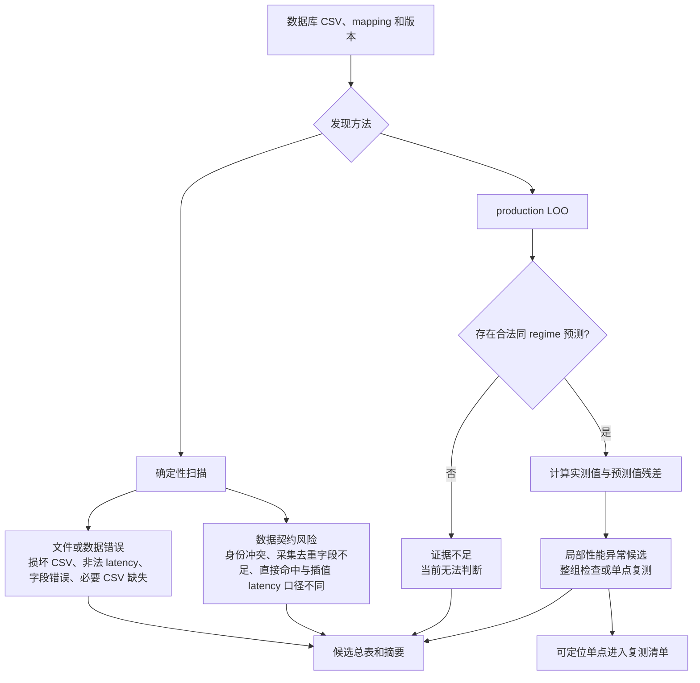
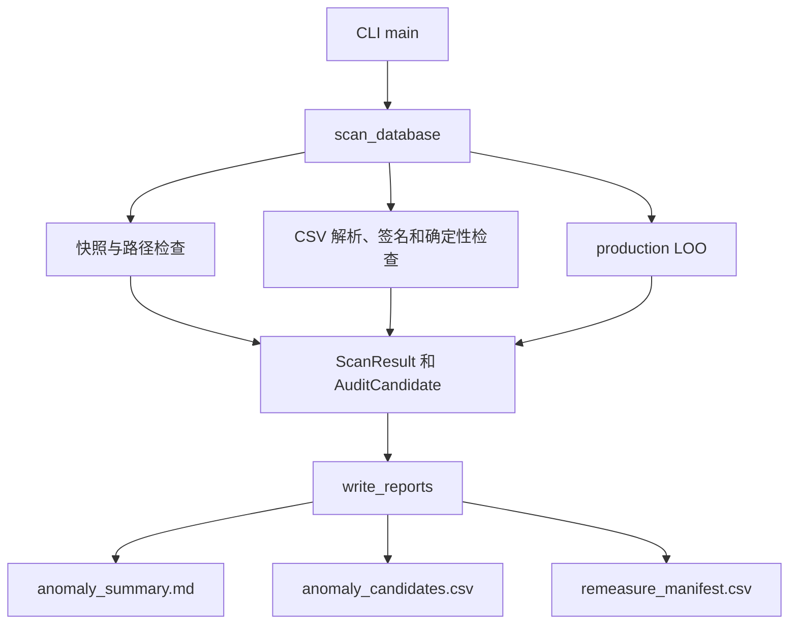

# RFC: 实测算子性能数据库异常点发现与复测闭环

## 元数据

| 项目 | 内容 |
| --- | --- |
| 状态 | Draft |
| 创建日期 | 2026-08-06 |
| 最近更新 | 2026-08-26 |
| 适用范围 | profiling operator database 离线质量审计 |
| 相关 PR | [#673](https://gitcode.com/Ascend/msmodeling/pull/673) |
| V1 实现 | `tools/perf_data_collection/find_database_anomalies.py` |

## 1. 能发现哪些问题，怎样发现

### 1.1 问题发现流程



工具发现四类结果：确定性文件或数据错误、数据契约风险、局部性能异常候选和证据不足。前两类来自确定性扫描，后两类来自
production LOO。除确定性错误外，其余结果都不是“错误 latency”的事实标签。

### 1.2 代码结构



`scan_database()` 只读扫描并返回结构化结果，`write_reports()` 在数据库目录外原子生成三份报告。代码不执行硬件复测，不修改
CSV，也不把统计候选直接升级为错误结论。

## 2. 目标和问题边界

错误 latency、来源混用、错误 metadata 或语义混桶会污染 exact 查询；异常点作为插值邻点时还会影响其他 Shape。这些问题通常不会表现为 MISS，因此需要独立于覆盖率检查的离线审计。

审计目标是：

1. 对全部 CSV 做确定性检查，不静默跳过文件或行。
2. 对具有可靠生产轴语义的数据生成高信息量候选。
3. 记录候选的原始位置、严格身份、生产分桶、邻点、证据和建议动作。
4. 输出带快照身份的最小复测清单，降低硬件与人工筛选成本。

以下推理不成立：

```text
插值残差大 -> 数据库点错误
```

大残差还可能来自邻点错误、latency source 混用、dtype/format/layout/runtime metadata 混桶、算法切换、插值模型不适用或测量波动。因此 V1 不自动删改 CSV、不用预测值回填 latency、不使用全局百分比判错，也不以模型估算代替硬件复测。

## 3. 现有证据

基线为 A3、vLLM 0.18、Torch 2.9、CANN 8.5 数据库，共 108 个成功扫描的 CSV、38,265 行有效 latency。

| 信号 | 样本量 | 观察结果 |
| --- | ---: | --- |
| 同行 microbench/profiling 正 latency 对称比 | 529 | p50 1.08，p90 1.80，p95 2.21，最大 106.16 |
| profiling `std / average` | 1,814 | p50 0.049，p90 0.242，p95 0.515，最大 7.145 |
| profiling average/median 对称比 | 1,814 | p90 1.054，p95 1.256，最大 37.327 |

这些分布证明来源差异和测量波动值得审计，但不能直接产生判错阈值。

现有 `canonicalize_profile_signature()` 和 `get_sig()` 服务于采集聚合，均不是严格行身份。当前快照中，3,490 行不同严格语义被现有采集合并键折叠，集中在 `SparseFlashAttention`、`LightningIndexer` 和 `FusedInferAttentionScore`。使用 runtime-aware、dtype canonical 的完整签名离线复算后碰撞降为 0，证明审计能够发现真实签名契约缺口；这不证明碰撞行的 latency 本身错误。

PR262/PR489 的 LOOCV、holdout 和补库结果表明来源混用、broadcast 混桶和局部孤立长尾会影响查询与插值，但不能单独决定异常阈值。

## 4. 检测原则与安全约束

### 4.1 严格行签名与采集合并签名分离

| 名称 | 用途 | 是否允许有损规范化 |
| --- | --- | --- |
| `strict_row_signature` | 判断物理记录是否重复，定位复测目标 | 否 |
| `collection_match_signature` | 复用现有采集聚合与 CSV 合并规则 | 仅允许已有规则 |

`strict_row_signature` 包含 kernel、输入输出 Shape/dtype/format、影响执行的 runtime metadata、数据库身份及其他非测量字段。它只排除 latency、统计值、硬件计数器、采集时间/session 和行号；未知列默认纳入。payload 使用稳定 canonical JSON 和 SHA-256，规则必须版本化。

同一 `collection_match_signature` 对应多个严格行签名时，输出 `COLLECTION_SIGNATURE_COLLISION` 和 `REVIEW_REGIME`，先检查签名或分桶契约，不生成逐行复测任务。

### 4.2 生产语义是 LOO 的唯一依据

审计器不得维护第二套轴表或简化插值公式，必须复用：

- `ProfilingDataSource` 的 CSV 加载和 exact latency policy；
- `InterpolatingDataSource` 的 candidate builder、axes、regime 和 kernel override；
- attention 等算子的轴变换；
- `CandidateGroup.interpolate()` 的轴组、几何、禁止外推和 matched rows。

每行同时记录 exact 查询采用的 latency 和作为插值 candidate 时采用的 latency。两种 policy 不一致时输出 `LATENCY_POLICY_DIVERGENCE` 并标记为 `REVIEW_REGIME`，先修复数据读取契约，不进入普通单点复测清单。LOO 的目标和邻点必须来自相同 latency source；同源邻点不足时弃权。

### 4.3 固定复测候选阈值

LOO 使用方向无关残差 `|predicted-target|/min(predicted,target)`。V1 将固定候选阈值设为 `1.0`，等价于预测值与实测值至少相差 2 倍。达到阈值只表示该行值得复测，不表示 latency 已确认错误。

阈值依据有三点：当前同行 profiling average/median 的倍率 p95 为 1.256，2 倍明显高于常见聚合差异；在当前快照 22,692 个可预测行中触发 115 个候选，占 0.51%，复测规模可控；固定阈值不会因数据库行数增长而挤掉同等严重的点。该阈值是 V1 工程复测线，不是自动判错线，后续只能根据独立复测结果调整。

### 4.4 候选状态不是事实标签

| 状态 | 含义 |
| --- | --- |
| `CONFIRMED_FORMAT_ERROR` | 非法 latency、未登记文本或必需字段无法解析等确定性错误 |
| `UNMEASURED_PLACEHOLDER` | latency 为空或为零，表示待采集或采集失败 |
| `REMEASURE_HIGH` | 多类独立证据共同指向目标点，优先复测 |
| `REMEASURE_NORMAL` | 单类异常证据，普通优先级复测 |
| `REVIEW_REGIME` | 共享高风险邻域、采集合并签名或 latency policy 契约存在风险，应先检查规则 |
| `INSUFFICIENT_EVIDENCE` | 缺少合法 bracket、样本不足或来源冲突，当前无法判断 |

除 `CONFIRMED_FORMAT_ERROR` 外，所有状态都不是错误结论。

### 4.5 只读、快照和复测交接

扫描前后必须校验 CSV 清单、内容 hash 和 mapping hash；任何变化都使结果失效。数据库快照 hash 由按相对路径排序的 CSV 文件名与各文件 SHA-256 清单再次计算 SHA-256 得到。输入必须是数据库目录内的普通文件，不跟随链接读取目录外内容；输出目录必须位于数据库外。

`remeasure_manifest.csv` 至少记录 case ID、kernel、相对 CSV 路径、逻辑记录号、严格行签名、数据库快照 hash、状态和复测理由。文件级错误、`REVIEW_REGIME` 和 `INSUFFICIENT_EVIDENCE` 不进入逐点复测清单。V1 不执行该 manifest，也不输出可拼接为 shell 命令的字段。

### 4.6 两级验收

1. **工具正确性门：**签名、生产语义一致性、只读安全、输入冻结、输出确定性和分母守恒。
2. **检测效果门：**在独立标注集上验证固定阈值候选的 precision、recall、误报和复测压缩率。

效果门未完成时，固定阈值只能用于生成复测候选，不能成为自动合入门禁。

## 5. 检测流程与输出

### 5.1 检测流程

1. 冻结 CSV、mapping 和版本，拒绝数据库内输出路径和非法 mapping 路径。
2. 在 CSV parser 前识别 Git LFS pointer；文件错误隔离到单文件，行错误不阻断同文件其他合法行。
3. 构建严格行签名、采集合并签名和双 latency policy。
4. 检查文件、latency、Shape metadata、严格签名冲突、采集合并签名碰撞和 policy 分歧。
5. 从 mapping 发现 production query context，复用一个 production candidate index 执行 LOO。
6. 移除目标行；同坐标仍有副本时防止目标泄漏；禁止跨 source、dtype、format、layout 和 runtime metadata。
7. 无合法预测的行保留为弃权；成功预测记录 matched rows、几何和对称倍率残差 `|pred-target|/min(pred,target)`。
8. 达到固定阈值且共享局部邻域的点合并为 `REVIEW_REGIME`；其余点进入单点复测候选。
9. 写出前重新校验输入；三份报告通过 staging 目录按完整代次发布，失败时保留上一完整版本。

### 5.2 输出

| 文件 | 内容 |
| --- | --- |
| `anomaly_candidates.csv` | 全部候选、严格身份、位置、latency policy、regime、邻点、残差、状态和建议动作 |
| `anomaly_summary.md` | 按数据完整性、数据契约、固定阈值性能候选和无法判断四类汇总结果 |
| `remeasure_manifest.csv` | 预算内可定位到具体行的单点复测目标 |

`--residual-threshold` 指定固定候选阈值，默认 `1.0`；`--remeasure-limit` 只限制复测清单导出的行数，不改变检测结果和全库扫描分母。`--skip-loo` 只运行确定性检查。

## 6. V1 实现与复现

V1 遵循最小实现原则：一个工具模块完成扫描、production LOO、阈值筛选和原子写出，一个回归测试文件锁定行为；不修改 production datasource、正式 CSV schema 或硬件采集链路。

```powershell
python tools/perf_data_collection/find_database_anomalies.py `
  --database-path <profiling-database> `
  --output-dir <database-outside-report-dir> `
  --residual-threshold 1.0 `
  --remeasure-limit 50
```

发现生产映射引用、但数据库中不存在的算子 CSV 时，工具完整写出报告并返回 2；正常完成返回 0，参数或运行错误返回非零。只运行确定性检查时使用 `--skip-loo`。

回归测试覆盖严格签名、非法 latency、LFS pointer、路径安全、production LOO、阈值边界、禁止外推、跨 source 隔离、弃权分母、签名碰撞、报告分类、公式前缀转义、快照变化和报告发布回滚。focused audit 测试 `51 passed`；插值数学与 production datasource 回归结果见 PR 验证记录。

## 7. 运行证据与效果边界

### 7.1 A3 v0.18 全库运行结果

以下结果由 PR673 当前实现使用固定阈值 `1.0`，在数据库快照 `f8a3dfc5a7b45c9dc814bd0f5e8835e91ac0ed721305e791af57b856c58c3b29` 上复现。

本节统计绑定上述数据库快照及当前 datasource 实现。PR732 合入后，必须基于合入后的 `master` 重跑全库 dry-run，并更新本节的可预测/无法判断、Attention LOO 和固定阈值候选统计；重跑完成前，不得将本节数字作为新实现的验证证据。

| 指标 | 结果 |
| --- | ---: |
| 成功扫描的 CSV / 数据行 | 108 / 38,265 |
| 正 latency 行 | 38,265 |
| 唯一 CSV 行尝试 / 可预测 / 无法判断 | 32,728 / 22,692 / 10,036 |
| 可建立 LOO index / 至少成功预测一次的 CSV | 74 / 48 |
| 采集去重规则无法区分的数据行 / 算子 | 3,490 / 3 |
| 达到 2 倍偏差阈值 / 整组检查 / 单点复测候选 | 115 / 33 / 82 |
| 直接命中和插值使用不同 latency 的数据行 | 4 |
| 生产映射引用、但数据库中不存在的算子 CSV | 7 |

10,036 个无法判断表示生产插值几何缺少合法同分桶邻点，不是异常。3,490 个风险行表示现有采集去重字段不足，也不表示 latency 错误。7 个缺失 CSV 使审计返回 2，避免输出“数据库完整”的假结论。

### 7.2 当前不能证明的内容

全库运行结果证明工具能够完整扫描当前数据库、复用 production LOO、公开弃权分母并发现确定性文件和签名契约问题，但不能证明高残差候选的 latency 确实错误。

当前没有独立硬件复测标注集，因此固定阈值候选的 precision、真实异常 recall 和每万行误报均未知。未达到阈值的点也不能据此认定正确。

检测效果门需要复测全部阈值候选，并抽取低于阈值和无法判断的随机对照点。只有阈值候选的确认错误率稳定高于对照组，且漏检率可接受，才能声称阈值对真实数据库有效。在此之前，工具只负责生成候选。

## 8. 被否决的方案和风险控制

| 方案或风险 | 决策或控制 |
| --- | --- |
| 固定百分比直接判错 | 拒绝；固定阈值只触发复测，不直接判错 |
| 使用有损采集签名判断重复 | 拒绝；严格行身份与采集合并身份分离 |
| 审计器自建轴表或简化插值 | 拒绝；直接复用 production candidate 和几何 |
| 自动使用预测值修复 CSV | 拒绝；预测不是 ground truth |
| 隐藏 runtime 分支未进入 regime | 保守弃权并输出 `REVIEW_REGIME` |
| 邻点本身异常 | 结合来源、局部趋势和独立复测判断 |
| 生产私有接口变化 | 使用一致性回归锁定 candidate、matched rows 和 latency policy |
| 文件行号随数据库更新漂移 | manifest 同时携带快照 hash 和严格签名 |

## 9. 结论

该能力应定义为“多证据异常候选发现”，不是“用插值给数据库判错”。生产语义保证候选可复核，严格签名保证重复与冲突判断可信，快照化复测清单保证交接对象稳定，两级验收避免把工具可运行误写成检测效果达标。

RFC Approved 前，V1 只输出人工审计候选，不启用自动修库、自动复测或合入阻断。后续只有在独立复测标注集上完成效果校准，才能另行评审自动门禁。
