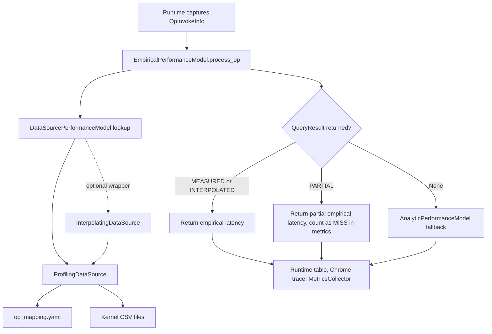

# RFC: Profiling-Driven Empirical Performance Model

## Metadata
| Item | Content |
| :--- | :--- |
| **Status** | Completed |
| **Author(s)** | Horacehxw, Codex |
| **Creation Date** | 2026-05-12 |
| **Related Links** | <https://gitcode.com/Ascend/msmodeling/pull/123> |
| **Chinese Version** | [rfc_profiling_driven_empirical_performance_model_zh.md](rfc_profiling_driven_empirical_performance_model_zh.md) |

---

## 1. Problem Statement

TensorCast needs to introduce a runtime performance model that uses measured NPU kernel behavior to complement the analytic Roofline estimator. The analytic model remains a useful general fallback, but it cannot accurately capture backend kernel selection, operator fusion, communication topology, special attention kernels, or fused MoE kernels in the real execution stack.

This RFC defines a runtime/model-side design for introducing measured-operator data integration from scratch: after each `OpInvokeInfo` is produced, TensorCast queries a profiling database. A hit returns a structured `QueryResult`; a miss falls back to the analytic model. The model also keeps coverage metrics and debug information so data gaps remain visible. This RFC is the source RFC for the capability and records both completed content and future evolution. Delivered behavior follows the interfaces and data contracts defined here; future extensions should follow the evolution items and validation gates in Section 3.

### 1.1 Goals

- Provide a unified `DataSourcePerformanceModel` interface for profiling data sources and future empirical data sources.
- Define the `QueryResult` and `QuerySource` contract, including latency, confidence, source, shape-match debug information, and composite sub-kernel information.
- Use `ProfilingDataSource` as a runtime read-only adapter that consumes `op_mapping.yaml` and per-kernel CSV files.
- Support query paths: compute, communication, attention special, elementwise, MoE fused, composite, zero cost, and accepted miss.
- Let `EmpiricalPerformanceModel` query the data source first and fall back to `AnalyticPerformanceModel` on a full miss.
- Make `op_mapping.yaml` the runtime contract between TensorCast operator names and NPU profiling kernel data.
- Emit metrics and debug information that localize coverage gaps.

### 1.2 Non-goals

- This RFC does not define the profiling collection pipeline, CSV parser pipeline, or microbenchmark generation flow.
- This RFC does not automatically generate or validate `op_mapping.yaml`; it only defines how runtime consumes it.
- This RFC does not replace the analytic model. The analytic model is still used for miss fallback and latency-weighted metrics.
- This RFC does not enable extrapolation. `QuerySource.EXTRAPOLATED` is reserved for future extension, and the runtime query paths defined here do not return extrapolated results.
- This RFC does not make interpolation the default runtime behavior. Default profiling mode should use plain `ProfilingDataSource`, not `InterpolatingDataSource`.
- This RFC does not require compiler or graph optimization pass changes.

## 2. Solution Design

### 2.1 Recommended Solution

The recommended design is a layered runtime model:



#### 2.1.1 Runtime Components

| Component | Implementation Path | Runtime Responsibility | Required Behavior |
| :--- | :--- | :--- | :--- |
| `DataSourcePerformanceModel` | `tensor_cast/performance_model/profiling_database/data_source.py` | Abstract interface with `lookup(OpInvokeInfo) -> Optional[QueryResult]`. `store()` is optional and read-only by default. | Serves as the abstract base class for all empirical data sources. |
| `QueryResult` | `tensor_cast/performance_model/profiling_database/data_source.py` | Carries `latency_us`, `confidence`, `source`, `details`, `shape_match_info`, and `sub_kernel_shapes`. | Rewritten by the empirical model into result statistics. |
| `QuerySource` | `tensor_cast/performance_model/profiling_database/data_source.py` | Identifies result source: `MEASURED`, `INTERPOLATED`, `EXTRAPOLATED`, or `PARTIAL`. | `EXTRAPOLATED` is reserved for future extension; query paths defined by this RFC do not produce it. |
| `ProfilingDataSource` | `tensor_cast/performance_model/profiling_database/profiling_data_source.py` | Loads `op_mapping.yaml`, loads kernel CSVs, dispatches query paths, and records `last_miss_reason` plus shape debug information. | `ModelRunner` profiling mode constructs this data source by default. EP size is read from `parallel_config`. |
| `InterpolatingDataSource` | `tensor_cast/performance_model/profiling_database/interpolating_data_source.py` | Wraps `ProfilingDataSource` and tries in-range interpolation after exact MISS or PARTIAL. | Explicit optional capability, not the default profiling data source. |
| `EmpiricalPerformanceModel` | `tensor_cast/performance_model/empirical.py` | Queries the data source first, converts microseconds to seconds, falls back to analytic on MISS, and records `EmpiricalOpRecord`. | Always computes analytic fallback latency for misses and metric weights. |
| `MetricsCollector` | `tensor_cast/performance_model/metrics_collector.py` | Reads `EmpiricalPerformanceModel.op_records` and emits M1-M5 coverage metrics plus miss details. | Runtime logs metrics after inference; CLI can export JSON. |

#### 2.1.2 Data Source Interface

The data source interface keeps TensorCast runtime code independent from the physical profiling data format:

```python
class DataSourcePerformanceModel(ABC):
    @abstractmethod
    def lookup(self, op_invoke_info: OpInvokeInfo) -> Optional[QueryResult]:
        ...

    def store(self, op_invoke_info: OpInvokeInfo, result: QueryResult) -> None:
        raise NotImplementedError("This data source is read-only")
```

`lookup()` has three valid outcomes:

| Result | Runtime Behavior | Metrics Behavior |
| :--- | :--- | :--- |
| Full HIT, `QuerySource.MEASURED` or `QuerySource.INTERPOLATED` | Use `latency_us` as empirical execution time. | Count as HIT. |
| Partial HIT, `QuerySource.PARTIAL` | Use the accumulated partial empirical latency. | Count as MISS in coverage metrics. |
| `None` | Use analytic fallback latency. | Count as MISS with `last_miss_reason`. |

`QueryResult.details` is intentionally open-ended so each query path can expose its own metadata, such as `kernel_type`, `topology_tier`, `sub_kernel_durations`, interpolation method, or accepted-miss explanation.

#### 2.1.3 ProfilingDataSource Dispatch Logic

`ProfilingDataSource.lookup()` removes the `torch.ops.` prefix to get the normalized operator name, then looks up `operator_mappings`. The dispatch order is mapping-driven:

| Path | `op_mapping.yaml` Trigger | Match Key | Return Behavior |
| :--- | :--- | :--- | :--- |
| Composite | `composite: true` | MC2-style static `sub_kernels`, or Python decomposer output | Static composite chooses one matching compute candidate from non-communication sub-kernels and adds communication sub-kernels. Accumulating multiple compute or attention sub-kernels requires a registered Python decomposer. A decomposer can return `PARTIAL` when only some sub-kernels hit. |
| Communication | `category: communication` | `message_bytes`, `num_devices`, optional `topology_tier` | Queries HCCL-style CSV. Exact match returns `MEASURED`; in-range alpha-beta interpolation returns `INTERPOLATED`. |
| Attention special | `query_mode: attention_special` | Normalized Q shape, average sequence length, sparse mode, KV head count, dtype | Queries enriched attention CSV, mainly for `FusedInferAttentionScore`. `alternate_kernel_types` are tried in priority order when present. |
| Elementwise | `query_mode: elementwise` | Output shape and output dtype byte size | Matches output shape and scales latency by dtype byte ratio when needed. Falls back to compute lookup when output information is unavailable. |
| MoE fused | `query_mode: moe_fused` | Tensor input shape and expert parallel size when the CSV has `EP Size` | Used for fused MoE kernels such as dispatch/combine paths. |
| Zero cost | `zero_cost: true` | Mapping declaration only | Returns `0.0 us`, `source=MEASURED`, and `zero_cost=True`. |
| Accepted miss | `accepted_miss: <reason>` | Mapping declaration only | Returns `0.0 us` and an explanation for TensorCast ops that have no standalone NPU profiling kernel. |
| Compute | Default path with `kernel_type` | Input tensor shape, dtype, format, and optional `tc_input_count` | Queries `{kernel_type}.csv` and tries `alternate_kernel_types` in order. |

Compute matching is driven by input tensor shapes and dtypes. The generic compute path does not use output shape and does not validate output shape; output shape is used mainly by the elementwise path because elementwise cost is more directly determined by output size.

Supported compute matching behavior includes exact shape matching, dtype compatibility for selected kernels, FRACTAL_NZ restoration, batch-dimension stripping, matmul weight transpose, padding-tolerant matching, flattening for selected batch kernels, and kernel-specific normalization for RoPE, SwiGlu, reshape/cache, and related kernels.

Exact rules for the attention-special path:

- Supports either `Runtime avg_seq_len` or `avg_seq_len`; rows miss when both columns are absent.
- Skips CSV rows with `avg_seq_len < 0`.
- Parses Q shape from `Input Shapes` slot 0 and normalizes it to 3D `(T, N, D)`; TC-side 2D/3D/4D query shapes are normalized to the same form.
- dtype, head count `N`, and head_dim `D` must match exactly.
- If the CSV has `Runtime sparse_mode`, `Runtime num_key_value_heads`, or `Runtime input_layout`, and the TC side can derive the corresponding value, that field participates in exact filtering.
- `avg_seq_len` uses nearest-neighbor tolerance matching. The tolerance is `±16`; larger gaps are MISS.
- Query-token dimension `T` must match exactly or satisfy block-padding-tolerant matching.
- `alternate_kernel_types` are tried in mapping order, and matching candidates are selected by the smallest `avg_seq_len` gap.

#### 2.1.4 `op_mapping.yaml` Runtime Contract

`op_mapping.yaml` is the runtime contract between TensorCast operator invocations and profiling database rows.

Top-level fields fall into three categories:

| Category | Field | Required | Meaning |
| :--- | :--- | :--- | :--- |
| Runtime-consumed | `operator_mappings` | Yes | Mapping from normalized TensorCast/PyTorch operator name to query configuration. |
| Runtime-consumed | `communication_data_ref` | No | Relative directory for communication CSVs. When absent, communication CSVs are read from the main data directory. |
| Runtime-consumed | `interpolation_policy` | No | Optional policy read by `InterpolatingDataSource`, such as per-kernel shape transforms. Plain `ProfilingDataSource` does not consume it. |
| Runtime-allowed but not consumed | `version`, `device`, `cann_version`, `pytorch_version`, `op_plugin_version`, `collection_date` | Recommended | Used to audit database and runtime software-stack compatibility; lookup does not require them. |
| Runtime-allowed but not consumed | `communication_fallback` | No | Documentation fallback strategy field. Full MISS handling is centralized in `EmpiricalPerformanceModel`, which falls back to analytic. |
| Collection/tooling-only | `torch_npu_reference` | No | Reference metadata for replay-script maintenance and future generators; runtime lookup does not read it. |
| Extension fields | Unknown top-level fields | No | Should remain backward compatible; runtime ignores unknown fields by default. |

Per-operator fields:

| Field | Scope | Runtime Meaning |
| :--- | :--- | :--- |
| `kernel_type` | Most non-composite, non-zero-cost operators | CSV filename stem and profiling `Type` value. |
| `alternate_kernel_types` | Compute and attention-special paths | Candidate kernel CSV names tried in priority order. Decomposer-generated `SubKernelSpec` can also carry alternates. Elementwise and MoE fused paths query only the primary `kernel_type`. |
| `category: communication` | Communication operators | Selects the communication query path. |
| `query_mode` | Special paths | Selects `attention_special`, `elementwise`, or `moe_fused`. |
| `composite: true` | Composite operators | Declares that one TensorCast operator maps to multiple NPU kernels. |
| `sub_kernels` | Static composite operators | Static behavior is MC2-style: non-communication entries are compute candidates and runtime uses the first matching candidate; `hcom_` entries are communication sub-kernels and are accumulated. This is not a general "sum all listed compute kernels" mechanism. |
| `decomposer: true` | Dynamic composite operators | Documentation/hint field. Runtime decomposition depends on whether the normalized operator name is registered in `COMPOSITE_DECOMPOSERS`, not on this YAML field alone. |
| `tc_input_count` | Shape matching | Truncates TensorCast tensor inputs before comparison with CSV inputs. |
| `zero_cost: true` | Shape-only or fusion-absorbed operators | Returns a measured-semantics zero-latency HIT. |
| `accepted_miss` | Expected no-standalone-kernel operators | Returns a zero-latency HIT with an explanation. |
| `notes` | Human review | Not used by runtime, but should document intent and evidence. |

Minimal example:

```yaml
operator_mappings:
  "aten.mm.default":
    kernel_type: MatMulV2
    alternate_kernel_types: [MatMulV3, MatMulCommon]

  "tensor_cast.all_reduce.default":
    kernel_type: hcom_allReduce_
    category: communication

  "tensor_cast.attention.default":
    kernel_type: FusedInferAttentionScore
    query_mode: attention_special

  "aten.add.Tensor":
    kernel_type: Add
    query_mode: elementwise

  "tensor_cast.matmul_all_reduce.default":
    composite: true
    sub_kernels: [MatMulV2, hcom_allReduce_]

  "aten.view.default":
    zero_cost: true

  "aten.detach.default":
    accepted_miss: "metadata-only op; no standalone NPU kernel"
```

Runtime invariants:

- Mapping keys must match normalized operator names, for example `aten.mm.default`, not `torch.ops.aten.mm.default`.
- Except for explicit zero-cost, accepted-miss, or composite operators delegated to sub-kernels, `kernel_type` and every runtime-used alternate should have a corresponding `{kernel_type}.csv` file. YAML-level alternates are used by compute and attention-special query paths; decomposer code can attach alternates to individual sub-kernel specs.
- `decomposer: true` should stay consistent with `COMPOSITE_DECOMPOSERS`, but the registry entry controls runtime dispatch.
- Latency column priority is `Average Duration(us)`, `Profiling Average Duration(us)`, then `Duration(us)`.
- Standard compute CSVs must provide input shape and input dtype. Input format participates in matching when present.
- Elementwise CSVs should provide output shape and output dtype.
- Communication CSVs need at least `message_bytes` and `num_devices`. `topology_tier` participates in matching when present and resolvable from the device communication grid.
- Attention-special CSVs must contain enough enriched runtime columns to match average sequence length and attention runtime attributes.

#### 2.1.5 Mapping Authoring and Maintenance Workflow

`op_mapping.yaml` should be authored and maintained through the repository-local op-mapping skill at `docs/perf_database/skills/op-mapping/` when adding or updating models, devices, profiling data, or software-stack versions.

This skill is not a runtime dependency, but it is part of the maintenance workflow paired with this RFC. It should cover:

- Collecting target model, device, parallelism, quantization mode, profiling CSV, software-stack versions, and local reference repository paths.
- Extracting the TensorCast runtime op list and the NPU profiling `Type` list.
- Building forward mappings from TensorCast ops to NPU profiling kernel types, plus reverse placeholders for profiling-only kernels.
- Producing `kernel_type`, `alternate_kernel_types`, `query_mode`, `category`, `composite`, `sub_kernels`, `zero_cost`, `accepted_miss`, `tc_input_count`, and `notes` according to the mapping contract.
- Enforcing key constraints: `kernel_type` must equal the CSV filename stem; `kernel_type`, `composite`, and `zero_cost` are mutually exclusive; communication ops use `message_bytes + num_devices`; `tc_input_count` is only for safe truncation of NPU-internal parameters; fused/composite super-ops must not be used as alternates for sub-ops.
- Running schema, lookup, coverage, and smoke verification after output so the mapping can be consumed by `ProfilingDataSource`.

If the skill maintenance SOP conflicts with this RFC's runtime contract, this RFC takes precedence and the skill should be updated to match it.

#### 2.1.6 Interpolation Policy

`InterpolatingDataSource` is a wrapper, not a replacement for `ProfilingDataSource`:

```python
base = ProfilingDataSource(data_dir, device_profile, parallel_config)
data_source = InterpolatingDataSource(base)
pm = EmpiricalPerformanceModel(device_profile, data_source)
```

Interpolation behavior:

| Path | Interpolation Behavior |
| :--- | :--- |
| Compute | After other dimensions and dtype match, linearly interpolate on the first dimension of the first input. |
| Attention special | Linearly interpolate on `avg_seq_len`; kernels that are approximately quadratic can configure a sqrt transform. |
| Elementwise | Linearly interpolate on the first dimension of the output shape, after optional dtype-byte scaling. |
| Composite | Only for decomposer-backed composite operators: decompose into sub-kernels, exact-query each sub-kernel first, then interpolate missed sub-kernels and accumulate. Static composite relies on exact `ProfilingDataSource` lookup and is not interpolated by the wrapper. |
| Communication | The wrapper does not interpolate. Communication interpolation is handled inside `ProfilingDataSource._query_comm_csv`. |
| Zero cost and accepted miss | No interpolation. |

Interpolation requires left and right bracket data points. If the target is outside the collected range, the wrapper does not return an interpolated result. Therefore, even though `QuerySource.EXTRAPOLATED` is reserved, extrapolation remains future work.

Integration requirement: profiling mode in `ModelRunner` constructs `ProfilingDataSource` directly by default. Before interpolation becomes a supported default or optional runtime mode, it needs an explicit CLI/config switch.

#### 2.1.7 Empirical Fallback Semantics

`EmpiricalPerformanceModel.process_op()` follows this flow:

1. Call `data_source.lookup(op_invoke_info)`.
2. Compute analytic fallback latency. This value is used both for full MISS fallback and as the weight for latency coverage metrics.
3. If the data source returns a full HIT, return empirical latency and write `source`, `confidence`, `details`, and shape debug information into `PerformanceModel.Result.statistics`.
4. If the data source returns `PARTIAL`, return the accumulated partial empirical latency, but still treat the op as MISS in metrics.
5. If the data source returns `None`, record `last_miss_reason`, return analytic fallback latency, and set `shape_match_rule` to `analytic`.

This guarantees every op has a usable latency estimate while coverage metrics clearly separate measured data from fallback estimates.

#### 2.1.8 CLI and Runtime Integration

Runtime integration keeps a small interface surface:

| User Entry | Behavior |
| :--- | :--- |
| `--performance-model analytic` | Use the analytic model. |
| `--performance-model profiling` | Use `EmpiricalPerformanceModel` backed by `ProfilingDataSource`. Requires `--profiling-database`. |
| `--performance-model analytic profiling` | Run both models and report both runtime estimates. The CLI uses `nargs="+"`, so this list-style form is the contract. Repeated `--performance-model` flags are outside this RFC's CLI contract. |
| `--profiling-database <dir>` | Directory containing `op_mapping.yaml` and kernel CSVs. |
| `--export-empirical-metrics <json>` | Export M1-M5 HIT/MISS metrics. Requires profiling mode. |
| `--chrome-trace <json>` | Export per-op trace events. Empirical result statistics are written into trace event args. |
| `--dump-input-shapes` | Group the runtime table by input shape for shape-level diagnostics. |

`ModelRunner` profiling initialization:

```python
data_source = ProfilingDataSource(
    profiling_database,
    device_profile,
    parallel_config=user_input.get_parallel_config(),
)
EmpiricalPerformanceModel(
    device_profile,
    data_source=data_source,
    fallback_model=AnalyticPerformanceModel(device_profile),
)
```

This RFC does not define a default CLI argument that wraps this data source with `InterpolatingDataSource`.

#### 2.1.9 Metrics and Debug Output

The empirical model and metrics collector expose coverage at several levels:

| Output | Source | Purpose |
| :--- | :--- | :--- |
| `source` | `QueryResult.source.name` | Distinguish `MEASURED`, `INTERPOLATED`, and `PARTIAL`. |
| `confidence` | `QueryResult.confidence` | Let downstream reports distinguish exact hits from lower-confidence estimates. |
| `kernel_type` | `QueryResult.details` | Show which NPU profiling kernel supplied the latency. |
| `shape_match_rule` | `ShapeMatchInfo` | Explain how a shape hit, why it missed, whether it was zero cost, or whether analytic fallback was used. |
| `kernel_shapes` | `ShapeMatchInfo` | Show the CSV shapes matched by compute, elementwise, MoE, and some composite paths. Attention and communication paths may expose path-specific debug fields instead. |
| `sub_kernel_shapes` | `SubKernelShapeInfo` list | Debug composite operators when sub-kernel shape metadata is available. |
| `sub_kernel_durations` | Composite result details | Show the latency split across sub-kernels. |
| `last_miss_reason` | Data source | Explain full MISS. This is not a closed enum; common values include `unmapped`, `csv_not_found`, `csv_format_raw`, `shape_mismatch`, `input_count_mismatch`, `invalid_args`, `elementwise_output_shape_mismatch`, `ep_size_not_configured`, `decompose_failed`, `sub_kernel_miss:*`, and attention argument parsing reasons. |
| M1 | `MetricsCollector` | Raw op-count hit rate. |
| M2 | `MetricsCollector` | Fused-op hit rate with pessimistic grouping. |
| M3 | `MetricsCollector` | Fused-op hit rate excluding zero-cost and accepted-miss entries. |
| M4 | `MetricsCollector` | Per-shape hit rate excluding zero-cost and accepted-miss entries. |
| M5 | `MetricsCollector` | Simulated latency coverage weighted by analytic latency. |

M1-M5 are runtime/model-side outputs. End-to-end comparison against real profiler traces can be computed offline, but it is not part of the runtime model contract.

### 2.2 Alternatives Considered

| Alternative | Description | Why It Is Not the Main Solution |
| :--- | :--- | :--- |
| Analytic model only | Keep all operators on Roofline estimation. | Simple, but cannot reflect real kernel selection, fusion, communication, and backend-specific behavior. |
| Hard-coded per-op estimator | Put measured constants or formulas directly into Python estimators. | Works for a few ops, but is hard to maintain across devices, CANN versions, kernel names, and shape grids. |
| Runtime directly queries raw profiler traces | Do not standardize per-kernel CSVs; use raw traces directly. | Trace files are heavy and workload-bound, so they are not suitable as a runtime query contract. |
| Enable interpolation by default now | Wrap all profiling runs in `InterpolatingDataSource`. | Valuable eventually, but default enablement needs accuracy validation, CLI control, and reporting that separates measured from interpolated results. |
| Learned regression model | Train a predictor from kernel features and shapes. | Potential future direction, but less explainable and debuggable than exact lookup plus controlled interpolation. |

### 2.3 Pros and Cons

| Aspect | Benefits | Costs or Limits |
| :--- | :--- | :--- |
| Mapping-driven lookup | Runtime stays generic; mapping can be updated per software stack without changing core code. | Quality depends on `op_mapping.yaml` correctness and CSV coverage. |
| `DataSourcePerformanceModel` abstraction | `ProfilingDataSource`, interpolation wrapper, and future data sources share one interface. | Open-ended `details` requires conventions, or reports may drift. |
| Exact measured lookup | Highly explainable; kernel names and shape rules make misses debuggable. | Exact shape coverage can be sparse under dynamic sequence lengths. |
| Analytic fallback | Every op still has a latency estimate on MISS. | Fallback values are not measured data and can hide data gaps if coverage metrics are ignored. |
| Partial composite | Keeps measured latency from sub-kernels that hit. | Runtime uses partial latency while metrics count it as MISS, so reports must explain the difference. |
| Optional interpolation | Can improve coverage when collected shape grids bracket runtime targets. | Not enabled by default in `ModelRunner`; no extrapolation; lower confidence than exact measured data. |

## 3. Completed Content and Future Evolution

### 3.1 Completed Content

| Item | Status | Owner / Role | Scope | Validation Result / Gate |
| :--- | :--- | :--- | :--- | :--- |
| Exact profiling runtime path | Completed | Runtime/model owner | Add `DataSourcePerformanceModel`, `ProfilingDataSource`, `EmpiricalPerformanceModel` integration, and M1-M5 metrics path. `ModelRunner` profiling mode uses `ProfilingDataSource` by default and requires `--profiling-database`. | Profiling tests pass; analytic mode behavior is preserved; runtime logs M1-M5; default interpolation is not enabled. |
| `op_mapping.yaml` contract and current profiling database integration | Completed; maintained continuously with the profiling database | Perf database owner, runtime/model support | Use `docs/perf_database/skills/op-mapping/` to generate or update mappings, then fill CSV coverage, zero-cost annotations, and accepted-miss annotations. | Mapping passes schema, lookup, coverage, and smoke verification; M3/M4/M5 improve in an explainable way without hiding structural misses. |

### 3.2 Future Evolution

| Evolution Item | Start Condition | Owner / Role | Scope | Exit Criteria |
| :--- | :--- | :--- | :--- | :--- |
| Optional interpolation validation | After exact-mode coverage stabilizes, before any default enablement | Runtime/model owner and accuracy validation owner | Add explicit config or CLI switch for `InterpolatingDataSource`. | Reports distinguish `MEASURED` and `INTERPOLATED`; no out-of-range extrapolation; scenario-level accuracy review is complete. |
| Data source capability enhancements | After accuracy validation | Runtime/model and data-source owner | Evaluate extrapolation, richer output-shape matching, schema validation, and other data sources. | Each capability has tests, confidence reporting, and fallback behavior. |

### 3.3 Test Plan

| Area | Required Coverage |
| :--- | :--- |
| Interface tests | `DataSourcePerformanceModel` is abstract; default read-only `store()` raises. |
| Empirical fallback tests | Full HIT returns measured latency; full MISS returns analytic fallback; `PARTIAL` is handled separately; result statistics include shape metadata. |
| Profiling data source tests | Cover compute, communication, attention special, elementwise, MoE fused, composite, zero cost, accepted miss, alternate kernels, and miss reasons. |
| Shape matching tests | Cover input shape/dtype matching, `tc_input_count`, FRACTAL_NZ restoration, padding, flattening, transpose, and known kernel-specific normalization. |
| Interpolation tests | Cover bracketed compute, attention, elementwise, and decomposer-backed composite interpolation; confirm static composite stays on exact `ProfilingDataSource`; confirm out-of-bracket requests do not extrapolate; confirm `source=INTERPOLATED`. |
| Runtime integration tests | Verify profiling mode requires `--profiling-database`; verify `ModelRunner` constructs `ProfilingDataSource` by default; future interpolation mode must be explicit. |
| Metrics tests | Verify M1-M5 JSON export, M3/M4 zero-cost exclusion, partial counted as MISS, miss-reason grouping, and latency coverage weights. |
| Trace/debug tests | Verify Chrome trace args include `source`, `confidence`, `kernel_type`, and `shape_match_rule`; verify `kernel_shapes` for compute/elementwise/MoE and available composite paths; verify path-specific debug metadata for attention/communication and composite sub-kernel metadata when available. |

Minimum validation gates:

- Unit tests: `python -m pytest tests/perf_database/test_empirical.py tests/perf_database/test_empirical_metrics.py tests/perf_database/test_profiling_data_source.py tests/perf_database/test_interpolating_data_source.py tests/test_tensor_cast/test_empirical.py -q`.
- Add focused suites when the change touches a specific operator area: `tests/perf_database/test_fia_enriched_lookup.py`, `tests/perf_database/test_mla_decomposition.py`, `tests/perf_database/test_op_mapping_schema.py`, or the relevant `tests/tools/*` tests.
- Profiling smoke command shape:

```bash
python -m tensor_cast.scripts.text_generate $MODEL \
  --num-queries $NQ --query-length $QL [--context-length $CL] \
  --device $DEVICE --world-size $WS --tp-size $TP [--dp-size $DP] [--ep-size $EP] \
  --quantize-linear-action $QUANT --compile \
  --performance-model analytic profiling \
  --profiling-database $DATA_DIR \
  --export-empirical-metrics /tmp/empirical_metrics.json
```

- After the smoke run, `/tmp/empirical_metrics.json` should contain top-level `m1`, `m2`, `m3`, `m4`, `m5`, and `misses`; `m5` should include `m5_simulated_latency_coverage`.
- Analytic-only baseline behavior must not change: `--performance-model analytic` does not require `--profiling-database` and must not construct `ProfilingDataSource`.

### 3.4 Follow-up Work

- Add an explicit CLI/config path for enabling interpolation, while keeping it off by default until validation is complete.
- Define a schema validator for `op_mapping.yaml` and required CSV columns.
- Add calibrated extrapolation only after accuracy gates are explicit; until then, out-of-range requests remain MISS.
- Extend output-shape-aware matching beyond elementwise only where output shape is proven to dominate cost.
- Improve composite reporting so partial runtime use and MISS accounting can be inspected side by side.
- Strengthen software-stack compatibility checks by exposing database version, device, CANN, PyTorch, and backend metadata before lookup.

### 3.5 Operational Constraints

- Analytic mode does not depend on a profiling database. Profiling mode is explicit opt-in and requires `--profiling-database`.
- The profiling database directory, `op_mapping.yaml`, and per-kernel CSVs are the file-based contract. New fields should stay backward compatible; unknown fields are ignored by runtime by default.
- Exact profiling behavior does not automatically become interpolation. Any default interpolation enablement must go through a separate CLI/config switch, accuracy validation, and reporting-format update.
- Wrappers or UI paths that need to run analytic and profiling together should emit `--performance-model analytic profiling`, or pass `["analytic", "profiling"]` directly into the config object.
