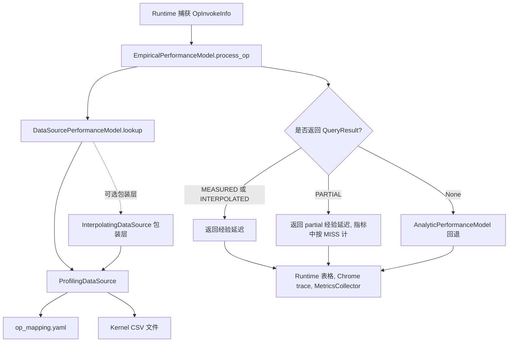

# RFC: 基于 Profiling 的经验性能模型

## 元数据
| 项目 | 内容 |
| :--- | :--- |
| **状态** | 已完成 |
| **作者** | Horacehxw, Codex |
| **创建日期** | 2026-05-12 |
| **相关链接** | <https://gitcode.com/Ascend/msmodeling/pull/123> |
| **英文版本** | [rfc_profiling_driven_empirical_performance_model_en.md](rfc_profiling_driven_empirical_performance_model_en.md) |

---

## 1. 问题陈述（概述）

TensorCast 需要引入一个运行时性能模型，用实测 NPU kernel 行为补充 analytic Roofline 估计。Analytic 模型适合作为通用后备方案，但它难以准确刻画后端 kernel 选择、算子融合、通信拓扑、特殊 attention kernel，以及 MoE 融合 kernel 等实际执行行为。

本文定义一个从零接入实测算子数据的运行时/模型侧方案：在每次 `OpInvokeInfo` 产生后查询 profiling 数据库，命中时返回结构化的 `QueryResult`，未命中时回退到 analytic 模型，同时保留覆盖率指标和调试信息。本 RFC 是该能力的源 RFC，记录当前已完成内容与后续演进；已落地能力以本文定义的接口和数据契约为准，后续扩展以第 3 节列出的演进项和验证门禁推进。

### 1.1 目标

- 提供统一的 `DataSourcePerformanceModel` 接口，承载 profiling 数据源和未来经验数据源。
- 定义 `QueryResult` 与 `QuerySource` 契约，保存延迟、置信度、来源、shape 匹配调试信息和 composite 子 kernel 信息。
- 以 `ProfilingDataSource` 作为运行时只读适配层，读取 `op_mapping.yaml` 和按 kernel 拆分的 CSV。
- 支持查询路径：compute、communication、attention special、elementwise、MoE fused、composite、zero cost 和 accepted miss。
- 由 `EmpiricalPerformanceModel` 负责先查数据源、完整 MISS 时回退到 `AnalyticPerformanceModel`。
- 将 `op_mapping.yaml` 明确为 TensorCast 算子名到 NPU profiling kernel 数据之间的运行时契约。
- 输出可定位覆盖缺口的指标和调试信息。

### 1.2 非目标

- 本 RFC 不定义 profiling 采集流水线、CSV 解析流水线或 microbenchmark 生成流程。
- 本 RFC 不自动生成或校验 `op_mapping.yaml`，只定义运行时如何消费它。
- 本 RFC 不替换 analytic 模型。Analytic 模型仍用于 MISS 回退，也用于指标中的延迟权重。
- 本 RFC 不启用 extrapolation。`QuerySource.EXTRAPOLATED` 仅作为未来扩展保留，本方案中的运行时查询路径不返回 extrapolated 结果。
- 本 RFC 不把 interpolation 作为默认运行时行为。默认 profiling 模式应接入普通 `ProfilingDataSource`，不是 `InterpolatingDataSource`。
- 本 RFC 不要求修改编译器或图优化 pass。

## 2. 方案设计

### 2.1 推荐方案

推荐方案采用分层运行时模型：



#### 2.1.1 运行时组件

| 组件 | 实现位置 | 运行时职责 | 规范行为 |
| :--- | :--- | :--- | :--- |
| `DataSourcePerformanceModel` | `tensor_cast/performance_model/profiling_database/data_source.py` | 抽象接口，提供 `lookup(OpInvokeInfo) -> Optional[QueryResult]`。`store()` 为可选接口，默认只读。 | 作为所有经验数据源的抽象基类。 |
| `QueryResult` | `tensor_cast/performance_model/profiling_database/data_source.py` | 携带 `latency_us`、`confidence`、`source`、`details`、`shape_match_info` 和 `sub_kernel_shapes`。 | 由 empirical 模型转写到结果统计信息中。 |
| `QuerySource` | `tensor_cast/performance_model/profiling_database/data_source.py` | 标识结果来源：`MEASURED`、`INTERPOLATED`、`EXTRAPOLATED` 或 `PARTIAL`。 | `EXTRAPOLATED` 仅保留给未来扩展；本 RFC 定义的查询路径不产生该值。 |
| `ProfilingDataSource` | `tensor_cast/performance_model/profiling_database/profiling_data_source.py` | 读取 `op_mapping.yaml`，加载 kernel CSV，分派查询路径，记录 `last_miss_reason` 和 shape 调试信息。 | `ModelRunner` 的 profiling 模式默认构造该数据源。初始化时通过 `parallel_config` 取得 EP size。 |
| `InterpolatingDataSource` | `tensor_cast/performance_model/profiling_database/interpolating_data_source.py` | 包装 `ProfilingDataSource`，在精确查询 MISS 或 PARTIAL 后尝试区间内插值。 | 作为显式可选能力，不作为 profiling 模式默认数据源。 |
| `EmpiricalPerformanceModel` | `tensor_cast/performance_model/empirical.py` | 先查数据源，将微秒转为秒，MISS 时回退到 analytic，并记录 `EmpiricalOpRecord`。 | 始终计算 analytic fallback 延迟，用于 MISS 回退和指标权重。 |
| `MetricsCollector` | `tensor_cast/performance_model/metrics_collector.py` | 读取 `EmpiricalPerformanceModel.op_records`，输出 M1-M5 覆盖率和 MISS 明细。 | 推理结束后打印指标，CLI 可导出 JSON。 |

#### 2.1.2 数据源接口

数据源接口使 TensorCast 运行时代码不依赖 profiling 数据的物理格式：

```python
class DataSourcePerformanceModel(ABC):
    @abstractmethod
    def lookup(self, op_invoke_info: OpInvokeInfo) -> Optional[QueryResult]:
        ...

    def store(self, op_invoke_info: OpInvokeInfo, result: QueryResult) -> None:
        raise NotImplementedError("This data source is read-only")
```

`lookup()` 有三类有效结果：

| 结果 | 运行时行为 | 指标行为 |
| :--- | :--- | :--- |
| 完整 HIT，`QuerySource.MEASURED` 或 `QuerySource.INTERPOLATED` | 使用 `latency_us` 作为经验执行时间。 | 计为 HIT。 |
| 部分 HIT，`QuerySource.PARTIAL` | 使用已经累加到的 partial 经验延迟。 | 覆盖率指标中计为 MISS。 |
| `None` | 使用 analytic fallback 延迟。 | 以 `last_miss_reason` 计为 MISS。 |

`QueryResult.details` 保持开放结构，以便不同查询路径暴露自己的元数据，例如 `kernel_type`、`topology_tier`、`sub_kernel_durations`、插值方法或 accepted-miss 说明。

#### 2.1.3 ProfilingDataSource 分派逻辑

`ProfilingDataSource.lookup()` 会去掉 `torch.ops.` 前缀，得到规范化算子名，然后在 `operator_mappings` 中查找配置。分派逻辑由 mapping 驱动，顺序如下：

| 路径 | `op_mapping.yaml` 触发条件 | 匹配键 | 返回行为 |
| :--- | :--- | :--- | :--- |
| Composite | `composite: true` | MC2 风格静态 `sub_kernels`，或 Python decomposer 输出 | 静态 composite 会从非通信子 kernel 中选择一个匹配的 compute 候选，并累加通信子 kernel。任意多 compute 或 attention 子 kernel 的累加需要注册 Python decomposer；decomposer 在部分子 kernel MISS 时可返回 `PARTIAL`。 |
| Communication | `category: communication` | `message_bytes`、`num_devices`、可选 `topology_tier` | 查询 HCCL 风格 CSV。精确命中返回 `MEASURED`；区间内 alpha-beta 插值返回 `INTERPOLATED`。 |
| Attention special | `query_mode: attention_special` | 归一化 Q shape、平均序列长度、sparse mode、KV head 数、dtype | 查询增强 attention CSV，主要用于 `FusedInferAttentionScore`；存在 `alternate_kernel_types` 时按优先级尝试。 |
| Elementwise | `query_mode: elementwise` | 输出 shape 和输出 dtype 字节数 | 按输出 shape 匹配；必要时按 dtype 字节比缩放延迟。没有输出信息时回退到 compute 查询。 |
| MoE fused | `query_mode: moe_fused` | Tensor 输入 shape，以及 CSV 带 `EP Size` 时的 expert parallel size | 用于 fused MoE kernel，例如 dispatch/combine 路径。 |
| Zero cost | `zero_cost: true` | 仅依赖 mapping 声明 | 返回 `0.0 us`，`source=MEASURED`，并标记 `zero_cost=True`。 |
| Accepted miss | `accepted_miss: <reason>` | 仅依赖 mapping 声明 | 返回 `0.0 us` 和解释说明。用于 TensorCast 中存在、但 NPU profiling 中没有独立 kernel 的算子。 |
| Compute | 默认路径，配置 `kernel_type` | 输入 tensor shape、dtype、format 和可选 `tc_input_count` | 查询 `{kernel_type}.csv`，并按优先级尝试 `alternate_kernel_types`。 |

Compute 匹配由输入 tensor shape 和 dtype 驱动。通用 compute 路径不使用输出 shape，也不把 output shape 作为验证条件；输出 shape 主要用于 elementwise 路径，因为 elementwise 成本更直接由输出规模决定。

Compute 匹配行为包括精确 shape 匹配、部分 kernel 的 dtype 兼容、FRACTAL_NZ 还原、batch 维剥离、matmul 权重转置、padding 容忍匹配、部分 batch kernel 的 flatten，以及 RoPE、SwiGlu、reshape/cache 等 kernel 特定归一化。

Attention-special 路径的精确规则：

- 支持 `Runtime avg_seq_len` 或 `avg_seq_len` 两种列名；缺少两者时不命中。
- 忽略 `avg_seq_len < 0` 的 CSV 行。
- Q shape 从 `Input Shapes` slot 0 解析，并归一化为 3D `(T, N, D)`；TC 侧也会把 2D/3D/4D query shape 归一化到同一形式。
- dtype、head 数 `N`、head_dim `D` 必须精确匹配。
- 如果 CSV 存在 `Runtime sparse_mode`、`Runtime num_key_value_heads` 或 `Runtime input_layout`，且 TC 侧能推导对应值，则这些字段参与精确过滤。
- `avg_seq_len` 使用最近邻容差匹配，容差为 `±16`；超过容差视为 MISS。
- Query token 维度 `T` 必须相等，或满足 block-padding 容忍匹配。
- `alternate_kernel_types` 按 mapping 顺序尝试，命中候选按 `avg_seq_len` gap 最小者选择。

#### 2.1.4 `op_mapping.yaml` 运行时契约

`op_mapping.yaml` 是 TensorCast 算子调用和 profiling 数据库行之间的运行时契约。

顶层字段分三类：

| 分类 | 字段 | 是否必需 | 含义 |
| :--- | :--- | :--- | :--- |
| 运行时消费 | `operator_mappings` | 是 | 从规范化 TensorCast/PyTorch 算子名到查询配置的映射。 |
| 运行时消费 | `communication_data_ref` | 否 | 通信 CSV 的相对目录。不存在时从主数据目录读取通信 CSV。 |
| 运行时消费 | `interpolation_policy` | 否 | `InterpolatingDataSource` 读取的可选策略，例如按 kernel 配置 shape transform。普通 `ProfilingDataSource` 不消费。 |
| 运行时允许但不消费 | `version`、`device`、`cann_version`、`pytorch_version`、`op_plugin_version`、`collection_date` | 推荐 | 用于审计数据库与运行时软件栈是否匹配；lookup 不强依赖。 |
| 运行时允许但不消费 | `communication_fallback` | 否 | 文档性 fallback 策略字段；完整 MISS 统一由 `EmpiricalPerformanceModel` 回退到 analytic。 |
| 采集/工具链字段 | `torch_npu_reference` | 否 | 为 replay 脚本维护和未来生成器提供参考；运行时查询不读取。 |
| 扩展字段 | 未知顶层字段 | 否 | 默认应保持向后兼容，运行时忽略未知字段。 |

单算子字段：

| 字段 | 适用范围 | 运行时含义 |
| :--- | :--- | :--- |
| `kernel_type` | 大多数非 composite、非 zero-cost 算子 | CSV 文件名 stem，也是 profiling `Type` 值。 |
| `alternate_kernel_types` | Compute 和 attention-special 路径 | 按优先级尝试的候选 kernel CSV 名。Decomposer 生成的 `SubKernelSpec` 也可以携带 alternates。Elementwise 和 MoE fused 路径只查询主 `kernel_type`。 |
| `category: communication` | 通信算子 | 选择通信查询路径。 |
| `query_mode` | 特殊路径 | 选择 `attention_special`、`elementwise` 或 `moe_fused`。 |
| `composite: true` | Composite 算子 | 声明一个 TensorCast 算子对应多个 NPU kernel。 |
| `sub_kernels` | 静态 composite 算子 | 静态行为是 MC2 风格：非通信条目是 compute 候选，运行时使用第一个匹配候选；`hcom_` 条目作为通信子 kernel 查询并累加。它不是通用的“累加所有列出的 compute kernel”机制。 |
| `decomposer: true` | 动态 composite 算子 | 文档性/提示性标记。运行时是否走 Python decomposer 取决于规范化算子名是否注册在 `COMPOSITE_DECOMPOSERS` 中，而不是仅由该 YAML 字段决定。 |
| `tc_input_count` | Shape 匹配 | 比较 CSV 输入前截断 TensorCast tensor 输入数量。 |
| `zero_cost: true` | Shape-only 或被融合吸收的算子 | 返回实测语义下的零延迟 HIT。 |
| `accepted_miss` | 预期没有独立 kernel 的算子 | 返回零延迟 HIT，并携带说明。 |
| `notes` | 人工评审 | 运行时不使用，但应说明证据链和意图。 |

最小示例：

```yaml
operator_mappings:
  "aten.mm.default":
    kernel_type: MatMulV2
    alternate_kernel_types: [MatMulV3, MatMulCommon]

  "tensor_cast.all_reduce.default":
    kernel_type: hcom_allReduce_
    category: communication

  "tensor_cast.attention.default":
    kernel_type: FusedInferAttentionScore
    query_mode: attention_special

  "aten.add.Tensor":
    kernel_type: Add
    query_mode: elementwise

  "tensor_cast.matmul_all_reduce.default":
    composite: true
    sub_kernels: [MatMulV2, hcom_allReduce_]

  "aten.view.default":
    zero_cost: true

  "aten.detach.default":
    accepted_miss: "metadata-only op; no standalone NPU kernel"
```

运行时不变量：

- Mapping key 必须匹配规范化算子名，例如 `aten.mm.default`，而不是 `torch.ops.aten.mm.default`。
- 除显式 zero-cost、accepted-miss，或委托给子 kernel 的 composite 外，`kernel_type` 和每个运行时会使用的 alternate 都应有对应 `{kernel_type}.csv` 文件。YAML 级 alternates 用于 compute 和 attention-special 查询；decomposer 代码可以给单个子 kernel spec 附加 alternates。
- `decomposer: true` 应与 `COMPOSITE_DECOMPOSERS` 保持一致，但真正控制运行时分派的是 registry 条目。
- CSV 延迟列按优先级选择：`Average Duration(us)`、`Profiling Average Duration(us)`、`Duration(us)`。
- 标准 compute CSV 必须提供输入 shape 和输入 dtype；存在输入 format 时会参与匹配。
- Elementwise CSV 应提供输出 shape 和输出 dtype。
- Communication CSV 至少需要 `message_bytes` 和 `num_devices`；当存在 `topology_tier` 且可由设备通信网格解析时参与匹配。
- Attention-special CSV 必须包含足够的增强运行时列，用于匹配平均序列长度和 attention 运行时属性。

#### 2.1.5 Mapping 编写与维护工作流

`op_mapping.yaml` 的编写和维护需要有标准化入口。仓内应提供 `docs/perf_database/skills/op-mapping/` 作为 mapping authoring skill，供维护者在新增模型、设备、profiling 数据或软件栈版本时生成或更新 mapping。

该 skill 不属于运行时依赖，但属于本 RFC 的配套维护流程。它应覆盖以下工作：

- 收集目标模型、设备、并行配置、量化方式、profiling CSV、软件栈版本和本地参考仓路径。
- 提取 TensorCast runtime op 列表和 NPU profiling `Type` 列表。
- 建立 TensorCast op 到 NPU profiling kernel type 的 forward mapping，以及 profiling-only kernel 的 reverse placeholder。
- 按 mapping 契约生成 `kernel_type`、`alternate_kernel_types`、`query_mode`、`category`、`composite`、`sub_kernels`、`zero_cost`、`accepted_miss`、`tc_input_count` 和 `notes`。
- 强制关键约束：`kernel_type` 必须等于 CSV filename stem；`kernel_type`、`composite`、`zero_cost` 互斥；通信算子使用 `message_bytes + num_devices`；`tc_input_count` 只能用于安全截断 NPU 内部参数；禁止用 fused/composite super-op 作为 sub-op 的 alternate。
- 输出后运行 schema、lookup、coverage 和 smoke 验证，保证 mapping 可以被 `ProfilingDataSource` 消费。

如果 skill 中的维护 SOP 与本 RFC 的运行时契约冲突，以本 RFC 为准；skill 应随 RFC 契约同步更新。

#### 2.1.6 插值策略

`InterpolatingDataSource` 是包装层，不替代 `ProfilingDataSource`：

```python
base = ProfilingDataSource(data_dir, device_profile, parallel_config)
data_source = InterpolatingDataSource(base)
pm = EmpiricalPerformanceModel(device_profile, data_source)
```

插值行为：

| 路径 | 插值行为 |
| :--- | :--- |
| Compute | 在其余维度和 dtype 匹配后，对第一个输入的第一维做线性插值。 |
| Attention special | 对 `avg_seq_len` 做线性插值；对复杂度近似二次的 kernel 可配置 sqrt transform。 |
| Elementwise | 对输出 shape 第一维做线性插值，必要时先按 dtype 字节比缩放。 |
| Composite | 仅限 decomposer-backed composite：先拆分子 kernel，对每个子 kernel 先做精确查询，再对 MISS 子 kernel 尝试插值并累加。静态 composite 依赖 `ProfilingDataSource` 的精确查询，包装层不对其做插值。 |
| Communication | 包装层不再插值。通信插值由 `ProfilingDataSource._query_comm_csv` 内部完成。 |
| Zero cost 和 accepted miss | 不做插值。 |

插值必须有左右 bracket 数据点。如果目标超出已采集范围，包装层不会返回插值结果。因此即使 `QuerySource.EXTRAPOLATED` 枚举被保留，extrapolation 仍属于未来工作。

集成要求：profiling 模式下 `ModelRunner` 默认直接构造 `ProfilingDataSource`。在 interpolation 成为受支持的默认或可选运行模式前，需要增加独立 CLI/config 开关。

#### 2.1.7 Empirical 回退语义

`EmpiricalPerformanceModel.process_op()` 的流程如下：

1. 调用 `data_source.lookup(op_invoke_info)`。
2. 计算 analytic fallback 延迟。该值既用于完整 MISS 的回退，也用于 latency coverage 指标的权重。
3. 如果数据源返回完整 HIT，返回经验延迟，并在 `PerformanceModel.Result.statistics` 中写入 `source`、`confidence`、`details` 和 shape 调试信息。
4. 如果数据源返回 `PARTIAL`，返回已累加的 partial 经验延迟，但指标语义仍将该 op 视为 MISS。
5. 如果数据源返回 `None`，记录数据源的 `last_miss_reason`，返回 analytic fallback 延迟，并将 `shape_match_rule` 设为 `analytic`。

该设计保证每个 op 都有可用延迟估计，同时通过覆盖率指标明确区分哪些延迟来自实测数据、哪些来自回退。

#### 2.1.8 CLI 与运行时集成

运行时集成保持较小的接口面：

| 用户入口 | 行为 |
| :--- | :--- |
| `--performance-model analytic` | 使用 analytic 模型。 |
| `--performance-model profiling` | 使用由 `ProfilingDataSource` 支撑的 `EmpiricalPerformanceModel`。需要 `--profiling-database`。 |
| `--performance-model analytic profiling` | 同时运行两个模型并报告两套运行时估计。命令行接口使用 `nargs="+"`，因此该 list-style 写法是契约。本 RFC 不把 `--performance-model analytic --performance-model profiling` 作为规范用法。 |
| `--profiling-database <dir>` | 指向包含 `op_mapping.yaml` 和 kernel CSV 的目录。 |
| `--export-empirical-metrics <json>` | 导出 M1-M5 HIT/MISS 指标。需要 profiling 模式。 |
| `--chrome-trace <json>` | 导出 per-op trace event。Empirical 结果统计会写入 trace event args。 |
| `--dump-input-shapes` | 按输入 shape 聚合 runtime 表格，便于 shape 级诊断。 |

`ModelRunner` 的 profiling 初始化：

```python
data_source = ProfilingDataSource(
    profiling_database,
    device_profile,
    parallel_config=user_input.get_parallel_config(),
)
EmpiricalPerformanceModel(
    device_profile,
    data_source=data_source,
    fallback_model=AnalyticPerformanceModel(device_profile),
)
```

本 RFC 不定义把该数据源包装为 `InterpolatingDataSource` 的默认 CLI 参数。

#### 2.1.9 指标与调试输出

Empirical 模型和指标收集器在多个层级暴露覆盖率：

| 输出 | 来源 | 用途 |
| :--- | :--- | :--- |
| `source` | `QueryResult.source.name` | 区分 `MEASURED`、`INTERPOLATED` 和 `PARTIAL`。 |
| `confidence` | `QueryResult.confidence` | 让下游报告区分精确命中和低置信估计。 |
| `kernel_type` | `QueryResult.details` | 展示延迟来自哪个 NPU profiling kernel。 |
| `shape_match_rule` | `ShapeMatchInfo` | 解释 shape 如何命中、为何 MISS、是否 zero-cost，或是否 analytic 回退。 |
| `kernel_shapes` | `ShapeMatchInfo` | 展示 compute、elementwise、MoE 和部分 composite 路径中与 TensorCast 调用匹配的 CSV shape。Attention 和 communication 路径可能改为暴露路径特定调试字段。 |
| `sub_kernel_shapes` | `SubKernelShapeInfo` 列表 | 在子 kernel shape 元数据可用时调试 composite 算子。 |
| `sub_kernel_durations` | Composite 结果 details | 展示 composite 延迟在子 kernel 间的分布。 |
| `last_miss_reason` | Data source | 解释完整 MISS。该字段不是封闭枚举；常见值包括 `unmapped`、`csv_not_found`、`csv_format_raw`、`shape_mismatch`、`input_count_mismatch`、`invalid_args`、`elementwise_output_shape_mismatch`、`ep_size_not_configured`、`decompose_failed`、`sub_kernel_miss:*` 和 attention 参数解析类原因。 |
| M1 | `MetricsCollector` | 原始 op-count 命中率。 |
| M2 | `MetricsCollector` | 悲观分组后的 fused op 命中率。 |
| M3 | `MetricsCollector` | 排除 zero-cost 和 accepted-miss 后的 fused op 命中率。 |
| M4 | `MetricsCollector` | 排除 zero-cost 和 accepted-miss 后的 per-shape 命中率。 |
| M5 | `MetricsCollector` | 按 analytic 延迟加权的模拟延迟覆盖率。 |

M1-M5 属于运行时/模型侧输出。与真实 profiler trace 的端到端对比可以离线计算，但不属于运行时模型契约。

### 2.2 替代方案

| 替代方案 | 描述 | 不作为主方案的原因 |
| :--- | :--- | :--- |
| 仅使用 analytic 模型 | 所有算子继续依赖 Roofline 估计。 | 简单，但无法反映真实 kernel 选择、融合、通信和后端特定行为。 |
| 硬编码 per-op estimator | 在 Python estimator 中直接写入实测常数或公式。 | 少量算子可行，但跨设备、CANN 版本、kernel 名和 shape grid 维护成本高。 |
| 运行时直接查询原始 profiler trace | 不生成标准化 per-kernel CSV，直接使用原始 trace。 | Trace 文件过重且强 workload 绑定，不适合作为运行时查询契约。 |
| 默认启用 interpolation | 所有 profiling 运行都包装 `InterpolatingDataSource`。 | 插值有价值，但默认启用前需要精度验证、CLI 控制，并在报告中区分 measured 与 interpolated。 |
| 学习型回归模型 | 基于 kernel 特征和 shape 训练预测模型。 | 未来可能有用，但相比精确查询加受控插值，可解释性和可调试性较弱。 |

### 2.3 方案分析

| 方面 | 优点 | 缺点或限制 |
| :--- | :--- | :--- |
| Mapping 驱动查询 | 运行时保持通用，不改核心代码即可按软件栈更新 mapping。 | 效果依赖 `op_mapping.yaml` 准确性和 CSV 覆盖率。 |
| `DataSourcePerformanceModel` 抽象 | `ProfilingDataSource`、插值包装层和未来数据源共享同一接口。 | 开放的 `details` 字段需要约定，否则报告可能不一致。 |
| 精确实测查询 | 可解释性强，可通过 kernel 名和 shape 规则直接调试。 | 动态序列长度下精确 shape 覆盖可能不足。 |
| Analytic 回退 | MISS 时每个 op 仍有延迟估计。 | 回退值不是实测数据，如果不看覆盖率指标，容易掩盖数据缺口。 |
| Partial composite | 可以保留已命中子 kernel 的实测延迟。 | 运行时使用 partial 延迟，而指标按 MISS 统计；报告必须解释该差异。 |
| 可选插值 | 当 shape grid bracket 运行时目标时可提升覆盖率。 | 默认不由 `ModelRunner` 启用；不做 extrapolation；置信度低于精确实测。 |

## 3. 已完成内容与后续演进

### 3.1 已完成内容

| 条目 | 状态 | Owner/角色 | 范围 | 验收结果/门禁 |
| :--- | :--- | :--- | :--- | :--- |
| 精确 profiling 运行时路径 | 已完成 | Runtime/model owner | 新增 `DataSourcePerformanceModel`、`ProfilingDataSource`、`EmpiricalPerformanceModel` 接入和 M1-M5 指标路径；`ModelRunner` profiling 模式默认使用 `ProfilingDataSource` 并要求 `--profiling-database`。 | profiling 测试通过；analytic 模式行为不变；运行时打印 M1-M5；不启用默认 interpolation。 |
| `op_mapping.yaml` 契约与现有 profiling database 接入 | 已完成，随 profiling database 持续维护 | Perf database owner，runtime/model 支持 | 使用 `docs/perf_database/skills/op-mapping/` 生成或更新 mapping，补齐 CSV 覆盖、zero-cost 标注和 accepted-miss 标注。 | mapping 通过 schema、lookup、coverage 和 smoke 验证；M3/M4/M5 可解释提升，同时不隐藏结构性 MISS。 |

### 3.2 后续演进

| 演进项 | 启动条件 | Owner/角色 | 范围 | 退出标准 |
| :--- | :--- | :--- | :--- | :--- |
| 可选 interpolation 验证 | 精确模式覆盖稳定后，且在任何默认启用前 | Runtime/model owner 和 accuracy validation owner | 增加显式配置或 CLI 开关启用 `InterpolatingDataSource`。 | 报告区分 `MEASURED` 和 `INTERPOLATED`；不做超范围 extrapolation；完成场景级精度评审。 |
| 数据源能力增强 | 精度验证后 | Runtime/model 和 data-source owner | 评估 extrapolation、更丰富的输出 shape 匹配、schema 校验和其他数据源。 | 每项能力都有测试、置信度报告和回退路径。 |

### 3.3 测试计划

| 领域 | 必要覆盖 |
| :--- | :--- |
| 接口测试 | `DataSourcePerformanceModel` 是抽象类；默认只读 `store()` 会抛出异常。 |
| Empirical 回退测试 | 完整 HIT 返回实测延迟；完整 MISS 返回 analytic fallback；`PARTIAL` 单独处理；结果统计包含 shape 元数据。 |
| Profiling 数据源测试 | 覆盖 compute、communication、attention special、elementwise、MoE fused、composite、zero-cost、accepted-miss、alternate kernels 和 miss reasons。 |
| Shape 匹配测试 | 覆盖输入 shape/dtype 匹配、`tc_input_count`、FRACTAL_NZ 还原、padding、flatten、transpose 和已知 kernel 特定归一化。 |
| 插值测试 | 覆盖 bracketed compute、attention、elementwise 和 decomposer-backed composite 插值；确认静态 composite 保持 `ProfilingDataSource` 精确查询；确认超出 bracket 不 extrapolate；确认 `source=INTERPOLATED`。 |
| 运行时集成测试 | 验证 profiling 模式必须指定 `--profiling-database`；验证 `ModelRunner` 默认构造 `ProfilingDataSource`；未来 interpolation 模式必须显式启用。 |
| 指标测试 | 验证 M1-M5 JSON 导出、M3/M4 排除 zero-cost、partial 按 MISS 计、MISS reason 分组和 latency coverage 权重。 |
| Trace/调试测试 | 验证 Chrome trace args 包含 `source`、`confidence`、`kernel_type` 和 `shape_match_rule`；验证 compute/elementwise/MoE 和可用 composite 路径的 `kernel_shapes`；验证 attention/communication 路径特定调试元数据，以及可用时的 composite 子 kernel 元数据。 |

最小验证门禁：

- 单元测试：`python -m pytest tests/perf_database/test_empirical.py tests/perf_database/test_empirical_metrics.py tests/perf_database/test_profiling_data_source.py tests/perf_database/test_interpolating_data_source.py tests/test_tensor_cast/test_empirical.py -q`。
- 与具体算子修改相关时追加：`tests/perf_database/test_fia_enriched_lookup.py`、`tests/perf_database/test_mla_decomposition.py`、`tests/perf_database/test_op_mapping_schema.py` 或对应的 `tests/tools/*`。
- profiling smoke 命令形态：

```bash
python -m tensor_cast.scripts.text_generate $MODEL \
  --num-queries $NQ --query-length $QL [--context-length $CL] \
  --device $DEVICE --world-size $WS --tp-size $TP [--dp-size $DP] [--ep-size $EP] \
  --quantize-linear-action $QUANT --compile \
  --performance-model analytic profiling \
  --profiling-database $DATA_DIR \
  --export-empirical-metrics /tmp/empirical_metrics.json
```

- smoke 退出后，`/tmp/empirical_metrics.json` 至少应包含顶层 `m1`、`m2`、`m3`、`m4`、`m5` 和 `misses`；`m5` 中应包含 `m5_simulated_latency_coverage`。
- analytic-only 基线行为不应变化：`--performance-model analytic` 不需要 `--profiling-database`，也不应构造 `ProfilingDataSource`。

### 3.4 后续工作

- 增加显式 CLI/config 路径启用 interpolation，并在验证前保持默认关闭。
- 为 `op_mapping.yaml` 和 CSV 列要求定义 schema validator。
- 仅在精度门禁明确后增加校准过的 extrapolation；在此之前，超出采集范围的请求继续视为 MISS。
- 只在输出 shape 被证明是成本主导因素的场景中，扩展 elementwise 之外的 output-shape-aware 匹配。
- 改进 composite 报告，让 partial 运行时使用和 MISS 统计可以并排检查。
- 加强软件栈兼容性检查，在查询开始前暴露数据库版本、device、CANN、PyTorch 和后端元数据。

### 3.5 运行约束

- analytic 模式不依赖 profiling database；profiling 模式为显式 opt-in，并要求 `--profiling-database`。
- profiling database 目录、`op_mapping.yaml` 和 per-kernel CSV 是文件化契约；新增字段应保持向后兼容，未知字段默认由运行时忽略。
- exact profiling 行为不自动变为 interpolation；任何默认启用 interpolation 的变更都必须经过独立 CLI/config 开关、精度验证和报告格式更新。
- 包装器或 UI 如果需要同时运行 analytic 与 profiling，应生成 `--performance-model analytic profiling`，或直接在配置对象中传入 `["analytic", "profiling"]`。
