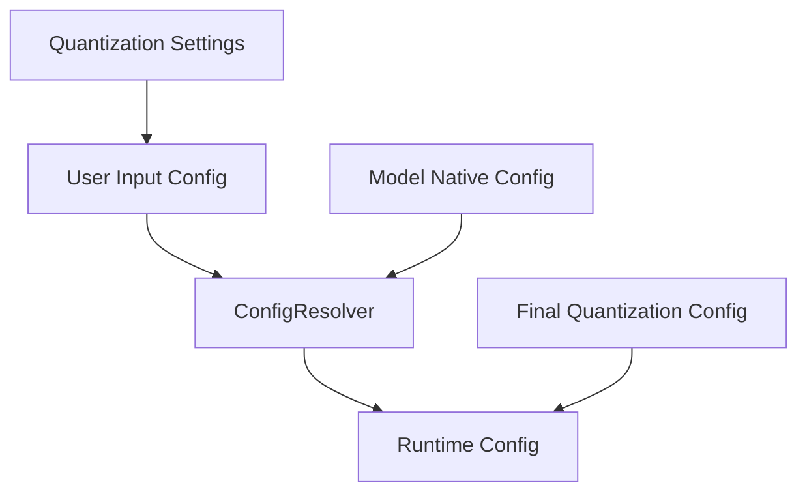
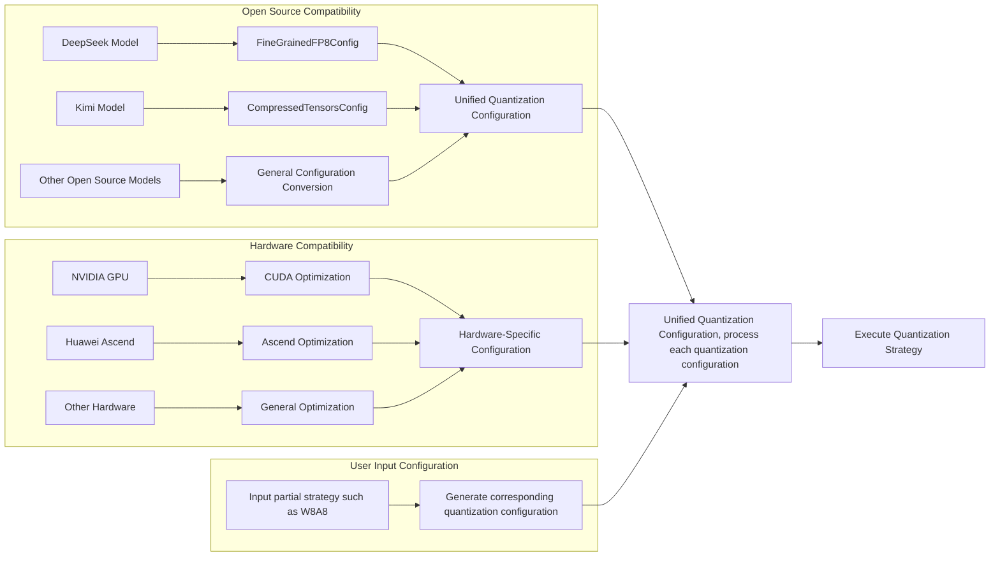
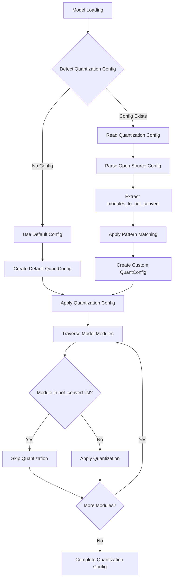
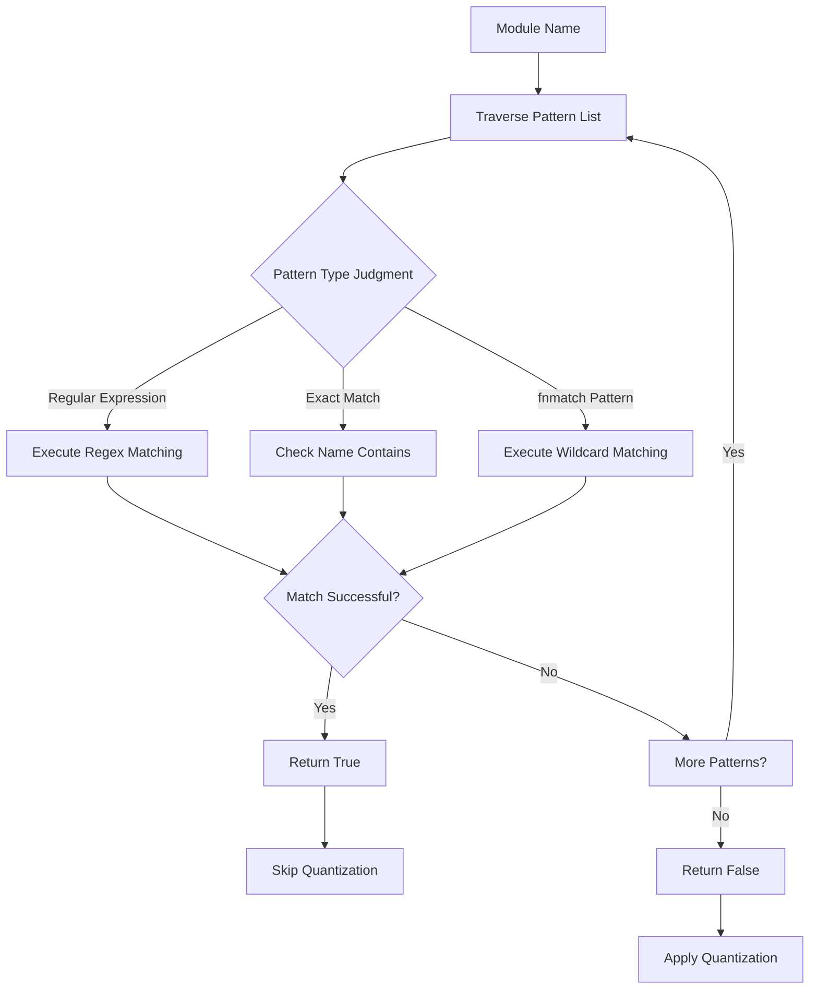

# RFC: Quantization Configuration System Optimization Proposal

## Metadata

| Item | Details |
|:-----|:--------|
| **Status** | Approved |
| **Author** | wqh17101 |
| **Creation Date** | 2025-12-19 |
| **Related Links** | [1. Optimize model and config loading logic 2. Add model_type support for mapping (remove model_id mapping later)](https://gitcode.com/Ascend/msit/pull/4845)<br/><br/>[Add Xiaomi model loading, fix reload config logic & adaptive LMHead addition & DT synchronization & optimize quantization logic](https://gitcode.com/Ascend/msit/pull/4880) |

---

## 1. Overview

This proposal aims to address the insufficient quantization configuration loading capabilities within the project. The solution focuses on optimizing the quantization configuration system, unifying quantization configurations from different sources, and maximizing the reuse of transformers library capabilities.

## 2. Detailed Design

- For quantization-related configurations, we need to extend the existing `QuantConfig` to unify quantization configurations from different sources, and `Quantizer` to implement various quantization functions.

### 2.1 Implementation Plan



#### 2.1.1 Quantization Configuration and Quantizer Class

We need to support loading open-source quantization configurations as well as Ascend-specific quantization configurations. Different quantization methods have their own quantizers, which leads to incompatible quantization configuration files. Therefore, we need to create a universal quantization class to parse various configurations and unify them into a common format.

Current open-source quantization configurations mainly include `FineGrainedFP8Config` and `CompressedTensors`.

##### 2.1.1.1 Quantization Scenarios



1. **Open Source Compatibility**:
   - Supports quantization configurations of mainstream open-source models
   - Provides configuration conversion tools
   - Designs APIs with reference to open-source standards

2. **Hardware Compatibility**:
   - Supports quantization features of different hardware platforms
   - Provides hardware-specific optimization options
   - Automatically detects hardware capabilities and adjusts configurations

##### 2.1.1.2 Quantization Process



The workflow of the pattern matching system is as follows:



### 2.2 Alternative Solutions

1. **Maintain Status Quo**: Continue managing quantization-related functions across various modules
   - **Disadvantages**: Will lead to more circular dependency issues, difficult to maintain and extend

2. **Use Inheritance Instead of Composition**: Extend quantization configuration functionality through inheritance
   - **Disadvantages**: Increases complexity of class hierarchy, less flexible

3. **Only Support Exact Name Matching**: Do not implement fnmatch and regular expression matching
   - **Disadvantages**: Limits flexibility of module exclusion functionality, cannot meet complex matching requirements

4. **Hardcode Exclusion List**: Hardcode exclusion list in code
   - **Disadvantages**: Lacks flexibility, difficult to adapt to different models and scenarios

### 2.3 Solution Analysis

#### Advantages of Proposed Solution

1. Solves circular dependency issues between modules, improving code quality
2. Provides flexible module exclusion mechanism supporting multiple matching patterns
3. Enhances support for open-source quantization configuration formats
4. Follows single responsibility principle, improving code maintainability
5. Adopts layered architecture design, facilitating extension and maintenance
6. Supports configuration-driven approach, enhancing system flexibility

#### Limitations of Proposed Solution

1. Requires updating existing quantization configuration usage patterns
2. Adds new modules, requiring corresponding documentation and training
3. Regular expression matching may have performance overhead
4. Requires large-scale refactoring of existing code

## 3. Implementation Plan

### General Quantization System Refactoring

- [x] Support reading open-source quantization configurations
- [ ] Extend QuantConfig class, add configuration conversion and caching functionality
- [ ] Extract Quantizer class
- [ ] Implement quantization strategy pattern
- [ ] Implement hardware adapter
- [ ] Implement configuration validation framework
- [ ] Integrate with existing system, modify logic

---

## 4. Software Implementation Design

### 4.1 Existing Code Analysis

Based on the analysis of the project code, the current quantization-related implementations are mainly distributed in the following modules:

| Module | File Path | Responsibility |
|:-------|:----------|:---------------|
| Quantization Configuration Class | `tensor_cast/model_config.py` | Defines `LinearQuantConfig`, `AttentionQuantConfig`, `QuantConfig` |
| Quantization Utilities | `tensor_cast/quantize_utils.py` | Defines quantization type enums, quantization granularity, quantization schemes |
| Quantization Linear Layer | `tensor_cast/layers/quant_linear.py` | Implements `QuantLinearBase` and `TensorCastQuantLinear` |
| Configuration Utilities | `tensor_cast/utils.py` | Implements pattern matching function `pattern_match` |
| Script Utilities | `tensor_cast/scripts/utils.py` | Provides `create_quant_config` and other configuration creation functions |
| Transformers Utilities | `tensor_cast/transformers/utils.py` | Loads open-source quantization configurations, extracts `modules_to_not_convert` |

### 4.2 QuantConfig Class Design (Optimized Version)

Extend the existing `QuantConfig` class, adding configuration conversion, caching, validation, and other functions to unify quantization configurations from different sources.

```python
@dataclasses.dataclass
class QuantConfig:
    """
    Unified quantization configuration class, supporting unified conversion from multiple quantization configuration sources

    Features:
    1. Support conversion from open-source quantization configurations (FineGrainedFP8Config, CompressedTensorsConfig)
    2. Support conversion from user input configurations
    3. Support hardware-specific optimization parameters
    4. Support pattern-based module exclusion mechanism (optimized: compiled regular expressions)
    5. Configuration query caching for improved performance
    6. Configuration validation functionality
    """

    # Linear layer quantization configuration mapping: module path pattern -> LinearQuantConfig
    linear_configs: Dict[str, LinearQuantConfig] = dataclasses.field(default_factory=dict)

    # Attention layer quantization configuration mapping: layer index -> AttentionQuantConfig
    attention_configs: Dict[int, AttentionQuantConfig] = dataclasses.field(default_factory=dict)

    # List of modules not to be quantized (supports regex, fnmatch patterns, exact matching)
    modules_to_not_convert: List[str] = dataclasses.field(default_factory=lambda: ["lm_head"])

    # Original quantization configuration (retained for debugging and compatibility)
    ori_quant_config: Optional[QuantizationConfigMixin] = None

    # Configuration cache for improved query performance
    _config_cache: Dict[str, Optional[LinearQuantConfig]] = dataclasses.field(
        default_factory=dict,
        init=False,
        repr=False
    )

    # Optimized pattern matcher
    _pattern_matcher: Optional[PatternMatcher] = dataclasses.field(
        default=None,
        init=False,
        repr=False
    )

    def __post_init__(self):
        if self.modules_to_not_convert is None:
            self.modules_to_not_convert = ["lm_head"]
        self._pattern_matcher = PatternMatcher(self.modules_to_not_convert)

    @classmethod
    def from_hf_quant_config(
        cls,
        hf_quant_config: QuantizationConfigMixin
    ) -> "QuantConfig":
        """
        Create QuantConfig from HuggingFace quantization configuration

        Args:
            hf_quant_config: HuggingFace quantization configuration instance

        Returns:
            QuantConfig instance
        """
        config = cls()
        config.ori_quant_config = hf_quant_config

        # Extract modules_to_not_convert
        config.modules_to_not_convert = get_modules_to_not_convert(hf_quant_config)

        # Convert based on different configuration types
        if isinstance(hf_quant_config, FineGrainedFP8Config):
            config._from_fine_grained_fp8(hf_quant_config)
        elif isinstance(hf_quant_config, CompressedTensorsConfig):
            config._from_compressed_tensors(hf_quant_config)
        else:
            config._from_generic(hf_quant_config)

        return config

    @classmethod
    def from_user_input(
        cls,
        quantize_linear_action: QuantizeLinearAction,
        quantize_lmhead: bool = False,
        quantize_attention_action: QuantizeAttentionAction = QuantizeAttentionAction.DISABLED,
        **kwargs
    ) -> "QuantConfig":
        """
        Create QuantConfig from user input

        Args:
            quantize_linear_action: Linear layer quantization action
            quantize_lmhead: Whether to quantize lm_head
            quantize_attention_action: Attention layer quantization action
            **kwargs: Other quantization parameters

        Returns:
            QuantConfig instance
        """
        quant_config = create_quant_config(
            quantize_linear_action,
            quantize_lmhead=quantize_lmhead,
            quantize_attention_action=quantize_attention_action,
            **kwargs
        )
        return cls(
            linear_configs=quant_config.linear_configs,
            attention_configs=quant_config.attention_configs,
            modules_to_not_convert=quant_config.modules_to_not_convert
        )

    def _from_fine_grained_fp8(self, config: FineGrainedFP8Config):
        """Convert from FineGrainedFP8Config"""
        self.linear_configs["layers.*"] = LinearQuantConfig(
            quant_type=LinearQuantType.FP8,
            weight_scale=torch.tensor(1.0),
        )

    def _from_compressed_tensors(self, config: CompressedTensorsConfig):
        """Convert from CompressedTensorsConfig"""
        quant_scheme = config.quantization_config.scheme
        if quant_scheme == "w8a8":
            self.linear_configs["layers.*"] = LinearQuantConfig(
                quant_type=LinearQuantType.W8A8,
                weight_scale=torch.tensor(1.0),
            )
        elif quant_scheme == "fp8":
            self.linear_configs["layers.*"] = LinearQuantConfig(
                quant_type=LinearQuantType.FP8,
                weight_scale=torch.tensor(1.0),
            )

    def _from_generic(self, config: QuantizationConfigMixin):
        """Generic conversion logic"""
        pass

    def should_skip_module(self, module_name: str) -> bool:
        """
        Determine whether a module should skip quantization (optimized: use compiled pattern matcher)

        Args:
            module_name: Module name

        Returns:
            True to skip quantization, False to apply quantization
        """
        return self._pattern_matcher.match(module_name)

    def get_linear_config(self, module_name: str) -> Optional[LinearQuantConfig]:
        """
        Get linear quantization configuration for a specific module (optimized: with caching)

        Args:
            module_name: Module name

        Returns:
            Matched LinearQuantConfig, or None if no match
        """
        if module_name in self._config_cache:
            return self._config_cache[module_name]

        for pattern, config in self.linear_configs.items():
            if pattern_match(module_name, [pattern]):
                self._config_cache[module_name] = config
                return config

        self._config_cache[module_name] = None
        return None

    def get_attention_config(self, layer_idx: int) -> Optional[AttentionQuantConfig]:
        """
        Get attention quantization configuration for a specific layer

        Args:
            layer_idx: Layer index

        Returns:
            AttentionQuantConfig, or None if no configuration
        """
        return self.attention_configs.get(layer_idx)

    def validate(self, hardware_adapter: HardwareAdapter) -> Tuple[bool, List[str]]:
        """
        Validate quantization configuration

        Args:
            hardware_adapter: Hardware adapter

        Returns:
            (is_valid, error_messages)
        """
        validator = ConfigValidator(hardware_adapter)
        all_errors = []

        for pattern, config in self.linear_configs.items():
            is_valid, errors = validator.validate_linear_config(config)
            if not is_valid:
                all_errors.extend([f"Pattern '{pattern}': {e}" for e in errors])

        for layer_idx, config in self.attention_configs.items():
            is_valid, errors = validator.validate_attention_config(config)
            if not is_valid:
                all_errors.extend([f"Layer {layer_idx}: {e}" for e in errors])

        return len(all_errors) == 0, all_errors
```

### 4.3 Quantization Strategy Pattern

Introduce quantization strategy abstraction, using the strategy pattern to implement extensions for different quantization methods.

```python
class QuantizationStrategy(ABC):
    """
    Quantization strategy abstract base class
    """

    @abstractmethod
    def get_quant_type(self) -> LinearQuantType:
        """Get quantization type"""
        pass

    @abstractmethod
    def validate_config(self, config: LinearQuantConfig) -> bool:
        """Validate configuration validity"""
        pass

    @abstractmethod
    def get_weight_dtype(self) -> torch.dtype:
        """Get weight data type"""
        pass

    @abstractmethod
    def get_activation_dtype(self) -> Optional[torch.dtype]:
        """Get activation data type"""
        pass


class W8A8Strategy(QuantizationStrategy):
    """W8A8 quantization strategy"""

    def get_quant_type(self) -> LinearQuantType:
        return LinearQuantType.W8A8

    def validate_config(self, config: LinearQuantConfig) -> bool:
        return config.quant_type == LinearQuantType.W8A8

    def get_weight_dtype(self) -> torch.dtype:
        return torch.int8

    def get_activation_dtype(self) -> Optional[torch.dtype]:
        return torch.int8


class FP8Strategy(QuantizationStrategy):
    """FP8 quantization strategy"""

    def get_quant_type(self) -> LinearQuantType:
        return LinearQuantType.FP8

    def validate_config(self, config: LinearQuantConfig) -> bool:
        if config.quant_type != LinearQuantType.FP8:
            return False
        if config.dynamic_quant_scheme != QuantScheme.SYMMETRIC:
            return False
        if config.activation_scale is not None:
            return False
        return True

    def get_weight_dtype(self) -> torch.dtype:
        return DTYPE_FP8

    def get_activation_dtype(self) -> Optional[torch.dtype]:
        return DTYPE_FP8


class QuantizationStrategyRegistry:
    """Quantization strategy registry"""

    _strategies: Dict[LinearQuantType, QuantizationStrategy] = {}

    @classmethod
    def register(cls, strategy: QuantizationStrategy):
        """Register quantization strategy"""
        cls._strategies[strategy.get_quant_type()] = strategy

    @classmethod
    def get(cls, quant_type: LinearQuantType) -> Optional[QuantizationStrategy]:
        """Get quantization strategy"""
        return cls._strategies.get(quant_type)


# Register default strategies
QuantizationStrategyRegistry.register(W8A8Strategy())
QuantizationStrategyRegistry.register(FP8Strategy())
```

### 4.4 Pattern Matching Optimization

Implement a high-performance pattern matcher, compiling regular expressions, using exact matching and fnmatch patterns.

```python
import re
from typing import List, Pattern


class PatternMatcher:
    """
    High-performance pattern matcher
    """

    def __init__(self, patterns: List[str]):
        self.patterns = patterns
        self._compiled_regex: List[Pattern] = []
        self._exact_matches: set = set()
        self._fnmatch_patterns: List[str] = []

        self._compile_patterns()

    def _compile_patterns(self):
        """Compile patterns"""
        for pattern in self.patterns:
            if pattern.startswith("re:"):
                regex_pattern = pattern[3:]
                self._compiled_regex.append(re.compile(regex_pattern))
            elif any(c in pattern for c in "*?[]"):
                self._fnmatch_patterns.append(pattern)
            else:
                self._exact_matches.add(pattern)

    def match(self, name: str) -> bool:
        """Match module name"""
        # Exact match (fastest)
        if name in self._exact_matches:
            return True

        # Regular expression match
        for regex in self._compiled_regex:
            if regex.match(name):
                return True

        # fnmatch pattern match
        for pattern in self._fnmatch_patterns:
            if fnmatch.fnmatch(name, pattern):
                return True

        return False
```

### 4.5 Hardware Adapter

Implement hardware adapter abstraction to support quantization features of different hardware platforms.

```python
@dataclasses.dataclass
class HardwareCapabilities:
    """Hardware capabilities description"""
    supports_fp8: bool = False
    supports_fp4: bool = False
    supports_int8: bool = True
    supports_int4: bool = True
    max_group_size: int = 128
    supports_dynamic_quantization: bool = True
    supports_static_quantization: bool = True


class HardwareAdapter(ABC):
    """
    Hardware adapter abstract base class
    """

    @abstractmethod
    def get_capabilities(self) -> HardwareCapabilities:
        """Get hardware capabilities"""
        pass

    @abstractmethod
    def get_optimized_quant_config(
        self,
        base_config: LinearQuantConfig
    ) -> LinearQuantConfig:
        """Get hardware-optimized quantization configuration"""
        pass

    @abstractmethod
    def is_supported(self, quant_type: LinearQuantType) -> bool:
        """Check if specified quantization type is supported"""
        pass


class AscendHardwareAdapter(HardwareAdapter):
    """Ascend hardware adapter"""

    def __init__(self):
        self._capabilities = HardwareCapabilities(
            supports_fp8=True,
            supports_fp4=True,
            supports_int8=True,
            supports_int4=True,
            max_group_size=128,
            supports_dynamic_quantization=True,
            supports_static_quantization=True
        )

    def get_capabilities(self) -> HardwareCapabilities:
        return self._capabilities

    def get_optimized_quant_config(
        self,
        base_config: LinearQuantConfig
    ) -> LinearQuantConfig:
        """Get Ascend-optimized quantization configuration"""
        optimized_config = dataclasses.replace(base_config)
        if optimized_config.weight_group_size is not None:
            optimized_config.weight_group_size = min(
                optimized_config.weight_group_size,
                self._capabilities.max_group_size
            )
        return optimized_config

    def is_supported(self, quant_type: LinearQuantType) -> bool:
        if quant_type == LinearQuantType.FP8:
            return self._capabilities.supports_fp8
        elif quant_type == LinearQuantType.MXFP4:
            return self._capabilities.supports_fp4
        elif quant_type in (LinearQuantType.W8A8, LinearQuantType.W8A16):
            return self._capabilities.supports_int8
        elif quant_type == LinearQuantType.W4A8:
            return self._capabilities.supports_int4
        return False


class CudaHardwareAdapter(HardwareAdapter):
    """CUDA hardware adapter"""

    def __init__(self):
        self._capabilities = HardwareCapabilities(
            supports_fp8=True,
            supports_fp4=False,
            supports_int8=True,
            supports_int4=True,
            max_group_size=64,
            supports_dynamic_quantization=True,
            supports_static_quantization=True
        )

    def get_capabilities(self) -> HardwareCapabilities:
        return self._capabilities

    def get_optimized_quant_config(
        self,
        base_config: LinearQuantConfig
    ) -> LinearQuantConfig:
        """Get CUDA-optimized quantization configuration"""
        optimized_config = dataclasses.replace(base_config)
        if optimized_config.weight_group_size is not None:
            optimized_config.weight_group_size = min(
                optimized_config.weight_group_size,
                self._capabilities.max_group_size
            )
        return optimized_config

    def is_supported(self, quant_type: LinearQuantType) -> bool:
        if quant_type == LinearQuantType.FP8:
            return self._capabilities.supports_fp8
        elif quant_type == LinearQuantType.MXFP4:
            return self._capabilities.supports_fp4
        elif quant_type in (LinearQuantType.W8A8, LinearQuantType.W8A16):
            return self._capabilities.supports_int8
        elif quant_type == LinearQuantType.W4A8:
            return self._capabilities.supports_int4
        return False


def detect_hardware() -> HardwareAdapter:
    """Automatically detect hardware and return corresponding adapter"""
    import torch
    if torch.cuda.is_available():
        if hasattr(torch, 'npu') and torch.npu.is_available():
            return AscendHardwareAdapter()
        else:
            return CudaHardwareAdapter()
    else:
        return CudaHardwareAdapter()
```

### 4.6 Configuration Validation Framework

Implement a unified configuration validation framework to detect configuration issues early.

```python
class ConfigValidator:
    """
    Configuration validator
    """

    def __init__(self, hardware_adapter: HardwareAdapter):
        self._hardware_adapter = hardware_adapter
        self._strategy_registry = QuantizationStrategyRegistry

    def validate_linear_config(
        self,
        config: LinearQuantConfig
    ) -> Tuple[bool, List[str]]:
        """
        Validate linear quantization configuration

        Returns:
            (is_valid, error_messages)
        """
        errors = []

        # Check if quantization type is supported by hardware
        if not self._hardware_adapter.is_supported(config.quant_type):
            errors.append(
                f"Quantization type {config.quant_type} is not supported by the hardware"
            )

        # Use strategy to validate configuration
        strategy = self._strategy_registry.get(config.quant_type)
        if strategy is not None:
            if not strategy.validate_config(config):
                errors.append(
                    f"Invalid configuration for quantization type {config.quant_type}"
                )

        # Check group_size
        if config.weight_quant_granularity == QuantGranularity.PER_GROUP:
            if config.weight_group_size is None:
                errors.append(
                    "weight_group_size must be provided for PER_GROUP granularity"
                )
            elif config.weight_group_size > self._hardware_adapter.get_capabilities().max_group_size:
                errors.append(
                    f"weight_group_size {config.weight_group_size} exceeds hardware limit "
                    f"{self._hardware_adapter.get_capabilities().max_group_size}"
                )

        return len(errors) == 0, errors

    def validate_attention_config(
        self,
        config: AttentionQuantConfig
    ) -> Tuple[bool, List[str]]:
        """
        Validate attention quantization configuration

        Returns:
            (is_valid, error_messages)
        """
        errors = []

        if config.quant_type == AttentionQuantType.INT8:
            if config.kv_scale is None:
                errors.append("kv_scale must be provided for INT8 quantization")
        else:
            errors.append(f"Unsupported attention quant type {config.quant_type}")

        return len(errors) == 0, errors
```

### 4.7 Quantizer Class Design

`Quantizer` serves as the quantization engine, responsible for executing actual quantization operations.

```python
class Quantizer:
    """
    Quantization engine, responsible for executing model quantization operations

    Features:
    1. Supports multiple quantization schemes (W8A8, W4A8, FP8, MXFP4, etc.)
    2. Supports dynamic and static quantization
    3. Supports pattern-based module exclusion
    4. Supports hardware-specific optimizations
    """

    def __init__(
        self,
        quant_config: QuantConfig,
        quant_linear_cls: Type[QuantLinearBase] = TensorCastQuantLinear,
        hardware_config: Optional[Dict[str, Any]] = None
    ):
        """
        Initialize Quantizer

        Args:
            quant_config: Quantization configuration
            quant_linear_cls: Quantized linear layer class
            hardware_config: Hardware configuration
        """
        self.quant_config = quant_config
        self.quant_linear_cls = quant_linear_cls
        self.hardware_config = hardware_config or {}

    def quantize_model(self, model: torch.nn.Module) -> torch.nn.Module:
        """
        Quantize the model

        Args:
            model: Model to be quantized

        Returns:
            Quantized model
        """
        for name, module in model.named_modules():
            if self.quant_config.should_skip_module(name):
                continue

            if isinstance(module, torch.nn.Linear):
                linear_config = self.quant_config.get_linear_config(name)
                if linear_config is not None:
                    quantized_module = self.quant_linear_cls(module, linear_config)
                    self._replace_module(model, name, quantized_module)

        return model

    def quantize_attention(self, model: torch.nn.Module) -> torch.nn.Module:
        """
        Quantize attention layers

        Args:
            model: Model to be quantized

        Returns:
            Quantized model
        """
        for layer_idx in range(self._get_num_layers(model)):
            attn_config = self.quant_config.get_attention_config(layer_idx)
            if attn_config is not None:
                self._apply_attention_quantization(model, layer_idx, attn_config)

        return model

    def _replace_module(
        self,
        model: torch.nn.Module,
        module_name: str,
        new_module: torch.nn.Module
    ):
        """Replace module in model"""
        parts = module_name.split(".")
        current = model
        for part in parts[:-1]:
            current = getattr(current, part)
        setattr(current, parts[-1], new_module)

    def _get_num_layers(self, model: torch.nn.Module) -> int:
        """Get number of layers in model"""
        if hasattr(model, "config"):
            return getattr(model.config, "num_hidden_layers", 0)
        return 0

    def _apply_attention_quantization(
        self,
        model: torch.nn.Module,
        layer_idx: int,
        attn_config: AttentionQuantConfig
    ):
        """Apply attention quantization configuration"""
        pass
```

### 4.8 ConfigResolver Configuration Parser Design

`ConfigResolver` is responsible for parsing and merging configurations from different sources.

```python
class ConfigResolver:
    """
    Configuration parser, responsible for parsing and merging configurations from different sources

    Features:
    1. Parse user input configurations
    2. Parse model native configurations
    3. Merge configurations and resolve conflicts
    4. Generate final runtime configuration
    """

    def __init__(self):
        self.user_input_config: Optional[UserInputConfig] = None
        self.model_native_config: Optional[ModelNativeConfig] = None
        self.runtime_config: Optional[RuntimeConfig] = None

    def resolve(
        self,
        user_input: Optional[Dict[str, Any]] = None,
        model_id: Optional[str] = None,
        hf_config: Optional[PretrainedConfig] = None
    ) -> RuntimeConfig:
        """
        Parse configuration and generate runtime configuration

        Args:
            user_input: User input configuration
            model_id: Model ID
            hf_config: HuggingFace configuration

        Returns:
            Runtime configuration
        """
        # Parse user input configuration
        if user_input is not None:
            self.user_input_config = self._parse_user_input(user_input)

        # Parse model native configuration
        if hf_config is not None:
            self.model_native_config = self._parse_model_native_config(hf_config)
        elif model_id is not None:
            self.model_native_config = self._load_model_config(model_id)

        # Merge configurations
        self.runtime_config = self._merge_configs()

        return self.runtime_config

    def _parse_user_input(self, user_input: Dict[str, Any]) -> UserInputConfig:
        """Parse user input configuration"""
        return UserInputConfig(
            quantize_linear_action=user_input.get("quantize_linear_action"),
            quantize_lmhead=user_input.get("quantize_lmhead", False),
            quantize_attention_action=user_input.get("quantize_attention_action"),
            **user_input.get("quantization_kwargs", {})
        )

    def _parse_model_native_config(
        self,
        hf_config: PretrainedConfig
    ) -> ModelNativeConfig:
        """Parse model native configuration"""
        quant_config = None
        if hasattr(hf_config, "quantization_config") and hf_config.quantization_config:
            quant_config = AutoQuantizationConfig.from_dict(
                hf_config.quantization_config
            )

        return ModelNativeConfig(
            hf_config=hf_config,
            quant_config=quant_config
        )

    def _load_model_config(self, model_id: str) -> ModelNativeConfig:
        """Load model configuration"""
        auto_loader = AutoModelConfigLoader()
        hf_config = auto_loader.load_config(model_id)
        return self._parse_model_native_config(hf_config)

    def _merge_configs(self) -> RuntimeConfig:
        """
        Merge configurations

        Priority: User input configuration > Model native configuration > Default configuration
        """
        # If user specified quantization configuration, use user configuration
        if self.user_input_config and self.user_input_config.has_quantization():
            quant_config = QuantConfig.from_user_input(
                quantize_linear_action=self.user_input_config.quantize_linear_action,
                quantize_lmhead=self.user_input_config.quantize_lmhead,
                quantize_attention_action=self.user_input_config.quantize_attention_action,
                **self.user_input_config.quantization_kwargs
            )
        # Otherwise use model native configuration
        elif self.model_native_config and self.model_native_config.quant_config:
            quant_config = QuantConfig.from_hf_quant_config(
                self.model_native_config.quant_config
            )
        # Use default configuration
        else:
            quant_config = QuantConfig()

        return RuntimeConfig(quant_config=quant_config)


@dataclasses.dataclass
class UserInputConfig:
    """User input configuration"""
    quantize_linear_action: Optional[QuantizeLinearAction] = None
    quantize_lmhead: bool = False
    quantize_attention_action: Optional[QuantizeAttentionAction] = None
    quantization_kwargs: Dict[str, Any] = dataclasses.field(default_factory=dict)

    def has_quantization(self) -> bool:
        """Check if there is quantization configuration"""
        return (
            self.quantize_linear_action is not None
            or self.quantize_attention_action is not None
        )


@dataclasses.dataclass
class ModelNativeConfig:
    """Model native configuration"""
    hf_config: PretrainedConfig
    quant_config: Optional[QuantizationConfigMixin] = None


@dataclasses.dataclass
class RuntimeConfig:
    """Runtime configuration"""
    quant_config: QuantConfig
```

### 4.9 Integration with Existing System

#### 4.9.1 Update `create_quant_config` Function

```python
def create_quant_config(
    quantize_linear_action: QuantizeLinearAction = QuantizeLinearAction.DISABLED,
    quantize_lmhead: bool = False,
    quantize_attention_action: QuantizeAttentionAction = QuantizeAttentionAction.DISABLED,
    **kwargs,
) -> QuantConfig:
    """
    Create quantization configuration (updated to return QuantConfig)

    Args:
        quantize_linear_action: Linear layer quantization action
        quantize_lmhead: Whether to quantize lm_head
        quantize_attention_action: Attention layer quantization action
        **kwargs: Other quantization parameters

    Returns:
        QuantConfig instance
    """
    return QuantConfig.from_user_input(
        quantize_linear_action=quantize_linear_action,
        quantize_lmhead=quantize_lmhead,
        quantize_attention_action=quantize_attention_action,
        **kwargs
    )
```

#### 4.9.2 Update `get_modules_to_not_convert` Function

```python
def get_modules_to_not_convert(
    quant_config: QuantizationConfigMixin,
) -> List[Optional[str]]:
    """
    Extract list of modules not to be quantized from quantization configuration

    Args:
        quant_config: HuggingFace quantization configuration instance

    Returns:
        List of modules not to be quantized
    """
    modules_to_not_convert = []
    if isinstance(quant_config, FineGrainedFP8Config):
        modules_to_not_convert = quant_config.modules_to_not_convert
    elif isinstance(quant_config, CompressedTensorsConfig):
        modules_to_not_convert = quant_config.quantization_config.ignore
    return modules_to_not_convert
```

### 4.10 Usage Examples

```python
# Example 1: Create quantization configuration from user input
quant_config = QuantConfig.from_user_input(
    quantize_linear_action=QuantizeLinearAction.W8A8_DYNAMIC,
    quantize_lmhead=True,
    quantize_attention_action=QuantizeAttentionAction.INT8
)

# Example 2: Create quantization configuration from HuggingFace configuration
auto_loader = AutoModelConfigLoader()
hf_config = auto_loader.load_config("deepseek-ai/DeepSeek-V3.1")
quant_config = QuantConfig.from_hf_quant_config(hf_config.quantization_config)

# Example 3: Use ConfigResolver to parse configuration
resolver = ConfigResolver()
runtime_config = resolver.resolve(
    user_input={
        "quantize_linear_action": "W8A8_DYNAMIC",
        "quantize_lmhead": True
    },
    model_id="deepseek-ai/DeepSeek-V3.1"
)

# Example 4: Use hardware adapter to automatically optimize configuration
hardware_adapter = detect_hardware()
quant_config = QuantConfig.from_user_input(
    quantize_linear_action=QuantizeLinearAction.W8A8_DYNAMIC,
    quantize_lmhead=True
)

# Apply hardware optimization
for pattern, config in quant_config.linear_configs.items():
    optimized_config = hardware_adapter.get_optimized_quant_config(config)
    quant_config.linear_configs[pattern] = optimized_config

# Validate configuration
is_valid, errors = quant_config.validate(hardware_adapter)
if not is_valid:
    raise ValueError(f"Invalid quantization config: {errors}")

# Example 5: Use Quantizer to quantize model
quantizer = Quantizer(runtime_config.quant_config)
quantized_model = quantizer.quantize_model(model)

# Example 6: Use strategy pattern to extend new quantization types
class CustomQuantStrategy(QuantizationStrategy):
    """Custom quantization strategy"""

    def get_quant_type(self) -> LinearQuantType:
        return LinearQuantType.CUSTOM

    def validate_config(self, config: LinearQuantConfig) -> bool:
        return True

    def get_weight_dtype(self) -> torch.dtype:
        return torch.int8

    def get_activation_dtype(self) -> Optional[torch.dtype]:
        return None

# Register custom strategy
QuantizationStrategyRegistry.register(CustomQuantStrategy())

# Example 7: Use optimized pattern matching
quant_config = QuantConfig()
quant_config.modules_to_not_convert = [
    "lm_head",
    "re:.*shared_experts.*",
    "*.gate"
]

# Pattern matching will automatically compile and optimize
if quant_config.should_skip_module("model.layers.0.mlp.gate"):
    print("Skip quantization")
```

## 5. Summary

Through the above optimized design, the quantization configuration system will achieve the following improvements:

1. **Architecture Optimization**:
   - Extend existing `QuantConfig` class, avoiding creation of new configuration classes
   - Introduce strategy pattern to improve extensibility
   - Clear separation of responsibilities

2. **Performance Optimization**:
   - Compile regular expressions to improve pattern matching speed
   - Configuration query caching to reduce redundant computation
   - Hardware adapter to automatically optimize configurations

3. **Interface Optimization**:
   - Hardware capability abstraction to support multiple hardware platforms
   - Configuration validation framework to detect issues early
   - Type safety to reduce runtime errors

These optimizations will make the quantization configuration system more robust, efficient, and maintainable.
