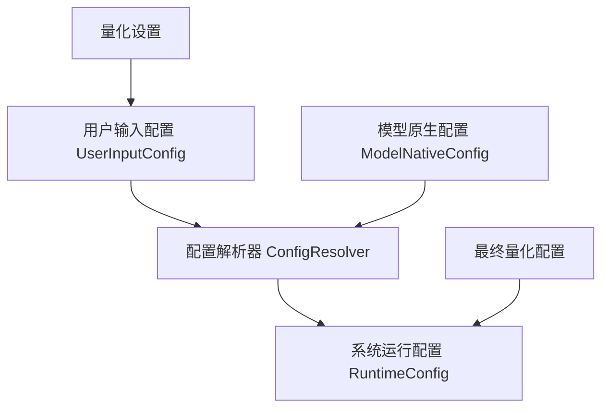
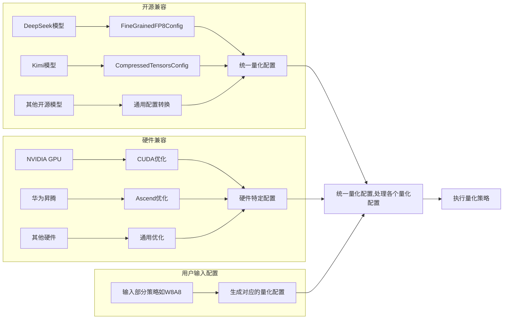
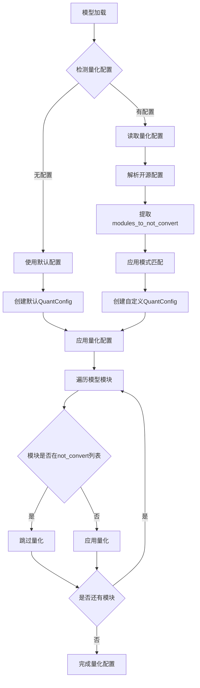
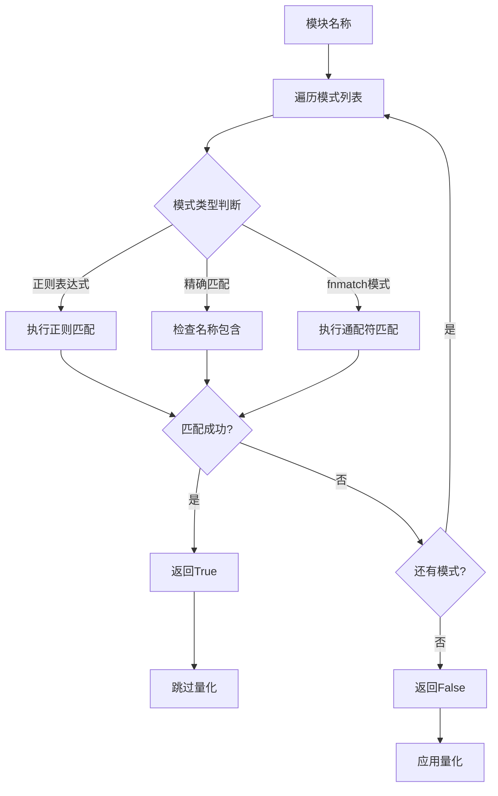

# RFC: 量化配置系统优化方案

## 元数据

| 项目 | 内容 |
|:-----|:--------|
| **状态** | 已批准 |
| **作者** | wqh17101 |
| **创建日期** | 2025-12-19 |
| **相关链接** | [1.优化模型和配置加载逻辑 2.映射增加model_type支持（后续移除model_id的映射）](https://gitcode.com/Ascend/msit/pull/4845)<br/><br/>[增加小米模型加载，修正reload config逻辑&自适应增加LMHead & DT 同步适配&优化量化逻辑](https://gitcode.com/Ascend/msit/pull/4880) |

---

## 1. 概述

本提案旨在解决项目中的量化配置加载能力不足的问题。方案专注于优化量化配置系统，统一不同来源的量化配置，并最大化复用transformers库的能力。

## 2. 详细设计

- 对于量化相关的配置，我们需要扩展现有的`QuantConfig`来统一不同来源的量化配置，以及`Quantizer`来实现各种量化功能。

### 2.1 实现方案



#### 2.1.1 量化配置与量化类

我们需要支持加载开源的量化配置以及昇腾特有的量化配置。不同的量化方法有自己的quantizer，这就导致各自的量化配置文件无法统一，因此我们需要扩展现有的`QuantConfig`类来解析各种不同的配置，并将它们统一成一个公共格式。

当前开源的量化配置主要包括`FineGrainedFP8Config`和`CompressedTensors`。

##### 2.1.1.1 量化场景



1. **开源兼容**：
   - 支持主流开源模型的量化配置
   - 提供配置转换工具
   - 参考开源标准设计API

2. **硬件兼容**：
   - 支持不同硬件平台的量化特性
   - 提供硬件特定的优化选项
   - 自动检测硬件能力并调整配置

##### 2.1.1.2 量化流程



模式匹配系统的工作流程如下：



### 2.2 替代方案

1. **保持现状**：继续在各个模块中分散管理量化相关功能
   - **缺点**：会导致更多的循环依赖问题，难以维护和扩展

2. **使用继承而非组合**：通过继承的方式扩展量化配置功能
   - **缺点**：增加了类层次结构的复杂性，不够灵活

3. **仅支持精确名称匹配**：不实现fnmatch和正则表达式匹配
   - **缺点**：限制了模块排除功能的灵活性，无法满足复杂的匹配需求

4. **硬编码排除列表**：将排除列表硬编码在代码中
   - **缺点**：缺乏灵活性，难以适应不同的模型和场景

### 2.3 方案分析

#### 主推方案优点

1. 解决了模块间的循环依赖问题，提高了代码质量
2. 提供了灵活的模块排除机制，支持多种匹配模式
3. 增强了对开源量化配置格式的支持
4. 遵循单一职责原则，提高了代码的可维护性
5. 采用分层架构设计，便于扩展和维护
6. 支持配置驱动，提高了系统的灵活性

#### 主推方案局限性

1. 需要更新现有的量化配置使用方式
2. 增加了新的模块，需要相应的文档和培训
3. 正则表达式匹配可能存在性能开销
4. 需要对现有代码进行较大规模的重构

## 3. 实施计划

### 通用量化系统改造

- [x] 支持读取开源的量化配置
- [ ] 扩展 QuantConfig 类，添加配置转换和缓存功能
- [ ] 抽取 Quantizer 类
- [ ] 实现量化策略模式
- [ ] 实现硬件适配器
- [ ] 实现配置验证框架
- [ ] 对接现有系统，修改逻辑

---

## 4. 软件实现设计

### 4.1 现有代码分析

基于对项目代码的分析，当前量化相关实现主要分布在以下模块：

| 模块 | 文件路径 | 职责 |
|:-----|:---------|:-----|
| 量化配置类 | `tensor_cast/model_config.py` | 定义`LinearQuantConfig`、`AttentionQuantConfig`、`QuantConfig` |
| 量化工具 | `tensor_cast/quantize_utils.py` | 定义量化类型枚举、量化粒度、量化方案 |
| 量化线性层 | `tensor_cast/layers/quant_linear.py` | 实现`QuantLinearBase`和`TensorCastQuantLinear` |
| 配置工具 | `tensor_cast/utils.py` | 实现模式匹配函数`pattern_match` |
| 量化配置工具 | `tensor_cast/core/quantization/config.py` | 提供`create_quant_config`等配置创建函数 |
| Transformers工具 | `tensor_cast/transformers/utils.py` | 加载开源量化配置，提取`modules_to_not_convert` |

### 4.2 QuantConfig类设计（优化版）

扩展现有的`QuantConfig`类，添加配置转换、缓存、验证等功能，统一不同来源的量化配置。

```python
@dataclasses.dataclass
class QuantConfig:
    """
    统一量化配置类，支持多种量化配置来源的统一转换

    功能特性：
    1. 支持从开源量化配置（FineGrainedFP8Config、CompressedTensorsConfig）转换
    2. 支持从用户输入配置转换
    3. 支持硬件特定的优化参数
    4. 支持基于模式匹配的模块排除机制（优化：编译正则表达式）
    5. 配置查询缓存，提升性能
    6. 配置验证功能
    """

    # 线性层量化配置映射：模块路径模式 -> LinearQuantConfig
    linear_configs: Dict[str, LinearQuantConfig] = dataclasses.field(default_factory=dict)

    # 注意力层量化配置映射：层索引 -> AttentionQuantConfig
    attention_configs: Dict[int, AttentionQuantConfig] = dataclasses.field(default_factory=dict)

    # 不需要量化的模块列表（支持正则表达式、fnmatch模式、精确匹配）
    modules_to_not_convert: List[str] = dataclasses.field(default_factory=lambda: ["lm_head"])

    # 原始量化配置（保留原始配置用于调试和兼容性）
    ori_quant_config: Optional[QuantizationConfigMixin] = None

    # 配置缓存，提升查询性能
    _config_cache: Dict[str, Optional[LinearQuantConfig]] = dataclasses.field(
        default_factory=dict,
        init=False,
        repr=False
    )

    # 优化的模式匹配器
    _pattern_matcher: Optional[PatternMatcher] = dataclasses.field(
        default=None,
        init=False,
        repr=False
    )

    def __post_init__(self):
        if self.modules_to_not_convert is None:
            self.modules_to_not_convert = ["lm_head"]
        self._pattern_matcher = PatternMatcher(self.modules_to_not_convert)

    @classmethod
    def from_hf_quant_config(
        cls,
        hf_quant_config: QuantizationConfigMixin
    ) -> "QuantConfig":
        """
        从HuggingFace量化配置创建QuantConfig

        Args:
            hf_quant_config: HuggingFace量化配置实例

        Returns:
            QuantConfig实例
        """
        config = cls()
        config.ori_quant_config = hf_quant_config

        # 提取modules_to_not_convert
        config.modules_to_not_convert = get_modules_to_not_convert(hf_quant_config)

        # 根据不同配置类型进行转换
        if isinstance(hf_quant_config, FineGrainedFP8Config):
            config._from_fine_grained_fp8(hf_quant_config)
        elif isinstance(hf_quant_config, CompressedTensorsConfig):
            config._from_compressed_tensors(hf_quant_config)
        else:
            config._from_generic(hf_quant_config)

        return config

    @classmethod
    def from_user_input(
        cls,
        quantize_linear_action: QuantizeLinearAction,
        quantize_lmhead: bool = False,
        quantize_attention_action: QuantizeAttentionAction = QuantizeAttentionAction.DISABLED,
        **kwargs
    ) -> "QuantConfig":
        """
        从用户输入创建QuantConfig

        Args:
            quantize_linear_action: 线性层量化动作
            quantize_lmhead: 是否量化lm_head
            quantize_attention_action: 注意力层量化动作
            **kwargs: 其他量化参数

        Returns:
            QuantConfig实例
        """
        quant_config = create_quant_config(
            quantize_linear_action,
            quantize_lmhead=quantize_lmhead,
            quantize_attention_action=quantize_attention_action,
            **kwargs
        )
        return cls(
            linear_configs=quant_config.linear_configs,
            attention_configs=quant_config.attention_configs,
            modules_to_not_convert=quant_config.modules_to_not_convert
        )

    def _from_fine_grained_fp8(self, config: FineGrainedFP8Config):
        """从FineGrainedFP8Config转换"""
        self.linear_configs["layers.*"] = LinearQuantConfig(
            quant_type=LinearQuantType.FP8,
            weight_scale=torch.tensor(1.0),
        )

    def _from_compressed_tensors(self, config: CompressedTensorsConfig):
        """从CompressedTensorsConfig转换"""
        quant_scheme = config.quantization_config.scheme
        if quant_scheme == "w8a8":
            self.linear_configs["layers.*"] = LinearQuantConfig(
                quant_type=LinearQuantType.W8A8,
                weight_scale=torch.tensor(1.0),
            )
        elif quant_scheme == "fp8":
            self.linear_configs["layers.*"] = LinearQuantConfig(
                quant_type=LinearQuantType.FP8,
                weight_scale=torch.tensor(1.0),
            )

    def _from_generic(self, config: QuantizationConfigMixin):
        """通用转换逻辑"""
        pass

    def should_skip_module(self, module_name: str) -> bool:
        """
        判断模块是否应该跳过量化（优化：使用编译后的模式匹配器）

        Args:
            module_name: 模块名称

        Returns:
            True表示跳过量化，False表示应用量化
        """
        return self._pattern_matcher.match(module_name)

    def get_linear_config(self, module_name: str) -> Optional[LinearQuantConfig]:
        """
        获取指定模块的线性量化配置（优化：带缓存）

        Args:
            module_name: 模块名称

        Returns:
            匹配的LinearQuantConfig，如果没有匹配则返回None
        """
        if module_name in self._config_cache:
            return self._config_cache[module_name]

        for pattern, config in self.linear_configs.items():
            if pattern_match(module_name, [pattern]):
                self._config_cache[module_name] = config
                return config

        self._config_cache[module_name] = None
        return None

    def get_attention_config(self, layer_idx: int) -> Optional[AttentionQuantConfig]:
        """
        获取指定层的注意力量化配置

        Args:
            layer_idx: 层索引

        Returns:
            AttentionQuantConfig，如果没有配置则返回None
        """
        return self.attention_configs.get(layer_idx)

    def validate(self, hardware_adapter: HardwareAdapter) -> Tuple[bool, List[str]]:
        """
        验证量化配置

        Args:
            hardware_adapter: 硬件适配器

        Returns:
            (is_valid, error_messages)
        """
        validator = ConfigValidator(hardware_adapter)
        all_errors = []

        for pattern, config in self.linear_configs.items():
            is_valid, errors = validator.validate_linear_config(config)
            if not is_valid:
                all_errors.extend([f"Pattern '{pattern}': {e}" for e in errors])

        for layer_idx, config in self.attention_configs.items():
            is_valid, errors = validator.validate_attention_config(config)
            if not is_valid:
                all_errors.extend([f"Layer {layer_idx}: {e}" for e in errors])

        return len(all_errors) == 0, all_errors
```

### 4.3 量化策略模式

引入量化策略抽象，使用策略模式实现不同量化方法的扩展。

```python
class QuantizationStrategy(ABC):
    """
    量化策略抽象基类
    """

    @abstractmethod
    def get_quant_type(self) -> LinearQuantType:
        """获取量化类型"""
        pass

    @abstractmethod
    def validate_config(self, config: LinearQuantConfig) -> bool:
        """验证配置有效性"""
        pass

    @abstractmethod
    def get_weight_dtype(self) -> torch.dtype:
        """获取权重数据类型"""
        pass

    @abstractmethod
    def get_activation_dtype(self) -> Optional[torch.dtype]:
        """获取激活值数据类型"""
        pass


class W8A8Strategy(QuantizationStrategy):
    """W8A8量化策略"""

    def get_quant_type(self) -> LinearQuantType:
        return LinearQuantType.W8A8

    def validate_config(self, config: LinearQuantConfig) -> bool:
        return config.quant_type == LinearQuantType.W8A8

    def get_weight_dtype(self) -> torch.dtype:
        return torch.int8

    def get_activation_dtype(self) -> Optional[torch.dtype]:
        return torch.int8


class FP8Strategy(QuantizationStrategy):
    """FP8量化策略"""

    def get_quant_type(self) -> LinearQuantType:
        return LinearQuantType.FP8

    def validate_config(self, config: LinearQuantConfig) -> bool:
        if config.quant_type != LinearQuantType.FP8:
            return False
        if config.dynamic_quant_scheme != QuantScheme.SYMMETRIC:
            return False
        if config.activation_scale is not None:
            return False
        return True

    def get_weight_dtype(self) -> torch.dtype:
        return DTYPE_FP8

    def get_activation_dtype(self) -> Optional[torch.dtype]:
        return DTYPE_FP8


class QuantizationStrategyRegistry:
    """量化策略注册表"""

    _strategies: Dict[LinearQuantType, QuantizationStrategy] = {}

    @classmethod
    def register(cls, strategy: QuantizationStrategy):
        """注册量化策略"""
        cls._strategies[strategy.get_quant_type()] = strategy

    @classmethod
    def get(cls, quant_type: LinearQuantType) -> Optional[QuantizationStrategy]:
        """获取量化策略"""
        return cls._strategies.get(quant_type)


# 注册默认策略
QuantizationStrategyRegistry.register(W8A8Strategy())
QuantizationStrategyRegistry.register(FP8Strategy())
```

### 4.4 模式匹配优化

实现高性能模式匹配器，编译正则表达式，使用精确匹配和fnmatch模式。

```python
import re
from typing import List, Pattern


class PatternMatcher:
    """
    高性能模式匹配器
    """

    def __init__(self, patterns: List[str]):
        self.patterns = patterns
        self._compiled_regex: List[Pattern] = []
        self._exact_matches: set = set()
        self._fnmatch_patterns: List[str] = []

        self._compile_patterns()

    def _compile_patterns(self):
        """编译模式"""
        for pattern in self.patterns:
            if pattern.startswith("re:"):
                regex_pattern = pattern[3:]
                self._compiled_regex.append(re.compile(regex_pattern))
            elif any(c in pattern for c in "*?[]"):
                self._fnmatch_patterns.append(pattern)
            else:
                self._exact_matches.add(pattern)

    def match(self, name: str) -> bool:
        """匹配模块名称"""
        # 精确匹配（最快）
        if name in self._exact_matches:
            return True

        # 正则表达式匹配
        for regex in self._compiled_regex:
            if regex.match(name):
                return True

        # fnmatch模式匹配
        for pattern in self._fnmatch_patterns:
            if fnmatch.fnmatch(name, pattern):
                return True

        return False
```

### 4.5 硬件适配器

实现硬件适配器抽象，支持不同硬件平台的量化特性。

```python
@dataclasses.dataclass
class HardwareCapabilities:
    """硬件能力描述"""
    supports_fp8: bool = False
    supports_fp4: bool = False
    supports_int8: bool = True
    supports_int4: bool = True
    max_group_size: int = 128
    supports_dynamic_quantization: bool = True
    supports_static_quantization: bool = True


class HardwareAdapter(ABC):
    """
    硬件适配器抽象基类
    """

    @abstractmethod
    def get_capabilities(self) -> HardwareCapabilities:
        """获取硬件能力"""
        pass

    @abstractmethod
    def get_optimized_quant_config(
        self,
        base_config: LinearQuantConfig
    ) -> LinearQuantConfig:
        """获取硬件优化的量化配置"""
        pass

    @abstractmethod
    def is_supported(self, quant_type: LinearQuantType) -> bool:
        """检查是否支持指定的量化类型"""
        pass


class AscendHardwareAdapter(HardwareAdapter):
    """昇腾硬件适配器"""

    def __init__(self):
        self._capabilities = HardwareCapabilities(
            supports_fp8=True,
            supports_fp4=True,
            supports_int8=True,
            supports_int4=True,
            max_group_size=128,
            supports_dynamic_quantization=True,
            supports_static_quantization=True
        )

    def get_capabilities(self) -> HardwareCapabilities:
        return self._capabilities

    def get_optimized_quant_config(
        self,
        base_config: LinearQuantConfig
    ) -> LinearQuantConfig:
        """获取昇腾优化的量化配置"""
        optimized_config = dataclasses.replace(base_config)
        if optimized_config.weight_group_size is not None:
            optimized_config.weight_group_size = min(
                optimized_config.weight_group_size,
                self._capabilities.max_group_size
            )
        return optimized_config

    def is_supported(self, quant_type: LinearQuantType) -> bool:
        if quant_type == LinearQuantType.FP8:
            return self._capabilities.supports_fp8
        elif quant_type == LinearQuantType.MXFP4:
            return self._capabilities.supports_fp4
        elif quant_type in (LinearQuantType.W8A8, LinearQuantType.W8A16):
            return self._capabilities.supports_int8
        elif quant_type == LinearQuantType.W4A8:
            return self._capabilities.supports_int4
        return False


class CudaHardwareAdapter(HardwareAdapter):
    """CUDA硬件适配器"""

    def __init__(self):
        self._capabilities = HardwareCapabilities(
            supports_fp8=True,
            supports_fp4=False,
            supports_int8=True,
            supports_int4=True,
            max_group_size=64,
            supports_dynamic_quantization=True,
            supports_static_quantization=True
        )

    def get_capabilities(self) -> HardwareCapabilities:
        return self._capabilities

    def get_optimized_quant_config(
        self,
        base_config: LinearQuantConfig
    ) -> LinearQuantConfig:
        """获取CUDA优化的量化配置"""
        optimized_config = dataclasses.replace(base_config)
        if optimized_config.weight_group_size is not None:
            optimized_config.weight_group_size = min(
                optimized_config.weight_group_size,
                self._capabilities.max_group_size
            )
        return optimized_config

    def is_supported(self, quant_type: LinearQuantType) -> bool:
        if quant_type == LinearQuantType.FP8:
            return self._capabilities.supports_fp8
        elif quant_type == LinearQuantType.MXFP4:
            return self._capabilities.supports_fp4
        elif quant_type in (LinearQuantType.W8A8, LinearQuantType.W8A16):
            return self._capabilities.supports_int8
        elif quant_type == LinearQuantType.W4A8:
            return self._capabilities.supports_int4
        return False


def detect_hardware() -> HardwareAdapter:
    """自动检测硬件并返回对应的适配器"""
    import torch
    if torch.cuda.is_available():
        if hasattr(torch, 'npu') and torch.npu.is_available():
            return AscendHardwareAdapter()
        else:
            return CudaHardwareAdapter()
    else:
        return CudaHardwareAdapter()
```

### 4.6 配置验证框架

实现统一的配置验证框架，提前发现配置问题。

```python
class ConfigValidator:
    """
    配置验证器
    """

    def __init__(self, hardware_adapter: HardwareAdapter):
        self._hardware_adapter = hardware_adapter
        self._strategy_registry = QuantizationStrategyRegistry

    def validate_linear_config(
        self,
        config: LinearQuantConfig
    ) -> Tuple[bool, List[str]]:
        """
        验证线性量化配置

        Returns:
            (is_valid, error_messages)
        """
        errors = []

        # 检查量化类型是否被硬件支持
        if not self._hardware_adapter.is_supported(config.quant_type):
            errors.append(
                f"Quantization type {config.quant_type} is not supported by the hardware"
            )

        # 使用策略验证配置
        strategy = self._strategy_registry.get(config.quant_type)
        if strategy is not None:
            if not strategy.validate_config(config):
                errors.append(
                    f"Invalid configuration for quantization type {config.quant_type}"
                )

        # 检查group_size
        if config.weight_quant_granularity == QuantGranularity.PER_GROUP:
            if config.weight_group_size is None:
                errors.append(
                    "weight_group_size must be provided for PER_GROUP granularity"
                )
            elif config.weight_group_size > self._hardware_adapter.get_capabilities().max_group_size:
                errors.append(
                    f"weight_group_size {config.weight_group_size} exceeds hardware limit "
                    f"{self._hardware_adapter.get_capabilities().max_group_size}"
                )

        return len(errors) == 0, errors

    def validate_attention_config(
        self,
        config: AttentionQuantConfig
    ) -> Tuple[bool, List[str]]:
        """
        验证注意力量化配置

        Returns:
            (is_valid, error_messages)
        """
        errors = []

        if config.quant_type == AttentionQuantType.INT8:
            if config.kv_scale is None:
                errors.append("kv_scale must be provided for INT8 quantization")
        else:
            errors.append(f"Unsupported attention quant type {config.quant_type}")

        return len(errors) == 0, errors
```

### 4.7 Quantizer类设计

`Quantizer`作为量化引擎，负责执行实际的量化操作。

```python
class Quantizer:
    """
    量化引擎，负责执行模型量化操作

    功能特性：
    1. 支持多种量化方案（W8A8、W4A8、FP8、MXFP4等）
    2. 支持动态和静态量化
    3. 支持基于模式的模块排除
    4. 支持硬件特定的优化
    """

    def __init__(
        self,
        quant_config: QuantConfig,
        quant_linear_cls: Type[QuantLinearBase] = TensorCastQuantLinear,
        hardware_config: Optional[Dict[str, Any]] = None
    ):
        """
        初始化Quantizer

        Args:
            quant_config: 量化配置
            quant_linear_cls: 量化线性层类
            hardware_config: 硬件配置
        """
        self.quant_config = quant_config
        self.quant_linear_cls = quant_linear_cls
        self.hardware_config = hardware_config or {}

    def quantize_model(self, model: torch.nn.Module) -> torch.nn.Module:
        """
        对模型进行量化

        Args:
            model: 待量化的模型

        Returns:
            量化后的模型
        """
        for name, module in model.named_modules():
            if self.quant_config.should_skip_module(name):
                continue

            if isinstance(module, torch.nn.Linear):
                linear_config = self.quant_config.get_linear_config(name)
                if linear_config is not None:
                    quantized_module = self.quant_linear_cls(module, linear_config)
                    self._replace_module(model, name, quantized_module)

        return model

    def quantize_attention(self, model: torch.nn.Module) -> torch.nn.Module:
        """
        对注意力层进行量化

        Args:
            model: 待量化的模型

        Returns:
            量化后的模型
        """
        for layer_idx in range(self._get_num_layers(model)):
            attn_config = self.quant_config.get_attention_config(layer_idx)
            if attn_config is not None:
                self._apply_attention_quantization(model, layer_idx, attn_config)

        return model

    def _replace_module(
        self,
        model: torch.nn.Module,
        module_name: str,
        new_module: torch.nn.Module
    ):
        """替换模型中的模块"""
        parts = module_name.split(".")
        current = model
        for part in parts[:-1]:
            current = getattr(current, part)
        setattr(current, parts[-1], new_module)

    def _get_num_layers(self, model: torch.nn.Module) -> int:
        """获取模型的层数"""
        if hasattr(model, "config"):
            return getattr(model.config, "num_hidden_layers", 0)
        return 0

    def _apply_attention_quantization(
        self,
        model: torch.nn.Module,
        layer_idx: int,
        attn_config: AttentionQuantConfig
    ):
        """应用注意力量化配置"""
        pass
```

### 4.8 ConfigResolver配置解析器设计

`ConfigResolver`负责解析和合并不同来源的配置。

```python
class ConfigResolver:
    """
    配置解析器，负责解析和合并不同来源的配置

    功能特性：
    1. 解析用户输入配置
    2. 解析模型原生配置
    3. 合并配置并解决冲突
    4. 生成最终的运行时配置
    """

    def __init__(self):
        self.user_input_config: Optional[UserInputConfig] = None
        self.model_native_config: Optional[ModelNativeConfig] = None
        self.runtime_config: Optional[RuntimeConfig] = None

    def resolve(
        self,
        user_input: Optional[Dict[str, Any]] = None,
        model_id: Optional[str] = None,
        hf_config: Optional[PretrainedConfig] = None
    ) -> RuntimeConfig:
        """
        解析配置并生成运行时配置

        Args:
            user_input: 用户输入配置
            model_id: 模型ID
            hf_config: HuggingFace配置

        Returns:
            运行时配置
        """
        # 解析用户输入配置
        if user_input is not None:
            self.user_input_config = self._parse_user_input(user_input)

        # 解析模型原生配置
        if hf_config is not None:
            self.model_native_config = self._parse_model_native_config(hf_config)
        elif model_id is not None:
            self.model_native_config = self._load_model_config(model_id)

        # 合并配置
        self.runtime_config = self._merge_configs()

        return self.runtime_config

    def _parse_user_input(self, user_input: Dict[str, Any]) -> UserInputConfig:
        """解析用户输入配置"""
        return UserInputConfig(
            quantize_linear_action=user_input.get("quantize_linear_action"),
            quantize_lmhead=user_input.get("quantize_lmhead", False),
            quantize_attention_action=user_input.get("quantize_attention_action"),
            **user_input.get("quantization_kwargs", {})
        )

    def _parse_model_native_config(
        self,
        hf_config: PretrainedConfig
    ) -> ModelNativeConfig:
        """解析模型原生配置"""
        quant_config = None
        if hasattr(hf_config, "quantization_config") and hf_config.quantization_config:
            quant_config = AutoQuantizationConfig.from_dict(
                hf_config.quantization_config
            )

        return ModelNativeConfig(
            hf_config=hf_config,
            quant_config=quant_config
        )

    def _load_model_config(self, model_id: str) -> ModelNativeConfig:
        """加载模型配置"""
        auto_loader = AutoModelConfigLoader()
        hf_config = auto_loader.load_config(model_id)
        return self._parse_model_native_config(hf_config)

    def _merge_configs(self) -> RuntimeConfig:
        """
        合并配置

        优先级：用户输入配置 > 模型原生配置 > 默认配置
        """
        # 如果用户指定了量化配置，使用用户配置
        if self.user_input_config and self.user_input_config.has_quantization():
            quant_config = QuantConfig.from_user_input(
                quantize_linear_action=self.user_input_config.quantize_linear_action,
                quantize_lmhead=self.user_input_config.quantize_lmhead,
                quantize_attention_action=self.user_input_config.quantize_attention_action,
                **self.user_input_config.quantization_kwargs
            )
        # 否则使用模型原生配置
        elif self.model_native_config and self.model_native_config.quant_config:
            quant_config = QuantConfig.from_hf_quant_config(
                self.model_native_config.quant_config
            )
        # 使用默认配置
        else:
            quant_config = QuantConfig()

        return RuntimeConfig(quant_config=quant_config)


@dataclasses.dataclass
class UserInputConfig:
    """用户输入配置"""
    quantize_linear_action: Optional[QuantizeLinearAction] = None
    quantize_lmhead: bool = False
    quantize_attention_action: Optional[QuantizeAttentionAction] = None
    quantization_kwargs: Dict[str, Any] = dataclasses.field(default_factory=dict)

    def has_quantization(self) -> bool:
        """检查是否有量化配置"""
        return (
            self.quantize_linear_action is not None
            or self.quantize_attention_action is not None
        )


@dataclasses.dataclass
class ModelNativeConfig:
    """模型原生配置"""
    hf_config: PretrainedConfig
    quant_config: Optional[QuantizationConfigMixin] = None


@dataclasses.dataclass
class RuntimeConfig:
    """运行时配置"""
    quant_config: QuantConfig
```

### 4.9 集成现有系统

#### 4.9.1 更新`create_quant_config`函数

```python
def create_quant_config(
    quantize_linear_action: QuantizeLinearAction = QuantizeLinearAction.DISABLED,
    quantize_lmhead: bool = False,
    quantize_attention_action: QuantizeAttentionAction = QuantizeAttentionAction.DISABLED,
    **kwargs,
) -> QuantConfig:
    """
    创建量化配置（更新为返回QuantConfig）

    Args:
        quantize_linear_action: 线性层量化动作
        quantize_lmhead: 是否量化lm_head
        quantize_attention_action: 注意力层量化动作
        **kwargs: 其他量化参数

    Returns:
        QuantConfig实例
    """
    return QuantConfig.from_user_input(
        quantize_linear_action=quantize_linear_action,
        quantize_lmhead=quantize_lmhead,
        quantize_attention_action=quantize_attention_action,
        **kwargs
    )
```

#### 4.9.2 更新`get_modules_to_not_convert`函数

```python
def get_modules_to_not_convert(
    quant_config: QuantizationConfigMixin,
) -> List[Optional[str]]:
    """
    从量化配置中提取不需要量化的模块列表

    Args:
        quant_config: HuggingFace量化配置实例

    Returns:
        不需要量化的模块列表
    """
    modules_to_not_convert = []
    if isinstance(quant_config, FineGrainedFP8Config):
        modules_to_not_convert = quant_config.modules_to_not_convert
    elif isinstance(quant_config, CompressedTensorsConfig):
        modules_to_not_convert = quant_config.quantization_config.ignore
    return modules_to_not_convert
```

### 4.10 使用示例

```python
# 示例1：从用户输入创建量化配置
quant_config = QuantConfig.from_user_input(
    quantize_linear_action=QuantizeLinearAction.W8A8_DYNAMIC,
    quantize_lmhead=True,
    quantize_attention_action=QuantizeAttentionAction.INT8
)

# 示例2：从HuggingFace配置创建量化配置
auto_loader = AutoModelConfigLoader()
hf_config = auto_loader.load_config("deepseek-ai/DeepSeek-V3.1")
quant_config = QuantConfig.from_hf_quant_config(hf_config.quantization_config)

# 示例3：使用ConfigResolver解析配置
resolver = ConfigResolver()
runtime_config = resolver.resolve(
    user_input={
        "quantize_linear_action": "W8A8_DYNAMIC",
        "quantize_lmhead": True
    },
    model_id="deepseek-ai/DeepSeek-V3.1"
)

# 示例4：使用硬件适配器自动优化配置
hardware_adapter = detect_hardware()
quant_config = QuantConfig.from_user_input(
    quantize_linear_action=QuantizeLinearAction.W8A8_DYNAMIC,
    quantize_lmhead=True
)

# 应用硬件优化
for pattern, config in quant_config.linear_configs.items():
    optimized_config = hardware_adapter.get_optimized_quant_config(config)
    quant_config.linear_configs[pattern] = optimized_config

# 验证配置
is_valid, errors = quant_config.validate(hardware_adapter)
if not is_valid:
    raise ValueError(f"Invalid quantization config: {errors}")

# 示例5：使用Quantizer量化模型
quantizer = Quantizer(runtime_config.quant_config)
quantized_model = quantizer.quantize_model(model)

# 示例6：使用策略模式扩展新的量化类型
class CustomQuantStrategy(QuantizationStrategy):
    """自定义量化策略"""

    def get_quant_type(self) -> LinearQuantType:
        return LinearQuantType.CUSTOM

    def validate_config(self, config: LinearQuantConfig) -> bool:
        return True

    def get_weight_dtype(self) -> torch.dtype:
        return torch.int8

    def get_activation_dtype(self) -> Optional[torch.dtype]:
        return None

# 注册自定义策略
QuantizationStrategyRegistry.register(CustomQuantStrategy())

# 示例7：使用优化的模式匹配
quant_config = QuantConfig()
quant_config.modules_to_not_convert = [
    "lm_head",
    "re:.*shared_experts.*",
    "*.gate"
]

# 模式匹配会自动编译和优化
if quant_config.should_skip_module("model.layers.0.mlp.gate"):
    print("Skip quantization")
```

## 5. 总结

通过以上优化设计，量化配置系统将获得以下改进：

1. **架构优化**：
   - 扩展现有`QuantConfig`类，避免创建新的配置类
   - 引入策略模式，提高可扩展性
   - 清晰的职责分离

2. **性能优化**：
   - 编译正则表达式，提升模式匹配速度
   - 配置查询缓存，减少重复计算
   - 硬件适配器，自动优化配置

3. **接口优化**：
   - 硬件能力抽象，支持多种硬件平台
   - 配置验证框架，提前发现问题
   - 类型安全，减少运行时错误

这些优化将使量化配置系统更加健壮、高效和易于维护。
