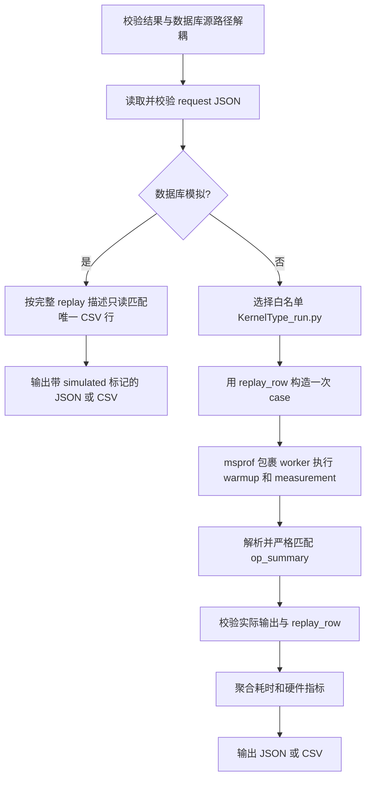
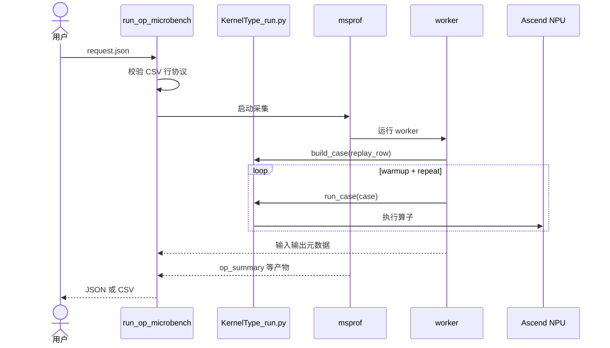

# RFC：独立单算子 msprof 性能测试

## 1. 目标

提供一个独立命令，让用户用 JSON 描述一行 replay CSV 数据，复用仓库现有
`tools/perf_data_collection/op_replay/<KernelType>_run.py` 在 NPU 上回放算子，并用 `msprof` 采集耗时和硬件指标。

核心约束：

- 用户通过 `--request` 传入 JSON 请求。
- 所有算子统一使用 `replay_row` 描述输入、输出和运行时信息。
- `replay_row` 与 replay CSV 行使用相同字段和字符串格式，空输入槽不能删除或重排。
- 算子的固定参数、辅助 Tensor 和调用规则由已有 replay 脚本负责。
- 只使用 `msprof` 计时，不提供 Event 模式。
- 不追加、覆盖或回填 profiling database CSV。

## 2. 命令行参数

| 参数 | 必填 | 默认值 | 中文说明 |
| --- | :---: | --- | --- |
| `--request PATH` | 三选一 | 无 | 单算子请求 JSON。 |
| `--list-operators` | 三选一 | 无 | 列出当前支持的单卡算子。 |
| `--describe-operator NAME` | 三选一 | 无 | 查看指定算子的统一 replay 行协议。 |
| `--output-format` | 否 | `json` | 输出格式，可选 `json` 或 `csv`。 |
| `--output PATH` | 否 | 标准输出 | 结果文件路径。 |
| `--artifact-dir PATH` | 否 | 临时目录 | 保存真实执行产生的 msprof 产物。 |
| `--simulate-from-database PATH` | 否 | 无 | 无 NPU 时只读匹配已有数据库记录，用于验证接口和输出。 |

## 3. 请求 JSON

### 3.1 顶层字段

| 字段 | 类型 | 必填 | 中文说明 |
| --- | --- | :---: | --- |
| `schema_version` | integer | 是 | 协议版本，当前固定为 `1`。 |
| `kernel_type` | string | 是 | replay 脚本和目标 CSV 使用的 Kernel 名。 |
| `replay_row` | object | 是 | 一行 CSV 的 replay 描述；所有值保持为字符串。 |
| `profiling` | object | 否 | NPU、预热、重复次数、超时和产物策略。 |

### 3.2 `replay_row` 字段

| CSV 字段 | 必填 | 中文说明 |
| --- | :---: | --- |
| `Input Shapes` | 是 | 输入 shape；多个物理槽用分号分隔，空槽保留为空字符串，标量用 `[]`。 |
| `Input Data Types` | 是 | 每个输入槽的 dtype，槽位数量与 Input Shapes 一致。 |
| `Input Formats` | 是 | 每个输入槽的 format，槽位数量与 Input Shapes 一致。 |
| `Output Shapes` | 是 | 预期输出 shape；也供 replay 脚本确定固定调用规则。 |
| `Output Data Types` | 是 | 预期输出 dtype。 |
| `Output Formats` | 是 | 预期输出 format。 |
| `Runtime ...`、`EP Size` 等 | 按算子 | 原 CSV 行存在且 replay 脚本依赖时必须原样保留。 |

输出描述需要填写。它不只是展示信息：部分 replay 脚本会用输出 shape 或 dtype 选择固定参数，真实执行后工具也会用它校验结果。
其中空 shape 与 `UNDEFINED` dtype/format 的组合表示“该输出槽存在，但历史行没有记录具体描述”：输出数量仍须一致，
该槽不猜测 shape、dtype 和 format；显式 `[]` 始终表示标量，不能与 `[0]` 零元素 Tensor 混用。
数据库中的耗时和 `Profiling ...` 指标不是执行输入，无需放入 `replay_row`。

### 3.3 `profiling` 字段

| 字段 | 默认值 | 中文说明 |
| --- | --- | --- |
| `device_id` | `0` | NPU 设备号。 |
| `warmup_count` | `5` | 预热次数，不计入最终统计。 |
| `repeat_count` | `30` | 正式采集次数。 |
| `timeout_seconds` | `300` | msprof 任务超时时间。 |
| `include_raw_records` | `true` | JSON 是否包含目标算子的原始记录。 |
| `keep_artifacts` | `on_failure` | `always`、`on_failure` 或 `never`。 |

### 3.4 示例

```json
{
  "schema_version": 1,
  "kernel_type": "MatMulV2",
  "replay_row": {
    "Input Shapes": "1,7168;256,7168",
    "Input Data Types": "DT_BF16;DT_BF16",
    "Input Formats": "ND;ND",
    "Output Shapes": "1,256",
    "Output Data Types": "DT_BF16",
    "Output Formats": "ND"
  },
  "profiling": {
    "device_id": 0,
    "warmup_count": 5,
    "repeat_count": 30
  }
}
```

## 4. 输出

### 4.1 输出格式

| 格式 | 指定方式 | 中文说明 |
| --- | --- | --- |
| JSON | 默认，或 `--output-format json` | 完整结果，包含耗时、msprof 指标、校验、错误和产物信息。 |
| CSV | `--output-format csv` | 一行扁平性能结果，便于现有表格工具消费，但不会写回数据库。 |

CSV 中六个 replay 描述列直接保留 `configuration.replay_row` 原文及其空槽，`Runtime ...` 和 `EP Size`
等执行身份字段也会保留。实际返回 Tensor 使用独立的 `Actual Output ...` 列记录，避免覆盖请求协议。

### 4.2 JSON 主要字段

| 字段 | 中文说明 |
| --- | --- |
| `status` / `phase` | 成功或失败状态，以及当前阶段。 |
| `simulated` / `result_source` | 是否为数据库模拟，以及数据来源。 |
| `operator` | 请求 Kernel、replay adapter、允许匹配的 msprof OP Type。 |
| `configuration.replay_row` | 实际执行使用的完整 CSV 行描述。 |
| `environment` | device、CANN、PyTorch、torch_npu、msprof 等环境信息。 |
| `inputs` / `outputs` | 输入输出的 shape、dtype、format 和字节数。 |
| `duration` | `Task Duration(us)` 的 p50、mean、min、p90、p95、std、max。 |
| `msprof` | 表格、目标匹配、聚合指标、物理 Kernel 和可选原始记录。 |
| `validation` | 请求、回放、目标匹配、耗时和输出描述校验结果。 |
| `artifacts` | msprof 产物，或模拟模式下的源 CSV 路径、行号和哈希。 |
| `warnings` / `error` | 警告或结构化失败信息。 |

真实模式的主耗时只来自正式样本的 `Task Duration(us)`；模拟模式读取数据库中的 `Profiling ...` 聚合字段，
并明确返回 `simulated=true`、`msprof.executed=false`，不能当成本次 NPU 实测。

## 5. 流程





## 6. 成功条件与边界

成功结果必须同时满足：请求合法、replay 脚本执行成功、msprof 完成、目标记录数严格等于
`warmup_count + repeat_count`、正式耗时均为有限正数、实际输出与 replay 描述一致。若 Python API 与底层
Kernel 的索引 dtype 存在已登记差异（例如 ArgMaxV2/Sort 的 INT64/INT32），校验只接受该精确映射，不在被测
replay 调用中插入额外 Cast。

无 NPU 环境只能验证请求协议、数据库模拟、序列化和软件侧 replay bridge，不能证明所有示例已经在真实 NPU 上运行。
多卡算子、无法确定调用边界的多物理 Kernel，以及未加入白名单的 replay 脚本不在当前范围内。
