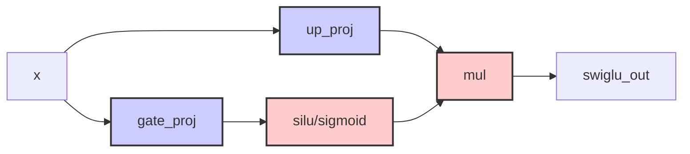

# RFC: SwiGLU Operator Fusion

## Metadata

| Item | Content                                       |
| :--- |:----------------------------------------------|
| **Status** | Approved                                      |
| **Author** | genius52                                      |
| **Created Date** | 2026-02-06                                    |
| **Related Links** | https://gitcode.com/Ascend/msmodeling/pull/75 |

---

## 1. Overview

The SwiGLU (Swish Gated Linear Unit) activation function consists of linear transformations, SiLU activation, and element-wise multiplication. Traditional execution approaches break it down into separate operators, leading to significant kernel launch overhead and inefficient memory access.
This RFC proposes implementing SwiGLU fusion using a pattern matching approach based on PyTorch graphs. The solution uses `torch.ops.tensor_cast.swiglu` operator to replace the computational patterns of SwiGLU activation. The performance is enhanced through Sink Split optimization that converts static parameters into dynamic inputs.

## 2. Solution Design

### 2.1 Recommended Approach

Implement SwiGLU fusion using PyTorch Graph-based Pattern Matching that identifies SwiGLU patterns and replaces them with calls to `torch.ops.tensor_cast.swiglu.default`, combined with Sink Split optimization for performance enhancement. The solution leverages pattern registration and replacement mechanisms from pattern matching infrastructure.

#### Core Implementation Files

- `tensor_cast/compilation/patterns/swiglu.py`: SwiGLU pattern definition and registration
- `tensor_cast/compilation/passes/pattern_match_pass.py`: Pattern matching and replacement pass implementation
- `tensor_cast/compilation/freezing_passes/sink_split_pass.py`: Sink Split optimization implementation

#### Interface

- Custom operator: `tensor_cast::swiglu`
  - input：`gate: Tensor`, `up: Tensor`
  - output：`Tensor`, `swiglu(gate, up)`

**Current Scope of SwiGLU Operator:**
The current `torch.ops.tensor_cast.swiglu` operator only handles the activation computation segment, not including the generation of gate and up projections. These projections are passed as parameters to the operator.



**Implementation Details:**

- **Activation segment only**: The operator matches and replaces only the activation computation: `gate → fp32 conversion → sigmoid → fp16 conversion → mul with up`
- **Gate and Up as inputs**: The linear transformations for gate and up projections are generated upstream and passed as inputs to the swiglu operator
- **Future matmul fusion**: Current implementation does not handle matrix multiplications for gate and up projections, this will be completed during GMM operator integration

#### Core Implementation

Based on `tensor_cast/compilation/patterns/swiglu.py` implementation:

- **SwiGLUPattern class**: Defines SwiGLU pattern matching and replacement logic
- **create method**: Returns pattern, replacement, get_inputs triplet
- **pattern function**: Matches activation computation segment: gate → fp32 conversion → sigmoid → fp16 conversion → mul with up
- **replacement function**: Uses `torch.ops.tensor_cast.swiglu` to replace original pattern
- **Supported data types**: torch.float16, torch.bfloat16

### 2.2 SwiGLU Pattern Detection and Fusion

#### 2.2.1 Pattern Detection and Registration

Based on the implementation in `tensor_cast/compilation/patterns/swiglu.py`, the pattern detection happens through a registration mechanism:

- Iterate through each data type, get pattern, replacement, example_inputs
- Register patterns via PyTorch pattern matcher's `register_pattern` function
- After registration, patterns become available for matching in computation graphs

Note: Pattern matching focuses on the activation computation segment: gate → fp32 conversion → sigmoid → fp16 conversion → multiplication with up tensor.

#### 2.2.2 Pattern Matching and Replacement Process

PatternMatchPass performs iterative pattern matching in the computation graph by loading registered patterns and detecting SwiGLU patterns. The process replaces matched patterns with single `torch.ops.tensor_cast.swiglu.default` calls and continues optimizing until no more patterns can be matched. This approach uses direct pattern-to-operator replacement instead of complex grouping strategies, achieving simpler and more efficient fusion.

#### 2.2.3 Placement in Compilation Pipeline


#### 2.2.4 Rationale for the New Approach

The new approach using PyTorch Graph-based Pattern Matching and Sink Split:

1. **Simplified Architecture**: Direct pattern-to-operator replacement eliminates complex grouping logic
2. **Enhanced Flexibility**: Pattern registration system allows easy addition of new operator patterns
3. **Better Performance**: Sink Split optimization converts static parameters into dynamic inputs for memory efficiency
4. **Seamless Integration**: `torch.ops.tensor_cast.swiglu` integrates naturally with existing tensor_cast operations
5. **Higher Compatibility**: Works with various quantization strategies and model structures through flexible pattern matching

### 2.3 Performance Modeling

The performance characteristics of `torch.ops.tensor_cast.swiglu` are handled through the standard tensor_cast performance modeling infrastructure.

#### FLOPs Calculation

- Matrix multiplication operations (upstream): `2 * M * N * K`
- SiLU activation operations: `3 * M * N` (sigmoid + multiplication + one more multiplication)
- Total computation depends on upstream operators and the fused activation

### 2.4 Finding and Validating the Operator

**Registration locations**:

- `tensor_cast/compilation/patterns/swiglu.py`: SwiGLU pattern registration
- `tensor_cast/compilation/passes/pattern_match_pass.py`: Pattern matching infrastructure

**Graph pattern recognition**:

- Pattern gate → fp32 conversion → sigmoid → fp16 conversion → multiplication with up tensor
- Ignores transparent operations like reshape/cast
- Supports both torch.float16 and torch.bfloat16 data types

**Validation methods**:

1. Check if SwiGLU patterns are registered via `register_all_patterns()`
2. Run compilation pipeline with pattern matching enabled
3. Use graph observers to verify `torch.ops.tensor_cast.swiglu` calls appear after transformations

### 2.5 Alternative Approaches

#### 2.5.1 Individual Pass Approach (Abandoned)

The original approach using individual passes like `swiglu_fusion_pass.py` was abandoned for the following reasons:

1. **Poor Performance**: Individual passes created significant overhead due to complex grouping logic
2. **Inflexibility**: Difficult to adapt to different model structures and optimization requirements
3. **Limited Extensibility**: Hard to add support for new operator patterns
4. **Inability to Fuse with GMM Operators**: The grouping approach prevented seamless integration with GMM operations

#### 2.5.2 Front-end Fusion

Combining linear transformations, SiLU activation and multiplication during model definition: `SwiGLU(x, W_gate, W_up) = Silu(x @ W_gate) * (x @ W_up)`

**Comparison**:

- **Individual Pass (Abandoned)**: Poor performance, inflexibility, poor extensibility, inability to fuse with GMM operators
- **Front-end Fusion**: Compile-time optimizations, hardware-specific optimizations, better memory locality vs. lack of flexibility, high loading overhead, difficult to maintain
- **This RFC**: High performance, strong flexibility, good extensibility, seamless integration vs. requires graph matching, higher development complexity

#### 2.5.3 Why Back-end Fusion is Better Suited for SwiGLU

Back-end fusion is the optimal choice for SwiGLU given its specific usage scenarios:

1. **Quantization Strategy Selection**:
   - SwiGLU is commonly used in large language models that typically employ int4/int8 quantization for optimal performance
   - Code explicitly excludes quantized nodes because post-quantization linear transformations differ from original floating-point computation patterns
   - Back-end fusion can dynamically adjust based on quantization strategies to ensure optimal fusion on non-quantized operators

2. **Graph Structure Flexibility**:
   - In large models, SiLU branches may consist of various variants (SiLU, sigmoid variants, etc.)
   - Model compilation may introduce transparent nodes and graph optimizations
   - Matching stability requirements necessitate pattern recognition during the compilation phase

3. **Performance Maximization and Safety**:
   - SwiGLU typically appears in groups within models (e.g., multiple parallel SwiGLUs in FeedForward layers)
   - Back-end approach enables precise dependency checking to ensure independence and safety of these groups
   - Achieves higher optimization potential and performance gains compared to front-end fusion
   - Explicit exclusion of quantized nodes prevents performance degradation caused by quantization

**Advantages Summary**:

- Computational graphs with fewer nodes and better kernel fusion opportunities
- More accurate performance modeling through aggregated matmul properties
- Enhanced cycle detection ensures fusion safety and prevents calculation errors
- Explicit exclusion of quantized nodes to avoid performance degradation after quantization
- Superior performance compared to the abandoned individual pass approach
- Seamless integration with GMM operators for improved hardware utilization

### 2.6 Sink Split Optimization

Based on `tensor_cast/compilation/freezing_passes/sink_split_pass.py`, the Sink Split optimization enhances SwiGLU fusion by converting static split parameters into dynamic inputs for performance improvement.

#### 2.6.1 SwiGLU Sink Split Working Mechanism

**SwiGLU Split Configuration**:

```python
# Binary operation configuration
binary_ops = [
    torch.ops.aten.mul.Tensor,
    torch.ops.tensor_cast.swiglu.default,
]
for op in binary_ops:
    # gate[0] and up[1] can be split, output[0] can be split
    add_config(op, {0, 1}, {0})
```

**Sink Split Working Principle**:

Traditional Split Pattern:

```python
# Multiple getitem+split combinations
getitem1 = input_tensor[0]        # Slice
split1 = split(getitem1, size1)   # Split
getitem2 = input_tensor[1]        # Slice
split2 = split(getitem2, size2)   # Split
# SwiGLU needs to combine results
swiglu_out = swiglu(split1, split2)  # Fusion
```

Sink Split Optimization:

```python
# Single split tree merging
dynamic_size = get_dynamic_sizes()  # Convert static to dynamic input
output_list = split(input_tensor, dynamic_size)  # One-time split
swiglu_out = swiglu(output_list[0], output_list[1])  # Direct indexing
```

**Key Formulas**:

- **Static→Dynamic Conversion**: `split_sizes=[a,b,c]` → `dynamic_sizes=a+b+c`, unified memory allocation
- **Tree Merging Optimization**: Time complexity O(n) → O(1), reduces memory allocation and fragmentation
- **Memory Continuity**: Physical memory continuous → Logical slice access, improves cache hit rate

#### 2.6.2 Performance Improvement Effects

SwiGLU achieves following performance improvements through Sink Split optimization:

- **Memory Access Efficiency**: Reduces memory fragmentation and improves data locality
- **Kernel Call Reduction**: Merges split operations into single operations, decreasing communication overhead
- **Hardware Utilization Enhancement**: Uses more continuous data access patterns to optimize hardware resource usage

### 2.7 SwiGLU and GMM Fusion

**GMM Fusion Mechanism**:
SwiGLU not only optimizes independently but also deeply integrates with various types of GMM (Grouped MatMul) operators to achieve maximum performance enhancement:

**Supported GMM Types**:

- `torch.ops.tensor_cast.static_quant_linear`: Static quantized linear layer
- `torch.ops.tensor_cast.static_quant_linear_int4`: Static quantized int4 linear layer
- `torch.ops.tensor_cast.fp8_linear`: FP8 linear layer
- `torch.ops.tensor_cast.mxfp4_linear`: MXFP4 linear layer
- `torch.ops.tensor_cast.grouped_matmul`: Generic grouped matrix multiplication

**GMM-SwiGLU Joint Optimization**:

- **Parameter Unification**: GMM and SwiGLU share split optimization configuration with unified iterator handling
- **Tree Merging**: GMM configured via `add_config(op, {0}, {0})` works collaboratively with SwiGLU tree merging mechanism
- **Static to Dynamic Conversion**: Converts static split parameters to dynamic inputs to reduce memory fragmentation
- **Hardware Optimization**: Achieves end-to-end memory access optimization by aggregating SwiGLU outputs with GMM inputs

**SwiGLU Split Configuration**:

```python
# Binary operation configuration
binary_ops = [
    torch.ops.aten.mul.Tensor,
    torch.ops.tensor_cast.swiglu.default,
]
for op in binary_ops:
    # gate[0] and up[1] can be split, output[0] can be split
    add_config(op, {0, 1}, {0})
```

**Sink Split Working Principle**:

Traditional Split Pattern:

```python
# Multiple getitem+split combinations
getitem1 = input_tensor[0]        # Slice
split1 = split(getitem1, size1)   # Split
getitem2 = input_tensor[1]        # Slice
split2 = split(getitem2, size2)   # Split
# SwiGLU needs to combine results
swiglu_out = swiglu(split1, split2)  # Fusion
```

Sink Split Optimization:

```python
# Single split tree merging
dynamic_size = get_dynamic_sizes()  # Convert static to dynamic input
output_list = split(input_tensor, dynamic_size)  # One-time split
swiglu_out = swiglu(output_list[0], output_list[1])  # Direct indexing
```

**Key Formulas**:

- **Static→Dynamic Conversion**: `split_sizes=[a,b,c]` → `dynamic_sizes=a+b+c`, unified memory allocation
- **Tree Merging Optimization**: Time complexity O(n) → O(1), reduces memory allocation and fragmentation
- **Memory Continuity**: Physical memory continuous → Logical slice access, improves cache hit rate

#### 2.6.2 Performance Improvement Effects

SwiGLU achieves following performance improvements through Sink Split optimization:

- **Memory Access Efficiency**: Reduces memory fragmentation and improves data locality
- **Kernel Call Reduction**: Merges split operations into single operations, decreasing communication overhead
- **Hardware Utilization Enhancement**: Uses more continuous data access patterns to optimize hardware resource usage

## 3. Implementation Plan

### 3.1 Implementation Steps

1. **Pattern Registration**: Implement SwiGLU pattern definitions for data types
2. **Matching Integration**: Integrate with PatternMatchPass for replacement
3. **Optimization Configuration**: Configure SinkSplitPass for split optimization
4. **GMM Integration**: Configure SwiGLU fusion with various GMM operators
5. **Validation Testing**: Verify functionality correctness and performance gains

### 3.2 Expected Benefits

- **Architecture Simplification**: Direct replacement eliminates complex grouping logic
- **Performance Optimization**: Enhanced memory access and computation efficiency through Sink Split
- **Strong Extensibility**: Easy to support new operator patterns and quantization strategies
- **Hardware Utilization**: Collaborative enhancement with GMM operators for optimal hardware resource efficiency
