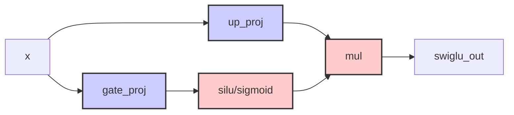

# RFC: SwiGLU算子融合

## 元数据

| 项目 | 内容                                            |
| :--- |:----------------------------------------------|
| **状态** | 已批准                                           |
| **作者** | genius52                                      |
| **创建日期** | 2026-02-06                                    |
| **相关链接** | https://gitcode.com/Ascend/msmodeling/pull/75 |

---

## 1. 概述

SwiGLU激活函数由线性变换、SiLU激活和逐元素乘法构成，传统执行方式将其分解为独立算子，导致kernel调用开销大、内存访问效率低。
本文提出采用基于PyTorch图的模式匹配方案实现SwiGLU融合。使用`torch.ops.tensor_cast.swiglu`算子替换SwiGLU激活的计算模式，并通过Sink Split下沉优化将静态参数转换为动态输入，提升性能。

## 2. 方案设计

### 2.1 推荐方案

基于PyTorch图实现SwiGLU融合，通过模式匹配识别SwiGLU模式并替换为 `torch.ops.tensor_cast.swiglu.default` 调用，结合Sink Split下沉优化提升性能。方案利用模式注册和替换机制实现融合，不再采用分组融合方式。

#### 核心实现文件

- `tensor_cast/compilation/patterns/swiglu.py`：SwiGLU模式定义与注册
- `tensor_cast/compilation/passes/pattern_match_pass.py`：模式匹配与替换Pass实现
- `tensor_cast/compilation/freezing_passes/sink_split_pass.py`：Sink Split优化实现

#### 接口

- 自定义算子：`tensor_cast::swiglu`
  - 输入：`gate: Tensor`, `up: Tensor`
  - 输出：`Tensor`，执行swiglu激活函数计算

**当前SwiGLU算子的作用范围：**
当前的`torch.ops.tensor_cast.swiglu`算子仅处理激活计算部分，不包含gate和up投影的生成。这些投影作为参数传递给算子。



**实现细节：**

- **仅激活部分**：算子仅匹配和替换激活计算部分：`gate → fp32转换 → sigmoid → fp16转换 → 与up相乘`
- **Gate和Up作为输入**：gate和up投影的线性变换在上游生成，并作为参数传递给swiglu算子
- **后续与matmul融合**：当前实现不处理gate和up投影的矩阵乘法，这将与GMM算子集成时完成

#### 核心实现

基于`tensor_cast/compilation/patterns/swiglu.py`的实现：

- **SwiGLUPattern类**：定义SwiGLU模式匹配和替换逻辑
- **create方法**：返回pattern, replacement, get_inputs三元组
- **pattern函数**：匹配激活计算部分：gate → fp32转换 → sigmoid → mul → fp16转换 → mul with up
- **replacement函数**：使用`torch.ops.tensor_cast.swiglu`替换原始模式
- **支持的数据类型**：torch.float16, torch.bfloat16

#### 与现有模块的关系

- 模式匹配与替换：由`pattern_match_pass.py`的`PatternMatchPass`类调用`register_pattern`注册模式
- 图遍历：通过`register_all_patterns()`将模式注册到全局模式表中
- 性能优化：通过Sink Split Pass进一步优化图结构

### 2.2 SwiGLU模式查找与融合

#### 2.2.1 模式注册与检测

基于`tensor_cast/compilation/patterns/swiglu.py`的实现，模式检测通过注册机制实现：

- 遍历每种数据类型，获取pattern、replacement、example_inputs
- 通过PyTorch模式匹配器的`register_pattern`函数注册模式
- 注册完成后，模式即可用于在计算图中查找匹配项

注：模式匹配专注于激活计算部分的匹配：gate → fp32转换 → sigmoid → fp16转换 → 与up张量相乘。

#### 2.2.2 模式匹配与替换过程

PatternMatchPass通过加载注册的模式并在计算图中进行迭代匹配，实现对SwiGLU模式的检测和替换。该过程将匹配的SwiGLU模式直接替换为单个`torch.ops.tensor_cast.swiglu.default`调用，并持续优化直至无更多模式可匹配。这种方法采用简单的模式直接替换策略，替代了传统的复杂分组策略，实现更简单高效的融合机制。

#### 2.2.3 在编译流程中的位置


#### 2.2.4 新方案的优势说明

采用PyTorch图模式匹配 + Sink Split下沉的新方案具有以下优势：

1. **简化的架构**：直接模式到算子替换消除了复杂的分组逻辑
2. **增强的灵活性**：模式注册系统允许轻松添加新的算子模式
3. **更好的性能**：Sink Split优化将静态参数转换为动态输入，提升内存效率
4. **无缝集成**：`torch.ops.tensor_cast.swiglu`与现有的tensor_cast操作自然集成
5. **更高的兼容性**：通过灵活的模式匹配，适用于各种量化策略和模型结构

### 2.3 性能建模

`torch.ops.tensor_cast.swiglu`算子的性能特征通过标准的tensor_cast性能建模基础设施处理。

#### FLOPs计算模型

- 矩阵乘法操作（上游）：`2 * M * N * K`
- SiLU激活操作：`3 * M * N`（sigmoid + 乘法 + 一次乘法）
- 总计算量取决于上游算子和融合的激活函数

### 2.4 如何查找定位与验证算子

- **注册与使用**：
  - `tensor_cast/compilation/patterns/swiglu.py`中的SwiGLU模式注册
  - `tensor_cast/compilation/passes/pattern_match_pass.py`中的模式匹配基础架构

- **图模式识别**：
  - 模式：gate → fp32转换 → sigmoid → fp16转换 → 与up张量相乘
  - 忽略reshape/cast等透明操作
  - 支持torch.float16和torch.bfloat16数据类型

- **验证方法**：
  1. 通过`register_all_patterns()`检查SwiGLU模式是否已注册
  2. 启用模式匹配功能运行编译流程
  3. 使用图观察器验证变换后出现`torch.ops.tensor_cast.swiglu`调用

### 2.5 替代方案

#### 2.5.1 单独Pass方案（已放弃）

原先使用swiglu_fusion_pass.py等单独Pass的方案被放弃，原因如下：

1. **性能差**：单独Pass因复杂的分组逻辑造成显著开销
2. **不够灵活**：难以适应不同的模型结构和优化需求
3. **可扩展性不佳**：难以添加对新的算子模式的支持
4. **无法与GMM算子融合**：分组方式阻碍了与GMM操作的无缝集成

#### 2.5.2 前端融合方案

算子前端融合是指在模型定义阶段就将线性变换、SiLU激活和乘法操作组合为单个自定义算子的做法。具体实现包括：

1. **自定义SwiGLU算子**：在模型层直接实现`SwiGLU(x, W_gate, W_up) = Silu(x @ W_gate) * (x @ W_up)`
2. **PyTorch融合扩展**：通过PyTorch的`torch.jit.script`或`torch.compile`实现前端融合

| 方案 | 优点 | 缺点 |
|------|------|------|
| **单独Pass方案（已放弃）** | - 实现相对简单 | - 性能差<br>- 不够灵活<br>- 可扩展性不佳<br>- 无法与GMM算子融合 |
| **前端融合** | - 编译时优化<br>- 硬件特定优化<br>- 更好的内存局部性 | - 缺乏灵活性<br>- 加载开销大<br>- 难以维护 |
| **本文推荐方案** | - 高性能<br>- 灵活性强<br>- 可扩展性好<br>- 无缝集成 | - 需要图匹配<br>- 开发复杂度较高 |

#### 2.5.3 后端融合更适合SwiGLU的具体原因

SwiGLU算子的使用场景复杂，后端融合方案更符合实际需求：

1. **量化策略选择**：
   - SwiGLU常见于大语言模型，这些模型通常采用int4/int8量化获得最佳性能
   - 代码中明确排除量化节点，因为量化后的线性变换与原始浮点运算模式不同
   - 后端融合能根据量化策略动态调整，确保在未量化算子上进行最优融合
2. **图结构灵活性**：
   - 在大模型中，SiLU分支可能由多种变体构成（SiLU、sigmoid变体等）
   - 模型编译过程中可能会有透明节点插入和图优化
   - 匹配稳定性的要求促使我们在编译阶段进行模式识别
3. **性能最大化与安全性**：
   - SwiGLU在模型中通常以组形式出现（如FeedForward层的多个并行SwiGLU）
   - 后端方案能够进行精确的依赖检查，确保这些组的独立性和安全性
   - 可获得比前端融合更高的优化空间和性能收益
   - 明确排除量化节点，避免因量化导致的性能损失

**优势总结**：

- 图更简洁、节点数量更少，核融合机会更好
- 通过聚合matmul属性实现更准确的性能建模
- 增强的环形检测确保融合安全，避免计算错误
- 明确排除量化节点，避免量化后的性能损失
- 相比已放弃的单独Pass方案具有更优的性能表现
- 与GMM算子无缝融合，提升硬件利用率

### 2.6 Sink Split优化

基于`tensor_cast/compilation/freezing_passes/sink_split_pass.py`，Sink Split优化通过将静态分割参数转换为动态输入来增强SwiGLU融合性能。

#### 2.6.1 SwiGLU Sink Split工作机制

**SwiGLU分割配置**：

```python
# 二进制操作配置
binary_ops = [
    torch.ops.aten.mul.Tensor,
    torch.ops.tensor_cast.swiglu.default,
]
for op in binary_ops:
    # gate[0]和up[1]可分割，输出[0]可分割
    add_config(op, {0, 1}, {0})
```

**Sink Split工作原理**：

传统split模式：

```python
# 多个getitem+split组合
getitem1 = input_tensor[0]        # 切片
split1 = split(getitem1, size1)   # 分割
getitem2 = input_tensor[1]        # 切片
split2 = split(getitem2, size2)   # 分割
# SwiGLU需要合并结果
swiglu_out = swiglu(split1, split2)  # 融合
```

Sink Split优化后：

```python
# 单个split树合并
dynamic_size = get_dynamic_sizes()  # 从静态参数转为动态输入
output_list = split(input_tensor, dynamic_size)  # 一次性分割
swiglu_out = swiglu(output_list[0], output_list[1])  # 直接索引使用
```

**关键公式**：

- **静态→动态转换**：`split_sizes=[a,b,c]` → `dynamic_sizes=a+b+c`，统一分配内存
- **树合并优化**：时间复杂度O(n) → O(1)，减少内存分配和碎片
- **内存连续性**：物理内存连续 → 逻辑切片访问，提升缓存命中率

#### 2.6.2 性能提升效果

SwiGLU通过Sink Split优化实现以下性能提升：

- **内存访问效率**：减少内存碎片，提高数据局部性
- **Kernel调用减少**：合并分割操作为单一操作，降低通信开销
- **硬件利用率提升**：采用更连续的数据访问模式，优化硬件资源使用

### 2.7 SwiGLU与GMM融合

**GMM融合机制**：
SwiGLU不仅独立进行优化，还会进一步与各种类型的GMM（Grouped MatMul）算子深度融合，实现最大化性能提升：

**支持的GMM类型**：

- `torch.ops.tensor_cast.static_quant_linear`：静态量化线性层
- `torch.ops.tensor_cast.static_quant_linear_int4`：静态量化int4线性层
- `torch.ops.tensor_cast.fp8_linear`：FP8线性层
- `torch.ops.tensor_cast.mxfp4_linear`：MXFP4线性层
- `torch.ops.tensor_cast.grouped_matmul`：通用分组矩阵乘法

**GMM-SwiGLU联合优化**：

- **参数统一**：GMM与SwiGLU共享split优化配置，统一处理迭代器
- **树合并**：GMM通过`add_config(op, {0}, {0})`配置，与SwiGLU的树合并机制协同工作
- **静态转动态**：同样将静态split参数转换为动态输入，减少内存碎片
- **硬件优化**：通过聚合SwiGLU输出与GMM输入，实现端到端内存访问优化

**SwiGLU分割配置**：

```python
# 二进制操作配置
binary_ops = [
    torch.ops.aten.mul.Tensor,
    torch.ops.tensor_cast.swiglu.default,
]
for op in binary_ops:
    # gate[0]和up[1]可分割，输出[0]可分割
    add_config(op, {0, 1}, {0})
```

**Sink Split工作原理**：

传统split模式：

```python
# 多个getitem+split组合
getitem1 = input_tensor[0]        # 切片
split1 = split(getitem1, size1)   # 分割
getitem2 = input_tensor[1]        # 切片
split2 = split(getitem2, size2)   # 分割
# SwiGLU需要合并结果
swiglu_out = swiglu(split1, split2)  # 融合
```

Sink Split优化后：

```python
# 单个split树合并
dynamic_size = get_dynamic_sizes()  # 从静态参数转为动态输入
output_list = split(input_tensor, dynamic_size)  # 一次性分割
swiglu_out = swiglu(output_list[0], output_list[1])  # 直接索引使用
```

**关键公式**：

- **静态→动态转换**：`split_sizes=[a,b,c]` → `dynamic_sizes=a+b+c`，统一分配内存
- **树合并优化**：时间复杂度O(n) → O(1)，减少内存分配和碎片
- **内存连续性**：物理内存连续 → 逻辑切片访问，提升缓存命中率

#### 2.6.2 性能提升效果

SwiGLU通过Sink Split优化实现以下性能提升：

- **内存访问效率**：减少内存碎片，提高数据局部性
- **Kernel调用减少**：合并分割操作为单一操作，降低通信开销
- **硬件利用率提升**：采用更连续的数据访问模式，优化硬件资源使用

## 3. 实施计划

### 3.1 实施步骤

1. **模式注册**：按数据类型实现SwiGLU模式定义
2. **匹配集成**：与PatternMatchPass集成实现替换
3. **优化配置**：配置SinkSplitPass下沉优化
4. **GMM集成**：配置SwiGLU与各种GMM算子的融合
5. **验证测试**：验证功能正确性和性能提升

### 3.2 预期收益

- **架构简化**：直接替换消除复杂分组逻辑
- **性能优化**：通过Sink Split提升内存访问和计算效率
- **扩展性强**：易于支持新算子模式和量化策略
- **硬件利用率**：与GMM算子协同提升硬件资源使用效率
