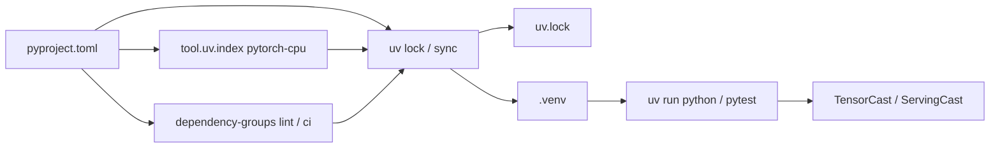

# RFC: Adopt uv for Dependency and Environment Management

# 1. Overview

Status: Draft
Author(s): AvadaKedavrua
Created: 2026-05-31
Updated: 2026-05-31
Related Issue/PR: [#69](https://gitcode.com/Ascend/msmodeling/issues/69)

---

## 1.1 Summary

MindStudio Modeling (msmodeling) is a CPU-based PyTorch simulation framework whose correctness depends on tightly coupled versions of Python, PyTorch, and Hugging Face Transformers. Today, dependencies are declared in a flat `requirements.txt` without a lockfile, installed via `pip`, and resolved independently on each machine. This leads to slow installs, silent version drift, and hard-to-reproduce failures in CI and community issue reports.

This RFC proposes adopting **uv** as the primary dependency manager: consolidate runtime dependencies in `pyproject.toml`, commit a `uv.lock` lockfile, route PyTorch through the official CPU wheel index, tighten `requires-python`, and use uv dependency groups for lint/CI tooling. CI entry scripts already detect uv when present; this change makes that path the supported default.

## 1.2 Motivation

msmodeling simulates model execution on CPU. It does not require CUDA or NPU at install time, yet the default PyPI resolution for `torch` pulls large CUDA-enabled wheels, wasting bandwidth and time. At the same time, core functionality is sensitive to upstream API changes:

| Pain point | Concrete example |
| --- | --- |
| **Transformers ↔ PyTorch coupling** | Transformers 5.x API and registration semantics change across minor releases; unpinned upgrades break model loading, patching, and `torch.compile` paths. |
| **CUDA wheel bloat on CPU-only workflows** | `pip install -r requirements.txt` downloads multi-GB CUDA PyTorch wheels even though simulation runs on CPU only. |
| **Python version fragmentation** | `requires-python = ">=3.9"` conflicts with `transformers>=5.3.0` (needs Python ≥ 3.10). Python 3.14 PEP 649 delayed annotation evaluation broke model registration until explicitly fixed ([#59](https://gitcode.com/Ascend/msmodeling/issues/59)). |
| **Dual, diverging dependency sources** | `requirements.txt` pins `transformers==5.3.0` while runtime code accepts `>=5.3.0`; other packages (e.g. `modelscope`, `diffusers`) have no upper bounds. |
| **No lockfile → non-reproducible environments** | Developers and CI resolve different transitive dependency trees; issue reproduction depends on "what pip happened to install today." |
| **Runtime self-healing via pip** | `tensor_cast.utils.check_dependencies()` silently runs `pip install transformers==5.3.0`, overriding user/CI choices and fighting declarative dependency management. |
| **Split dev tooling deps** | `pre-commit` and CI-only packages (`pytest-cov`, `pydantic`, `pathspec`) live outside the main install path, making "one command setup" impossible. |
| **Partial uv adoption without contract** | `scripts/lib/common.sh` already prefers `uv run`, but README and docs still instruct `pip install -r requirements.txt`, leaving two unofficial workflows. |
| **PyTorch ecosystem version matching** | After installing `torch`, adding `torchvision` or other PyTorch-family packages requires manually searching compatible versions online — slow and error-prone. |
| **Manual manifest editing** | Adding a dependency means hand-editing `pyproject.toml` (or `requirements.txt`) — easy typos, wrong bounds, and forgotten transitive pins. |

Without a single, locked, CPU-aware dependency contract, maintainers spend disproportionate effort triaging environment issues that are not product bugs.

**Why `uv add` (not just `uv sync`)**

| Workflow | Before (pip / hand edit) | With uv |
| --- | --- | --- |
| Add a dependency | Edit `pyproject.toml` or `requirements.txt` by hand; look up compatible `torch` / `torchvision` versions separately | `uv add <pkg>` resolves bounds, updates manifest, and refreshes `uv.lock` in one step |
| Local package dev | Manual `-e` paths in requirements | `uv add --editable ./path` |
| One-off experiments | Temporary venv pollution or forgotten uninstalls | `uv run --with <pkg> …` for ephemeral deps without changing the lockfile |

Committed **`uv.lock`** captures the resolved graph from `uv add` / `uv lock`, so CI `--frozen` sync and issue reproduction stay aligned.

## 1.3 Goals

**Goals**

- Make `pyproject.toml` + `uv.lock` the **single source of truth** for runtime dependencies.
- Pin and lock **PyTorch (CPU index)**, **torchvision**, **Transformers**, and other critical packages to tested ranges.
- Set `requires-python = ">=3.10"` to match Transformers 5.x and documented support (README: Python 3.10+; development baseline Python 3.13).
- Provide **dependency groups** (`lint`, `ci`) for tooling isolated from runtime installs.
- Document **`uv sync` / `uv run`** as the default developer and CI workflow.
- Keep **`requirements.txt`** as a supported pip fallback; README documents both paths with uv recommended.
- Keep `scripts/lib/common.sh` uv auto-detection behavior; align CI gate with `uv sync --group ci`.

**Non-goals**

- Adding CUDA or NPU optional dependency extras in this RFC (future work).
- Migrating Hugging Face model download/cache strategy.
- Replacing `pre-commit` hook infrastructure.
- Removing `requirements.txt` (kept as pip fallback; `uv.lock` is the reproducibility contract).
- Changing application/runtime logic beyond dependency declarations and docs.

# 2. Use Case Analysis

## 2.1 New contributor local setup

| Aspect | Requirement |
| --- | --- |
| **Function** | Clone repo, create venv, install deps, run smoke tests. |
| **Performance** | Install completes in minutes, not tens of minutes (no CUDA torch). |
| **Compatibility** | Same locked versions as CI; Python 3.10–3.13 supported. |
| **Maintainability** | One documented command sequence; no manual index URLs. |
| **Testability** | `uv run pytest` matches CI gate environment when `--group ci` synced. |

## 2.2 CI / CodeArts pipeline

| Aspect | Requirement |
| --- | --- |
| **Function** | `run_ci_gate.sh`, `run_smoke.sh`, `run_regression.sh` execute via `uv run`. |
| **Reliability** | Lockfile prevents upstream PyPI drift between pipeline runs. |
| **DFX** | Frozen sync (`uv sync --frozen`) fails loudly on lock mismatch. |

## 2.3 Maintainer dependency upgrade

| Aspect | Requirement |
| --- | --- |
| **Function** | Bump `torch` / `transformers` bounds intentionally, regenerate lock, run full regression. |
| **Compatibility** | Upper bounds on Transformers (e.g. `<=5.8.0`) until code adapts to newer APIs. |
| **Testability** | Upgrade PR includes lockfile diff reviewable in Git. |

# 3. Design

## 3.1 Overall Design



**Core changes (initial PR on branch `uv`):**

1. **`[project].dependencies`** — declare all runtime packages with explicit lower/upper bounds where needed:
   - `torch>=2.7,<=2.10` and `torchvision` sourced from CPU index
   - `transformers>=5.3.0,<=5.8.0`
   - `torchvision` — not invoked directly by tooling, but required because some model code paths import it at runtime
   - remaining packages with minimum versions aligned to current `requirements.txt`
2. **`requires-python = ">=3.10"`** — aligns with Transformers 5.x and prunes impossible uv resolution splits for Python 3.9.
3. **`[[tool.uv.index]]` + `[tool.uv.sources]`** — force `torch` and `torchvision` from `https://download.pytorch.org/whl/cpu`.
4. **`uv.lock`** — committed lockfile for reproducible installs.
5. **`[dependency-groups]`** — `lint` (pre-commit), `ci` (pytest-cov, pydantic, pathspec, pyyaml).
6. **Pytest defaults in `pyproject.toml`** — `nightly` marker, default `-m 'not npu and not nightly'`, `filterwarnings` for known torch.jit deprecation noise.

**Developer workflow:**

```bash
pip install uv
uv venv --python 3.13
source .venv/bin/activate
uv sync                    # runtime deps
uv add torchvision         # example: resolve + update manifest + lock
uv sync --group lint       # optional: pre-commit
uv sync --group ci         # optional: CI parity
uv run pytest tests/smoke
```

**CI workflow:**

```bash
uv sync --frozen --group ci
./scripts/run_ci_gate.sh
```

## 3.2 Technology Selection

| Option | Pros | Cons | Decision |
| --- | --- | --- | --- |
| **pip + requirements.txt** | Familiar | No lockfile; CUDA torch default; duplicate declarations | Reject as primary |
| **pip-tools (`pip-compile`)** | Lockfile support | Slower; no first-class CPU index routing; weaker group semantics | Not selected |
| **Poetry** | Lockfile, groups | Heavier; less aligned with existing `uv run` scripts | Not selected |
| **uv** | Fast resolver/installer; lockfile; index overrides; groups; already used in scripts | Team learning curve; requires uv on PATH | **Selected** |

## 3.3 Security, Privacy, and DFX Design

| Attribute | Design |
| --- | --- |
| **Compatibility** | Support Python 3.10–3.13 per lock markers; document Windows PyTorch ≤2.8 caveat (existing README warning). |
| **Maintainability** | One manifest; lockfile diff on every dep change. |
| **Testability** | CI uses `--frozen`; local `uv sync` before PR. |
| **Reliability** | Runtime no longer mutates the environment via pip; versions come from `uv sync` / lockfile. |
| **Supply chain** | Lockfile records hashes; optional Aliyun mirror via `UV_INDEX_URL` (existing CI env var). |

## 3.4 Programming and Integration Design

### 3.4.1 Basic Programming Model Design

- **Environment**: Python ≥ 3.10, CPU PyTorch from pytorch-cpu index, locked Transformers 5.3–5.8.
- **Toolchain**: uv ≥ 0.4; `uv run` wraps interpreter invocation.
- **Constraints**: NPU tests (`@pytest.mark.npu`) and nightly compile cases excluded from default pytest invocation.
- **Acceptance**: `uv sync --frozen` succeeds on clean checkout; default pytest suite passes on Python 3.13; install skips CUDA torch artifacts.

### 3.4.2 API Definition and Design

No public Python API changes. Integration surface is **project metadata**:

| Element | Location | Purpose |
| --- | --- | --- |
| Runtime deps | `[project].dependencies` | Import-time packages |
| Python bound | `requires-python` | Resolver + packaging metadata |
| CPU torch routing | `[tool.uv.sources]` | Avoid CUDA wheels |
| Tooling deps | `[dependency-groups]` | lint / ci isolation |
| Lockfile | `uv.lock` | Reproducible resolution |

### 3.4.3 Usage Instructions

1. **Install**: `uv sync` (add `--group lint` / `--group ci` as needed).
2. **Add deps**: `uv add <package>` — updates `pyproject.toml` and `uv.lock`; use `uv add --editable ./path` for local packages; use `uv run --with <package> …` for one-off trials without lockfile changes.
3. **Run**: `uv run python -m cli.inference.text_generate ...` or rely on `scripts/*.sh` auto-detection.
4. **Upgrade deps**: `uv add` with new bounds or edit `pyproject.toml`, then `uv lock`, test, commit both files.
5. **Constraints**: Prefer `uv sync` for development; pip + `requirements.txt` remains supported but without lockfile guarantees.

# 4. Test Design

| Level | Cases |
| --- | --- |
| **Smoke** | `uv sync --frozen && uv run pytest tests/smoke -q` |
| **CI gate** | `./scripts/run_ci_gate.sh` with `uv sync --group ci` |
| **Regression** | `./scripts/run_regression.sh` on nightly schedule |
| **Manual** | Fresh clone on Python 3.10, 3.11, 3.13 — verify install time and torch wheel is CPU-only |
| **Lock integrity** | CI step: `uv lock --check` or `uv sync --frozen` |

# 5. Drawbacks and Risks

| Risk | Mitigation |
| --- | --- |
| Contributors without uv | `requirements.txt` + README pip path; document CPU torch index and drift caveats |
| Lockfile merge conflicts | Regenerate with `uv lock` after rebasing |
| Upper-bound on Transformers blocks security patches | Periodic bounded upgrade PRs with regression (`<=5.8.0` until code adapts) |
| Mirror / air-gapped CI | Document `UV_INDEX_URL`; `--frozen` uses locked URLs |
| Python 3.14+ surprises (PEP 649/695) | Test on pre-release Python in nightly; no extra upper bound for now |

# 6. Existing Technology

- **uv** ([astral-sh/uv](https://github.com/astral-sh/uv)): used by growing Python ecosystem for pip-compatible lockfiles and fast installs.
- **PyTorch CPU index**: official documented channel for CPU-only wheels.
- **msmodeling scripts**: `scripts/lib/common.sh` already routes to `uv run` when `pyproject.toml` exists — this RFC formalizes that path.

# 7. Resolved Decisions

1. **`requirements.txt`** — **Keep** as pip fallback; README documents uv (recommended) and pip (alternative). `uv.lock` is the reproducibility source of truth.
2. **`check_dependencies()` auto pip install** — **Removed**; dependency versions are managed declaratively via uv / lockfile. Runtime CLI entry points, including `cli.inference.model_adapter`, must not call `tensor_cast.utils.check_dependencies()` because doing so can mutate the active environment after `uv sync --frozen` has established the reviewed dependency set.
3. **Transformers upper bound** — **`<=5.8.0` intentional**; raise after regression covers newer releases.
4. **Python upper bound** — **Not added**; stay at `requires-python = ">=3.10"` for now.
5. **README / docs** — **Updated** in this change set (`README.md`, `docs/en/web_ui.md`, `docs/en/serving_cast_simulation.md`).
6. **pre-commit large-file hook** — **`uv.lock` excluded** from `check-added-large-files` (lockfiles are expected to exceed default size limits).
7. **Entry script sync** — **`scripts/lib/common.sh` runs `uv sync --frozen --group ci`** for all `run_*.sh` entry points when uv is used.
8. **`torchvision`** — **Added** for model import paths; sourced from pytorch-cpu index alongside `torch`.

## 7.1 Open Questions

1. **CI job definitions** — CodeArts YAML still owned by platform; dependency install is handled inside `scripts/lib/common.sh`.

## 7.2 Deferred (out of scope for this PR)

1. **NPU / `torch-npu`** — not included; planned as a follow-up with a unified Huawei Cloud package index binding.

---

## Appendix

### References

- [uv documentation](https://docs.astral.sh/uv/)
- [PyTorch CPU wheels index](https://download.pytorch.org/whl/cpu)
- [msmodeling Issue #69](https://gitcode.com/Ascend/msmodeling/issues/69)
- [Transformers 5.x Python requirement](https://pypi.org/project/transformers/)

### Glossary

| Term | Meaning |
| --- | --- |
| **uv lock** | Resolved dependency graph with pinned versions and hashes |
| **dependency group** | uv optional dependency set (e.g. `ci`, `lint`) not installed by default |
| **explicit index** | uv index used only for packages explicitly sourced to it (pytorch-cpu) |

### Documentation Update Plan

- [x] `README.md` — uv-first install; explain `uv.lock` value; pip fallback
- [x] `docs/en/web_ui.md` — align install instructions
- [x] `docs/en/serving_cast_simulation.md` — link to README install section
- [x] Entry scripts — `uv sync --frozen --group ci` in `scripts/lib/common.sh`
