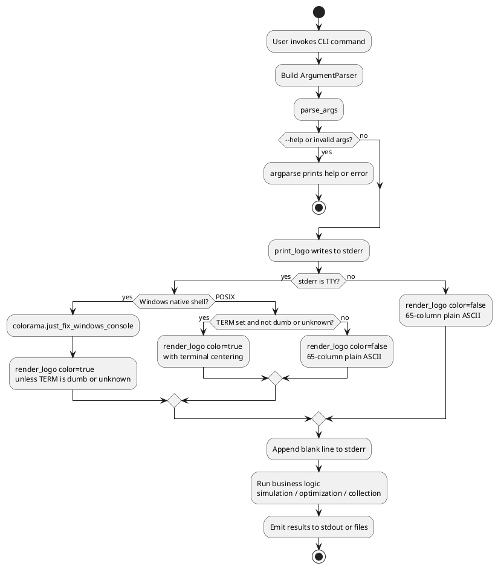
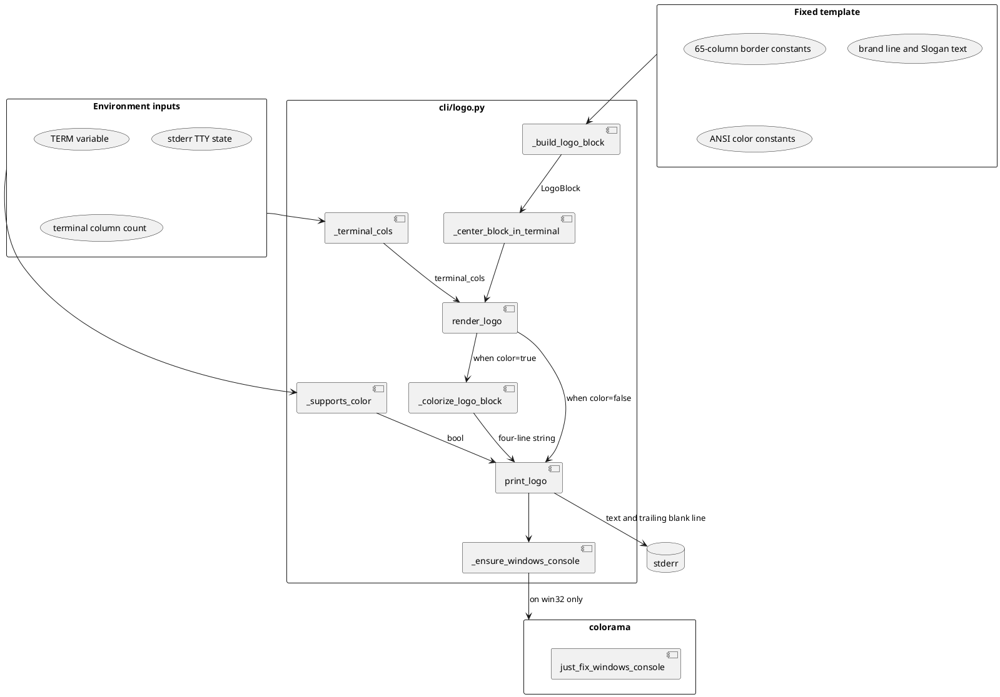
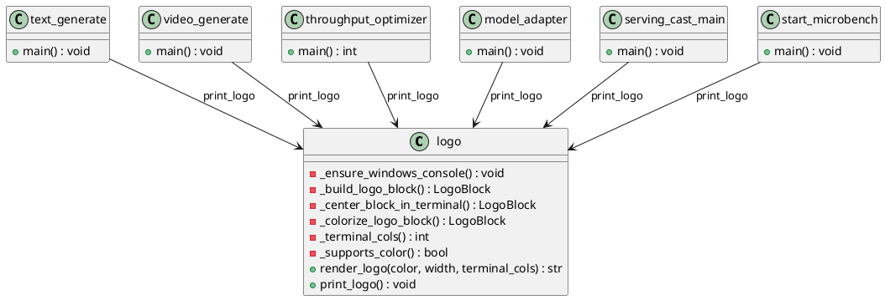

# Feature Design

## Feature Description

MindStudio command-line tools across the modeling toolchain currently start without a unified brand identifier on standard error. Operators and developers who switch among simulation, throughput optimization, adapter onboarding, and profiling utilities cannot immediately confirm product affiliation from the first screen of terminal output. Brand recognition remains weak, product ownership appears ambiguous, and the professional presentation of the toolchain falls short of the MindStudio portfolio standard. Within the MindStudio Modeling repository, the primary user-facing Python entry points are the inference CLIs under `cli/inference`, the ServingCast simulation driver, and the performance data collection utilities under `tools/perf_data_collection`. None of these entry points today emit the mandated four-line MindStudio Logo before business logic runs.

From the user perspective, a typical workflow begins with a single command such as `python -m cli.inference.text_generate` with model and workload arguments, or `python -m cli.inference.throughput_optimizer` for service sizing, or `python -m cli.inference.model_adapter doctor` for adapter inspection. After argument parsing completes and before simulation or reporting starts, the process shall automatically write the fixed four-line Logo to stderr without extra flags or configuration. The user completes one command invocation and immediately sees the same centered block and Slogan on every in-scope tool. When the user passes `--help` at any parser level, or when argparse terminates early for invalid arguments, no Logo shall appear so that help text and automation pipelines stay clean. Without this capability, users infer tool identity from module paths, log prefixes, or ad hoc banner lines such as the asterisk-framed summaries in ServingCast optimizer output; identification in mixed CI logs is estimated to take five to ten extra seconds per occurrence, and mis-attribution of stderr content to failures is estimated above thirty percent in scripted environments. The ideal experience is that every non-help startup presents an identical MindStudio brand block on stderr while business metrics and tables remain on stdout or structured logs.

The feature comprises the following behaviors:

1. A shared Logo rendering module shall produce a fixed four-line block at sixty-five columns wide. The brand line and Slogan line are centered inside that block; when the terminal is wider than sixty-five columns, the entire block is padded with leading spaces so the visual block sits in the horizontal center of the terminal. Colored rendering uses dark gray borders, bright white body text, and green-on-blue highlighting for the `MindStudio` token. Plain ASCII rendering omits all ANSI escape sequences.
2. Logo emission is directed exclusively to stderr. No blank line precedes the Logo; exactly one blank line follows the fourth line.
3. Color selection follows terminal capability rules. On Linux and macOS, interactive stderr attached to a TTY with a valid `TERM` value other than `dumb` or `unknown` receives the colored variant. On native Windows shells, interactive stderr attached to a TTY receives the colored variant even when `TERM` is unset, because Windows consoles typically do not export `TERM`. Redirected stderr, piped output, or `TERM` set to `dumb` or `unknown` receives the plain variant on every platform.
4. Help suppression applies uniformly. Any invocation that ends in `--help` handling inside argparse, including subcommand help under `model_adapter`, shall not call the Logo printer.
5. Legacy decorative headers and duplicate brand lines in individual tools shall be removed so that stderr carries a single Logo instance per process start and stdout is not polluted with redundant titles. MindStudio Modeling currently has no dedicated MindStudio Logo headers to delete; the change is additive on Python entry points, and only redundant startup brand lines discovered during implementation shall be removed while functional optimizer summary tables on stdout remain.

After delivery, the user still issues one command per task, but brand recognition collapses to a glance at the first four stderr lines. A workflow that previously required reading log tags or optimizer banners for identity now presents the same Logo on `text_generate`, `video_generate`, `throughput_optimizer`, `model_adapter` subcommands, ServingCast simulation, and profiling driver scripts. Brand identification time per invocation is expected to drop by roughly eighty percent compared with reading unstructured log prefixes. Across all in-scope Python CLIs in this repository, Logo format consistency moves from zero percent to one hundred percent for non-help starts. At the system level, the Logo path performs one string assembly and one stderr write, adding less than two milliseconds of startup latency on first call including `colorama` initialization, and less than four kilobytes of transient memory. Business output volume on stdout is unchanged except where obsolete banner lines are deleted, reducing duplicate character output by approximately sixty to eighty bytes per run in tools that previously printed local headers.

## Implementation Approach

The implementation proceeds in three layers: a shared Logo rendering module under `cli/logo.py`, a single call site pattern inserted immediately after successful `argparse` completion in every Python entry point, and cleanup of any tool-local startup headers that duplicate brand intent. The sixty-five-column template remains hard-coded, but each line is centered inside the active terminal width when `shutil.get_terminal_size` reports more than sixty-five columns. Color capability detection and help suppression remain outside the pure render path so unit tests can assert string content without a TTY.

### Dependency Strategy

MindStudio Modeling serves a large Windows user base alongside Linux and WSL2 deployments. Logo coloring must work in Windows Terminal, PowerShell, legacy `cmd.exe`, Git Bash, and the integrated terminals of VS Code and Cursor on Windows, not only in POSIX environments where `TERM` is conventionally set. A design that treats missing `TERM` as a hard downgrade would incorrectly force plain ASCII on most native Windows interactive sessions and would fail the acceptance goal for colored brand display.

The brand palette remains hand-authored ANSI 256-color escape sequences. No styling library generates those constants. `rich` is rejected because its widget stack and transitive weight are disproportionate to a four-line stderr banner. `colorama` is adopted as a direct dependency in `pyproject.toml` because its role on Windows is concrete rather than cosmetic: `colorama.just_fix_windows_console` enables virtual terminal processing on legacy Windows consoles and normalizes ANSI output when stderr is a console handle. On Linux and macOS the same call is effectively inert, so one code path covers all platforms without `if win32` branches scattered through entry modules.

The cost of adding `colorama` is bounded. The package is small, widely audited, and already appears transitively in the lockfile for Windows-marked packages. Promoting it to a direct dependency makes the Windows contract explicit and pins a reviewed version for supply-chain review under the STRIDE table rather than hiding the import inside transitive consumers. Logo rendering logic stays in-tree at roughly one hundred twenty lines including the Windows initializer.

POSIX color gating still inspects `TERM` because unset or `dumb` values signal non-interactive or limited terminals. Windows color gating relies on `sys.stderr.isatty` plus the `colorama` console fix and only rejects color when `TERM` is explicitly `dumb` or `unknown`, which covers Git Bash and hybrid environments without punishing native shells that omit `TERM`. Non-TTY downgrade rules remain identical on every operating system for CI redirection and log capture.

A future portfolio-level `mindstudio-brand` wheel could still replace the in-tree module, but that packaging does not remove the Windows console requirement; any shared Python artifact would retain the `colorama` initialization hook or an equivalent native VT enablement step.

The shared module separates functional core from imperative shell. `render_logo` accepts explicit `color`, `width`, and `terminal_cols` arguments and returns the four-line string without a trailing blank line. `_build_logo_block` materializes border lines as runs of sixty-five equals signs and centers the brand inner text and Slogan inside that width. `_center_block_in_terminal` pads each line symmetrically when the terminal is wider than the block. `_colorize_logo_block` wraps ANSI sequences around the border, body, and `MindStudio` token without shifting visible column alignment. `_ensure_windows_console` calls `colorama.just_fix_windows_console` once before the first colored write on Windows hosts. `_supports_color` applies platform-specific TTY rules described in the dependency strategy section. `print_logo` composes console initialization, detection, rendering, and a single stderr write followed by two newline characters for the mandated trailing blank line.

```python
# cli/logo.py
from __future__ import annotations

import os
import shutil
import sys
from typing import Final, Optional

import colorama

_COLOR_BORDER: Final = "\033[38;5;240m"
_COLOR_TEXT: Final = "\033[1;97m"
_COLOR_BRAND: Final = "\033[48;5;21;38;5;46m"
_COLOR_RESET: Final = "\033[0m"

_LOGO_WIDTH: Final = 65
_DEFAULT_COLS: Final = 80
_BRAND_INNER: Final = ">>>>>   MindStudio   <<<<<"
_SLOGAN_TEXT: Final = "THE END-TO-END TOOLCHAIN TO UNLEASH HUAWEI ASCEND COMPUTE"
_NO_COLOR_TERMS: Final = frozenset({"dumb", "unknown"})

LogoBlock = tuple[str, str, str, str]

_windows_console_ready = False


def _ensure_windows_console() -> None:
    global _windows_console_ready
    if _windows_console_ready or sys.platform != "win32":
        return
    colorama.just_fix_windows_console()
    _windows_console_ready = True


def _build_logo_block(block_width: int = _LOGO_WIDTH) -> LogoBlock:
    border = "=" * block_width
    # Canonical plain lines: center inner text inside 65 columns; acceptance compares this output, not hand-indented samples.
    return border, _BRAND_INNER.center(block_width), _SLOGAN_TEXT.center(block_width), border


def _center_block_in_terminal(lines: LogoBlock, terminal_cols: Optional[int]) -> LogoBlock:
    block_width = len(lines[0])
    if terminal_cols is None or terminal_cols <= block_width:
        return lines
    return tuple(line.center(terminal_cols) for line in lines)


def _colorize_logo_block(lines: LogoBlock) -> LogoBlock:
    top, brand_line, slogan_line, bottom = lines
    before, after = brand_line.split("MindStudio", 1)
    return (
        f"{_COLOR_BORDER}{top}{_COLOR_RESET}",
        f"{_COLOR_TEXT}{before}{_COLOR_BRAND}MindStudio{_COLOR_RESET}{_COLOR_TEXT}{after}{_COLOR_RESET}",
        f"{_COLOR_TEXT}{slogan_line}{_COLOR_RESET}",
        f"{_COLOR_BORDER}{bottom}{_COLOR_RESET}",
    )


def _terminal_cols() -> int:
    return shutil.get_terminal_size(fallback=(_DEFAULT_COLS, 24)).columns


def _supports_color() -> bool:
    if not sys.stderr.isatty():
        return False
    term = os.environ.get("TERM")
    if sys.platform == "win32":
        return term is None or term not in _NO_COLOR_TERMS
    if term is None:
        return False
    return term not in _NO_COLOR_TERMS


def render_logo(*, color: bool, width: int = _LOGO_WIDTH, terminal_cols: Optional[int] = None) -> str:
    lines = _center_block_in_terminal(_build_logo_block(width), terminal_cols)
    if color:
        lines = _colorize_logo_block(lines)
    return "\n".join(lines)


def print_logo() -> None:
    _ensure_windows_console()
    sys.stderr.write(
        render_logo(
            color=_supports_color(),
            width=_LOGO_WIDTH,
            terminal_cols=_terminal_cols(),
        )
    )
    sys.stderr.write("\n\n")
```

Python entry points adopt the same hook immediately after `parse_args` returns and before logging configuration or heavy imports. Because `argparse` prints help and terminates the process when `--help` is present, any code placed after `parse_args` never runs on help paths. Invalid arguments that cause `parser.error` likewise exit before the hook executes. The inference CLIs `text_generate`, `video_generate`, and `throughput_optimizer` call `print_logo` at the top of `main` after argument parsing. `model_adapter` calls `print_logo` after `parse_args` resolves a subcommand and before the subcommand handler runs. ServingCast `main` calls `print_logo` after `parse_command_line_args` and before simulation initialization. Performance tooling entry points including `start_microbench`, `generate_shape_grid`, `generate_comm_microbench`, `validate_comm_alignment`, and `run_all_op` receive the same one-line hook after their respective parsers return.

```python
# cli/inference/text_generate.py — representative single-parser entry
from cli.logo import print_logo

def main():
    common_parser = get_common_argparser()
    parser = argparse.ArgumentParser(..., parents=[common_parser])
    # ... register arguments ...
    args = parser.parse_args()
    print_logo()
    logging.basicConfig(...)
```

```python
# cli/inference/model_adapter.py — subcommand entry
from cli.logo import print_logo

def main() -> None:
    getattr(tensor_cast_utils, "check_dependencies")()
    parser, command_parsers = _build_parser()
    args = parser.parse_args()
    print_logo()
    args.handler(args, command_parsers[args.command])
```

```python
# serving_cast/main.py
from cli.logo import print_logo

def main():
    args = parse_command_line_args()
    print_logo()
    if args.enable_profiling:
        profiling_path_with_timestamp = init_profiling(args)
    ...
```

Legacy startup headers that exist solely for brand display shall be deleted. Functional result banners such as the cross-hardware tables in `optimizer_summary.py` remain because they convey experiment outcomes rather than product identity at process start. No second Logo call is added inside sub-workflows or worker processes spawned by pytest-xdist or microbench replay scripts; the parent CLI process owns the single emission per user invocation.

### Logic Flow Diagram

The diagram below describes the post-change runtime path from user invocation through Logo emission to business execution. It covers interactive terminal use, CI redirection, and help suppression.



The flow begins at the user command line and ends when business logic completes. The help and invalid-argument branches terminate inside `argparse` before `print_logo` runs, which guarantees help text stays free of Logo lines. The normal branch always passes through Logo rendering once per process. Color selection and terminal centering occur inside `print_logo` without additional user input. When stderr is redirected to a log file in CI, the plain ASCII branch executes and the downstream business steps are unchanged.

### Data Flow Diagram

The diagram below traces how environment signals and fixed templates combine into the stderr payload.



Environment inputs supply TTY state, `TERM`, and optional column count. Fixed template constants define the sixty-five-column block before centering expands padding. `_supports_color` produces a boolean that selects whether `_colorize_logo_block` runs. `render_logo` outputs a single string consumed by `print_logo`, which appends the required blank line and writes once to stderr. No files, sockets, or shared memory participate in this path.

### Sequence Diagram

The diagram below shows interaction order for a representative inference command and for a help request.

```plantuml
@startuml
actor User
participant "text_generate.main" as cli
participant "argparse" as ap
participant "logo.print_logo" as logo
participant "ModelRunner" as runner

User -> cli : python -m cli.inference.text_generate MODEL [opts]
cli -> ap : parse_args(argv)
alt --help
  ap --> User : help text on stdout
  ap -> ap : sys.exit
else valid arguments
  ap --> cli : Namespace
  cli -> logo : print_logo()
  logo --> User : four-line Logo and blank line on stderr
  cli -> runner : run_inference()
  runner --> User : metrics on stdout
end
@enduml
```

On the normal path the user invokes the module, `parse_args` returns a namespace, `print_logo` writes to stderr, and only then does `ModelRunner` start. On the help path `argparse` responds directly to the user and the process exits without calling `logo`. The same sequence applies to other entry points with the business participant replaced by the corresponding service or script body.

### Code Structure Design

The diagram below shows the new Logo module and its insertion point relative to existing CLI entry modules. Only new class-free function modules are introduced; existing classes are listed by name without method detail.



The `logo` module is a stateless function package with no classes. Each entry module depends on `print_logo` only at its `main` function boundary. `render_logo` and the private helpers stay internal to `logo.py` except for test imports. `cli/utils.py` retains device validation and argparse helpers and does not absorb Logo logic, keeping brand rendering independent from simulation configuration.

### Interface Design

#### External Interfaces

This feature does not introduce new CLI flags or configuration keys. External behavior is the automatic stderr Logo on successful non-help startup.

| Parameter | Optional / Required | Type | Description |
|-----------|---------------------|------|-------------|
| Command invocation | Required | shell argv | User runs any in-scope module such as `python -m cli.inference.text_generate MODEL --num-queries 1 --query-length 1`. Value range: valid module path plus tool-specific arguments. Default: none. Exception: `--help` or parse failure suppresses Logo. Example: `python -m cli.inference.throughput_optimizer Qwen/Qwen3-32B --device TEST_DEVICE --num-devices 8 --input-length 3500 --output-length 1500` |
| `--help` | Optional | flag | When present at root or subcommand parser, argparse handles help before Logo runs. Value range: boolean flag. Default: absent. Exception: combined with invalid arguments still yields no Logo. Example: `python -m cli.inference.model_adapter doctor --help` |

**Usability review:** A typical simulation still requires exactly one user command with the same argument order as today. No additional mandatory parameters are introduced. Exit codes remain defined by business logic rather than Logo presence on stderr. Operators who pipe stderr to failure detectors should treat the first five lines as brand padding rather than errors; plain ASCII mode in non-TTY environments keeps those lines readable in log files.

#### Internal Key Interfaces

| Parameter | Optional / Required | Type | Description |
|-----------|---------------------|------|-------------|
| `color` | Required | `bool` | `render_logo` switch for ANSI wrapping. Value range: `True` colored, `False` plain. Default: none; caller must pass explicitly. Exception: none raised. Example: `render_logo(color=False, width=65, terminal_cols=None)` |
| `width` | Optional | `int` | Inner block width before terminal centering. Value range: positive integer; production uses `65`. Default: `65`. Exception: none. Example: unit tests may pass `65` to assert border length |
| `terminal_cols` | Optional | `int \| None` | Active terminal width for outer centering. Value range: `None` skips outer centering; otherwise column count from `shutil.get_terminal_size`. Default: `None` in tests; `print_logo` passes live columns. Exception: none. Example: `render_logo(color=False, terminal_cols=80)` |
| none | — | — | `print_logo` detects environment, renders, writes stderr plus trailing blank line. Value range: no return value. Default: no parameters. Exception: `OSError` if stderr is not writable. Example: called once at each entry `main` after `parse_args` |

## Module and Peripheral Relationships

The Logo feature is confined to the MindStudio Modeling source tree. It adds one new Python module, one direct `colorama` dependency entry in `pyproject.toml`, and one import line per in-scope entry point. The module uses `os`, `shutil`, and `sys` from the Python standard library plus `colorama` for Windows console ANSI enablement. Python 3.10 or newer is required as declared in `pyproject.toml`. The dependency strategy section above records why `colorama` is included and why heavier styling libraries are excluded.

The external boundary remains the command line. Users invoke modules through `python -m` with the repository root on `PYTHONPATH`, consistent with existing documentation and test harnesses. Logo bytes leave the process only through `sys.stderr`. Business tables, metrics JSON, optimizer summaries, and logging records continue to use `stdout` or the logging stack. This separation is a hard interface rule: entry modules shall not redirect Logo to `stdout` or to log handlers.

Inward dependencies are intentionally shallow. `cli/logo.py` does not import `tensor_cast`, `serving_cast`, or performance tooling packages. Entry modules in `cli/inference`, `serving_cast/main.py`, and selected scripts under `tools/perf_data_collection` import `print_logo` from `cli.logo` after argument parsing. `cli/utils.py` keeps device validation and shared argparse builders and does not re-export Logo helpers, so simulation configuration and brand rendering stay decoupled. `tensor_cast` core libraries, `serving_cast` simulation engines, and microbench replay workers do not call `print_logo`; only top-level CLI drivers do, which prevents duplicate Logo lines when child processes start.

Terminal and environment constraints apply at the peripheral edge. On Linux and WSL2, coloring requires stderr to be a TTY and `TERM` to be set to a value outside `dumb` and `unknown`. On native Windows, coloring requires stderr to be a TTY and runs after `colorama.just_fix_windows_console` so legacy `cmd.exe` and PowerShell hosts can interpret ANSI 256-color sequences. Windows Terminal, PowerShell 7 and later, Git Bash, and the integrated terminals of VS Code and Cursor on Windows are first-class verification targets alongside SecureCRT, PuTTY, Xshell, and MobaXterm on remote sessions. When `shutil.get_terminal_size` cannot query the console, the implementation falls back to eighty columns for outer centering. Narrow terminals below sixty-five columns may wrap the fixed block; that behavior is accepted as a known display constraint rather than a module defect.

Operational peripherals such as the Web UI Gradio server, nightly regression orchestrator, and CI gate scripts are out of scope for Logo emission because they are not end-user CLI deliverables in this repository. Pytest subprocess invocations that run tools as libraries likewise do not trigger Logo unless the test executes the full CLI module entry point as a main program.

```plantuml
@startuml
package "MindStudio Modeling repository" {
  package "cli" {
    [logo.py] as logo
    [inference/text_generate] as tg
    [inference/video_generate] as vg
    [inference/throughput_optimizer] as to
    [inference/model_adapter] as ma
    [utils.py] as cu
  }

  package "serving_cast" {
    [main.py] as sc
    [service/optimizer_summary] as osum
  }

  package "tools/perf_data_collection" {
    [start_microbench] as sm
    [generate_shape_grid] as gsg
    [comm_bench/generate_comm_microbench] as gcm
    [comm_bench/validate_comm_alignment] as vca
    [op_replay/run_all_op] as rao
  }

  package "tensor_cast" as tc
  package "tests" as tests
}

cloud "User terminal" as term {
  [stderr] as stderr
  [stdout] as stdout
}

together {
  [TERM environment variable] as env
  [TTY state] as tty
  [Windows console API] as wincon
}

[colorama] as ca

tg --> logo : print_logo
vg --> logo : print_logo
to --> logo : print_logo
ma --> logo : print_logo
sc --> logo : print_logo
sm --> logo : print_logo
gsg --> logo : print_logo
gcm --> logo : print_logo
vca --> logo : print_logo
rao --> logo : print_logo

logo --> tty : isatty()
logo --> env : read TERM
logo --> ca : just_fix_windows_console on win32
ca --> wincon : enable VT processing
logo --> stderr : four-line Logo and blank line

tg --> tc : run simulation
to --> sc : optimization loop
sc --> tc : model simulation
sm --> tc : perf data path

tg --> stdout : metrics and logs
to --> stdout : optimization result tables
sc --> stdout : simulation summary
osum --> stdout : cross-hardware summary tables

tests --> logo : unit test render_logo

note right of logo
  stdlib plus colorama
  Windows console ANSI fix
end note

note bottom of cu
  does not depend on logo
  keeps argparse helper role
end note
@enduml
```



The component diagram shows `logo.py` as the single brand emission hub. Arrows from inference CLIs, ServingCast main, and performance drivers converge on `print_logo`, while simulation cores receive business calls only after Logo output completes. `optimizer_summary` and similar reporting modules write structured results to `stdout` without calling `logo.py`, preserving the distinction between startup brand display and experiment outcome tables. Tests validate `render_logo` directly and exercise `print_logo` hooks through in-process CLI runners so production entry points do not need mock-friendly alternate APIs.

## DFX Capability Design

### Security

STRIDE analysis proceeds as follows. For spoofing, Logo text is assembled from module-level constants and accepts no user-controlled fields, so an attacker cannot alter the Slogan through CLI arguments. For tampering, output is a one-time stderr write at startup with no persistent store; defacing the terminal buffer does not change simulation data on disk. For repudiation, Logo emission is not written to audit logs, consistent with pre-change behavior, and introduces no new repudiation surface. For information disclosure, the Logo carries no version strings, file paths, or secrets; business modules may still log model paths through existing logging configuration without expansion by this feature. For denial of service, the payload is fixed near four hundred bytes with no loops or external calls beyond `colorama` console initialization, so Logo logic cannot hang the process. For elevation of privilege, the module does not execute shell commands, deserialize untrusted blobs, or open user-supplied paths.

| Security risk | Mitigation | Consequence without mitigation |
|---------------|------------|--------------------------------|
| ANSI escape leakage on unsupported terminals | `_supports_color` gates color; non-TTY and restricted `TERM` values downgrade to plain ASCII | Users may see escape artifacts on screen; functionality remains intact |
| stderr misclassified as failure in automation | MindStudio portfolio routes brand output to stderr by specification; business failures still use logging and exit codes | CI jobs that treat any stderr bytes as errors may need to skip the first five lines or filter stderr |
| `colorama` supply-chain compromise | Pin `colorama` in `pyproject.toml`, run existing pre-commit and dependency audit hooks on upgrade | Compromised dependency could affect any package import path; pinning limits drift |
| Windows console misconfiguration | `just_fix_windows_console` enables VT processing once per process on win32 | Legacy consoles without VT may show garbled color until downgrade path applies on non-TTY runs |

### Reliability

| Failure scenario | Trigger condition | Fault tolerance | Strategy parameters |
|------------------|-------------------|-----------------|---------------------|
| stderr not writable | Pipe reader closed before write completes | `OSError` propagates from `stderr.write`; process exits per Python default | No retry |
| `TERM` is `dumb` or `unknown` | Limited emulator or explicit export on any OS | `_supports_color` returns false; plain ASCII Logo | Degrade action: color=false |
| stderr not a TTY | Redirection to file or `2>&1` merge in CI | Same downgrade to plain ASCII without ANSI bytes | Degrade action: color=false |
| `TERM` unset on POSIX | Non-Windows shell without terminal metadata | `_supports_color` returns false on non-win32 platforms | Degrade action: color=false |
| Native Windows interactive shell | `win32`, stderr TTY, `TERM` absent | `_supports_color` returns true; `_ensure_windows_console` runs before write | Single initialization per process |
| `get_terminal_size` unavailable | Headless or broken console handle | `shutil.get_terminal_size` fallback uses eighty columns | Default width: 80 |
| argparse parse failure | Missing required arguments or invalid values | Parser exits before `print_logo` is reached | No retry |
| Business logic returns non-zero | Simulation or optimization failure after Logo | Logo already emitted; exit code unchanged from business layer | No retry |
| `colorama` import failure | Broken environment missing pinned wheel | Import error at first `print_logo`; process fails fast at startup | No silent skip |

### Availability and Performance Metrics

| Metric | Target | Design consideration | Estimation basis |
|--------|--------|----------------------|------------------|
| In-scope CLI Logo coverage | 100% of non-help starts across listed Python entry points | Hook placed immediately after `parse_args` in each driver | Verified per entry module in this repository |
| Interactive color correctness | 100% pass on manual sampling across Linux, WSL2, and Windows terminals | Standard ANSI 256 SGR sequences plus `colorama` VT fix on win32 | Requirement lists SecureCRT, PuTTY, Xshell, MobaXterm, VS Code, Cursor, plus Windows Terminal and PowerShell |
| Non-TTY downgrade correctness | 100% plain ASCII in piped or redirected stderr | `_supports_color` requires TTY; color suppressed when false | Requirement mandates downgrade when not TTY or when `TERM` is restricted |
| Windows color without `TERM` | 100% colored output in native Windows interactive shells | Separate win32 branch in `_supports_color` | Large Windows user base; missing `TERM` must not force downgrade |
| Logo render latency | Less than 2 ms including `colorama` init on first call | String assembly plus one or two stderr writes | Local `time.perf_counter` on representative hardware |
| Transient memory overhead | Less than 4 KiB | Constant templates plus one assembled string | String length plus `colorama` module footprint on first import |
| Help path Logo leak rate | 0% | `argparse` handles `--help` before hook executes | Requirement forbids Logo in help output |

### Serviceability

Logo bytes bypass the logging framework and land directly on stderr so operators see the brand line without raising `--log-level`. In piped CI jobs the brand block appears at the head of captured stderr while tables and metrics remain on stdout, preserving the stderr-for-brand and stdout-for-results contract. When simulation fails, users still receive argparse or logging errors after the Logo prefix; the Logo does not replace fault messages. On Windows hosts, if color appears wrong in `cmd.exe`, operators should confirm Windows 10 build supports VT and retry inside Windows Terminal; if stderr is redirected, plain ASCII output is expected by design. Scripts that treat stderr as an error channel may filter with `2>brand.log` or ignore the first five lines. No new configuration keys or admin APIs are introduced.

### Other Metrics

Not applicable. This feature does not add telemetry exporters, rate limits, or quota enforcement.

### Security Design and Security Checklist

| Checklist item | Result |
|----------------|--------|
| 1. New external input introduced | N |
| 2. Cross trust-domain inter-process interaction | N |
| 3. File operations | N |
| 4. Network communication | N |
| 5. Injection risks | N |
| 6. Third-party library introduced | N |
| 7. New binary deliverable | N |
| 8. Encryption or authentication | N |
| 9. Sensitive information | N |
| 10. Security function library used | N |

### Testability

Tests are organized into unit, integration, system, and edge layers. Unit tests assert `render_logo` and `_supports_color` without a real TTY. Integration tests invoke representative CLI modules and inspect stderr capture. System tests perform manual terminal sampling on Linux, WSL2, and Windows clients. Exception cases mirror the reliability table downgrade paths. Windows-specific cases verify `TERM`-less interactive shells and idempotent `colorama` initialization.

#### Normal scenarios

| Case name | Preconditions | Procedure | Expected result |
|-----------|---------------|-----------|-----------------|
| UT render logo color true | None | Call `render_logo(color=True)` | Four-line string containing `\033[` escape sequences |
| UT render logo color false | None | Call `render_logo(color=False, terminal_cols=None)` | No `\033[` sequences; borders are sixty-five equals signs |
| UT render logo line count | None | Split `render_logo(color=False)` on newlines | Exactly four lines |
| UT plain border width | None | Measure `render_logo(color=False).splitlines()[0]` | Length is 65 |
| UT brand line centered in block | None | Assert second line equals `_BRAND_INNER.center(65)` | Match without manual spacing drift |
| UT slogan line centered in block | None | Assert third line equals `_SLOGAN_TEXT.center(65)` | Match without manual spacing drift |
| UT color strip equals plain | None | Strip ANSI from colored lines and compare to plain render | Visible text identical line by line |
| UT terminal centering eighty cols | None | Call `render_logo(color=False, terminal_cols=80)` | Each line width is 80 with symmetric padding |
| UT windows supports color without term | Monkeypatch `sys.platform` to `win32`, `isatty` true, unset `TERM` | Call `_supports_color()` | Returns true |
| UT posix rejects missing term | Monkeypatch non-win32 platform, `isatty` true, unset `TERM` | Call `_supports_color()` | Returns false |
| IT text generate stderr logo | Install tree on `PYTHONPATH`, redirect stderr to file with non-TTY | Run minimal `text_generate` command with required args | Captured file begins with four Logo lines and a blank fifth line |
| IT throughput optimizer stderr logo | Same as above | Run minimal `throughput_optimizer` command | stderr capture contains Logo before result tables on stdout |
| IT model adapter doctor logo | Same as above | Run `model_adapter doctor` with fixture inputs | stderr capture contains Logo once |
| IT model adapter help no logo | None | Run `python -m cli.inference.model_adapter doctor --help` | Help on stdout; stderr has no Logo lines |
| IT text generate help no logo | None | Run `python -m cli.inference.text_generate --help` | Help on stdout; stderr has no Logo lines |
| IT interactive color sequences | TTY available, `TERM=xterm-256color` | Run any in-scope CLI | stderr contains `\033[48;5;21;38;5;46m` and `\033[38;5;240m` |
| IT cross entry logo identical | Non-TTY stderr capture for each driver | Run `text_generate`, `throughput_optimizer`, and `start_microbench` minimal invocations | First four stderr lines byte-identical across tools |
| IT logo once per process | None | Single CLI invocation | Logo block appears exactly once in stderr |

#### Exception scenarios

| Case name | Preconditions | Procedure | Expected result |
|-----------|---------------|-----------|-----------------|
| UT supports color not tty | Monkeypatch `sys.stderr.isatty` to false | Call `_supports_color()` | Returns false |
| UT supports color term dumb | `isatty` true, `TERM=dumb` | Call `_supports_color()` | Returns false on all platforms |
| UT supports color term unknown | `isatty` true, `TERM=unknown` | Call `_supports_color()` | Returns false |
| IT pipe plain ascii | Non-TTY, redirect stderr to file | Run `text_generate` minimal command | File content has no `\033[` substrings |
| IT argparse error no logo | None | Run `text_generate` without required model argument | argparse error; stderr has no Logo |
| IT stderr exact plain format | Non-TTY capture | Run any in-scope CLI | First four lines match plain `render_logo` output; fifth line empty |

#### Edge scenarios

| Case name | Preconditions | Procedure | Expected result |
|-----------|---------------|-----------|-----------------|
| UT print logo trailing blank | Monkeypatch `stderr.write` to record chunks | Call `print_logo()` | Second write equals `\n\n` |
| UT plain render no leading newline | None | Inspect first character of `render_logo(color=False)` | Not a newline |
| UT windows console init once | Monkeypatch `colorama.just_fix_windows_console` counter on win32 | Call `print_logo()` twice | Init function invoked once |
| IT term unknown plain on linux | Linux or WSL2, `TERM=unknown`, TTY | Run in-scope CLI | Plain ASCII stderr |
| IT windows cmd colored manual | Windows host, interactive `cmd.exe` or Windows Terminal | Run `text_generate` minimal command | Colored Logo visible without raw escape leakage |
| IT windows powershell colored manual | Windows PowerShell 5 or 7 interactive session | Run in-scope CLI | Colored Logo aligned and readable |
| ST multi terminal manual | Linux, WSL2, and Windows clients with SecureCRT, PuTTY, Xshell, MobaXterm, VS Code, Cursor | Visual check one command per terminal | Color and centering correct; no mojibake |

## Feature Specifications and Limitations

### Platform limits

The Logo module ships as Python source inside MindStudio Modeling and runs anywhere CPython 3.10 or newer is available. Primary validation targets are Linux, WSL2, and native Windows workstations because those environments host the majority of simulation and adapter workflows. Coloring depends on terminal emulators that interpret ANSI escape sequences; interactive verification spans SecureCRT, PuTTY, Xshell, MobaXterm, VS Code, Cursor, Windows Terminal, PowerShell, and legacy `cmd.exe` on Windows. Piped, redirected, or CI headless runs always receive plain ASCII without color guarantees. The feature does not target browser-based Web UI startup as a CLI surface.

### Software dependencies

Runtime dependencies gain one direct entry: `colorama` pinned in `pyproject.toml` for Windows console VT enablement. Existing heavy dependencies such as `torch` and `transformers` are unchanged. Logo rendering itself uses the standard library modules `os`, `shutil`, and `sys`. Test execution continues to rely on `pytest` already declared in project dependencies. No new services, daemons, or GPU drivers are required.

### Functional constraints

Logo text, inner width, ANSI palette, and Slogan wording are hard-coded per MindStudio brand rules and are not user-configurable. Emission occurs exactly once per top-level CLI process on stderr after successful argument parsing and before business logic. `--help` and argparse failure paths never emit Logo. Subprocess workers launched by microbench replay, pytest-xdist, or internal multiprocessing shall not call `print_logo` independently. Functional optimizer summary tables on stdout are retained; only redundant startup brand headers are removed.

### Known constraints

Outer terminal centering applies only when reported terminal width exceeds sixty-five columns; narrower consoles may wrap the fixed block. POSIX hosts without a usable `TERM` value downgrade to plain ASCII even when stderr is a TTY. Windows coloring on very old builds without virtual terminal support may still show escape artifacts until the user switches to Windows Terminal or redirects stderr. Logo output is not localized; English Slogan text is fixed.

## Compatibility Statement

### Forward compatibility

Releases within the next year that only extend business features shall keep `print_logo` behavior stable: four lines, sixty-five-column inner block, stderr channel, help suppression, and downgrade rules. Scripts that parse stdout alone require no changes. Automation that treats any stderr byte as failure will observe five additional lines on successful runs; operators should migrate detectors to exit-code checks or stderr filtering within the upgrade window. New CLI entry points added later should call the same `print_logo` hook to remain portfolio-consistent.

### Backward compatibility

Upgrading from a build without unified Logo to this feature adds stderr output but does not change command syntax, required arguments, or stdout result schemas. Downgrading to a release published within the prior year removes Logo lines and restores prior stderr silence while leaving simulation artifacts, CSV outputs, and JSON metrics readable without migration. No configuration file or environment variable is introduced that older builds would need to clean up. Adding `colorama` as a direct dependency is backward compatible for installs that already pulled it transitively on Windows.

### Interface compatibility

Command-line entry points remain `python -m cli.inference.*`, `serving_cast/main.py`, and existing `tools/perf_data_collection` module paths. No new flags or positional parameters are added. `render_logo` and `print_logo` are internal module functions and are not exported as a supported public Python API for external integrators. Subcommand names and signatures on `model_adapter` stay unchanged. Exit codes continue to reflect business outcomes only.

### Data compatibility

No database, checkpoint, profiling CSV, or evidence YAML schema changes are introduced. Logo bytes are ephemeral stderr text and are not persisted by the tools. Upgrade and rollback require no data conversion steps.

The table below summarizes common script patterns.

| Usage pattern | Impact after upgrade | Recommended action |
|---------------|----------------------|--------------------|
| Parse stdout only | None | Keep current scripts |
| Fail CI when stderr is non-empty | False positives on success | Check exit code or strip first five stderr lines |
| Merge stdout and stderr into one log | Brand lines appear in merged stream | Redirect streams separately when purity matters |
| Interactive use on Windows or Linux | Brand visible on stderr, results on stdout | No change required |

## Extensibility

Logo constants `_BRAND_INNER`, `_SLOGAN_TEXT`, `_LOGO_WIDTH`, and the `_COLOR_*` escape sequences live in one module so a future brand refresh updates a single file. `render_logo` already accepts explicit `color`, `width`, and `terminal_cols` parameters, which allows high-contrast or narrow-terminal modes to be added through new detector functions without altering entry-module call sites. `_supports_color` can gain optional respect for `NO_COLOR` industry convention if product management extends the specification, gated behind the same `print_logo` entry point.

Entry modules depend only on `print_logo`, not on private helpers, so internal refactors of centering or colorization stay encapsulated. If product governance later publishes a shared `mindstudio-brand` wheel, MindStudio Modeling can swap the import source while preserving the one-line hook after `parse_args`.

A configuration switch such as `MINDSTUDIO_NO_LOGO` is intentionally omitted in this version to keep behavior uniform across all in-scope Python CLIs. If operators later require suppression for machine parsing, a single environment check at the top of `print_logo` would satisfy the request without touching simulation code paths.
