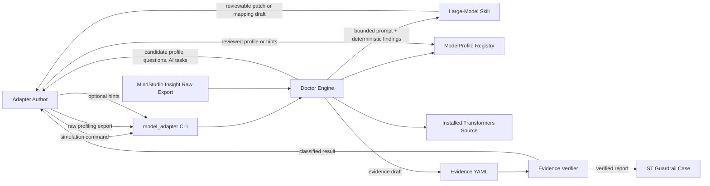
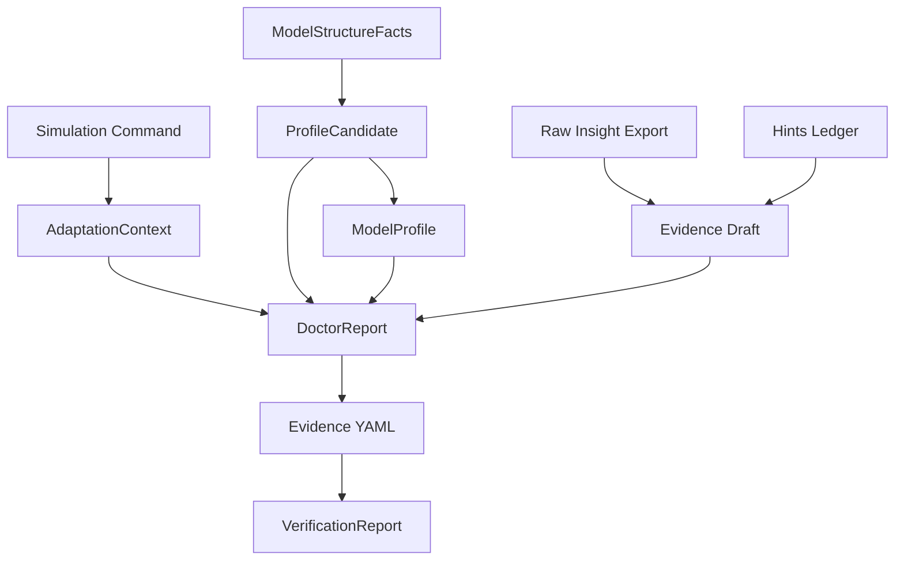
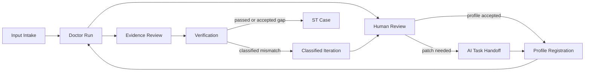
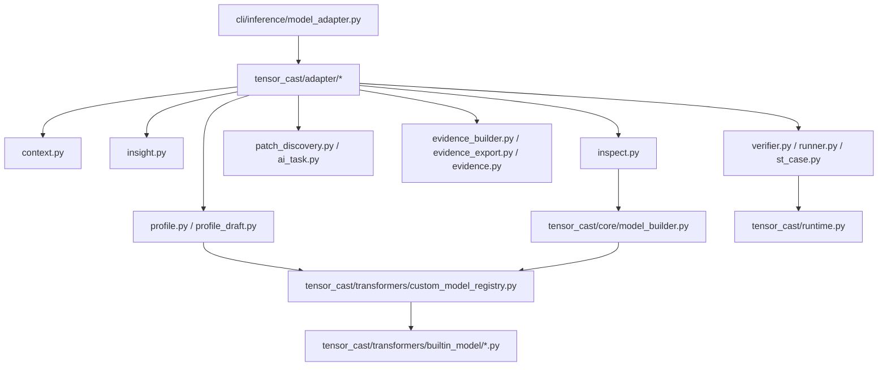
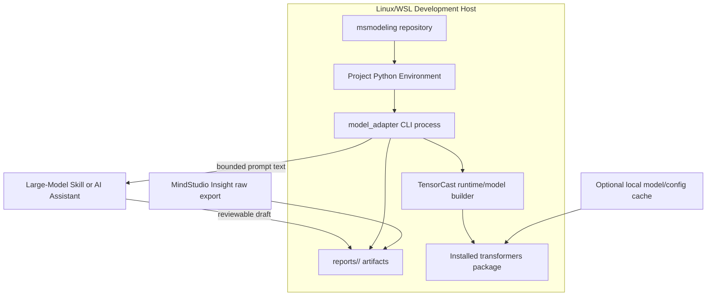
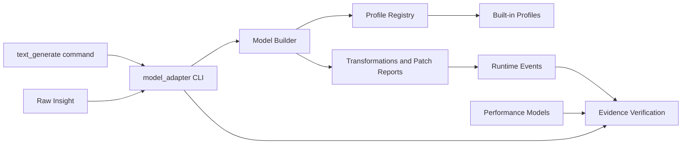
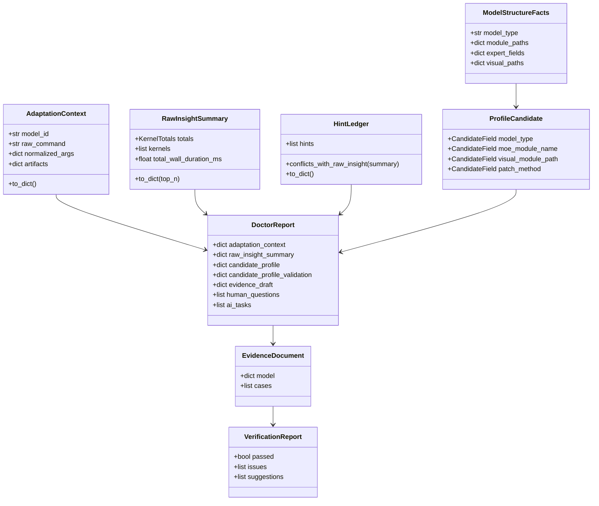
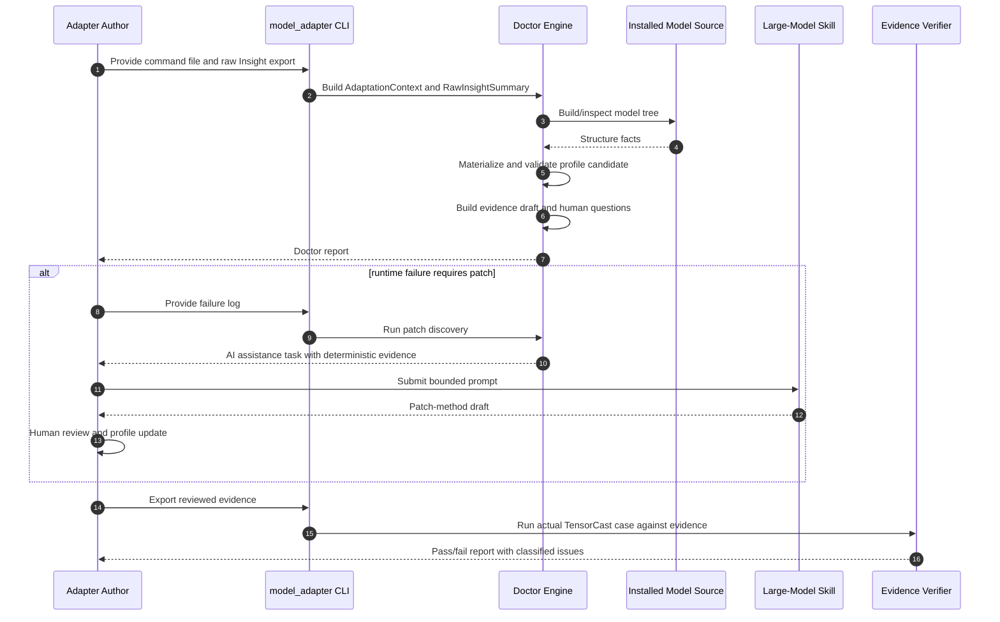
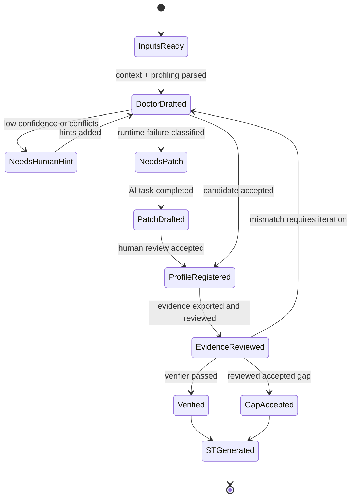

# Design Document: TensorCast New Model Adaptation Efficiency

## Revision History

| Date | Version | Change Description | Author | RFC Document |
| --- | --- | --- | --- | --- |
| 2026-06-03 | 1.0 | Initial design for the model adaptation efficiency workflow | kai1949, codex | N/A |

---

## 1. Background

TensorCast model adaptation currently depends on repeated manual investigation:
adapter authors inspect HuggingFace model source, infer `ModelProfile` fields,
discover runtime incompatibilities, map MindStudio Insight kernels to
TensorCast semantic operators, and then construct regression evidence. This
process is costly because each model has different module naming, multimodal
layouts, MoE/MLA/MTP details, runtime checks, and backend fusion behavior.

The proposed feature introduces a reusable adaptation workflow that combines
deterministic adapter programs with large-model skills. The deterministic
programs shall parse command and profiling inputs, inspect model structure,
validate profile candidates, classify failures, generate evidence drafts, and
verify actual TensorCast behavior. The large-model skill shall assist only in
the areas where deterministic analysis is insufficient, such as source-code
semantic reasoning, patch-method authoring, and uncertain operator mapping
review. AI output shall remain a draft until deterministic gates and human
review accept it.

The primary goals are:

| Goal | Design Direction | Success Signal |
| --- | --- | --- |
| Reduce required user input | Require only a TensorCast simulation command and matching MindStudio Insight raw profiling export | Doctor report can be produced from the two inputs |
| Make adaptation traceable | Preserve normalized command, raw profiling provenance, hints, profile candidates, and verification reports | Every generated artifact references its evidence source |
| Improve correctness | Gate AI-generated profile, patch, and evidence drafts through validation, dry-run, and verifier checks | Failures are classified with actionable next steps |
| Enable reusable regression | Convert verified evidence into ST guardrail cases | Adapted models have repeatable count and latency checks |
| Support blind replay | Validate the workflow by re-adapting an already supported model while hiding its existing profile | Replay discovers the expected Qwen3-VL structure and patch needs |

The design intentionally separates user-facing operating instructions from
software design. Detailed commands, input formats, and output review steps are
documented in `docs/en/user_guide/msmodeling_tensor_cast_new_model_adaptation_user_guide.md`.

## 2. Design

### 2.1 Design Principles

The adaptation system shall follow four principles:

| Principle | Meaning |
| --- | --- |
| Deterministic first | Programmatic inspection, validation, parsing, and verification run before AI reasoning is accepted. |
| Minimal human checkpoint | When uncertainty remains, the system asks for the smallest confirmed fact instead of asking the user to explain a full model. |
| Provenance preserving | Reports retain the raw command, raw profiling source, hints, candidate fields, and confidence values. |
| Replayable by design | Existing profiles may be ignored only in replay or audit mode, so the process can be tested without reading the known answer. |

### 2.2 System Context

The CLI is the public entry point. The doctor engine coordinates deterministic
subsystems. The large-model skill is not a replacement for the doctor; it is a
bounded assistant that receives structured evidence and produces reviewable
drafts.

### 2.3 Component Responsibilities

| Component | Responsibility | Non-Goal |
| --- | --- | --- |
| Adaptation Context | Parse a TensorCast simulation command into normalized model, workload, device, parallelism, quantization, and multimodal parameters | Guess a workload that was not supplied |
| Raw Insight Importer | Convert Insight raw export rows into normalized kernel summaries and total forward timing | Require the user to hand-write evidence |
| Structure Inspector | Scan the installed model tree for attention, MoE, MLA, MTP, and VL facts | Infer fields from model names alone |
| Profile Candidate Materializer | Create a minimal `ModelProfile` candidate with review-friendly fields | Mark a profile as verified before validation and runtime checks |
| Profile Validator | Check profile field type, required fields, default elision, and callable patch methods | Prove runtime semantic equivalence |
| Patch Discovery | Classify dry-run or smoke failures and produce bounded AI assistance tasks | Generate model-specific patch code directly |
| Evidence Builder | Merge raw profiling, normalized command, actual summaries, and hints into an evidence draft | Hide low-confidence mappings |
| Evidence Verifier | Compare expected evidence with actual TensorCast summaries and classify mismatches | Treat all mismatches as generic failures |
| ST Case Generator | Convert verified reports into regression guardrail case drafts or verified cases | Generate verified cases from unverified evidence |

### 2.4 4+1 Architecture Views

The design can be described with a 4+1 view model so that functional behavior,
runtime execution, source organization, deployment dependencies, and validation
scenarios are reviewed separately.

| View | Design Focus | Main Stakeholder | Key Artifact |
| --- | --- | --- | --- |
| Logical view | Domain abstractions, report schema, profile/evidence model | Adapter author, reviewer | Data model and UML class diagrams |
| Process view | Runtime workflow, iteration states, AI handoff boundaries | Adapter author, test owner | Sequence and state diagrams |
| Development view | Source modules and dependency direction | Maintainer | Component/module dependency diagram |
| Physical view | Local runtime, external artifacts, optional AI assistant | Tooling owner | Deployment diagram |
| Scenario view | Representative model onboarding and replay/audit cases | Reviewer, acceptance owner | Usage case and test scenarios |

#### 2.4.1 Logical View

The logical view centers on immutable evidence and reviewable drafts. The doctor
report shall preserve raw inputs, deterministic findings, candidate profile
fields, validation results, AI task packages, and evidence drafts in one
reviewable object. A profile shall not be treated as verified merely because it
is materialized; it moves toward verification only through validation, runtime
checks, evidence review, and verifier results.

#### 2.4.2 Process View

The process view is an iterative control loop. Deterministic tooling narrows the
unknowns first. Human review and large-model skill assistance are used only at
explicit checkpoints.

#### 2.4.3 Development View

The development view keeps adapter automation isolated from model execution and
registry internals. The CLI depends on adapter services; adapter services depend
on TensorCast model building, registry, runtime summaries, and profiling
parsers. Built-in model profiles remain the extension point for model-specific
metadata and reviewed patch methods.

#### 2.4.4 Physical View

The physical view assumes a local development host. Model source, TensorCast
code, raw profiling files, reports, and optional AI assistance are separate
runtime concerns. The deterministic tools shall not require network access after
the model source and dependencies are installed.

#### 2.4.5 Scenario View

The scenario view validates the architecture against representative cases:

| Scenario | Purpose | Expected Design Behavior |
| --- | --- | --- |
| New dense text model | Confirm minimal-profile path | Doctor emits only source-backed required fields and evidence draft |
| New MoE or MLA model | Confirm structure discovery and profile validation | Candidate fields include module names, expert keys, and validation issues if any |
| New VL model | Confirm visual path and linear mapping discovery | Candidate includes visual/language/layer paths and mapping patterns |
| Runtime patch failure | Confirm AI task boundary | Doctor classifies failure and emits bounded AI task, not final patch code |
| Qwen3-VL blind replay | Confirm no answer leakage | Existing Qwen3-VL profile is hidden during discovery and used only as final oracle |

### 2.5 Current Module and Surrounding Component Relationships

The feature is designed as an adapter automation layer around existing
TensorCast responsibilities. It shall not replace model building, profile
registration, quantization, runtime execution, or performance modeling. Instead,
it coordinates those components and records structured adaptation evidence.

| Existing Area | Relationship to Adapter Workflow | Design Constraint |
| --- | --- | --- |
| `cli/inference/text_generate` | Provides the simulation command whose semantics are parsed into `AdaptationContext` | The adapter command parser shall preserve the original command text |
| `tensor_cast/core/model_builder.py` | Builds the model instance used for structure inspection and runtime verification | Doctor shall use the same model-building path as normal simulation when possible |
| `tensor_cast/transformers/custom_model_registry.py` | Stores and resolves `ModelProfile` entries | Replay/audit profile hiding shall be scoped and reversible |
| `tensor_cast/transformers/builtin_model/*.py` | Holds reviewed model-specific profiles and patch methods | Generated drafts shall be review aids, not automatically trusted code |
| `tensor_cast/transformers/transformations.py` | Applies model transformations and may emit patch reports | Patch reports shall become review and blocking evidence |
| `tensor_cast/runtime.py` | Records actual runtime events for verification | Verification shall summarize actual operator counts and timings from runtime events |
| Performance model modules | Provide analytic or profiling latency estimates | Evidence verification shall distinguish profile errors from performance model coverage gaps |
| MindStudio Insight exports | Provide external measured kernel evidence | Parser shall preserve raw kernel names, counts, and total forward timing |

### 2.6 Interface Design

The design exposes three user-facing CLI operations and several structured
artifact interfaces. Detailed command examples are maintained in the usage
guide; this section defines the design contract.

#### 2.6.1 CLI Operations

| Operation | Required Inputs | Optional Inputs | Output | Failure Contract |
| --- | --- | --- | --- | --- |
| `doctor` | model id or command file | raw Insight file, hints file, failure log, ignored profiles, profile draft output | JSON doctor report and optional Python profile draft | Must report field-level validation, hint conflicts, or classified patch failure rather than a generic exception where possible |
| `export-evidence` | doctor report with `evidence_draft` | output path | YAML evidence document | Must fail if the report has no exportable evidence draft |
| `verify` | evidence YAML and resolvable model id | device/runtime overrides, ST case output | JSON verification report and optional ST case JSON | Must classify mismatch categories and return non-zero on failed verification |

#### 2.6.2 Report Interfaces

| Artifact | Producer | Consumer | Required Design Fields |
| --- | --- | --- | --- |
| `AdaptationContext` | command parser | doctor, evidence builder, verifier | `model_id`, `raw_command`, `normalized_args`, artifact paths |
| `RawInsightSummary` | raw Insight parser | evidence builder, hint conflict checker | `totals`, normalized kernels, categories, counts, timing |
| `DoctorReport` | doctor engine | human reviewer, skill, evidence exporter | context, raw summary, candidate profile, validation, patch discovery, AI tasks, evidence draft |
| `AiAssistanceTask` | patch discovery or unsupported-semantics classifier | large-model skill, human reviewer | task type, deterministic evidence, suspected locations, constraints, required output, verification commands, prompt text |
| `EvidenceDocument` | evidence exporter or reviewer | verifier, ST case generator | model metadata, cases, expected total forward, major ops, tolerances, confidence, accepted gaps |
| `VerificationReport` | verifier | reviewer, ST case generator | pass/fail, issue categories, severities, suggestions, actual summaries |

#### 2.6.3 Interface Stability Rules

| Rule | Rationale |
| --- | --- |
| Reports shall use explicit field names and source/confidence annotations | Reviewers and tests need stable provenance |
| Draft artifacts shall be distinguishable from verified artifacts | Prevent accidental promotion of unreviewed AI or heuristic output |
| Replay/audit options shall be explicit opt-in flags | Avoid silently hiding production profiles |
| Optional hints shall be additive and conflict-reporting | Preserve deterministic facts from command and raw profiling inputs |
| AI prompt text shall be generated from structured tasks | Keep AI assistance bounded and reproducible |

### 2.7 Data Model

The report schema shall preserve both candidate data and validation results.
This enables reviewers to distinguish "detected", "reviewed", and "verified"
states.

The main data entities shall use the following lifecycle semantics:

| Entity | Draft State | Reviewed State | Verified State |
| --- | --- | --- | --- |
| `ProfileCandidate` | Generated by structure inspection | Human-reviewed and materialized as `ModelProfile` | Validated and exercised by dry-run/smoke/verification |
| `AiAssistanceTask` | Generated by deterministic failure classification | Prompt response reviewed by adapter author | Resulting patch passes doctor and verification |
| `EvidenceDocument` | Exported from `evidence_draft` | Counts, confidence, tolerances, and accepted gaps reviewed | Verifier passes or gaps are accepted |
| ST case | Generated from verifier report | Reviewed for workload and tolerance | Marked verified only after passing evidence verification |

### 2.8 Core Workflow

The workflow is iterative. A failed verifier result shall route to a specific
next action: adjust profile fields, revise a patch, add hints, update operator
mapping, accept a documented fusion gap, or regenerate ST evidence.

### 2.9 State Model

This state model prevents accidental promotion of drafts. Only `Verified` or a
reviewed `GapAccepted` state may produce a verified ST guardrail.

### 2.10 Large-Model Skill and Deterministic Adapter Cooperation

The design uses a two-lane cooperation model:

| Lane | Inputs | Outputs | Trust Boundary |
| --- | --- | --- | --- |
| Deterministic adapter program | Command file, raw profiling export, hints, installed model tree, failure log | Candidate profile, validation report, evidence draft, AI task package, verification report | Authoritative for parsing, validation, counts, and pass/fail classification |
| Large-model skill | Structured AI task, failure evidence, source snippets, constraints, required outputs | Patch-method draft, mapping review draft, explanation of uncertain semantics | Advisory only; must be reviewed and rechecked by deterministic gates |

The doctor shall package AI tasks with deterministic findings, suspected
locations, constraints, and verification commands. The skill shall not invent a
profile from the model name alone, shall not hand-write evidence from scratch,
and shall not bypass validation. This cooperation is the main efficiency
mechanism: deterministic tools narrow the problem, while the skill accelerates
the small amount of semantic work that remains.

### 2.11 Quality Attribute Design

The following quality attributes are part of the design, not post-hoc
implementation preferences.

| Attribute | Design Mechanism | Review Signal |
| --- | --- | --- |
| Maintainability | Keep adapter automation in `tensor_cast/adapter/*`; keep model-specific metadata in built-in profile files; use structured dataclasses and explicit report schemas | New model rules do not require broad changes across unrelated modules |
| Extensibility | Add new inspectors, hint kinds, evidence categories, and failure classifiers behind stable report interfaces | New model families can extend candidate materialization without changing CLI contracts |
| Applicability | Support dense, MoE, MLA, MTP, VL, quantized, compile, and parallel workloads through normalized command fields and optional profile fields | Unsupported model behavior is reported as a bounded task or accepted limitation |
| Testability | Every deterministic stage has a serializable artifact and can be unit tested independently | Tests can assert parser output, candidate fields, validation issues, evidence, verifier classifications, and replay behavior |
| Security | Treat raw commands, profiling files, hints, and AI drafts as untrusted inputs; avoid executing AI output automatically; keep private paths and raw internal notes out of committed artifacts | Generated prompts are bounded; reviewed code is required before patch methods enter profiles |
| Traceability | Preserve source, confidence, raw command, raw profiling path, and hint provenance | A reviewer can explain why each profile/evidence field exists |
| Reproducibility | Use case directories, stable JSON/YAML artifacts, and replay profile hiding | A case can be rerun and compared with the same inputs |

#### 2.11.1 Maintainability and Extensibility

The adapter layer shall follow extension points rather than hard-coded
model-specific branches whenever possible:

| Extension Point | Intended Extension | Guardrail |
| --- | --- | --- |
| Structure inspector | New module pattern detectors for model families | Candidate fields must include source and confidence |
| Profile materializer | New recipe hints for MoE/MLA/VL/MTP families | Defaults and empty overrides must be omitted from review output |
| Patch discovery classifier | New failure taxonomy entries | AI tasks must include deterministic evidence and verification commands |
| Evidence builder | New kernel category or mapping rules | Low-confidence mappings must remain visible |
| Verifier | New issue categories or accepted-gap policy | Failed verification must provide next actions |

#### 2.11.2 Security and Safety

The workflow handles local commands, model paths, profiling exports, and AI
drafts. The design therefore treats all non-code artifacts as untrusted input
until parsed and reviewed.

| Risk | Mitigation |
| --- | --- |
| Raw command contains unintended shell behavior | Command parser shall normalize supported TensorCast arguments rather than execute arbitrary shell text during parsing |
| Raw Insight or hints contain malformed data | Parsers shall validate required fields and report conflicts |
| AI patch draft changes real-model semantics | Patch methods require human review and deterministic verification |
| Private paths leak into committed artifacts | Reports and prompts should use repo-relative paths where possible; submission checklist rejects local-only notes |
| Replay mode hides production profiles accidentally | `--ignore-existing-profile` is explicit, scoped, and restored after the replay context |

### 2.12 Usage Case

The following example illustrates intended usage without prescribing command
details, which are covered in the user guide.

An adapter author wants to onboard a virtual model `ExampleVL-7B`. The author
collects a TensorCast simulation command for a prefill workload and the matching
MindStudio Insight raw profiling export. The doctor builds an adaptation
context, scans the installed `transformers` implementation, detects a VL module
path, drafts a minimal `ModelProfile`, and emits evidence for the top attention
and visual MLP kernels. A dry-run failure shows data-dependent placeholder
masking in the model source, so patch discovery emits a `PATCH_METHOD_AUTHORING`
task. The author gives the bounded prompt to the model-adaptation skill, reviews
the patch draft, registers the profile, exports evidence, and runs verification.
When verification passes, the verified report becomes a regression guardrail
case.

### 2.13 Scope, Applicability, and Constraints

| Topic | Constraint |
| --- | --- |
| Required inputs | The workflow shall start from a simulation command and a matching raw Insight export. |
| Existing profiles | Normal adaptation may use existing profiles and recipes as references. Replay/audit mode may ignore named profiles to avoid circular validation. |
| Patch methods | Patch methods shall target TensorCast simulation compatibility and preserve normal tensor semantics as much as possible. |
| Evidence confidence | Low-confidence mappings shall be explicit and may produce review questions or warnings instead of false certainty. |
| Raw profiling | The raw Insight export shall include a `Totals` row so total forward latency can be compared. |
| Verification | Passing verification depends on available TensorCast operator coverage and performance model coverage; unsupported backend fusion may be recorded as an accepted gap after review. |

Applicability by model category:

| Model Category | Supported Adaptation Focus | Notes |
| --- | --- | --- |
| Dense decoder-only text model | `model_type`, attention/runtime evidence | Minimal profile may be enough |
| MoE model | MoE module name, expert count key, field overrides, routing evidence | Expert storage patterns may need custom expert wrappers |
| MLA model | MLA module name, TensorCast MLA class, field overrides | Validation shall reject incomplete MLA profile fields |
| MTP/speculative model | MTP block path and repeated-block behavior | Verification should include count-sensitive cases |
| Vision-language model | Visual/language paths, visual layer path, merger/MLP mappings, placeholder patch tasks | Qwen3-VL replay is the reference stress case |
| Quantized or parallel workload | Quantization and TP/DP/EP/MoE parallel normalized args | Evidence must account for communication or accepted gaps |

## 3. Usage Instructions

This design document provides only the conceptual usage case and constraints.
All step-by-step guidance, including exact commands, required files, optional
hints, doctor outputs, patch authoring handoff, evidence export, verification,
ST case generation, and Qwen3-VL replay/audit procedure, shall be maintained in
`docs/en/user_guide/msmodeling_tensor_cast_new_model_adaptation_user_guide.md`.

The user-facing workflow shall expose these public operations:

| Operation | Purpose | Expected Artifact |
| --- | --- | --- |
| Doctor | Inspect inputs, model structure, candidate profile, evidence draft, questions, and AI tasks | JSON doctor report |
| Export Evidence | Convert reviewed doctor evidence draft to YAML | Evidence YAML |
| Verify | Run TensorCast and compare actual behavior with evidence | JSON verification report |
| ST Case Output | Generate guardrail cases from verified or draft reports | ST case JSON |
| Replay/Audit | Hide an existing profile and re-run adaptation discovery | Replay doctor report |

The guide shall also describe the required review gates:

| Gate | Reviewer Checks |
| --- | --- |
| Candidate profile | Field values are minimal, source-backed, and validation passes |
| Patch draft | Patch is scoped to the failing simulation path and preserves expected semantics |
| Evidence YAML | Case input, expected counts, total latency, confidence, and accepted gaps are reviewed |
| Verification report | Failures are classified and resolved or explicitly accepted |
| ST case | Verified status is used only when evidence verification passes or gaps are reviewed |

## 4. Test Design

### 4.1 Test Strategy

The test design shall cover deterministic units, integration flows, and
end-to-end replay. Tests should verify that the workflow can progress from the
two required inputs to a reviewed report without relying on hidden local state
or existing profile answers.

The test pyramid shall align with the architecture views:

| Test Layer | Architecture View Covered | Primary Risk |
| --- | --- | --- |
| Unit tests | Logical and development views | Parser, validator, materializer, evidence, and verifier logic regressions |
| Integration tests | Process and development views | Doctor report assembly, profile registry scope, export/verify handoff |
| End-to-end tests | Scenario view | New-model workflow and replay/audit behavior |
| Security and robustness tests | Physical and interface views | Malformed inputs, untrusted AI drafts, private-path leakage |
| Documentation and contract checks | Interface view | CLI/report contract drift from usage guidance |

### 4.2 Unit Test Cases

| Area | Case | Expected Result |
| --- | --- | --- |
| Command parser | Parse a TensorCast simulation command with device, workload, quantization, and parallelism options | `AdaptationContext.normalized_args` matches the command |
| Raw Insight parser | Parse `Totals` and kernel rows | Total forward timing and normalized kernel names are preserved |
| Raw Insight validation | Kernel row appears before `Totals` | Parser rejects the file with an actionable error |
| Hints merge | Hints conflict with raw profiling counts or missing kernels | Conflicts are reported with provenance |
| Profile review | Default fields and empty overrides are omitted | Review dict contains only required fields |
| Profile validation | Invalid MoE/MLA override or non-callable patch method | Validation report contains field-specific errors |
| Patch discovery | Meta tensor placeholder and dynamic-mask failure log | `PATCH_METHOD_AUTHORING` task is generated |
| Evidence builder | Raw kernels plus hints produce major op evidence | Counts, confidence, and source are present |
| Verifier | Expected major op is missing, low confidence, or accepted gap | Issue severity and pass/fail result match policy |
| ST generator | Verified and unverified reports | Verified reports create verified cases; failed reports create draft cases |

### 4.3 Integration Test Cases

| Area | Case | Expected Result |
| --- | --- | --- |
| Doctor report | Context, raw Insight, hints, and model inspection are combined | Report includes candidate profile, validation, evidence draft, questions, and suggestions |
| Doctor with failure log | Failure taxonomy detects patch need | Report includes patch discovery and AI task fields |
| Export evidence | Doctor report has an evidence draft | YAML evidence document is generated without losing case data |
| Verify with model ID from evidence | Verify command omits positional model ID | Model ID is read from evidence metadata |
| Actual runner isolation | Verification runs multiple cases | Shared user input is not mutated across cases |
| Replay registry isolation | Existing profile is ignored inside replay scope only | Registry state is restored after the replay scope |

### 4.4 End-to-End and Replay Test Cases

| Scenario | Design |
| --- | --- |
| Existing adapted model replay | Select an already adapted text or MoE model, temporarily remove or ignore its profile, re-run structure inspection and candidate materialization, then compare key TensorCast operators with the registered-profile baseline. |
| Qwen3-VL blind replay | Treat an already adapted Qwen3-VL model as unadapted by using replay/audit profile hiding. The test shall use a tiny config-only fixture to build the installed Qwen3-VL model tree without downloading weights, shall not use the existing TensorCast `qwen3_vl.py` profile as an input, and shall verify that the doctor rediscovers VL paths, visual merger/MLP linear mappings, model family, and patch-authoring evidence. |
| Qwen3-VL comparison | After blind replay produces a candidate, compare the replay candidate and patch task expectations with the known adapted Qwen3-VL behavior as an oracle. The oracle is used only after replay discovery completes. |
| Raw Insight evidence flow | Use a representative raw Insight export and command to generate evidence, export YAML, run verification, and classify remaining gaps. |

The Qwen3-VL replay test is important because it simulates the exact risk the
feature is meant to reduce: adapting a complex VL model without reading an
existing TensorCast answer. It should demonstrate that deterministic discovery
and the model-adaptation skill can cooperate to recover the same adaptation
shape with bounded human review.

### 4.5 Acceptance Criteria

| Category | Criteria |
| --- | --- |
| Functional | Doctor can create a complete report from a command file and matching raw Insight export. |
| Functional | Candidate profiles include source-backed fields and validation results. |
| Functional | Patch discovery produces AI assistance tasks instead of direct model-specific patch code. |
| Functional | Evidence export and verification preserve reviewed case data and classify mismatches. |
| Functional | Verified reports can produce ST guardrail cases. |
| Quality | AI-generated drafts are not trusted until profile validation, dry-run, evidence verification, and human review pass. |
| Quality | Replay mode does not depend on the existing profile of the model being replayed. |
| Quality | Qwen3-VL blind replay can rediscover the expected VL structure and patch need under profile hiding. |

### 4.6 Quality Attribute Test Matrix

| Quality Attribute | Test Design | Acceptance Signal |
| --- | --- | --- |
| Maintainability | Add a new synthetic model family detector through adapter modules only | No unrelated model builder or runtime changes are required |
| Extensibility | Add a new hint kind or failure category with focused unit tests | Existing doctor/export/verify interfaces remain compatible |
| Applicability | Run dense, MoE, MLA, and VL fixture cases through candidate materialization | Each category produces minimal source-backed fields |
| Testability | Assert every major stage can serialize a deterministic artifact | Tests can inspect JSON/YAML or dataclass dictionaries without running full E2E |
| Security | Feed malformed raw Insight, conflicting hints, and suspicious failure logs | Parser reports structured errors or AI tasks without executing untrusted content |
| Traceability | Check generated evidence and profile review output for source/confidence fields | Reviewer can trace every non-default field to a source |
| Reproducibility | Rerun replay/audit with profile hiding and compare deterministic fields | Registry state is restored and candidate fields are stable |

### 4.7 Interface and Contract Tests

| Contract | Test |
| --- | --- |
| CLI help remains available | `doctor --help`, `export-evidence --help`, and `verify --help` load successfully |
| Doctor report schema is stable | Focused tests assert required top-level fields and nested validation fields |
| Evidence export requires an evidence draft | Export test rejects reports without `evidence_draft` |
| Verify reads model ID from evidence | Verify test omits positional model id and confirms metadata is used |
| ST case status follows verification result | Passed reports produce `verified`; failed reports produce `draft` |
| Replay profile hiding is scoped | Registry state before and after `ignore_existing_profile` is identical |

### 4.8 Security and Robustness Test Cases

| Risk | Test Case | Expected Result |
| --- | --- | --- |
| Malformed raw Insight | Missing `Totals`, bad numeric values, or kernel rows before totals | Parser rejects input with actionable error |
| Conflicting hints | Hint count or mapping conflicts with raw profiling | Doctor reports conflicts and human questions |
| Untrusted AI output | Patch draft is represented only as reviewed profile code, not executed by doctor | Doctor emits task package; no automatic code execution |
| Private path leakage | Reports and generated prompts are checked for local-only paths before submission | Local-only artifacts are not staged |
| Replay misuse | `--ignore-existing-profile` is used outside scoped replay context | Tests verify registry restoration and explicit ignored profile reporting |
