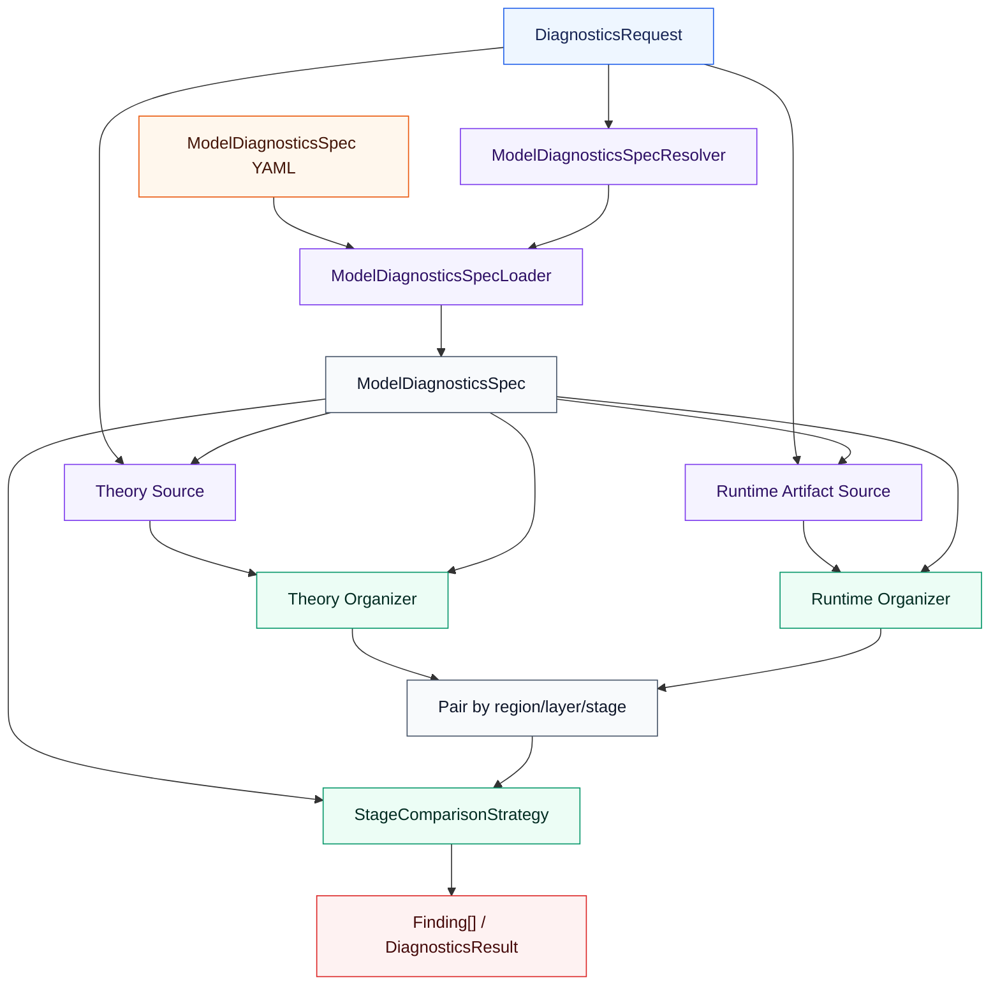
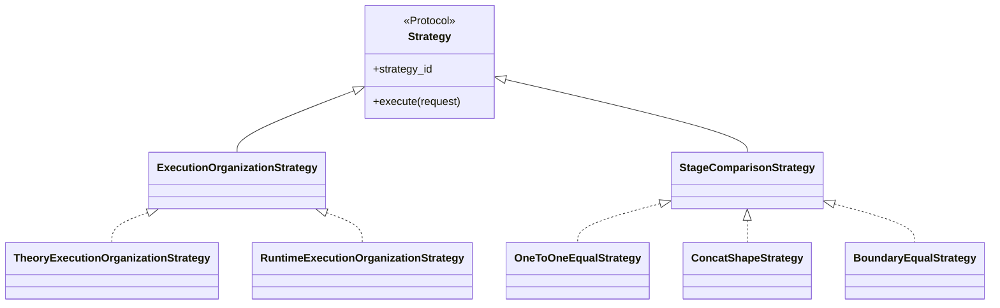

# Design Document: model_diagnostics 仿真结构诊断 / Simulation Structure Diagnostics

Status: Initial Release Review

## Revision History (修订记录)

| Date (日期) | Version (修订版本) | Change Description (修改描述) | Author (作者) | RFC Document (RFC文档) |
| --- | --- | --- | --- | --- |
| 2026-07-27 | 1.0 | 首次上库版本：交付 Theory→Runtime 算子结构及 Tensor shape/dtype 诊断模块、Runtime Artifact 边界、YAML Theory Spec、Run Profile 样例、CLI 与回归测试 | ChenHuiwen | N/A |
| 2026-08-12 | 1.1 | 增加 DeepSeek V3 Dense-prefix/MoE 混合层、MLA/DSA/MoE Theory、W8A8/W4A8 与 MTP 纵向覆盖 | ChenHuiwen | N/A |
| 2026-08-14 | 1.2 | 分类 3 扩展为 DeepSeek V3/V3.2、GLM-5/5.1、Kimi K2/K2.5/K2.6 文本兼容矩阵，并增加代表性 TP/EP、DP/MDP 覆盖 | ChenHuiwen | N/A |
| 2026-08-15 | 1.3 | 分类 3 并行覆盖改为逐型号（每型号 TP=2/EP=2、DP=2/MDP=2 组合）；新增 `MOE_GATE_TOKENS` 契约并补充 sparse_attention 机械算子忽略 | ChenHuiwen | N/A |
| 2026-08-15 | 1.4 | 评审修复：lm_head TP 默认值单测、`explicit_moe_gate` 语义说明、config 一致性注释；E2E 按例行代表集 + nightly 全矩阵分层 | ChenHuiwen | N/A |

---

## 1. Background (背景描述)

msmodeling / TensorCast 通过仿真估算模型在昇腾等设备上的理论性能。仿真结果若在
**语义算子完备性、Tensor shape / dtype** 上出错，后续 Roofline、时延与寻优结论都会失真。
现有 `--dump-input-shapes` 等输出偏人工阅读聚合，缺少稳定、可机读、可回归的完整调用序与
输出 Tensor 元数据，难以在 CI 中自动判定“建模结构是否正确”。

本特性在 msmodeling 仓库的既有 `tools/` 目录中新增
`tools.model_diagnostics`，对 **Theory（理论期望）与 Runtime（仿真产物）** 做成对校验。
诊断核心与 Runtime / `OpInvokeInfo` **功能解耦**：该工具仅在
`sources/runtime_capture.py` 内接触 TensorCast 内部运行对象并生成中立
`SimulationExecutionArtifact`；Artifact 之后的 Source、domain、organization、
comparison 和 application 不依赖 Runtime，也不输出由采集侧代写的 layer / stage /
规则结论。

### 1.1 Goals (目标)

| Goal | Design Direction | Success Signal |
| --- | --- | --- |
| 尽早发现结构错误 | M1 校验算子完备性与 Tensor shape/dtype | 注入缺失/错误 shape 的 fixture 失败且可定位 |
| 单一语义源 | 一份静态 `ModelDiagnosticsSpec` 驱动 Theory、组织与比较 | 改 YAML 即可调整期望，无需改比较核心 |
| 可扩展来源 | 来源中立端口；当前只交付 Theory↔Runtime | 未来外部 Profiling 等可按同一契约接入 |
| 仓库内清晰归属 | 包放在仓库根目录，与 `tensor_cast` 平级 | 依赖边界测试证明 domain 不 import Runtime |

### 1.2 Non-Goals (非目标)

- 不证明与真实 NPU 数值等价，不做 timing / Roofline / trace 可视化实现。
- 不要求仿真侧输出诊断模块的 `stage_id`、规则 id 或 PASS/FAIL。
- **当前工作流不实现 Profiling** 采集、Source、组织、映射或集成；仅保留来源中立扩展点。
- 不把七类模型结构硬编码为中心条件分支；不修改外部 shape/dtype 参考表作为本特性一部分。

---

## 2. Design (方案设计)

### 2.1 Design Principles (设计原则)

| Principle | Meaning |
| --- | --- |
| Context 已知 | `ModelRunContext` 由调用方提供，不从执行记录反推。 |
| 一份静态规格 | `ModelDiagnosticsSpec → RegionSpec → LayerSpec/StageSpec` 同时驱动 Theory、Runtime 组织与比较。 |
| Region 独立层号 | language / MTP / vision / video 等各自维护从 0 开始的物理层号空间；请求按 region 显式给出该 region 内的物理层号，不使用跨 region 的全局层号。 |
| 选中层全阶段 | 对每个选中层，声明的全部 stage 都必须比较。 |
| 成对比较 | 一次校验恰好两个来源；不做三方投票或聚合。 |
| Strategy 可替换 | 组织按 `SourceKind` 注入；比较按 `region_id + stage_id + 有序来源对` 解析策略。 |
| Artifact 解耦 | `runtime_capture.py` 是唯一 Runtime 接触点；诊断核心只消费稳定 artifact / 领域记录。 |

### 2.2 Placement and Package Layout (包放置与目录)

工具位于仓库已有的 `tools/` 目录，不作为顶层公共包，也不进入 wheel：

```text
msmodeling/                    # repository root
├── tensor_cast/
├── serving_cast/
├── tools/
│   └── model_diagnostics/     # 本特性；仅支持源码仓运行
│       ├── domain/            # 不可变领域值；无 PyTorch/TensorCast 依赖
│       ├── interfaces/        # Protocol / ABC
│       ├── specification/     # YAML loader + schema + builtin specs
│       ├── sources/           # theory + simulation_artifact
│       ├── organization/      # Theory / Runtime 组织策略
│       ├── comparison/        # stage 比较策略与 Tensor evaluator
│       ├── application/       # ModelDiagnosticsRunner
│       ├── rendering/         # Console / self-contained HTML reports
│       ├── integrations/
│       │   └── pytest_assertions.py
│       └── builtin.py         # composition root
└── tests/
    └── model_diagnostics/     # 与工具内部结构镜像的独立测试树
```

领域层不得依赖 PyTorch、YAML 解析库、Renderer 或 `tensor_cast` Runtime。
`sources/runtime_capture.py` 是包内唯一允许接触 ModelRunner、PyTorch 和 Runtime
内部对象的采集边界；它执行一次非侵入采集并只输出
`SimulationExecutionArtifact`。`sources/simulation_artifact.py` 及 Artifact 后的
Source、organization、comparison、application 均不得导入 Runtime。采集逻辑只有
`runtime_capture.py` 使用时不额外拆分目录；出现第二个消费者或独立生命周期后再提取。

### 2.3 System Architecture (总体架构)



主流程：

```text
DiagnosticsRequest
  -> resolve exactly one ModelDiagnosticsSpec
  -> load and type-check that Spec
  -> load two ModelExecutionRecord (Theory + Runtime)
  -> organize each into selected Region/Layer/Stage records
  -> pair by region_id + optional layer_index + stage_id
  -> resolve StageComparisonStrategy by ordered source pair
  -> aggregate Finding -> DiagnosticsResult
```

绿色节点为可替换 Strategy：组织实现由 composition root 按 `SourceKind` **直接注入**，
模型 YAML **不选择**组织实现；比较策略因 stage 与来源对而变，由 Registry 解析。

### 2.4 Core Domain (核心领域)

#### 2.4.1 Request and Context

```python
@dataclass(frozen=True)
class DiagnosticsRequest:
    context: ModelRunContext
    selected_layers: Mapping[str, tuple[int, ...]]  # region_id -> physical indices
    selected_stage_regions: tuple[str, ...] = ()    # request-level stages, including mixed stage/layer regions


@dataclass(frozen=True)
class ModelRunContext:
    model_name: str
    entrypoint: str | None
    phase: ExecutionPhase | None
    batch_size: int | None
    query_length: int | None
    context_length: int | None
    parallel: ParallelContext
    model_config: Mapping[str, object]
    quantization_config: Mapping[str, object]
```

`entrypoint` 表示稳定、面向用户的模型业务入口（例如 `text_generate`），用于精确选择
Spec。采集函数、adapter 或测试包装器必须原样保留调用方 Context，不得把自身函数名写入
`entrypoint`。同一次诊断的 Theory、Runtime Artifact 与 `DiagnosticsRequest` 必须复用完全
相同的 Context。

最小公共值类型如下；枚举值和并行字段可随首批 builtin Spec 扩展，但不得用 Runtime
内部对象替代：

```python
class ExecutionPhase(Enum):
    PREFILL = "prefill"
    DECODE = "decode"


@dataclass(frozen=True)
class ParallelContext:
    tensor_parallel_size: int = 1
    pipeline_parallel_size: int = 1
    data_parallel_size: int = 1
    expert_parallel_size: int = 1


TensorShape = tuple[int, ...]
DType = str  # 规范化名称，例如 "float16"、"bfloat16"、"int8"
```

领域请求中的 `selected_layers` 是内部 region→region 内物理层号映射（如
`{"language": (0, 1, 5), "mtp": (0, 1)}`），不支持
`first/middle/last` 名称检索；每个已声明 region 的层集合不得为空，并拒绝负数、越界，随后去重升序。
整个 mapping 可在只请求 `selected_stage_regions` 时为空，但两种选择不能同时为空。
不同 region 的层号互不换算：例如 `language[1]` 与 `mtp[1]` 分别表示各自 region 的第二个
物理层，Organizer 直接以 `(region_id, layer_index)` 定位，不存在全局连续层号到 region 层号的隐式映射。

#### 2.4.2 Execution Records

```python
class SourceKind(Enum):
    THEORY = "theory"
    RUNTIME = "runtime"


@dataclass(frozen=True)
class ModelExecutionRecord:
    source_kind: SourceKind
    run_context: ModelRunContext
    operator_calls: tuple[OperatorCallRecord, ...]


@dataclass(frozen=True)
class OperatorCallRecord:
    call_index: int
    operator_name: str
    original_operator_name: str | None
    tensors: tuple[TensorInfo, ...]
    source_reference: str | None = None


@dataclass(frozen=True)
class StageExecutionRecord:
    stage_id: str
    operator_calls: tuple[OperatorCallRecord, ...]


@dataclass(frozen=True)
class LayerExecutionRecord:
    layer_index: int
    layer_kind: str
    stages: tuple[StageExecutionRecord, ...]


@dataclass(frozen=True)
class RegionExecutionRecord:
    region_id: str
    stages: tuple[StageExecutionRecord, ...] = ()
    layers: tuple[LayerExecutionRecord, ...] = ()
```

推断出的 region / layer / stage **不写回** `OperatorCallRecord`。Organizer 直接返回本次请求的
`tuple[RegionExecutionRecord, ...]`，不恢复大而全的中间“已组织整模”对象。

#### 2.4.3 Tensor

```python
class TensorDirection(Enum):
    INPUT = "input"
    OUTPUT = "output"
    INOUT = "inout"


@dataclass(frozen=True)
class TensorSlot:
    direction: TensorDirection
    index: int
    name: str | None = None


class _TensorSlots:
    def __init__(self, direction: TensorDirection): ...
    def __getitem__(self, index: int) -> TensorSlot: ...


INPUT = _TensorSlots(TensorDirection.INPUT)
OUTPUT = _TensorSlots(TensorDirection.OUTPUT)


@dataclass(frozen=True)
class TensorInfo:
    slot: TensorSlot
    shape: TensorShape | None
    dtype: DType | None
```

原始嵌套容器路径只允许留在 artifact DTO / Adapter 展平过程，不进入领域 `TensorInfo`。
缺失的必需 shape/dtype 记为 `INCOMPLETE`，不得静默当作通过。
`_TensorSlots` 只是私有下标语法辅助器，不是 Factory 或 Strategy；它校验 index 为非负整数，
使规则可以写成 `INPUT[0]`、`OUTPUT[1]`。需要 `name` 时仍显式构造 `TensorSlot`。

### 2.5 Static Model Specification (静态模型规格)

配置领域只增加有业务意义的 region 层次：

```text
ModelDiagnosticsSpec
└─ RegionSpec[]          # 声明顺序 = 执行顺序
   ├─ StageSpec[]        # 非重复阶段（input/output/sampler/...）
   └─ LayerSpec[]        # 重复层结构（language/MTP/vision/...）
      └─ StageSpec[]
```

```python
@dataclass(frozen=True)
class ShapeExpr:
    expression: str


@dataclass(frozen=True)
class DTypeExpr:
    expression: str


@dataclass(frozen=True)
class TheoryTensorSpec:
    shape: ShapeExpr | None = None
    dtype: DTypeExpr | None = None


@dataclass(frozen=True)
class TheoryOperatorSpec:
    operator_name: str
    tensors: Mapping[TensorSlot, TheoryTensorSpec] = field(default_factory=dict)
    activation: str | None = None


@dataclass(frozen=True)
class TheoryStageOptions:
    operators: tuple[TheoryOperatorSpec, ...]


@dataclass(frozen=True)
class RuntimeStageOptions:
    boundary_operators: tuple[str, ...]
    ignored_operators: tuple[str, ...] = ()


SourceStageOptions = TheoryStageOptions | RuntimeStageOptions


@dataclass(frozen=True)
class OneToOneOptions:
    mapping: "TensorMapping"


@dataclass(frozen=True)
class ConcatOptions:
    mapping: "TensorMapping"
    axis: int


@dataclass(frozen=True)
class BoundaryEqualOptions:
    mapping: "TensorMapping"


ComparisonOptions = OneToOneOptions | ConcatOptions | BoundaryEqualOptions


@dataclass(frozen=True)
class ComparisonSpec:
    strategy_id: str
    options: ComparisonOptions


@dataclass(frozen=True)
class StageSpec:
    stage_id: str
    source_options: Mapping[SourceKind, SourceStageOptions]
    comparisons: Mapping[tuple[SourceKind, SourceKind], ComparisonSpec] = field(
        default_factory=dict
    )


@dataclass(frozen=True)
class LayerSpec:
    layer_kind: str
    stages: tuple[StageSpec, ...]


@dataclass(frozen=True)
class LayerLayoutRule:
    strategy: str
    layer_kind: str
    count_from: str


@dataclass(frozen=True)
class RegionSpec:
    region_id: str
    stages: tuple[StageSpec, ...] = ()
    layer_layout: tuple[str, ...] = ()
    layer_specs: Mapping[str, LayerSpec] = field(default_factory=dict)


@dataclass(frozen=True)
class ModelDiagnosticsSpec:
    schema_version: str
    spec_id: str
    spec_version: str
    model_category: str
    matches: "SpecMatchCriteria"
    regions: tuple[RegionSpec, ...]
    # Optional comparison-time operator-name overrides. Builtin defaults are
    # merged by the Runner before building StageComparisonRequest.
    operator_aliases: Mapping[str, str] = field(default_factory=dict)


@dataclass(frozen=True)
class SpecMatchCriteria:
    entrypoints: tuple[str, ...] = ()
    model_types: tuple[str, ...] = ()
    required_features: tuple[str, ...] = ()
```

这里只有一份 YAML。YAML parser 产生的原始 `Mapping[str, object]` 是不可信的边界数据，
不另建一套公开 Raw 类树，也不保留平行的 JSON Schema 文件。Loader 与 composition root
注入的 Source/comparison options parser 严格检查必需字段、未知字段、值类型、Tensor slot
键格式和已注册 id，再将 options 转换成上述不可变类型；任何不合法输入抛
`SpecificationLoadError`。最终 `ModelDiagnosticsSpec` 中不保留任意字典 options，策略实现
也不得重复解析原始配置。

`ShapeExpr` 和 `DTypeExpr` 是受限表达式值对象，只允许 Loader/求值器声明的常量、变量和运算符；
它们不执行 Python 代码。`TensorMapping` 的定义见阶段比较章节。
YAML 边界使用 `layer_layout_rule: LayerLayoutRule` 表达尚未展开的生成规则；Loader 根据
Context 将其展开为领域 `RegionSpec.layer_layout: tuple[str, ...]`，其中每个位置记录对应
物理层的 `layer_kind`。两个字段名称和生命周期不同，不允许把规则对象直接赋给领域字段。
对会随本次运行变化的重复层数，`count_from` 必须绑定
`model_config.effective_num_hidden_layers`（本次执行/捕获层数），与 Artifact 的
`run_context` 同一字段关联；`num_hidden_layers` 仅表示模型结构深度，不直接驱动 layout
展开。Theory 仍只构建请求选中的物理层；Runtime 按展开后的 layout 顺序扫描。

除单一 kind 的 `repeat` 外，Loader 支持 `prefix_then_repeat`：总层数取
`count_from`，前缀长度取 `prefix_count_from`，前缀与后续分别引用
`prefix_layer_kind` 和 `repeated_layer_kind`。DeepSeek V3 使用捕获后的
`effective_num_hidden_layers` 与 HF config 的 `first_k_dense_replace`，展开为 Dense 前缀和
MoE 后缀；两种 kind 分别整包引用 decoder fragment，不通过 stage group 选择层类型。

YAML 示例（节选）：

```yaml
schema_version: 1
spec_id: qwen3_dense_v1
spec_version: 1.0.0
model_category: qwen3_dense
matches:
  entrypoints: [text_generate]
  model_types: [qwen3]
  required_features: [dense]

regions:
  language:
    layer_layout_rule:
      strategy: repeat
      layer_kind: dense
      count_from: model_config.effective_num_hidden_layers
    layer_specs:
      dense:
        stages:
          - id: attention_qkv
            source_options:
              theory:
                modules:
                  - name: q_projection
                    tensors:
                      INPUT[0]: {shape: "[T, H]", dtype: ACT}
                      OUTPUT[0]: {shape: "[T, Lh * Dh]", dtype: OUT}
                  - name: k_projection
                    tensors:
                      INPUT[0]: {shape: "[T, H]", dtype: ACT}
                      OUTPUT[0]: {shape: "[T, Lkv * Dh]", dtype: OUT}
                  - name: v_projection
                    tensors:
                      INPUT[0]: {shape: "[T, H]", dtype: ACT}
                      OUTPUT[0]: {shape: "[T, Lkv * Dh]", dtype: OUT}
              runtime:
                boundary_operators: [rms_norm]
                ignored_operators: [rms_norm, view, permute]
            comparisons:
              theory-runtime:
                strategy: concat_shape
          - id: dense_ffn
            source_options:
              theory:
                modules:
                  - name: gate_up_projection
                    tensors:
                      INPUT[0]: {shape: "[T, H]", dtype: ACT}
                      OUTPUT[0]: {shape: "[T, 2 * Ftp]", dtype: OUT}
                  - name: swiglu
                    tensors:
                      INPUT[0]: {shape: "[T, Ftp]", dtype: ACT}
                      INPUT[1]: {shape: "[T, Ftp]", dtype: ACT}
                      OUTPUT[0]: {shape: "[T, Ftp]", dtype: OUT}
                  - name: down_projection
                    tensors:
                      INPUT[0]: {shape: "[T, Ftp]", dtype: ACT}
                      OUTPUT[0]: {shape: "[T, H]", dtype: OUT}
              runtime:
                boundary_operators: [add_rms_norm2]
                ignored_operators: [rms_norm, view]
```

Theory YAML 的 `modules` 是有序算子列表；每个算子用 `name` + 局部 `tensors` 声明
`INPUT[n]` / `OUTPUT[n]` 的 shape/dtype。同一 Tensor 的属性放在一起，Loader 不再解析
`q_projection.INPUT[0]` 这类复合 key，也不保留平行的 `shape_expressions` /
`dtype_expressions`。领域模型同步为 `TheoryStageOptions.operators`，不在 Loader 后再
展平成旧结构。部分信息允许只写 `shape` 或只写 `dtype`。

YAML 只在需要偏离默认时写 `comparisons`，键为有序来源对（如 `theory-runtime`）。
不得写空映射 `comparisons: {}`，也不得再声明 `default_comparison`。Runner 解析某
来源对时先查 `comparisons[(left, right)]`；缺失则使用内置默认 `one_to_one`
（positional mapping）。特例（如 `concat_shape`）必须显式写出。

Loader 在校验开始前完成 schema、region/stage 唯一性、`layer_layout_rule` 按 Context 展开、
策略 id 注册与 options schema 检查。region 声明顺序必须保留，供顺序 Runtime 扫描在完成末个
请求 region 后安全停扫。

#### 2.5.1 Stage Fragments and Spec Composition（Stage 构件与组合）

可复用 stage 定义存放在 `tools/model_diagnostics/specs/theory_fragments/`，由稳定
`fragment_id` 注册。`mtp_framework` 声明公共 MTP 协议、稳定 stage group 和经验证的
TensorCast Runtime 默认分段规则；可选的 `mtp_predictor_adapter` 只描述 predictor
前后的模型增量结构适配；
模型类别 `model_decoder` 同时声明 Theory 契约与该模型 Runtime 的默认分段规则。
模型 Spec 只在模型确有差异时覆盖 Runtime 或 comparisons。YAML 不得写入 Python import
path，也不得使用 `eval`；
未知 ID 必须在 **load** 阶段失败。

| `fragment_kind` | 职责 | 典型内容 |
|---|---|---|
| `mtp_framework` | 通用 MTP 框架及 TensorCast 默认绑定 | request stages、公共 input fusion、proposal prefix/suffix、wrapper output，以及稳定 stage groups |
| `mtp_predictor_adapter` | 可选的 predictor 前后增量适配 | 只供确有差异的模型增加前置或后置 stage；普通模型不需要 adapter |
| `model_decoder` | 模型类别 decoder 多 Source 默认定义 | 每个 stage 的 Theory modules；可选 Runtime boundary / ignored operators 和默认 comparisons |

模型 Spec YAML 通过以下 DSL **引用** fragment，而不是复制 stage 正文：

```yaml
language:
  layer_specs:
    dense:
      include_fragment: qwen3_dense_decoder_v1

mtp:
  activation: mtp_enabled
  layer_layout_rule:
    strategy: repeat
    layer_kind: dense_mtp
    count_from: model_config.effective_num_mtp_layers
  compose:
    framework: mtp_framework_v1
    predictor: qwen3_dense_decoder_v1
  runtime_options:                        # 可选：按稳定 stage ID 覆盖公共默认值
    proposal_selection:
      boundary_operators: [model_specific_boundary]
      ignored_operators: [...]
  comparisons:                            # 可选：仅在偏离默认 one_to_one 时覆盖
    proposal_selection:
      theory-runtime:
        strategy: boundary_equal
        options: {...}
```

约束：

1. framework、adapter 与 decoder fragment 都可携带 Theory、Runtime 和 comparisons
   默认值；公共 Runtime 规则是可覆盖的默认值，不被解释为所有后端永远相同。
2. layer-level `include_fragment` / `include_fragments` 按 fragment 顺序导入全部
   stage 的 Theory、Runtime 和 comparisons 默认值。同一 `model_decoder` 也可作为
   MTP `compose.predictor`，保证 decoder 定义单一权威来源。
3. Region-level MTP `compose` 同时导入 framework request stages，并按 framework
   proposal prefix → adapter before predictor → model decoder → adapter after
   predictor → framework proposal suffix 生成 proposal layer template。组合层的
   `runtime_options` 用于补充或覆盖 fragment 默认值；调用方 `comparisons` 按稳定
   `stage_id` 覆盖 fragment 默认值。未知
   stage ID 必须在 load 阶段失败。
4. composition root 必须创建 **唯一** `TheoryFragmentRegistry`，同时注入
   `create_builtin_source_options_parsers(fragment_registry=...)` 与
   `YamlModelDiagnosticsSpecLoader(fragment_registry=...)`；Parser 的
   `include_*` 与 Loader 的 `compose` 不得各自 `load` 出两份 registry。

Qwen3 Dense 组合关系示例：

```text
common framework including input_fusion (mtp_framework_v1)
+ optional model-specific predictor adapter
+ decoder Theory + Runtime defaults (qwen3_dense_decoder_v1)  ← language 与 MTP 共用
```

DeepSeek V3 使用相同组合规则，但 language layer 由 `prefix_then_repeat` 在
`deepseek_v3_dense_decoder_v1` 与 `deepseek_v3_moe_decoder_v1` 间选择；MTP predictor
复用 MoE decoder fragment，公共 request/proposal wrapper 仍来自 `mtp_framework_v1`。
MLA、DSA、routed/shared expert 参数均在模型加载后从 HF/model config 捕获到 Context，Theory
环境据此派生 `Qlora/KVlora/QKnope/QKrope/Vh/Hmla`、`Dsa_*`、`E/Te` 和
`Nshared/Fshared`，不由 Profile 重复配置。

```python
class ModelDiagnosticsSpecResolver(Protocol):
    def resolve(self, context: ModelRunContext) -> str: ...


class ModelDiagnosticsSpecLoader(Protocol):
    def load(self, spec_id: str) -> ModelDiagnosticsSpec: ...


class ModelDiagnosticsSpecProvider(Protocol):
    def get(self, context: ModelRunContext) -> ModelDiagnosticsSpec: ...
```

Resolver/Registry 是选择器，Factory 不是主抽象。解析规则如下：

1. 只用 Context 中稳定、与实现无关的模型身份和 feature 键精确匹配 `matches`。
2. 零匹配报 `UnsupportedModelSpec`，多匹配报 `AmbiguousModelSpec`；禁止“最接近”或
   依赖 msmodeling 内部分类分支作为正确性 oracle。
3. `matches` 与结构定义放在同一份 Spec YAML，避免独立索引与内容漂移。

正式 `DiagnosticsRequest` 不提供 `spec_id` 覆盖入口。多匹配代表 Spec 条件重叠，必须修正
配置；测试或开发工具如需单独检查某份 Spec，可直接调用 Loader，不改变生产解析路径。

现有模型 shape/dtype 规则可由离线转换工具生成**同一份正式 Spec YAML 的第一版草稿**，
但 Runtime 不解析规则说明文档；草稿必须经人工复核、schema 校验和代表模型验证后才能
进入 builtin specs。本文已完整定义转换结果必须满足的领域结构和运行时契约，不依赖仓外
文档才能理解或实现。

Theory 的 Spec 在每个算子下保存符号化 shape/dtype 公式而非具体值。Provider 得到 Spec
后，Theory Source 根据 Context 构造受约束的求值环境（如 `B/Q/S/T/H/TP/EP/MTP`），按
`operators → operator.tensors → ShapeExpr/DTypeExpr` 求值得到具体 `TensorInfo`，再生成
Theory `OperatorCallRecord`。禁止使用通用 `eval`；公式语法、变量集合、整除和未知值语义由
Loader 与求值器共同约束。Context 因而参与 Spec 解析、层布局展开与 Theory 求值，
但不进入阶段比较请求。

dtype 规则必须保持符号化：`D` 表示模型基础 dtype，`ACT/WEIGHT/SCALE/ACC/OUT`
分别表示激活、权重、量化 scale、累加和输出 dtype。它们由
`ModelRunContext.model_config` 与显式 `quantization_config` 共同绑定；未提供量化
绑定时回退到模型基础 dtype（`SCALE` 默认 `float32`）。Theory 不得从 Runtime
Artifact 反推这些值，也不得仅根据量化动作名称猜测具体 Tensor slot 的物理 dtype。
固定业务接口类型（例如 token id 的 `int64`）仍可在 YAML 中直接声明。

**不再保留**的旧抽象：MatchGroup、独立 Check 流水线、scenario 容器、boundary_role 映射、
模型 YAML 顶层 `organization_strategies` 等。

### 2.6 Source and Artifact Boundary (来源与产物边界)

`SimulationExecutionArtifact` 是包内 Runtime 采集边界与诊断核心之间唯一稳定的数据
边界。它直接复用领域 `OperatorCallRecord`，不再平行定义同构的 Artifact call/Tensor 模型：

```python
@dataclass(frozen=True)
class ProducerInfo:
    package_version: str
    git_revision: str | None
    capture_backend: str


@dataclass(frozen=True)
class SimulationExecutionArtifact:
    schema_version: str
    producer: ProducerInfo
    run_context: ModelRunContext
    operator_calls: tuple[OperatorCallRecord, ...]
```

进程内 API、CLI 与 pytest 直接传递 DTO；当前不提供 Artifact 文件 codec 或离线重放入口。
需要定位完整 Runtime 流时，将同一内存 Artifact 渲染为只读 HTML。Artifact 只保存完整有序逻辑调用、算子身份、Tensor 叶子 shape/dtype
以及可选中立引用，不保存 live Tensor、任意非 Tensor 参数、性能属性、缓存键、推断的
layer/stage、Theory 公式、比较规则或诊断结论。嵌套容器的原始 flatten path 如确有需要，
只能是未来 exporter 的线格式细节，不回到 `TensorInfo` 领域模型。
Artifact 与请求直接复用同一个不可变 `ModelRunContext` 语义，不再引入含义相同的
`ModelRunContextSnapshot` 公共类型。

```python
class OperatorRecordSource(Protocol):
    source_kind: SourceKind

    def describe(self) -> SourceDescription: ...

    def load_execution(
        self,
        context: ModelRunContext,
        spec: ModelDiagnosticsSpec,
        selected_layers: Mapping[str, tuple[int, ...]],
        selected_stage_regions: tuple[str, ...],
    ) -> ModelExecutionRecord: ...
```

Theory Source 返回仅含 `SourceKind.THEORY` 的描述；Runtime Artifact Source 必须返回
Artifact `ProducerInfo`；当前内存来源的 `artifact_reference` 为空。Runner 验证描述的
`source_kind` 与 Source 一致，并将描述原样写入 `DiagnosticsResult`，不得在应用层猜测
producer 或文件来源。

| Source | Responsibility | Must not |
| --- | --- | --- |
| Theory | 按同一 Spec 只构建请求的 region/层与全部声明 stage，求期望 shape/dtype | 依赖 Runtime 对象 |
| Runtime Artifact | 读取版本化 `SimulationExecutionArtifact`，校验 schema/顺序并归一为 calls | 携带诊断模块的 stage/规则/结论 |

`sources/runtime_capture.py` 是对 msmodeling 现有 Runtime 调用记录能力的薄采集层：
优先复用 `OpInvokeInfo` 已形成的有序结果，并在 Artifact 生成前完成 region/copy 展开，
但不修改 ModelRunner、Runtime 或 TensorCast 既有功能模块。采集可采用不改变执行语义的
hook/observer；行为改变型 mock 只允许用于采集器单测，不得生成正式校验证据。
Runtime/`OpInvokeInfo` 的内存布局知识必须封装在该文件内，不得通过返回值、公共类型或
包级导出泄漏到 Artifact 后的诊断核心。

Exporter 默认关闭，仅由明确 CLI/API 开关启用；关闭时不得改变正常仿真行为。明确启用后，
采集、完整性校验或写出失败必须 fail-fast，禁止输出“部分成功” artifact。文件写出使用
同目录临时文件加原子 rename；CI 失败时保留 artifact 供复现。具体默认目录由 CLI/CI
集成层配置，不进入领域模型。

未来外部来源（含 Profiling）在契约稳定后实现同一 `OperatorRecordSource` 与组织 Strategy；
**当前设计不定义其类、schema 或实施阶段**。

### 2.7 Organization (执行组织)

所有可替换算法遵循统一策略接口：

```python
RequestT = TypeVar("RequestT")
ResultT = TypeVar("ResultT")


class Strategy(Protocol[RequestT, ResultT]):
    strategy_id: str
    def execute(self, request: RequestT) -> ResultT: ...


@dataclass(frozen=True)
class ExecutionOrganizationRequest:
    execution: ModelExecutionRecord
    spec: ModelDiagnosticsSpec
    selected_layers: Mapping[str, tuple[int, ...]]
    selected_stage_regions: tuple[str, ...]
```

```python
class ExecutionOrganizationStrategy(Protocol):
    strategy_id: str

    def execute(
        self,
        request: ExecutionOrganizationRequest,
    ) -> tuple[RegionExecutionRecord, ...]: ...
```

| SourceKind | Organizer behavior (M1) |
| --- | --- |
| THEORY | 只物化请求 region/层；按 `layer_kind` 遍历全部 StageSpec |
| RUNTIME | 顺序扫描至最大选中层（及后续非层 region 需要时），只物化请求层；用“当前期望 StageSpec + 边界算子集合”判定 `stage_id` |

Theory 只生成明确选择的层，例如选择 `0/1/5` 时只物化这三层。Runtime 为可靠推断
重复层边界，按 region 声明顺序消费有序流并扫描到最大选择层 `5`，只保留 `0/1/5`
作为结果；仅当后续还选择了非层 region 时继续扫描。对每个选中层必须生成该 layer kind
声明的全部 stage，不能因调用为空而省略 stage。

Runtime 组织实现包含边界识别、调用规范化和过滤步骤；RMSNorm/RMSNormAdd 是 M1 默认
边界证据，不是写死在 Runner 的条件分支。这里的“可替换”指替换整个
`ExecutionOrganizationStrategy` 实现，不再拆分边界、规范化、过滤三个公开子策略。
算子名称规范化由 Source adapter 在生成 `OperatorCallRecord` 前完成；Runtime Organizer
按类型化 `RuntimeStageOptions` 完成顺序切分和过滤。过滤仅移除 Spec 明确声明的无关调用，并保留
原全局 `call_index`；未知调用不得静默丢弃。边界/状态错误产生可定位的 `INCOMPLETE`。
组织阶段**不**求期望 Tensor、**不**产生比较结论。

### 2.8 Stage Comparison (阶段比较)

应用层按 `region_id + optional layer_index + stage_id` 配对后，对每个被选 StageSpec 解析：

```text
region_id + stage_id + (left SourceKind, right SourceKind) -> ComparisonSpec -> Strategy
```

来源对有方向；未配置的反向对返回 `UNSUPPORTED`，不得猜测。

```python
@dataclass(frozen=True)
class StageComparisonRequest:
    region_id: str
    layer_index: int | None
    left_stage: StageExecutionRecord
    right_stage: StageExecutionRecord
    comparison: ComparisonSpec
    # Resolved by the Runner from builtin defaults plus Spec overrides.
    operator_aliases: Mapping[str, str] = field(default_factory=dict)


class StageComparisonStrategy(Strategy[StageComparisonRequest, tuple[Finding, ...]], Protocol):
    pass
```

Theory 使用业务语义名称 `lm_head_select` 描述 LM Head 前的隐藏状态选择。
比较策略通过通用 operator alias 将其规范化为 Runtime `index`；Console/HTML Location
保留 `lm_head_select`，Actual 保留捕获到的 `aten.index.Tensor`，不得改写 Artifact。

`ModelRunContext` **不进入**比较请求：Loader / Theory / Runner 已在上游消化 Context；
策略只消费两阶段记录与已解析 `ComparisonSpec`。完整 Context 仅在最终 `DiagnosticsResult` 汇总一次。

内置算法（可通过 options 参数化，无需为每个 stage 新建类）：

| Strategy | Purpose |
| --- | --- |
| `OneToOneEqualStrategy` | 声明槽位 shape/dtype 相等 |
| `ConcatShapeStrategy` | 多 Tensor 沿明确 axis 拼接后等于对侧 |
| `BoundaryEqualStrategy` | 融合边界（如必要输入/输出关系） |

Q/K/V 融合成单算子时，用 `COMPOSITE` TensorMapping 表达沿 axis 组合，禁止无语义逐项相加
整个 shape tuple。

逐 Tensor shape 的内置相等规则先执行严格 tuple 比较。若不相等且 rank 恰好相差 1，
允许将较长 shape 的前两维相乘：乘积须等于较短 shape 的第一维，且双方剩余维度必须
逐维相等。因此 `[T, ...]` 与 `[B, Q, ...]` 可在 `T == B * Q` 时全局等价；其他
rank/shape 差异仍为 `FAIL`，dtype 始终严格比较。使用该规则的 PASS 必须以
`comparison.leading_product_equivalent` 公开，不得伪装成原始 shape 完全相等。

```python
class TensorMappingMode(Enum):
    POSITIONAL = "positional"
    EXPLICIT = "explicit"
    COMPOSITE = "composite"


@dataclass(frozen=True)
class TensorSlotPair:
    left_call_index: int
    left_slot: TensorSlot
    right_call_index: int
    right_slot: TensorSlot


@dataclass(frozen=True)
class TensorSlotRef:
    call_index: int
    slot: TensorSlot


@dataclass(frozen=True)
class TensorRelation:
    left: tuple[TensorSlotRef, ...]
    right: tuple[TensorSlotRef, ...]
    operation: str
    axis: int | None = None


@dataclass(frozen=True)
class TensorMapping:
    mode: TensorMappingMode
    pairs: tuple[TensorSlotPair, ...] = ()
    relations: tuple[TensorRelation, ...] = ()
```

映射中的 call index 是**阶段局部位置**，用于从对应
`StageExecutionRecord.operator_calls` 取对象；`OperatorCallRecord.call_index` 是来源执行流
中的全局稳定序号，用于证据定位。二者不能互换。简单 1:1 场景使用 `POSITIONAL` 和槽位
列表，不要求为五个输入输出机械写五个 `TensorSlotPair`；只有重排、跨调用或融合关系才
使用 `EXPLICIT/COMPOSITE`。

`concat_shape` 在省略 `options` 时采用受约束默认关系：左侧 stage 的全部调用
`OUTPUT[0]` 沿最后一维 concat，并与右侧 stage **唯一调用**的 `OUTPUT[0]` 比较。
左侧为空或右侧不是唯一调用必须产生确定性 FAIL，不得猜测或静默忽略多余调用。需要选择
其他 call/slot/axis 时仍使用完整 `COMPOSITE TensorRelation`。

当前量化线性兼容采用名称规范化，而不是完整量化子图建模：
`tensor_cast.dynamic_quantize_symmetric.default` 由 Runtime stage 明确过滤；
`static_quant_linear`、`static_quant_linear_int4`、`fp8_linear` 与 `mxfp4_linear`
仅在比较期规范化为 `aten.mm.default`，Artifact 仍保留真实物理算子名。Positional
一对一比较以 Theory 调用声明的 Tensor slot 为校验契约：Theory 声明哪些 slot，
就逐一比较其 shape/dtype；Runtime 独有 slot 仅作为证据保留，不构成缺失或多余。
因此当前 Theory 若只声明 `INPUT[0]`/`OUTPUT[0]`，就只比较这两个 slot；后续在
Theory 中增加 weight/scale/offset/bias 等 slot 后，比较器无需增加算子白名单或
定制分支，便会自动纳入校验。

Runtime `boundary_operators` 与 `ignored_operators` 的名称匹配允许两种形式：包含点号的
完整名称必须精确相等；不含点号的短名称只匹配
`namespace.operator.overload` 中完整的 `operator` 字段。例如 `view` 匹配
`aten.view.default`，但不匹配 `aten.preview.default`。禁止任意子串匹配。Ignore
必须按 stage 声明：Output select 保留承担选择语义的 slice/index 调用，LM Head
保留 MM/Quant Linear；Attention/FFN 可独立过滤相同物理算子。

结论语义：

| Status | When |
| --- | --- |
| PASS | 声明检查全部满足；每个成功 call/relation 一条 PASS Finding；`expected`/`actual` 写 `shape/dtype`（多槽位用 `"; "` 拼接），禁止用 `None` 或单独拆出算子名行 |
| FAIL | 已取得完整证据且出现确定性不匹配（多余调用、shape/dtype 不同等） |
| INCOMPLETE | 必需 stage、调用、Tensor 槽位、shape 或 dtype 证据缺失 |
| UNSUPPORTED | StageSpec 未配置当前有序来源对 |
| SKIP | 仅跳过规格明确声明为可选的检查。**当前首版不产生 SKIP Finding**：尚无 Spec 级可选检查 DSL；已知收窄比较面以 `DiagnosticsResult.limitations` 透明化，而非 SKIP |

Theory Organizer（v1.42）：从 Spec 直接重建 region 记录（避免展平-猜回），并对
`execution.operator_calls` 做廉价一致性断言（调用数量 + 有序算子名），防止第三方
Theory Source 的调用流被静默丢弃。

### 2.9 Application and Result (应用编排与结果)

```python
class ModelDiagnosticsRunner:
    def __init__(
        self,
        spec_provider: ModelDiagnosticsSpecProvider,
        organization_by_source: Mapping[SourceKind, ExecutionOrganizationStrategy],
        comparison_strategies: StrategyRegistry,
    ): ...

    def run(
        self,
        request: DiagnosticsRequest,
        left_source: OperatorRecordSource,
        right_source: OperatorRecordSource,
    ) -> DiagnosticsResult: ...


class FindingStatus(Enum):
    PASS = "pass"
    FAIL = "fail"
    INCOMPLETE = "incomplete"
    UNSUPPORTED = "unsupported"
    SKIP = "skip"


@dataclass(frozen=True)
class EvidenceRef:
    source_kind: SourceKind
    call_index: int
    stage_call_position: int
    operator_name: str
    tensor_slot: TensorSlot | None = None
    source_reference: str | None = None


DiagnosticValue = str | int | float | bool | tuple[int, ...] | None


@dataclass(frozen=True)
class Finding:
    region_id: str
    layer_index: int | None
    stage_id: str
    rule_id: str
    comparison_kind: str
    status: FindingStatus
    message_code: str
    message: str
    expected: DiagnosticValue = None
    actual: DiagnosticValue = None
    left_evidence: tuple[EvidenceRef, ...] = ()
    right_evidence: tuple[EvidenceRef, ...] = ()


@dataclass(frozen=True)
class DiagnosticsSummary:
    overall_status: FindingStatus
    counts_by_status: Mapping[FindingStatus, int]


@dataclass(frozen=True)
class ModelRunContextSummary:
    model_name: str
    entrypoint: str | None
    phase: ExecutionPhase | None
    batch_size: int | None
    query_length: int | None
    context_length: int | None


@dataclass(frozen=True)
class SourceDescription:
    source_kind: SourceKind
    artifact_reference: str | None = None
    producer: ProducerInfo | None = None


@dataclass(frozen=True)
class Limitation:
    code: str
    message: str


@dataclass(frozen=True)
class DiagnosticsResult:
    schema_version: str
    spec_id: str
    spec_version: str
    context: ModelRunContextSummary
    left_source: SourceDescription
    right_source: SourceDescription
    selected_layers: Mapping[str, tuple[int, ...]]
    selected_stage_regions: tuple[str, ...]
    findings: tuple[Finding, ...]
    summary: DiagnosticsSummary
    limitations: tuple[Limitation, ...]
```

`ModelDiagnosticsRunner` 只编排规格加载、两个 Source、各自 Organizer、阶段配对、比较策略和结果聚合；
不实现边界状态机、Theory 公式、Tensor 求值或渲染。`DiagnosticsResult` 不复制完整 artifact，Finding
通过 source reference、全局 `call_index`、阶段局部位置和 `TensorSlot` 保留必要证据。
多对一关系必须允许两侧各引用多个 `EvidenceRef`，因此 Finding 不保存单个可选证据。
`message_code`、`comparison_kind`、`expected` 和 `actual` 提供稳定的机器可读诊断；`message`
只用于人类阅读，消费者不得解析它判断结果。
`DiagnosticsSummary` 由 Runner 从 Findings 确定性计算，Renderer 不得重新解释状态。

Runner 的固定流程是：校验请求基础格式 → 解析并加载唯一 Spec → 根据 Spec 前置校验
region 存在性、region/stage 选择类型和 layer 范围 → 加载恰好两个
Execution 并校验它们绑定请求 Context → 按 SourceKind 解析 Organizer → 组织所选
region/layer/stage → 验证所有选择均有完整 stage → 按键严格配对 →
按有序来源对解析 ComparisonSpec/Strategy → 聚合 Findings/Summary → 返回 Result。缺 stage
产生 `INCOMPLETE` Finding，不通过截短 zip 隐藏差异。

| Error | Meaning |
| --- | --- |
| `InvalidDiagnosticsRequest` | request 构造或 Spec 联合校验发现 region/layer 选择为空、越界或格式错误 |
| `UnsupportedModelSpec` | Context 没有精确匹配的 Spec |
| `AmbiguousModelSpec` | Context 同时匹配多个 Spec |
| `SpecificationLoadError` | YAML 结构/公式/策略参数无效，或 Spec 引用了未注册 strategy id |
| `SourceLoadError` | artifact schema/顺序/Context 不兼容、来源加载失败或执行流违反来源契约 |
| `StrategyResolutionError` | 已通过加载校验的 Registry 在运行期违反注册/返回契约，属于编程或装配错误 |

StageSpec 没有配置当前有序来源对时产生 `UNSUPPORTED` Finding；它表示当前能力未声明，
不同于配置引用不存在的 strategy id。后者使整份 Spec 无效，必须在开始诊断前失败。

“来源损坏”与“诊断证据不足”必须分开：无法解码、顺序非法、Context 漂移或 Theory
执行流违反自身生成契约时抛 `SourceLoadError`；结构合法的 Runtime Artifact 中找不到
声明边界、阶段、call、Tensor slot、shape 或 dtype 时，Organizer/Runner 保留可定位的缺失，
最终产生 `INCOMPLETE` Finding。证据不足不得伪装成 `FAIL`，也不得仅因缺少业务所需证据
而使整次诊断抛异常。

pytest 不是诊断引擎，也不是通用 Renderer。它仅通过
`assert_diagnostics_passed(result: DiagnosticsResult)` 把领域结果转换为 assertion failure；普通 Python、
CLI 或库调用可直接消费同一结果，Console 与 Comparison HTML 由 `ResultRenderer` 处理；
Runtime HTML 则直接消费 `SimulationExecutionArtifact`。

```python
class ResultRenderer(Protocol):
    media_type: str
    def render(self, result: DiagnosticsResult) -> str: ...
```

Renderer 只能表达既有 Result，不得重新组织调用、执行比较或改变 Summary。

`TheoryOperatorSpec` 可选声明稳定的 `activation` 策略 ID，用于表达由完整运行上下文
决定的条件算子；省略表示该算子始终参与校验。Loader 通过注入的
`OperatorActivationRegistry` 严格校验策略 ID，并在
`materialize(loaded, context)` 时调用对应策略。YAML 不承载 Python 导入路径或条件
表达式，主流程也不包含模型或算子名称分支；不同模型族可以复用语义相同的策略，
差异确实存在时则注册新的语义策略。

Qwen3 普通 output 的 `lm_head_select` 使用 `lm_head_token_selection`，仅在 prefill
启用；MTP request Region 使用 `activation: mtp_enabled` 原子启用其中的 target
selection、lm-head、sampler 与 output stages。这样无需在每个 MTP operator 上重复
activation，也不会出现只激活部分请求流程的情况。

Run Profile 通过 `num_mtp_tokens` 启用真实 MTP 执行，并将该值原样传入
`tensor_cast.UserInputConfig`。MTP 不只是 output selection 差异：每个 proposal
token 还会执行输入更新、embedding、归一化/融合投影、predictor decoder layer、
proposal lm_head 与 sampler。因此完整 MTP PASS 需要独立的 MTP region/layer
Theory；仅激活 `lm_head_select` 会正确暴露未建模 Runtime evidence，不能代表
MTP 已获得完整 Theory 覆盖。

MTP 对模型 Spec 暴露为一个完整的 `mtp` Region，但内部保留两种生命周期：

1. Region stages：target selection、target lm-head、verification sampler 和 wrapper
   output，由 framework 的 `request` group 自动导入，每个 MTP 请求只执行一次；
2. Region layers：input shift、embedding/fusion、模型 decoder predictor、proposal
   lm-head/sampler，按 `effective_num_mtp_layers` 重复。

模型只选择 framework、predictor 与可选 adapter，不再单独拼装 request group。请求级
stages 仍不进入重复 layer，因此生命周期差异不会因顶层 Region 合并而丢失。

Theory 只声明实际校验的 Tensor slots；`target_selection` 和
`verification_sampler` 仅声明 `OUTPUT[0]`，由默认 positional `one_to_one` 对齐同槽
Runtime 输出。`mtp_output` 是例外：其 Runtime stage 保留多个 `slice` 调用，因此使用
显式 `boundary_equal` 选择 wrapper 的单个输出边界，避免 `one_to_one` 的调用数校验。

Qwen3 output 统一建模为一个业界通用的 `lm_head` Stage，以最终 `rms_norm` 作为进入
输出区域的 Runtime 边界并将该边界算子过滤出比较证据。Stage 内的
`lm_head_select` Theory operator 仅适用于 prefill，因此 prefill 比较
`lm_head_select → lm_head` 与 `index → mm/quant linear`，decode 只比较
`lm_head` 与 `mm/quant linear`。通用线性算子名称不得在缺少唯一前置锚点时直接承担
终端阶段定位，也不得通过首个/末个匹配的位置规则弥补歧义。禁止通过伪造 Runtime
算子、改写 Artifact 或把不存在的阶段标为 ignored 来兼容这种结构差异。

### 2.10 Strategy Pattern Summary (策略模式关系)

> 自 v1.40 起，本节按实现对齐：`comparison/registry.py` 未定义 `StrategyType` 枚举或
> 泛型 `Strategy(Protocol[RequestT, ResultT])` 基类；`StageComparisonRegistry.register`/
> `resolve`/`parse_options` 只按稳定字符串 `strategy_id` 索引，不带类型参数。这是合理化简：
> Organizer 由 `SourceKind` 唯一决定并在 composition root 直接装配（不进入通用 Registry），
> 只有阶段比较策略需要按 id 注册/解析，因此无需额外的 `StrategyType` 区分维度。下方
> Mermaid 类图仍描述概念关系；随后的 Python 代码块保留作为设计意图记录，不代表当前
> `comparison/registry.py` 的实际签名（参见 `StageComparisonRegistry`）。



```python
class StrategyType(Enum):
    STAGE_COMPARISON = "stage_comparison"


OptionsT = TypeVar("OptionsT")


class OptionParser(Protocol[OptionsT]):
    def parse(self, raw: Mapping[str, object]) -> OptionsT: ...


class StrategyRegistry(Protocol):
    def register(
        self,
        strategy_type: StrategyType,
        strategy_id: str,
        option_parser: OptionParser,
        strategy: Strategy,
    ) -> None: ...

    def resolve(self, strategy_type: StrategyType, strategy_id: str) -> Strategy: ...

    def parse_options(
        self,
        strategy_type: StrategyType,
        strategy_id: str,
        raw: Mapping[str, object],
    ) -> ComparisonOptions: ...
```

Composition root 显式装配 `SourceKind -> OperatorRecordSource`、`SourceKind ->
ExecutionOrganizationStrategy` 和阶段比较 StrategyRegistry。Organizer 由来源种类唯一决定，
不进入 YAML 或通用 Registry；比较策略才按稳定 id 注册。新增来源只需实现 Source、Organizer 并
注册可用来源对；新增比较算法只需实现策略、类型化 option parser 并注册。Runner、领域
记录和现有 Spec 结构保持关闭修改、开放扩展。Profiling 只占用这一扩展协议，不在当前
composition root、builtin Spec、测试矩阵或交付计划中实例化。

Source options parser 与对应 Organizer 一起按 `SourceKind` 由 composition root 注入 Loader；
因此未来增加来源时无需修改 Loader 中央条件分支。Comparison options parser 则与比较策略
作为同一 Registry entry 注册，保证策略和参数 schema 不会错配。

配置与领域必须满足以下一致性约束：region/stage id 在作用域内唯一且顺序稳定；每个请求
层必须有完整 StageSpec；所有 strategy id 与 option schema 均已注册；TensorMapping 的局部
call 位置和槽位不得越界；来源对有方向；artifact `call_index` 严格递增且唯一；未知调用、
缺少证据和不支持能力分别进入 FAIL/INCOMPLETE/UNSUPPORTED 语义，禁止隐式 PASS。

### 2.11 Impact Scope (影响范围)

| Area | Impact |
| --- | --- |
| 新增仓库工具 `tools/model_diagnostics/` | 诊断核心与 builtin YAML；不进入 wheel，不改 TensorCast 算子语义 |
| `sources/runtime_capture.py` | 唯一 Runtime 采集点；不改既有模块，只导出中立 artifact |
| CI / pytest | 增加结构校验用例与 golden artifact |
| 既有性能模型 / 寻优 | 无直接运行时依赖；仅受益于更早发现错误建模 |

热路径上避免引入诊断规则依赖；exporter 默认关闭且关闭时零行为影响。显式启用后，采集、
完整性校验或原子写出失败均 fail-fast，不生成部分 artifact。

### 2.12 Open Design Gates (待冻结设计项)

核心架构已完成设计评审；以下契约仍须通过真实分类样例持续验证：

| Gate | Required decision/evidence |
| --- | --- |
| Artifact v1 contract | `ModelRunContext`/`SourceDescription` 的进程内兼容契约；测试代码构造样例直接验证 |
| Spec match keys | 逐模型类别确认 `entrypoint/model_type/features` 的稳定取值和无歧义覆盖 |
| Runtime organization | 七类代表调用流、RMSNorm 边界集合、过滤规则、歧义与流结束行为 |
| Formula/options | 第一批 `ShapeExpr` 语法和各类型化 options 的必填项、版本演进 |
| Result rendering | Console/HTML 对 `ModelRunContextSummary`、`SourceDescription`、`Limitation` 的完整且安全展示 |
| CI budget | 用 P0 实测确定快慢测试资源和时限，不预先虚构固定数字 |

任一 Gate 改变核心数据流或公共 API 时，先更新本设计并重新评估计划，不在实现阶段临时增加隐式约定。

### 2.13 Implementation Sequence (实施顺序)

1. 冻结 artifact v1 encoding、YAML 严格加载契约和覆盖矩阵。
2. 完成领域/Spec、artifact/adapter、Theory/Runtime 组织、阶段比较与结果框架。
3. 按七类模型逐类完成代表路径，并覆盖量化、并行、prefill/decode 等横切修饰。
4. 完成参考表全模型覆盖、CI、文档和首版验收。

每完成一个代表分类均重新校准后续工作；设计或范围实质变化时，必须先更新本文，
再调整计划、人力和时间承诺。

---

## 3. Usage Instructions (使用说明)

面向工具使用者和新模型适配者的可执行操作手册见
[`tools/model_diagnostics/README.md`](../../tools/model_diagnostics/README.md)；本文继续作为架构、
领域契约与设计理由的权威来源。

> 用户入口为 Run Profile YAML（模型/Context/选层/采集参数），命令：
> `python -m tools.model_diagnostics path/to/diagnostics_run.yaml`。
> 裸命令只完成采集并输出摘要；显式指定 `--theory-compare` 后才完成比较并输出 Console 报告。
> `SimulationExecutionArtifact` 仅为中间产物，
> 不对用户暴露为 CLI 参数。示例为 `tools/model_diagnostics/profiles/prefill_example.yaml`
> 和 `tools/model_diagnostics/profiles/decode_example.yaml`。两个文件只是“分类 1：Dense +
> 普通 attention”的可运行输入样例；`example` 明确它们不是分类契约。其中 Qwen3-8B
> W8A8_DYNAMIC 仅是当前代表性取值。decode 样例的 `query_length: 1` 是常规自回归
> decode 用法而非 Schema 强制约束，多 Token/MTP decode 可以使用更长 query。
> `specs/qwen3_dense_v1.yaml` 则是 Qwen3 Dense 模型族的 Theory/阶段/比较契约，
> 两类 YAML 职责不同，不能相互替代。

### 3.1 Typical Invocation (典型调用)

1. 编辑 Run Profile YAML（`ModelRunContext`、选层、`capture` 采集参数）。
2. 在仓库源码根目录执行 `python -m tools.model_diagnostics <profile.yaml>`，捕获 Runtime Artifact 并查看摘要。
3. 需要校验时增加 `--theory-compare`；需要 HTML 时增加对应 report 参数。
   pytest 仅用 `assert_diagnostics_passed` 做断言，不是主入口。

`num_hidden_layers_override` 只决定本次 Runtime 连续执行多少个 language decoder
layer；它不改变 MTP 层数。可选 `selected_language_layers` 只决定哪些 language
物理层进入 Theory 构建、Runtime organization、比较和报告。省略时校验全部已执行
language 层。例如执行 `0..5`、只校验 `0/3/5`：

```yaml
num_hidden_layers_override: 6
selected_language_layers: [0, 3, 5]
```

层号从 0 开始。若某些选择超过捕获后的
`model_config.effective_num_hidden_layers`，Profile 转换发出 warning、过滤不可用层并
继续执行；如果全部不可用，则跳过 language 比较，不自动替换成其他层。

MTP 不接受 Profile 手工选层，并固定使用代表层策略：

```text
MTP=0  → 不选择 MTP layer
MTP=1  → layer[0]
MTP>=2 → layer[0] + layer[1]
```

领域结果中的 `selected_layers` 仍如实记录最终内部选择，例如：

```python
{"language": (0, 3, 5), "mtp": (0, 1)}
```

入口默认只执行一次 Profile 并捕获 Runtime；不隐式加载 Theory，也不生成文件：

```bash
python -m tools.model_diagnostics tools/model_diagnostics/profiles/prefill_example.yaml
python -m tools.model_diagnostics tools/model_diagnostics/profiles/decode_example.yaml
```

Runtime HTML 与 Theory↔Runtime 比较是相互独立、可组合的动作，并共享同一次捕获：

```bash
python -m tools.model_diagnostics diagnostics_run.yaml --runtime-report
python -m tools.model_diagnostics diagnostics_run.yaml --theory-compare
python -m tools.model_diagnostics diagnostics_run.yaml --theory-compare --comparison-report
python -m tools.model_diagnostics diagnostics_run.yaml --runtime-report runtime.html --theory-compare --comparison-report diagnostics.html
```

`--runtime-report [PATH]` 与 `--comparison-report [PATH]` 均只生成自包含 HTML；省略 PATH 时写入同一个
`outputs/model_diagnostics/<profile-stem>-<timestamp>/` 目录，文件名分别为 `runtime.html` 与
`theory_runtime.html`。`--comparison-report` 仅在同时指定 `--theory-compare` 时合法。

Console 默认对 PASS 和问题项都展开 Expected/Actual/Message；存在未展开的
Limitations 时仅在末尾提示 `Use --show-all to display details.`，该参数展开完整
Limitations；`--fail-only` 仅显示所有非 PASS finding。`--show-all` 与 `--fail-only`
同时出现时由 `--show-all` 覆盖，不报参数冲突。Console 末尾固定输出状态、Profile 上下文、
PASS/非 PASS 聚合计数与失败位置列表。默认运行隔离依赖库的普通 warning/性能日志，只将远端模型
代码安全警告和可操作的选层 warning 写入 stderr；`--show-all` 同时展示完整依赖与 Runtime 执行日志。

库调用示意：

```python
from tools.model_diagnostics import create_model_diagnostics_application
from tools.model_diagnostics.integrations import assert_diagnostics_passed
from tools.model_diagnostics.rendering import ConsoleResultRenderer

application = create_model_diagnostics_application()
result = application.run_from_profile(Path("diagnostics_run.yaml"))
print(ConsoleResultRenderer().render(result))
assert_diagnostics_passed(result)
```

分类 1（Dense + 普通 attention，当前以 Qwen3 Dense 单层为样例）通过 composition root + builtin Spec YAML + Run Profile
走通采集→比较纵向链路；PASS 行须展示具体 Expected/Actual（`shape/dtype`）。禁止用
缓存 Artifact 文件充当分类 1 回归证据。

测试遵循仓库三层框架：`tests/smoke/test_model_diagnostics.py` 仅保留一个小于 10 秒的
eager、单层 Qwen3 基础 guard，验证真实 Runtime capture、Spec 解析与请求构造；日常 smoke
不重复完整比较矩阵。完整单元、契约、集成及真实模型端到端覆盖统一放在
`tests/regression/model_diagnostics/`。其中 E2E case 位于 `e2e/` 并按模型族文件集中管理；
application、specification、organization 等镜像目录只保留对应组件的单元与契约测试。
eager Runtime 展开为基础 ATen 调用，不等价于编译态 TensorCast 语义算子，因此 smoke
不宣称 Theory↔Runtime PASS；完整编译态比较由 regression E2E 保证。增量 CI 的
`gate_policy.yaml` 排除完整 regression 目录，仅将 smoke guard 写入 `test_map`；该排除
不影响 `run_regression.sh`、nightly 完整阶段或直接执行 `pytest tests`。

分类 1 覆盖 Qwen3 Dense 的 `0.6B`、`1.7B`、`4B`、`8B`、`14B` 和
`32B`；每个型号至少各有一个非量化 prefill、非量化 decode 和 W8A8_DYNAMIC 量化
case，且必须走通 Profile 加载、真实捕获、阶段组织和 Theory↔Runtime 比较。
Qwen3-8B 额外保留 W8A8_STATIC 以及 W8A8_DYNAMIC decode case，分类 1 的
W8A8_DYNAMIC 还覆盖公开 CLI；量化 decode 必须验证跳过 `lm_head_select` 并直接比较
终端 `lm_head`。所有真实模型 case 均不得使用缓存 Artifact。

**证据完整性**：不得改写已捕获 Artifact 的算子/张量证据。Theory 的
`model_config.torch_dtype` 绑定 **Runtime 实际执行 dtype**；若 HF 声明 BF16 而当前
路径执行 FP16，则 `torch_dtype=float16` 且 `declared_torch_dtype=bfloat16`（用户
2026-07-24 授权）。比较策略中的显式别名/忽略列表属于 Spec 声明规则。

分类 3 共用 DeepSeek V3-family 的 Dense 前缀、MoE/shared-expert、MLA/DSA sparse MLA
组合契约，正式 E2E 覆盖 DeepSeek V3/V3.2、GLM-5/5.1 与 Kimi K2/K2.5/K2.6 文本路径。
每个型号至少包含 prefill、decode、W8A8_DYNAMIC 与 MTP decode；DeepSeek V3.2 额外覆盖
W4A8_DYNAMIC。并行 shape 逐型号覆盖 `TP=2/EP=2` 与 `DP=2/MDP=2` 两个组合布局。量化 E2E
除最终诊断 PASS 外，还断言对应 int8/int4 linear 和 grouped-MoE kernels 确实出现在
Runtime Artifact，防止只改变 Theory dtype 而没有执行真实量化路径。

MoE gate 的 token 域由 `MOE_GATE_TOKENS` 表达：raw-logits 门控族（DeepSeek
V3/V3.1、GLM-5/5.1、Kimi-K2-Base）在 EP>1 时 gate 运行于全量序列 `T`，其余布局/型号
运行于交换后域 `Tmoe`（DeepSeek V3.2、Kimi K2.5/K2.6）。sparse_attention 阶段忽略
MoE 域机械算子（`all_gather`/`all_to_all`/`constant_pad_nd`/`slice`），避免
`moe_gate` 因 `explicit_moe_gate` 关闭时这些调用被计入注意力阶段。Kimi K2.5/K2.6
（`kimi_k2`）的 Runtime patch 将 routing 融合进 MoE 内核、无独立 gate 调用，因此
`explicit_moe_gate=False` 省略其 gate 阶段；其余 DeepSeek 族型号暴露独立 gate mm。
若带视觉输入还需叠加分类 6，该视觉路径不由分类 3 文本 E2E 代替。

例行门禁只保留每个 `model_type` 的 prefill/decode 代表用例与 DeepSeek V3.2 完整
纵向（量化/MTP/并行）；其余量化变体、MTP 与并行组合标记 nightly 全量执行，场景不删除。

### 3.2 Configuration (配置)

| Item | Description | Constraint |
| --- | --- | --- |
| Theory Spec YAML | 按模型族声明 regions / layer_layout_rule / stages / comparisons；MTP 通过 region-level stage-group import 与 layer `compose` 引用 fragments | 严格类型化 Loader 校验；region 顺序保留；模型差异只覆盖公共默认值 |
| Stage fragments | `mtp_framework` 的协议与 Runtime defaults、`mtp_predictor_adapter` 的 predictor 前后适配、`model_decoder` 的模型 decoder 定义 | 稳定 ID/group；未知 ID load 失败；composition root 单 registry 注入 |
| Run Profile YAML | 分类样例或用户入口：Context、选层、capture 参数 | 与 Spec YAML 分离；分类样例文件名不绑定具体模型/阶段 |
| `do_compile` | 默认 `true`，普通 Profile 省略 | 仅验证 eager/compile 差异时显式设为 `false`；最终值进入采集上下文 |
| `word_embedding_tp` | 可选的 Embedding Tensor Parallel 模式 | `col`（hidden 维切分）或 `row`（vocab 维切分）；省略表示不启用，与 msmodeling 用户配置默认值一致 |
| `quantize_linear_action` | Linear 量化方式 | 分类 1 样例为 `W8A8_DYNAMIC`；Runtime Context 记录 action，Theory 使用独立 `LINEAR_IN` dtype 表达动态量化后的 int8 线性输入 |
| `--runtime-report [PATH]` | 可选 Runtime HTML 报告 | 不触发比较；省略 PATH 时使用统一默认输出目录 |
| `--theory-compare` | 执行 Theory↔Runtime 比较 | 默认 Console；与 Runtime report 共享一次捕获 |
| `--comparison-report [PATH]` | 可选比较 HTML 报告 | 必须同时指定 `--theory-compare`；省略 PATH 时使用统一默认输出目录 |
| `--fail-only` / `--show-all` | Console 详情筛选 | 前者显示所有非 PASS；后者优先并显示全部 finding、限制和捕获日志 |
| `selected_language_layers` | 可选的 language 物理层号 | 省略时选择全部已执行 language 层；非空、非负、去重升序；越界 warning 后过滤 |
| MTP representative layers | 内置 MTP 校验策略，不暴露 Profile 字段 | 0 层不选；1 层选 `0`；2 层及以上选 `0/1` |
| Artifact schema version | 与 producer 版本矩阵兼容 | 不兼容则 fail fast；Artifact 仅在本次进程内存中流转，不提供 JSON 离线重放 |
| Comparison options | selector、TensorMapping、axis、容差等 | 必须符合策略参数 schema |

Embedding Theory 以 Runtime 中实际执行的本地 `aten.embedding` 调用为比较对象：

- 未启用 TP：权重 `[V, H]`，输出 `[B, Q, H]`。
- `col`：hidden 维切分，权重 `[V, ceil(H / TP)]`，本地输出
  `[B, Q, ceil(H / TP)]`；随后的 `all_gather` 是通信实现细节，不纳入该语义算子比较。
- `row`：vocab 维切分，权重 `[ceil(V / TP), H]`，本地输出 `[B, Q, H]`；
  vocab mask 和随后的 `all_reduce` 是通信实现细节，不纳入该语义算子比较。

Runtime Artifact 保留这些通信和 mask 算子的原始证据，阶段 Spec 只在组织比较时过滤，
不得为适配 Theory 改写 Artifact。

### 3.3 Constraints and Limitations (约束与限制)

- 一次调用恰好比较两个来源；当前交付仅 Theory↔Runtime。
- 诊断包可与仿真同仓库安装，但 domain 代码不得 import `OpInvokeInfo` / Runtime 内部类型。
- 不把 `--dump-input-shapes` 表当作完整证据源。
- Profiling 及其他第三方来源需独立契约与设计评审后再集成。
- shape/dtype 外部参考表的勘误需产品负责人批准，不在本特性中擅自改写。

---

## 4. Test Design (测试设计)

### 4.0 Independent Oracle Development (独立 Oracle 开发)

Theory 与 Runtime 证据由隔离的开发职责产生，避免 Theory 从 msmodeling 当前建模或
Runtime 观察结果反向拟合：

- Runtime 负责人实现采集、Artifact、Runtime 组织及公共比较/应用框架，可以保留从
  msmodeling 执行结构整理的 Python 临时 Theory 数据，但必须标记为非权威候选。
- Theory 负责人只依据批准的独立模型架构、配置、论文/官方资料和本设计，实现
  YAML 结构、Theory 表达式、Source 与 Organizer；不得读取或使用 TensorCast 实现、
  Runtime Artifact、捕获算子列表、阶段调用数、Tensor 结果或 Python Spike Spec。
- 双方分别记录输入、假设、限制和验证命令并冻结结果。冻结前不得交换具体算子、数量、
  shape/dtype 或映射；只有双方冻结且经 c00853375 授权后才进行首次揭示和配对比较。
- 揭示后的差异先分类为 Theory 缺陷、Runtime 建模缺陷、Spec/集成缺陷、不支持能力或
  证据不足；禁止仅为使 Runtime 通过而调整 Theory。
- 并行开发必须按文件声明唯一所有者。共享领域接口和本设计如需变化，先暂停依赖工作、
  提案并经 c00853375 确认，由单一所有者修改后再继续。

最终 builtin 仍收敛为本设计规定的一份严格类型化 YAML Spec。Python 临时数据只用于
冻结后的交叉例证，不替代或改写独立 Theory YAML。

### 4.1 Unit Tests (单元测试)

| Area | Cases |
| --- | --- |
| Spec Loader | schema 失败、重复 stage、`layer_layout_rule` 展开、规则对象误入领域字段、空 `comparisons`/`default_comparison` 拒绝、未注册 strategy |
| Spec Resolver | 唯一精确匹配、零匹配、多匹配；禁止 override 和模糊回退 |
| Theory expressions | 变量绑定、dtype 推导、整除/未知值、非法语法和禁用通用 eval |
| Domain / Tensor | 槽位选择、`INCOMPLETE` 缺字段、COMPOSITE concat |
| Theory organization | 只构建选中层；层内阶段齐全 |
| Runtime organization | 边界算子切段；未知调用不静默丢弃；停扫条件 |
| Comparison strategies | one-to-one / concat / boundary 正反例；未配置来源对默认 one_to_one |

### 4.2 Contract and Integration Tests (契约与集成)

| Area | Cases |
| --- | --- |
| Artifact contract | version/context/sequence 损坏 fail fast；直接复用 `OperatorCallRecord` codec；叶子 Tensor 展平正确 |
| Export observer | 禁用零影响；启用失败不留部分文件；region/copy 展开后顺序稳定；mock 只用于单测 |
| Synthetic artifact | 测试代码在内存中构造；仓库不保存或重放 Artifact JSON |
| Category 1 live path | Qwen3 Dense 单层样例：每次采集+比较；禁止缓存 Qwen3 Artifact 文件 |
| Classification 3 live path | DeepSeek V3/V3.2、GLM-5/5.1、Kimi K2/K2.5/K2.6 文本路径逐型号覆盖 prefill/decode、量化与 MTP，以及 `TP=2/EP=2`、`DP=2/MDP=2` 两个并行组合；每次真实采集并要求全部 finding PASS |
| Defect injection | 缺失算子、错误 shape、错误 dtype → FAIL/INCOMPLETE 可定位 |
| Dependency boundary | 仅 `sources/runtime_capture.py` 可 import/读取 Runtime；包级 `sources`、domain 与 Artifact 后链路可在无 Runtime import 下加载、组织和比较 |
| Result adapters | `assert_diagnostics_passed()` 摘要简洁；Console 与两类 HTML 验证转义、完整性和原子写入 |

### 4.3 Coverage Gate (覆盖门禁)

- 每个 PR 的快测包括 schema/公式/组织/比较和代码构造的 synthetic artifact；不以缓存 Qwen3 Artifact 替代分类 1 实测。
- 分类实测 / 慢测必须走真实 msmodeling 采集→组织→比较纵向链路（环境不可用则 skip）。
- 首版要求 artifact v1、YAML schema、Qwen3 Runtime 分层分段和分类 1 纵向切片通过。
- 随后按模型结构类别扩展代表路径；全量列表与 CI 资源门禁在里程碑计划中单列。
- 新增比较算法时：策略单测 + 至少一个真实 stage fixture，且不修改核心 call/Tensor 记录形状。

### 4.4 Out of Scope for Current Tests (当前不测)

- Profiling 真实样例映射与 Runtime↔Profiling 策略。
- 时延 / Roofline / trace 可视化正确性。
- 全组合并行度与量化矩阵的穷尽枚举（采用代表覆盖 + 批准的 skip/limitation）。
