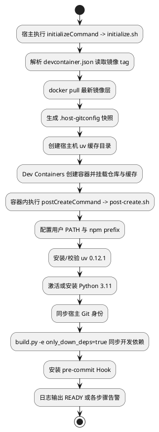
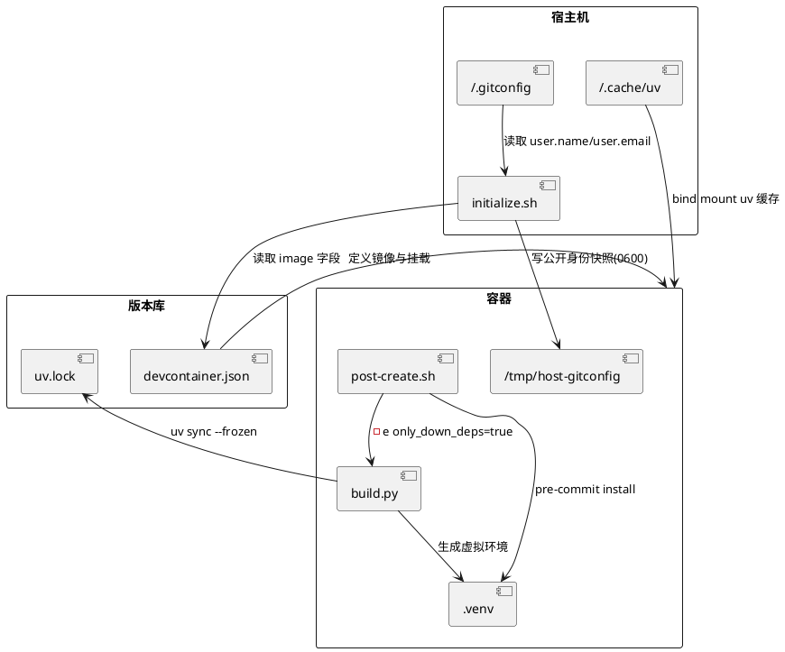
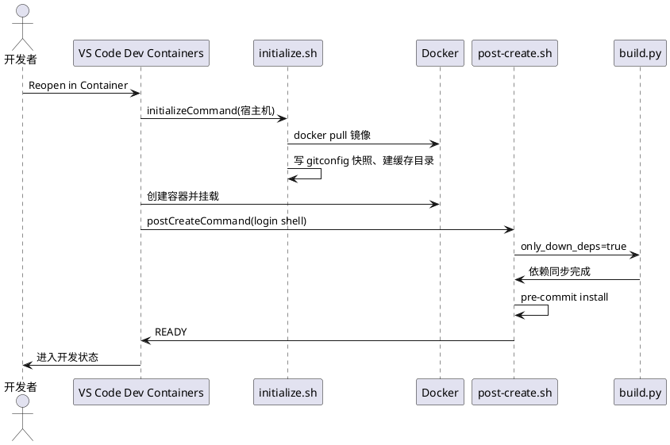

# 特性设计

## 功能描述

### 目标用户与触发场景

本特性的目标用户是 msmodeling 仓库的开发者，尤其是需要快速进入可编码、可调试状态的训推场景开发者。msmodeling 是 MindStudio 工具链中面向昇腾 AI 处理器训推场景的 Python 建模与仿真工具，仓库以 Python 为主，通过根目录 `build.py` 统一编排依赖准备、wheel 构建和单元测试。

触发场景是开发者克隆仓库后在 VS Code 中打开项目。当前仓库不提供统一的开发环境定义：开发者需要手工组装 Python 解释器版本、uv 依赖环境、Git 身份、pre-commit 校验工具和 VS Code 调试配置。不同开发者可能安装不同版本的 Python 与插件，导致环境行为不一致、问题难以复现；调试当前文件或当前单元测试用例时需要临时编写运行方式，效率低且容易出错。构建入口 `build.py` 虽然存在，但 IDE 任务（Task）与调试前置任务（preLaunchTask）之前更容易被绕过，形成命令行与 IDE 两套行为。

### 解决的问题与核心价值

本特性在仓库内提供完整的纯 Python Dev Container 定义，使开发者通过 VS Code Dev Containers 打开仓库即可获得统一、可复现的开发环境。其核心价值是把解释器版本、依赖状态、Git 身份、编辑器插件和调试/构建任务从开发者各自本机状态中收敛到仓库版本管理之内，让任何一个开发者、任何一台支持 Docker 的机器都能得到一致的环境。

### 成功条件

本特性的可验证目标如下，每一条都对应到后续验收项：

1. 仓库包含 `.devcontainer/devcontainer.json`，VS Code 能识别并执行 "Reopen in Container"。
2. Dev Container 使用 MindStudio 统一构建镜像，工作区固定挂载到 `/workspace`。
3. 容器创建后自动执行 `.devcontainer/post-create.sh`，不依赖开发者手工寻找初始化脚本。
4. 容器开发解释器固定为 Python 3.11，项目虚拟环境位于 `/workspace/.venv`。
5. npm 全局安装前缀指向容器用户可写的 `$HOME/.local`，用户级命令目录进入终端与 VS Code 进程的 `PATH`。
6. 宿主机 Git `user.name` 与 `user.email` 自动同步到容器，但宿主机凭据、Token、SSH 私钥和其他 Git 配置不进入容器。
7. 自动执行冻结锁文件的依赖同步，并安装 pre-commit Git Hook。
8. Pylance 能以仓库根目录和 `.venv` 为分析基础完成 Python 的 F12 跳转。
9. VS Code 提供当前 Python 文件调试、当前 UT 文件调试、Release 构建、仅下载依赖、全量 UT 和 Python 工作区清理任务。
10. 不使用 Dev Container 或 VS Code 时，`python3 build.py` 与 `python3 build.py test` 仍是直接可用的命令行入口。

### 范围与当前痛点

msmodeling 当前按纯 Python 工具处理。本特性不创建 `.clangd`，不提供 CMake、GDB 或 C++ 单元测试任务。若仓库中的个别 Python 依赖包含原生扩展模块，其安装仍由 uv 与项目依赖声明负责，不因此引入 C++ 开发模板。这一范围判断来自仓库现状：仓库不存在需要 C++ 编译数据库的源码，构建产物是 Python wheel，运行与测试也依赖 Python 解释器。

## 实现思路

### 逻辑流程图

运行时控制流按宿主初始化、容器创建、容器内初始化和日常开发四个阶段推进。初始化脚本的执行位置严格分离：`initialize.sh` 运行在宿主机，`post-create.sh` 运行在容器内，二者通过只读挂载的 Git 身份快照传递信息。



图中的一个关键点是镜像 tag 的单一事实源：`initialize.sh` 不重复维护镜像名，而是用 Python 解析 `devcontainer.json` 的 `image` 字段。这样每次重建容器前强制 `docker pull` 该 tag，防止官方以新层覆盖同名 tag 后本地仍使用旧镜像，同时避免了镜像名在两处配置不一致的隐患。

容器初始化 `post-create.sh` 采用分步骤执行模型。每一步通过 `run_step` 输出 `START`、`DONE` 或 `FAILED`，单步失败不会终止后续步骤，脚本最终统一退出 0。该设计的目的是让依赖源暂时不可用、npm 缺失或 Git 身份未设置等问题不会阻止开发者进入容器进行修复，但脚本结束语仍要求开发者检查告警，不把失败伪装为环境可用。

### 数据流图

数据在宿主、容器与版本库之间的所有权边界明确。`initialize.sh` 是 `.host-gitconfig` 快照的唯一生产者，`post-create.sh` 是唯一消费者；`uv.lock` 是 Python 依赖的只读事实源；`.venv` 是 `uv sync` 的输出产物。



数据所有权规则：`.host-gitconfig` 属于本地运行数据，由 `.gitignore` 排除，不得进入版本库或镜像；`uv.lock` 是依赖事实源，post-create 与 build 都只能冻结读取，不得更新；`.venv` 是构建输出，由 Python 扩展、调试器、pytest 与构建过程消费；`BuildOptions.only_down_deps` 只在单次 `build.py` 进程内存在，不写入配置文件或环境快照。

### 时序图

开发者、VS Code Dev Containers 扩展、宿主机脚本、Docker、容器脚本和 `build.py` 之间按顺序交互。



时序上的关键约束是 `postCreateCommand` 显式使用 login shell（`bash -lc`），以加载镜像 `/etc/profile.d/` 下的 CANN、GCC、Python 环境脚本。镜像的这些脚本只在 login / 交互式 shell 下自动 source，若用普通 shell 执行 `post-create.sh`，后续依赖 Python 3.11 切换工具和 CANN 环境变量会缺失。

### 代码结构设计

交付的文件分为四组：Dev Container 定义、宿主机初始化、容器内初始化、VS Code 配置，以及一组对现有构建入口的最小扩展。

- `.devcontainer/devcontainer.json`：定义镜像、工作区挂载、容器用户、缓存挂载、环境变量、postCreate 命令和 VS Code 容器配置。它是容器创建的唯一入口。
- `.devcontainer/initialize.sh`：宿主机侧脚本，职责为拉取最新镜像层、生成 Git 身份快照、创建 uv 缓存挂载源。
- `.devcontainer/post-create.sh`：容器内脚本，分步骤初始化用户路径、npm prefix、uv、Python 3.11、Git 身份、依赖和 pre-commit。
- `.devcontainer/README.md`：面向开发者的启动、开发入口、重建与排障说明。
- `.vscode/extensions.json`、`.vscode/settings.json`、`.vscode/launch.json`、`.vscode/tasks.json`：分别声明推荐扩展、工作区排除、调试配置和构建测试任务。
- `scripts/helpers/build/argv.py`、`scripts/helpers/build/bootstrap.py`、`scripts/helpers/build/run_build.py`：实现 `only_down_deps` 参数与 development 依赖模式。

构建入口的扩展遵循最小改动原则。`argv.py` 在 `_BUILD_EXTRA_KEYS` 白名单中新增 `only_down_deps`，`_validate_extras` 从「test 独享 extra」改为「build / test 各有独立白名单」，避免改变 test 命令已有的 `test_map_path`、`base_branch`、`offline`、`weights_prune` 四个 key。`bootstrap.py` 的 `Mode` 类型从 `build | test` 扩展为 `build | test | development`，`ensure_deps` 通过模式到依赖组映射决定要 `uv sync` 的 group 集合。`run_build.py` 的 `run_build` 在 `only_down_deps` 为真时选择 development 模式，同步 build、ci、lint 三组依赖后短路返回，不再要求 `scripts/build.sh` 存在、不进入版本暂存、不写 build manifest。

### 接口设计

#### 对外接口

对外接口是根目录 `build.py` 的命令行参数。本特性为 build 命令新增一个 `-e/--extra` 白名单 key，不新增子命令，不改变既有参数语义。

| 参数 | 必填 | 类型 | 取值/默认 | 语义 | 错误行为 |
| --- | --- | --- | --- | --- | --- |
| `-e only_down_deps=true` | 否 | 字符串 | 小写 `true` 或 `false` | 为 true 时仅同步开发依赖并跳过 wheel 构建 | 非 `true`/`false` 时报错退出 |
| `-v/--version` | 否 | 字符串 | 默认取 pyproject 版本 | 指定 wheel 版本标签 | 见既有逻辑，本特性不改 |
| `test` 位置参数 | 否 | token | 无 | 进入测试模式 | 未知/重复 token 报错 |

使用示例：

```bash
# 仅准备 IDE 开发依赖，不构建 wheel
python3 build.py -e only_down_deps=true
# 完整构建 wheel（缺省即 false）
python3 build.py
# 全量测试
python3 build.py test
```

关键约束是取值只接受小写 `true` 或 `false`，不接受 `yes`、`1`、`TRUE`、空串等写法。这是为了避免布尔参数在配置文件中被多种写法污染，导致脚本判断与文档不一致。

#### 内部关键接口

`BuildOptions` 数据类新增 `only_down_deps: bool = False` 字段，由 `parse_argv` 在非 test 模式下根据 `extras.get("only_down_deps") == "true"` 计算，test 模式下恒为 `False`。`bootstrap(mode: Mode) -> str` 是 `run_build` 与 `run_test` 共用的依赖准备入口，其 `Mode` 字面量新增 `"development"`，`ensure_deps` 的映射为 `{"build": ("build",), "test": ("ci",), "development": ("build", "ci", "lint")}`。该映射把「IDE 开发需要哪些依赖组」固化在单点，避免 post-create、Task 和 Debug 各写一份 uv group 列表。

`run_build(options: BuildOptions) -> int` 的短路分支是唯一的行为分叉点：当 `options.only_down_deps` 为真，先 `bootstrap("development")`，再记录日志并返回 0。该分支不调用 `_clear_wheel_output_dir`、`_set_pyproject_version`、`_run_with_version_staging`，因此不会误删已有 wheel、不会改写 pyproject 版本、不会覆盖 `artifacts/build-manifest.json`。这三个「不做」是接口层面对既有构建路径数据完整性的保护。

### 模块与周边关系

- **`build.py` 与 `scripts/helpers/build/`**：根目录 `build.py` 仅转发到 `scripts/helpers/build/main.py`；`main.py` 依据解析结果调用 `run_build`（构建）或 `run_test`（测试）。本特性只在 `argv.py`、`bootstrap.py`、`run_build.py` 三处改动，`run_test.py`、`runtime_env.py` 与 `fail_fast` 的既有检查不修改。
- **`scripts/build.sh` 与 `run_build.py`**：完整构建最终通过 `scripts/build.sh` 内的 `uv build --wheel` 完成。`only_down_deps=true` 依赖路径不触碰该脚本，与「仅下载、不编译」的语义一致，也保证缺少 `build.sh` 时仅下载模式仍然可用。
- **`pyproject.toml` 与 `uv.lock`**：`requires-python = ">=3.10"`，本方案固定使用 Python 3.11 而不改该约束。依赖通过 `uv.lock` 冻结并以 `--frozen` 同步，初始化不得更新锁文件。`pyproject.toml` 的 `[dependency-groups]` 中 `build`、`ci`、`lint` 三组是 development 模式的依赖来源。
- **`.pre-commit-config.yaml`**：`post-create.sh` 安装的 pre-commit 读取该文件；已有 hooks（ruff、pylint、bandit、codespell、typos、gitleaks 等）不作调整。
- **`.gitignore`**：补充 `.vscode/settings.json` 的白名单（`!.vscode/settings.json`），使仓库级排除配置可被版本管理，同时继续忽略个人本机覆盖项与 Python 构建测试产物。
- **VS Code 扩展生态**：Pylance 是 Python 语义跳转提供方；扩展清单由 `extensions.json` 与 `devcontainer.json` 的 `customizations.vscode.extensions` 双处声明，前者服务普通 VS Code 工作区，后者服务 Dev Container 创建时自动安装。

## DFX能力设计

### 安全性

本特性不引入网络对外监听、凭据获取或敏感数据存储。可执行脚本会从外部拉取依赖（uv 安装脚本、`uv sync`、pre-commit hook 仓库），存在供应链攻击面。缓解措施是依赖版本钉定：`uv sync` 使用 `--frozen`，版本锁定在 `uv.lock`；uv 安装脚本从固定版本的 HTTPS 地址下载；pre-commit 各 repo 的 `rev` 已钉版本。脚本不读取或写入用户私有密钥，Git 身份仅设置公开的 `user.name` 与 `user.email`。残留风险是镜像可信度与 Python 包索引信任，这两项属于镜像与索引安全管理范畴，超出本方案边界。

配置注入面：`post-create.sh` 读取的外部值仅用于字符串比较（如 `only_down_deps` 只与字面量 `true`/`false` 比较）或作为显式引号的参数传递，不拼接进未加引号的 eval 或命令串。`initialize.sh` 解析镜像名时用 Python 的 `json.loads` 而非 shell 文本拼接，避免镜像字段中的字符被 shell 解释。

### 可靠性

- **重复执行**：`post-create.sh` 幂等，通过 `mkdir -p`、固定 marker 注释和 `grep -Fqx` 判断，重复运行不报错、不重复写配置、不累计重复 PATH 行。
- **失败检测**：uv 安装、`uv sync`、pre-commit 安装、版本暂存/恢复均有非零退出码检测。完整构建在 `_run_with_version_staging` 的 `finally` 中保证版本恢复。
- **超时**：依赖同步沿用 `_SYNC_TIMEOUT_SECONDS`（3600 秒），构建沿用 `_SHELL_TIMEOUT_SECONDS`（36000 秒），不新增。
- **降级**：无 npm 时跳过 prefix 设置；无 Python 3.11 时依次尝试镜像切换工具与 uv managed Python；无 VS Code 时命令行 `python3 build.py` 主流程不变。这些降级路径都只告警不阻塞，但相关开发操作仍会因工具自身缺失而失败，不伪造成功。

### 可用性/性能指标

本特性未由需求提供量化性能目标，因此给出测量计划而非承诺数值：

- **环境初始化耗时**：以 `post-create.sh` 从空 `.venv` 到 pre-commit 就绪的总时长为观测指标，目标是不新增重复下载（复用 uv 缓存），通过脚本各步骤计时日志测量。
- **构建路径耗时差异**：`only_down_deps=true` 应显著短于完整构建，用两条命令各测三次取中位数，仅记录观测差异，不下绝对时长结论。
- **语义跳转可用性**：F12 跳转延迟受文件规模影响，以「能否跳转」为通过标准，不设机器无关的延迟门限。

### 可服务性

- **日志**：`run_build` 在构建前记录 `running:` 命令；`only_down_deps=true` 分支记录「依赖已同步、跳过构建」提示，便于从日志区分是否走短路径。`post-create.sh` 以 `[post-create]` 前缀统一日志，每步输出 `START`/`DONE`/`FAILED` 便于在 Dev Containers 启动日志中筛选。
- **诊断路径**：构建失败 → 检查 build 日志 → 区分依赖解析失败或编译失败；调试异常 → 检查 `launch.json` 的 python/pytest 是否指向 `.venv` 内解释器；Hook 未生效 → 确认 `.git/hooks/pre-commit` 存在且可执行。
- **可观测性边界**：不新增指标采集或告警接入，只依赖既有 exit code 与日志行，避免为一次性开发便利引入遥测基础设施。

### 其他指标

不涉及参数可扩展性、并发规模、可移植性等额外指标。相关度量已在「可用性/性能指标」通过测量计划覆盖，不重复定义。本特性不引入常驻服务或后台守护进程，因此无并发与资源共享的额外指标。

### 安全设计及安全 checklist

安全设计要点已在「安全性」小节说明。以下 checklist 逐项回答：

| 检查项 | 结论 |
| --- | --- |
| 是否引入新的网络监听/服务端口 | N：无新增监听 |
| 是否处理敏感数据 | N：仅 Git 公开身份，无密钥/token |
| 是否执行未签名的外部代码 | Y：uv/pre-commit 拉取依赖；用 lockfile 冻结与版本钉定缓解，残留风险属镜像/索引信任范围 |
| 是否可被命令注入 | N：值仅与字面量比较、作为引号参数传递，镜像名用 json.loads 解析 |
| 是否记录敏感日志 | N：日志记录命令与可识别 key，不记录身份字段取值 |
| 是否静默覆盖既有身份配置 | N：仅写入 name/email，不触碰 credential、alias、include |
| 是否向版本库提交产物/二进制 | N：`.gitignore` 忽略 `dist/`、`*.egg-info`、`*.so` 等 |
| 是否支持不可审计二进制入库 | N：原生产物被忽略 |

### 可测试性

正常路径与边界用例见下表，覆盖参数解析、依赖模式选择与短路行为。

| 用例 | 前置 | 操作 | 预期结果 |
| --- | --- | --- | --- |
| build 侧 extra 解析 | 干净仓库 | `build.py -e only_down_deps=true` | 进入依赖下载路径，不产出 wheel，退出码 0 |
| 传统入口不回归 | 干净仓库 | `build.py` | 完整构建 wheel，行为与现状一致 |
| test 侧不受影响 | 干净仓库 | `build.py test -e offline=1` | 沿用既有 test 校验，正常工作 |
| 语义跳转 | 已装 Pylance | 符号处按 F12 | 跳转到定义或声明 |
| pre-commit 装配 | 新容器执行脚本 | 触发提交 | Hook 生效 |

边界与异常用例：

| 用例 | 前置 | 操作 | 预期结果 |
| --- | --- | --- | --- |
| 缺 `=` | 干净仓库 | `build.py -e value` | 报 `--extra must be KEY=VALUE`，非零退出 |
| 空 key | 干净仓库 | `build.py -e =v` | 报 key 非空错误，非零退出 |
| 重复 key | 干净仓库 | `build.py -e only_down_deps=true -e only_down_deps=false` | 报 duplicate key，非零退出 |
| 非法取值 | 干净仓库 | `build.py -e only_down_deps=yes` | 报取值非 true/false，非零退出 |
| build 侧未知 key | 干净仓库 | `build.py -e foo=1` | 报 unknown key，非零退出 |
| test 侧误用 only_down_deps | 干净仓库 | `build.py test -e only_down_deps=true` | 报该 key 仅在 build 允许，非零退出 |
| 保持既有 manifest | 已有 manifest | `build.py -e only_down_deps=true` | 不覆盖 `build-manifest.json` |
| 重复跑初始化 | 同一容器 | 连续两次 `post-create.sh` | 第二次不报错、不重复写配置 |

单元测试层面，已对 `argv.py` 新增 build 场景下 `_validate_extras` 的正常/非法取值分支，对 `bootstrap.py` 新增 development 模式的 `uv sync` 命令断言，对 `run_build` 新增短路不覆盖 manifest、不调用构建脚本的断言。验证方式为运行 `tests/regression/scripts/helpers/build/` 下的回归用例。

## 特性规格与限制

- 工作区固定挂载到 `/workspace`，解释器固定为 `/workspace/.venv/bin/python`，Git 快照固定为 `/tmp/host-gitconfig`。这些固定路径使 devcontainer、Pylance、任务和脚本共享同一事实源，代价是镜像用户或工作区路径改变时必须在 `devcontainer.json` 与对应验收项中直接修改，不增加运行时路径猜测分支。
- `only_down_deps` 仅对 build 命令有效，test 命令使用该 key 会直接报错。这是硬性限制：test 参数解析不应因新增 build 白名单而放宽。
- 容器不启用 privileged、host network、host IPC 或额外设备挂载。msmodeling 的 Python 编码、静态分析、测试与 wheel 构建不要求扩大容器权限；若未来引入需要特权的能力（如内核参数调整），需单独评估并明确写入 `runArgs`。
- uv 版本固定为 `0.12.1`，Python 固定为 3.11。版本演进需同步修改 `post-create.sh` 中的 `UV_VERSION` 与验收项的 Python 版本断言。

## 兼容性声明

按本特性范围确认不设计兼容性、迁移、shim 或 legacy 行为路径。以下是本特性不改变既有行为的保证，而非新增兼容层：

- `python3 build.py` 与 `python3 build.py test` 的既有参数、退出码与构建产物位置保持不变。
- `run_test.py`、`runtime_env.py` 及 `fail_fast` 的既有检查不修改。
- `pyproject.toml` 的 `requires-python = ">=3.10"` 约束不变，本方案仅选用其中 3.11 作为容器解释器。
- test 命令已有的四个 extra key 白名单不被 build 侧新增 key 影响。

不在本特性范围内提供旧环境到 Dev Container 的迁移脚本、也不提供非 VS Code 环境的兼容 wrapper。

## 拓展性

仅描述一个由确认后的需求变化所要求的扩展点：当未来需要新增依赖组（例如独立的评测依赖组），可在 `bootstrap.py` 中 `groups` 映射增加一条 mode，并在 `argv.py` 的白名单或任务配置中同步。除此之外，不增设策略模式、插件机制、环境变量开关或预留的配置项——当前实现没有第二个消费者或确定的变化需求支撑这些抽象，属于无依据的过度设计。

对于镜像、Python 版本或 uv 版本的演进，本设计通过固定值而非运行时探测来表达，未来变更直接在配置常量和验收项中修改即可，不需要抽象成版本选择框架。
