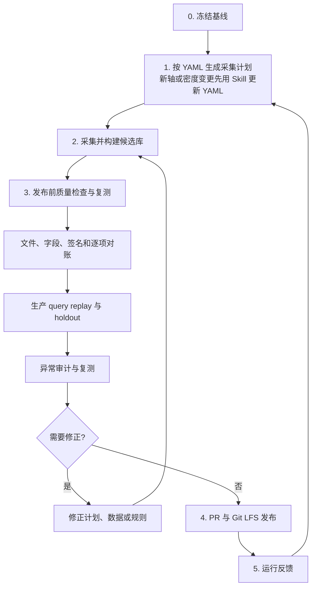

# 实测算子性能数据库生命周期设计

## 1. 文档定位

本文定义实测算子性能数据库从采集标准、数据采集、发布前质量检查到发布和运行反馈的端到端流程。实际执行入口为[生命周期 Skill](../../.agents/skills/profiling_database_lifecycle/SKILL.md)。

本文连接已有能力，不重复定义内部算法：

- 轴和最低采集密度由[轴密度 Skill](../../.agents/skills/profiling_database_axis_density/SKILL.md)及其
  [YAML 规则](../../.agents/skills/profiling_database_axis_density/axis_collection_density.yaml)定义。
- CSV、`op_mapping.yaml`、Shape 生成和采集由
  [性能数据库采集工具 RFC](../RFC/rfc_performance_database_collection_tooling_zh.md)及生产代码定义。
- 异常候选和复测交接由 [PR673](https://gitcode.com/Ascend/msmodeling/pull/673) 引入的
  `docs/RFC/rfc_profiling_database_anomaly_detection_zh.md` 定义；当前分支中该路径尚不存在，待 PR673 合入后生效。

本文描述目标流程。生命周期 Skill 负责调用现有 Skill 和工具，不另建统一执行器；PR673 未合入时，异常审计阶段不可执行。

## 2. 总体流程



阶段 3 是一个发布前检查节点，内部三项检查不能互相替代：

1. 文件和逐项对账回答“计划的数据是否完整、结构是否正确”。
2. 生产 query replay 回答“数据库是否能按真实生产逻辑命中”。
3. 异常审计回答“已存在的 latency 和数据契约是否有可疑点”。

异常审计没有发现候选，不等于数据库通过全部检查。审计器无法判断的行会明确弃权，也不验证所有模型 query 的 exact、
roofline 和 composite 子查询结果。

## 3. 数据库可用的最低条件

数据库只能对明确的设备、软件版本、mapping 和 query 范围声明可用。发布前至少满足：

1. 数据库快照、测量环境、代码版本和密度标准可追溯。
2. 计划采集、实际结果和最终入库数据能够逐 Shape 对账。
3. 关键 query `100% strict exact` 命中。
4. 其他支持 query 必须 exact、明确 compatible 或合法同桶插值，不得回退 roofline。
5. 计入覆盖的 latency 来自真实测量，且为正数、finite。
6. 不存在损坏 CSV、生产映射引用但数据库中缺失的算子 CSV，以及未解释的严格签名冲突。
7. 候选库在冻结 holdout 上不差于批准的生产基线，复合算子实际子查询全部通过。
8. 已有基线时，候选库唯一严格签名数不超过基线的 8 倍；这是防止规模失控的容量上限，不是目标规模或甜点位证据。
9. 发布快照可以由 commit、数据库目录和文件 hash 唯一定位。

CSV 数量、总行数和“没有高残差候选”都不能单独证明数据库可用。

## 4. 各阶段设计

### 4.1 阶段 0：冻结基线

| 项目 | 内容 |
| --- | --- |
| 目的 | 确定本轮采集和检查的共同起点。 |
| 输入 | 已发布数据库、代码、`op_mapping.yaml`、密度标准、生产 query、holdout 和测量环境。 |
| 动作 | 记录代码 commit、数据库目录、mapping、密度规则和环境；冻结 query 与 holdout；统计基线有效 latency 和唯一严格签名。 |
| 输出 | 本轮不可变输入及其 hash。 |
| 失败处理 | 输入缺失、冲突或发生变化时重新冻结，不沿用旧结果。 |

### 4.2 阶段 1：确定轴密度并生成采集计划

YAML 是已批准轴密度的唯一数值依据，Skill 是新增或修改规则时的定标流程。两者按以下顺序使用：

1. 已有轴且密度不变时，直接读取
   [`axis_collection_density.yaml`](../../.agents/skills/profiling_database_axis_density/axis_collection_density.yaml)，无需每轮重新调用 Skill。
2. 新增轴或修改范围、间隔、比例和必测值时，先调用
   [`profiling-database-axis-density`](../../.agents/skills/profiling_database_axis_density/SKILL.md)，从采集代码和生产查询确认轴语义，并用真实 query、生成点和验证结果形成变更证据。
3. 规则通过评审后更新 YAML；YAML 未更新前，新规则不得进入正式采集计划。
4. 使用“YAML 最低密度 + 冻结的真实 query + 复合算子实际子 query”生成候选 Shape，再通过实际 Shape generator 校验合法性并按严格签名去重。
5. 输出最终采集计划、规模、query 来源和不支持清单。

YAML 是规范性基线，不是运行时配置；采集器不会因为 YAML 更新而自动改变，因此必须同步采集器和测试，并检查最终生成 Shape 是否满足 YAML。

本阶段输出冻结采集计划。关键 query、最低密度和边界遗漏，或预计规模超过基线 8 倍时，不进入采集。query-driven 生成可以
减少实际点数，但不取消该容量保护线；只有新的容量或采集证据才能调整上限。

### 4.3 阶段 2：采集并构建候选库

采集只写候选目录，不直接修改正式数据库：

1. 按计划生成 Shape，执行 warmup 和 repeat。
2. 保存每次重复测量结果，不能只保存最终平均值。
3. 保留成功、失败、超时和不支持状态。
4. 入库 latency 必须为正数、finite，并记录来源和环境。
5. 计划采集、实际结果和最终 CSV 行逐 Shape 对账。
6. 自动合并只接受新增签名和无效 latency 补齐。

覆盖已有正 latency、删除已有签名、采集环境变化或发生冲突时停止自动合并。失败点重采；计划本身有误则返回阶段 1。

### 4.4 阶段 3：发布前质量检查与复测

#### 4.4.1 文件、字段、签名和逐项对账

检查 Git LFS、CSV、latency、Shape、dtype、format、runtime metadata 和 mapping；检查严格签名冲突与采集合并签名碰撞；
核对采集计划、执行结果和候选库，并输出相对基线的行级 diff。

损坏文件、非法 latency、必要 CSV 缺失、未解释签名冲突或静默丢数必须修复。

#### 4.4.2 生产 query replay 与 holdout

使用真实 `ProfilingDataSource` 和 `InterpolatingDataSource` replay 冻结 query，逐条记录 kernel、命中类型、latency source
和 matched points；复合算子展开到实际子 CSV。

关键 query 必须 `100% strict exact`；其他支持 query 不得回退 roofline；冻结 holdout 不得差于基线。这里不要求单独建设
一套验收平台，可以调用现有生产代码并保存结果。

#### 4.4.3 异常审计与复测

使用 PR673 的只读脚本：

```bash
python tools/perf_data_collection/find_database_anomalies.py \
  --database-path <candidate-database> \
  --output-dir <database-outside-report-directory> \
  --residual-threshold 1.0 \
  --remeasure-limit 50
```

脚本每次运行自动生成：

| 文件 | 用途 |
| --- | --- |
| `anomaly_summary.md` | 按数据完整性、数据契约、固定阈值性能候选和无法判断四类汇总，作为数据库 PR 的摘要证据。 |
| `anomaly_candidates.csv` | 全部确定性问题、契约风险、LOO 候选和弃权记录。 |
| `remeasure_manifest.csv` | 预算内可定位到具体行的硬件复测目标。 |

当前脚本需要人工执行，尚未接入数据库 PR 或 CI 自动触发；执行后报告文件由脚本自动生成。输出目录必须位于数据库外，建议按
日期和数据库 snapshot hash 保存。摘要可随数据库 PR 提交，较大的候选 CSV 和复测清单可作为 CI artifact 或外部证据归档。

确定性错误必须修复。`REVIEW_REGIME` 先检查签名、分桶或局部边界；单点候选经独立硬件复测后才能修改 latency；
`INSUFFICIENT_EVIDENCE` 表示无法判断，不得视为通过。

任何数据或规则修正都必须重新执行阶段 3。缺数据返回阶段 1 或 2；输入版本变化返回阶段 0。

### 4.5 阶段 4：PR 与 Git LFS 发布

只有阶段 3 全部检查完成后才发布候选库。数据库、mapping、通信引用、报告和依赖 hash 必须对应同一快照。

发布通过 PR review 和 CI 完成；并发数据库 PR 合入前重新核对 baseline。发布后不原地替换 CSV，回滚使用上一 commit 或
revert，不手工逐行恢复。

### 4.6 阶段 5：运行反馈

记录 exact miss、插值失败、mapping miss、composite 子查询 miss、精度回归和审计候选，并先完成归因：

- 确认的数据缺口进入下一轮采集计划。
- mapping、composite accounting、搜索域和新轴问题进入对应代码或规则流程。
- 证据不足的反馈继续观察，不直接补数据。

运行反馈返回阶段 1，形成下一轮生命周期。

## 5. 当前状态

| 环节 | 当前状态 |
| --- | --- |
| 轴和最低密度 | 已有 Skill、标准文档和 YAML；已有规则直接读 YAML，新轴或规则变更先用 Skill 定标并更新 YAML。 |
| Shape generation、microbench 和 replay | 已有独立工具，按本文人工串联。 |
| 异常审计 | PR673 已实现只读扫描并自动生成三份报告，但当前需要人工执行脚本。 |
| 重复测量记录 | 部分采集入口只保存聚合值，尚未全部保留每次 repeat。 |
| 逐 Shape 对账 | 计划、采集结果和最终入库数据尚未在全部入口一一对应。 |
| 发布前检查 | 当前由现有工具人工串联，尚未接入统一 CI 门禁。 |
| 自动修库 | 不在范围内；统计候选必须独立复测。 |

“尚未统一”不表示必须建设大型平台。最小落地方式是保留现有工具，只统一输入快照、逐 Shape 对账和报告目录；条件成熟后再把
稳定检查接入数据库 PR。

## 6. 结论

实测算子性能数据库的最小生命周期是：

```text
冻结基线 -> 按 YAML 生成计划（规则变更先用 Skill 更新 YAML）-> 采集候选库
         -> 发布前质量检查与复测 -> PR 发布 -> 运行反馈
```

发布前质量检查包含文件与逐项对账、生产 query replay、异常审计三项。它们可以合并为一个流程节点，但不能互相替代。
轴密度 Skill 决定最低采集要求，采集工具产生真实测量，生产 datasource 验证实际可用性，PR673 负责发现异常候选并生成复测清单。
