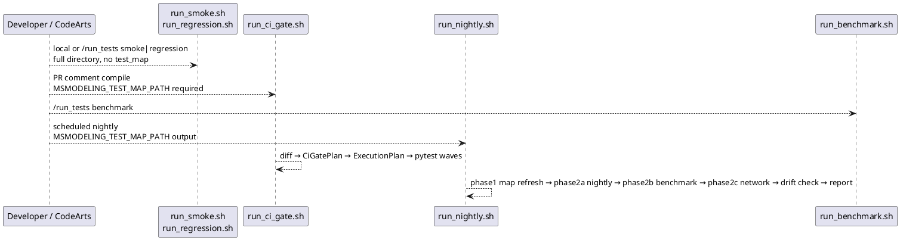
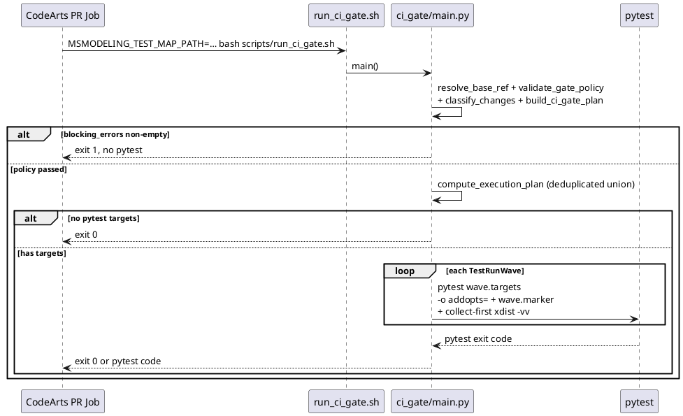
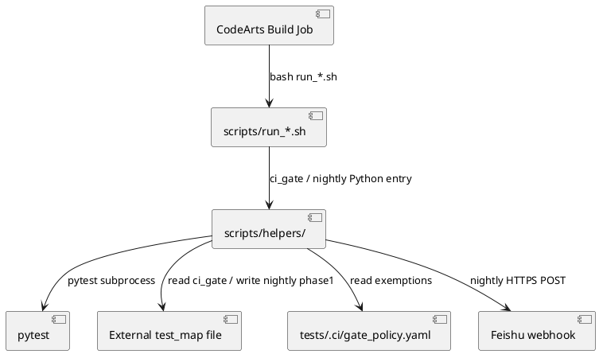

# Feature Design

## Functional Description

In the current `msmodeling` testing system, the responsibilities of UT and ST are not clearly defined, overall execution time is high, slow test cases are concentrated, test code and functional verification are duplicated, and some paths trigger weight downloads leading to cache bloat. This feature only rectifies the testing system; it does not add new modeling functions or expand precision data collection links.

1. A unified three-layer directory specification is established. Layers are expressed by directory placement under `tests/smoke/`, `tests/regression/`, and `tests/benchmark/` rather than by pytest layer markers. Pytest markers are reserved for three cross-cutting constraints only: `nightly` for long-running compile paths, `npu` for hardware-dependent cases, and `network` for cases requiring live model Hub access. Model-level precision guardianship lives under `tests/benchmark/models/`; operator-level guardianship lives under `tests/benchmark/ops/perf_database/`. Incremental CI feedback covers smoke and regression cases that match `not npu and not nightly and not network`; benchmark directories never enter the incremental path.
2. A split execution model is established. Five shell entry points are provided: `run_smoke.sh`, `run_regression.sh`, `run_benchmark.sh`, `run_nightly.sh`, and `run_ci_gate.sh`. Local developers always run full smoke and full regression. CI PR incremental selection is isolated in `run_ci_gate.sh`, which reads an external `test_map` file maintained by the nightly job. Benchmark and nightly scripts always run full suites.
3. A coverage and guardianship mechanism is established. Nightly phase 1 collects coverage while refreshing `test_map` and reports line and branch totals against 60% / 40% thresholds. CI incremental gate (`run_ci_gate.sh`) enforces `test_map` policy and pytest pass/fail. Pass rate, duration drift, and slow-case counts are tracked through nightly JUnit XML reports and Feishu notifications.
4. Slow cases and redundancy are governed through `pytest -n auto` parallelism, session- and module-level fixtures, parametrization, and case merging. Duration is compared against nightly `duration_sec` and pytest `--durations=20` output. Full regression is not rerun solely to collect baselines.
5. Weights and Hub access are controlled centrally. Local runs allow Hub access when `MSMODELING_OFFLINE` is unset. CI sets `MSMODELING_OFFLINE=1` to forbid implicit downloads. Cache directories are confined to `.msmodeling_cache` at the repository root. Weight shards can be pruned after each session when `MSMODELING_TEST_WEIGHTS_PRUNE=1`.
6. Quantifiable targets are defined. The mixed baseline total duration is 960 seconds, line coverage is 74%, branch coverage is 61.8%, and 15 test cases exceed 300 seconds. After rectification: incremental CI gate target is approximately 180 seconds, a single full regression run should not exceed 300 seconds, full nightly should not exceed 480 seconds, full-run speed improvement over baseline should be no less than 50%, and test cases exceeding 300 seconds should be no more than 3.

For users, local smoke and regression provide failure feedback without waiting for nightly guardianship. For the system, the scheduled nightly job refreshes the external `test_map`, runs long `nightly`-marked cases and benchmark suites, and drives duration and coverage trend reporting.

## Implementation Ideas

### Step 1: Solidify Directory Layering and Marker Semantics

Layer selection is directory-driven. Global pytest `addopts` excludes `npu`, `nightly`, and `network`; each entry script adds its own directory scope and marker expression.

**Directory Semantics**

| Directory | Layer | Semantics | Typical Content | Local / Full CI | Incremental CI |
|------|------|------|----------|------|------|
| `tests/smoke/` | UT | Minimum viable paths; PR guard for `@pytest.mark.nightly` compile paths | Core API reachability, lightweight compile, local tiny configs, CLI smoke | `run_smoke.sh` | Selected via `run_ci_gate.sh` when mapped |
| `tests/regression/` | UT / ST | Module function and integration verification; default destination for new cases | Graph compilation, pass transforms, ServingCast, CLI, Web UI, toolchain UT | `run_regression.sh` | Selected via `run_ci_gate.sh` when mapped |
| `tests/benchmark/` | ST | Precision and performance baselines | `models/` model-level cases, `ops/perf_database/` operator-level cases | `run_benchmark.sh` | Never selected incrementally |
| All three layers | ST | Nightly guardianship | Long compile paths, precision baselines, mapping refresh | `run_nightly.sh` | — |

**Marker Semantics**

| Marker | Semantics | Relationship with Directory |
|--------|------|------------|
| None | Default case; layer is determined by directory | Most cases in all three directories carry no marker |
| `nightly` | Long-running compile or optimization paths | Allowed under `tests/smoke/` or `tests/regression/`; excluded from ci_gate mapped/guard wave; included in local full smoke/regression, changed-test ci_gate wave (`-m not npu`), and nightly phase 2a |
| `npu` | Requires NPU hardware | Excluded from all `run_*.sh` entry scripts |
| `network` | Requires live model Hub access (HuggingFace/ModelScope) | Excluded by default and from all UT entry scripts; run only in nightly phase 2c over `tests/` |

**Smoke Guard for Nightly Compile Paths**

Every test function or class marked `@pytest.mark.nightly` should have one or more corresponding smoke cases under `tests/smoke/` that exercise the same compile or CLI path at reduced cost.

| Layer | Role | Typical Scope |
|-------|------|---------------|
| `tests/smoke/` | PR-level basic guard | Local tiny configs in `tests/assets/model_config/` with `num_hidden_layers_override=1`, or remote `config.json` only; asserts `build_model`, `ModelRunner.run_inference`, or CLI exit code |
| `tests/regression/` + `@pytest.mark.nightly` | Full compile regression | Full model IDs, multi-shape sweeps, fused-op event counts, bandwidth tables, ModelScope load paths |

**Examples**

| Smoke case | Guards nightly |
|------------|----------------|
| `tests/smoke/test_compile_paths_smoke.py::test_compile_with_mtp_tokens_deepseek` | `MtpNightlyTestCase`, `MtpEpNightlyTestCase` |
| `tests/smoke/test_compile_remote_models_smoke.py::test_compile_qwen3_moe` | `GmmPassTestCase`, `SwiGLUFusionPassNightlyTestCase` |
| `tests/smoke/test_model_runner_compile_smoke.py::test_model_runner_compile_deepseek` | `TestTextGenerateNightly`, `PerfAnalysisNightlyTestCase` |
| `tests/smoke/test_throughput_optimizer_smoke.py::TestThroughputOptimizerSmoke.test_vl_model_image_args` | `TestThroughputOptimizerNightly` VL paths |

When adding a new `@pytest.mark.nightly` case, a smoke counterpart should be added or extended in the same change; non-obvious mappings should be documented in the smoke module docstring.

**Subsequent Maintenance**

1. New cases are placed by directory first. Model guardianship goes to `tests/benchmark/models/`; operator guardianship goes to `tests/benchmark/ops/`. High-duration regression paths receive `@pytest.mark.nightly` and a smoke guard. NPU dependencies receive `@pytest.mark.npu`.
2. Legacy cases are migrated into one of the three directories. Markers previously used only for layering are removed; `nightly` and `npu` are retained when still applicable.
3. Shared model configuration assets live under `tests/assets/model_config/`. Reusable builders and assertions live under `tests/helpers/`. Toolchain unit tests mirror `scripts/helpers/` under `tests/regression/scripts/helpers/`.

**New test case guidelines**: `tests/README.md` provides a step-by-step guide for adding new test cases: (1) choose the directory by test intent, (2) reuse shared helpers from `tests/helpers/`, (3) follow the naming and structure conventions, (4) verify locally with the corresponding `run_*.sh` script, and (5) check that the new case appears in the next nightly `test_map` refresh.

**LLM-assisted test generation**: `tests/SKILL.md` provides a structured prompt template for LLM-based test case generation. It encodes directory-driven layering, marker semantics, shared helper APIs, and code templates for smoke, regression, and benchmark cases. An LLM agent reading `SKILL.md` can produce structurally correct test cases that conform to the framework conventions.

```toml
[tool.pytest.ini_options]
pythonpath = ["."]
markers = [
  "nightly: do_compile=True large model cases, only run in nightly",
  "npu: requires NPU hardware",
  "network: requires live model Hub access (HuggingFace/ModelScope); excluded by default, run in nightly",
]
addopts = "-m 'not npu and not nightly and not network'"
testpaths = ["tests"]

[tool.coverage.run]
parallel = true
branch = true
```

The `build_test_map` collection scope is hardcoded to `not npu and not nightly and not network` (matching the ci_gate selection marker), over `tests/smoke/` and `tests/regression/`. Benchmark cases never participate in mapping.

### Step 2: External test_map and gate_policy Contracts

The incremental gate reads `test_map` from an external file pointed to by `MSMODELING_TEST_MAP_PATH`. The nightly job writes this file after phase 1 succeeds. Gate policy lives in `tests/.ci/gate_policy.yaml`; approver whitelist in `tests/.ci/approvers.yaml`.

**test_map contract example**

```json
{
  "schema_version": 1,
  "map": {
    "serving_cast/utils.py": {
      "summarize": [
        "tests/regression/serving_cast/test_utils.py::TestSummarize::test_summarize_basic"
      ]
    }
  }
}
```

Map keys must be repository-relative product source paths under `gate_policy.yaml` `roots` (single source of truth): `cli/`, `serving_cast/`, `tensor_cast/`, `web_ui/`, `scripts/`, and `tools/`. `coverage_config.product_roots()` and `COV_PACKAGES` are derived from the same `roots` list (`rstrip('/')` for `--cov` package names).

**Coverage-to-symbol association**: `collect_from_coverage` registers a test for a symbol when coverage records at least one executed line inside that symbol's span (no minimum line threshold). The map therefore prefers breadth over precision: CI may run extra tests when a symbol changes. A follow-up feature should define how to reject shallow or cosmetic tests without blocking thin delegators; see the tracking issue on the project tracker.

**Redundancy detection**: `build_test_map.detect_redundant_cases` analyzes the completed map and returns two types of warnings:

1. **over_covered_symbol**: a symbol mapped to more than `max_per_symbol` (default 5) test cases, indicating potential duplication.
2. **redundant_pair**: a pair of test cases whose Jaccard similarity over covered symbols exceeds `jaccard_threshold` (default 0.85), indicating near-identical coverage footprints.

Redundancy warnings are consumed by the nightly pipeline and surfaced through Feishu notifications. They are advisory and do not block CI.

**Coverage and pytest-xdist**: `scripts/helpers/common/coverage_config.py` exposes `pytest_xdist_args()` (`-n auto --dist=worksteal`) and `cov_pytest_args()` (product `--cov`, `--cov-branch`, optional `--cov-context=test`). `COV_PACKAGES` is loaded from `gate_policy.yaml` `roots` via `product_roots()` — not a separate hardcoded list. `[tool.coverage.run] parallel = true` in `pyproject.toml` lets each xdist worker write an independent data file; pytest-cov combines them into `.coverage` after the run. Nightly phase 1 uses these flags; `build_test_map` and nightly `check_ut_gate` read the merged file — do not invoke `coverage run -m pytest` manually alongside xdist. ci_gate does not collect coverage during pytest.

**Product roots wiring** (`gate_policy.yaml` `roots` → downstream):

| Stage | Module | Usage |
|-------|--------|-------|
| Coverage `--cov` | `coverage_config.cov_pytest_args` | `COV_PACKAGES` = `roots` with trailing `/` stripped |
| Gate diff classification | `ci_gate.diff.classify_changes` | `baseline.roots` from `load_gate_policy` |
| `test_map` validation / build | `test_map_loader`, `build_test_map` | Keys and coverage scan limited to `roots` |
| Nightly refresh | `nightly.main` → `build_test_map(..., roots=gate_policy.roots)` | Same scope as ci_gate baseline |

**gate_policy contract**

`tests/.ci/gate_policy.yaml`:

```yaml
roots:
  - cli/
  - serving_cast/
  - tensor_cast/
  - web_ui/
  - scripts/
  - tools/
test_discovery:
  include: ["**/test_*.py", "**/*_test.py"]
  exclude: ["tests/helpers/**", "tests/assets/**"]
exemptions:
  sources:
    - symbols: ["tensor_cast/foo.py::legacy_helper"]
      reason: refactor
      applicant: alice
      approver: fangkai
      deadline: "2026-06-30"
      ticket: "https://..."  # optional
  tests: []
```

Product source **omit** (e.g. `*/builtin_model/*`) lives in `pyproject.toml` `[tool.coverage.run] omit`, not gate_policy. `scripts/helpers/common/coverage_omit.py` loads omit patterns for gate rules and `test_map` collection.

`tests/.ci/approvers.yaml` lists allowed `approver` names. When a PR changes `gate_policy.yaml`, approvers are validated against the working-tree `approvers.yaml` (same PR may update both files).

### Step 3: CI Gate Selection and Policy Rules

Incremental selection is implemented in `scripts/helpers/ci_gate/main.py`. The pipeline resolves a merge base, validates `gate_policy.yaml` when changed, classifies git changes, builds a `CiGatePlan`, derives a deduplicated `ExecutionPlan`, and runs pytest.

Change classification covers configuration files, added or removed tests, added or removed product sources, and modified product sources with executable line numbers filtered through AST analysis. Renamed product sources remap `test_map` entries before planning.

| Phenomenon | Incremental Behavior |
|---|------------|
| Configuration change under any `tests/**/conftest.py`, `requirements.txt`, `uv.lock`, or standard CI config filenames (`pyproject.toml`, `pytest.ini`, `tox.ini`, `setup.cfg`, `.coveragerc`) | Full `tests/` with `-m not npu` only (nightly/network cases under `tests/` still execute) |
| Change to `tests/.ci/gate_policy.yaml` only | No full-suite trigger; `validate_gate_policy_if_changed` enforces approver whitelist |
| New product source file | Block when top-level symbols lack `test_map` entries and are not exempt (optional `.coverage` fallback for executed lines — see below) |
| New or modified test file | Collect runnable pytest node ids (`-m not npu`); skip files whose nodes are all in `exemptions.tests` |
| Removed product source file | Schedule mapped guard node ids; block when mapping is missing |
| Removed test file | Block when the deleted path is the sole mapped coverage for any symbol |
| Modified product source file | Schedule mapped node ids by changed symbol; block unmapped non-exempt symbols (optional `.coverage` fallback) |

**Pre-run policy blocking:** `build_ci_gate_plan` aggregates all gate rules into `blocking_errors`. When non-empty, ci_gate logs categorized violations, prints `format_blocking_errors`, and exits before any pytest wave.

**Union deduplicated execution:** `compute_execution_plan` unions changed-test nodes, regression nodes, and deleted-source guard nodes into one schedule keyed by pytest node id. Changed-test nodes form wave 1 (`-m not npu`); mapped regression and guard nodes form wave 2 (`-m "not npu and not nightly and not network"`), excluding `exemptions.tests`. Duplicate node ids appear once (changed-test reason wins). Config-triggered full suite bypasses node selection and runs `tests/` with `-m not npu`. Shell entry scripts (`run_smoke.sh`, `run_regression.sh`, `run_benchmark.sh`) pass `-o addopts=` so explicit `-m` expressions are not stacked on pyproject defaults. Nightly phase 1 uses coverage flags when writing the external `test_map`.

**Coverage fallback for import-time symbols:** `gate_new_source` and `gate_modified_source` accept optional repo-root `.coverage`. When a changed symbol lacks a `test_map` entry, `symbol_lines_covered_in_data` may clear the block if any changed line was executed — including import-time or conftest paths (empty coverage context). This replaces the legacy Phase 0 flow that ran new tests with `--cov`, merged an in-memory map, and re-validated policy. ci_gate reads the nightly-maintained external `test_map` only; it does not refresh the map during PR runs.

### Step 4: Hub Connectivity and Session Cache

`tests/conftest.py` applies Hub offline flags when `MSMODELING_OFFLINE=1`. Subdirectory `conftest.py` files must not mutate `sys.modules` for product packages at import time; `tests/smoke/test_conftest_hygiene.py` guards against cross-suite pollution. Cache directories default to `.msmodeling_cache`. After the session, weight shards under that directory are removed when `MSMODELING_TEST_WEIGHTS_PRUNE=1`.

`scripts/lib/common.sh` sets Hub-related defaults before pytest starts: `MSMODELING_HF_TRUST_REMOTE_CODE_TIMEOUT=0` and `MSMODELING_MODELSCOPE_CONFIG_ONLY=1`.

Session-level model reuse is centralized in `tests/helpers/model_cache.py` through module-level `_HF_CONFIG_CACHE` and `_BUILT_MODEL_CACHE`, shared across unittest and pytest entry points. `tests/regression/tensor_cast/conftest.py` re-exports `get_session_model()` and `get_session_hf_config()` over that cache. A built model is reused once per pytest session for each combination of build-determining inputs (including `model_id` and `do_compile`).

### Step 5: Repository Execution Scripts

Shell scripts are the unified entry point for CodeArts build tasks and local debugging. Python logic for CI gate and nightly is invoked through `run_ci_gate.sh` and `run_nightly.sh`.

| Script | Responsibility | Coverage |
|------|------|------|
| `run_smoke.sh` | Full `tests/smoke/`; `-o addopts=`; marker `not npu and not network`; collect-then-xdist; `-vv` | — |
| `run_regression.sh` | Full `tests/regression/`; same as smoke | — |
| `run_ci_gate.sh` | Incremental smoke and regression via external `test_map` | Plan-first: pre-run policy, deduplicated pytest waves; no `--cov` |
| `run_benchmark.sh` | Full `tests/benchmark/`, marker `not npu and not network`, optional `-n auto` when `MSMODELING_BENCHMARK_PARALLEL=1` | — |
| `run_nightly.sh` | Four-phase nightly pipeline via `scripts/helpers/nightly/main.py` | Phase 1: `--cov`; 60/40 thresholds in report |

Local developers run `run_smoke.sh` and `run_regression.sh` directly. CI PR incremental runs use `run_ci_gate.sh` with `MSMODELING_TEST_MAP_PATH` pointing to the runner-maintained JSON file.

### Step 6: Nightly Four-Phase Pipeline

`scripts/helpers/nightly/main.py` orchestrates the scheduled nightly job.

**Phase 1 — test_map refresh scope**

Runs `tests/smoke/` and `tests/regression/` with marker `not npu and not nightly and not network`, `-n auto`, product `--cov` flags, and `--cov-context=test`. On pytest success, `build_test_map` reads the merged repo-root `.coverage` and writes the external `test_map` file. Coverage totals are included in the nightly report.

**Phase 2a — nightly-marked cases**

Runs `tests/smoke/` and `tests/regression/` with marker `not npu and nightly and not network`, `-n auto`.

**Phase 2b — benchmark**

Runs the benchmark suite with marker `not npu` over full `tests/benchmark/`. Parallelism follows `MSMODELING_BENCHMARK_PARALLEL`.

**Phase 2c — network**

Runs `tests/` with marker `not npu and network` serially (no `-n auto`): the real-Hub cases share one config-only Hub cache and would race under parallel workers.

**Config drift check (non-blocking)**

After phase 2c, `_run_config_drift_check` performs config-only `AutoConfig` fetches of the vendored remote configs under `tests/assets/model_config/` and compares selected keys against the live Hub. Differences and missing baselines are collected as warnings, surfaced in the report and Feishu payload, and logged. The check never raises and never blocks the run.

Each phase writes a JUnit XML report (`--junit-xml`). The XML files are parsed into `NightlyRunStats` (passed/failed/errors/duration/failed cases/first error). When `FEISHU_WEBHOOK_URL` is set, per-phase pytest console output is suppressed (captured to a per-phase log file) and the detailed report is POSTed to Feishu over HTTPS; when unset, each phase streams its pytest output to the console. A one-line summary is always printed to stdout at the end of the run.

**Summary fields**

`passed`, `failed`, `errors`, `duration_sec`, `failed_cases`, `first_error`, plus `commit`, `branch`, `timestamp`, `test_map_source_files`, `test_map_symbols`, `test_map_written`, optional coverage summary fields, `weak_coverage_symbols`, `redundancy_warnings`, and `drift_warnings` in the Feishu payload.

**Weak coverage symbol detection**: After phase 1 succeeds, `compute_weak_coverage_symbols` cross-references the refreshed `test_map` with `.coverage` data. Symbols whose local line coverage falls below 50% are listed in `weak_coverage_symbols`.

**Redundancy reporting**: `detect_redundant_cases` is invoked on the refreshed map after phase 1. Both `over_covered_symbol` and `redundant_pair` warnings are stored in `redundancy_warnings` and included in the Feishu notification payload.

### Step 7: CodeArts Build Task Integration

Build tasks call scripts from the repository root. Pipeline orchestration, trigger conditions, and environment injection are owned by the CodeArts platform.

| Trigger | Command |
|---------|---------|
| PR comment `compile` | `MSMODELING_TEST_MAP_PATH=… bash scripts/run_ci_gate.sh` |
| Comment `/run_tests smoke` | `bash scripts/run_smoke.sh` |
| Comment `/run_tests regression` | `bash scripts/run_regression.sh` |
| Comment `/run_tests benchmark` | `bash scripts/run_benchmark.sh` |
| Scheduled nightly | `MSMODELING_TEST_MAP_PATH=… bash scripts/run_nightly.sh` |

### Step 8: Shared Test Helpers and Config Prefetch

`tests/helpers/` provides reusable assertion and builder utilities: `assert_utils.py`, `config_factory.py`, `model_builder.py`, `op_registry.py`, and `fake_subprocess.py`. Self-tests live under `tests/helpers/tests/`.

`scripts/prefetch_model_configs.py` scans test sources and prefetches required model configuration files into `tests/assets/cache` for offline or CI preparation.

### Step 9: Slow Test Case Governance

Parallelism uses `pytest -n auto` for smoke, regression, ci_gate (collect-first xdist sizing), nightly phase 1, and nightly phase 2a. Coverage collection uses xdist only in nightly phase 1 (`--cov` with `[tool.coverage.run] parallel = true`; not manual `coverage run`). Incremental CI gate excludes the `nightly` marker in the mapped/guard wave; new/changed test files still run under `-m not npu`. First compile with `do_compile=True` remains in nightly scope only.

After the above steps, directory layering, incremental selection, gating, and ST guardianship are verified together against the quantifiable targets in the Functional Description section.

### Logical Flowchart



This diagram describes how users and CodeArts jobs reach final test results through the five entry scripts.

Normal path: Local and on-demand CI smoke or regression jobs call `run_smoke.sh` or `run_regression.sh`, which run the full target directory with marker `not npu and not network`. PR incremental jobs call `run_ci_gate.sh`, which classifies the diff, validates policy before pytest, schedules a deduplicated union of changed tests and mapped regression/guard nodes (or a config-triggered full suite), and runs one or two pytest waves. Scheduled nightly jobs call `run_nightly.sh`, which refreshes `test_map`, runs nightly-marked, benchmark, and network suites, performs a non-blocking config drift check, and emits per-phase JUnit XML plus a one-line summary and optional Feishu notification.

Exception path: `run_ci_gate.sh` exits non-zero on pre-run policy violations (`blocking_errors`) or pytest failure. Nightly continues report emission when an intermediate phase fails; `pytest_exit_code` and `test_map_written` reflect partial success.

### Sequence Diagram



This diagram describes the internal interaction order for the CI incremental gate.

Normal path: The build job invokes `run_ci_gate.sh`, which delegates to `ci_gate/main.py`. The module loads the external baseline, classifies the diff, runs pre-run policy checks, builds a deduplicated execution plan, and runs one or two pytest waves.

Exception path: Blocking policy errors prevent pytest from starting. Pytest failure returns the pytest exit code; selected-test failures include an `exemptions.tests` YAML hint.

### Code Structure Design

```plantuml
@startuml
skinparam shadowing false
package "Shell Entry" <<Shell>> {
  component run_smoke
  component run_regression
  component run_ci_gate
  component run_nightly
  component run_benchmark
  component common_sh
}
package "ci_gate" {
  class "ci_gate/main.py" as cgm {
    +main()
    +build_ci_gate_plan()
    +compute_execution_plan()
  }
  class "ci_gate/diff.py" as cgd {
    +resolve_base_ref()
    +fetch_diff_line_map()
    +classify_changes()
  }
  class "ci_gate/rules.py" as cgr {
    +gate_config()
    +gate_new_source()
    +gate_modified_source()
  }
  class "ci_gate/models.py" as cgmod
}
package "common" {
  class "common/ast_utils.py" as ast
  class "common/build_test_map.py" as btm {
    +collect_from_coverage()
    +detect_redundant_cases()
    +write_test_map()
  }
  class "common/coverage_gate.py" as cg
  class "common/coverage_config.py" as cc
  class "common/test_map_loader.py" as tml
  class "common/test_map_config.py" as tmc
}
package "nightly" {
  class "nightly/main.py" as nm {
    +main()
    +emit_report()
  }
  class "nightly/report_builder.py" as rb {
    +fetch_env_info()
    +compute_weak_coverage_symbols()
  }
  class "nightly/feishu_notifier.py" as fn
  class "nightly/pytest_parser.py" as pp
  class "nightly/report_models.py" as rm
}
class "_config.py" as cfg
run_ci_gate ..> cgm
run_nightly ..> nm
common_sh ..> run_smoke
cgm --> cgd
cgm --> cgr
cgm --> tml
cgr --> ast
btm --> ast
btm --> cc
nm --> btm
nm --> cg
nm --> rb
nm --> fn
nm --> pp
cgm --> cfg
nm --> cfg
tml --> tmc
@enduml
```

This diagram describes the testing toolchain modules under `scripts/helpers/` and their dependencies.

`run_*.sh` scripts source `scripts/lib/common.sh` for Python and pytest resolution. `ci_gate/main.py` coordinates diff analysis, policy gating, and pytest execution. `nightly/main.py` chains four pytest phases plus a non-blocking config drift check, invokes `build_test_map`, evaluates coverage thresholds for reporting, and emits reports through `report_builder` and `feishu_notifier`. `_config.py` centralizes environment variable parsing for all helpers.

### Interface Design

#### External Interfaces

The complete environment variable list lives in `tests/README.md`. The design document lists items directly tied to script behavior.

| Parameter | Optional/Mandatory | Description |
|------|----------|------|
| `MSMODELING_TEST_MAP_PATH` | Required for ci_gate and nightly | Absolute path to external `test_map` JSON file; must exist for ci_gate; created by nightly phase 1 on success |
| `MSMODELING_TEST_BASE_BRANCH` | Optional | Default `master`; used for `git merge-base HEAD $MSMODELING_TEST_BASE_BRANCH` |
| `MSMODELING_TEST_LINE_THRESHOLD` / `MSMODELING_TEST_BRANCH_THRESHOLD` | Optional | Default **60** / **40**; nightly coverage report |
| `MSMODELING_BENCHMARK_PARALLEL` | Optional | Default `0`; set `1` for benchmark `-n auto` |
| `MSMODELING_OFFLINE` | CI recommends `1` | Enables Hub offline triplet through `tests/conftest.py` |
| `MSMODELING_TEST_WEIGHTS_PRUNE` | Optional | Default `0`; prunes weight shards after session |
| `FEISHU_WEBHOOK_URL` | Optional | Nightly Feishu webhook |
| `PYTHON` | Optional | Interpreter override resolved in `common.sh` |

#### Key Internal Interfaces

| Parameter | Optional/Mandatory | Description |
|------|----------|------|
| `ci_gate.main()` | Mandatory | Loads baseline, validates policy, builds plan and execution schedule, runs deduplicated pytest waves; returns process exit code |
| `build_ci_gate_plan(repo_root, changes, baseline)` | Mandatory | Pre-run policy aggregation; returns `CiGatePlan` with `blocking_errors` and selection sets |
| `compute_execution_plan(plan, test_exemptions)` | Mandatory | Deduplicated pytest wave schedule from a passing `CiGatePlan`; returns `ExecutionPlan` |
| `load_baseline(repo_root, cfg)` | Mandatory | Loads external `test_map` and repository `gate_policy.yaml` exemptions |
| `resolve_base_ref(repo_root, branch)` | Mandatory | Returns merge-base SHA |
| `classify_changes(repo_root, base_ref, diff)` | Mandatory | Returns `ChangeSet` from git name-status and line map |
| `pytest_xdist_args()` | Mandatory | Returns `["-n", "auto", "--dist=worksteal"]` for all coverage pytest invocations |
| `cov_pytest_args(cov_context=…)` | Mandatory | Product `--cov` flags; requires `[tool.coverage.run] parallel = true` with xdist |
| `build_test_map(output_path, marker_expr)` | Mandatory | Reads merged `.coverage` after `--cov-context=test` run; writes external JSON |
| `check_ut_gate(config=GateConfig)` | Mandatory | Reads repo-root `.coverage` (post-combine); returns `(passed, message)`; used by nightly |
| `nightly.main()` | Mandatory | Runs four pytest phases plus a non-blocking config drift check, refreshes map, emits report; returns combined exit code |
| `emit_report(...)` | Mandatory | Parses JUnit XML into `NightlyRunStats` and optionally pushes Feishu message |

---

## Module and Peripheral Relationships



This diagram describes how CodeArts jobs, shell entry scripts, Python helpers, pytest, external mapping data, and Feishu relate to each other.

Build jobs depend on Python 3.9 or higher, pytest, and coverage packages from project dependencies. The external `test_map` file is maintained on the CI runner filesystem and is not committed to the repository. Nightly pushes to Feishu only when the platform injects `FEISHU_WEBHOOK_URL`.

---

## DFX Capability Design

### Security

| Risk Point | Mitigation |
|--------|----------|
| Comment injection triggering arbitrary commands | Build job argv is fixed as `bash scripts/run_*.sh`; scripts do not concatenate external input |
| Malicious or out-of-bounds path changes | `test_map` keys are validated as repository-relative product prefixes; JSON parsing failure exits |
| Forged exemptions bypassing gating | `file` and `symbol` in `gate_policy.yaml` must exactly match mapping keys |
| Feishu webhook leak or tampering | URL is injected by platform environment only; HTTPS POST failures are logged to stderr and do not mask pytest results |
| Implicit external weight downloads | CI sets `MSMODELING_OFFLINE=1`; cache directory is confined to `.msmodeling_cache` |

### Reliability

| Anomaly Scenario | Fault Tolerance Mechanism |
|----------|----------|
| External `test_map` corrupted or missing | `load_baseline` raises `ConfigError`; ci_gate exits before pytest |
| Incremental selection yields empty executable set | ci_gate exits 0 when no blocking errors and no pytest targets |
| Nightly phase 1 pytest fails | `test_map` write is skipped; later phases still run; report records `test_map_written=false` |
| Feishu POST timeout or network error | `feishu_notifier` logs failure; nightly exit code follows pytest outcomes |
| Deleted-source guard phase fails | ci_gate exits on failed pytest wave; stderr lists failed node ids |
| Incremental path excludes `nightly` marker in mapped/guard wave | Local full smoke/regression and nightly phase 2a provide backstop coverage |

### Usability / Performance Metrics

| Metric | Baseline | Target | Measurement Method |
|------|------|------|----------|
| Full duration | 960 s | ≤ 480 s, reduction ≥ 50% | Nightly report `duration_sec` |
| Incremental CI gate duration | — | ≤ 180 s | Duration of `run_ci_gate.sh` on typical PR diffs |
| Single full regression duration | — | ≤ 300 s | Duration of `run_regression.sh` |
| Number of >300 s test cases | 15 | ≤ 3 | pytest `--durations=20` |
| UT line coverage | 74% | ≥ 60% reported, 80% aspirational for new code | nightly phase 1 report |
| UT branch coverage | 61.8% | ≥ 40% reported | nightly phase 1 report |

Parallelism uses `pytest -n auto` for all UT entry scripts; benchmark stays sequential unless `MSMODELING_BENCHMARK_PARALLEL=1`.

### Serviceability

| Scenario | User-Visible Information | Diagnosis Method |
|------|--------------|----------|
| CI gate policy failure | Categorized blocking error output on stderr | Reproduce with `MSMODELING_TEST_MAP_PATH=… bash scripts/run_ci_gate.sh` |
| Incremental pytest failure | pytest FAILED summary on stderr | Run listed node ids with `pytest <node id> -x` |
| Nightly coverage below threshold | stderr / report `BELOW THRESHOLD` | Inspect phase 1 `.coverage`; add tests or adjust thresholds |
| Nightly failure | JSON `failed_cases`, `first_error`, optional Feishu text | Re-run `bash scripts/run_nightly.sh` on CI runner |
| Local smoke/regression failure | pytest `-q --tb=short` output | Reproduce with `bash scripts/run_smoke.sh` or `run_regression.sh` |

Operational commands and environment defaults are maintained in `tests/README.md` as the runbook single source of truth.

### Other Metrics

- Exemptions remain in `tests/.ci/gate_policy.yaml`; implementation lives in `scripts/helpers/`; external entry points are `scripts/run_*.sh`.
- Selection effectiveness can be traced by comparing ci_gate log output (scheduled reasons and wave count) with files touched in a defect postmortem.

### Security Design and Security Checklist

| Checklist Content | Check Result |
|----------------|----------|
| 1. Are there new inputs? | Y |
| 1.1 Is documentation update notified? | Y |
| 1.2 Is security validation designed for inputs? | Y; boolean env vars accept 0/1 only; JSON structure and map key prefixes are validated |
| 2. Is there cross-trust-domain inter-process interaction? | N |
| 3. Are there file operations? | Y |
| 3.1 Is external file reading involved? | Y; reads external `test_map`, repository `gate_policy.yaml`, and git diff output |
| 3.2 Is file output generated? | Y; writes external `test_map` and `.coverage`; permissions follow runner umask |
| 3.3 Are temporary files generated? | Y; `.coverage` and `.msmodeling_cache`; workspace cleaned by runner at session end |
| 3.4 Is file decompression involved? | N |
| 4. Is network communication involved? | Y |
| 4.1 Is port listening involved? | N |
| 4.2 Is external network access involved? | Y; nightly Feishu HTTPS only; Hub access controlled by `MSMODELING_OFFLINE` |
| 5. Is injection risk involved? | Y |
| 5.1 Is command execution involved? | Y; fixed pytest and git command lists via `subprocess`; no user string concatenation |
| 5.2 Is HTML interface injection risk involved? | N |
| 5.3 Is the JLabel control used? | N |
| 5.4 Is XML parsing involved? | N |
| 5.5 Is YAML parsing involved? | N |
| 5.6 Is SQL database injection involved? | N; coverage internal sqlite is not exposed |
| 6. Are third-party libraries introduced? | N |
| 7. Are new binary deliverables introduced? | N |
| 8. Is encryption or authentication involved? | N |
| 9. Is sensitive information processing involved? | N |
| 10. Are security function libraries used? | N |

### Testability

| Test Case Name | Pre-operation | Operation Method | Expected Result |
|--------|----------|----------|----------|
| ci_gate incremental happy path | Valid diff and existing external `test_map` | `MSMODELING_TEST_MAP_PATH=… bash scripts/run_ci_gate.sh` | Deduplicated pytest waves run; exit 0 on pytest pass |
| ci_gate policy block | New unmapped product source | Same as above | Pre-run `blocking_errors`; exit 1 before pytest |
| local smoke full | None | `bash scripts/run_smoke.sh` | All `tests/smoke/` cases with marker `not npu and not network` |
| local regression full | None | `bash scripts/run_regression.sh` | All `tests/regression/` cases with marker `not npu and not network` |
| benchmark full | None | `bash scripts/run_benchmark.sh` | Full `tests/benchmark/`; sequential unless parallel flag set |
| benchmark parallel | `MSMODELING_BENCHMARK_PARALLEL=1` | `bash scripts/run_benchmark.sh` | pytest uses `-n auto` |
| nightly map refresh | Valid `MSMODELING_TEST_MAP_PATH` | `bash scripts/run_nightly.sh` | phase 1 success writes `test_map`; report `test_map_written=true` |
| nightly phase 1 failure | Induced failing case in incremental scope | nightly | `test_map` not written; later phases still run; report shows failure |
| nightly Feishu push | `FEISHU_WEBHOOK_URL` set | nightly | Feishu receives summary with coverage and map stats |
| exemption allowance | Symbol listed in `gate_policy.yaml` | ci_gate on mapped file change | no blocking error for exempt symbol |
| deleted test sole coverage | Remove only mapped test for a symbol | ci_gate | blocking error names symbol |
| empty diff doc-only | Change `README.md` only | ci_gate | no blocking errors; empty or minimal selection |
| toolchain UT | None | `pytest tests/regression/scripts/helpers/` | ci_gate, nightly, and common helper modules covered |
| shared helpers UT | None | `pytest tests/helpers/tests/` | assert and factory helpers covered |
| single-line symbol hit | Coverage data with one executed line in a symbol span | `collect_from_coverage` | test is associated with that symbol (no minimum line threshold) |
| redundancy detection | Map with 6+ tests on one symbol or Jaccard ≥ 0.85 pair | `detect_redundant_cases` | over_covered_symbol and redundant_pair warnings returned |
| weak coverage nightly | Symbol with local coverage < 50% in full map | `compute_weak_coverage_symbols` | listed in `weak_coverage_symbols` field of report |
| Feishu weak/redundancy | Report with weak symbols and redundancy warnings | `build_feishu_payload` | payload includes "Weak coverage symbols" and "Over-covered symbols" / "Redundant test pairs" sections |

Toolchain behavior is also covered by unit tests under `tests/regression/scripts/helpers/`, which mirror production modules in `scripts/helpers/`.

---

## Feature Specifications and Limitations

### Platform Responsibility Limitations

The CodeArts platform owns build scheduling, runner filesystem layout for the external `test_map`, and environment injection. Repository scripts own pytest execution, policy decisions, map generation, and report formatting.

### Script Execution Specifications

1. Build tasks call `bash scripts/run_*.sh` from the repository root.
2. Local smoke and regression always run full directories without external `test_map`.
3. PR incremental selection runs only through `run_ci_gate.sh` with `MSMODELING_TEST_MAP_PATH`.
4. Benchmark and nightly always run full suites; nightly additionally refreshes the external map.

### Test Selection Specifications

1. Incremental selection reads the external `test_map`, git diff against merge base, and `tests/.ci/gate_policy.yaml`.
2. The external `test_map` is refreshed by nightly phase 1 only when that phase succeeds.
3. `ci_gate/main.py` validates policy before pytest; blocking violations exit without running tests.

### Gate Specifications

1. CI incremental gate blocks on pre-run `test_map` policy violations (`blocking_errors`) and pytest failure.
2. Nightly reports line/branch coverage against default **60% / 40%** thresholds.
3. Policy violations in `blocking_errors` exit before pytest when no runnable targets remain after exemptions.

### Weight and Resource Limitations

Local runs default to online Hub access unless `MSMODELING_OFFLINE=1` is set. Absolute duration remains constrained by runner capacity; acceptance follows the quantifiable targets in the Functional Description section.

### Known Constraints

1. Mapping accuracy depends on `--cov-context=test` during nightly phase 1 and correct merge of parallel `.coverage.*` fragments (`parallel = true`).
2. External `test_map` size grows with the repository and requires a successful nightly refresh cadence.
3. Product path renames require a nightly refresh before incremental ci_gate passes for affected symbols.
4. Feishu delivery depends on platform egress policy.
5. Local smoke and regression include `nightly`-marked cases and therefore take longer than CI incremental scope.

### Test Development Conventions

Directory and marker semantics are defined in Implementation Step 1. Environment variables and daily commands are maintained in `tests/README.md`. New `@pytest.mark.nightly` cases require smoke guards as described in Step 1.

---

## Compatibility Statement

This feature is a major overhaul of the testing system and does not guarantee backward compatibility with the legacy flat `tests/` layout, old layer markers, or `tests/run_ut.sh`. Modeling semantics are unchanged; only test triggering, execution, and reporting are altered.

### Incompatible Changes

1. **Directory layering**: Cases must live under `tests/smoke/`, `tests/regression/`, or `tests/benchmark/`. Layer selection is by directory and script entry point, not by smoke/regression/benchmark markers.
2. **Marker scope**: Only `nightly`, `npu`, and `network` remain as cross-cutting markers. Markers previously used solely for layering are removed during migration.
3. **Execution entry**: CI and local workflows use `scripts/run_*.sh`. Incremental selection is isolated in `run_ci_gate.sh`.
4. **Incremental data contract**: External `test_map` plus repository `gate_policy.yaml` replace any in-repository mapping file workflow.

### References Requiring Synchronous Modification

| Reference Location | Change Requirement |
|----------|----------|
| Test cases | Migrate by directory; remove obsolete layer markers |
| `pyproject.toml` | Register `nightly`, `npu`, and `network`; set global `addopts` to exclude `npu`, `nightly`, and `network` |
| `tests/README.md` | Directory semantics, environment variables, local commands, CodeArts triggers |
| Repository root `README.md` | Point local verification to `run_smoke.sh` and `run_regression.sh` |
| CodeArts build tasks | Map triggers to `run_*.sh`; provide `MSMODELING_TEST_MAP_PATH` on ci_gate and nightly runners |

### Migration Strategy

After merge, a one-time directory migration and build-task script switch must complete. Incremental ci_gate selection takes effect only after the first successful nightly refresh writes the external `test_map`. New or renamed product symbols may trigger ci_gate blocking until mapping exists or an exemption is registered in `gate_policy.yaml`.

---

## Extensibility

### Trigger Extension

New build task types should map to existing `run_*.sh` entry points. Incremental tasks must supply `MSMODELING_TEST_MAP_PATH`; full tasks call smoke, regression, or benchmark scripts directly.

### Test Selection Extension

`gate_policy.yaml` `roots` and exemptions are the extension points for product scope and waivers; `coverage_config` reads `roots` from policy — do not add parallel prefix lists in Python. Changes to the `test_map` schema require synchronized updates to `build_test_map.py`, `test_map_loader.py`, and ci_gate rules.

### Gate Extension

Additional checks such as slow-case upper limits can be chained after `build_ci_gate_plan` resolves and before pytest starts.

### Report Extension

Per-phase JUnit XML is the stable machine-readable artifact. Trend analysis can archive these XML files (or the Feishu payloads) for historical comparison.

### Platform Extension

Thresholds, map path, and webhooks are injected through environment variables. When switching CI platforms, reuse shell entry scripts and the external `test_map` contract.
