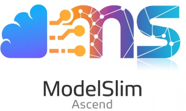

<h1 align="center"> MindStudio ModelSlim</h1>

   
  
  

    <em>Simple, fast, and lean—msModelSlim is all you need.</em>
  

  
<b>昇腾模型压缩工具</b>

  <!-- 用分隔线替代背景 -->

 
 
 
 
 
 

## ✨ 最新消息

🔹 **[2026.07.07]**

- 新增对腾讯混元 `Hy3`（W8A8）模型的量化支持

🔹 **[2026.06.01]**

- 新增对 `InternVL3_5-38B`（W8A8）、`InternVL3_5-241B-A28B`（W8A8）模型的量化支持
- 新增对 `Kimi-K2.6`（W4A8）模型的量化支持

🔹 **[2026.04.01]**

- 新增对 `DeepSeek-V4-Flash`（W8A8）模型的量化支持
- 新增对 `Kimi-K2.5`（W4A8）模型的量化支持

🔹 **[2026.03.01]**

- 新增对 `GLM-4.6V`（W8A8）模型的量化支持

🗂️ 历史更新（点击展开）

### 🗓️ 2026年2月

- msModelSlim 支持 Qwen3-Omni-30B-A3B-Thinking、Qwen3-Omni-30B-A3B-Instruct W8A8 量化
- msModelSlim 支持 Qwen2.5-Omni-7B W8A8 量化
- msModelSlim 支持 Qwen3.5-397B-A17B W8A8 量化
- msModelSlim 支持 GLM-5 W4A8 量化
- msModelSlim 优化一键量化场景推荐

### 🗓️ 2026年1月

- msModelSlim 支持 Qwen3-VL-32B-Instruct W8A8 量化

### 🗓️ 2025年12月

- msModelSlim 支持量化精度反馈自动调优，可根据精度需求自动搜索最优量化配置
- msModelSlim 支持自主量化多模态理解模型，支持多模态理解模型的量化接入
- msModelSlim 一键量化支持多卡量化，支持分布式逐层量化，提升大模型量化效率
- msModelSlim 支持 DeepSeek-V3.2 W8A8 量化，单卡64G显存、100G内存即可执行
- msModelSlim 支持 DeepSeek-V3.2-Exp W4A8 量化，单卡64G显存、100G内存即可执行
- msModelSlim 支持 Qwen3-VL-235B-A22B W8A8 量化

### 🗓️ 2025年11月

- msModelSlim 模型适配支持插件化和配置注册，支持依赖预检

### 🗓️ 2025年10月

- msModelSlim 支持 Qwen3-235B-A22B W4A8、Qwen3-30B-A3B W4A8 量化，vLLM-Ascend 已支持量化模型推理部署

### 🗓️ 2025年9月

- msModelSlim 支持 DeepSeek-V3.2-Exp W8A8 量化，单卡64G显存、100G内存即可执行
- msModelSlim 现已解决Qwen3-235B-A22B在W8A8量化下频繁出现"游戏副本"等异常token的问题
- msModelSlim 支持 DeepSeek R1 W4A8 per-channel 量化【Prototype】
- msModelSlim 支持大模型量化敏感层分析

### 🗓️ 2025年8月

- msModelSlim 支持 Wan2.1 模型一键量化
- msModelSlim 支持大模型逐层量化，显著降低大模型量化内存占用
- msModelSlim 支持大模型 SSZ 权重量化算法，通过迭代搜索最优缩放因子和偏移量提升量化精度

## 📖 简介

**MindStudio ModelSlim（msModelSlim）** 是昇腾生态下的高性能模型压缩工具，支持稠密LLM、MoE及多模态模型的量化与压缩，开发者可通过msModelSlim工具快速调优并导出适配MindIE、vLLM-Ascend等框架的模型，在昇腾AI处理器上实现高效部署。

## ⚙️ 功能介绍

| 功能名称 | 功能描述 |
|---------|--------|
| **一键量化** | 集成主流大模型量化最佳实践，支持 W4A8、W8A8、W8A16 等多种量化类型，自动匹配最优配置，开箱即用。 |
| **自主量化** | 提供标准接入框架，支持开发者将自有 LLM 及多模态模型快速集成至一键量化流程。 |
| **敏感层分析** | 多维度评估各层量化敏感度，精准定位应回退或提位宽的层，为量化配置调优提供数据支撑。 |
| **自动调优** | 根据精度目标自动迭代搜索量化配置，量化与评估全流程自动化，无需人工反复调参。 |
| **权重转换** | 无需校准集，离线对已有量化权重做格式与精度变换（如 FP8→BF16、BF16→MXFP8）。 |

> **模型支持情况概览**：各功能所适配的模型及其量化类型详见《[模型支持矩阵](./docs/zh/user_guide/model_support/foundation_model_support_matrix.md)》。

## 🚀 快速入门

帮助用户快速完成大模型量化功能，请参见 《[msModelSlim 快速入门](./docs/zh/quick_start/quantization_quick_start.md)》。

## 📦 安装指南

介绍工具的环境依赖与安装方法，请参见 《[msModelSlim 工具安装指南](./docs/zh/install_guide/install_guide.md)》。

## 📘 使用指南

工具的详细使用方法，请参见 《[msModelSlim 使用指南](./docs/zh/user_guide/msmodelslim_user_guide.md)》。

## 💡 典型案例

通过典型问题场景帮助用户理解并掌握工具使用，请参见 《[msModelSlim 典型案例](./docs/zh/best_practices/basic_cases.md)》。

## ❓ FAQ

常见问题及解决方案，请参见 《[FAQ](./docs/zh/support/faq.md)》。

## 🌌 智能检索

为提升文档查阅效率，我们提供多种高效检索方式： 
🔹 [AI 问答（DeepWiki）](https://deepwiki.com/Keithwwa/msmodelslim)：自然语言问答，快速把握项目架构与模块关系。 
🔹 [精确搜索（ReadTheDocs）](https://msmodelslim.readthedocs.io/zh-cn/latest/)：关键词全文检索，直达接口、参数与报错等信息。 

## 🛠️ 贡献指南

具体请参见 《[贡献指南](./docs/zh/contributing/contributing_guide.md)》。

## ⚖️ 相关说明

🔹 《[版本说明](docs/zh/release_notes/release_notes.md)》 
🔹 《[许可证声明](docs/zh/legal/license_notice.md)》 
🔹 《[安全声明](docs/zh/legal/SECURITY.md)》 
🔹 《[免责声明](docs/zh/legal/disclaimer.md)》 

## 🤝 建议与交流

欢迎大家为社区做贡献。如果有任何疑问或建议，请提交 [Issues](https://gitcode.com/Ascend/msmodelslim/issues)，我们会尽快回复。感谢您的支持。

|                                                                         即时互动（微信群）                                                                          |                                                                               官方资讯（公众号）                                                                                | 深度支持（助手/论坛）                                                                                                                                                                                                                                                                                                                                                                                                                                                                                                 |
|:----------------------------------------------------------------------------------------------------------------------------------------------------------:|:----------------------------------------------------------------------------------------------------------------------------------------------------------------------:|:--------------------------------------------------------------------------------------------------------------------------------------------------------------------------------------------------------------------------------------------------------------------------------------------------------------------------------------------------------------------------------------------------------------------------------------------------------------------------------------------------------------|
|  *扫码加入技术交流群* |  *扫码关注官方公众号* | 扫码入群并关注公众号，直达 MindStudio 用户与开发者最快捷的交流平台：  **快速提问：** 与社区小伙伴即时探讨技术问题 **掌握动态：** 第一时间获取版本发布与功能更新通知  **经验共享：** 与广大开发者交流最佳实践与实战心得      **更多支持渠道**：👉 昇腾助手： 👉 昇腾论坛： |

## 🙏 致谢

本工具由华为公司的下列部门联合贡献： 
🔹 昇腾计算MindStudio开发部 
🔹 昇腾计算生态使能部 
🔹 昇腾计算技术开发部 
🔹 2012实验室 

感谢来自社区的每一个 PR，欢迎贡献！
