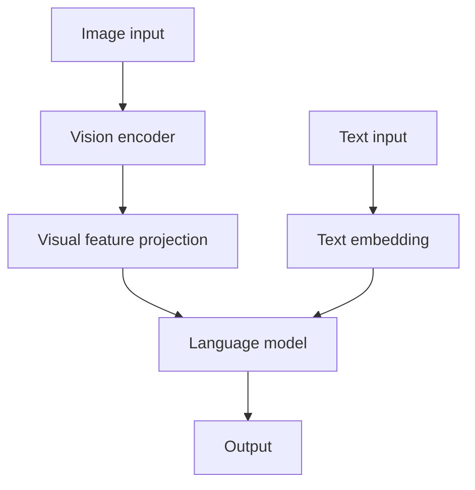

# Multimodal Understanding Model Integration Guide

## Overview

This document is for developers who need to integrate custom multimodal understanding models, or vision-language models (VLMs), into msModelSlim.

A multimodal understanding model typically consists of a visual encoder, a visual feature projection layer, and a language model. It can process image and text inputs simultaneously. Compared with pure language models, consider the following additional factors for quantization integration of multimodal understanding models:

- **Preparing multimodal calibration data**: Calibration data types are supported when they combine image and text prompts or use other multimodal fusion formats.
- **Fusing visual and language features**: Special architectures are adapted, such as Merger, which compresses and fuses visual feature dimensions, and DeepStack, which injects visual features across layers.
- **Processing the vision part as a whole**: The vision part is loaded and processed in one pass to simplify multimodal fusion logic.
- **Loading the language model layer by layer**: The language model is loaded and quantized layer by layer to avoid excessive memory and accelerator memory usage.

## Concepts

### Prerequisite Knowledge

Before you begin, you are advised to read [Model Integration Guide](integrating_models.md) to learn the basic interface concepts and model adapter design.

### Multimodal Model Architecture

A typical multimodal understanding model contains the following components:



- **Vision encoder**: converts images into visual features, such as ViT and CLIP.
- **Visual feature projection**: maps visual features into the hidden space of the language model, such as PatchMerger, a visual feature merging module based on patch compression.
- **Language model**: processes the fused multimodal features, such as the Qwen and GLM series.

### Multimodal Model Adapter

The multimodal model adapter inherits from `VlmBaseModelAdapter` and provides several common multimodal processing capabilities:

- `_load_config`: loads the model configuration.
- `_collect_inputs_to_device`: batches the preprocessed multimodal data and moves the inputs to the target device.

It also needs to implement the `ModelSlimPipelineInterfaceV1` interface. The main differences from a pure language model are:

- **`init_model`**: The vision part is fully loaded, and only the first layer of the language part is loaded.
- **`generate_model_visit`**: The entire vision part is processed first, and then the language part is processed layer by layer.
- **`generate_model_forward`**: The full vision forward pass, feature fusion, and layer-by-layer language forward pass are implemented.
- **`handle_dataset`**: Multimodal calibration data is processed, and image paths and text are converted into model inputs.

## Multimodal Model Integration

The following uses the [Qwen3-VL-MoE](https://gitcode.com/Ascend/msmodelslim/blob/master/msmodelslim/model/qwen3_vl_moe/model_adapter.py) W8A8 hybrid quantization scenario, referred to as the "scenario example", as the model integration example.

**Qwen3-VL-MoE loading strategy:**

- **Vision part**: The vision part is fully loaded, including all blocks and mergers, and is processed and quantized as a whole.
- **Language part**: The language part is loaded and processed layer by layer to save memory.

**Note**: Different models can choose different strategies as required. For example, if the vision part needs finer-grained control, you can also use a layer-by-layer approach. If you need to integrate other algorithms, see [Appendix: Supported Algorithm Interface Adaptation Guide](#supported-algorithm-interface-adaptation-guide).

### Creating a Model Adapter Directory and Files

You are advised to create a separate directory in [`msmodelslim/model/`](https://gitcode.com/Ascend/msmodelslim/tree/master/msmodelslim/model), such as `qwen3_vl_moe/`, with the following files:

- [`model_adapter.py`](https://gitcode.com/Ascend/msmodelslim/blob/master/msmodelslim/model/qwen3_vl_moe/model_adapter.py): main model adapter file
- [`__init__.py`](https://gitcode.com/Ascend/msmodelslim/blob/master/msmodelslim/model/qwen3_vl_moe/__init__.py): exported adapter class
- [`moe_utils.py`](https://gitcode.com/Ascend/msmodelslim/blob/master/msmodelslim/model/qwen3_vl_moe/moe_utils.py) (optional): helper conversion tools for special structures such as MoE fused weights

### Defining the Adapter Class and Inheriting the Required Interfaces

```python
from msmodelslim.model.vlm_base import VlmBaseModelAdapter
from msmodelslim.model.interface_hub import ModelSlimPipelineInterfaceV1
from msmodelslim.utils.logging import logger_setter

@logger_setter()
class Qwen3VLMoeModelAdapter(VlmBaseModelAdapter,  # Provides common multimodal capabilities.
                              ModelSlimPipelineInterfaceV1):  # Required. Supports quantization scheduling.
    """
    Qwen3-VL-MoE multimodal model adapter.
    Key features:
    - Layer-wise loading for text decoder
    - Vision encoder processed as a whole
    - Automatic MoE fusion layer conversion via MoeConverterProcessor
    - Multimodal calibration dataset support
    """
    pass
```

### Implementing Interface Methods

#### `handle_dataset`: Processing Multimodal Calibration Data

Convert calibration data (`VlmCalibSample`) into inputs supported by the multimodal understanding model. See [`vlm_dataset_loader.py`](https://gitcode.com/Ascend/msmodelslim/blob/master/msmodelslim/infra/dataset_loader/vlm_dataset_loader.py) for the definition of `VlmCalibSample`.

**Key points:**

- Use the `VlmCalibSample` structure to unify the data format. For the supported calibration data formats, see [Preparing Calibration Data](#preparing-calibration-data)
- **Load a processor or tokenizer**: mainstream multimodal understanding models, such as Qwen3-VL, usually use a processor for preprocessing, while models such as InternVL2-8B use a tokenizer. You need to configure this based on the inference example provided by the official model documentation.
- **Build `messages`**: multimodal understanding models that use a processor for preprocessing usually have their own message format, which you need to define according to the official inference example.
- Use `_collect_inputs_to_device` to move tensors to the target device in batches.

```python
def handle_dataset(self, dataset: Any, device: DeviceType = DeviceType.NPU) -> List[Any]:
    """
    Convert calibration samples to model inputs.
    Args:
        dataset: List of VlmCalibSample:
            - VlmCalibSample(image="/path/to/img.jpg", text="Describe.")  # Image-text pair
    Returns:
        List of model inputs (dict with input_ids, pixel_values, etc.)
    """
    from msmodelslim.infra.dataset_loader.vlm_dataset_loader import VlmCalibSample
    from transformers import AutoProcessor
    self._processor = AutoProcessor.from_pretrained(self.model_path, trust_remote_code=True, local_files_only=True)
    
    model_inputs = []
    for sample in dataset:
        image_path = sample.image
        text = sample.text
        # Build `messages`.
        messages = [
            {
                "role": "user",
                "content": [
                    {"type": "image", "image": image_path},
                    {"type": "text", "text": text}
                ]
            }
        ]
        # Use the processor to convert the inputs.
        inputs = self._processor.apply_chat_template(
            messages,
            tokenize=True,
            add_generation_prompt=True,
            return_dict=True,
            return_tensors="pt"
        )
        
        # Move tensors to the target device.
        # The keys and defaults here need to match the original model definition file.
        # For Qwen3-VL-235B-A22B, for example, you need to inspect transformers.models.qwen3_vl_moe.modeling_qwen3_vl_moe.py
        # to identify the forward parameters of the Qwen3VLMoeForConditionalGeneration class.
        inputs = self._collect_inputs_to_device(
            inputs,
            device,
            keys=[
                'input_ids',
                'attention_mask',
                'position_ids',
                'past_key_values',
                'inputs_embeds',
                'labels',
                'pixel_values',
                'pixel_values_videos',
                'image_grid_thw',
                'video_grid_thw',
                'cache_position',
                'logits_to_keep',
            ],
            defaults={'logits_to_keep': 0}
        )
        
        model_inputs.append(inputs)
    
    return model_inputs
```

#### `init_model`: Initializing the Model

The initialization of a multimodal understanding model requires the following attention:

- **Fully load the vision part**: The entire vision part is loaded in one pass.
- **Load only the first layer of the language part**: Only the first text decoder layer is loaded, and the remaining layers are dynamically loaded when needed.
- **Set the inference mode**: `_attn_implementation='eager'` and similar options are set.

**Key points:**

- Temporarily set `num_hidden_layers=1` to load only one language decoder layer.
- The vision part is loaded in full, including all blocks, `patch_embed`, `merger`, and `deepstack_merger_list`.
- Use `from_pretrained` instead of loading weights manually.
- If the first layer is an MoE layer, perform 3D weight conversion. See [`moe_utils.py`](https://gitcode.com/Ascend/msmodelslim/blob/master/msmodelslim/model/qwen3_vl_moe/moe_utils.py).

```python
def init_model(self, device: DeviceType = DeviceType.NPU) -> nn.Module:
    """
    Initialize model with vision encoder fully loaded and only first text layer.
    Returns:
        nn.Module: Model with:
            - model.visual (fully loaded: all blocks, mergers, and related submodules)
            - language_model.layers[0] (loaded)
            - language_model.layers[1..N] (to be loaded dynamically)
    """
    # 1. Load the configuration.
    from transformers import Qwen3VLMoeForConditionalGeneration
    
    # 2. Disable cache to save device memory.
    self.config.use_cache = False
    
    # 3. Save the original number of language layers and temporarily set it to 1 to load only the first layer.
    origin_layers = self.config.text_config.num_hidden_layers
    self.config.text_config.num_hidden_layers = 1
    
    # 4. Load the model with from_pretrained.
    # The vision part is fully loaded, and the language part loads only one layer.
    model = Qwen3VLMoeForConditionalGeneration.from_pretrained(
        self.model_path,
        config=self.config,
        trust_remote_code=self.trust_remote_code,
        torch_dtype="auto",
        local_files_only=True,
        device_map="cpu",
        attn_implementation='eager'
    ).eval()
    
    # 5. Restore the original layer count and attention mode.
    self.config.text_config.num_hidden_layers = origin_layers
    self.config.text_config._attn_implementation = 'eager'
    
    # 6. Load the complete state_dict.
    state_dict = self._get_state_dict(model)
    model.load_state_dict(state_dict)

    # 7. If the first language layer is an MoE layer, convert the weights.
    if self._is_moe_layer(0):
        self._convert_single_moe_layer(model.model.language_model.layers[0], 0)
    
    return model
```

#### `generate_model_visit`: Generating the Model Visit Sequence

Yield each module that needs to be quantized in the topological order of the model structure. **The order is critical** and must match the forward propagation order.

**Key points:**

- **Treat the vision part as a whole**: Yield `model.visual` once. It includes all submodules.
- **Yield the language part layer by layer**: Use the standard `generated_decoder_layer_visit_func` function.
- Use the `generate_decoder_layer` generator to dynamically load text layers.
- For MoE layers, the weights are automatically converted in `_load_decoder_if_not_exist`.

```python
def generate_model_visit(self, model: nn.Module) -> Generator[ProcessRequest, Any, None]:
    """
    Generate model visit sequence for layer-wise processing.
    
    Order (critical):
    model.visual (treat the entire vision part as a whole)
    2. language_model.layers[0], language_model.layers[1], ..., language_model.layers[L-1]
    """
    # 1. Process the entire vision part as a whole.
    yield ProcessRequest(
        name="model.visual",
        module=model.model.visual,
        args=(),
        kwargs={}
    )
    
    # 2. Process the language part layer by layer.
    yield from generated_decoder_layer_visit_func(
        model, 
        transformer_blocks=self.generate_decoder_layer(model)
    )

def generate_decoder_layer(self, model: nn.Module) -> Generator[Tuple[str, nn.Module], None, None]:
    """
    Generate decoder layers, loading them on-demand.
    
    Yields:
        (layer_name, layer_module) tuples
    """
    num_layers = self.config.text_config.num_hidden_layers
    
    for layer_idx in range(num_layers):
        name = f"model.language_model.layers.{layer_idx}"
        
        # Dynamically load the layer if it is not loaded yet.
        layer = self._load_decoder_if_not_exist(model, name, layer_idx)
        
        yield name, layer
```

#### Auxiliary Method: Dynamically Loading Weights of the Language Part

Because the vision part is fully loaded in `init_model`, you only need to implement dynamic loading logic for the text decoder of the language part.

```python
def _load_decoder_if_not_exist(self, model: nn.Module, name: str, layer_idx: int) -> nn.Module:
    """
    Dynamically load a text decoder layer if not already loaded.
    Args:
        model: The model instance
        name: Full layer name (e.g., "model.language_model.layers.1")
        layer_idx: Layer index
    Returns:
        Loaded decoder layer module
    """
    try:
        # Try to access the layer.
        decoder = model.get_submodule(name)
        # Check whether it is really loaded and not on the meta device.
        try:
            _ = decoder.input_layernorm.weight.device
            return decoder
        except RuntimeError:
            pass  # It is on the meta device and needs to be loaded.
    except AttributeError:
        pass  # The layer does not exist and needs to be created.
    
    # Disable reset_parameters to avoid unnecessary initialization.
    from unittest.mock import patch
    with patch.object(nn.Linear, 'reset_parameters', lambda _self: None):
        # Create the layer structure.
        from transformers.models.qwen3_vl_moe.modeling_qwen3_vl_moe import Qwen3VLMoeTextDecoderLayer
        decoder = Qwen3VLMoeTextDecoderLayer(
            self.config.text_config,
            layer_idx=layer_idx
        )
        
        # Load weights from safetensors.
        state_dict = self._get_state_dict(decoder, prefix=name)
        decoder.load_state_dict(state_dict)
        decoder.eval()
        
        # Add the layer to the layer list of the model.
        module_list = model.model.language_model.layers
        if len(module_list) <= layer_idx:
            module_list.append(decoder)
        else:
            module_list[layer_idx] = decoder
    
    # Only models with 3D fused MoE weights need this step. If it is an MoE layer, convert the weights.
    if self._is_moe_layer(layer_idx):
        self._convert_single_moe_layer(decoder, layer_idx)
    
    return decoder

def _is_moe_layer(self, layer_idx: int) -> bool:
    """Check if a layer is a MoE layer"""
    # Determine whether this is an MoE layer with 3D fused weights.
    pass

def _convert_single_moe_layer(self, layer: nn.Module, layer_idx: int):
    """
    Convert MoE layer's 3D fused weights to standard nn.Linear layers.
    
    Args:
        layer: The decoder layer module
        layer_idx: Layer index (for logging)
    """
    # Implement the underlying logic for the equivalent replacement of standard nn.Linear layers in moe_utils.py.
    # For Qwen3-VL-235B-A22B, for example, you need to inspect transformers.models.qwen3_vl_moe.modeling_qwen3_vl_moe.py
    # to identify the definition of Qwen3VLMoeTextSparseMoeBlock and design the equivalent replacement.
    from .moe_utils import UnstackedQwen3VLMoeSparseMoeBlock
    """
    Equivalent replacement operation
    """
    pass
```

#### `generate_model_forward`: Generating the Model Forward Propagation Sequence

Implement the full forward pass of the model and yield the processing request for each layer. The vision part runs as a whole, and the language part runs layer by layer.

**Key points:**

- **Understand the forward logic**: Compared with large language models, multimodal understanding models involve operations such as modality fusion, so the layer-by-layer forward propagation sequence is more complex. You must fully understand the forward definition in the original model file. For Qwen3-VL-235B-A22B, for example, you need to inspect `transformers.models.qwen3_vl_moe.modeling_qwen3_vl_moe.py` for the original model definition.
- **Run the vision encoder once**: Call `model.model.visual()` to get all outputs.
- **Fuse visual features**: Use `masked_scatter` to replace image features into the text sequence. The exact operation for each model needs to follow the original model definition.
- **DeepStack injection**: Inject the corresponding DeepStack visual features after specific text layers. Whether a model uses this depends on the original model definition.
- **Yield the text decoder layers one by one**: Dynamically load and process each layer through `generate_decoder_layer`.
- **Device management**: The processor handles this automatically. You do not need to call `.to(device)` manually.

```python
def generate_model_forward(self, model: nn.Module, inputs: Any) -> Generator[ProcessRequest, Any, None]:
    """
    Generate model forward sequence.
    
    Flow:
    1. Run vision encoder as a whole -> get image features
    2. Merge image features into text embeddings
    3. Run each text decoder layer with proper inputs
    """
    # 1. Extract the calibration sample.
    if isinstance(inputs, list):
        sample = inputs[0]
    else:
        sample = inputs
    
    # ========== Stage 1: Full forward propagation of the vision encoder ==========
    # Determine the input parameters for the vision part based on fields in inputs that are not None.
    # See the original model definition for the exact implementation.
    pixel_values = sample['pixel_values']
    image_grid_thw = sample['image_grid_thw']
    
    with torch.no_grad():
        # Run the entire vision part in one pass.
        image_embeds, deepstack_image_embeds = yield ProcessRequest(
            name="model.visual",
            module=model.model.visual,
            args=(pixel_values, image_grid_thw),
            kwargs={},
        )
    
    # ========== Stage 2: Language model input construction (fusing visual features) ==========
    # Determine the input parameters for the language part based on fields in inputs that are not None.
    # See the original model definition for the exact implementation.
    input_ids = sample['input_ids']
    attention_mask = sample['attention_mask']
    
    # Get text embeddings.
    inputs_embeds = model.model.language_model.embed_tokens(input_ids)
    
    # Fuse visual features by replacing the <image> placeholder positions with image_embeds.
    """
    Implement visual feature fusion.
    """
    
    # ========== Stage 3: Layer-by-layer forward propagation of the text decoder ==========
    # See the original model definition for the exact implementation.
    """
    Implement position_ids and attention_mask.
    position_ids = ...
    attention_mask = ...
    text_position_ids = ...
    cache_position = ...
    position_embeddings = ...
    """

    # Process the text decoder layer by layer.
    hidden_states = inputs_embeds
    for layer_idx, (name, layer) in enumerate(self.generate_decoder_layer(model)):
        with torch.no_grad():
            # Forward propagation
            hidden_states = yield ProcessRequest(
                name=name,
                module=layer,
                args=(hidden_states,),
                kwargs={
                    'attention_mask': attention_mask,
                    'position_ids': text_position_ids,
                    'cache_position': cache_position,
                    'position_embeddings': position_embeddings,
                    'past_key_values': None,
                    'use_cache': False,
                },
            )
            
            # DeepStack injection, if this layer needs it
            """
            Implement DeepStack injection.
            """

```

### Registering the Model Name

Register the model in [`config/config.ini`](https://gitcode.com/Ascend/msmodelslim/blob/master/config/config.ini):

```ini
[ModelAdapter]
# ...Other models...
qwen3_vl_moe = Qwen3-VL-30B-A3B, Qwen3-VL-235B-A22B

[ModelAdapterEntryPoints]
# ...Other models...
qwen3_vl_moe = msmodelslim.model.qwen3_vl_moe.model_adapter:Qwen3VLMoeModelAdapter
```

### Preparing Calibration Data

Calibration data is specified by the YAML `dataset` field. `dataset` can be configured as a short identifier (can be found in [`lab_calib`](../../../lab_calib)), an absolute path, or a relative path. Three usage patterns are supported: `index.json` or `index.jsonl`, a directory that contains only images, and an image directory plus a single `json` or `jsonl` file. For details, see [Quick Quantization Guide: `dataset` - Calibration Data Path Configuration](../feature_guide/quick_quantization_v1/usage.md#dataset---calibration-data-path-configuration).

### Preparing the Quantization Configuration

Create a quantization config file in YAML format, for example [`qwen3_vl_moe_w8a8.yaml`](https://gitcode.com/Ascend/msmodelslim/blob/master/lab_practice/qwen3_vl_moe/qwen3_vl_moe_w8a8.yaml):

```yaml
apiversion: multimodal_vlm_modelslim_v1
# ========== W8A8 dynamic quantization configuration ==========
default_w8a8_dynamic: &default_w8a8_dynamic
  act:
    scope: "per_token"
    dtype: "int8"
    symmetric: True
    method: "minmax"
  weight:
    scope: "per_channel"
    dtype: "int8"
    symmetric: True
    method: "minmax"
# ========== W8A8 static quantization configuration ==========
default_w8a8: &default_w8a8
  act:
    scope: "per_tensor"
    dtype: "int8"
    symmetric: False
    method: "minmax"
  weight:
    scope: "per_channel"
    dtype: "int8"
    symmetric: True
    method: "minmax"

spec:
  # ========== Quantization configuration ==========
  process:
    - type: "linear_quant"
      qconfig: *default_w8a8
      include:
        - "*"
      exclude:
        - "*experts*"  # Exclude MoE experts for dynamic quantization
        - "*linear_fc2"
        - "*merger*"
        - "*deepstack_merger_list*"
        - "*mlp.gate"
    - type: "linear_quant"
      qconfig: *default_w8a8_dynamic
      include:
        - "*experts*"  # MoE experts use dynamic quantization
      exclude:
        - "*linear_fc2"
        - "*merger*"
        - "*deepstack_merger_list*"
        - "*mlp.gate"
  
  # ========== Saving configuration ==========
  save:
    - type: "ascendv1_saver"
      part_file_size: 4
  # ========== Dataset configuration ==========
  dataset: calibImages  # Calibration image directory
  default_text: "Describe this image in detail."  # Default text prompt for images
```

For detailed descriptions of each field in the configuration, see [Quantization Configuration Protocol](../feature_guide/quick_quantization_v1/usage.md#multimodal_vlm_modelslim_v1-configuration).

## Quantizing Self-Owned Models

After you finish writing the model adapter, registering it, preparing the configuration file, and preparing the calibration data, you can run quantization:

```bash
msmodelslim quant --model_path ${MODEL_PATH} \
                  --save_path ${SAVE_PATH} \
                  --device npu \
                  --model_type ${MODEL_TYPE} \
                  --config_path ${CONFIG_PATH} \
                  --trust_remote_code True
```

**Parameter remarks:**
If `trust_remote_code` is set to `True`, code files in the weights directory of the floating-point model may be executed. Ensure that the source of the floating-point model is secure. `${MODEL_PATH}` is the path to the original floating-point weights, `${SAVE_PATH}` is the user-defined path for saving the quantized weights, `${MODEL_TYPE}` is the registered model name, and `${CONFIG_PATH}` is the path to the YAML config file.

## FAQ

### Out-of-Memory (OOM) Errors During Quantization

**Symptom**: Accelerator memory runs out during quantization.

**Cause and Solution**

- For the **vision part**, the current Qwen3-VL-MoE implementation uses a fully loaded approach. If OOM occurs, consider:
  - Reducing the number of images in the calibration data
  - Using lower-resolution images for calibration
  - Using an NPU with more device memory
  - Referring to the layer-by-layer quantization implementation of the language part and adapting the vision part to process layers one by one.
- For the **text part**, make sure layer-by-layer processing is implemented correctly.
- Ensure that `num_hidden_layers` is temporarily set to 1 in `init_model` so only the first text decoder layer is loaded.
- Use `_load_decoder_if_not_exist` in `generate_decoder_layer` to load text decoder layers on demand.

### MoE Weight Conversion Issues

**Symptom**: The 3D weights of an MoE layer cannot be loaded directly as standard linear layers.

**Cause**: The original model uses 3D parameters to store the weights of all experts.

**Solution**

- Refer to `_convert_single_moe_layer` in [Auxiliary Method: Dynamically Loading Weights of the Language Part](#auxiliary-method-dynamically-loading-weights-of-the-language-part) and implement the logic to split 3D weights into multiple linear layers.
- Refer to the underlying equivalent replacement logic in [`moe_utils.py`](https://gitcode.com/Ascend/msmodelslim/blob/master/msmodelslim/model/qwen3_vl_moe/moe_utils.py).

### Calibration Data Format Error

**Symptom**: `InvalidDatasetError` is reported during running.

**Cause**: The calibration data format does not meet the requirements, or the model does not support that type.

**Solution**

- Check whether the data format meets the requirements in [Preparing Calibration Data](#preparing-calibration-data).
- Ensure that the image path is accessible and the format is correct (`.jpg`, `.png`, or `.jpeg`).

## Appendix

### Supported Algorithm Interface Adaptation Guide

#### Supporting the IterSmooth Outlier Suppression Algorithm

If you need to support the IterSmooth algorithm, which means Iterative Smooth, an iterative smoothing algorithm that improves quantization accuracy by iteratively smoothing and suppressing outliers in activation values, implement `IterSmoothInterface`:

```python
from msmodelslim.model.interface_hub import IterSmoothInterface

class Qwen3VLMoeModelAdapter(VlmBaseModelAdapter,
                              ModelSlimPipelineInterfaceV1,
                              IterSmoothInterface):
    
    def get_adapter_config_for_subgraph(self,) -> List[AdapterConfig]:
        """
        Get adapter config for subgraph-based anti-outlier processing (iter_smooth).
        
        Defines the subgraph structure for norm-linear, ov, and other fusions.
        """
        adapter_config = []
        
        # Add the outlier suppression mapping configuration for the text decoder in the language part.
        for layer_idx in range(self.config.text_config.num_hidden_layers):
            # Norm-Linear: input_layernorm -> QKV
            """
            Define norm_linear_mapping_config.
            """
            # OV fusion: V -> O
            """
            Define ov_mapping_config.
            """
            # Define other mapping configurations.
            """
            Define linear_linear_mapping_config.
            Define up_down_mapping_config.
            """

            # Add to the adapter configuration.
            adapter_config.extend([
                AdapterConfig(
                    subgraph_type="norm-linear",
                    mapping=norm_linear_mapping_config
                ),
                AdapterConfig(
                    subgraph_type="ov",
                    mapping=ov_mapping_config,
                    extra_config={}
                ),
            ])
        return adapter_config
```

For details, see: [Iterative Smooth Adaptation](../quantization_algorithms/outlier_suppression_algorithms/iterative_smooth.md#model-adaptation)

#### Supporting the QuaRot Rotation-Based Outlier Suppression Algorithm

If you need to support the Quantization with Rotation (QuaRot) algorithm, an approach that uses orthogonal rotation transforms to distribute activation outliers evenly across dimensions and thereby significantly smooth the data distribution and improve quantization accuracy, implement the initialization and application of rotation matrices:

```python
from msmodelslim.model.interface_hub import QuaRotInterface

class Qwen3VLMoeModelAdapter(VlmBaseModelAdapter,
                              ModelSlimPipelineInterfaceV1,
                              QuaRotInterface):
    
    def get_ln_fuse_map(self) -> Tuple[Dict[str, List[str]], Dict[str, List[str]]]:
        """
        Obtain the fusion mapping between the LayerNorm and linear layers.
        """
        # See the QuaRot documentation for implementation details.
        pass

    def get_bake_names(self) -> Tuple[List[str], List[str]]:
        """
        Obtain the list of names of linear layers that require mean fusion.
        """
        # See the QuaRot documentation for implementation details.
        pass

    def get_rotate_map(self, block_size: int) -> Tuple[List[RotatePair], List[RotatePair]]:
        """
        Obtain the rotation mapping, including the left and right rotation configurations.
        """
        # See the QuaRot documentation for implementation details.
        pass
```

For details, see [QuaRot Adaptation](../quantization_algorithms/outlier_suppression_algorithms/quarot.md#model-adaptation).

### References

- [Model Integration Guide](integrating_models.md): basic guidance for integrating models
- [Qwen2.5-Omni model adapter](https://gitcode.com/Ascend/msmodelslim/blob/master/msmodelslim/model/qwen2_5_omni_thinker/model_adapter.py): end-to-end multimodal adaptation example for text, images, audio, and video
- [Qwen3-VL-MoE model adapter](https://gitcode.com/Ascend/msmodelslim/blob/master/msmodelslim/model/qwen3_vl_moe/model_adapter.py): complete implementation example
- [VLM dataset loader](https://gitcode.com/Ascend/msmodelslim/blob/master/msmodelslim/infra/dataset_loader/vlm_dataset_loader.py) and [dataset_loader](https://gitcode.com/Ascend/msmodelslim/blob/master/msmodelslim/infra/dataset_loader/): calibration data loading and processing
- [Multimodal VLM quantization service](https://gitcode.com/Ascend/msmodelslim/tree/master/msmodelslim/core/quant_service/multimodal_vlm_v1): service layer implementation
- [Quick Quantization Guide](../feature_guide/quick_quantization_v1/usage.md): CLI parameter details
