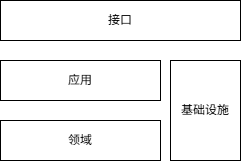

# msModelSlim Architecture

<!-- md-trans-meta sourceCommit=0dcb0df3ef37737beef6b9a2fa93197f635a1366 translatedAt=2026-08-20T11:47:18.593Z pushedAt=2026-08-21T01:10:42.011Z -->

The core value of msModelSlim lies in **accumulating, managing, and organizing** knowledge related to model quantization and compression (such as quantization algorithms and formats). For a new model, existing knowledge and experience can be quickly reused to complete the quantization and compression of the new model, effectively controlling accuracy loss and improving inference performance.

## Design Philosophy

### Model Quantization Involving Multi-Domain Knowledge

Model quantization covers multiple domains such as model structure, quantization algorithm, and quantized weight format, with dependencies among the knowledge of these domains (for example, the quantization algorithm depends on base capabilities such as low-precision data formats and feature extraction). Quantization itself is the process of applying this knowledge, and it is necessary to connect the knowledge of each domain and orchestrate it into an executable business process.

msModelSlim directly maps the concepts of `knowledge domain` and `knowledge app` into the code:

- Manage the knowledge and its implementation of the corresponding domain under independent **domain** directories, achieving systematic classification of knowledge;

- Build various **app** processes that leverage knowledge to address the pain points and difficulties encountered in the end-to-end model quantization process.

### Model Quantization Involving Multiple Stages

Model quantization is a comprehensive inference performance optimization scheme that typically involves the following stages: model profiling and analysis, quantization scheme design, weight quantization, quantization operator development, quantization graph construction, deployment and evaluation, and the management of quantization best practices (including quantized weights). A quantization tool can be used not only to generate quantized weights, but also to participate in other stages to simplify and accelerate the entire quantization process.

In this process, the quantization tool does not handle everything on its own. Instead, it focuses on quantization knowledge itself and collaborates with external libraries, tools, and services such as databases, model repositories, performance tools, evaluation tools, and inference frameworks to jointly complete quantization tasks. msModelSlim collectively refers to these external dependencies as `infrastructure`, and describes in the infrastructure adaptation code how to introduce and coordinate the infrastructure during the quantization process, and carry cross-domain knowledge. The knowledge serves quantization operations but is bound to specific infrastructure; it reflects the characteristics of the corresponding infrastructure while remaining rooted in quantization concepts.

### Model Quantization Involving Multiple Roles

The deployment of a quantized model relies on quantized weights, quantization operators, and the inference framework. Quantization algorithm experts, operator experts, and inference experts divide their work and cooperate at different stages. To coordinate the work of different roles and unify the understanding of the quantization scheme, a clear `quantization description language` is required.

msModelSlim provides a quantization scheme description language based on YAML configuration. This language offers good readability, ease of adjustment, and shareability, and is applicable to various models such as large language models, multimodal understanding models, and multimodal generation models. Algorithm configurations are passed through to the quantization algorithm code, and their formats allow algorithm experts to customize them. Inference experts do not need to write algorithm code; they only need to enter algorithm parameters in the agreed format to trigger the execution of the quantization algorithm.

### Quantization: Pattern Recognition and Replacement of Model Structures

Models are typically composed of stacked basic structures. **Model quantization replaces the original model substructures with quantization structures that deliver better performance.**
A quantization algorithm needs to accomplish three tasks:

1. **Pattern matching**: find the structural locations that need to be replaced;

2. **Parameter computation and structure creation**: compute the quantization parameters and generate the quantization structure;

3. **Structure replacement**: replace the original structure with the quantization structure.

`quantization structure` is the foundation of the quantization algorithm and also the anchor for interaction among quantization tools, operators, and inference frameworks:

- Quantization tools prepare quantization parameters and quantized weights for the quantization structure;

- Operators provide device-affine implementation units for the quantization structure;

- The framework assembles operators into a complete quantization structure and loads weights and parameters for it.

msModelSlim abstracts the quantization structure into a `quantization mode` (for example, W8A8 INT8 static quantization), which serves as one of the architectural cornerstones of msModelSlim. This abstraction is formalized, independent of the inference device, and describes the quantization formula and the necessary parameters.

## Overall Architecture

msModelSlim is divided into four layers: **interface layer**, **app layer**, **domain layer**, and **infrastructure layer**.

### Interface Layer

The interface layer consists of multiple `interfaces`, each providing a set of solutions targeting specific business pain points. Apps, domains, and infrastructure each focus on a particular direction, like building blocks; interfaces select the blocks according to actual business scenarios and assemble them into **triggerable and executable** business flows. msModelSlim currently exposes command-line tools, providing commands such as one-click quantization, sensitive layer analysis, and automatic tuning.

### App Layer

The app layer consists of multiple knowledge apps, each of which orchestrates a knowledge workflow to achieve a specific business objective. For example, the one-click quantization app implements model quantization through "loading model information", "obtaining the optimal quantization scheme", and "applying the quantization algorithm". The app workflow itself is abstract and must be combined with specific knowledge to accomplish a task. For example, the one-click quantization app, together with DeepSeek model adaptation and the W8A8 quantization algorithm, implements W8A8 quantization of the DeepSeek model.

### Domain Layer

The domain layer consists of multiple knowledge domains, each of which encapsulates a category of knowledge. msModelSlim defines domains not by their connotation but by their capabilities, so that knowledge with similar capabilities belongs to the same domain. For example, processing model substructures based on inference calibration is regarded as a quantization algorithm. This definition is not rigorous, but the generalization of its extension makes it easier for knowledge to be integrated into apps and to expand the knowledge base.

msModelSlim refers to a group of mutually collaborating components that implement the knowledge defined by a domain as a `component`. On the one hand, a component has a clear applicable scenario; on the other hand, a component has a clear technical path. Switching between different scenarios and different technical paths is transformed in msModelSlim into using different components in an app. For example, given an existing W8A8 quantization of a DeepSeek model, to pursue better performance and further perform W4A8 quantization, it is only necessary to switch the quantization algorithm component from the W8A8 algorithm to the W4A8 algorithm.

### Infrastructure Layer

The infrastructure layer consists of multiple `infrastructure adaptation` components, each of which satisfies quantization requirements on top of external dependencies. For example, the Qwen model adaptation loads and performs inference on the Qwen model based on the Transformers library, satisfying the requirements of quantization calibration. Adaptation code is tightly coupled with external dependencies; even if the quantization requirements remain unchanged, changing external dependencies often requires synchronously updating the adaptation code. For example, when the Transformers version is updated, the original Qwen model adaptation logic may become invalid, and msModelSlim recommends a Transformers version for quantization of each model.

The quantization requirements of infrastructure adaptation do not originate from the infrastructure itself, but from the app layer and the domain layer, ensuring that the quantization logic forms a closed loop within msModelSlim. msModelSlim requires apps, domains, and components to **explicitly** state their demands on the infrastructure and summarizes them into `interface protocol`. Infrastructure adaptation responds to these demands and implements the interface protocol by leveraging the infrastructure.

Although different internal entities such as apps, domains, and components may propose similar interface protocols, these interface protocols originate from the logic of different entities and should be regarded as mutually independent rather than conflated. However, a single infrastructure can satisfy multiple demands, and a single infrastructure adaptation can also implement multiple interface protocols simultaneously. For example, the one-click quantization app needs to read best practices, while the automatic tuning app needs to store best practices; best practice management based on the file system, as an infrastructure adaptation, can implement both the read and store interface protocols simultaneously.

## Quantization Mode

The performance gain brought by quantization stems from replacing the original model structure with a hardware-affine quantization structure that delivers better inference performance. A quantization structure is not native to the model; external knowledge must be injected. The inference team performs quantization graph construction for the model, and the operator team develops new quantization operators.

msModelSlim refers to a class of quantization structures with consistent patterns as a **quantization mode** (for example, W8A8 INT8 static quantization). Once a quantization mode is defined, the parameter set of the quantization structure and the quantization/dequantization process are also determined. Furthermore, the theoretical performance and accuracy trends can be estimated. Based on a unified understanding of the quantization mode, the quantization team, the operator team, and the inference team independently design and build the weights, operators, and graph construction. When the three are finally combined, the quantized model inference service can be smoothly accepted and deployed, satisfying the accuracy loss constraint while achieving the expected performance gain.

msModelSlim uses the `IR (Intermediate Representation)` domain to concretize the quantization mode, serving as the **cornerstone** of the quantization knowledge system. As the cornerstone, IR serves all inference frameworks and all hardware devices. Therefore, IR should not be bound to any hardware device, nor should it reproduce the actual forward process of an inference framework. Instead, it formally describes the quantization mode and reproduces the input-output mapping. Fortunately, values in low-precision data formats can always be exactly represented by high-precision data formats. Therefore, we do not need to rely on low-precision quantization operators bound to hardware devices; we can simulate the actual inference process using high-precision numerical computation that is widely supported by all hardware devices. This quantization inference process that simulates low precision with high precision is called **pseudo-quantization**. Pseudo-quantization can reflect quantization accuracy, but it loses hardware affinity and therefore cannot obtain the performance gain brought by quantization.

## Quantization Algorithm

The quantization algorithm replaces substructures of the original model with high-performance quantization structures, thereby accelerating inference. The algorithm needs to address the following issues:

1. Which substructures can be replaced?

2. Which quantization mode should they be replaced with?

3. How are the quantization parameters computed?

4. How does a quantization mode achieve hardware affinity?

The hardware affinity problem is mainly addressed by operators, while the algorithm design of the quantization tool focuses on the first three problems. Among them, quantization structure replacement needs to be completed in synchronization with the inference framework, while quantization parameter computation is the core responsibility of the quantization tool. Quantization is a form of lossy compression, and a good parameter computation method can effectively reduce the accuracy loss after quantization.

Based on whether quantization parameter computation depends on activation value features, msModelSlim classifies quantization algorithms into **calibration-free algorithms** and **calibration-based algorithms**:

- **Calibration-based algorithms** need to run model inference on a specific dataset to capture activation features and assist in quantization parameter computation;

- **Calibration-free algorithms** only need to load the weights to complete quantization parameter computation.

msModelSlim decomposes the parameter calibration process of multiple algorithms in a quantization scheme based on a specific calibration dataset into a series of basic calibration units. Each calibration unit can be represented by a triple of `a batch of data, a segment of inference, a quantization algorithm`, that is, **one algorithm** identifies and replaces the quantization modes involved in **a segment of inference** based on the activation features during the inference process of **a batch of data**, and adjusts its quantization parameters. Through this fine-grained decomposition, msModelSlim can fully utilize computing power and memory to complete model quantization with low resource consumption and time cost. An algorithm is also defined as the processing of a model substructure based on inference calibration, and is managed in the `Processor` domain.

## Model Adaptation

Model adaptation is not an inherently necessary step in the model quantization process. In the simplest quantization scenario, developers usually write quantization scripts directly targeting the structure of the model to be quantized. Such scripts have no independent adaptation logic; the structural information of the model is scattered throughout the algorithm details and cannot be separated from the algorithm code. Each new model requires writing a quantization script from scratch, and even switching the quantization scheme of the same model may require rewriting the script.

Model adaptation extracts model-related code into independent logic, with the goal of achieving generality and generalization in the quantization process. This process consists of two stages:

1. **Intra-component decoupling**: Components such as algorithms and scheduling each decompose their code logic into "model adaptation logic" and "core mechanisms". In the scenario of quantizing a new model, only the model adaptation logic needs to be modified, without changing the core mechanisms of the components.

2. **Unified adaptation framework**: The model adaptation logic of all components is aggregated into a unified model adaptation framework. In a new model quantization scenario, only a new model adapter needs to be added, without large-scale modification of each component.

In msModelSlim, `Model` model adaptation is a kind of infrastructure, reflecting the dependence of internal knowledge (such as algorithms and scheduling) on external model knowledge.
Taking the SmoothQuant algorithm as an example, the smoothing process needs to identify and process "Norm-Linear" model structure pairs.
At present, automatic identification still faces technical challenges, and the location information of structure pairs needs to be customized for specific model structures. DeepSeek models and Qwen models have completely different "Norm-Linear" structure pairs.

The dependence of this internal knowledge on models is rooted in the internal knowledge itself, and the dependencies of different internal knowledge are independent of each other.
msModelSlim requires each piece of internal knowledge that depends on models to **explicitly** state its requirements for model information, and summarizes them into a **model adaptation interface protocol**. Model adapters implement a subset of the total interface protocol set as needed.
For example, W8A8 MXFP8 quantization has small precision loss, and the quantization scheme does not use an outlier suppression algorithm, so there is no need to implement outlier suppression interface protocols such as SmoothQuant.
If the QuaRot rotation suppression interface protocol is implemented during W8A8 quantization, then subsequent W4A8 quantization can continue to use rotation suppression without modifying or extending the model adapter.

## Quantization Format

Quantized weights are the deliverables that the quantization tool provides to the inference framework. They inform the inference framework of which positions are replaced with which quantization mode and what the quantization parameters are, and they supplement the overall quantization information. The quantization format, in turn, is the interaction protocol between the two, specifying how the inference framework should read and parse the above information. Serving the actual inference process, the quantization format inevitably needs to compromise with and be customized for the inference framework, quantization operators, and even inference devices. It often adds extra parameters with framework/hardware affinity to accelerate model loading and the inference process.

msModelSlim uses the `Format` domain to carry quantization format knowledge, focusing on how the parameters of each quantization mode are persisted and how the overall quantization strategy is described. In multi-card acceleration scenarios, different cards are each responsible for part of the quantization structure. Therefore, the quantization format needs to consider how to merge multiple shards of quantized weights (for example, by averaging, concatenating, or selecting the result from the primary card).
