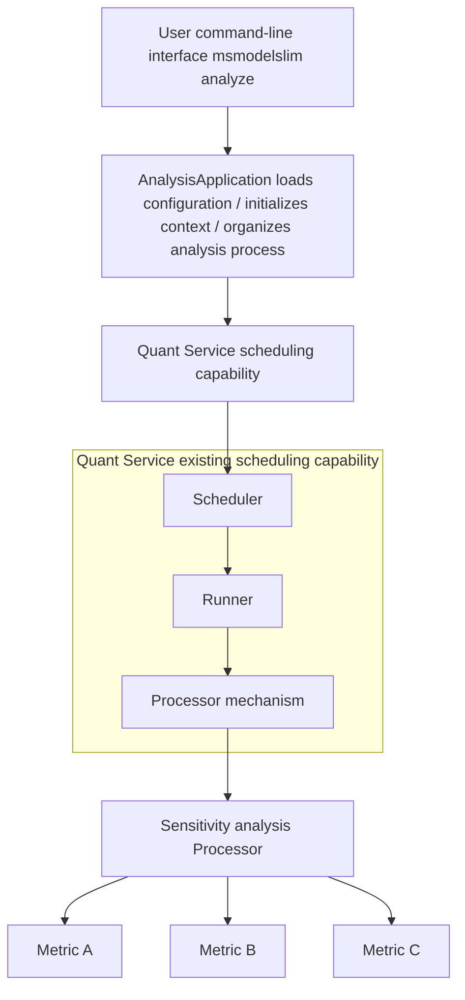

# **msModelSlim Sensitive Layer Analysis Module Refactoring Feature Design Specification**

<table>
    <tr>
        <td>Affiliated SIG Group:</td>
        <td>msit</td>
    </tr>
    <tr>
        <td>Target Version:</td>
        <td>26.0.0</td>
    </tr>
    <tr>
        <td>Designers:</td>
        <td>libowen</td>
    </tr>
    <tr>
        <td>Date:</td>
        <td>20260122</td>
    </tr>
</table>

**Copyright © 2026 msModelSlim Community**

Your copying, use, modification, and distribution of this document are subject to the Creative Commons Attribution-ShareAlike 4.0 International Public License (referred to as "CC BY-SA 4.0" in this document).
For your convenience, you can access <https://creativecommons.org/licenses/by-sa/4.0/> to learn about a summary of CC BY-SA 4.0 (but not a replacement).
You can access the following URL to obtain the full text of CC BY-SA 4.0: <https://creativecommons.org/licenses/by-sa/4.0/legalcode>.

**Revision History**

<table>
    <tr>
        <th>Date</th>
        <th>Revision Version</th>
        <th>Revision Description</th>
        <th>Author</th>
        <th>Reviewer</th>
    </tr>
    <tr>
        <td>20260122</td>
        <td>1.0.0</td>
        <td>Document creation</td>
        <td>libowen</td>
        <td>panyj1993</td>
    </tr>
</table>

**Table of Contents**

1. Feature Overview

    1.1 Scope

    1.2 Feature Requirement List

2. Requirement Scenario Analysis

    2.1 Feature Requirement Source and Value Overview

    2.2 Feature Scenario Analysis

    2.3 Feature Impact Analysis

    2.3.1 Hardware Limitations

    2.3.2 Technical Limitations

    2.3.3 Impact Analysis on License

    2.3.4 Impact Analysis on System Performance Specifications

    2.3.5 Impact Analysis on System Reliability Specifications

    2.3.6 Impact Analysis on System Compatibility

    2.3.7 Impact Analysis on Interactivity and Conflicts with Other Major Features

    2.4 Analysis of Similar Community/Commercial Software Implementation Solutions

3. Feature/Function Implementation Principles

    3.1 Objectives

    3.2 Overall Solution

4. Use Case Implementation

    4.1 Use Case Description

    4.2 Feature Design Approach

    4.3 Constraints

    4.4 Detailed Implementation (Module-Level or Process-Level Message Sequence Diagram from the User Entry Point)

    4.5 Interfaces Between Subsystems (Mainly Covering Module Interface Definitions)

    4.6 Subsystem Detailed Design

    4.7 DFX Attribute Design

    4.7.1 Performance Design

    4.7.2 Upgrade and Scaling Design

    4.7.3 Exception Handling Design

    4.7.4 Resource Management Design

    4.7.5 Miniaturization Design

    4.7.6 Testability Design

    4.7.7 Security Design

    4.8 System External Interfaces

    4.9 Self-Test Case Design

5. Reliability and Availability Design

    5.1 Redundancy Design

    5.2 Fault Management

    5.3 Overload Control Design

    5.4 Non-Disruptive Upgrade

    5.5 Human Error Design

    5.6 Fault Prediction and Prevention Design

6. Non-Functional Quality Attribute Design for the Feature

    6.1 Testability

    6.2 Serviceability

    6.3 Evolvability

    6.4 Openness

    6.5 Compatibility

    6.6 Scalability/Extensibility

    6.7 Maintainability

    6.8 Documentation

7. Data Structure Design (Optional)

8. Reference List

**List of Tables**

Table 1: Feature Requirement List

Table 2: Security Design Confirmation Table

Table 3: Documentation Modification List

**List of Figures**

Figure 1: Overall Implementation Principle Diagram

**List of Abbreviations**

<table>
    <tr>
        <th>Abbreviations</th>
        <th>Full Name</th>
        <th>Chinese Explanation</th>
    </tr>
    <tr>
        <td>MHA</td>
        <td>Multi-Head Attention</td>
        <td>Multi-head attention mechanism</td>
    </tr>
    <tr>
        <td>MLA</td>
        <td>Multi-Head Latent Attention</td>
        <td>Multi-head latent attention mechanism</td>
    </tr>
    <tr>
        <td>DSA</td>
        <td>Distributed Sparse Attention</td>
        <td>Distributed sparse attention mechanism</td>
    </tr>
    <tr>
        <td>SWA</td>
        <td>Sliding Window Attention</td>
        <td>Sliding window attention mechanism</td>
    </tr>
    <tr>
        <td>NPU</td>
        <td>Neural Processing Unit</td>
        <td>Neural processing unit</td>
    </tr>
    <tr>
        <td>YAML</td>
        <td>YAML Ain't Markup Language</td>
        <td>YAML markup language</td>
    </tr>
    <tr>
        <td>MD5</td>
        <td>Message Digest Algorithm 5</td>
        <td>Message digest algorithm 5</td>
    </tr>
</table>

## 1. Feature Overview

Sensitive layer analysis identifies key layers and key structures in the model quantization process. It helps users understand quantization sensitivity and formulate optimization strategies. An independent sensitive layer analysis service implementation currently exists. The quantization service provides a unified scheduling and execution mechanism. This feature upgrades sensitive layer analysis from an independent implementation to a schedulable, reusable, and extensible service capability.

The value of this refactoring includes: 1) unifying the scheduling entry point to reduce maintenance costs; 2) aligning with the quantization process to provide consistent context and configuration for sensitivity analysis; 3) providing a standardized foundation for future algorithm extensions.

This document describes the design intent, overall solution, and usage scenarios of the sensitive layer analysis module refactoring. It emphasizes the abstraction capabilities of scheduling and algorithmization. This document is intended for the development, testing, and maintenance personnel of the msModelSlim tool.

### 1.1 Scope

This feature focuses on the sensitive layer analysis module refactoring and includes the following function points:

1. **Scheduling refactoring**: Reuses the scheduling mechanism of the quantization service to unify the execution orchestration of sensitive layer analysis.
2. **Process alignment**: Sensitivity analysis supports layer-by-layer scheduling and context management consistent with the quantization process.
3. **Algorithm abstraction**: Introduces pluggable processors and a sensitivity metric framework. It supports sensitivity analysis for linear layers and attention structures.

**Note**: The existing sensitive layer analysis functions remain unchanged. The refactoring is an implementation upgrade. The details of specific analysis algorithms are not in the scope of this feature.

### 1.2 Feature Requirement List

Table 1: Feature Requirement List

<table>
    <tr>
        <th>Requirement ID</th>
        <th>Requirement Name</th>
        <th>Feature Description</th>
        <th>Remarks</th>
    </tr>
    <tr>
        <td>1</td>
        <td>Sensitive Layer Analysis Scheduling</td>
        <td>Reuses the quantization service scheduling mechanism to implement a unified entry point and execution orchestration for sensitive layer analysis</td>
        <td>Planned for implementation</td>
    </tr>
    <tr>
        <td>2</td>
        <td>Analysis Process Alignment with Quantization</td>
        <td>Supports layer-by-layer scheduling and quantization-aware context, enabling sensitivity analysis to be embedded in the quantization process</td>
        <td>Planned for implementation</td>
    </tr>
    <tr>
        <td>3</td>
        <td>Sensitivity Algorithm Framework</td>
        <td>Supports framework-based extension for linear layers, attention structures, and multi-metric sensitivity calculation</td>
        <td>Planned for implementation</td>
    </tr>
</table>

## 2. Requirement Scenario Analysis

### 2.1 Feature Requirement Source and Value Overview

The current sensitive layer analysis has an independent service implementation. However, it is disconnected from the quantization service in terms of the scheduling system and process. As quantization capabilities continue to evolve, sensitive layer analysis needs to be more closely integrated into the quantization process. It must support unified scheduling, configuration, and extension methods. After refactoring, sensitive layer analysis will be upgraded from an independent implementation to a unified capability that combines scheduling and algorithms. This reduces redundant development and improves collaboration efficiency.

### 2.2 Feature Scenario Analysis

#### Scenario Trigger Conditions and Objects

1. **Trigger conditions**:
   - Users need to identify sensitive layers before or during quantization
   - Users want to compare sensitivity differences across different layers or structures
   - Users want sensitivity analysis to execute consistently with the quantization process

2. **Users**:
   - Model quantization engineers: Focus on quantization strategies and sensitive layer identification
   - Algorithm engineers: Focus on sensitivity metrics and interpretability

3. **Interfaces**:
   - Command-line interface: A unified entry point with the quantization tool
   - Configuration file: A unified YAML configuration method

#### Main Application Scenarios

1. **Pre-quantization sensitivity evaluation scenario**:
   - Performs sensitive layer analysis before quantization to form a candidate layer list
   - Focuses on layer ranking and overall trends

2. **In-quantization layer-by-layer analysis scenario**:
   - Schedules sensitivity evaluation layer by layer in the quantization process
   - Focuses on process consistency and scheduling stability

3. **Algorithm iteration evaluation scenario**:
   - Compares different sensitivity metrics or processors
   - Focuses on extensibility and result consistency

### 2.3 Feature Impact Analysis

The sensitive layer analysis module refactoring interacts with the following modules:

1. **Sensitive layer analysis service module**: The existing implementation is an independent service. After refactoring, it shares scheduling with the quantization service.
2. **Quantization service module**: Reuses the scheduling and execution framework and provides process context.
3. **Processor framework module**: Serves as the carrier for sensitivity algorithm implementation and extension.
4. **Configuration and metadata module**: Provides unified configuration entry and parameter management.
5. **Logging and result management module**: Provides unified output and traceability.

#### Interaction Analysis with Other Requirements and Features

1. **Interaction with quantization features**: Sensitive layer analysis depends on the scheduling mechanism of the quantization service. Both must maintain interface and configuration consistency.
2. **Interaction with evaluation features**: Sensitivity results may be referenced by the evaluation process. Data formats and result structures need to be aligned.
3. **Interaction with model adapters**: Model adapters need to provide structural information and layer descriptions.

#### Platform Difference Analysis

1. **Hardware platform**: Depends on the quantization execution capability of the NPU environment
2. **Operating system**: Supports the Linux operating system and requires Python 3.8+

#### Compatibility Analysis

1. **Configuration compatibility**: The new interface is compatible with existing sensitive layer analysis configuration formats
2. **Interface compatibility**: A compatibility layer for the original calling method is retained

#### Constraints and Limitations

1. **Model support limitation**: Only adapted model types and structure descriptions are supported
2. **Process coupling limitation**: Some sensitivity algorithms depend on the quantization context

#### 2.3.1 Hardware Limitations

1. **NPU device requirements**: Requires an NPU device that supports model quantization and inference
2. **Memory requirements**: Sensitivity analysis requires additional memory overhead. A minimum of 32 GB is recommended.
3. **Storage requirements**: Storage is needed for analysis results and intermediate data. A minimum of 50 GB of available space is recommended.

**Mitigation**:

- For insufficient resources, reduce the number of analysis layers or lower the analysis frequency.

#### 2.3.2 Technical Limitations

**Operating system**: Linux

**Programming language**: Python 3.8+

**Dependency frameworks**:

- PyTorch: Model loading and quantization dependency
- Quantization service component: Provides the scheduling and execution environment

**Mitigation**:

- For dependency version incompatibility, refer to the installation guide to use the specified versions.

#### 2.3.3 Impact Analysis on License

This feature does not introduce new third-party components. It continues to use the existing dependency system and does not affect the License compliance of the project.

#### 2.3.4 Impact Analysis on System Performance Specifications

The performance overhead of sensitive layer analysis varies with the analysis granularity and metric type. The overall overhead is within a controllable range. After refactoring, the scheduling and parallelism mechanism can reduce the overall time consumption of a single analysis.

#### 2.3.5 Impact Analysis on System Reliability Specifications

After refactoring, sensitive layer analysis executes consistently with the quantization process. Scheduling failures must be isolatable. Analysis results must be re-entrant. The reliability of the main quantization process must not be affected.

#### 2.3.6 Impact Analysis on System Compatibility

The new implementation maintains compatibility with existing configurations and calling methods. It does not affect the usage behavior of existing users.

#### 2.3.7 Impact Analysis on Interactivity and Conflicts with Other Major Features

1. **Interaction with the quantization process**: Shares scheduling and context. Interface consistency must be maintained.
2. **Interaction with auto-tuning**: Sensitivity results may be referenced by tuning strategies. A unified data structure is required.

### 2.4 Analysis of Similar Community/Commercial Software Implementation Solutions

Common implementation patterns include independent sensitivity analysis modules and analysis embedded in the quantization process. The independent approach is simple to implement but difficult to reuse scheduling and processes. The embedded approach provides stronger consistency but requires more from the framework. This feature implements sensitivity analysis within the scheduling framework of the quantization service to balance consistency and extensibility.

## 3. Feature/Function Implementation Principles

### 3.1 Objectives

The objectives of the sensitive layer analysis module refactoring include:

1. **Scheduling unification**: Sensitive layer analysis has a unified scheduling entry point and execution mechanism consistent with the quantization service.
2. **Process alignment**: Sensitivity analysis can be integrated into the quantization process and supports layer-by-layer scheduling.
3. **Algorithm extension**: Sensitivity algorithms extend through processors and metrics, supporting multi-structure analysis.
4. **Compatibility assurance**: External compatibility is maintained, and internal implementations are replaceable.

### 3.2 Overall Solution

The overall solution refactors the sensitive layer analysis service by reusing the scheduling mechanism of the quantization service. The core points are as follows:

1. **Scheduling reuse**: Adds a sensitivity analysis scheduling process within the quantization service framework.
2. **Processor abstraction**: Sensitivity algorithms are organized as processors, supporting linear layers and attention structures.
3. **Metric unification**: Sensitivity scoring uses a unified metric interface, supporting composable extensions.

#### Hardware Selection

- **NPU device**: Depends on the NPU for unified execution of quantization and analysis

#### Algorithm Selection

- **Sensitivity metrics**: Adopts a pluggable metric framework that supports multiple sensitivity evaluation methods
- **Structure adaptation**: Provides general adaptation capabilities for linear layers and attention structures

#### Architecture Layout

Sensitive layer analysis aligns with the layered design of the quantization service in its architecture:

1. **Application layer**: Provides a unified entry point and execution orchestration
2. **Scheduling layer**: Manages layer-by-layer scheduling and context management
3. **Algorithm layer**: Processors and metrics implement sensitivity analysis
4. **Data layer**: Manages results and metadata in a unified manner

#### Use Case Decomposition

1. **Use Case: Sensitive layer analysis function based on scheduling and algorithm implementation**

#### Integration Principles

1. **Interface standardization**: Scheduling interfaces are consistent with the quantization service
2. **Unified data format**: Sensitivity results use a unified structure
3. **Error handling standardization**: Consistent with the quantization service logging and exception handling

#### Overall Architecture Diagram



Figure 1: Overall Implementation Principle Diagram

## 4. Use Case Implementation

### 4.1 Use Case Description

**Use Case Name**: Sensitive layer analysis function based on scheduling and algorithm implementation

**Use Case Scenarios**:

- Users want to trigger sensitive layer analysis through a unified entry point
- The system reuses the quantization service scheduling mechanism for execution
- The analysis process has consistent context with the quantization process
- Users need to perform sensitivity evaluation on linear layers and attention structures
- Users want to use multiple metrics to evaluate sensitivity results

**Impact on the Sensitive Layer Analysis Function**:

- A unified scheduling entry point needs to be provided
- The analysis process needs to be refactored for scheduling
- Structure adaptation and metric extension capabilities are required

**Implemented Feature**: Sensitive layer analysis unified implementation

### 4.2 Feature Design Approach

By introducing a scheduling layer and a unified entry point, sensitive layer analysis is integrated into the scheduling system of the quantization service. This avoids process duplication and configuration fragmentation in the independent implementation.

### 4.3 Constraints

1. **Configuration consistency requirement**: Analysis configuration and quantization configuration maintain consistent structure and parsing methods
2. **Scheduling dependency**: The analysis process depends on the scheduling components of the quantization service
3. **Compatibility requirement**: The compatibility logic of the original analysis entry point is retained

### 4.4 Detailed Implementation (Module-Level or Process-Level Message Sequence Diagram from the User Entry Point)

#### Processing Flow

    ```ASCII
    User starts sensitive layer analysis
        │
        ▼
    AnalysisApplication.run()
        │
        ▼
    Scheduling layer initializes context
        │
        ├─→ Load configuration
        ├─→ Parse analysis tasks
        └─→ Register processors and metrics
        │
        ▼
    Schedule and execute sensitivity analysis layer by layer
        │
        ├─→ Identify layer type and structure
        ├─→ Select and execute sensitivity processor
        ├─→ Metric subclasses calculate sensitivity scores
        └─→ Aggregate results and output
    ```

#### Module Interaction Description

1. **AnalysisApplication**: Unified entry point and process orchestration
2. **Scheduling framework**: Reuses the quantization service scheduling capability
3. **Sensitivity processor**: Executes analysis algorithms
4. **Metric module**: Calculates and aggregates sensitivity results

### 4.5 Interfaces Between Subsystems (Mainly Covering Module Interface Definitions)

#### New Interfaces

1. **AnalysisDispatchConfig**:
   - Type: Configuration model
   - Function: Defines sensitive layer analysis scheduling parameters

2. **SensitivityProcessor**:
   - Type: Abstract interface
   - Function: Defines the unified entry point for sensitivity analysis processors

3. **SensitivityMetric**:
   - Type: Abstract interface
   - Function: Defines the input and output of sensitivity metrics

#### Modified Interfaces

1. **Quantization scheduling entry point**:
   - Function extension: Supports sensitive layer analysis scheduling task registration

### 4.6 Subsystem Detailed Design

#### 4.6.1 Scheduling Adaptation Design

Scheduling adaptation integrates sensitive layer analysis into the scheduling lifecycle of the quantization service through unified configuration and context passing. This avoids maintaining execution logic separately.

#### 4.6.2 Processor Organization

Processors are organized by layer type and structure type. They can be executed in combination and support on-demand extension and replacement.

#### 4.6.3 Structure Adaptation and Metric Extension

Through structure description objects and a metric registration mechanism, sensitivity analysis and multi-metric scoring for linear layers and attention structures are supported.

### 4.7 DFX Attribute Design

#### 4.7.1 Performance Design

1. **Scheduling overhead**: The scheduling overhead is controllable and does not affect the original quantization process
2. **Analysis overhead**: The analysis granularity is configurable and supports on-demand overhead reduction

#### 4.7.2 Upgrade and Scaling Design

1. **Configuration compatibility**: New configurations are compatible with old interfaces
2. **Extensibility**: Processors and metrics are extensible

#### 4.7.3 Exception Handling Design

1. **Scheduling failure handling**: Logs are recorded and single-layer failures are isolated
2. **Analysis exception handling**: Errors do not affect the main process

#### 4.7.4 Resource Management Design

The analysis process reuses the resource management mechanism of the quantization service to ensure consistent resource allocation and release.

#### 4.7.5 Miniaturization Design

The miniaturized version can disable sensitive layer analysis scheduling to reduce additional resource consumption.

#### 4.7.6 Testability Design

Testing focuses on basic capabilities such as the scheduling entry point, processor loading, metric calculation, and result aggregation.

#### 4.7.7 Security Design

Sensitive layer analysis does not involve new external interfaces or sensitive data storage. The security design follows existing policies.

### 4.8 System External Interfaces

External interfaces maintain a calling method consistent with the quantization service. New configuration items are mainly added to control sensitive layer analysis execution.

### 4.9 Self-Test Case Design

1. **Entry compatibility testing**: Both new and old entry points can trigger analysis
2. **Scheduling process testing**: Layer-by-layer scheduling can execute stably
3. **Exception isolation testing**: Single-layer exceptions do not affect the overall process

## 5. Reliability and Availability Design

### 5.1 Redundancy Design

The sensitive layer analysis refactoring adopts a unified scheduling and result output mechanism. It relies on the configuration and logging redundancy capabilities of the quantization service to ensure that analysis tasks are traceable.

### 5.2 Fault Management

#### Fault Detection

1. **Scheduling failure detection**: Scheduling failures are logged and the failed layers are marked
2. **Processor exception detection**: Exceptions are isolated and do not affect subsequent layers

#### Fault Isolation

1. **Layer-level isolation**: Single-layer failures do not affect the overall analysis process
2. **Module-level isolation**: Metric failures do not affect other metric calculations

#### Fault Recovery

1. **Retry mechanism**: Configurable layer-level retry strategy
2. **Result fallback**: Supports default fallback for missing results

### 5.3 Overload Control Design

1. **Task throttling**: Limits the number of concurrent analysis tasks
2. **Granularity control**: Supports on-demand reduction of analysis granularity

### 5.4 Non-Disruptive Upgrade

1. **Configuration compatibility**: The configuration format remains compatible after refactoring
2. **Interface compatibility**: The original calling method is retained

### 5.5 Human Error Design

1. **Configuration validation**: Configuration parameters are validated with error prompts
2. **Logging prompts**: Key steps output logs for troubleshooting

### 5.6 Fault Prediction and Prevention Design

1. **Resource monitoring**: Monitors memory and storage usage
2. **Exception warning**: Key exceptions can trigger warnings

## 6. Non-Functional Quality Attribute Design for the Feature

### 6.1 Testability

_Focus on describing the testing directions and specifications for the feature. Explain what aspects testers should test, and which boundary values, exception values, and exception scenarios need attention._

### 6.2 Serviceability

_Provide comprehensive maintainability and serviceability measures for the feature. Provide complete documentation for feature usage, maintenance, and troubleshooting._

### 6.3 Evolvability

_Focus on describing the evolvability of the feature architecture and functions._

### 6.4 Openness

_Focus on describing the openness of external interfaces for the feature, including interface standardization, for example, compliance with the __SQL 2011__ standard._

### 6.5 Compatibility

_Focus on describing whether the feature affects the forward compatibility of the system. That is, whether old functions can still be used after upgrading to a new version, and whether the usage behavior remains consistent with the old version._

### 6.6 Scalability/Extensibility

_Effectively meet the requirements of system capacity changes, including scaling database nodes in and out, and scaling database servers themselves._

### 6.7 Maintainability

_Focus on describing the maintainability of the feature, for example, diagnostic views and __log__ printing._

### 6.8 Documentation

_Refer to the following table to evaluate the modification points of various types of documentation involved in the feature, and describe the specific modification points._

<table>
    <tr>
        <th>Category</th>
        <th>Manual Name</th>
        <th>Involved (Y/N)</th>
        <th>Brief Description of Modifications or Additions</th>
    </tr>
    <tr>
        <td>White Paper</td>
        <td>Technical White Paper</td>
        <td>N</td>
        <td>New XX technology added to XX chapter</td>
    </tr>
    <tr>
        <td rowspan="8">Product Documentation</td>
        <td>Product Description</td>
        <td>Y</td>
        <td>Technical specifications updated to XX</td>
    </tr>
    <tr>
        <td>Feature Description</td>
        <td>Y</td>
        <td>New XX feature added</td>
    </tr>
    <tr>
        <td>Compilation Guide</td>
        <td>Y</td>
        <td>XXX</td>
    </tr>
    <tr>
        <td>Installation Guide</td>
        <td>Y</td>
        <td>The installation cluster chapter needs to be updated for XX scenarios</td>
    </tr>
    <tr>
        <td>Administrator Guide</td>
        <td>N</td>
        <td>XXX</td>
    </tr>
    <tr>
        <td>Developer Guide (including development tutorials, SQL references, system tables and views, GUC parameter descriptions, error code descriptions, API references, and so on)</td>
        <td>Y</td>
        <td>Add XXX function to XX chapter</td>
    </tr>
    <tr>
        <td>Tool Reference</td>
        <td>Y</td>
        <td>New XX tool added</td>
    </tr>
    <tr>
        <td>Glossary</td>
        <td>Y</td>
        <td>New term XX added</td>
    </tr>
    <tr>
        <td>Getting Started</td>
        <td>Quick Start Tutorial</td>
        <td>N</td>
        <td>XXX</td>
    </tr>
</table>

## 7. Data Structure Design (Optional)

The sensitive layer analysis refactoring mainly uses unified configuration and result structures. It maintains a YAML representation consistent with the quantization service. The specific data structures remain abstract and extensible.

## 8. Reference List
