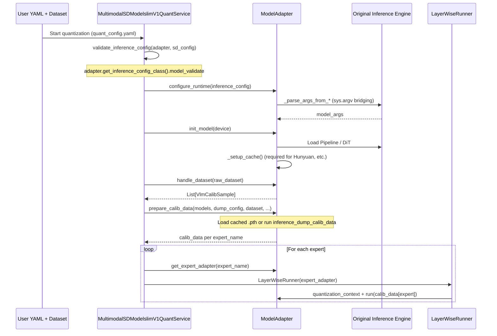
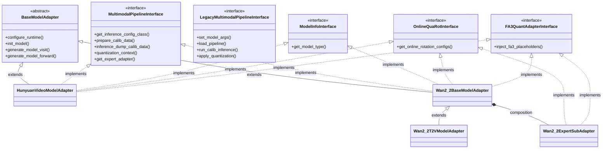
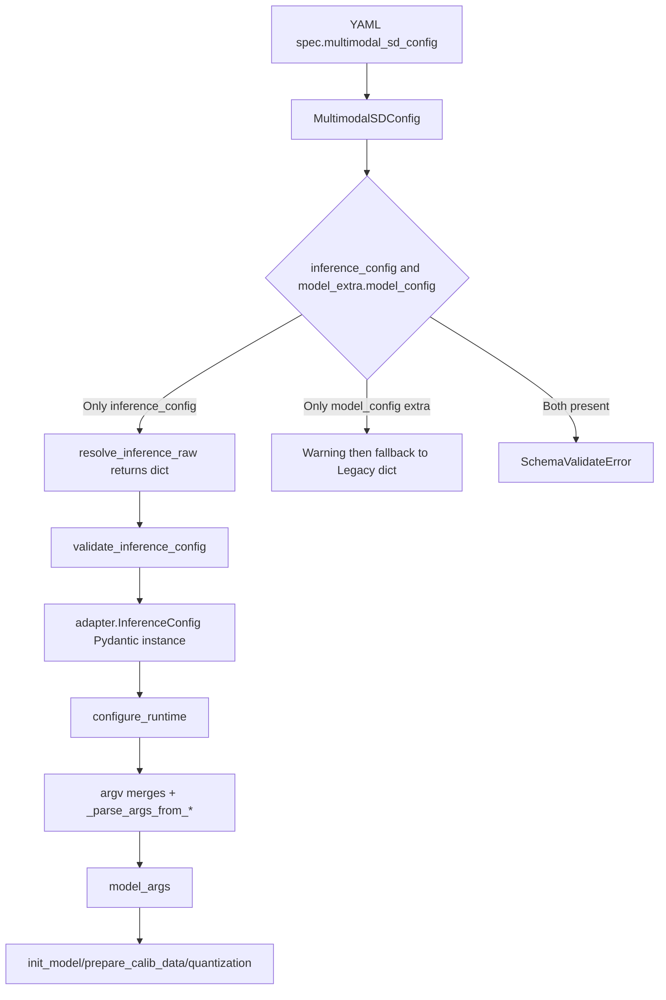

# Multimodal Generation Model Integration Guide

<!-- md-trans-meta sourceCommit=94328d0a283b5c0669a686d81f7208caa2010f8f translatedAt=2026-08-20T10:43:45.953Z pushedAt=2026-08-20T10:44:26.133Z -->

## Overall Implementation Approach

### Core Objectives

Integrate your text-to-video/image-to-video models into the msModelSlim quantization pipeline to implement the end-to-end flow of **data calibration → inference chain replay → layer-wise DiT quantization**.

### Key Differences from Traditional LLM Quantization

| Dimension | LLM Quantization | Multimodal Generation Quantization |
|------|---------|--------------|
| Input processing | Token sequence | Mixed image-text (image path + prompt) |
| Backbone network | Decoder-only Transformer | DiT (Diffusion Transformer) |
| Network structure | Single stack | Single network / dual expert / multi-module |
| Parameter source | Directly configurable | Requires bridging the complex parameter system of the original inference repository |
| Forward method | Autoregressive | Diffusion multi-step denoising (requires replaying the complete pipeline) |

### Integration Principles

1. **Configuration over hardcoding**: Define parameters through `inference_config` (with strict Pydantic validation) rather than `model_config` (string mapping).

2. **Reusing the original repository logic**: Bridge the original inference repository's `parse_args` + `_validate_args` instead of re-implementing parameter validation.

3. **Layered decoupling**: The base class manages common capabilities (parameter bridging and cache assembly), while subclasses manage scenario-specific differences (sample validation and concrete generation logic).

4. **Dual-path compatibility**: New models implement `MultimodalPipelineInterface`; models already integrated in the main repository retain `LegacyMultimodalPipelineInterface`, and `MultimodalSDModelslimV1QuantService` automatically dispatches them by adapter type.

## msModelSlim Architecture and Orchestration

### (Reading Required) Quantization Service Dual Branches

`MultimodalSDModelslimV1QuantService` selects the orchestration path based on the interface type implemented by the adapter.

| Path | Adapter Interface | Typical `model_type` | Calibration Dump | Quantization Scheduling |
|------|------------|-------------------|-----------|----------|
| **Refactoring** | `MultimodalPipelineInterface` | `Wan2.2-T2V-A14B`, `Wan2.2-I2V-A14B`, `Wan2.2-TI2V-5B`, `HunyuanVideo` | `prepare_calib_data` → `inference_dump_calib_data` | `get_expert_adapter` + `quantization_context` |
| **Legacy** | `LegacyMultimodalPipelineInterface` | `Wan2_2` / `Wan2.2` (monolithic), `wan2_1`, `flux1`, `qwen_image_edit`, etc. | `run_calib_inference` | `apply_quantization` + switching `transformer` |

Under the refactoring path, `inference_config` is uniformly validated by **`quant_config.validate_inference_config(adapter, sd_config)`** (which calls the adapter's `get_inference_config_class()`), and the adapter no longer provides `build_inference_config()`.

### Overall Interaction Flow (Refactoring Path)



**Multi-expert constraint**: Every expert returned by `init_model()` must have a corresponding **key** in `calib_data`; if a key is missing, the quantization service **fail-fast** raises `SchemaValidateError` (`calib_data[expert]=None` indicates fully dynamic quantization without dump data, which still counts as a valid key). Quantizing only a subset of experts (for example, quantizing only `low_noise_model`) is **not supported**.

### Legacy Path (Main Repository Compatibility)

Models that still use `LegacyMultimodalPipelineInterface` (such as the `wan2_1`, `flux1`, `qwen_image_edit`, and `Wan2_2`/`Wan2.2` monolithic entries) go through `_quant_process_legacy`:

1. `set_model_args` (a `model_config` string mapping, not the Pydantic `inference_config`)

2. `load_pipeline` → `run_calib_inference`

3. `apply_quantization(quant_model_func)`, which switches the `transformer` inside the callback and invokes LayerWise

**Newly integrated multimodal generation models should prioritize implementing `MultimodalPipelineInterface`**; Legacy is used only to keep behavior consistent with existing adapters in the main repository. `wan2_2/model_adapter.py` + `wan2_2 = Wan2_2, Wan2.2` in `config.ini` are the legacy entry points, coexisting with scenario-based refactoring entry points such as `Wan2.2-T2V-A14B`.

**Planned capability**: per-expert independent `process` chains (`expert_process`) are not yet implemented; currently all experts share the YAML `spec.process`.

### Core Class Structure



>[!NOTE]
>
>- The main adapters of both scenarios inherit exactly the same five base classes/interfaces.
>- `Wan2_2ExpertSubAdapter` is a **composition relationship** (not inheritance), created and held by the base class in partition 5.
>- The sub-adapter **independently implements** `OnlineQuaRotInterface` and `FA3QuantAdapterInterface`, allowing `LayerWiseRunner` to schedule each expert separately.

### Layering Model



>[!NOTE]
>
>`inference_config` is a **declared field** of `MultimodalSDConfig`, parsed by Pydantic into `self.inference_config`, and does **not** enter `model_extra`; do not rely on "passing inference_config via extra".

### (Reading Required) Code Partition Specification

The partition organization differs slightly between the two scenarios and must strictly follow the partition markers in the source code:

**Scenario 1: Integration of a single network DiT type of multimodal generation model (using HunyuanVideo as an example) — 7 partitions**

```text
Partition 1: common pipeline interface          # validate_calib_samples, handle_dataset, init_model, generate_model_visit/forward, enable_kv_cache
Partition 2: common runtime configuration       # get_inference_config_class, configure_runtime
Partition 3: common calibration execution       # prepare_calib_data, inference_dump_calib_data, quantization_context
Partition 4: common runtime helpers             # _runtime_value (HunyuanVideo lacks _quantization_context_with_no_sync)
Partition 5: private parameter bridging         # _fixed_quant_runtime_overrides, _allowed_hyvideo_config_keys, _build_default_quant_cli, _namespace_to_argv, _parse_args_from_hyvideo
Partition 6: private runtime and cache assembly   # _check_import_dependency, _setup_cache, _load_pipeline
Partition 7: quantization extension interfaces  # get_online_rotation_configs, inject_fa3_placeholders, _attach_attention_cache_to_blocks
```

**Scenario 2: Integration of a dual expert DiT type of multimodal generation model (using Wan2.2 as an example) — 8 partitions (base class)**

```text
Partition 1: public pipeline interface       # validate_calib_samples, handle_dataset, init_model(abstract), generate_model_visit/forward, enable_kv_cache
Partition 2: public runtime configuration     # get_inference_config_class(subclass), configure_runtime(base)
Partition 3: public calibration execution     # prepare_calib_data, inference_dump_calib_data(abstract), quantization_context(abstract)
Partition 4: base class runtime common helpers             # _runtime_value, _quantization_context_with_no_sync
Partition 5: private expert sub-adapter assembly (per-expert)  # _bind_expert_sub_adapters, _create_expert_sub_adapter
Partition 6: private parameter bridging        # _allowed_generate_config_keys, _build_default_generate_cli, _namespace_to_argv, _parse_args_from_generate
Partition 7: private runtime and cache setup    # _check_import_dependency, _init_logging, _load_pipeline, _setup_wan_dit_runtime, _setup_*_attention_cache
Partition 8: quantization extension interfaces # get_online_rotation_configs, inject_fa3_placeholders, _attach_attention_cache_to_blocks
```

>[!NOTE]
>
>- The `configure_runtime` in partition 2 is located in **partition 2** in both scenarios; the argv/parse_args helper methods it calls are in **partition 5** for HunyuanVideo and **partition 6** for Wan2.2, respectively.
>- Wan2.2 **partition 5** is the sub-adapter assembly unique to the dual expert, and HunyuanVideo has no corresponding partition.
>- The Wan2.2 base class **partition 4** additionally provides `_quantization_context_with_no_sync` for reuse by the subclass `quantization_context`.

## Step-by-Step Implementation Guide

### Prerequisites

1. Confirm that the original inference repository can run floating-point inference normally.

2. Prepare a calibration dataset (image-text pairs or a plain text list).

3. Determine the DiT structure type: **single network** vs **dual expert**.

### Scenario 1: Integrating a Single-Network DiT Multimodal Generation Model (HunyuanVideo as an Example)

**Applicable features**: A single `transformer` backbone; `init_model` returns `{'': self.transformer}`.

**Implementation order**: Implement sequentially according to source code partitions 1 to 7 (consistent with the "Code Partition Specification" above).

**Implementation suggestions when integrating a new model**:

1. First confirm the class name and `forward` signature of the DiT block in the original inference repository (whether both dual-stream and single-stream exist).

2. QuaRot: only provide replaceable `q_rot`/`k_rot` submodule paths for Q/K at the attention entry.

3. FA3: insert three placeholder calls after the Q/K/V tensors are ready and before entering the attention operator; do not modify the diffusion main loop logic.

**Core class** (all example code is written inside the class body):

```python
class HunyuanVideoModelAdapter(
    BaseModelAdapter,
    ModelInfoInterface,
    MultimodalPipelineInterface,
    FA3QuantAdapterInterface,
    OnlineQuaRotInterface,
):
    ...
```

#### Step 0: Directory Structure

```text
msmodelslim/model/hunyuan_video/
├── __init__.py
├── model_adapter.py      # Main adapter (partitions  1–7)
├── constants.py          # DEFAULT_VIDEO_SIZE, HYVIDEO_CLI_LIST_FIELDS, and so on
└── loader.py             # HunyuanVideoAdapterLoader
```

#### Step 1: Partition 1 — Common Pipeline Interface

**Responsibility**: dataset validation, model loading entry, and visit/forward segmentation required by LayerWise.

| Method | Description |
|------|------|
| `validate_calib_samples` | Currently text-only; `image` is prohibited. |
| `handle_dataset` | Converts to `List[VlmCalibSample]` and validates it. |
| `init_model` | Calls `_load_pipeline` + `_setup_cache` in partition 6, and returns `{'': transformer}.` |
| `generate_model_visit` | Visits layer by layer based on the `streamblock` keyword. |
| `generate_model_forward` | Yields layer by layer after the first-layer hook captures the input. |

```python
class HunyuanVideoModelAdapter(
    BaseModelAdapter,
    ModelInfoInterface,
    MultimodalPipelineInterface,
    FA3QuantAdapterInterface,
    OnlineQuaRotInterface,
):
    """Single-network DiT adapter (hunyuan_video/model_adapter.py)."""

    _HYVIDEO_CONFIG_KEYS: ClassVar[Optional[frozenset[str]]] = None

    # ===== Partition 1: Common Pipeline Interface =====

    def validate_calib_samples(self, samples: List[VlmCalibSample]) -> List[VlmCalibSample]:
        """
        Validate the calibration sample list to ensure that each sample meets the input requirements of HunyuanVideo T2V (text-to-video).

        - Check that each sample must contain a non-empty text field.
        - Prohibit the image field (HunyuanVideo currently supports text-only input).
        - Throw SchemaValidateError if the requirements are not met.
        """
        for idx, sample in enumerate(samples):
            # Check that the text field must be a non-empty string
            if not sample.text or not sample.text.strip():
                raise SchemaValidateError(
                    f"hunyuan_video sample[{idx}] requires non-empty text",
                    action="Provide text in dataset entries (index.jsonl / VlmCalibSample.text)."
                )
            # During calibration, the image field must not be passed; HunyuanVideo supports text only
            if sample.image is not None:
                raise SchemaValidateError(
                    f"hunyuan_video sample[{idx}] must not include image",
                    action="HunyuanVideo T2V calibration is text-only; remove image from dataset."
                )
        return samples

    def handle_dataset(
        self,
        dataset: Any,
        device: DeviceType = DeviceType.NPU,
    ) -> List[VlmCalibSample]:
        """
        Uniformly convert the input dataset to List[VlmCalibSample] and complete validation.

        - Supports passing None, a single VlmCalibSample, or a list/iterable of VlmCalibSample.
        - The validation logic is delegated to validate_calib_samples to ensure that all sample fields meet the requirements.
        - The device parameter is reserved and currently unused, for interface consistency.
        """
        _ = device  # The device parameter is currently unused and serves only as a placeholder
        if dataset is None:
            return []  # If the dataset is empty, return an empty list
        if isinstance(dataset, VlmCalibSample):
            # If it is a single calibration sample, wrap it into a single-element list before validation
            return self.validate_calib_samples([dataset])
        # Otherwise, assume it is an iterable object, convert it to a list, and then validate it
        return self.validate_calib_samples(list(dataset))

    def init_model(self, device: DeviceType = DeviceType.NPU) -> Dict[str, nn.Module]:
        """
        Initialize the model, load the main inference pipeline, and complete the necessary cache setup.
        - The device parameter specifies the inference device (NPU by default). It is currently used mainly for interface consistency and is not directly used internally.
        - _load_pipeline must be called first (see partition 6 for the implementation) to ensure that the transformer/pipeline is loaded correctly.
        - _setup_cache must then be called. This is because the inference repository requires that the block-level attention cache (not the KV cache) be initialized after each model load; otherwise, some inference flows cannot run properly. This is a special requirement of the HunyuanVideo inference framework.
        - The return value is dict[str, nn.Module].
        """
        self._load_pipeline()   # Load the main inference pipeline (see partition 6)
        self._setup_cache()     # Initialize the cache mechanism (see partition 6). This step is a required process
        return {'': self.transformer}  # Main model transformer, with the key being '' (empty string)

    def generate_model_visit(
        self,
        model: torch.nn.Module,
        transformer_blocks: Optional[List[Tuple[str, torch.nn.Module]]] = None,
    ) -> Generator[ProcessRequest, Any, None]:
        """
        Traverse transformer_blocks layer by layer and yield ProcessRequest on demand according to LayerWise semantics,
        for external flows to instrument (such as quantization and debugging) or customize processing.
        - By default, the module list is filtered by checking whether the class name contains 'streamblock' (consistent with the internal behavior of generate_model_forward).
        - Custom transformer_blocks can be supported externally. When there is no special requirement, the default parameters can be used directly.
        - Returns a generator that yields ProcessRequest for each layer, encapsulating the information and parameters of the current block.
        """
        return generated_decoder_layer_visit_func_with_keyword(model, keyword="streamblock")

    def generate_model_forward(
            self,
            model: torch.nn.Module,
            inputs: Any,
        ) -> Generator[ProcessRequest, Any, None]:
        """
        Used to intercept inputs and outputs layer by layer according to LayerWise, supporting scenarios such as inference chain replay and quantization instrumentation.

        The typical implementation logic is as follows:
        - Intercept the first-layer input of the model.
        - Split the Transformer Block by the "streamblock" keyword.
        - After each layer, yield ProcessRequest and let the upstream control whether to interrupt, instrument, or continue the forward pass.
        - Until all layers are traversed and the forward pass ends.

        The return value is a generator,
        and each yield provides the information of the current layer and the intermediate inputs/outputs, making it convenient for external flows to process layer by layer.
        """
        pass
```

#### Step 2: Partition 2 — Common Runtime Configuration

**Responsibility**: Declare `HunyuanVideoInferenceConfig` and `get_inference_config_class()`; `configure_runtime` writes the **validated** `inference_config` into `model_args`.
**Validation entry**: `MultimodalSDModelslimV1QuantService` calls `validate_inference_config(adapter, sd_config)` in `quant_process` (`quant_config.py`), which internally executes `get_inference_config_class().model_validate(raw_dict)`.
**Note**: `configure_runtime` is in partition 2, while the bridging methods are in partition 5 (`_build_default_quant_cli`, `_parse_args_from_hyvideo`, etc.).

```python
class HunyuanVideoModelAdapter(
    BaseModelAdapter,
    ModelInfoInterface,
    MultimodalPipelineInterface,
    FA3QuantAdapterInterface,
    OnlineQuaRotInterface,
):
    # ===== Partition 2: Common Runtime Configuration =====

    class HunyuanVideoInferenceConfig(BaseModel):
        model_config = ConfigDict(extra="forbid")
        model_resolution: Optional[Literal["540p", "720p"]] = "720p"
        video_size: Optional[Union[Tuple[int, int], List[int]]] = (720, 1280)
        infer_steps: Optional[int] = 50
        # ... fields that can be aligned with the hyvideo CLI

    def get_inference_config_class(self):
        return self.HunyuanVideoInferenceConfig

    def configure_runtime(self, inference_config: HunyuanVideoInferenceConfig) -> None:
        """
        Validate the inference_config in YAML/Dict format and convert it into argparse-compatible model_args.
        Steps:
        1. Serialize inference_config (filter out None fields), allowing only supported fields (report an error for illegal fields).
        2. Construct the base CLI argv (such as model path and resolution information).
        3. Add the config fields and fixed quantization overrides to argv.
        4. Pass them to parse_args in the hyvideo repository, obtain the parsed result, and store it in self.model_args.
        """
        override = inference_config.model_dump(exclude_none=True)
        allowed_attrs = self._allowed_hyvideo_config_keys()  # partition 5
        # ... illegal field validation
        argv = self._build_default_quant_cli()               # partition 5
        argv.extend(self._namespace_to_argv(override))       # partition 5
        argv.extend(self._namespace_to_argv(self._fixed_quant_runtime_overrides()))
        self.model_args = self._parse_args_from_hyvideo(argv) # partition 5
```

#### Step 3: Partition 3 — Common Calibration Execution

**Responsibility**: `prepare_calib_data` handles pth caching and dump scheduling; `inference_dump_calib_data` performs floating-point inference replay; `quantization_context` provides contexts such as `autocast/no_grad` during quantization.

```python
# ===== Partition 3: Common Calibration Execution =====

def prepare_calib_data(self, models, dump_config, save_path, dataset, inference_config):
    """
    Construct the calib_data_<task>_<expert>.pth path by expert_name;
    when enable_dump is set, call inference_dump_calib_data to generate the cache, otherwise load the existing pth.
    For a single DiT, models contains only the key ''.
    """
    ...

def inference_dump_calib_data(self, dataset=None, inference_config=None):
    """
    Run floating-point model inference to export calibration data for subsequent quantization steps.
    Args:
        dataset: an iterable collection of calibration samples, where each sample should contain fields such as text.
        inference_config: an inference configuration object or dictionary containing the parameters required for inference.
    Flow:
        - Iterate over each sample and uniformly obtain configuration parameters dynamically via _runtime_value (supporting inference_config first, falling back to model_args).
        - Call hunyuan_video_sampler.predict based on the sample content and inference parameters to generate calibration data for quantization.
    """
    for sample in tqdm(dataset):
        seed = self._runtime_value(inference_config, "seed")  # Partition 4
        self.hunyuan_video_sampler.predict(
            prompt=sample.text,
            height=video_size[0],
            # ... the remaining parameters are all retrieved via _runtime_value
        )

def quantization_context(self):
    """
    Quantization-related context environment, typically combining the following features:
      - amp.autocast automatic mixed precision (saving memory and accelerating)
      - torch.no_grad disabling gradient computation (saving memory and improving inference efficiency)
      - device switching for some modules (e.g., blocks on CPU, the rest on NPU)
    Used in scenarios such as quantized model inference and calibration data collection.
    """
    # amp.autocast + no_grad + module device switching
    ...
```

#### Step 4: Partition 4 — Runtime Common Helpers

**Responsibility**: Unify value retrieval during calibration/inference execution to avoid repeating `getattr(inference_config, ...) or getattr(model_args, ...)` in multiple places.

```python
# ===== Partition 4: Runtime Common Helpers =====

def _runtime_value(
    self,
    inference_config: Optional[Union[BaseModel, Dict[str, Any]]],
    name: str,
) -> Any:
    """
    Unify value retrieval during inference execution: prefer inference_config (Pydantic or dict), otherwise model_args.
    For dict, use .get(name); when None, fall back to model_args only.
    """
    if inference_config is not None:
        if isinstance(inference_config, dict):
            val = inference_config.get(name)
        else:
            val = getattr(inference_config, name, None)
        if val is not None:
            return val
    return getattr(self.model_args, name, None)
```

#### Step 5: Partition 5 — Private Parameter Bridging (Configuration and Parsing)

**Responsibility**: Contain only the private methods that "convert dict/InferenceConfig into argv and call the original repository's `parse_args`".

| Method | Description |
|------|------|
| `_fixed_quant_runtime_overrides` | Fixed quantization overrides (disable parallelism/cache, etc.) |
| `_allowed_hyvideo_config_keys` | Lazily probe valid hyvideo fields |
| `_build_default_quant_cli` | Minimal CLI satisfying resolution/size constraints |
| `_namespace_to_argv` | dict → argv (special handling for bool/list) |
| `_parse_args_from_hyvideo` | Temporarily rewrite `sys.argv` and call `hyvideo.config.parse_args` |

```python
# ===== Partition 5: Private Parameter Bridging (Configuration and Parsing) =====
# Called by configure_runtime() in Partition 2; do not write configure_runtime in this partition

@staticmethod
def _fixed_quant_runtime_overrides() -> Dict[str, Any]:
    """
    Overrides forcibly written into parse_args during quantization calibration.

    Disable distributed parallelism, VAE parallelism, and various cache optimizations to prevent the quantization path from being affected by training/deployment state configurations.
    DiT block-level cache is assembled separately by the adapter in _setup_cache() in partition 6.
    """
    return {
        "ulysses_degree": 1,
        "ring_degree": 1,
        "vae_parallel": False,
        "use_cache": False,
        "use_cache_double": False,
        "use_attentioncache": False,
    }


def _allowed_hyvideo_config_keys(self) -> frozenset[str]:
    """
    Return the set of inference_config field names supported by hyvideo.config.parse_args.

    Probe only once per process (cached in the class variable _HYVIDEO_CONFIG_KEYS) to avoid repeated parsing on each quantization.
    Used in configure_runtime to validate whether the YAML contains illegal fields.
    """
    cls = type(self)
    if cls._HYVIDEO_CONFIG_KEYS is None:
        probe = self._parse_args_from_hyvideo(self._build_default_quant_cli())
        cls._HYVIDEO_CONFIG_KEYS = frozenset(vars(probe).keys())
    return cls._HYVIDEO_CONFIG_KEYS


def _build_default_quant_cli(self) -> List[str]:
    """
    Construct the minimum argv used when configure_runtime merges the YAML.

    Must satisfy hyvideo's assertions on model_resolution / video_size (see the default values in constants.py).
    Required fields such as the weight path are filled in here to ensure that a single parse_args call passes the original repository validation.
    """
    model_base = str(self.model_path)
    h, w = DEFAULT_VIDEO_SIZE
    return [
        "--model-base", model_base,
        "--prompt", PLACEHOLDER_PROMPT,
        "--model-resolution", DEFAULT_MODEL_RESOLUTION,
        "--video-size", str(h), str(w),
        "--dit-weight", str(Path(model_base).joinpath(*DIT_WEIGHT_REL)),
        "--vae-path", str(Path(model_base).joinpath(*VAE_PATH_REL)),
        "--text-encoder-path", str(Path(model_base).joinpath(*TEXT_ENCODER_PATH_REL)),
        "--text-encoder-2-path", str(Path(model_base).joinpath(*TEXT_ENCODER_2_PATH_REL)),
    ]


@staticmethod
def _namespace_to_argv(namespace_dict: Dict[str, Any]) -> List[str]:
    """
    Convert a Namespace-style dict into a CLI fragment list for use by _parse_args_from_hyvideo.

    Conventions:
    - None: skip (use the argparse default)
    - bool: append the flag only when True (store_true semantics; False passes no argument)
    - list/tuple: expand as nargs="+" only for HYVIDEO_CLI_LIST_FIELDS (such as video_size)
    - dict: skip
    """
    argv: List[str] = []
    for key, val in namespace_dict.items():
        if val is None:
            continue
        flag = "--" + key.replace("_", "-")
        if isinstance(val, dict):
            continue
        if isinstance(val, bool):
            if val:
                argv.append(flag)
            continue
        if isinstance(val, (list, tuple)):
            if key in HYVIDEO_CLI_LIST_FIELDS:
                argv.append(flag)
                argv.extend(str(v) for v in val)
            continue
        argv.extend([flag, str(val)])
    return argv


def _parse_args_from_hyvideo(self, cli_args: List[str]):
    """
    Call hyvideo.config.parse_args (including sanity_check and task-related asserts).

    Simulate the command line by temporarily rewriting sys.argv; it must be restored in finally to avoid polluting other modules.
    Note: the namespace= parameter of parse_args semantically means "pre-populated object" and cannot be passed a CLI list directly.
    """
    from hyvideo.config import parse_args

    original_argv = sys.argv
    try:
        sys.argv = ["sample_video.py", *cli_args]
        return parse_args()
    finally:
        sys.argv = original_argv
```

#### Step 6: Partition 6 - Private Runtime and Cache Assembly

**Responsibility**: Load the original inference repository Pipeline/Sampler; inject `CacheAgent` into the DiT block (the original repository `forward` calls `self.cache.apply()`, independent of the `use_cache` switch).

```python
# ===== Partition 6: Private Runtime and Cache Assembly =====

def _load_pipeline(self):
    """
    Load the inference pipeline, including initializing HunyuanVideoSampler and transformer.
    """
    self.hunyuan_video_sampler = HunyuanVideoSampler(...)
    self.transformer = self.hunyuan_video_sampler.pipeline.transformer

def _setup_cache(self):
    """
    Mount CacheAgent for each block to keep it consistent with sample_video.py.
    """
    pass
```

#### Step 7: Partition 7 — Quantization Extension Interfaces

**Responsibility**: Implement `OnlineQuaRotInterface` and `FA3QuantAdapterInterface`; these are invoked by the quantization service in the LayerWise flow according to the configuration.
**When required**: When Online QuaRot / FA3 related operators are enabled in the YAML `process`; if not enabled, implementation can be deferred.

| Method | Interface | Description |
|------|------|------|
| `get_online_rotation_configs` | `OnlineQuaRotInterface` | Registers `q_rot`/`k_rot` for DiT blocks and returns the rotation configuration |
| `inject_fa3_placeholders` | `FA3QuantAdapterInterface` | Injects `fa3_q/k/v` placeholders and wraps the block's `forward` |

```python
# ===== Partition 7: Quantization Extension Interface =====

# ----- OnlineQuaRotInterface -----

def get_online_rotation_configs(self, model: Optional[nn.Module] = None):
    """
    Return the online rotation configuration: configure Hadamard rotation for the q_rot and k_rot of each target block.

    Args:
        model: The DiT to be quantized (usually self.transformer). If provided, it first
               registers register_module('q_rot'/'k_rot', nn.Identity()) on the block
               as the rotation mount point.

    Returns:
        Dict[str, RotationConfig]: The key is the module path (e.g., "blocks.0.q_rot"), and the value is the rotation parameter.

    Target block types (consistent with the hyvideo DiT structure):
        - MMDoubleStreamBlock (dual stream: img + txt)
        - MMSingleStreamBlock (single stream)
    """
    pass


# ----- FA3QuantAdapterInterface -----

def inject_fa3_placeholders(
    self,
    root_name: str,
    root_module: nn.Module,
    should_inject: Callable[[str], bool],
) -> None:
    """
    Inject FA3 quantization placeholders into HunyuanVideo DiT blocks and wraps forward to invoke the placeholders before attention.

    Args:
        root_name: The root path of the current quantization subtree (passed in by LayerWiseRunner).
        root_module: The nn.Module to be processed (usually transformer).
        should_inject: Filters whether to inject by full path name (supports include/exclude strategies).

    Process overview:
        1. Traverse MMDoubleStreamBlock / MMSingleStreamBlock
        2. Use set_submodule to inject fa3_q, fa3_k, fa3_v (FA3QuantPlaceHolder)
        3. Wrap forward: after the Q/K/V cat and before attention, invoke in sequence
           q_rot/k_rot (if present) → fa3_q/fa3_k/fa3_v
        4. The remaining forward logic is consistent with the original repository's block.forward (helper functions must be imported from the original module)

    Note:
        - Use `module.forward = new_forward.__get__(module, module.__class__)` to bind the instance method
        - The complete forward body is long; when implementing, copy the forward of the corresponding hyvideo block and insert the placeholder calls
        - The inference repository's `parse_args` does not yet support `args=cli_list`; it must be done by temporarily rewriting `sys.argv` (restored in finally)
    """
    pass
```

### Scenario 2: Integrating a Dual Expert DiT Type Multimodal Generation Model (Wan2.2 as an Example)

**Applicable characteristics**: two DiT experts, `low_noise_model` and `high_noise_model`; `init_model` returns `{"low_noise_model": ..., "high_noise_model": ...}`.
**Code division**: `base_model_adapter.py` implements the common capabilities of partitions 1 to 8; the `model_adapter.py` files under the `t2v/`, `i2v/`, and `ti2v/` subdirectories supplement the scenario differences of partitions 1 to 3; `expert_sub_adapter.py` is used by LayerWiseRunner to schedule quantization **per expert**.

**Implementation order**: the base class follows partitions 1 to 8; the subclass overrides the annotated methods in the corresponding Step.

**Implementation suggestions when integrating a new model**:

1. First create a subclass and a `model_type` in `config.ini` for each `scene_task`. Do not use `task` in YAML to switch scenarios.

2. `DEFAULT_SIZE` / `EXAMPLE_PROMPT` must be consistent with `WAN_CONFIGS` and `SUPPORTED_SIZES` in the original repository; otherwise, `_validate_args` fails.

3. QuaRot/FA3 are implemented once in partition 8 of the base class; the expert sub-adapters only perform delegation and **explicitly inherit** the quantization extension interface.

**Key differences when integrating a new model**:

1. `scene_task` is fixed by the subclass `ClassVar` and corresponds one-to-one with `model_type` in `config.ini`; do not switch tasks in the YAML file.

2. For dual experts, `_bind_expert_sub_adapters` must be called after `init_model`, and `get_expert_adapter` must be able to retrieve the sub-adapter by name.

3. TI2V: `image` is optional; when no image is provided, `_generate_video` follows the T2V branch, and when an image is provided, it follows the I2V branch (consistent with the default behavior of the inference repository).

**Core classes**:

| Class | File | Description |
|----|------|------|
| `Wan2_2BaseModelAdapter` | `base_model_adapter.py` | Common logic in partitions 1 to 8 |
| `Wan2_2T2VModelAdapter` and others | `t2v/model_adapter.py` and others | Scenario subclasses with a fixed `scene_task` |
| `Wan2_2ExpertSubAdapter` | `expert_sub_adapter.py` | Single-expert quantization proxy (not a subclass of BaseModelAdapter) |

#### Step 0: Directory Structure

```text
msmodelslim/model/wan2_2/
├── base_model_adapter.py    # Partitions 1–8 (base class, not directly instantiable)
├── expert_sub_adapter.py    # Expert sub-adapter (not a subclass of BaseModelAdapter)
├── constants.py             # DEFAULT_SIZE, EXAMPLE_PROMPT, TASK_TYPES
├── model_adapter.py         # Legacy single-model adapter (LegacyMultimodalPipelineInterface, model_type=Wan2_2/Wan2.2)
├── loader.py                # Wan2_2AdapterLoader (Legacy entry point via config.ini wan2_2)
├── t2v/
│   ├── model_adapter.py     # Scene subclass: T2V (scene_task=t2v-A14B)
│   └── loader.py            # Wan2_2T2VAdapterLoader
├── i2v/
│   ├── model_adapter.py     # Scene subclass: I2V
│   └── loader.py            # Wan2_2I2VAdapterLoader
└── ti2v/
    ├── model_adapter.py     # Scene subclass: TI2V (image optional; falls back to T2V if no image)
    └── loader.py            # Wan2_2TI2VAdapterLoader
```

#### Step 1: Partition 1 — Common Pipeline Interface (Base Class + Subclass)

**Base class responsibility**: provides the common `handle_dataset`, `generate_model_visit/forward` (keyword `attentionblock`), `get_expert_adapter`, and `prepare_calib_data`; `init_model` / `get_inference_config_class` are implemented by the subclass.

**Subclass responsibility**: `validate_calib_samples`, `_build_wan_pipeline`, `init_model`, and `_generate_video` (scenario differences are concentrated here).

| Method | Location | Description |
|------|------|------|
| `validate_calib_samples` | Subclass | T2V disallows images / I2V requires images / TI2V allows optional images. |
| `handle_dataset` | Base class | Converts to `List[VlmCalibSample]` and delegates to the subclass `validate_calib_samples.` |
| `init_model` | Subclass | `_load_pipeline` (partition 7) → `_bind_expert_sub_adapters` (partition 5). |
| `generate_model_visit` | Base class | Visits modules layer by layer whose class name contains `attentionblock.` |
| `generate_model_forward` | Base class | After the first layer's pre_hook intercepts the input, yields layer by layer according to attentionblock. |
| `get_expert_adapter` | Base class | Returns the sub-adapter by expert name; raises `InvalidModelError` if T2V/I2V is not bound; for TI2V, falls back to `self` only when `''` is not bound. |

```python
class Wan2_2BaseModelAdapter(
    BaseModelAdapter,
    ModelInfoInterface,
    MultimodalPipelineInterface,
    FA3QuantAdapterInterface,
    OnlineQuaRotInterface,
):
    """Dual-expert DiT base class (wan2_2/base_model_adapter.py); must be instantiated via the T2V/I2V/TI2V subclasses."""

    scene_task: ClassVar[str] = ""
    _GENERATE_CONFIG_KEYS: ClassVar[Optional[frozenset[str]]] = None

    # ===== Partition 1: Common Pipeline Interface =====

    def validate_calib_samples(self, samples: List[VlmCalibSample]) -> List[VlmCalibSample]:
        """
        Validate calibration samples (the base class passes them through by default; overridden by T2V/I2V/TI2V subclasses).

        - T2V: text is required, image is forbidden
        - I2V: text + image are required
        - TI2V: text is required, image is optional (the T2V inference branch is used when no image is present)
        """
        return samples

    def handle_dataset(
        self,
        dataset: Any,
        device: DeviceType = DeviceType.NPU,
    ) -> List[VlmCalibSample]:
        """
        Uniformly convert the input dataset to List[VlmCalibSample] and complete validation.

        - Before dump, only scenario validation is performed; model forward is not executed.
        - Supports passing None, a single VlmCalibSample, or an iterable object.
        - The validation logic is delegated to the subclass validate_calib_samples (T2V/I2V/TI2V rules differ).
        - The device parameter is reserved and currently unused, for interface consistency.
        """
        _ = device
        if dataset is None:
            return []
        if isinstance(dataset, VlmCalibSample):
            return self.validate_calib_samples([dataset])
        return self.validate_calib_samples(list(dataset))

    def init_model(self, device: DeviceType = DeviceType.NPU) -> Dict[str, nn.Module]:
        """The base class raises NotImplementedError; it is implemented by scenario subclasses and returns the low/high expert dict."""
        raise NotImplementedError(
            f"{type(self).__name__} must implement init_model() for its Wan2.2 task.",
        )

    def generate_model_forward(
        self,
        model: torch.nn.Module,
        inputs: Any,
    ) -> Generator[ProcessRequest, Any, None]:
        """
        Capture inputs and outputs layer by layer according to LayerWise, for quantization instrumentation and calibration replay.

        Implementation points (similar to HunyuanVideo, with different keywords):
        - Filter the Wan DiT block list by class names containing attentionblock
        - Register a forward_pre_hook on the first block, capture the first-layer (args, kwargs), and then raise
          TransformersForwardBreak to avoid full-network forward
        - After moving the first-layer input to_device('cpu'), yield ProcessRequest(name, block, args, kwargs) block by block
        - Use the hidden_states of the previous block as the args of the next layer
        - In distributed scenarios, call dist.barrier() for synchronization after capturing the first layer

        Note: When LayerWiseRunner calls low_noise_model / high_noise_model separately,
        model is a single expert DiT; the keyword must match the original repository block class name (not streamblock).
        """
        pass  # For the complete implementation, see base_model_adapter.py.

    def generate_model_visit(
        self,
        model: torch.nn.Module,
        transformer_blocks: Optional[List[Tuple[str, torch.nn.Module]]] = None,
    ) -> Generator[ProcessRequest, Any, None]:
        """
        Visit DiT blocks layer by layer and yield ProcessRequest according to LayerWise semantics.

        - Internally filters by class names containing attentionblock by default (consistent with generate_model_forward)
        - Custom transformer_blocks can be passed in; the default is generally sufficient
        - The expert sub-adapter delegates to this method via __getattr__, accessing the same visit logic
        """
        return generated_decoder_layer_visit_func_with_keyword(model, keyword="attentionblock")

    def get_expert_adapter(self, expert_name: str):
        """
        LayerWiseRunner retrieves the sub-adapter by expert name (low_noise_model / high_noise_model).

        The key written by _bind_expert_sub_adapters in init_model must be consistent with the name passed in by QuantService.
        - T2V / I2V (dual expert): not bound → InvalidModelError
        - TI2V (single DiT): fall back to self only when expert_name=='' and not bound
        """
        ...


# t2v/model_adapter.py -- scenario subclass example.

class Wan2_2T2VModelAdapter(Wan2_2BaseModelAdapter):
    scene_task = "t2v-A14B"  # Bound to model_type in config.ini, not switched via YAML.

    def validate_calib_samples(self, samples: List[VlmCalibSample]) -> List[VlmCalibSample]:
        """
        Validate T2V calibration samples.

        - Each sample must contain non-empty text
        - Images are prohibited (calibration images do not go through inference_config, and T2V does not read images from dataset)
        """
        for idx, sample in enumerate(samples):
            if not sample.text or not sample.text.strip():
                raise SchemaValidateError(
                    f"wan2_2 t2v sample[{idx}] requires non-empty text",
                    action="Provide text in dataset entries (index.jsonl / VlmCalibSample.text).",
                )
            if sample.image is not None:
                raise SchemaValidateError(
                    f"wan2_2 t2v sample[{idx}] must not include image",
                    action="Remove image field from dataset entries for T2V.",
                )
        return samples

    def init_model(self, device: DeviceType = DeviceType.NPU) -> Dict[str, nn.Module]:
        """
        Initialize the dual-expert DiT and bind sub-adapters.

        - The device parameter is reserved and not directly used currently
        - _load_pipeline (partition 7): create WanT2V to obtain low_noise_model / high_noise_model
        - _bind_expert_sub_adapters (partition 5): create Wan2_2ExpertSubAdapter for each expert
        - The returned dict key must be consistent with the expert name used by QuantService / get_expert_adapter
        """
        _ = device
        self._load_pipeline()
        experts = {
            "low_noise_model": self.low_noise_model,
            "high_noise_model": self.high_noise_model,
        }
        self._bind_expert_sub_adapters(experts)
        return experts

    def _build_wan_pipeline(self, args, cfg, device, rank) -> None:
        """Create WanT2V and attach attention_cache to the dual-expert DiT."""
        self.wan_t2v = wan.WanT2V(config=cfg, checkpoint_dir=args.ckpt_dir, ...)
        self.low_noise_model = self.wan_t2v.low_noise_model
        self.high_noise_model = self.wan_t2v.high_noise_model
        self._setup_wan_dit_runtime(args, self.low_noise_model, self.high_noise_model)
```

#### Step 2: Partition 2 — Common Runtime Configuration (Subclass InferenceConfig + Base Class configure_runtime)

**Responsibility**: The subclass defines `*InferenceConfig` and `get_inference_config_class()`; the base class `configure_runtime` merges argv and calls `generate._parse_args`.
**Validation**: Performed uniformly by `validate_inference_config`; the subclass can constrain `task` and `scene_task` to be consistent in `InferenceConfig`.
**Note**: `configure_runtime` is in **partition 2**, and the bridging helper methods are in **partition 6**.

```python
class Wan2_2T2VModelAdapter(Wan2_2BaseModelAdapter):
    scene_task = "t2v-A14B"

    # ===== Partition 2: Common Runtime Configuration (Subclass) =====

    class Wan2_2T2VInferenceConfig(BaseModel):
        model_config = ConfigDict(extra="forbid")
        size: Optional[str] = "1280*720"
        frame_num: Optional[int] = 81
        sample_steps: Optional[int] = 40
        sample_guide_scale: Optional[float] = None  # If omitted, generate._validate_args uses the WAN_CONFIGS dual expert default.
        base_seed: Optional[int] = None
        task: Optional[str] = "t2v-A14B"  # If specified, it must be consistent with scene_task.
        # ... Fields that can be aligned with the generate.py CLI.

    def get_inference_config_class(self):
        return self.Wan2_2T2VInferenceConfig


class Wan2_2BaseModelAdapter(
    BaseModelAdapter,
    ModelInfoInterface,
    MultimodalPipelineInterface,
    FA3QuantAdapterInterface,
    OnlineQuaRotInterface,
):
    # ===== Partition 2: Common runtime configuration (base class) =====

    def configure_runtime(self, inference_config: Any) -> None:
        """
        Apply InferenceConfig to model_args (only once via generate._parse_args).
        argv: minimal CLI → YAML → quantization override → forced --task/--ckpt_dir.
        """
        from wan.configs import WAN_CONFIGS

        override = inference_config.model_dump(exclude_none=True)
        allowed_attrs = self._allowed_generate_config_keys()  # Partition 6
        # ... Invalid field validation.
        quant_overrides = {...}
        argv = self._build_default_generate_cli()  # Partition 6
        argv.extend(self._namespace_to_argv(override))
        argv.extend(self._namespace_to_argv(quant_overrides))
        argv.extend(["--task", self.scene_task, "--ckpt_dir", str(self.model_path)])
        self.model_args = self._parse_args_from_generate(argv)  # Partition 6
        self.model_args.task_config = TASK_TYPES[self.scene_task]
        self.model_args.param_dtype = WAN_CONFIGS[self.scene_task].param_dtype
```

#### Step 3: Partition 3 — Common Calibration Execution (Base Class Dump + Subclass quantization_context)

**Responsibility**: The base class `prepare_calib_data` generates/loads `calib_data_<task>_<expert>.pth` per expert; `inference_dump_calib_data` iterates over the dataset and calls the subclass `_generate_video`; the subclass implements `quantization_context`.

```python
class Wan2_2BaseModelAdapter(
    BaseModelAdapter,
    ModelInfoInterface,
    MultimodalPipelineInterface,
    FA3QuantAdapterInterface,
    OnlineQuaRotInterface,
):
    # ===== Partition 3: Common Calibration Execution (Base Class) =====

    def prepare_calib_data(self, models, dump_config, save_path, dataset, inference_config):
        """One pth per dual expert; a single `inference_dump_calib_data` dump fills all expert caches."""
        ...

    def inference_dump_calib_data(self, dataset=None, inference_config: Any = None):
        """Call the subclass `_generate_video` sample by sample to dump calibration data."""
        stream = torch.npu.Stream()
        for sample in tqdm(dataset, desc="Dump calib data by float model inference"):
            seed = self._runtime_value(inference_config, "base_seed")  # Partition 4
            torch.manual_seed(seed)
            torch.npu.manual_seed_all(seed)
            self._generate_video(sample.text, sample.image, inference_config)  # Subclass
            stream.synchronize()


class Wan2_2T2VModelAdapter(Wan2_2BaseModelAdapter):
    # ===== Partition 3: Common Calibration Execution (Subclass) =====

    def quantization_context(self):
        """Both dual experts enter the autocast + no_sync context simultaneously."""
        return self._quantization_context_with_no_sync(
            self.low_noise_model, self.high_noise_model,
        )

    def _generate_video(self, prompt, image_path, inference_config) -> None:
        """T2V: Call wan_t2v.generate, with parameters obtained via _runtime_value."""
        self.wan_t2v.generate(
            prompt,
            size=SIZE_CONFIGS[self._runtime_value(inference_config, "size")],
            # ...
        )
```

#### Step 4: Partition 4 — Base Class Runtime Common Helpers (Helper Methods Implemented by the Base Model Adapter and Shared Across Sub-Task Scenarios)

```python
class Wan2_2BaseModelAdapter(
    BaseModelAdapter,
    ModelInfoInterface,
    MultimodalPipelineInterface,
    FA3QuantAdapterInterface,
    OnlineQuaRotInterface,
):
    # ===== Partition 4: Base Class Runtime Common Helpers =====

    def _runtime_value(
        self,
        inference_config: Optional[Union[BaseModel, Dict[str, Any]]],
        name: str,
    ) -> Any:
        """Same as HunyuanVideo: prefer inference_config (Pydantic/dict), otherwise model_args."""
        ...

    @contextmanager
    def _quantization_context_with_no_sync(self, *dit_models: nn.Module):
        """autocast + no_grad + no_sync for each DiT (ExitStack)."""
        import torch.cuda.amp as amp
        with amp.autocast(dtype=self.model_args.param_dtype), torch.no_grad(), ExitStack() as stack:
            for m in dit_models:
                if m is not None:
                    stack.enter_context(getattr(m, "no_sync", nullcontext)())
            yield
```

#### Step 5: Partition 5 — Private Expert Sub-adapter Assembly (Implement Adapters for Multiple Expert Dits Separately to Enable Custom Extension of Each Expert DiT)

**Responsibility**: Create a `Wan2_2ExpertSubAdapter` for each of `low_noise_model` / `high_noise_model`, so that LayerWiseRunner can schedule them by expert name.

| Method | Description |
|------|------|
| `_bind_expert_sub_adapters` | Iterate over expert_modules, create and bind sub-adapters. |
| `_create_expert_sub_adapter` | Factory: low → LowNoiseSubAdapter, high → HighNoiseSubAdapter. |

```python
class Wan2_2BaseModelAdapter(
    BaseModelAdapter,
    ModelInfoInterface,
    MultimodalPipelineInterface,
    FA3QuantAdapterInterface,
    OnlineQuaRotInterface,
):
    # ===== Partition 5: Private Expert Sub-adapter Assembly =====

    def _bind_expert_sub_adapters(self, expert_modules: Dict[str, nn.Module]) -> None:
        """Create and bind a Wan2_2ExpertSubAdapter for each expert."""
        adapters: Dict[str, Wan2_2ExpertSubAdapter] = {}
        for expert_name, module in expert_modules.items():
            sub = self._create_expert_sub_adapter(expert_name)
            sub.bind_module(module)
            adapters[expert_name] = sub
        self._expert_adapters = adapters

    def _create_expert_sub_adapter(self, expert_name: str) -> Wan2_2ExpertSubAdapter:
        """
        Factory method: return a sub-adapter instance by expert_name.
        Subclasses may override it to return a custom low/high sub-adapter implementation.
        """
        if expert_name == "low_noise_model":
            return Wan2_2LowNoiseSubAdapter(self, expert_name)
        if expert_name == "high_noise_model":
            return Wan2_2HighNoiseSubAdapter(self, expert_name)
        return Wan2_2ExpertSubAdapter(self, expert_name)
```

expert_sub_adapter.py (standalone file):

```python
class Wan2_2ExpertSubAdapter(OnlineQuaRotInterface, FA3QuantAdapterInterface):
    """
    Single-expert quantization proxy. Must explicitly inherit the extension interface (cannot rely solely on __getattr__),
    otherwise the isinstance check in LayerWiseRunner fails.

    forward/visit delegate to parent; quantization_context wraps only the currently bound single DiT.
    """
    def quantization_context(self):
        return self._parent._quantization_context_with_no_sync(self._module)

    def get_online_rotation_configs(self, model=None):
        return self._parent.get_online_rotation_configs(model if model is not None else self._module)

    def inject_fa3_placeholders(self, root_name, root_module, should_inject):
        """FA3 injection delegates to the parent adapter, ensuring per-expert LayerWise remains consistent with the main adapter logic."""
        return self._parent.inject_fa3_placeholders(root_name, root_module, should_inject)


class Wan2_2LowNoiseSubAdapter(Wan2_2ExpertSubAdapter):
    """Default sub-adapter for low_noise_model (forward/visit/context/process can be overridden as needed)."""


class Wan2_2HighNoiseSubAdapter(Wan2_2ExpertSubAdapter):
    """high_noise_model default sub-adapter."""
```

#### Step 6: Partition 6 — Private Parameter Bridging (Configuration and Parsing)

**Responsibility**: Same as HunyuanVideo partition 5; **does not include** `configure_runtime` (which is in partition 2).

| Method | Description |
|------|------|
| `_allowed_generate_config_keys` | Lazily probes the valid fields of generate. |
| `_build_default_generate_cli` | Includes `--size` and others, satisfying the constraints of `generate._validate_args` on scene_task. |
| `_namespace_to_argv` | Consistent with generate.py CLI: scalars go through argv; tuple/list/dict are skipped (for T2V/I2V dual expert, `sample_guide_scale` is backfilled by WAN_CONFIGS when omitted). |
| `_parse_args_from_generate` | Simulates calling `generate._parse_args` via `sys.argv.` |

```python
class Wan2_2BaseModelAdapter(
    BaseModelAdapter,
    ModelInfoInterface,
    MultimodalPipelineInterface,
    FA3QuantAdapterInterface,
    OnlineQuaRotInterface,
):
    # ===== Partition 6: Private Parameter Bridging (Configuration and Parsing) =====
    # Called by configure_runtime() in partition 2; do not write configure_runtime in this partition.

    def _allowed_generate_config_keys(self) -> frozenset[str]:
        """Lazily probe the valid fields of generate._parse_args (cached in _GENERATE_CONFIG_KEYS)."""
        ...

    def _build_default_generate_cli(self) -> List[str]:
        """Minimal argv; size must use DEFAULT_SIZE[scene_task]."""
        ...

    @staticmethod
    def _namespace_to_argv(namespace_dict: Dict[str, Any]) -> List[str]:
        """dict → argv; consistent with generate.py, sample_guide_scale supports only scalar float."""
        ...

    def _parse_args_from_generate(self, cli_args: List[str]):
        """Temporarily rewrite sys.argv to call generate._parse_args."""
        ...
```

#### Step 7: Partition 7 — Private Runtime and Cache Assembly

**Responsibility**: Load the Wan pipeline; inject `CacheAgent` into the DiT block (consistent with generate.py, **always mounted**, independent of the `use_attentioncache` switch).

| Method | Description |
|------|------|
| `_load_pipeline` | Distributed rank/device, optional prompt_extend, calls the subclass `_build_wan_pipeline` |
| `_setup_wan_dit_runtime` | Mounts attention_cache on 1 or 2 DiTs |
| `_build_wan_pipeline` | **Subclass implementation** (WanT2V / WanI2V / WanTI2V) |

```python
class Wan2_2BaseModelAdapter(
    BaseModelAdapter,
    ModelInfoInterface,
    MultimodalPipelineInterface,
    FA3QuantAdapterInterface,
    OnlineQuaRotInterface,
):
    # ===== Partition 7: Private Runtime and Cache Assembly =====

    def _load_pipeline(self):
        """Load the Wan pipeline (after configure_runtime); call the subclass _build_wan_pipeline."""
        ...

    def _setup_wan_dit_runtime(self, args, *transformers: nn.Module, dual_i2v: bool = False):
        """Inject MindIE attention_cache for 1 or 2 DiTs."""
        if len(transformers) == 2:
            self._setup_dual_expert_attention_cache(...)
        elif len(transformers) == 1:
            self._setup_single_transformer_attention_cache(...)
```

#### Step 8: Partition 8 — Quantization Extension Interfaces (Base Class Implementation)

**Responsibility**: Similar to HunyuanVideo partition 7, the target modules are `WanSelfAttention` / `WanCrossAttention`; the sub-adapter delegates the implementation to the parent class.

| Method | Interface | Description |
|------|------|------|
| `get_online_rotation_configs` | `OnlineQuaRotInterface` | Registers q_rot/k_rot and returns the Hadamard configuration |
| `inject_fa3_placeholders` | `FA3QuantAdapterInterface` | Injects fa3_q/k/v and wraps the attention forward |

```python
class Wan2_2BaseModelAdapter(
    BaseModelAdapter,
    ModelInfoInterface,
    MultimodalPipelineInterface,
    FA3QuantAdapterInterface,
    OnlineQuaRotInterface,
):
    # ===== Partition 8: Quantization Extension Interface =====

    def get_online_rotation_configs(self, model: Optional[nn.Module] = None):
        """
        OnlineQuaRotInterface: Configures q_rot and k_rot for WanSelfAttention / WanCrossAttention.
        The target modules differ from HunyuanVideo; falls back to low/high_noise_model when model is not passed.
        """
        pass

    def inject_fa3_placeholders(
        self,
        root_name: str,
        root_module: nn.Module,
        should_inject: Callable[[str], bool],
    ) -> None:
        """
        FA3QuantAdapterInterface: Injects fa3_q/k/v and wraps the attention forward.
        The forward binding uses new_forward.__get__(module, module.__class__) (not a bare MethodType binding).
        """
        pass
```

## Quantizing Your Model

After completing the model adapter implementation, registration, YAML configuration, and calibration data preparation, you can perform quantization on your own text-to-video / image-to-video model. This section uses **Wan2.2-T2V-A14B** as an example; the process is the same for single-DiT models such as HunyuanVideo, with only the `model_type`, YAML, and `dataset` names differing.

### Registering the Model Name

Register the model in [`config/config.ini`](../../../config/config.ini). For multimodal generation, it is recommended to **split into independent `model_type` values by scenario**, corresponding one-to-one with the `scene_task` of the adapter subclass. **Do not** use `task` in the YAML to switch between T2V / I2V / TI2V.

```ini
[ModelAdapter]
# ...other models...
wan2_2 = Wan2_2, Wan2.2          # Legacy monolithic entry (LegacyMultimodalPipelineInterface)
wan2_2_t2v = Wan2.2-T2V-A14B
wan2_2_i2v = Wan2.2-I2V-A14B
wan2_2_ti2v = Wan2.2-TI2V-5B
hunyuan_video = HunyuanVideo

[ModelAdapterEntryPoints]
# ...other models...
wan2_2 = msmodelslim.model.wan2_2.loader:Wan2_2AdapterLoader
wan2_2_t2v = msmodelslim.model.wan2_2.t2v.loader:Wan2_2T2VAdapterLoader
wan2_2_i2v = msmodelslim.model.wan2_2.i2v.loader:Wan2_2I2VAdapterLoader
wan2_2_ti2v = msmodelslim.model.wan2_2.ti2v.loader:Wan2_2TI2VAdapterLoader
hunyuan_video = msmodelslim.model.hunyuan_video.loader:HunyuanVideoAdapterLoader
```

| `model_type` (CLI `--model_type`) | Scenario | Adapter entry | Orchestration |
| :--- | :--- | :--- | :--- |
| `Wan2.2-T2V-A14B` | Text-to-video | `Wan2_2T2VAdapterLoader` | Refactoring |
| `Wan2.2-I2V-A14B` | Image-to-video | `Wan2_2I2VAdapterLoader` | Refactoring |
| `Wan2.2-TI2V-5B` | Text+image-to-video | `Wan2_2TI2VAdapterLoader` | Refactoring |
| `HunyuanVideo` | Single-DiT text-to-video | `HunyuanVideoAdapterLoader` | Refactoring |
| `Wan2_2` / `Wan2.2` | Legacy Wan2.2 monolithic | `Wan2_2AdapterLoader` | Legacy |

### Preparing Calibration Data

Calibration data is specified by the `dataset` field in the YAML file, which can be written as:

- **Short name**: searches for the corresponding directory or file under [`lab_calib`](../../../lab_calib);

- **Absolute path / relative path**: points to a custom calibration set.

Multimodal generation reuses the `VlmCalibSample` loading logic, commonly in the form of **`index.json` / `index.jsonl`**, where each sample contains at least a non-empty **`text`** (Prompt). The field conventions are similar to those of understanding models. For details, see [One-Click Quantization Usage Guide — dataset Calibration Data Path Configuration](../user_guide/feature_guide/quick_quantization_v1/usage.md#dataset---calibration-data-path-configuration).

**Sample requirements for each scenario** (consistent with the adapter's `validate_calib_samples`):

| Scenario | `model_type` | Sample requirements |
| :--- | :--- | :--- |
| T2V | `Wan2.2-T2V-A14B` | Must have `text`, and **must not** include `image`. |
| I2V | `Wan2.2-I2V-A14B` | Must have `text` and an accessible `image.` |
| TI2V | `Wan2.2-TI2V-5B` | Must have `text`; `image` is optional (the T2V branch is used when no image is present). |

The Wan2.2 T2V example configuration can use:

```yaml
dataset: wan2_2_t2v   # Corresponds to the short name of the calibration set under lab_calib
```

Under the refactoring path, `prepare_calib_data` writes/loads `calib_data_<task_config>_<expert_name>.pth` per expert (for example, for dual experts it is `calib_data_t2v-A14B_low_noise_model.pth`). When `enable_dump: True`, floating-point inference dump is performed; if the pth file already exists, it is reused. When `enable_dump: False`, `calib_data[expert]` for each expert can be `None` (fully dynamic quantization), but **the dict must still contain the key for every expert**. For details, see [multimodal_sd_config — dump_config](../user_guide/feature_guide/quick_quantization_v1/usage.md#dump_config---calibration-data-capture-configuration).

### Preparing the Quantization Configuration

Create a quantization configuration file (YAML). For the official Wan2.2 T2V example, see [`wan2_2_w8a8f8_mxfp_t2v.yaml`](../../../lab_practice/wan2_2/wan2_2_w8a8f8_mxfp_t2v.yaml); for HunyuanVideo, refer to [`hunyuan_video_w8a8f8_mxfp.yaml`](../../../lab_practice/hunyuan_video/hunyuan_video_w8a8f8_mxfp.yaml).

```yaml
# Quantization configuration (Wan2.2-T2V-A14B, W8A8 MXFP8 + QuaRot + FA3).
apiversion: multimodal_sd_modelslim_v1
metadata:
  config_id: wan2_2_w8a8f8_mxfp_t2v
  label:
    w_bit: 8
    a_bit: 8
    fa_quant: True

spec:
  process:
  # ========== Linear layer W8A8 (MXFP8 per-block) ==========
    - type: "linear_quant"
      qconfig:
        act:
          scope: "per_block"
          dtype: "mxfp8"
          symmetric: True
          method: "minmax"
        weight:
          scope: "per_block"
          dtype: "mxfp8"
          symmetric: True
          method: "minmax"
      include:
        - "*"
  # ========== QuaRot (skip the first self_attn layer, aligned with the original repository) ==========
    - type: "online_quarot"
      include:
        - "*.self_attn.*"
      exclude:
        - "*blocks.0.self_attn*"
  # ========== FA3 Attention FP8 Dynamic Quantization ==========
    - type: "fa3_quant"
      qconfig:
        dtype: "fp8_e4m3"
        scope: "per_token"
        symmetric: True
        method: "minmax"
      include:
        - "*self_attn"
      exclude:
        - "*blocks.0.self_attn*"

  dataset: wan2_2_t2v

  save:
    - type: "mindie_format_saver"
      part_file_size: 0

  multimodal_sd_config:
    dump_config:
      enable_dump: False
      capture_mode: "args"
      dump_data_dir: ""
    inference_config:
      size: "1280*720"
      frame_num: 81
      sample_steps: 40
      convert_model_dtype: True
      task: "t2v-A14B"
```

**Configuration key points**:

| Block | Description |
| :--- | :--- |
| `apiversion` | Fixed to `multimodal_sd_modelslim_v1`, which routes to the multimodal generation QuantService |
| `process` | Quantization processor chain: `linear_quant` / `online_quarot` / `fa3_quant`, etc. The fields are consistent with modelslim_v1 |
| `dataset` | Calibration set; Wan2.2 uses different short names for different scenarios (such as `wan2_2_i2v` and `wan2_2_ti2v`) |
| `save` | Multimodal generation defaults to `mindie_format_saver`, which outputs the MindIE-SD format |
| `multimodal_sd_config.inference_config` | **Inference parameter bridging** (Pydantic validation). The fields must be consistent with the original Wan2.2 inference repository CLI; `task` must correspond to the current `model_type` (T2V is `t2v-A14B`) |

For the complete description of `process`, `save`, and `multimodal_sd_config`, see [multimodal_sd_modelslim_v1 Configuration Details](../user_guide/feature_guide/quick_quantization_v1/usage.md#53-multimodal_sd_modelslim_v1-configuration). For I2V / TI2V, use [`wan2_2_w8a8f8_mxfp_i2v.yaml`](../../../lab_practice/wan2_2/wan2_2_w8a8f8_mxfp_i2v.yaml) and [`wan2_2_w8a8f8_mxfp_ti2v.yaml`](../../../lab_practice/wan2_2/wan2_2_w8a8f8_mxfp_ti2v.yaml) instead, and match the corresponding `model_type` and `dataset`.

### Executing Quantization

**Method 1: One-click quantization using the official `quant_type`** (recommended, no need to write YAML manually):

```bash
msmodelslim quant \
    --model_path ${MODEL_PATH} \
    --save_path ${SAVE_PATH} \
    --device npu \
    --model_type Wan2.2-T2V-A14B \
    --quant_type w8a8f8 \
    --trust_remote_code True
```

**Method 2: Using a custom YAML**:

```bash
msmodelslim quant \
    --model_path ${MODEL_PATH} \
    --save_path ${SAVE_PATH} \
    --device npu \
    --model_type Wan2.2-T2V-A14B \
    --config_path ${CONFIG_PATH} \
    --trust_remote_code True
```

Note that when `trust_remote_code` is `True`, code files in the floating-point model weights may be executed. Ensure that the source of the floating-point model is secure and reliable. Here, `${MODEL_PATH}` is the path to the original floating-point weights, `${SAVE_PATH}` is the user-defined path for saving the quantized weights, the `model_type` configuration corresponds to the registered model name, and `${CONFIG_PATH}` is the path to the YAML configuration file.

- For more command examples, see *[Wan2.2 Quantization Usage Instructions](../../../example/multimodal_sd/Wan2_2/README.md)*.

## FAQs

### Q1: Configuration Error `SchemaValidateError: illegal config attributes`

**Cause**: `inference_config` contains fields that are not supported by the original inference repository.

**Troubleshooting**:

1. Confirm that the field names correspond to the CLI parameters.

2. Use `_allowed_*_config_keys()` to probe the valid fields.

3. Check whether `extra="forbid"` incorrectly removes required fields.

### **Q2: Assertion Failure in the Original Repository's `parse_args` (E.G., `unsupported Size for Task`)**

**Cause**: The default values provided by `_build_default_quant_cli` conflict with the validation of this task in the original repository.

**Troubleshooting**:

1. Check the constraints of this task in `_validate_args` or `WAN_CONFIGS` in the original repository.

2. Ensure that `scene_task` matches the default values (for example, ti2v-5B supports only 704x1280 or 1280x704).

### Q3: Runtime Error `AttributeError: 'NoneType' object has no attribute 'apply'` 

**Cause**: The cache is not set for the DiT block.

**Solution**: `_setup_cache()` must be called in `init_model`, regardless of the `use_cache` configuration.

### Q4: Sub-adapter Does Not Trigger QuaRot/FA3

**Cause**: `LayerWiseRunner` determines this via `isinstance(adapter, OnlineQuaRotInterface)`, and proxying through `__getattr__` alone is insufficient.

**Solution**: `Wan2_2ExpertSubAdapter` must explicitly inherit `OnlineQuaRotInterface` and `FA3QuantAdapterInterface`.

### Q5: `calib data missing for expert 'low_noise_model'`

**Cause**: The expert name returned by `init_model()` is inconsistent with the `calib_data` key produced by `prepare_calib_data` / dump, or the dump did not succeed and the corresponding key is missing.

**Troubleshooting**:

1. Confirm that the dict key returned by `init_model` is consistent with the `expert_name` in `get_expert_adapter` and in the pth file name (for dual experts, these are `low_noise_model` and `high_noise_model`).

2. Check whether `dump_config.enable_dump` is set and whether the pth files under `dump_data_dir` are complete.

3. Full dynamic quantization still requires a key to be provided for each expert (the value can be `None`); configuring only a single expert is not allowed.

### Q6: Can Only `low_noise_model` Be Quantized?

**No**. The quantization service quantizes each `init_model` expert in a loop, with no skip configuration. Both experts must have valid `calib_data` keys.

## Reference Implementation

- **Multimodal generation quantization service**: [quant_service.py](../../../msmodelslim/core/quant_service/multimodal_sd_v1/quant_service.py)

- **Pipeline interface**: [pipeline_interface.py](../../../msmodelslim/core/quant_service/multimodal_sd_v1/pipeline_interface.py), [legacy_pipeline_interface.py](../../../msmodelslim/core/quant_service/multimodal_sd_v1/legacy_pipeline_interface.py)

- **Configuration validation**: [quant_config.py](../../../msmodelslim/core/quant_service/multimodal_sd_v1/quant_config.py) (`validate_inference_config`, `resolve_inference_raw`)

- **Single network DiT**: [msmodelslim/model/hunyuan_video](../../../msmodelslim/model/hunyuan_video)

- **Dual expert DiT**: [msmodelslim/model/wan2_2](../../../msmodelslim/model/wan2_2)

- **YAML examples**: [hunyuan_video_w8a8f8_mxfp.yaml](../../../lab_practice/hunyuan_video/hunyuan_video_w8a8f8_mxfp.yaml), [wan2_2_w8a8f8_mxfp_t2v.yaml](../../../lab_practice/wan2_2/wan2_2_w8a8f8_mxfp_t2v.yaml)
