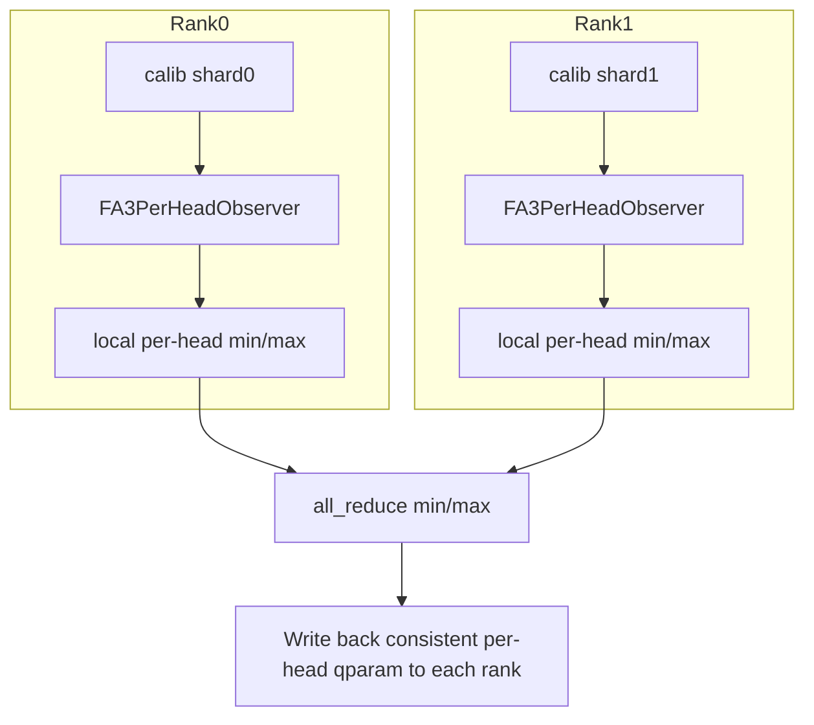

# Multi-card Quantization Adaptation Guide

<!-- md-trans-meta sourceCommit=94892e6c406e68ce9e7b44e379202a8d45cf3bb2 translatedAt=2026-08-20T11:47:34.322Z pushedAt=2026-08-21T01:10:42.024Z -->

## Introduction

This document is intended for developers who need to adapt quantization algorithms to support multi-card quantization.

msmodelslim distinguishes single-card/multi-card quantization execution through the `--device` field in the one-click quantization command. Taking DeepSeek-V3.1 w4a8c8 quantization as an example, the following command performs single-card quantization:

```shell
msmodelslim quant \
--model_path ${model_path} \
--save_path ${save_path} \
--model_type DeepSeek-V3.1 \
--quant_type w4a8c8 \
--trust_remote_code True
```

When multi-card quantization needs to be specified, use `--device npu:0,...,N` to specify the exact number of cards. Refer to the following example command:

```shell
msmodelslim quant \
--model_path ${model_path} \
--save_path ${save_path} \
--model_type DeepSeek-V3.1 \
--quant_type w4a8c8 \
--device npu:0,1,2,3,4,5,6,7,8 \
--trust_remote_code True
```

The efficiency improvement of multi-card quantization over single-card quantization is affected by multiple factors such as I/O read/write, quantization algorithm, and hardware performance. The actual benefit needs to be analyzed on a case-by-case basis. For DeepSeek-V3.1 w4a8c8 quantization, the speed of 8-card quantization is approximately 4 times that of single-card quantization.

In the single-card scenario, the quantization process is typically as follows: collect activations through calibration forward pass → compute activation statistics → compute quantization parameters and write them back to the model. After multi-card is enabled, the framework starts an independent process (rank) for each card. Each rank holds a complete model replica and processes different calibration data shards. During quantization, the states of Observers, quantizers, and other components are modified, which in turn determines the quantization results. Therefore, the algorithm must aggregate statistics or quantization parameters through collective communication at appropriate times to ensure that the quantization results on shared modules across ranks under multi-card conditions are semantically consistent with those of full-data calibration on a single card.

## Supported List

The following table summarizes the current multi-card quantization support:

| Processor | Completeness Support | Distributed Task Scheduling Optimization |
|-----------|:----------:|:--------:|
| `AdaptRotationProcessor` | ✓ | — |
| `FA3QuantProcessor` | ✓ | — |
| `FlexSmoothQuantProcessor` | ✓ | ✓ |
| `FlexAWQSSZProcessor` | ✓ | ✓ |
| `IterSmoothProcessor` | ✓ | — |
| `LinearQuantProcessor` | ✓ | ✓ |
| `OnlineQuaRotProcessor` | ✓ | — |
| `QuaRotProcessor` | ✓ | — |

# Basic Concepts of Multi-card Quantization

## Multi-card Quantization Completeness

Excluding the special impact of expert parallelism (EP), in the multi-card quantization scenario, each rank satisfies the following:

* **Consistent model replicas**: Each rank holds a complete model replica that is homogeneous and identical in value.

* **Data sharding**: The calibration set is partitioned by rank, and each rank performs forward pass and statistics only on its own shard.

Based on the above concepts, the core problem that multi-card quantization solves is "how to ultimately output model quantization weights equivalent to those obtained when holding the complete calibration set, given that each rank holds only a portion of the calibration set". The core approach to solving this problem is to perform cross-card synchronization of the activation tensors collected by the quantization algorithm or the computed statistics at appropriate times, thereby achieving activation collection or statistical effects equivalent to those obtained when holding the complete calibration set.

Taking **FA3 quantization** as an example: when each rank performs forward propagation on its local calibration shard, `_FA3PerHeadObserver` collects the local `min` and `max` of each head; then the local statistics of all ranks are reduced through collective communication, thereby obtaining global `min` and `max` equivalent to full calibration. For detailed adaptation steps, see [Adaptation Example: FA3Quant](#adaptation-example-fa3quant).



After the preceding synchronization operations, the quantization parameters qparam computed by each rank based on the global `min` and `max` are consistent with the quantization parameters computed from forward propagation over the complete calibration set. Subsequently, each rank performs subsequent quantization with the same quantization parameters, and finally each rank produces a consistent model state. We refer to the preceding process as the **completeness support** of multi-card quantization: after this adaptation is implemented, the multi-card process can run correctly, and the results are mathematically equivalent to those of single-card execution. With completeness support, the time overhead benefit obtained by using multiple cards stems from the parallel inference over the calibration set, while the additional overhead lies in the synchronization operations between different cards. However, since the synchronization overhead is generally relatively small, we can still achieve considerable acceleration benefits overall.

## Distributed Task Scheduling Optimization

On the basis of completeness support, it is found that there is still room for optimization: each rank often repeatedly executes the **same subtask**. For example, if a quantization algorithm contains subtasks T1, T2, T3, and T4 in sequence, by default both rank0 and rank1 run the entire **T1→T2→T3→T4** chain once, so the total time consumed is still close to the duration of the entire task chain on a single card. Multi-card only accelerates the calibration forward pass, but does not fully leverage multiple cards to share these repeated algorithm subtasks.

To alleviate this problem, this repository introduces the distributed task scheduler **DistributedTaskScheduler** (hereinafter referred to as **DTS**). Its core idea is to split the execution flow of the algorithm into several subtasks, have different ranks **execute these subtasks in a division of labor**, and then **synchronize across cards** at appropriate times, thereby ensuring that the model state of each rank is equivalent to "each rank separately executing the complete task chain T1→T2→T3→T4". Taking two cards as an example (`world_size = 2`):

```text
**Before optimization**

​```
Rank 0:  T1 ──► T2 ──► T3 ──► T4
Rank 1:  T1 ──► T2 ──► T3 ──► T4
​```

Time cost ≈ T1 + T2 + T3 + T4 (each rank runs the full chain, duplicating computation)

---

**After optimization**

​```
Rank 0:  T1 ──────────► T3
Rank 1:   T2 ──────────► T4
                           │
                           ▼
                    Cross‑rank sync
                           │
                           ▼
         Each rank's model state is equivalent to
         having executed T1 ──► T2 ──► T3 ──► T4
​```

Time cost ≈ max(subtask duration per rank) + sync overhead  
(Ideally, this is shorter than running the full chain on both ranks.)
```

# Multi-card Quantization Adaptation

## Completeness Support: Integrating Multi-card Quantization

**Objective**: In multi-card quantization scenarios, the quantization behavior of the algorithm on each rank remains semantically consistent with that on a single card.

This section introduces what the msmodelslim repository provides for the **completeness support** of multi-card quantization: (1) infrastructure, which addresses how to identify shared modules and how to implement synchronization; (2) integration steps, which guide the quantization algorithm in adapting to support multi-card quantization; (3) adaptation examples, which further analyze the adaptation process in combination with existing multi-card quantization adaptation examples.

### Infrastructure

#### DistHelper

In multi-card quantization, some modules have identical replicas on each card, while others exist only locally on the current card (such as routed experts under EP). For shared modules held by all cards, inter-card communication must be performed at appropriate times to ensure consistent quantization behavior across cards; for modules that exist only locally, synchronization must never be performed, otherwise unexpected behaviors such as process deadlock may occur. [`DistHelper`](https://gitcode.com/Ascend/msmodelslim/blob/master/msmodelslim/utils/distributed/dist_helper.py) serves as a helper utility class that automatically classifies the topology of network modules (distinguishing shared/local modules) during initialization, and provides interface methods for querying the list of shared modules.

Usage:

* **Initialization**: Initialize via `self.dist_helper = DistHelper(request.module, prefix=request.name)`.

* **Module injection**: Inject DistHelper into members such as the Observer or StatsCollector of the algorithm to be adapted by calling `set_dist_helper`.

* **Invocation**: Before synchronization, call `dist_helper.is_shared(module_name)` to query the shared module list, and perform cross-rank aggregation **only for shared modules**.

#### Utility Functions

When aggregating activations or statistics across ranks, the existing utility functions in [`msmodelslim/utils/distributed/dist_ops.py`](https://gitcode.com/Ascend/msmodelslim/blob/master/msmodelslim/utils/distributed/dist_ops.py) can be used first:

| Function Name | Main Input Parameters | Features and Typical Scenarios |
|------|----------|----------------|
| `sync_base_operation` | `tensor`: tensor to be reduced (updated **in place**); `op`: `min` / `max` / `sum` / `mean` / `prod`; `group`: process group (optional) | Performs **all-reduce** (`all_reduce`; `mean` is sum divided by `world_size`) on same-shaped tensors across ranks, and writes the result back to the same `tensor`. No additional large tensor buffer is allocated. Suitable for aligning statistics such as min/max and channel_max accumulated in the Observer. |
| `sync_gather_tensors` | `tensor`: a single tensor to be collected on this rank; `variable_shapes`: whether tensors of different shapes are allowed across ranks (default `False`, valid only on the NPU path); `on_cpu`: whether to aggregate on the CPU (default `False`); `group`: process group (optional) | Collects **one tensor from each rank** into a list of length `world_size`. When `variable_shapes=True`, shapes are gathered first and then data is gathered. Suitable for scenarios where the sharded data of each rank needs to be preserved rather than merged into a single statistic. |
| `sync_gather_tensor_lists` | `tensor_list`: the tensor list on this rank (non-empty); `on_cpu`: whether to aggregate on the CPU (default `False`); `group`: process group (optional) | Collects the **tensor lists** of each rank and flattens them into one large list. Suitable for activation tensors cached by batch during the calibration phase: each rank first appends locally, then merges them all at once in `postprocess` and computes statistics on the merged result. Example: `FlexStatsCollector.sync_act_stats` merges `StatKey.TENSOR`. |

### Integration Steps

1. **Declare support**: Override `support_distributed()` to return `True` (the base class defaults to `False`).

2. **Inject DistHelper**: Create and inject components such as Observer / StatsCollector in `preprocess`.

3. **Identify quantities that must be globally consistent**: Determine which variables in this algorithm (such as activation statistics/quantization parameters/smoothing coefficients) must remain consistent across all ranks.

4. **Implement synchronization** (choose one of the two forms based on the algorithm, or combine them):

   * **Observer**: Pass `sync=True` in the `update` of the calibration forward pass (often combined with the `DistHelper.is_shared` check); inside `update`, call `sync_base_operation` and the like to perform cross-rank reduction on the accumulated statistics.

   * **Processor**: During the calibration forward pass, the hook **only performs local activation collection**; in `postprocess`, call `sync_gather_tensor_lists` and the like to merge data from each rank, and then compute or reduce the global statistics.

### Adaptation Example: FA3Quant

The multi-card quantization adaptation of [`FA3QuantProcessor`](https://gitcode.com/Ascend/msmodelslim/blob/master/msmodelslim/processor/quant/fa3/processor.py) is used as an example. Under the default `per_head` configuration, FA3 relies on the calibration forward pass to collect the min/max of each head, and then generates the IR `FakeQuantActivationPerHead` based on these values. The goal of multi-card adaptation is to ensure that **each rank obtains per-head quantization parameters equivalent to those from full calibration**.

The following describes the four steps in [Integration Steps](#integration-steps) against the source code ([`fa3/processor.py`](https://gitcode.com/Ascend/msmodelslim/blob/master/msmodelslim/processor/quant/fa3/processor.py) and [`recall_window.py`](https://gitcode.com/Ascend/msmodelslim/blob/master/msmodelslim/core/observer/recall_window.py)).

**Step 1: Declare support**.

`FA3QuantProcessor` declares support for multi-card quantization:

```python
def support_distributed(self) -> bool:
    return True
```

**Step 2: Inject DistHelper into `_FA3PerHeadObserver.`**

After `FA3QuantProcessor.preprocess` replaces the placeholder modules with `_FA3PerHeadObserver`, a `DistHelper` is constructed and injected into each observer in the multi-card scenario:

```python
if dist.is_initialized():
    self.dist_helper = DistHelper(request.module, prefix=request.name)
    for _, submodule in request.module.named_modules(prefix=request.name):
        if not isinstance(submodule, _FA3PerHeadObserver):
            continue
        submodule.set_dist_helper(self.dist_helper)
```

**Precautions**

* During construction, `DistHelper` performs an `all_gather` on the `named_modules` of each rank to obtain sets such as shared/local_only, and **these sets are not automatically refreshed when the model changes**.

* If Observers are inserted or IR is replaced in `preprocess`, the initialization `DistHelper(model, prefix=...)` must be executed **after all the aforementioned structural changes are completed**; otherwise, `is_shared(name)` returns results based on the old model structure, causing unexpected effects on the algorithm behavior.

**Step 3: Identify quantities that must be globally consistent.**

In `per_head` mode, `FA3QuantProcessor` computes the quantization parameters from the min/max values accumulated by the observer. For each rank to obtain the same quantization parameter qparam, the `min_v` and `max_v` passed to `calculate_qparam` must be consistent.

```python
min_v = submodule.min_val.squeeze()   # Accumulated extrema from RecallWindowObserver during the calibration phase
max_v = submodule.max_val.squeeze()

q_param = calculate_qparam(
    min_val=min_v,
    max_val=max_v,
    ...
)
```

**Step 4: Implement synchronization**.

Call the `DistHelper` class to identify the modules that require synchronization, and pass the synchronization flag variable `sync` to the internal `RecallWindowObserver`.

```python
def forward(self, x: torch.Tensor) -> torch.Tensor:
    samples = x.contiguous().view(x.shape[1], -1)
    sync = self._dist_helper is not None and self._dist_helper.is_shared(self._name)
    self._observer.update(samples, sync=sync)
    return x
```

When `sync=True`, after merging the local `min`/`max` of the current batch, `RecallWindowObserver.update` uses the synchronization utility functions to perform cross-rank reduction on the statistics, so that after calibration the `min`/`max` on each rank is aligned with the "full calibration set", and each rank can subsequently compute consistent quantization parameters based on the `min` / `max`.

```python
if sync and dist.is_initialized():
    sync_base_operation(self._min_values, op="min")
    sync_base_operation(self._max_values, op="max")
```

## Efficiency Optimization: Distributed Task Scheduler Integration

**Objective**: On the basis of multi-card quantization completeness support, reduce the **repeated execution of the same subtask** across ranks to further improve runtime efficiency. DTS only adjusts the task execution order **within** a Processor and does not change the mathematical semantics of the algorithm.

This section introduces what the msmodelslim repository provides for the **efficiency improvement** of multi-card quantization: (1) infrastructure, which addresses how to allocate and execute algorithm subtasks; (2) integration steps, which guide quantization algorithms to integrate with the distributed task scheduler; (3) adaptation examples, which further analyze the adaptation process in combination with existing adaptation examples.

### Infrastructure

#### DistributedTaskScheduler

[`DistributedTaskScheduler`](https://gitcode.com/Ascend/msmodelslim/blob/master/msmodelslim/utils/distributed/task_scheduler/scheduler.py) internally distributes tasks to each rank dynamically through a shared task queue. A shared task is distributed and executed only once, and consistency across ranks is ultimately achieved through synchronization of the network module. Developers only need to focus on how to create and submit algorithm subtasks; DTS handles task scheduling internally on its own.

Usage:

* **Initialization**: Construct the scheduler through `DistributedTaskScheduler(model, disable_parallel=...)`.

* **Submit tasks**: Submit subtasks to the task queue through `submit(fn, args=(), kwargs=None, dependencies=None, ...)`.

* **Execute tasks**: Call `run()` to start automatic task allocation and execution.

```python
with DistributedTaskScheduler(self.model, disable_parallel=True) as scheduler:
    for idx in range(n_tasks):
        scheduler.submit(self._worker, args=(idx,), dependencies=deps)
    scheduler.run()
```

**Constructor parameters of `DistributedTaskScheduler`**

| Parameter | Mandatory | Description |
|------|----------|------|
| `model` | Yes | The `nn.Module` held by the current Processor, used to resolve `dependencies` paths and perform default module synchronization. |
| `disable_parallel` | No | Defaults to `False`. When set to `True`, **all** `submit` calls in this scheduler are executed in the "each rank runs the full task" manner (equivalent to disabling task division for all subtasks in this scheduler); its scope is larger than a single `submit(..., parallel=False)`. Task division can also be disabled globally through the class method `DistributedTaskScheduler.set_global_disable_parallel(True)`. |

**Parameters of the `submit` method**

| Parameter | Mandatory | Description |
|------|----------|------|
| `fn` | Yes | The entry function of the subtask (usually an instance method of the Processor, such as `self._worker_fn`). |
| `args` / `kwargs` | No | Positional and keyword arguments passed to `fn`. They must match the formal parameters of `fn` so that `fn(*args, **kwargs)` can be invoked normally. |
| `dependencies` | No | The list of **module paths** involved in this task (for example, `[source] + list(targets)`), used to divide waves and trigger default module synchronization after the task completes. The paths must be resolvable by `model.get_submodule`, must not contain `None`, and must not be nested lists. |
| `sync_fn` | No | The custom synchronization callback after the task completes, with the signature `(record: TaskExecutionRecord, sync_ctx: TaskSyncContext) -> None`. If provided, it **replaces** the default synchronization for `dependencies`. |
| `parallel` | No | Whether to enable **cross-rank task division** for this subtask (defaults to `True`). `True`: In multi-card scenarios, the subtask is shared and executed by different ranks (each subtask usually runs on only one rank). After `run()` completes, synchronization is performed according to `dependencies`/`sync_fn`, making the result equivalent to each rank having executed the subtask. `False`: In multi-card scenarios, **each rank executes the subtask completely** (no task division); this applies to scenarios where the subtask already contains collective communication such as all-reduce. |

**Three-level synchronization mechanism**

Because each algorithm subtask is executed only on the rank assigned to that task, the model structure effects produced by the algorithm subtask (for example, an outlier suppression algorithm modifying weight values, or a quantization algorithm replacing the model structure) also take effect only on that rank. To maintain multi-card semantic correctness, this repository introduces a three-level synchronization mechanism to meet task synchronization requirements in different scenarios. The priority of the three-level synchronization is: `sync_fn` > `DTSMixin.distributed_sync` > `default_module_state_sync`. A subtask performs only one level of synchronization. For example, when `sync_fn` is triggered, `DTSMixin.distributed_sync` and `default_module_state_sync` are no longer executed.

| Parameters/Mechanisms | Description |
|-------------|------|
| `sync_fn` | **Task-level custom synchronization** (input parameter of `submit`). After it is provided, **only** this callback is executed, and the module-level synchronization described below is no longer performed on the `dependencies` subtree. It applies to scenarios where the model structure changes, for example, when the model structure is replaced using IR and module-level synchronization cannot meet the requirement, in which case a custom implementation can be provided. |
| `DTSMixin.distributed_sync` | **Module-level custom synchronization**: If the class of a submodule in the `dependencies` subtree inherits [`DTSMixin`](https://gitcode.com/Ascend/msmodelslim/blob/master/msmodelslim/utils/distributed/task_scheduler/sync.py) and implements the `distributed_sync` method, the custom logic is invoked for that submodule. It applies to scenarios where the model structure does not change but the default synchronization cannot meet the synchronization requirement, in which case a custom implementation can be provided. |
| `default_module_state_sync` | **Module-level default synchronization**: The parameters and buffers on **the rank that executes the task** (`record.executor_rank`) are used as the source and broadcast to all ranks, so that the states of all ranks are consistent. |

### Integration Steps

1. First complete the adaptation and verification of [Completeness Support: Integrating Multi-card Quantization](#completeness-support-integrating-multi-card-quantization).

2. **Encapsulate the subtask function (`fn`)**: Encapsulate the splittable logic as a Processor method (such as `self._worker_fn`).

3. **Submit the task (`submit`)**: Submit the task through the `submit` method within `with DistributedTaskScheduler(self.model, ...)`.

4. **Execute scheduling (`run`)**: After all ranks complete all `submit` calls within the same `with` block, call `scheduler.run()`. The DTS automatically distributes and executes the subtasks and invokes the synchronization method.

**Precautions**

* **Collectives within a task and division of labor across ranks must not be mixed**: The subtask function must not contain synchronization behavior such as all_gather/all_reduce. Otherwise, because a subtask is executed by only one rank, other ranks cannot reach the synchronization point, resulting in process deadlock.

* The business parameters of `submit` must be passed through `args`/`kwargs`, and **must not** be passed as the second positional argument of `submit`; `args`/`kwargs` must be serializable.

### Adaptation Example: FlexAWQSSZ

This section uses [`FlexAWQSSZProcessor`](https://gitcode.com/Ascend/msmodelslim/blob/master/msmodelslim/processor/anti_outlier/flex_smooth/processor.py) as an example to illustrate how to integrate DTS after completing [completeness support](#completeness-support-integrating-multi-card-quantization) to further optimize multi-card quantization efficiency.

**Step 1: Encapsulate the subtask function**.

The base class `BaseSmoothProcessor._process_subgraphs_by_priority` serially invokes `_process_single_subgraph` on each rank. FlexAWQSSZ **overrides** this method in the base class FlexSmoothBaseProcessor to register the smoothing of each subgraph as a DTS task.

1. **Before submission**, prepare the "subgraph task table" `self.sorted_configs` on the Processor (the list of `AdapterConfig` sorted by priority, with identical content across all ranks).

2. **`submit` passes only an integer index** `idx` (starting from 1, consistent with the loop `enumerate(..., start=1)`).

3. **During execution** (after a rank is assigned the task), the worker uses `idx` to look up `self.sorted_configs[idx - 1]`, and then calls the same `_process_single_subgraph` as in the single-card case.

```python
def _worker_fn(self, idx) -> None:
    adapter_config = self.sorted_configs[idx-1]
    priority = self.SUBGRAPH_PRIORITY.get(adapter_config.subgraph_type, 999)
    module_name = adapter_config.mapping.source \
        if adapter_config.mapping.source else adapter_config.mapping.targets[0]
    get_logger().debug(
        "  %d. %s (priority: %d) - %s", idx, adapter_config.subgraph_type, priority, module_name
    )
    self._process_single_subgraph(adapter_config)
```

**Step 2: Submit algorithm subtasks**.

After sorting by subgraph priority, loop `submit` inside the `with` block; `dependencies` is used by the scheduler to associate modules and synchronize the relevant state after the task completes:

```python
if not self.sorted_configs:
    get_logger().warning(f"No subgraphs to process for current layer.")
    return

with DistributedTaskScheduler(self.model) as scheduler:
    for idx, adapter_config in enumerate(self.sorted_configs, start=1):
        m = adapter_config.mapping
        is_non_fusion = (m.source is None and m.targets is not None)
        has_non_shared_module = False
        if self.dist_helper is not None:
            module_names = []
            if m.source is not None:
                module_names.append(m.source)
            if m.targets is not None:
                module_names.extend(m.targets)
            has_non_shared_module = any(
                not self.dist_helper.is_shared(name) for name in module_names
            )
        scheduler.submit(fn=self._worker_fn,
                            args=(idx,),
                            dependencies=([m.source] if m.source else []) + list(m.targets),
                            parallel=not (is_non_fusion or has_non_shared_module),
                        )
```

* `args=(idx,)`: passes only the integer index, not the `AdapterConfig` object (to satisfy the serialization requirement).

* `dependencies`: `[source] + list(targets)`; when there is no `source`, use `[] + targets` to avoid `None` entering the list.

* `parallel=not (is_non_fusion or has_non_shared_module)`: in either of the following cases, disable rank-level division of labor and have each rank execute the task in full — a **non-fused subgraph** (`source is None`); or any module in `dependencies` is determined by `DistHelper.is_shared` to be **non-shared** (such as a MoE local expert). Other subgraphs allow division of labor.

**Step 3: Execute scheduling**.

```python
with DistributedTaskScheduler(self.model) as scheduler:
    for idx, adapter_config in enumerate(self.sorted_configs, start=1):
        ... # Submit the task
    scheduler.run() # Execute scheduling to automatically assign and run all subtasks
```

All ranks must enter the same `with DistributedTaskScheduler(...)` and call `scheduler.run()`; after `run()` returns, `self.sorted_configs` is cleared.
