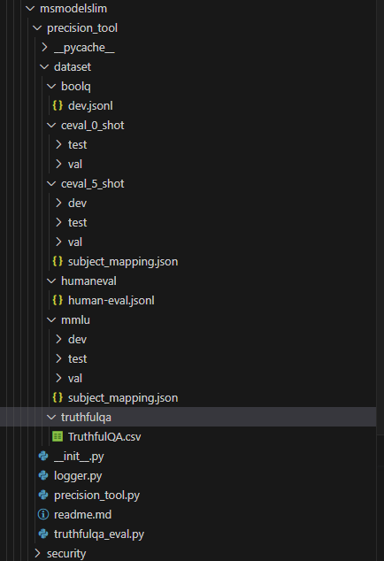

# Fake-Quantization Accuracy Test Tool

## Precision Tool

### Overview

The Precision Tool is a fake-quantization accuracy testing utility used to validate model accuracy under the `torch_npu` execution route.

### Preparations

1. CANN package installation: Install the Ascend AI inference driver, firmware, and CANN package in your development and runtime environments by referring to the [Ascend Documentation](https://www.hiascend.com/en/document).
2. Set Python environment variables.

    ```bash
    # work_dir represents the project working directory, which is the root directory path containing the msmodelslim project
    # For example, if the project path is /home/user/projects/msit/msmodelslim, the value of work_dir is /home/user/projects.
    export PYTHONPATH=${work_dir}/msmodelslim:$PYTHONPATH
    ```

    (Optional) To perform accuracy testing through multi-device NPU parallel processing, disable NPU virtual memory and specify the target NPUs:

    ```bash
    export PYTORCH_NPU_ALLOC_CONF=expandable_segments:False # Disable the NPU virtual memory.
    export ASCEND_RT_VISIBLE_DEVICES=0,1,2,3 # Specify the target NPUs to be used.
    ```

3. Create a test script. Example:

```python
from transformers import AutoModel, AutoTokenizer, AutoModelForCausalLM
from precision_tool import PrecisionTest
import torch

if __name__ == '__main__':
    model_path = "meta-llama/Llama-2-7b-chat-hf"
    model = AutoModelForCausalLM.from_pretrained(
        model_path,
        torch_dtype=torch.float16,
        device_map="auto",
        use_safetensors=True,
        local_files_only=True
        ).eval()
    tokenizer = AutoTokenizer.from_pretrained(model_path, local_files_only=True)
    precision_test = PrecisionTest(model, tokenizer, "truthfulqa", 1, "npu")
    precision_test.test()

```

### Function

### Interface Description

#### Instance Creation Interface

```python
def __init__(self, model, tokenizer, dataset, batch_size, hardware_type,
             tokenizer_return_type_id=False, shot=5):
    """
    @param model:
        llm to run the test, should be an instance of transformers.PreTrainedModel
    @param dataset:
        dataset to test precision
    @param batch_size:
        batch_size to run inference
    @param hardware_type:
        currently only npu is supported
    @param tokenizer_return_type_id:
        tokenizer return token type id
    @param shot:
        shot to test precision
    """
```

Parameter description:

  + `model`: The model to be tested, which must support loading through the Transformers library.
  + `tokenizer`: The tokenizer that corresponds to the designated `model`.
  + `dataset`: The validation dataset to be tested. Current supported choices include `BoolQ`, `HumanEval`, `MMLU`, and `TruthfulQA`.
  + `hardware_type`: This parameter currently supports **only** the literal string value `"npu"`.
  + `tokenizer_return_type_id`: Set this parameter to `True` when entering a Bert-type model interface. The exact value can be determined based on runtime execution feedback.
  + `shot`: The shot value applied during accuracy testing. This parameter takes effect only for the `MMLU` dataset.

#### Test Execution Interface

```python
def test(self):
```

### Usage

1. Download the target evaluation dataset and organize its directory structure as follows:

    ```text
    |-- dataset
        |-- boolq
        |   `-- dev.jsonl
        |-- mmlu
        |   |-- possibly_contaminated_urls.txt
        |   |-- dev
        |   |-- test
        |   `-- val
        |-- truthfulqa
        |   `-- TruthfulQA.csv
        |-- humaneval
        |   `-- human-eval-v2-20210705.jsonl
    ```

    Maintain exact consistency for all directory names and structural paths.
    Dataset download links:

    ```text
    https://storage.cloud.google.com/boolq/dev.jsonl
    http://opencompass.oss-cn-shanghai.aliyuncs.com/datasets/data/humaneval.zip
    http://opencompass.oss-cn-shanghai.aliyuncs.com/datasets/data/mmlu.zip
    https://github.com/sylinrl/TruthfulQA/blob/main/data/v0/TruthfulQA.csv
    ```

2. Save the dataset directory structure to the same path containing `precision_tool.py`, as shown in the following figure.
    
3. To validate the `HumanEval` dataset, you must install the official evaluation extension through <https://github.com/openai/human-eval>.
