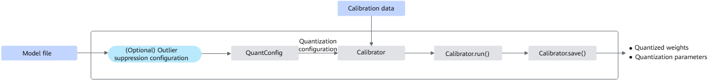
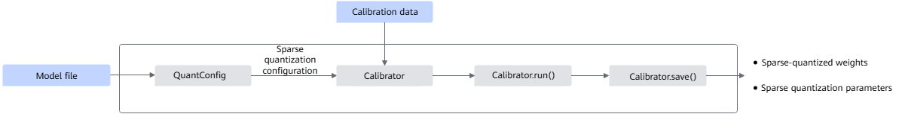
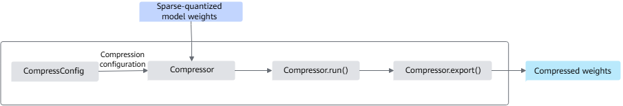
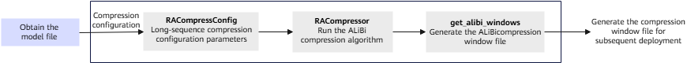
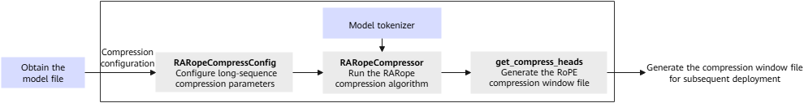

# Compression and Structure Optimization (Mainly for Foundation Models)

## Foundation Model Quantization

The foundation model quantization tool converts high-bit floating-point numbers into low-bit fixed-point numbers (for example, from 16 bits to 8 bits) to directly reduce the volume of model weights and generate quantization parameters and weight files. On the premise that no training cost is required, compress a foundation model after training and and maintain its accuracy to the maximum extent.

### Preparations

- This feature is supported only on the following products.
    - Atlas inference products (Atlas 300I Duo inference card)
    - Atlas training products
    - Atlas A2 training products/Atlas 800I A2 inference products/A200I A2 Box heterogeneous components

- Install msModelSlim. For details, see [msModelSlim Installation Guide](../../getting_started/install_guide.md).
- Ensure the following dependencies have been installed for the foundation model quantization tool.
  If you run the following commands as a non-root user, add `--user` to the end of each installation command, such as `pip3 install onnx --user`. If dependencies do not completely match in your development environment, modify dependency versions based on the GUI error message.

```bash
pip3 install numpy==1.25.2
pip3 install transformers       # The version must be 4.29.1 or later. For the LLaMA model, the 4.29.1 version must be installed.
pip3 install accelerate==0.21.0  # If a model needs to be quantized in multi-NPU parallel mode, the version must be 0.28.0 or later.
pip3 install tqdm==4.66.1
```

- (Optional) To quantize a model in multi-NPU parallel mode by using the foundation model quantization tool, disable the virtual memory allocated for NPU devices and manually configure the device quantization sequence environment variable.

```bash
export PYTORCH_NPU_ALLOC_CONF=expandable_segments:False # Disables the virtual memory allocated for NPU devices.
export ASCEND_RT_VISIBLE_DEVICES=0,1,2,3 # Configures the device quantization sequence environment variable.
```

Notes

This feature is supported only on Atlas training products, Atlas A2 training products, Atlas 800I A2 inference products, and A200I A2 Box heterogeneous components.

- (Optional) To use the NF weight quantization method in the foundation model quantization tool, note that this feature is supported only on Atlas training products, Atlas A2 training products, Atlas 800I A2 inference products, and A200I A2 Box heterogeneous components.
 
- (Optional) To use the W4A4_FLATQUANT_DYNAMIC quantization method in the foundation model quantization tool, note that this feature is supported only on Atlas training products, Atlas A2 training products, Atlas 800I A2 inference products, and A200I A2 Box heterogeneous components.

### Function

For details, see [Foundation Model Support Matrix](../../model_support/foundation_model_support_matrix.md).

### Notes

Foundation model compression technologies are mainly used for the quantization and compression of common large language models. However, when quantizing models with special structures, the msModelSlim tool may be subject to the following constraints:

MoE models support `W8A8_per-token`, `W8A16_per_channel`, and `W8A16_per_group` quantization scenarios, but do not support low-bit sparse quantization scenarios.
Multimodal models support only the W8A16 quantization scenarios, and do not support the W8A8 or low-bit sparse quantization scenarios.

### Implementation Process

Figure 1 Quantization interface call process



The key steps are as follows:

1. Prepare the original model and calibration data.

2. (Optional) Suppress outliers in the LLM model. You can determine whether to enable outlier suppression by referring to [Accuracy Retention Policies](#accuracy-retention-policies).
    - Use `AntiOutlierConfig` to generate the outlier suppression configuration.
    - Call `AntiOutlier` and pass the model and calibration data to generate a suppressor.
    - Call `process()` of the suppressor to suppress outliers in the original model.

3. Use `QuantConfig` to generate a quantization configuration.

4. Call `Calibrator` to build a quantization calibration object based on the original model, quantization configuration, and calibration data.

5. Call `run()` provided by the generated quantization calibration object to quantize the original model.

6. Call `save()` provided by the generated quantization calibration object to save the quantized model (including model quantization weights and related parameters) for subsequent deployment tasks. For details about models supported for quantization, see [Models Supported by the Acceleration Library](https://www.hiascend.com/document/detail/zh/mindie/20RC1/modellist/mindie_modellist_0001.html) in the MindIE documentation.

### Quantization Procedure (Using ChatGLM2-6B as an Example)

1. Prepare the model, weight files, and calibration data. This section uses ChatGLM2-6B as an example. Example directory structure:

    ```text
    ├── config.json
    ├── configuration_chatglm.py
    ├── modeling_chatglm.py
    ├── pytorch_model-00001-of-00007.bin
    ├── pytorch_model-00002-of-00007.bin
    ├── pytorch_model-00003-of-00007.bin
    ├── pytorch_model-00004-of-00007.bin
    ├── pytorch_model-00005-of-00007.bin
    ├── pytorch_model-00006-of-00007.bin
    ├── pytorch_model-00007-of-00007.bin
    ├── pytorch_model.bin.index.json
    ├── quantization.py
    ├── README.md
    ├── tokenization_chatglm.py
    ├── tokenizer.model
    ├── tokenizer_config.json
    ```

2. Before quantizing the ChatGLM2-6B model, run the following commands to install the required dependencies. If the quantization tool prompts that a dependency is missing during execution, install it as prompted.

    ```bash
    pip3 install protobuf==4.24.1
    pip3 install sentencepiece==0.1.99
    pip3 install sympy==1.11.1
    pip3 install transformers==4.43.0 # For details about the version requirements, see the chatglm2-6b/config.json file in the ChatGLM2-6B repository.
    ```

3. Create a quantization script named `quant.py` for the new model, edit the `quant.py` file, import the sample code based on your actual quantization scenario, and modify it accordingly.

    - The sample code to be imported for the `W8A8_per_channel` quantization scenario is as follows. For details about the sample code for KVCache, low-bit, and `per_token` quantization scenarios, see [Quantization Code Samples](quantization_and_sparse_quantization_scenario_import_code_examples.md).

    ```python
    # Import dependencies
    import torch 
    import torch_npu   # To perform quantization on the CPU, skip this step.
    from transformers import AutoTokenizer, AutoModel

    # For local path
    tokenizer = AutoTokenizer.from_pretrained(pretrained_model_name_or_path='./chatglm2', local_files_only=True) # If custom code exists, set trust_remote_code=True. Ensure the security of the loaded modeling file.
    model = AutoModel.from_pretrained(
        pretrained_model_name_or_path='./chatglm2', local_files_only=True
    ).npu()    # To perform multi-device quantization on the NPU, refer to the prerequisites for configuration and set device_map='auto'. When creating a model, remove .npu(). To perform quantization on the CPU, set torch_dtype=torch.float32 and remove .npu(). If custom code exists, set trust_remote_code=True. Ensure the modeling file is safe to load.
    # Prepare calibration data and modify the data as needed.
    calib_list = ["Where is the capital of China?",
                "Please write a poem:",
                "How can I learn Python?",
                "Please help me write a report on the optimization of foundation model inference:",
                "List the most worth-seeing tourist attractions in China."
    # Define the function for obtaining calibration data.
    def get_calib_dataset(tokenizer, calib_list):
        calib_dataset = []
        for calib_data in calib_list:
            inputs = tokenizer([calib_data], return_tensors='pt').to(model.device)   
            print(inputs)
            calib_dataset.append([inputs.data['input_ids'], inputs.data['attention_mask']])     
        return calib_dataset

    dataset_calib = get_calib_dataset(tokenizer, calib_list)  # Obtain calibration data.

    # Quantization configuration (modify it as needed)
    from msmodelslim.pytorch.llm_ptq.llm_ptq_tools import Calibrator, QuantConfig    # Import quantization configuration interfaces.
    # Specify quantization parameters and return a quantization configuration instance by using QuantConfig.
    quant_config = QuantConfig(
        a_bit=8, 
        w_bit=8,       
        disable_names=['transformer.encoder.layers.0.self_attention.query_key_value','transformer.encoder.layers.0.self_attention.dense', 'transformer.encoder.layers.0.mlp.dense_h_to_4h'], 
        dev_id=model.device.index, 
        dev_type='npu',   # To perform quantization on the CPU, set dev_type='cpu' and remove the dev_id=model.device.index configuration.
        act_method=3,
        pr=0.5, 
        mm_tensor=False
    )  
    # Define calibration by using the Calibrator interface with the loaded original model, quantization configuration, and calibration data.
    calibrator = Calibrator(model, quant_config, calib_data=dataset_calib, disable_level='L0')  
    calibrator.run()     # Use run() to perform quantization.
    calibrator.save('./quant_weight', save_type=[ 'numpy', 'safe_tensor'])      # Save model quantization parameters by using save(). Modify the path as needed.
    print('Save quant weight success!')
    ```

    The sample code to be imported for the `W8A16_per_channel` or `W4A16_per_channel` quantization scenario is as follows. The sample code for the MinMax, HQQ, GPTQ, AWQ, and `W4A16 per_group` quantization scenarios is available in the corresponding W8A16 or W4A16 quantization scenario sections.

    ```python
    # Import dependencies
    import torch
    import torch_npu   # To perform quantization on the CPU, skip this step.
    from transformers import AutoTokenizer, AutoModel

    # For local path
    tokenizer = AutoTokenizer.from_pretrained(pretrained_model_name_or_path='./chatglm2', local_files_only=True) 
    model = AutoModel.from_pretrained(
        pretrained_model_name_or_path='./chatglm2', local_files_only=True
        ).npu()    # To perform multi-device quantization on the NPU, refer to the prerequisites for configuration and set device_map='auto'. When creating a model, remove .npu(). To perform quantization on the CPU, set torch_dtype=torch.float32 and remove .npu().
    # Prepare calibration data and modify the data as needed. In W8A16 Label-Free mode, skip this step.
    calib_list = ["Where is the capital of China?",
                "Please write a poem:",
                "How can I learn Python?",
                "Please help me write a report on the optimization of foundation model inference:",
                "List the most worth-seeing tourist attractions in China."
    # Define the function for obtaining calibration data.
    def get_calib_dataset(tokenizer, calib_list):
        calib_dataset = []
        for calib_data in calib_list:
            inputs = tokenizer([calib_data], return_tensors='pt').to(model.device)
            print(inputs)
            calib_dataset.append([inputs.data['input_ids'], inputs.data['attention_mask']])
        return calib_dataset

    dataset_calib = get_calib_dataset(tokenizer, calib_list)  # Obtain calibration data.

    # Quantization configuration (modify it as needed)
    from msmodelslim.pytorch.llm_ptq.llm_ptq_tools import Calibrator, QuantConfig    # Import quantization configuration interfaces.
    # Specify quantization parameters and return a quantization configuration instance by using QuantConfig.
    quant_config = QuantConfig(
        w_bit=8,     # In W4A16 scenarios, set w_bit to 4. In the W4A16 per_group scenario, refer to the W4A16 per_group quantization parameter settings.
        a_bit=16,         
        disable_names=[], 
        dev_id=model.device.index, 
        dev_type='npu',   # To perform quantization on the CPU, set dev_type='cpu' and remove the dev_id=model.device.index configuration.
        w_sym=False, 
        mm_tensor=False
    )  
    # Define calibration by using the Calibrator interface with the loaded original model, quantization configuration, and calibration data.
    calibrator = Calibrator(model, quant_config, calib_data=dataset_calib, disable_level='L0')  
    calibrator.run()     # Use run() to perform quantization.
    calibrator.save('./quant_weight', save_type=[ 'numpy', 'safe_tensor'])      # Save model quantization parameters by using save(). Modify the path as needed.
    print('Save quant weight success!')
    ```

4. Start the model quantization task and obtain model quantization parameters from the specified output directory. For details about the quantized weight files, see [Quantized Weight Files](#quantized-weight-files). To use MindIE for subsequent inference and deployment tasks, save the file in safetensors format. For details about models supported for quantization, see [Models Supported by MindIE](https://www.hiascend.com/software/mindie/modellist).

```bash
python3 quant.py
```

After the quantization task is complete, the model accuracy may decrease. You can optimize the configuration by referring to [Accuracy Retention Policies](#accuracy-retention-policies) to reduce accuracy loss.

### Code Samples in Quantization and Sparse Quantization Scenarios

Code samples for other scenarios are available at [here](quantization_and_sparse_quantization_scenario_import_code_examples.md).

### Quantized Weight Files

- Files in `.npy` format
When [`save_type`](../../python_api_v0/foundation_model_compression_apis/foundation_model_quantization_apis/pytorch_save().md) is set to `['numpy']` or left unspecified, the quantized weights are saved as an `.npy` file. The `.npy` file is stored in dictionary format, where the key is the name of each linear layer, such as `transformer.encoder.layers.0.self_attention.query_key_value` of the ChatGLM2-6B model, and the value is the linear weight of `query_key_value` at layer 0.

> Note: The `w4a8_dynamic` quantization type does not support saving in the `['numpy']` format. Therefore, when `save_type` is set to `['numpy']`, an error message is displayed. When `save_type` is set to `['numpy', 'safe_tensor']`, the data is saved in `safe_tensor` format. For data in `numpy` format, saving is skipped and an error message is displayed in the log.

```text
├── anti_fp_norm.npy   # This file is generated for the LLaMA model when outlier suppression is enabled. For details, see "Using the Outlier Suppression Function". The anti-outlier algorithm generates the norm layer weight file in the floating-point weights, which is used for weight adaptation of the input and post-norm of the quantization layer.
├── deq_scale.npy      # File of quantization parameter weights for W8A8 quantization and sparse quantization. The tensor data type is int64. The deq_scale file has undergone data type conversion for the quantization operators and can directly adapt to the operators. When quantizing a BF16 model, the data type is not converted to int64 and remains float32.
├── input_offset.npy   # File of activation quantization offset weights for W8A8 quantization and sparse quantization. The tensor data type is float32.
├── input_scale.npy    # File of activation quantization scale factor weights for W8A8 quantization and sparse quantization. The tensor data type is float32.
├── kv_cache_offset.npy    # File of KV cache quantization parameters and KV linear activation quantization offset weights. The tensor data type is float32.
├── kv_cache_scale.npy   # File of KV cache quantization parameters and KV linear activation quantization scale factor weights. The tensor data type is float32.
├── quant_bias.npy     # File of quantization parameter weights for W8A8 quantization and sparse quantization. The tensor data type is int32. The quant_bias already incorporates the bias value of the linear layer from the original floating-point model.
├── quant_weight.npy   # Quantization weight file. The tensor data type is int8.
├── weight_offset.npy  # File of weight quantization parameters for w8a16 and w4a16. The tensor data type is float32.
├── weight_scale.npy   # File of weight quantization parameters for w8a16 and w4a16. The tensor data type is float32.
```

Code sample for reading the preceding files during inference and deployment: `quant_param_dict = np.load("xxx.npy", allow_pickle=True).item()`

- Files in safetensors format
When [`save_type`](../../python_api_v0/foundation_model_compression_apis/foundation_model_quantization_apis/pytorch_save().md) is set to `['safe_tensor']`, the quantized weights are saved as a `.safetensors` file and a `.json` description file.
**Note**: When the user-configured value of [`part_file_size`](../../python_api_v0/foundation_model_compression_apis/foundation_model_quantization_apis/pytorch_save().md) is greater than 0, the sharded saving function of the PyTorch framework is enabled. msModelSlim calculates the cumulative size of the traversed weight files. If the cumulative size exceeds the `part_file_size` value, the tool groups the collected weights into one part and resets the size tracking. After checking all files, msModelSlim saves the weights as individual shards and generates a weight index file (`xxx.safetensors.index.json`). The weight and index naming conventions follow open-source model patterns, such as `xxx-0000x-of-0000x.safetensors`. If the number of parts exceeds 99999, the weights and indexes are named using the `xxx-x-of-x.safetensors` pattern.

    - The storage format inside a `.safetensors` file is a dictionary containing both quantized weights and unmodified floating-point weights. The key for a quantized weight consists of the linear layer name at each layer and its corresponding weight suffix: `module.weight` and `module.bias` correspond to `anti_fp_norm.npy`, `weight` corresponds to `quant_weight.npy`, and `quant_bias` corresponds to `quant_bias.npy`. For example, `transformer.encoder.layers.0.self_attention.query_key_value.deq_scale` in the ChatGLM2-6B model corresponds to `transformer.encoder.layers.0.self_attention.query_key_value` within the `deq_scale.npy` file of the `.npy` format weights.

```text
# Partial content of a weight file generated during sparse quantization of a LLaMA model
{
  "model.embed_tokens.weight": tensor([...]),
  "model.layers.0.self_attn.q_proj.weight": tensor([...]),
  "model.layers.0.self_attn.q_proj.input_scale": tensor([...]),
  "model.layers.0.self_attn.q_proj.input_offset": tensor([...]),
  "model.layers.0.self_attn.q_proj.quant_bias": tensor([...]),
  "model.layers.0.self_attn.q_proj.deq_scale": tensor([...]),
  "model.layers.0.self_attn.k_proj.weight": tensor([...]),
 ...
}
```

> Note: When the `w4a8_dynamic` quantization type is used, the `safe_tensor` content includes an additional `weight_scale_second` and `weight_offset_second` key and their corresponding tensor values.
    
- The JSON description file stores the overall quantization type (`model_quant_type`), the KV cache quantization enabling status (`kv_cache_type`), and the type of each individual weight. The weight types are defined as follows: `FLOAT` (from the original floating-point weights), `W8A8` (from W8A8 quantization), `W8A8S` (from sparse quantization), `W8A8SC` (from compression), `NF4` (from NF4 quantization), and `W4A4_FLATQUANT_DYNAMIC` (from the W4A4 Flatquant quantization method).

```text
# Partial content of a JSON description file generated during sparse quantization of a LLaMA model
{
  "model_quant_type": "W8A8S",                               # Indicates that the overall quantization type is sparse quantization.
  "model.embed_tokens.weight": "FLOAT",                      # The embed_tokens weight from the original floating-point model.
  "model.layers.0.self_attn.q_proj.weight": "W8A8S",         # The quant_weight of self_attn.q_proj at layer 0 added during quantization.
  "model.layers.0.self_attn.q_proj.input_scale": "W8A8S",    # The input_scale of self_attn.q_proj at layer 0 added during quantization.
  "model.layers.0.self_attn.q_proj.input_offset": "W8A8S",   # The input_offset of self_attn.q_proj at layer 0 added during quantization.
  "model.layers.0.self_attn.q_proj.quant_bias": "W8A8S",     # The quant_bias of self_attn.q_proj at layer 0 added during quantization.
  "model.layers.0.self_attn.q_proj.deq_scale": "W8A8S",      # The deq_scale of self_attn.q_proj at layer 0 added during quantization.
  "model.layers.0.self_attn.k_proj.weight": "W8A8S",         # The quant_weight of self_attn.k_proj at layer 0 added during quantization.
 ...
}
```

> Note: When the `w4a8_dynamic` quantization type is used, the `model_quant_type_second` and `kv_cache_type_second` keys and their corresponding quantization type `W4A8_DYNAMIC` are also generated in the JSON description file.

- Files in `ascendV1` format
<br>When [`save_type`](../../python_api_v0/foundation_model_compression_apis/foundation_model_quantization_apis/pytorch_save().md) is set to `['ascendV1']`, the quantized weights are saved as a `.safetensors` file and a `.json` description file. The `.safetensors` file varies depending on the configured format. When the format is set to `['ascendV1']` and outlier suppression is enabled, `*norm.module.bias/weight` is not exported; however, when the format is set to `['safe_tensor']`, it is exported. The JSON description file name changes from `quant_model_description_{quant_type}.json` to `quant_model_description.json`, and a `version` parameter is added.

> Note: When using a `w4a16` quantization configuration, the tool packs the weights by default.

```text
# Partial content of a JSON description file generated during sparse quantization of a LLaMA model
{
  "version": "1.0.0",                                        # Indicates the saved version of the current weight format.
  "model_quant_type": "W8A8S",                               # Indicates that the overall quantization type is sparse quantization.
  "kv_cache_type": "C8",                                     # Quantization parameters for the KV cache.
  "fa_quant_type": "FAQuant",                                # FA3 quantization type. This value is FAQuant for other models, but FAKQuant for DeepSeek.
  "group_size": "256",                                       # Number of groups for per_group quantization.
  "kv_quant_type": "C8",                                     # Quantization type for the KV layers.
  "reduce_quant_type": "per_channel",                        # Communication quantization type.
  "model.embed_tokens.weight": "FLOAT",                      # The embed_tokens weight from the original floating-point model.
  "model.layers.0.self_attn.q_proj.weight": "W8A8S",         # The quant_weight of self_attn.q_proj at layer 0 added during quantization.
  "model.layers.0.self_attn.q_proj.input_scale": "W8A8S",    # The input_scale of self_attn.q_proj at layer 0 added during quantization.
  "model.layers.0.self_attn.q_proj.input_offset": "W8A8S",   # The input_offset of self_attn.q_proj at layer 0 added during quantization.
  "model.layers.0.self_attn.q_proj.quant_bias": "W8A8S",     # The quant_bias of self_attn.q_proj at layer 0 added during quantization.
  "model.layers.0.self_attn.q_proj.deq_scale": "W8A8S",      # The deq_scale of self_attn.q_proj at layer 0 added during quantization.
  "model.layers.0.self_attn.k_proj.weight": "W8A8S",         # The quant_weight of self_attn.k_proj at layer 0 added during quantization.
 ...
}
```

### Accuracy Retention Policies

After the quantization weights are generated, you can use the fake quantization model to perform inference and check whether the fake quantization accuracy is normal. Fake quantization refers to the process of completing the operational logic of a quantization model through floating-point operations by using `torch`. The data generated during this process differs from actual quantization data only in operator accuracy. This approach also avoids accuracy errors introduced when integrating with an inference framework. If the fake quantization accuracy does not meet expectations, the actual quantization results will not meet expectations either. After calling the `Calibrator.run()` method, the tool replaces the `model` passed during `Calibrator` construction with the fake quantization model. You can directly call this model to perform forward inference and test dialogue effects. If the fake quantization results are unsatisfactory, use the [accuracy locating method](#accuracy-locating-method) to find the root cause, and then optimize the accuracy by referring to the following techniques. Generally, accuracy optimization for W8A16 is straightforward, whereas optimization for W8A8 and sparse quantization is relatively complex.

#### Accuracy Locating Method

(1) Upload the `.safetensors` file and `.json` description file to the [`FakeQuantizeCalibrator` interface](../../python_api_v0/foundation_model_compression_apis/foundation_model_quantization_apis/FakeQuantizeCalibrator.md). The tool replaces the `model` passed during `FakeQuantizeCalibrator` construction with the fake quantization model. You can directly call this model to perform forward inference, test dialogue effects, and call the accuracy test interface to evaluate the accuracy of the quantized model weights.

- Note: This method supports W8A8 (`per_channel`) and W8A16 `per_channel` (MinMax, GPTQ, and HQQ) scenarios.

(2) Call [`Calibrator.run()`](../../python_api_v0/foundation_model_compression_apis/foundation_model_quantization_apis/pytorch_run().md). The tool replaces the `model` passed during `Calibrator` construction with the fake quantization model. You can directly call this model to perform forward inference and test dialogue effects.

#### Dataset accuracy drops significantly, resulting in garbled text or nonsensical dialogue

1. For label-free calibration scenarios, verify whether floating-point model inference using `torch_npu` functions normally. Quantization calibration depends on floating-point model inference. If floating-point inference is abnormal, the data distribution information collected during calibration will be incorrect, which directly invalidates the calibration results.

2. Appropriately increase the number of fallback layers. Some linear layers in specific models exert a significant impact on accuracy. For example, during W8A8 quantization of the ChatGLM2-6B model, the `layers.0.mlp.dense_4h_to_h` layer is highly sensitive. Based on optimization experience and research paper data, the early and late decoder layers of a model, as well as the MLP `down` layers across all decoder layers, generally have a major impact on accuracy. Prioritize falling back these specific layers. If the results remain unsatisfactory, try a more aggressive fallback strategy, such as falling back 1/4 or 1/2 of the linear layers. If you perform a complete fallback to the original floating-point model, the model accuracy will fully return to the floating-point baseline. A higher number of fallback layers yields better accuracy but degrades performance.

3. Use the mixed quantization function. In scenarios where you want to boost performance and certain layers do not require strict baseline accuracy, you can apply mixed quantization instead of a full floating-point fallback. For sensitive linear layers (such as the `down` layers in Qwen models), you can quantize them into higher-accuracy data types, such as `w8a16` or `w8a8_dynamic`. This approach mitigates the risk of garbled or nonsensical dialogue outputs while preserving overall INT8 performance benefits.

#### Dataset accuracy decreases slightly, but dialogue remains normal

1. Adjust the quantization parameters. For example, adjust `act_method` for W8A8 quantization, or change the `w_method` used for W8A16 quantization. The default value of `act_method` is 1. This value can be '1', '2', or '3', where `1` represents min-max quantization, `2` represents histogram quantization, and `3` represents an automatic hybrid quantization of min-max and histogram. `3` is recommended for LLM scenarios. (Sparse quantization only supports methods 1 and 2.)

2. In sparse quantization scenarios, you can adjust `fraction`, which limits the protection range of outliers. To increase accuracy, you are advised to tune this value upward within the recommended range of 0.01 to 0.1. In low-bit scenarios, apart from the parameter fine-tuning approach described above, you can also use sigma to adjust `sigma_factor`, which limits the protection range of outliers. To increase accuracy, you are advised to tune this value downward within the recommended range of 3.0 to 4.0.

3. Use the outlier suppression algorithm and set `do_smooth` to True. Use `anti_method=m1` or `anti_method=m2` for W8A8 quantization, and use `anti_method=m3` for W8A16 quantization. This suppresses outliers during the quantization process to improve the accuracy of the quantized model. In low-bit scenarios, you only need to enable this function and do not need to configure the method type.

4. Adjust the calibration data. The number of calibration records is generally between 20 and 40. When selecting data, consider the specific inference scenarios where the model will be deployed. For example, Chinese models require Chinese inputs as the calibration dataset, English models require English inputs, and code-generation models require code-generation tasks. Models supporting both languages should use a mixed Chinese-English calibration dataset. Normally, increasing the data volume improves accuracy, but beyond a certain threshold, the accuracy gains become limited. In some cases, reducing the data volume can actually improve accuracy (such as in long-text scenarios).<br>
    To obtain a hybrid calibration dataset, you can use the [`CalibrationData` module](foundation_model_quantization_and_calibration.md#usage-of-mixed-calibration-datasets).

5. Increase the number of fallback layers. You can use the `disable_level` automatic fallback feature to automatically roll back linear layers that significantly impact accuracy based on predefined criteria. Alternatively, you can manually specify fallback layers by using `disable_name` based on empirical experience.

6. Use the mixed quantization function. In scenarios where only a few critical layers require higher accuracy, you can initially perform mixed quantization on those layers, and then evaluate the metrics and dialogue quality. If the accuracy remains insufficient, expand the scope to cover more layers. If the performance drop is too severe, narrow the scope down to a leaner set of critical layers.

## Foundation Model Sparse Quantization and Weight Compression

### Overview

To compress a foundation model, perform sparsification, quantization, and weight compression sequentially.

### Preparations

The sparsification and quantization tools are supported on the following products:

Atlas inference products

Atlas training products

Atlas A2 training products/Atlas 800I A2 inference products/A200I A2 Box heterogeneous components

The weight compression tool is supported only on Atlas inference products.

Install msModelSlim. For details, see [msModelSlim Installation Guide](../../getting_started/install_guide.md).

Run the installation commands for the following dependencies before performing foundation model sparsification and compression.

If you run the following commands as a non-root user, add `--user` to the end of each installation command, such as `pip3 install onnx --user`.

```bash
pip3 install numpy==1.25.2
pip3 install transformers       # The version must be 4.29.1 or later. For the LLaMA model, the 4.29.1 version must be installed.
pip3 install torch==2.1.0        # Installs PyTorch 2.1.0.
pip3 install accelerate==0.21.0 # If a model needs to be quantized in multi-NPU parallel mode, the version must be 0.28.0 or later.
pip3 install tqdm==4.66.1 
pip3 install tensorboard      # The version must be 2.11.2 or later.
pip3 install typepy           # The version must be 1.3.1 or later.
pip3 install sacrebleu        # The version must be 2.3.1 or later.
pip3 install datasets         # The version must be 2.13.1 or later.
pip3 install sqlitedict       # The version must be 2.1.0 or later.
pip3 install omegaconf        # The version must be 2.3.0 or later.
pip3 install pycountry        # The version must be 22.3.5 or later.
pip3 install rouge_score      # The version must be 0.1.2 or later.
pip3 install peft             # The version must be 0.5.0 or later.
```

(Optional) To quantize a model in multi-NPU parallel mode by using the foundation model quantization tool, disable the virtual memory allocated for NPU devices and manually configure the device quantization sequence environment variable.

```bash
export PYTORCH_NPU_ALLOC_CONF=expandable_segments:False # Disables the virtual memory allocated for NPU devices.
export ASCEND_RT_VISIBLE_DEVICES=0,1,2,3 # Configures the device quantization sequence environment variable.
```

Note

This feature is supported only on Atlas training products, Atlas A2 training products, Atlas 800I A2 inference products, and A200I A2 Box heterogeneous components.

### Function

### Pytorch

Table 1 lists verified foundation models that are currently supported for quantization. This list is non-exhaustive.

Table 1 Verified models 

| Model Name| Framework|  
|----------|-------|
| ChatGLM2-6B | PyTorch |  
| LLaMA2-7B | PyTorch |  
| LLaMA-13B | PyTorch |

### The key steps of the foundation model sparse quantization tool are as follows

Figure 1 Sparse quantization interface call process



Prepare the original model and calibration data.

Use `QuantConfig` to generate a sparse quantization configuration.

Call `Calibrator` to build a sparse and quantization calibration object based on the original model, sparse quantization configuration, and calibration data.

Call `run()` of the generated sparse and quantization calibration object to perform sparsification and quantization on the original model.

Call `save()` of the generated sparse and quantization calibration object to save the quantized model, including the model sparse quantization weights and related parameters. The model weight file `quant_weight.npy` is required for subsequent weight compression.

The key steps of the weight compression tool are as follows:

Figure 2 Quantization interface call process



Use `CompressConfig` to generate a weight compression configuration.

Prepare the model weight file `quant_weight.npy` that has already undergone sparsification and quantization.

Call `Compressor` to build a weight compression object based on the model weight file and the compression configuration.

Call `run()` of the weight compression object to compress the model weights.

Call `export()` of the weight compression object to save the compression results for subsequent model inference and deployment tasks.

Note

When the weight compression tool loads the input weight file, deserialization attacks may occur. The tool displays a warning prompt on the GUI regarding this risk. The tool starts processing the file only after you confirm that the file is safe to load.

### Sparse Quantization Procedure (Using ChatGLM2-6B as an Example)

Prepare the model, weight files, and calibration data. This section uses ChatGLM2-6B as an example. Click the link to download the weight files and upload them to a directory (such as `chatglm2`) on the server. Example directory structure:

```text
├── config.json
├── configuration chatglm.py
├── modeling_chatglm.py
├── pytorch_model-00001-of-00007.bin
├── pytorch_model-00002-of-00007.bin
├── pytorch_model-00003-of-00007.bin
├── pytorch_model-00004-of-00007.bin
├── pytorch_model-00005-of-00007.bin
├── pytorch_model-00006-of-00007.bin
├── pytorch_model-00007-of-00007.bin
├── pytorch_model.bin.index.json
├── quantization.py
├── README.md
├── tokenization_chatglm.py
├── tokenizer.model
├── tokenizer_config.json
```

Note

You are advised to use the foundation model quantization tool after the downstream task evaluation process for the foundation model is fully established. Verify that your source code runs successfully before performing the following quantization configurations.

Before quantizing the ChatGLM2-6B model, run the following commands to install the required dependencies. If the quantization tool prompts that a dependency is missing during execution, install it as prompted.

```bash
pip3 install protobuf==4.24.1
pip3 install sentencepiece==0.1.99
pip3 install sympy==1.11.1
```

Create a sparse quantization script named `sparse_quant.py`, and then edit the file.

The following is a code sample for the sparse quantization scenario. For a code sample targeting the low-bit sparse quantization scenario, see [Low-bit Sparse Quantization Scenario](quantization_and_sparse_quantization_scenario_import_code_examples.md#low-bit-sparse-quantization-scenario). Modify the code template based on your actual requirements.

```python
# Import dependencies
import torch
import torch_npu   # To perform quantization on the CPU, skip this step.
import torch.utils.data
from transformers import AutoTokenizer, AutoModel
# for local path
tokenizer = AutoTokenizer.from_pretrained(
    pretrained_model_name_or_path='./chatglm2', 
    local_files_only=True
) 
model = AutoModel.from_pretrained(
    pretrained_model_name_or_path='./chatglm2',
    torch_dtype=torch.float16, 
    local_files_only=True
  ).npu()    # To perform multi-device quantization on the NPU, refer to the prerequisites for configuration, set device_map='auto', and set torch_dtype to the default data type of the model. To perform quantization on the NPU, move the model to the NPU for single-device calibration (model = model.npu()). This is not required for multi-device calibration.
# Prepare calibration data and modify the data as needed.
calib_list = ["Where is the capital of China?",
              "Please write a poem:",
              "How can I learn Python?",
              "Please help me write a report on the optimization of foundation model inference:",
              "List the most worth-seeing tourist attractions in China."
# Define the function for obtaining calibration data.
def get_calib_dataset(tokenizer, calib_list):
    calib_dataset = []
    for calib_data in calib_list:
        inputs = tokenizer([calib_data], return_tensors='pt').to(model.device) 
        print(inputs)
        calib_dataset.append([inputs.data['input_ids'], inputs.data['attention_mask']])
    return calib_dataset
dataset_calib = get_calib_dataset(tokenizer, calib_list)  # Obtain calibration data.

# Sparse quantization configuration (modify it as needed)
from msmodelslim.pytorch.llm_ptq.llm_ptq_tools import Calibrator, QuantConfig    # Import sparse quantization configuration interfaces.
# Specify sparse quantization parameters and return a configuration instance by using QuantConfig.
quant_config = QuantConfig(
    w_bit=4, 
    disable_names=['transformer.encoder.layers.0.self_attention.query_key_value','transformer.encoder.layers.0.self_attention.dense', 'transformer.encoder.layers.0.mlp.dense_h_to_4h'], 
    act_method=3,
    dev_type='npu',  # To perform quantization on the CPU, set dev_type='cpu' and remove the dev_id=model.device.index configuration.
    dev_id=model.device.index,
    pr=2.0, 
    fraction=0.011, 
    nonuniform=False, 
    mm_tensor=False, 
    co_sparse=True
 )  
# Define calibration by using Calibrator with the loaded original model, sparse quantization configuration, and calibration data.
calibrator = Calibrator(model, quant_config, calib_data=dataset_calib, disable_level='L0')
calibrator.run()     # Use run() to perform quantization.
calibrator.save('./quant_weight')      # Save model quantization parameters by using save(). Modify the path as needed.
print('Save quant weight success!')
```

Note

To mitigate the security risk of deserialization attacks when saving quantization parameters, the tool automatically sets the permissions of the output directory to `750`, the quantization weight files to `400`, and the quantization weight description files to `600`.

Start the foundation model sparsification and quantization task and save the quantization parameters to the specified output directory.

```bash
python3 sparse_quant.py
```

Note

The tool generates the model weight file `quant_weight.npy`, which is required for step 2 of the compression procedure (using ChatGLM2-6B as an example).

### Compression Procedure (Using ChatGLM2-6B as an Example)

Build the compression processor.

Complete the development environment configuration by referring to the prerequisites.

Complete the build procedure for the **sparsification and quantization compression scenario** by referring to [Installation on Atlas 300I Duo Products](../../getting_started/install_guide.md#installation-on-atlas-300i-duo-products) in *msModelSlim Installation Guide*.

After the build is complete, the tool generates a `build` directory in the current path. Run the following command to check the build artifact `compress_executor`:

```bash
cd build
```

After performing sparsification and quantization on the ChatGLM2-6B model, find the saved foundation model parameters in the specified `chatglm2` output directory. Example directory structure:

```text
├── deq_scale.npy
├── input_offset.npy
├── input_scale.npy
├── quant_bias.npy
├── quant_weight.npy
```

Note

The weight compression tool only needs to compress the `quant_weight.npy` weight file generated in step 4.

Create a compression script named `compress.py`, edit the file, and insert the following code sample. Modify the code template based on your actual requirements.

```python
# Import dependencies
import sys
import os
import numpy as np
# Import weight compression interfaces
from msmodelslim.pytorch.weight_compression import CompressConfig, Compressor
def make_dir(path):
    if not os.path.exists(path):
        os.makedirs(path, mode=0o750, exist_ok=True)
    return path

# Prepare the target weight file and compression configuration (modify it as needed).
weight_path = "./chatglm2/quant_weight.npy"       # Path to the weight file to be compressed.
save_path = "./compress"                          # Path to save the compressed weight files.
index_root = make_dir(os.path.join(save_path, 'index'))
weight_root = make_dir(os.path.join(save_path, 'weight'))
info_root = make_dir(os.path.join(save_path, 'info'))

# Use CompressConfig to configure parameters and return the configuration instance.
compress_config = CompressConfig(do_pseudo_sparse=False, sparse_ratio=1, is_debug=True, record_detail_root=save_path, multiprocess_num=8)

#Use Compressor by passing the compression configuration and target weight file.
compressor = Compressor(compress_config, weight_path)
compress_weight, compress_index, compress_info = compressor.run()

#Save the compressed output files by using the export() method.
compressor.export(compress_weight, weight_root)
compressor.export(compress_index, index_root)
compressor.export(compress_info, info_root, dtype=np.int64)
```

Run the compression script to save the compressed weight files to the specified output directory for subsequent inference and deployment tasks. For details about the models supported for quantization, see [Models Supported by MindIE](https://www.hiascend.com/document/detail/zh/mindie/10RC3/whatismindie/mindie_what_0003.html).

```bash
python3 compress.py
```

### MindSpore

### Prerequisites

The sparsification and quantization tools are supported on the following products:

Atlas inference products

Atlas training products

Atlas A2 training products/Atlas 800I A2 inference products/A200I A2 Box heterogeneous components

The weight compression tool is supported only on Atlas inference products.

You have configured the development environment by referring to [msModelSlim Installation Guide](../../getting_started/install_guide.md).

Run the installation commands for the following dependencies before performing foundation model sparsification and compression.

If you run the following commands as a non-root user, add `--user` to the end of each installation command, such as `pip3 install onnx --user`.

```bash
pip3 install numpy==1.25.2
pip3 install tqdm==4.66.1 
pip3 install typepy           # The version must be 1.3.1 or later.
pip3 install sacrebleu        # The version must be 2.3.1 or later.
pip3 install datasets         # The version must be 2.13.1 or later.
pip3 install sqlitedict       # The version must be 2.1.0 or later.
pip3 install omegaconf        # The version must be 2.3.0 or later.
pip3 install pycountry        # The version must be 22.3.5 or later.
pip3 install rouge_score      # The version must be 0.1.2 or later.
pip3 install peft             # The version must be 0.5.0 or later.
```

### Implementation Process

To compress a foundation model, perform sparsification, quantization, and weight compression sequentially.

The key steps of the foundation model sparse quantization tool are as follows:

Figure 3 Sparse quantization interface call process


Prepare the original model and calibration data.

Use `QuantConfig` to generate a sparse quantization configuration.

Call `Calibrator` to build a sparse and quantization calibration object based on the original model, sparse quantization configuration, and calibration data.

Call `run() of the generated sparse and quantization calibration object to perform sparsification and quantization on the original model.

Call `save()` of the generated sparse and quantization calibration object to save the quantized model, including the model sparse quantization weights and related parameters. The model weight file `ckpt` is required for subsequent weight compression.

The key steps of the weight compression tool are as follows:

Figure 4 Quantization interface call process


Use `CompressConfig` to generate a weight compression configuration.

Prepare the `ckpt` file generated after sparsification and quantization.

Call `Compressor` to build a weight compression object based on the model weight file and the compression configuration.

Call `run()` of the weight compression object to compress the model weights.

Call `export()` of the weight compression object to save the compression results for subsequent model inference and deployment tasks.

Note

When the weight compression tool loads the input weight file, deserialization attacks may occur. The tool displays a warning prompt on the GUI regarding this risk. The tool starts processing the file only after you confirm that the file is safe to load.

### Sparse Quantization Procedure

Description

This example describes the operational steps for performing foundation model sparsification and quantization based on the MindSpore framework.

Prepare the model, weight files, and calibration data. Ensure the weight files are in `.ckpt` format.

Note

You are advised to use the foundation model quantization tool after the downstream task evaluation process for the foundation model is fully established. Verify that your source code runs successfully before performing the following quantization configurations.

Create a sparse quantization script named `sparse_quant.py`, and then edit the file.

The following is a code sample for the sparse quantization scenario:

```python
# Import dependencies
import mindspore as ms
model, tokenizer = load_model_and_tokenizer()    # Load MindSpore components based on the actual application scenario.

# Prepare calibration data and modify the data as needed.
calib_list = ["Where is the capital of China?",
              "Please write a poem:",
              "How can I learn Python?",
              "Please help me write a report on the optimization of foundation model inference:",
              "List the most worth-seeing tourist attractions in China."

# Define the function for obtaining calibration data.
def get_calib_dataset(tokenizer, calib_list):
    calib_dataset = []
    for calib_data in calib_list:
        inputs = tokenizer(calib_data, return_tensors='np', padding=True) 
        calib_dataset.append([inputs.data['input_ids']])
    return calib_dataset
dataset_calib = get_calib_dataset(tokenizer, calib_list)  # Obtain calibration data.

# Sparse quantization configuration (modify it as needed)
from msmodelslim.mindspore.llm_ptq import Calibrator, QuantConfig    # Import sparse quantization configuration interfaces.
# Specify sparse quantization parameters and return a configuration instance by using QuantConfig.
quant_config = QuantConfig(
    disable_names=[],      # Set fallback layers as needed.
    fraction=0.03,         # Set the fraction parameter as needed.
)

# Define calibration by using Calibrator with the loaded original model, sparse quantization configuration, and calibration data.
calibrator = Calibrator(
    cfg=quant_config,
    model=model,
    model_ckpt="./model.ckpt",
    calib_data=dataset_calib
)
calibrator.run()     # Use run() to perform quantization.
calibrator.save('./quant_weight.ckpt')      # Save model quantization parameters by using save(). Modify the path as needed.
print('Save quant weight success!')
```

Note

To mitigate the security risk of deserialization attacks when saving quantization parameters, the tool automatically sets the permissions of the output directory to `750`, the quantization weight files to `400`, and the quantization weight description files to `600`.

Start the foundation model sparsification and quantization task and save the quantization parameters to the specified output directory for subsequent inference and deployment tasks.

```bash
python3 sparse_quant.py
```

### Compression Procedure

Build the compression processor.

Complete the development environment configuration by referring to the prerequisites.

Complete the build procedure for the **sparsification and quantization compression scenario** by referring to [Installation on Atlas 300I Duo Products](../../getting_started/install_guide.md#installation-on-atlas-300i-duo-products) in *msModelSlim Installation Guide*.

After the build is complete, the tool generates a `build` directory in the current path. Run the following command to check the build artifact `compress_executor`:

```bash
cd build
```

After performing sparsification and quantization on the specified model, find the saved foundation model parameters in the specified `./quant_weight.ckpt` output directory, and then perform compression on the target weights.

```python
import re
import mindspore as ms
import numpy as np

from ascend_utils.common.security import SafeWriteUmask # Import the library file for the corresponding framework as needed.

linear_weight_pattern = r"^(?=.{1,100}$)model\.layers\.\d+\.(attention[^_]|feed_forward|augs_attn\d+).*\.weight$" # Filter weight keys as needed.
reg = re.compile(linear_weight_pattern)
sparse_ckpt = ms.load_checkpoint(f"./quant_weight.ckpt")  # ./quant_weight.ckpt is the save path for the sparse quantization result file.
compressed_weight_dict = {}
disable_names = [] # List of fallback layers.
for k, v in sparse_ckpt.items():
   if reg.search(k):
        if k in disable_names:
            continue
        compressed_weight_dict[k] = v.numpy() 
with SafeWriteUmask():
    np.save(f"quant_weight.npy", compressed_weight_dict)
```

Note

The weight compression tool only needs to compress the `.ckpt` weight file.

Create a compression script named `compress.py`, edit the file, and insert the following code sample. Modify the code template based on your actual requirements.

```python
# Import dependencies
import sys
import os
import numpy as np
# Import weight compression interfaces
from msmodelslim.pytorch.weight_compression import CompressConfig, Compressor
def make_dir(path):
    if not os.path.exists(path):
        os.makedirs(path, mode=0o750, exist_ok=True)
    return path

# Prepare the target weight file and compression configuration (modify it as needed).
weight_path = "./quant_weight.npy"       # Path to the weight file to be compressed.
save_path = "./compress"                          # Path to save the compressed weight files.
index_root = make_dir(os.path.join(save_path, 'index'))
weight_root = make_dir(os.path.join(save_path, 'weight'))
info_root = make_dir(os.path.join(save_path, 'info'))

# Use CompressConfig to configure parameters and return the configuration instance.
compress_config = CompressConfig(do_pseudo_sparse=False, sparse_ratio=1, is_debug=True, record_detail_root=save_path, multiprocess_num=8)

#Use Compressor by passing the compression configuration and target weight file.
compressor = Compressor(compress_config, weight_path)
compress_weight, compress_index, compress_info = compressor.run()

#Save the compressed output files by using the export() method.
compressor.export(compress_weight, weight_root)
compressor.export(compress_index, index_root)
compressor.export(compress_info, info_root, dtype=np.int64)
```

Run the compression script to save the compressed weight files to the specified output directory for subsequent inference and deployment tasks.

```bash
python3 compress.py
```

Note

You must manually integrate the compressed weight files (`compress_weight`, `compress_index`, and `compress_info`) into the `.ckpt` file before using it for subsequent inference and deployment tasks.

## Long-Sequence Compression

### Introduction to ALiBi Encoding

ALiBi encoding is a positional encoding method used in combination with RazorAttention. By analyzing ALiBi encodings, the system identifies which attention heads are highly sensitive to positional information, thereby determining which heads can be compressed. Instead of adding explicit positional encodings directly to the network architecture, ALiBi models positional information by applying a distance-proportional bias to the query-key attention scores.

The management of the KV cache must account for four distinct dimensions: `batch`, `seq_len`, `num_heads`, and `head_size`. The `seq_len` dimension is typically the primary target for compression because the memory usage of the KV cache increases rapidly as the sequence length grows. Traditional compression techniques often overlook variations across different attention heads. In contrast, the RazorAttention acceleration technology offers a fine-grained memory compression mechanism optimized specifically for models using ALiBi encoding. This technology effectively determines which attention heads are sensitive to positional data and adjusts the compression strategy accordingly. RazorAttention acceleration technology supports both full acceleration and incremental acceleration:

Full acceleration: The compressed KV cache can be used directly for model inference to achieve comprehensive acceleration benefits.

Incremental acceleration: The tool updates and compresses only the specific subset of the KV cache that corresponds to new tokens.

Long-sequence compression is currently supported for ALiBi-encoded foundation models, including but not limited to those listed in Table 1.

Verified models:

|Model Name|Framework|
|----|-----|
|baichuan2-13b|PyTorch|

### Preparations

Install msModelSlim. For details, see [msModelSlim Installation Guide](../../getting_started/install_guide.md).
Run the following commands to install the dependencies:
If you run the following commands as a non-root user, add `--user` to the end of each installation command, such as `pip3 install numpy==1.26.4 --user`.

```bash
pip3 install numpy==1.26.4
pip3 install transformers==4.43.1 
pip3 install torch==2.1.0   # Install PyTorch 2.1.0 (CPU version) that does not depend on torch_npu.
```

### Function

Figure 1 Compression interface call process


The key steps are as follows:

Prepare the original model.
Call `RACompressConfig` to generate a compression configuration, and then create a model compression script named `run.py`.

Execute the `RACompressor` compression algorithm to start the long-sequence compression task and perform long-sequence compression.

Call `get_alibi_windows` to export the compression windows and obtain the `.pt` file from the specified path. For details about models supported for quantization, see [Models Supported by the Acceleration Library](https://www.hiascend.com/document/detail/zh/mindie/20RC1/modellist/mindie_modellist_0001.html) in the MindIE documentation.

### Compression Procedure (Using baichuan2-13b as an Example)

Prepare the original model.

Prepare the model and weight files. This section uses baichuan2-13b as an example. Download the weight files from the official website and upload them to the `baichuan2-13b` directory on the server. Example directory structure:

```text
config.json
configuration_baichuan.py
cut_utils.py
generation_config.json
generation_utils.py
handler.py
model-00001-of-00003.safetensors
model-00002-of-00003.safetensors
model-00003-of-00003.safetensors
modeling_baichuan_cut.py
modeling_baichuan.py
model.safetensors.index.json
pytorch_model.bin.index.json
quantizer.py
special_tokens_map.json
tokenization_baichuan.py
tokenizer_config.json
tokenizer.model
```

Create a model compression script named `run.py`, insert the following code sample into the `run.py` file, and then run the script.

```python
from msmodelslim.pytorch.ra_compression import RACompressConfig, RACompressor
from transformers import AutoTokenizer, AutoModelForCausalLM
config = RACompressConfig(theta=0.00001, alpha=100)   # Compression class configuration. Modify it as needed.
input_model_path = "/data1/models/baichuan/baichuan2-13b/float_path/"    # Save path for the model weight files. Modify it as needed.
save_path = "./win.pt"   # Save path for the generated compression window. Modify it as needed.
tokenizer = AutoTokenizer.from_pretrained(
    pretrained_model_name_or_path=input_model_path, 
    local_files_only=True
    ) 
model = AutoModelForCausalLM.from_pretrained(
    pretrained_model_name_or_path=input_model_path, 
    local_files_only=True
    ).float().cpu()   # NPU-based loading is not supported.
ra = RACompressor(model, config) 
ra.get_alibi_windows(save_path)
```

Run the following command to start the long-sequence compression task and save the `.pt` file to the `baichuan2-13b` directory:
python3 run.py
The `.pt` file can be used for subsequent inference and deployment tasks. For details about models supported for quantization, see [Models Supported by the Acceleration Library](https://www.hiascend.com/document/detail/zh/mindie/20RC1/modellist/mindie_modellist_0001.html) in the MindIE documentation.

### Introduction to RoPE Encoding

Rotary Position Embedding (RoPE) is an efficient positional encoding method with the following features:

Rotary encoding: Position information is encoded into the embedding vector of each token through rotation. This rotation ensures that the model captures the relative positional information of elements in a sequence without depending on absolute positions.
Dimension retention: The rotation operation is performed independently across each dimension, allowing the model to capture positional information across different feature dimensions.
Computational efficiency: Positional information is modeled purely through mathematical rotation operations without requiring additional parameters, which ensures high computational efficiency.
By combining RoPE encoding with RazorAttention, the system analyzes the dependency of attention heads on positional encoding to determine which heads can be compressed. This optimizes the model's storage, transmission, and computational efficiency, improving its deployability and practicality in real-world applications.

Leveraging RoPE positional data: Because RoPE effectively encodes positional data directly into each token, the RA algorithm leverages this property to better identify which attention heads are highly sensitive to positional information, enabling targeted compression.
Optimizing compression strategies: Combining RoPE encoding with the RA algorithm allows you to implement a fine-grained compression strategy for different attention heads while maintaining model performance. For example, the tool preserves the complete KV cache for a retrieval head that relies heavily on positional information, and it performs compression on a non-retrieval head that operates independently of positional data.
Long-sequence compression is currently supported for RoPE-encoded foundation models, including but not limited to those listed in Table 1.

Table 1 Verified models

| Model Name            | Framework   |
|----------------------|--------|
| Qwen2-72b-instruct   | PyTorch|
| llama3.1-70b         | PyTorch|

### Preparations

Configure the development environment by referring to [msModelSlim Installation Guide](../../getting_started/install_guide.md).
Run the following commands to install the dependencies:
If you run the following commands as a non-root user, add `--user` to the end of each installation command, such as `pip3 install numpy==1.26.4 --user`.

> **Note**: Replace *xxx* in `torch_npu-2.1.0.xxx.whl` with the actual version. For details, see the `torch_npu` version in [msModelSlim Installation Guide](../../getting_started/install_guide.md).

```bash
pip3 install numpy==1.26.4
pip3 install transformers==4.43.1 
pip3 install torch==2.1.0       # Install PyTorch 2.1.0 (CPU version) depending on torch_npu.
pip3 install torch_npu-2.1.0.xxx.whl
```

### Function

Figure 2 Compression interface call process



The key steps are as follows:

Prepare the original model.

Call `RARopeCompressConfig` to generate a compression configuration, and then create a model compression script named `run.py`.

Execute the `RARopeCompressor` compression algorithm to start the long-sequence compression task and perform long-sequence compression.

Call `get_compress_heads` to export the attention head information to be retained and obtain the `.pt` file from the specified path.

Perform compression based on the generated `.pt` file.

The compressed `.pt` file can be used for subsequent inference and deployment tasks. For details about models supported for quantization, see [Models Supported by the Acceleration Library](https://www.hiascend.com/document/detail/zh/mindie/20RC1/modellist/mindie_modellist_0001.html) in the MindIE documentation.

### Compression Procedure (Using Qwen2-72b-instruct as an Example)

Prepare the original model.

Prepare the model and weight files. This section uses Qwen2-72b-instruct as an example. Download the weight files from the official website and upload them to the `Qwen2-72b-instruct` directory on the server. Example directory structure:

```text
config.json
generation_config.json
merges.txt
model-00001-of-00037.safetensors
......
model-00037-of-00037.safetensors
model.safetensors.index.json
tokenizer.json
tokenizer_config.json
vocab.json
```

Create a model quantization script named `run.py`, insert the following code sample into the `run.py` file, and then run the script.

```python
import torch
from msmodelslim.pytorch.ra_compression import RARopeCompressConfig, RARopeCompressor
from transformers import AutoTokenizer, AutoModelForCausalLM
import torch_npu
torch.npu.set_compile_mode(jit_compile=False)
config = RARopeCompressConfig(induction_head_ratio=0.14, echo_head_ratio=0.01)
save_path = "./win.pt" 
model_path = "./Qwen2-72B-Instruct/"
 
model = AutoModelForCausalLM.from_pretrained(
        pretrained_model_name_or_path=model_path,
        torch_dtype=torch.bfloat16, 
        device_map="auto", 
        local_files_only=True
    ).eval()
 
tokenizer = AutoTokenizer.from_pretrained(
        pretrained_model_name_or_path=model_path,
        pad_token='<|extra_0|>',
        eos_token='<|endoftext|>',
        padding_side='left',
        local_files_only=True
    ) 
ra = RARopeCompressor(model, tokenizer, config) 
ra.get_compress_heads(save_path)
```

Start the long-sequence compression task and save the `.pt` file containing the attention head information for the retained KV cache to the `Qwen2-72b-instruct` directory.

Perform compression based on the generated `.pt` file.

The compressed `.pt` file can be used for subsequent inference and deployment tasks. For details about models supported for quantization, see [Models Supported by MindIE](https://www.hiascend.com/document/detail/zh/mindie/20RC1/modellist/mindie_modellist_0001.html).

```bash
python3 run.py
```

## Basic Workflow of Weight Compression

### Building the Compression Processor

- Run the following command to go to the `site-packages` directory in your Python environment. The following example uses `/usr/local/` as the user directory and Python 3.11.10:

```bash
cd /usr/local/lib/python3.11/site-packages/msmodelslim/pytorch/weight_compression/compress_graph/
```

- Run the following command to build the `weight_compression` component: `sudo bash build.sh {CANN_package_installation_path}/ascend-toolkit/latest`.
- The build process generates a `build` directory. Run the following command to grant the required permissions to the `build` directory: `chmod -R 550 build`.

### Importing the Tool

from msmodelslim.pytorch.weight_compression import CompressConfig, Compressor

### Configuring the Compression Tool

Most configuration parameters are already hardcoded within the underlying compression processor. Therefore, you do not need to configure many parameters at the tool level.

```python
class CompressConfig:
    """ The configuration for LLM weight compression """
    def __init__(self,
        do_pseudo_sparse=False,  # Specifies whether to perform pseudo-sparsification before compression.
        sparse_ratio=1,  # Specifies the percentile of non-zero values after pseudo-sparsification.
        is_debug=False,  # Specifies whether to print the compression ratio for each weight. Valid values: True or False.
        compress_disable_layers=[],  # Specifies a list of layers to skip during compression. These layers will be saved directly to the output directory.
        record_detail_root='./',  # Specifies the save path for temporary data.
        multiprocess_num=1) -> object:  # Number of parallel processes to allocate for compression

save_path = "./compress"
compress_config = CompressConfig(do_pseudo_sparse=False, sparse_ratio=1, is_debug=True, record_detail_root=save_path, multiprocess_num=8)
```

### Defining the Compression Task Class and Starting Execution

```python
compressor = Compressor(compress_config, path_save)
compress_weight, compress_index, compress_info = compressor.run()
```

Note:

1. The `compressor.run()` method includes a boolean parameter named `weight_transpose`, which defaults to `False`. This parameter specifies whether to enable weight transposition. Currently, weight transposition is not required for the ChatGLM2-6B model.
2. When multi-process weight compression mode is enabled, you must manually configure the maximum number of open files allowed in your current environment. Run the following commands to check and adjust this limit:

    ```bash
    #check current limit
    ulimit -n

    #raise limit to 65535
    ulimit -n 65535
    ```

### Processing and Saving Layer Weights: NumPy > Nz > Compression > Saving

The tool calls the C-compiled compression processor to interact using files and complete the weight compression process. After startup, the tool processes the weights of each layer through a sequence of converting to NumPy, transforming to Nz, compressing, and saving.

### Exporting the Compression Results

```python
compressor.export(compress_weight, weight_root)
compressor.export(compress_index, index_root)
compressor.export(compress_info, info_root, dtype=np.int64) # The info data must be explicitly declared as the INT64 format. Otherwise, it will be saved as the INT8 format by default.
```

Note: When the weight compression tool loads the input weight file, deserialization attacks may occur. The tool displays a warning prompt on the GUI regarding this risk. The tool starts processing the file only after you confirm that the file is safe to load.

## Low-rank Model Decomposition

### Overview

Deep learning operations, especially those in computer vision (CV) and natural language processing (NLP) tasks, involve a large number of matrix operations. Low-rank decomposition breaks down a large matrix into the product of several low-rank matrices, thereby reducing storage space, computational workload, and inference overhead.

### Preparations

Currently, the low-rank decomposition tool is supported for models under the MindSpore and PyTorch frameworks on the training server. 
Install msModelSlim. For details, see [msModelSlim Installation Guide](../../getting_started/install_guide.md).

### Function

1. Prepare the model, training script, and dataset. This section uses the ResNet50 model and the ImageNet dataset under the PyTorch framework as an example.

2. Edit the model training script named `pytorch_resnet50_apex.py`, and then import the low-rank decomposition library file:

    ```python
    from msmodelslim.pytorch import low_rank_decompose
    # Import the library file for the corresponding framework as needed.
    from ascend_utils.common.utils import count_parameters 
    from ascend_utils.common.security import SafeWriteUmask
    ```

    - Note
    The library file path in the MindSpore framework is `msmodelslim.mindspore.low_rank_decompose`, and the path in the PyTorch framework is `msmodelslim.pytorch.low_rank_decompose`.

3. (Optional) Adjust the log output level. After the training task is started, set the log output level to the corresponding level to display log information during training. For details, see [Log Level Description](../../python_api_v0/common_apis.md#parameters).

    ```python
    from msmodelslim import set_logger_level
    set_logger_level("info")        # Set this parameter as needed.
    ```

4. (Optional) After the model is created, use the `count_parameters` interface to configure the content to be displayed on the screen. After the tuning task is started, the screen will display the parameter volume information of the original model. For details, refer to the `count_parameters` configuration.

    ```python
    print("Original model parameters:", count_parameters(model))
    ```

5. After the model is created, use the `Decompose` class interface to configure the low-rank decomposition mode. For details, refer to the `Decompose` configuration.

    ```python
    decomposer = low_rank_decompose.Decompose(model).from_ratio(0.5) 
    ```

6. Use the `decompose_network` method of the `Decompose` class to perform low-rank decomposition and return the decomposed model. For details, refer to the `decompose_network` configuration.

    ```python
    model = decomposer.decompose_network()    # Replace the original model with the decomposed model.
    ```

7. (Optional) Configure the content to be displayed on the screen. After the tuning task is started, the screen will display the parameter volume information of the decomposed model.

    ```python
    print("Decomposed model parameters:", count_parameters(model))
    ```

8. During multi-device training, you must first save the model weights during single-device training. (Skip this step during single-device training and start the tuning task directly.)

    ```python
    state_dict_file = "/home/xxx/decompose_state_dict.ckpt"   # Set the save path and name of the model weight file as needed.
    with SafeWriteUmask():
        torch.save(model.state_dict(),state_dict_file)
    ```

9. During multi-device training, configure `do_decompose_weight=False` in the multi-device environment to convert only the model structure to the low-rank decomposition architecture without decomposing the model weights. Then, load the weights saved during single-device training. (Skip this step during single-device training and start the tuning task directly.)

    ```python
    from ascend_utils.common.security.pytorch import safe_torch_load
    model = decomposer.decompose_network(do_decompose_weight=False)
    model.load_state_dict(state_dict = safe_torch_load(state_dict_file, map_location="cpu"))
    ```

10. Start the training task. Run different execution scripts based on whether you are using a single-device or multi-device setup, and specify `data_path` as the dataset directory.

    - For single-device training, run the following command to start the training task:

    ```bash
    bash ./test/train_full_1p.sh --data_path=./datasets/imagenet  # Set the dataset path as needed.
    ```

    - For multi-device training, run the following command to start the training task, which generates the model weight file in the directory specified in step 8. The following example uses an 8-device training setup. Replace the startup script as needed.

    ```bash
    bash ./test/train_full_8p.sh --data_path=./datasets/imagenet   # Set the dataset path as needed.
    ```

11. View the results.
After the training is complete, the tool outputs the model training accuracy and performance metrics.
