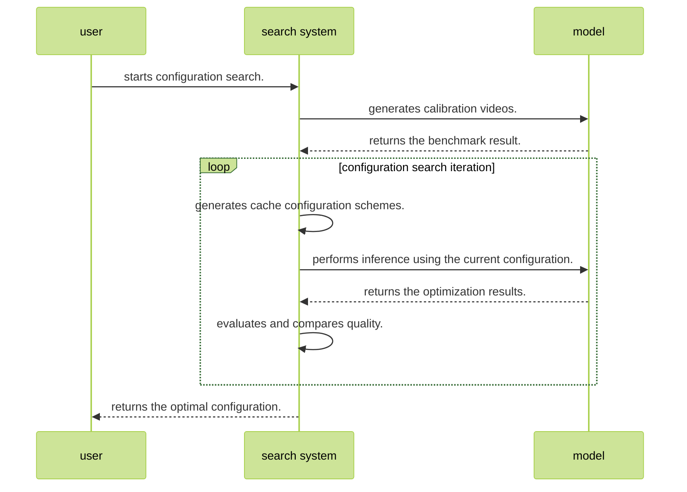
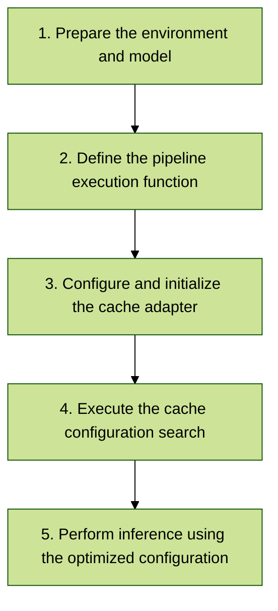

# Inference Optimization for Multimodal Generative Models

## Overview

This tool provides an inference optimization solution for large-scale multimodal generative models, focusing on improving inference efficiency and resource utilization.

## Preparations

## Hardware Platform

- This feature is supported only on the following products.
    - Atlas A2 training products/Atlas 800I A2 inference products/A200I A2 Box heterogeneous components

## Software Dependencies

- Install msModelSlim. For details, see [msModelSlim Installation Guide](../../getting_started/install_guide.md).
- Refer to the README file in the open-source model repository [OpenSoraPlanV1.2](https://github.com/PKU-YuanGroup/Open-Sora-Plan/releases/tag/v1.2.0) to save the model weights to your local directory, and complete the installation of the Python environment dependencies required by the model.

## Environment Setup

```bash
# Install torch_npu and decord
pip install torch_npu==2.1.0.post6
# ref https://github.com/dmlc/decord
git clone --recursive https://github.com/dmlc/decord
cd decord
mkdir build && cd build
cmake .. -DUSE_CUDA=0 -DCMAKE_BUILD_TYPE=Release -DFFMPEG_DIR=/usr/local/ffmpeg
make
cd ../python
PYTHONPATH=$PYTHONPATH:. python3 setup.py install --user

# Install other requirements
cd /path/to/Open-Sora-Plan-1.2.0
pip install -e .[train]
```

## Function

## Supported Models

| Model Name| Framework| Optimization Feature| Description|
|---------|------|----------|------|
| OpenSoraPlanV1.2 | PyTorch | [Adaptive sampling optimization](#adaptive-sampling-optimization), [DiT cache optimization](#dit-cache-optimization)| • [Model source code link](https://github.com/PKU-YuanGroup/Open-Sora-Plan/releases/tag/v1.2.0)<br>• Sampling optimization currently supports only the 29\*480p scenario, achieving 2 times acceleration and an accuracy drop of <1% on VBench.|

## DiT Cache Optimization

The Diffusion Transformer (DiT) cache optimization adapter is used to optimize the inference performance of DiT models by caching intermediate computation results to accelerate inference generation.

## Principle

During the inference process, a DiT model needs to compute the output of the transformer block multiple times. Traditional implementations recompute the output of all blocks at every timestep. In contrast, cache optimization analyzes the foundation model behavior across different timesteps to identify reusable intermediate computation results.

The primary optimization concepts are as follows:

1. **Cache region selection**: Use a search algorithm to locate the transformer block region most suitable for caching.
2. **Timestep optimization**: Determine the effective time range for the cache, and update the cache at critical timesteps.
3. **Incremental computation**: Use cached incremental computation results for non-critical timesteps.
4. **Quality assurance**: Use calibration videos to ensure that the optimized generation results remain consistent with the original baseline quality.

The optimization process is as follows:

1. Generate a set of calibration videos by using the original model to serve as the quality benchmark.
2. Explore different cache configurations by using a search algorithm.
3. Evaluate the differences between the results generated by each cache configuration and the calibration videos.
4. Select the optimal cache configuration that minimizes computation workload while maintaining generation quality.



## Usage Process Overview



## Detailed Operation Steps

For details about the APIs, see [DitCacheSearchConfig](../../python_api_v0/multimodal_inference_apis/DitCache/DitCacheSearchConfig.md) and [DitCacheAdaptor](../../python_api_v0/multimodal_inference_apis/DitCache/DitCacheAdaptor.md).

### 1. Preparing the Environment and Model

Ensure that the environment configuration and the model download are complete:

- Complete the environment setup and save the model weights to your local directory by referring to [Preparations](#preparations).

### 2. Defining the Pipeline Execution Function

You must define a closure function to execute the pipeline and return the generated videos. This function is called by the cache search process to generate baseline calibration videos and evaluate different cache configurations:

```python
def run_pipeline_and_save_videos(pipeline):
    """Execute the pipeline and return the generated video list.

    Args:
        pipeline: model pipeline instance

    Returns:
        List[np.ndarray]: generated video list. The shape of each video is (num_frames, h, w, c).
    """
    positive_prompt = """
    (masterpiece), (best quality), (ultra-detailed),
    {}
    """

    videos = pipeline(
        positive_prompt.format("a dog running on the beach"),
        num_frames=93,
        height=720,
        width=1280,
        num_inference_steps=100,
        guidance_scale=7.5
    ).images

    return videos
```

**⚠️ Important**: When using DitCache, you must call `DitCacheAdaptor.set_timestep_idx()` at the beginning of each timestep in the forward pass of the pipeline. This is typically implemented inside the denoising loop of the model:

```python
# Set the timestep in the denoising loop.
for step_id, t in enumerate(timesteps):
    DitCacheAdaptor.set_timestep_idx(step_id) # Call this method at the beginning of each timestep.
    model_output = pipeline(...)
```

### 3. Configuring and Initializing the Cache Adapter

```python
from msmodelslim.pytorch.multi_modal.dit_cache import DitCacheSearchConfig, DitCacheAdaptor

# Set the cache search configuration.
config = DitCacheSearchConfig(
    cache_ratio=1.3,  # Cache acceleration ratio. Recommended value: 1.3.
    num_sampling_steps=100  # Number of sampling steps.
)

# Create a cache adapter.
cache_adaptor = DitCacheAdaptor(pipeline, config)
```

### 4. Executing the Cache Configuration Search

```python
# Perform the search and obtain the optimal configuration.
searched_config = cache_adaptor.search(
    run_pipeline_and_save_videos=run_pipeline_and_save_videos,
    prompts_num=1  # Number of generated videos.
)
```

A complete search script example is available in [dit_cache_search_t2v_sp.sh](https://gitcode.com/Ascend/msmodelslim/blob/master/example/osp1_2/dit_cache_search_t2v_sp.sh):

```bash
#!/bin/bash
torchrun --nnodes=1 --nproc_per_node 8 --master_port 29503 \
    -m example.osp1_2.search_t2v_sp \
    --model_path /path/to/checkpoint-xxx/model_ema \
    --num_frames 93 \
    --height 720 \
    --width 1280 \
    --num_sampling_steps 100 \
    ...
    --text_prompt examples/prompt_list_0.txt \
    --search_type dit_cache \
    --cache_ratio 1.3 \
    --cache_save_path "./dit_cache_config.json"  # Path for saving the search result.
```

### 5. Using the Optimized Configuration for Inference

#### 5.1 Workflow


#### 5.2 Example

```python
import json
from msmodelslim.pytorch.multi_modal.dit_cache import DitCacheAdaptor, DitCacheSearchConfig

# 1. Load the cache configuration.
with open("./dit_cache_config.json", 'r') as f:
    cache_config = json.load(f)

# 2. Initialize the cache adapter and update the configuration.
adaptor = DitCacheAdaptor(
    pipeline=pipeline,
    config=DitCacheSearchConfig(num_sampling_steps=100)  # Keep it consistent with the number of inference steps.
)
adaptor.update_cache_config(**cache_config)

# 3. Perform inference.
output = pipeline(
    prompt="a dog running on the beach",
    num_frames=93,
    height=720,
    width=1280,
    guidance_scale=7.5,
    num_inference_steps=100
)
```

Explicitly call `DitCacheAdaptor.set_timestep_idx()` in the pipeline.

```python
# Note: In the forward propagation code of the pipeline, call set_timestep_idx at the beginning of each timestep.
# # Example: In the diffusion loop of the pipeline.
for step_id, t in enumerate(timesteps):
    DitCacheAdaptor.set_timestep_idx(step_id) # Set the timestep at the beginning of each timestep.
    # ... Compute the current timestep.

```

Cache configuration file code sample (`dit_cache_config.json`):

```json
{
    "cache_block_start": 8,    # Start position of the cache block
    "cache_num_blocks": 4,     # Number of cache blocks
    "cache_step_start": 20,    # Time step when the cache is used
    "cache_step_interval": 2   # Cache update interval
}
```

#### 5.3 Complete Inference Script

A complete inference script example is available in [dit_cache_sample_t2v_sp.sh](https://gitcode.com/Ascend/msmodelslim/blob/master/example/osp1_2/dit_cache_sample_t2v_sp.sh):

```bash
#!/bin/bash
torchrun --nnodes=1 --nproc_per_node 8 --master_port 29503 \
    -m example.osp1_2.sample_t2v_sp \
    --model_path /path/to/checkpoint-xxx/model_ema \
    --num_frames 93 \
    --height 720 \
    --width 1280 \
    --text_encoder_name google/mt5-xxl \
    --text_prompt examples/prompt_list_0.txt \
    --save_img_path "./sample_video_test" \
    --fps 24 \
    --guidance_scale 7.5 \
    --num_sampling_steps 100 \
    --sample_method EulerAncestralDiscrete \
    --model_type "dit" \
    --dit_cache_config "./dit_cache_config.json"  # Use the cache configuration obtained through search.
```

## Precautions

1. **Timestep configuration requirement**: The `DitCacheAdaptor.set_timestep_idx(step_id)` method must be called at the beginning of each timestep.
2. **Search duration**: The cache configuration search process includes calibration video generation and configuration evaluation, which may take a long time.
3. **Configuration reuse**: The cache configuration obtained through search can be saved as a JSON file and can be reused.
4. **Scenario adaptation**: Different models and scenarios may require different cache configurations. Perform search optimization based on the specific application scenario.
5. **Parameter consistency**: Ensure that the same model parameter configurations, such as the number of sampling steps and image sizes, are used during search and inference.
6. **Acceleration performance**: In the 29\*480p and 93\*720p scenarios, the generation result can be accelerated by about 1.3 times while maintaining the original generation quality.

## Adaptive Sampling Optimization

The sampling optimization adapter is used to search for and optimize the sampling steps of Stable Diffusion models to improve inference efficiency.

## Principle

Stable Diffusion models require multi-step sampling during inference to generate high-quality images or videos. The traditional uniform sampling method may waste computing resources on unimportant timesteps and fail to sample sufficiently on critical timesteps. The goal of sampling optimization is to identify a group of more efficient sampling steps to reduce the computing overhead while maintaining the generation quality.

The primary optimization concepts are as follows:

1. **Step alignment**: Analyze model behavior across different timesteps to identify the critical timesteps that have the greatest impact on generation quality.
2. **Adaptive sampling**: Perform more intensive sampling at critical timesteps while appropriately reducing the sampling frequency at other timesteps.
3. **Quality assurance**: Use calibration videos as references to ensure that the optimized sampling steps generate results with quality equivalent to the original baseline.

The optimization process is as follows:

1. Generate a set of calibration videos by using the original model to serve as the quality benchmark.
2. Explore different combinations of sampling steps using a search algorithm.
3. Evaluate the differences between the results generated by each sampling scheme and the calibration videos.
4. Select the optimal sampling steps that minimize computation workload while maintaining generation quality.

## Procedure

For details about the APIs, see [ReStepAdaptor.md](../../python_api_v0/multimodal_inference_apis/sampling_optimization_apis/ReStepAdaptor.md) and [ReStepSearchConfig.md](../../python_api_v0/multimodal_inference_apis/sampling_optimization_apis/ReStepSearchConfig.md).

### 1. Executing Original Model Inference to Generate Video Search Calibration Baselines

```bash
cd /path/to/Open-Sora-Plan-1.2.0
# Before run, please make sure the model is downloaded and the model path in the script is correct
bash scripts/text_condition/gpu/sample_t2v_sp.sh
```

### 2. Searching for Timesteps

After obtaining the model pipeline object, set the sampling optimization parameters, pass the generated calibration video directory, and call the `ReStepAdaptor` class to execute the `timestep` search. A complete script code sample is available in [search_t2v_sp.sh](https://gitcode.com/Ascend/msmodelslim/blob/master/example/osp1_2/search_t2v_sp.sh):

```python3
# Load pipeline, for example
pipeline: OpenSoraPipeline = load_t2v_checkpoint(model_path)

# Set restep search config
from msmodelslim.pytorch.multi_modal.sampling_optimization import ReStepSearchConfig, ReStepAdaptor
config = ReStepSearchConfig(
    # videos_path is the path to the directory containing the videos generated by original model with original steps
    videos_path='/path/of/your/calibration_videos',
    # save_dir is the path to the directory where the searched and optimized timestep will be saved
    save_dir='/path/to/save/searched_results',
    # set the number of sd infer steps
    num_sampling_steps=50,
)

# Create ReStepAdaptor
restep_adaptor = ReStepAdaptor(pipeline, config)

# Do the scheduler timestep search, will save the searched timestep to the ${save_dir}
scheduler_timestep = restep_adaptor.search()
```

### 3. Performing Inference Using the Timesteps Obtained by Search

Inference command example (for a complete script code sample, see [sample_t2v_sp.sh](https://gitcode.com/Ascend/msmodelslim/blob/master/example/osp1_2/sample_t2v_sp.sh)):

```shell
torchrun --nnodes=1 --nproc_per_node 8  --master_port 29503 \
    -m msmodelslim.pytorch.multi_modal.examples.osp1_2.sample_t2v_sp \
    --model_path /path/to/checkpoint-xxx/model_ema \
    --num_frames 29 \
    --height 480 \
    --width 640 \
    --save_img_path "./sample_video_test" \
    ...
    --num_sampling_steps 50 \
    --sample_method EulerAncestralDiscrete \
    --schedule_timestep "/path/of/schedule/timestep/file.txt"
```

In the preceding command, `--schedule_timestep` indicates the path of the timestep file obtained through search.
You can modify the model parameter path and the optimized timestep file path by referring to [search_t2v_sp.sh](https://gitcode.com/Ascend/msmodelslim/blob/master/example/osp1_2/search_t2v_sp.sh), and then execute inference with sampling optimization.
