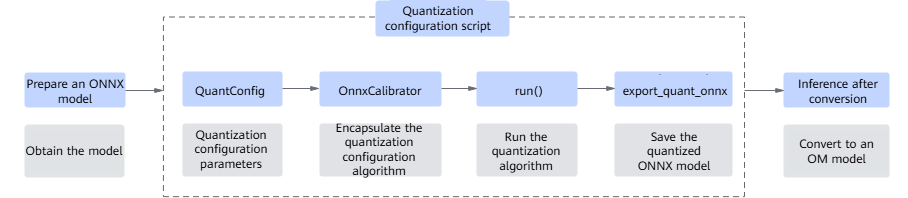
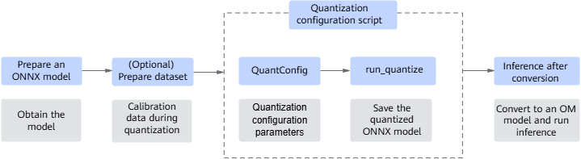

# Traditional Model Quantization and Calibration

This document focuses on traditional model scenarios, including post-training quantization (PTQ) and quantization-aware training (QAT) for PyTorch, ONNX, and MindSpore.

## PTQ (PyTorch)

### Overview

The PTQ tool requires a PyTorch training script or a `.pth` file. The tool automatically identifies and quantizes the convolutional and linear layers (`torch.nn.Linear` and `torch.nn.Conv2d`) inside a model, exporting a quantized ONNX model to run on an inference server to improve inference performance. During quantization, you need to provide a model and dataset, and call APIs to quantize and tune the model.

### Function Description

### Automatic Mixed-Precision Quantization Algorithm

To optimize quantization accuracy, the msModelSlim tool integrates an automatic mixed-precision module for PyTorch PTQ. This module automatically identifies and rolls back quantization-sensitive layers to floating-point calculations, preventing significant accuracy loss. The core of the algorithm is to calculate the mean squared error (MSE) of each quantization layer between its pre-quantized and post-quantized outputs, measure the quantization sensitivity of each quantization layer based on the MSE sequence, and automatically roll back the sensitive layers with the largest MSE to improve quantization accuracy.

### Accuracy Retention Strategies

To further minimize accuracy loss, the msModelSlim tool integrates multiple accuracy retention strategies for PyTorch PTQ to optimize weight quantization parameters and rounding modes.

- Easy Quant weight optimization: optimizes quantization parameters using output similarity to reduce quantization error across input and output tensors. It is recommended for data-free scenarios.
- ADMM weight optimization: uses the Alternating Direction Method of Multipliers (ADMM) to iteratively update and optimize weight quantization parameters. It is recommended for use in label-free scenarios to improve quantization performance.
- Adaptive rounding optimization: optimizes weight rounding using adaptive strategies rather than standard rounding methods to improve quantization accuracy. It is recommended for label-free scenarios to improve quantization performance.

### Example

```python
import torchvision

from msmodelslim.pytorch.quant.ptq_tools import QuantConfig, Calibrator

if __name__ == '__main__':
    MODEL_ARCH = "resnet50"
    SAVE_PATH = "./output"
    INPUTS_NAMES = ["input.1"]

    model = torchvision.models.resnet50(pretrained=True)
    model.eval()

    disable_names = []
    input_shape = [1, 3, 224, 224]
    keep_acc = {'admm': [False, 1000], 'easy_quant': [False, 1000], 'round_opt': False}

    quant_config = QuantConfig(
        disable_names=disable_names,  # Specifies the names of quantization layers designated for manual fallback, formatted as a list of strings. If output accuracy drops significantly, assign fallback status to quantization-sensitive layers, such as classification layers, input layers, or detection head layers.
        amp_num=0,  # Specifies the number of fallback layers during mixed-precision quantization. Type: int. Default: 0.
        input_shape=input_shape,  # Specifies the input shape of the model, used to construct synthetic data during data-free quantization.
        keep_acc=keep_acc, # Specifies the configuration dictionary for accuracy retention strategies.
        sigma=25,  # Enables the sigma statistical method if the value is greater than 0. A value of 0 enables the min-max statistical method.
    )

    calibrator = Calibrator(model, quant_config)

    calibrator.run() # Executes the quantization algorithm.

    calibrator.export_quant_onnx("resnet50", "./output", ["input.1"])  # Exports the deployment-ready quantized ONNX model for Ascend environments.

```

### Multimodal Quantization Scenario

Note
Multimodal quantization capabilities are currently restricted to Atlas 800I A2, 800T A2, and 900 A2 hardware architectures. Currently, quantization supports architectures such as `SD3` and `OpenSora 1.2`.
Code sample for the multimodal quantization scenario:

```python
import torch
from diffusers import StableDiffusion3Pipeline

from ascend_utils.common.security.pytorch import safe_torch_load
from msmodelslim.pytorch.quant.ptq_tools import Calibrator, QuantConfig

pipe = StableDiffusion3Pipeline.from_pretrained(
    "/stable-diffusion-3-medium-diffusers/",
    torch_dtype=torch.float16,
    local_files_only=True
    ).to("npu") # Specifies the model directory path.
pipe.set_progress_bar_config(disable=True)
base = pipe
model = pipe.transformer

calib_dataset = safe_torch_load("sd3_calib_data_v3.pth", map_location="npu")
quant_config = QuantConfig(
    w_bit=8,
    a_bit=8,
    w_signed=True,
    a_signed=True,
    w_sym=True,
    a_sym=False,
    act_quant=True,
    act_method=1,
    quant_mode=1,
    disable_names=None,
    amp_num=0,
    keep_acc=None,
    sigma=25,
    device="npu" # Specifies the device for model execution.
)
calibrator = Calibrator(model, quant_config, calib_dataset)
calibrator.run()
calibrator.export_quant_safetensor("/output_path/")
```

### Method of Obtaining Calibration Data

In the preceding example, the calibration data is `sd3_calib_data_v3.pth`. The workflow to obtain this data is as follows:
Load the `SD3` pre-trained model --> Add a `Listener` class to capture model input parameters --> Configure `calib_prompts` --> Iterate through `calib_prompts` and enter the `Listener` class to execute forward inference (where `num_inference_steps` specifies the number of data entries generated by a single prompt) --> Save the calibration data.

Code sample:

```python
import torch
from diffusers import StableDiffusion3Pipeline
from ascend_utils.common.security import SafeWriteUmask

calib_data = []

class Listener(torch.nn.Module):
    def __init__(self, module):
        super(Listener, self).__init__()
        self.module = module
        self.inputs = []

    def forward(self, *args, **kwargs):
        sample = {}
        for k in kwargs:
            if isinstance(kwargs[k], torch.Tensor):
                sample[k] = kwargs[k].cpu()
            else:
                sample[k] = kwargs[k]
        self.inputs.append(sample)
        return self.module(*args, **kwargs)

pipe = StableDiffusion3Pipeline.from_pretrained(
    "path_to_stable-diffusion-3-medium-diffusers",
    torch_dtype=torch.float16,
    local_files_only=True
    )
pipe.to("npu")  # Set it to pipe.to("cuda") when using GPU.

pipe.transformer = Listener(pipe.transformer)

# Calibration prompts. Configure multiple entries as needed.
calib_prompts = ['a photo of a cat holding a sign that says hello world']

for prompt in calib_prompts:
    image = pipe(
        prompt=prompt,
        negative_prompt="",
        num_inference_steps=28,  # Specifies the number of inference steps. For example, when it is set to 28, each prompt generates 28 calibration data entries.
        height=1024,
        width=1024,
        guidance_scale=7.0,
    ).images[0]

calib_data = pipe.transformer.inputs

with SafeWriteUmask(umask=0o377):
    torch.save(calib_data, "path_to_save/sd3_calib_data.pth")
```

## PTQ (ONNX)

### Overview

The PTQ tool automatically identifies and quantizes convolutional (`Conv`) and matrix multiplication (`Gemm`) operators within an ONNX model, saving the quantized outputs into an `.onnx` file. The resulting quantized model runs on an inference server to improve runtime inference performance. During quantization, you need to provide a model and dataset, and call APIs to quantize and tune the model.

ONNX model quantization supports multiple optimization modes, including label-free and data-free modes. These modes differ based on dataset requirements and how the calibration data is processed during execution. The `squant_ptq` and `post_training_quant` interfaces provided by the msModelSlim tool support both execution modes and can process both static and dynamic shape models.

- Data-Free Mode
    In data-free mode, datasets are not required for quantization calibration. This mode estimates quantization parameters using internal model statistics or alternative data-free estimation heuristics. This mode applies to deployment scenarios where authentic production data is unavailable or restricted. The quantization procedure below demonstrates this workflow using the `squant_ptq` interface.

- Label-Free Mode
    In label-free mode, a small number of datasets are required to calibrate quantization factors in the quantization process. This mode allows the tool to adjust quantization parameters based on actual data distributions, maximizing post-quantization model accuracy. The quantization procedure below demonstrates this workflow using the `post_training_quant` interface.

### Preparations

Install msModelSlim. For details, see [msModelSlim Installation Guide](../../getting_started/install_guide.md).

Note: Currently, the ONNX quantization subsystem does not support `Python 3.12` or later. To use ONNX quantization features, use a `Python` version earlier than `3.12`.

Install the required software dependencies before executing PTQ.

### Function Description

### Data-Free Mode (`squant_ptq`)

This section describes the quantization configuration workflows for static shape, dynamic shape, and graph optimization scenarios. It guides you in calling the Python APIs to execute data-free model identification and quantization, saving the optimized output into an `.onnx` file for inference server deployment.

Implementation Process
Prepare the target ONNX model and call the `squant_ptq` interface to generate a quantization configuration script. Running this script outputs the quantized `.onnx` model, which you can then convert for downstream inference.

Figure 1 Functional implementation process of the squant_ptq interface



The key steps are as follows:

Prepare the original ONNX model and use `QuantConfig` to configure the quantization parameters based on your targeted deployment scenario:

Static or dynamic shape model quantization: Configure parameters and accuracy retention strategies based on your quantization requirements. In dynamic shape scenarios, manually enable the `is_dynamic_shape` parameter and configure the `input_shape` attribute.

Graph optimization: For static shape models, the tool provides built-in structural optimization methodologies to optimize both floating-point and post-quantization graphs. Use the `graph_optimize_level` parameter to enable and specify the optimization level, and use the `shut_down_structures` parameter to explicitly exclude specific subgraphs from optimization.
 Graph optimization requires converting the ONNX model into an OM model. You can specify the conversion tool by using the `om_method` parameter.

Encapsulate the quantization algorithm by initializing `OnnxCalibrator` with the target ONNX model and configure corresponding accuracy retention strategies.

Execute the quantization process by calling the `run()` function after initializing `OnnxCalibrator`.

Call `export_quant_onnx` to save the quantized model.

Perform model conversion.

Use a conversion tool such as Ascend Tensor Compiler (ATC) to convert the `.onnx` model into a deployable `.om` file for inference. For details, see the *ATC User Guide*.

If you run the following commands as a non-root user, add `--user` to the end of each installation command, such as `pip3 install onnx --user`.

```bash
pip3 install numpy              # The version must be 1.21.6 or later for Python 3.7.5 through 3.8; or 1.23.0 or later for Python 3.8 or later.
pip3 install onnx               # Some versions have security vulnerabilities. You are advised to use version 1.16.2 or later.
pip3 install onnxruntime        # The version must be 1.14.1 or later.
pip3 install torch==2.1.0       # Version 2.1.0 (CPU version) is supported.
pip3 install onnx-simplifier    # The version must be 0.3.10 or later.
```

Static Shape Model Quantization Steps (ResNet-50)

Prepare a model for quantization. This section uses ResNet-50 as an example. Export the ONNX file by referring to section "Model Inference" in [README](https://gitcode.com/Ascend/ModelZoo-PyTorch/blob/master/ACL_PyTorch/built-in/cv/Resnet50_Pytorch_Infer/README.md#section741711594517).

Create a quantization script named `resnet50_quant.py` and insert the following code sample into the file:

```python
from msmodelslim.onnx.squant_ptq import OnnxCalibrator, QuantConfig  # Import the squant_ptq quantization interface.
from msmodelslim import set_logger_level  # Optional. Import the log configuration interface.
set_logger_level("info")  # Optional. Set log output level. An info level displays tuning log details on screen at runtime.

config = QuantConfig()   # Initialize QuantConfig with quantization parameters to return a quantization configuration instance. This example uses the default configuration.
input_model_path = "./resnet50_official.onnx"  # Configure the input path of the model to be quantized. Change it as required.
output_model_path = "./resnet50_official_quant.onnx"  # Configure the name and output path of the quantized model. Change it as required.
calib = OnnxCalibrator(input_model_path, config)   # Initialize OnnxCalibrator with the target model path and configuration data to generate a calibration instance. The calib_data parameter is optional. To pass real data inputs, see strategy 3 under Accuracy Retention Strategies.
calib.run()   # Perform quantization.
calib.export_quant_onnx(output_model_path)  # Export the quantized model.
```

Start the model quantization and tuning task and save the quantized model in the specified output directory.

```bash
python3 resnet50_quant.py
```

To convert the quantized ONNX model into an OM model and perform accuracy verification, see section "Model Inference" in [README](https://gitcode.com/Ascend/ModelZoo-PyTorch/blob/master/ACL_PyTorch/built-in/cv/Resnet50_Pytorch_Infer/README.md#%E6%A8%A1%E5%9E%8B%E6%8E%A8%E7%90%86). If the accuracy loss exceeds expectations, implement the accuracy retention strategies to reduce accuracy degradation.

Dynamic Shape Model Quantization Steps (YOLOv5m)

Prepare a model for quantization. This section uses YOLOv5m as an example. Obtain the weight file of the version 6.1 YOLOv5m model by referring to section "Model Inference" in [README](https://gitcode.com/Ascend/ModelZoo-PyTorch/blob/master/ACL_PyTorch/built-in/cv/Resnet50_Pytorch_Infer/README.md#%E6%A8%A1%E5%9E%8B%E6%8E%A8%E7%90%86). Set the inference mode to `nms_script` and run the following command to export the dynamic shape ONNX file:

```bash
bash pth2onnx.sh --tag 6.1 --model yolov5m --nms_mode nms_script
```

Create a quantization script named `yolov5m_quant.py` and insert the following code sample into the file:

```python
from msmodelslim.onnx.squant_ptq import OnnxCalibrator, QuantConfig  # Import the squant_ptq quantization interface.
from msmodelslim import set_logger_level  # Optional. Import the log configuration interface.
set_logger_level("info")  # Optional. Set log output level. An info level displays tuning log details on screen at runtime.

config = QuantConfig(is_dynamic_shape = True, input_shape = [[1,3,640,640]])  # Initialize QuantConfig with quantization parameters to return a configuration instance. The is_dynamic_shape and input_shape parameters are required for dynamic shapes. Retain default values for other parameters.
input_model_path = "./yolov5m.onnx"  # Configure the input path of the model to be quantized. Change it as needed.
output_model_path = "./yolov5m_quant.onnx"  # Configure the name and output path of the quantized model. Change it as needed.
calib = OnnxCalibrator(input_model_path, config)   # Initialize OnnxCalibrator with the target model path and configuration data to generate a calibration instance. The calib_data parameter is optional. To pass real data inputs, see strategy 3 under Accuracy Retention Strategies.
calib.run()   # Perform quantization.
calib.export_quant_onnx(output_model_path)  # Export the quantized model.
```

Start the model quantization and tuning task and save the quantized model in the specified output directory.

```bash
python3 yolov5m_quant.py
```

To convert the quantized ONNX model into an OM model and perform accuracy verification, see section "Model Inference" in [README](https://gitcode.com/Ascend/ModelZoo-PyTorch/blob/master/ACL_PyTorch/built-in/cv/Resnet50_Pytorch_Infer/README.md#%E6%A8%A1%E5%9E%8B%E6%8E%A8%E7%90%86). If the accuracy loss exceeds expectations, implement the accuracy retention strategies to reduce accuracy degradation.

Accuracy Retention Strategies

To further minimize quantization accuracy loss, the msModelSlim tool integrates several accuracy retention strategies in Data-Free mode.

Strategy 1 (recommended): If the post-quantization accuracy does not meet expectations, implement accuracy retention strategies to recover accuracy. The tool integrates multiple accuracy retention strategies to optimize weight quantization parameters and rounding modes. You can configure these strategies in the `keep_acc` parameter. Setting the `sigma` parameter to `0` enables activation min-max quantization. When `sigma` is set to `0`, do not use `keep_acc` accuracy retention strategies. The following code block shows a configuration example for `keep_acc`:

```python
config = QuantConfig(quant_mode=0,
                     keep_acc={'admm': [False, 1000], 'easy_quant': [True, 1000], 'round_opt': False}
)
```

Strategy 2: To ensure output accuracy, do not quantize the classification and input layers of the model. Exclude these layers by passing the classification layer and input layer names to the `disable_names` parameter.

Strategy 3: If model accuracy after Data-Free quantization with synthetic data does not meet expectations, you can use real data for quantization instead. For example, an image or a text sample from another dataset can be used as real input data. Since real data has a better data distribution, it can improve model accuracy. The following example shows how to preprocess a real image and pass it as `calib_data` during quantization.

```python
def get_calib_data():
    import cv2
    import numpy as np

    img = cv2.imread('/xxx/cat.jpg')
    img_data = cv2.resize(img, (224, 224))
    img_data = img_data[:, :, ::-1].transpose(2, 0, 1).astype(np.float32)
    img_data /= 255.
    img_data = np.expand_dims(img_data, axis=0)
    return [[img_data]]
```

### Label-Free Mode (`post_training_quant`)

This section describes the quantization configuration workflows for static shape and dynamic shape scenarios. ResNet-50 is used as an example of a static shape model, and YOLOv5m is used as an example of a dynamic shape model. It guides you in calling the Python APIs to execute label-free model identification and quantization, saving the optimized output into an `.onnx` file for inference server deployment.

The code samples in this section call the `post_training_quant` interface to configure Label-Free quantization. To customize accuracy retention strategies, use the `squant_ptq` interface to perform Label-Free quantization instead. Perform the configuration steps in [Data-Free Mode (`squant_ptq`)](#data-free-mode-squant_ptq) and modify the `quant_mode` and `calib_data` parameters.

Prerequisites
The development environment has been set up by referring to [msModelSlim Installation Guide](../../getting_started/install_guide.md).
The required software dependencies have been installed before executing PTQ.
If you run the following commands as a non-root user, add `--user` to the end of each installation command, such as `pip3 install onnx --user`.

```bash
pip3 install onnx==1.13.0
pip3 install onnxruntime==1.14.1
```

Implementation Process
Prepare the target ONNX model and dataset, then call the `post_training_quant` interface to generate a quantization configuration script. Running this script outputs the quantized `.onnx` model. You can convert this model for inference.

The key steps are as follows:

Figure 2 Functional implementation process of the post_training_quant interface



Prepare the original ONNX model and dataset. Use `QuantConfig` to customize the quantization parameters for your static shape or dynamic shape deployment scenario. To input calibration data, refer to the configuration details described in the data preprocessing section.

Call `run_quantize` to save the quantized model.

Perform model conversion.

Use a conversion tool such as Ascend Tensor Compiler (ATC) to convert the `.onnx` model into a deployable `.om` file for inference. For details, see the *ATC User Guide*.

Static Shape Model Quantization Steps (ResNet-50)

This section uses ResNet-50 as an example. Obtain the ImageNet dataset by referring to section "Dataset Preparation" in [README](https://gitcode.com/Ascend/ModelZoo-PyTorch/blob/master/ACL_PyTorch/built-in/cv/Resnet50_Pytorch_Infer/README.md#%E5%87%86%E5%A4%87%E6%95%B0%E6%8D%AE%E9%9B%86). No preprocessing is required. Then, export the ONNX file by referring to section "Model Inference".

Create a quantization script named `resnet50_quant.py` and insert the following code sample into the file:

```python
from msmodelslim.onnx.post_training_quant import QuantConfig, run_quantize  # Import the post_training_quant quantization interface.
from msmodelslim.onnx.post_training_quant.label_free.preprocess_func import preprocess_func_imagenet  # Import the built-in ImageNet dataset preprocessing function preprocess_func_imagenet.
from msmodelslim import set_logger_level  # Optional. Import the log configuration interface.
set_logger_level("info")  # Optional. Set log output level. An info level displays tuning log details on screen at runtime.

# prepare a small calibration dataset, read the dataset, preprocess it, and store the output in calib_data.
def custom_read_data():
    calib_data = preprocess_func_imagenet("./data_path/") # Initialize the dataset preprocessing function with the actual dataset path. If you do not use this function, refer to the data preprocessing section.
    return calib_data
calib_data = custom_read_data()

quant_config = QuantConfig(calib_data = calib_data, amp_num = 5) # Initialize QuantConfig with quantization parameters to return a configuration instance.

input_model_path = "./resnet50_official.onnx"  # Configure the input path of the model to be quantized. Change it as required.
output_model_path = "./resnet50_official_quant.onnx"  # Configure the name and output path of the quantized model. Change it as required.

run_quantize(input_model_path,output_model_path,quant_config)  # Use run_quantize to execute quantization using the input and output model paths.
```

Start the model quantization and tuning task and save the quantized model in the specified output directory.

python3 resnet50_quant.py

To convert the quantized ONNX model into an OM model and perform accuracy verification, see section "Model Inference" in [README](https://gitcode.com/Ascend/ModelZoo-PyTorch/blob/master/ACL_PyTorch/built-in/cv/Resnet50_Pytorch_Infer/README.md#%E6%A8%A1%E5%9E%8B%E6%8E%A8%E7%90%86).

Dynamic Shape Model Quantization Steps (YOLOv5m)

This example uses YOLOv5m as an example. Export the dynamic shape ONNX file by referring to "Model Inference" in [README](https://gitcode.com/Ascend/ModelZoo-PyTorch/blob/master/ACL_PyTorch/built-in/cv/Resnet50_Pytorch_Infer/README.md#%E6%A8%A1%E5%9E%8B%E6%8E%A8%E7%90%86).

Create a quantization script named `yolov5m_quant.py` and insert the following code sample into the file:

```python
from msmodelslim.onnx.post_training_quant import QuantConfig, run_quantize  # Import the post_training_quant quantization interface.
from msmodelslim import set_logger_level  # Optional. Import the log configuration interface.
set_logger_level("info")  # Optional. Set log output level. An info level displays tuning log details on screen at runtime.

# prepare a small calibration dataset, read the dataset, preprocess it, and store the output in calib_data. If left empty, calibration data will be randomly generated.
def custom_read_data():
    calib_data = []
    # Read the dataset, preprocesse the data, and save the data to calib_data.
    return calib_data
calib_data = custom_read_data()

quant_config = QuantConfig(calib_data = calib_data, amp_num = 5, is_dynamic_shape = True, input_shape = [[1,3,640,640]])  # Initialize QuantConfig with quantization parameters to return a configuration instance. The is_dynamic_shape and input_shape parameters are required for dynamic shapes.

input_model_path = "./yolov5m.onnx"  # Configure the input path of the model to be quantized. Change it as needed.
output_model_path = "./yolov5m_quant.onnx"  # Configure the name and output path of the quantized model. Change it as needed.

run_quantize(input_model_path,output_model_path,quant_config)  # Use run_quantize to execute quantization using the input and output model paths.
```

Start the model quantization and tuning task and save the quantized model in the specified output directory.

```bash
python3 yolov5m_quant.py
```

To convert the quantized ONNX model into an OM model and perform accuracy verification, see section "Model Inference" in [README](https://gitcode.com/Ascend/ModelZoo-PyTorch/blob/master/ACL_PyTorch/built-in/cv/Resnet50_Pytorch_Infer/README.md#%E6%A8%A1%E5%9E%8B%E6%8E%A8%E7%90%86).

Data Preprocessing

When calling the `post_training_quant` interface to configure Label-Free quantization, you must prepare a small calibration dataset, load it for data preprocessing, and return the preprocessed calibration data for quantization. Currently, two methods are supported: using the dataset preprocessing functions preconfigured in the msModelSlim tool or preparing the calibration data by yourself.

Method 1: Use the `preprocess_func_imagenet` and `preprocess_func_coco` functions preconfigured in msModelSlim to preprocess ImageNet and COCO datasets. See the corresponding API calling examples for configuration details.

Method 2: Prepare a calibration dataset and return the calibration data for quantization configuration. For details about configuration requirements, see the `calib_data` parameter of `QuantConfig`. The following example shows how to configure the input of a single image:

```python
import cv2
import numpy as np
import torch
import torch_npu   # To perform quantization on the CPU, skip this step.
...

calib_data = []
    image = cv2.imdecode(np.fromfile("./random_image.jpg", dtype=np.uint8), 1)  # Set it to the actual dataset path.
    image = cv2.resize(image, (640, 640), interpolation=cv2.INTER_CUBIC)
    image = cv2.cvtColor(image, cv2.COLOR_BGR2RGB)
    image = torch.from_numpy(image).permute(2, 0, 1) / 255
    image = image.unsqueeze(0)
    calib_data.append([np.array(image)])
```

### Verified Models

Currently, PTQ is supported for models including but not limited to those listed in Table 1 and Table 2.

[Table 1 Verified models (Atlas A2 training products/Atlas 800I A2 inference products/A200I A2 Box heterogeneous components or Atlas inference products)](onnx/onnx_verification_table_1.xlsx)

[Table 2 Verified models (Atlas 200/500 A2 inference products)](onnx/onnx_verification_table_2.xlsx)

## PTQ (MindSpore)

### Overview

During the PTQ process, you need to provide a trained weight file and a small calibration dataset to calibrate quantization factors, and call the corresponding interfaces for model tuning. Currently, quantization and tuning for models under the MindSpore framework are supported. During model quantization, you can manually configure parameters and use some data to calibrate the model, thereby obtaining a quantized model.

### Preparations

Install msModelSlim. For details, see [msModelSlim Installation Guide](../../getting_started/install_guide.md).

### Function Description

1. Prepare a pre-trained model and a dataset. This code sample uses the ResNet-50 model as an example. Obtain the model structure definition script, and download the required dataset by referring to [README](https://gitee.com/mindspore/models/blob/master/official/cv/ResNet/README_CN.md). The CIFAR-10 dataset is used as an example. Configure `data_path` and `checkpoint_file_path` in `config/resnet50_cifar10_config.yaml`, and modify the script based on `eval.py`.

2. Create a model quantization script named `resnet50_quant.py`, copy the content of `eval.py` into this file, and delete the code related to loss definition, metric definition, and metric calculation in the `eval_net()` function. Retain the following code related to model initialization and weight loading.

    Modify the following configuration items as needed:

    - `config.data_path`: dataset path
    - `config.batch_size`: batch size
    - `config.eval_image_size`: evaluation image size
    - `config.class_num`: number of classes
    - `config.checkpoint_file_path`: path to the pre-trained weight file.

    ```python
    target = config.device_target
    # init context
    ms.set_context(mode=ms.GRAPH_MODE, device_target=target, save_graphs=False)
    if target == "Ascend":
        device_id = int(os.getenv('DEVICE_ID'))
        ms.set_context(device_id=device_id)
    # create dataset
    dataset = create_dataset(dataset_path=config.data_path, do_train=False, batch_size=config.batch_size,
                                eval_image_size=config.eval_image_size,
                                target=target)
    # define net
    model = resnet(class_num=config.class_num)
    # load checkpoint
    param_dict = ms.load_checkpoint(config.checkpoint_file_path)
    ms.load_param_into_net(model, param_dict)
    model.set_train(False)
    ```

3. Import the quantization interface into `resnet50_quant.py`.

    ```python
    from msmodelslim.mindspore.quant.ptq_quant.quantize_model import quantize_model
    from msmodelslim.mindspore.quant.ptq_quant.create_config import create_quant_config
    from msmodelslim.mindspore.quant.ptq_quant.save_model import save_model
    ```

4. (Optional) Adjust the log output level. After the tuning task starts, the quantization tuning log information will be printed and displayed.

    ```python
    import logging
    logging.getLogger().setLevel(logging.INFO)    # Configure as needed.
    ```

5. Prepare a pre-trained model.
The current script already contains the code for loading the pre-trained model, so you can skip this step. For other models, configure their scripts as follows:

    ```python
    model = get_user_network() # Load the model structure and return the model instance.
    load_checkpoint(ckpt_file_path, model)    # Load pre-trained model parameters. Configure as needed.
    ```

6. Use the `create_quant_config` interface to generate a configuration file.

    ```python
    config_file = "./quant_config.json"    # Storage path and name of the quantization configuration file to be generated. Configure as needed.
    create_quant_config(config_file, model)
    ```

7. Use the `quantize_model` interface to modify the original model and insert quantization operators. The shape of `input_data` here must match the shape of the input of the pre-trained model.

    ```python
    import mindspore as ms
    from mindspore import dtype as mstype
    input_data = ms.Tensor(np.random.uniform(size=[256, 3, 224, 224]), dtype=mstype.float32)    # Configure as needed.
    model_calibrate = quantize_model(config_file, model, input_data)    # Quantized model generated by calling the quantize_model interface.
    ```

8. Calibrate the quantized model. During the calibration process, forward propagation is performed using a small dataset to calibrate parameters within the quantization operators, thereby improving the accuracy after quantization.

    ```python
    for i, data in enumerate(dataset.create_dict_iterator(num_epochs=1)):
        model(data['image'])
        if i >= 2:
            break
    ```

9. Use the `save_model` interface to save the quantized model.

    ```python
    file_name = "./quantized_model"    # Specify the storage path and filename for the quantized model.
    save_model(file_name, model_calibrate, input_data, file_format="AIR")    # Configure the format of the quantized model as needed.
    ```

10. Start the model quantization and tuning task, and obtain a completely quantized model in the directory specified in step 9.

    ```bash
    python3 resnet50_quant.py
    ```

## QAT

### Overview

QAT retrains a quantized model to reduce its size and accelerate inference. Currently, quantizing CNN models under the PyTorch framework and saving the quantized model as a `.onnx` file are supported. During quantization, you must provide the model and dataset, and call the corresponding interfaces to tune the model.

### Preparations

Install msModelSlim. For details, see [msModelSlim Installation Guide](../../getting_started/install_guide.md).
Before performing QAT, install the related dependencies.
If you run the following commands as a non-root user, add `--user` to the end of each installation command, such as `pip3 install onnx --user`.

### Function Description

### Procedure

1. Prepare the model, training script, and dataset. This section uses the ResNet-50 model and ImageNet dataset under the PyTorch framework as an example.

2. Edit the training script `pytorch_resnet50_apex.py` and import the following interfaces.

3. Call the `qsin_qat` interface before the optimizer initializes to replace the model with the output model of `qsin_qat`. For details, see the `QatConfig` and `qsin_qat` documentation. In the training code, remember to save the fake-quantized model weight file in `.ckpt` format, which is required when exporting the quantized ONNX model.

    ```python
    quant_config = QatConfig(grad_scale=0.001)
    quant_logger = get_logger()
    model = qsin_qat(model, quant_config, quant_logger).to(model.device)     # Configure the model instance to be quantized, quantization configuration, and quantization output logs as needed. Ensure the model is deployed on the NPU following the original training workflow.
    ```

4. Call the original training workflow to perform single-device training. Run `train_full_1p.sh` to start the single-device training task.

    ```bash
    bash ./test/train_full_1p.sh --data_path=/datasets/imagenet  # Set the dataset path as needed.
    ```

5. Export the quantized ONNX model. After saving the fake-quantized model weight file in `.ckpt` format, create a `quant_deploy.py` file and add the following code to call the `save_qsin_qat_model` interface. For configuration details, see the `save_qsin_qat_model` documentation.

    ```python
    import argparse
    import os
    import torch
    from ascend_utils.common.security.pytorch import safe_torch_load
    import models.image_classification.resnet as nvmodels

    # Initialize the model.
    parser = argparse.ArgumentParser(description='PyTorch ImageNet Training')
    parser.add_argument('-b', '--batch-size', default=1, type=int,
                        metavar='N',
                        help='onnx bs')
    parser.add_argument('--pretrained', default="./org_model_best.pth.tar", type=str,
                        help='use pre-trained model')
    parser.add_argument('--quant_ckpt', default="./checkpoint_77.244_asym.pth.tar", type=str,
                        help='use pre-trained model')

    args = parser.parse_args()

    model = nvmodels.build_resnet("resnet50", "classic", is_training=False)
    pretrained_dict = safe_torch_load(args.pretrained, map_location='cpu')["state_dict"]
    model.load_state_dict(pretrained_dict, strict=False)
    #Save the quantized ONNX model.
    from msmodelslim.pytorch.quant.qat_tools import save_qsin_qat_model
    #Configure the name of the output model file (in .onnx format), input shape, fake-quantization model weight, and ONNX input name as needed.
    save_onnx_name='./resnet50.onnx'
    dummy_input = torch.ones([args.batch_size, 3, 224, 224]).type(torch.float32)
    saved_ckpt = args.quant_ckpt
    input_names=['input1']
    save_qsin_qat_model(model, save_onnx_name, dummy_input, saved_ckpt, input_names)
    ```

6. Run the quantization script to obtain the quantized ONNX model.

    ```bash
    python3 quant_deploy.py
    ```
