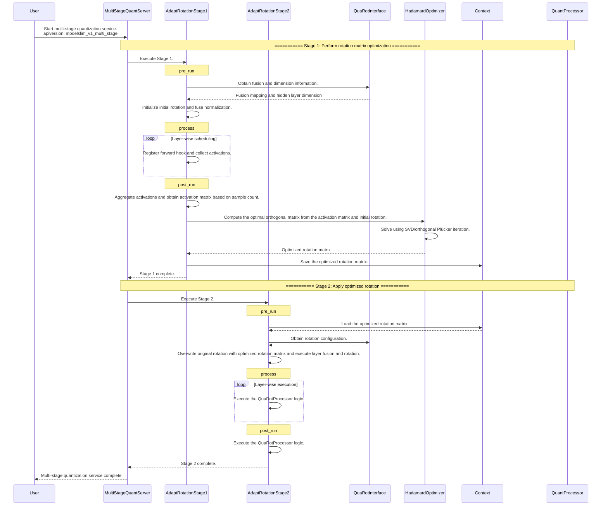

# Adapt Rotation: Adaptive Rotation Optimization Algorithm

## Overview

- **Description**: Adapt Rotation (adaptive rotation optimization) is an outlier suppression algorithm designed for large language model quantization. It builds upon QuaRot to further optimize the rotation matrix. Driven by calibration data, this algorithm iteratively optimizes the Hadamard rotation matrix to reduce reconstruction errors of transformed activation values during quantization. This mechanism effectively suppresses activation outliers and improves low-bit quantization accuracy.
- **Core idea**: Building upon a fixed Hadamard matrix, the algorithm solves for the orthogonal polar factor through Newton-Schulz iteration to learn an optimizable orthogonal matrix. This minimizes the reconstruction error after quantization and dequantization on the given activation data.
- **Relationship with QuaRot**: Adapt Rotation can be used only when the model is adapted to the `AdaptRotationInterface` (which inherits from `QuaRotInterface` and provides `get_hidden_dim()`). Stage 1 optimizes the rotation matrix based on calibration data, and Stage 2 applies the optimized matrix to QuaRot to replace the default Hadamard matrix.

## Preparations

Install msModelSlim. For details, see [msModelSlim Installation Guide](../../getting_started/install_guide.md).

## Principle and Implementation

### Principle

1. **Core Concepts**
   - Given an initial Hadamard matrix `H` and calibration activation data, the algorithm learns an orthogonal rotation matrix `R` through iterative optimization.
   - The transformed rotation matrix is formulated as `H_adapted = H @ R`, which satisfies orthogonality to maintain mathematical equivalence.
   - Optimization objective: Minimize the reconstruction loss of the transformed activation values after per-token symmetric quantization and dequantization.

2. **Iterative Hadamard Optimization**
   - The orthogonal polar factor of `A.T @ B` is solved through Newton-Schulz iteration to obtain the orthogonal matrix `R_step`.
   - Cumulative rotation: `R_acc = R_acc @ R_step`.
   - During each step, the tool performs a rotation transformation on the activations, executes per-token quantization and dequantization on the transformed result, and calculates the normalized reconstruction error.

3. **Two-Stage Process**
   - **Stage 1**: Collect activations from a specified layer (such as `up_proj`), execute Hadamard optimization to obtain the optimized rotation matrix, and save the matrix to the context mechanism.
   - **Stage 2**: Load the optimized rotation matrix from the context mechanism, overwrite the rotation matrix of the corresponding dimension in QuaRot, and perform the same layer fusion and rotation insertion workflows as QuaRot.

### Implementation

#### Code Implementation

The algorithm is implemented in the [`msmodelslim/processor/adapt_rotation/`](../../../../msmodelslim/processor/adapt_rotation) directory. The core classes include:

- `AdaptRotationProcessor`: Top-level processor that dispatches tasks to Stage 1 or Stage 2 based on the current `stage` configuration.
- `AdaptRotationStage1Processor`: Stage 1 processor that collects activations and optimizes the rotation matrix.
- `AdaptRotationStage2Processor`: Stage 2 processor that inherits from `QuaRotProcessor` and uses the rotation matrix optimized in Stage 1 to overwrite the original rotation matrix.
- `HadamardOptimizer`: Optimizer that iteratively refines the Hadamard rotation to obtain the orthogonal polar factor.

#### Processing Sequence



#### Stage 1 Processing Flow

Stage 1 runs during the prior phase. The overall processing flow is as follows:

- **Prepare and fuse**: The tool obtains the LayerNorm and Linear fusion mapping from the adapter, creates the initial Hadamard rotation matrix, and performs LayerNorm and Linear fusion.
- **Collect activations**: The tool registers a forward hook for each Linear layer that matches the specified `layer_type`. It collects activation data from the calibration data when the runner schedules forward propagation.
- **Optimise and transfer**: The tool aggregates the activations of each layer, samples them based on `max_samples`, and runs Hadamard optimization to obtain the optimized rotation matrix. It then saves the result to the context for Stage 2.

#### Stage 2 Processing Flow

Stage 2 runs during the main phase and shares the same layer fusion and rotation processes as QuaRot.

- **Load and overwrite**: The tool loads the optimized rotation matrix obtained in Stage 1 from the context. It overwrites the rotation matrix of the corresponding dimension in QuaRot, replacing the default Hadamard matrix.
- **Perform rotation**: The tool performs layer fusion and rotation layer by layer according to the QuaRot `preprocess` and `post_run` workflows to complete the model rotation matrix insertion.

## Application Requirements

- **Model architecture**: The model must support the `AdaptRotationInterface` (which inherits from `QuaRotInterface` and implements `get_hidden_dim()`).
- **Multi-stage configuration**: When configuring the algorithm, note that Stage 1 typically runs during the prior phase, while Stage 2 typically executes alongside the quantization processor during the main phase.
- **Context**: Stage 1 must run under `ContextManager` to pass the `adapted_matrix` to Stage 2.
- **Quantization configuration**: The activation data type specified by `quant_dtype` must match the activation type used in downstream quantization (such as `linear_quant` or `autoround_quant`). For example, use `int4` for a W4A4 configuration and `int8` for a W8A8 configuration.

## Function

### YAML Configuration Example

When using this algorithm as a processor, you must configure `type: "adapt_rotation"` and either `stage: 1` or `stage: 2`. The parameters vary depending on the stage. Place the Stage 1 configuration within the process list of `spec.prior` and configure its corresponding dataset. Place the Stage 2 configuration within the main pipeline list of `spec.process`. The following is a YAML configuration example:

**Multi-stage example (prior + main stage)**

```yaml
apiversion: modelslim_v1

default_w4a4_dynamic: &default_w4a4_dynamic
  weight:
    scope: "per_group"
    dtype: "int4"
    symmetric: True
    method: "autoround"
    ext:
      group_size: 256
      scale_dtype: "bfloat16"
  act:
    scope: "per_token"
    dtype: "int4"
    symmetric: True
    method: "minmax"

spec:
  prior:
    - process:
        - type: "adapt_rotation"
          stage: 1
          layer_type: ["up_proj"] # Select linear layers based on model requirements, and consider the impact of rotation.
          steps: 20
          quant_dtype: "int4"
          block_size: -1
          max_samples: 2048
      dataset: boolq.jsonl

  process:
    - type: "adapt_rotation"
      stage: 2
      online: False
      block_size: -1
      max_tp_size: 1

    - type: "autoround_quant"
      iters: 400
      enable_round_tuning: true
      strategies:
        - qconfig: *default_w4a4_dynamic
          include:
            - "*.up_proj"
            - "*.gate_proj"

  save:
    - type: "ascendv1_saver"
      part_file_size: 4

  dataset: mix_calib.jsonl
```

### YAML Configuration Fields

#### Stage1 Fields

| Field| Purpose| Type| Description| Default Value|
|--------|------|------|------|--------|
| type | Specifies the processor type identifier.| `string` | The value is fixed to `"adapt_rotation"`.| - |
| stage | Specifies the processor stage identifier.| `int` | The value is fixed to `1`.| - |
| steps | Specifies the number of iterative optimization steps.| `int` | The value is the maximum number of iterations for Hadamard optimization.| `20` |
| quant_dtype | Specifies the quantization activation type.| `string` | The value is `"int4"` or `"int8"`, and must match the `act.dtype` specified in downstream quantization configurations.| `"int4"` |
| layer_type | Specifies the substring of the name of the activation layer.| `array[string]` | The value is used to match the name of the linear layer, such as `["up_proj"]`.| `["up_proj"]` |
| block_size | Specifies the rotation matrix block size.| `int` | The value is a positive power of 2, or `-1`. If the value is set to `-1`, the full `hidden_dim` is used without blocking.| `-1` |
| max_samples | Specifies the maximum number of samples per layer.| `int` | The value controls the number of activation samples collected.| `2048` |

#### Stage2 Fields

| Field| Purpose| Type| Description| Default Value|
|--------|------|------|------|--------|
| type | Specifies the processor type identifier.| `string` | The value is fixed to `"adapt_rotation"`.| - |
| stage | Specifies the processor stage identifier.| `int` | The value is fixed to `2`.| - |
| online | Specifies whether to enable online rotation.| `bool` | `True` injects rotation computation during the quantization process.| `False` |
| block_size | Specifies the rotation matrix block size.| `int` | The value is a positive power of 2, or `-1`. If the value is set to `-1`, the full `hidden_dim` is used without blocking.| `-1` |
| down_proj_online_layers | Specifies the indices of the down layers where online rotation is applied.| `array[int]` | This field takes effect only when `online=True`.| `[]` |
| max_tp_size | Specifies the maximum tensor parallelism size.| `int` | This field takes effect only when `online=True`. It is used to construct the block parameters related to parallelism for online rotation. The value must be `1` or a positive power of 2.| `4` |

## Model Adaptation

Model adaptation requirements for Adapt Rotation are as follows:

- `AdaptRotationInterface`: This interface must be implemented. It inherits from `QuaRotInterface` and implements the `get_hidden_dim()` method. During Stage 1, the tool generates and optimizes a rotation matrix matching the `hidden_dim` dimension, then saves the result to `ctx["adapt_rotation"].state["adapted_matrix"]`. During Stage 2, the tool reuses the standard QuaRot fusion and rotation workflows, utilizing the optimized matrix to overwrite the default rotation matrix for the corresponding dimension.
- `LAOSOnlineRotationInterface`: This interface must be implemented only when `online: True` is configured for Stage 2.

For details about the general adaptation steps related to `QuaRotInterface`, see [QuaRot Model Adaptation](quarot.md#model-adaptation).

## FAQ

### Empty Activation Dictionary in Stage 1

**Symptom**: `act_dict is empty`. No activation is collected in AdaptRotation Stage 1.

**Solution**: Check whether `layer_type` matches the actual Linear layer names in the model, such as `up_proj` or `gate_proj`.

### Empty Context

**Symptom**: `adapted_matrix` cannot be retrieved in Stage 2, and the log shows `context is None` or `no adapted_matrix in context`.

**Solution**: Verify that Stage 1 executes during the prior phase and that `ContextManager` is properly configured. Stage 1 and Stage 2 must run sequentially within the exact same quantization pipeline.

### Inconsistent `quant_dtype` Configuration

**Symptom**: The quantization data type used for rotation optimization mismatches the data type in the downstream quantization phase, causing accuracy loss.

**Solution**: Set the `quant_dtype` parameter in Stage 1 to match the downstream `qconfig.act.dtype` configuration. For example, use `int4` for W4A4 and `int8` for W8A8.

### Slow Execution on MoE Models

**Symptom**: Running this processor on a model with a Mixture-of-Experts (MoE) architecture significantly reduces execution speed. The time required for Stage 1 activation collection and Hadamard optimization increases drastically.

**Solution**: MoE experts typically contain many non-shared linear layer parameters. If the `layer_type` filter matches these non-shared expert layers, the total number of linear layers requiring activation collection and rotation optimization spikes sharply, which severely prolongs optimization overhead. Check and adjust the `layer_type` parameter to ensure it selectively targets shared layers rather than non-shared expert linear layers.
