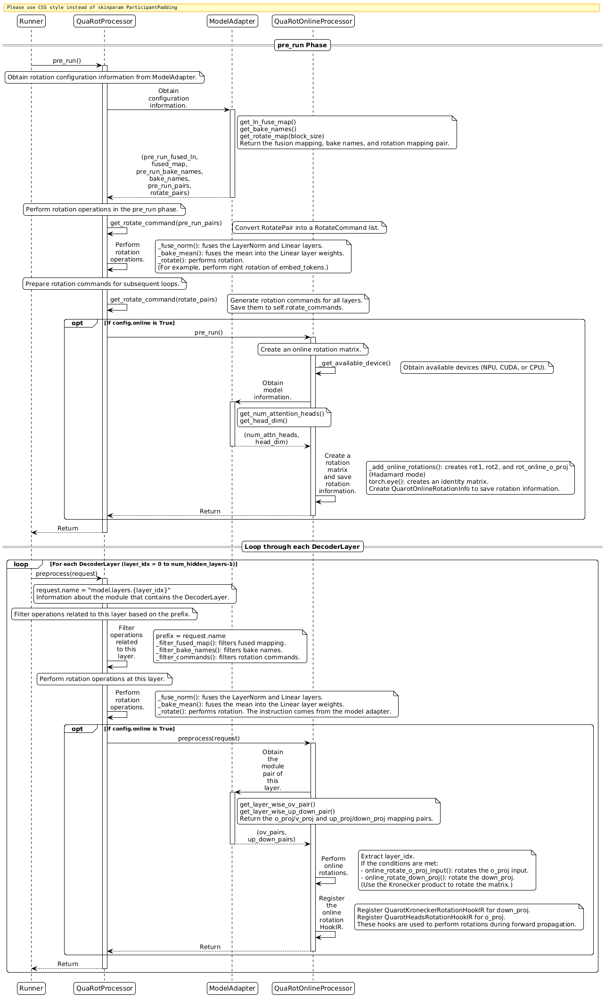

# QuaRot: Rotation-based Outlier Suppression Algorithm

## Overview

- **Source**: Academic research or industry proposed method.
- **Introduction**: Quantization with Rotation (QuaRot)
  An innovative algorithm for the quantization of large language models that suppresses outliers in activation tensors through mathematical transformation. This algorithm "scatters" outliers into multiple channels by performing specific rotation transformations on weights and activation values. This significantly smoothes the data distribution before quantization and effectively reduces quantization error.
- **Core idea**: QuaRot applies a well-constructed orthogonal transformation (rotation matrix) to balance the maximum value of the transformed activation tensor on each channel as much as possible. This prevents a single channel from requiring an excessively large scaling factor due to extreme outliers, thereby improving overall quantization accuracy.

## Preparations

Install msModelSlim. For details, see [msModelSlim Installation Guide](../../getting_started/install_guide.md).

## Principle and Implementation

### Principle

1. **Core concept**
   QuaRot transforms model weights and activation values by using an orthogonal rotation matrix (for example, a Hadamard matrix). The orthogonal matrix meets the key property of Q × Qᵀ = I to ensure mathematical equivalence of the model before and after transformation.
2. **Rotation transformation**
   Apply the transformation to the weight matrix W: `W' = Qᵀ × W`.
   Apply the transformation to the activation value X: `X' = X × Q`.
   Maintain computational equivalence: `X' × W' = (X × Q) × (QT × W) = X × W`.
3. **Computational invariance**
   The rotation transformation maintains the input-output mapping of each Transformer layer. Even if a layer includes an RMSNorm operation, computational invariance remains valid because `RMSNorm(X) = RMSNorm(X × Qᵀ) × Q`.

4. **Optimization effect**
   This algorithm redistributes parameters through rotation to effectively suppress outliers in activation values. This results in a smoother value distribution and significantly reduces the quantization error of subsequent operations, laying the foundation for low-bit quantization.

### Implementation

#### Code Implementation

The algorithm is implemented in [msmodelslim/processor/quarot/offline_quarot/quarot.py](https://gitcode.com/Ascend/msmodelslim/blob/master/msmodelslim/processor/quarot/offline_quarot/quarot.py).

#### Processing Sequence

The following sequence diagram shows the complete processing flow of the QuaRot algorithm, including the interaction between `Runner`, `QuaRotProcessor`, `ModelAdapter`, and `LAOSOnlineRotationProcessor`.



#### pre_run Phase

The `pre_run` phase is executed before the `Runner` starts scheduling layers. It mainly completes the following operations:

**Obtaining Configuration Information from the Model Adapter**

- Calls `adapter.get_ln_fuse_map()` to obtain the fusion mapping between `LayerNorm` and `Linear` layers. This returns `(pre_run_fused_ln, fused_map)`,
  where `pre_run_fused_ln` is used in the `pre_run` phase and `fused_map` is saved for the subsequent `preprocess` phase.
- Calls `adapter.get_bake_names()` to obtain the list of `Linear` layer names that require mean fusion. This returns `(pre_run_bake_names, bake_names)`.
- Calls `adapter.get_rotate_map(block_size)` to obtain rotation mapping pairs. This returns `(pre_run_pairs, rotate_pairs)`,
  where `pre_run_pairs` is used in the `pre_run` phase and `rotate_pairs` is saved for the subsequent `preprocess` phase.

**Performing Rotation Operations in the `pre_run` Phase**

- Converts `pre_run_pairs` into a `RotateCommand` list.
- Executes `_fuse_norm(pre_run_fused_ln)` to fuse `LayerNorm` and `Linear` layers. This fuses the `LayerNorm` weight into the `Linear` layer and sets the `LayerNorm` weight to `1`.
- Executes `_bake_mean(pre_run_bake_names)` to fuse the mean into the `Linear` layer weight (which is typically an empty list).
- Executes `_rotate(pre_run_commands)` to perform the rotation operation on the specified layer (such as `model.embed_tokens`).

**Preparing Rotation Commands for Subsequent Loops**

- Converts `rotate_pairs` into a `RotateCommand` list and saves it to `self.rotate_commands` for use in the `preprocess` phase.

**(Optional) Exporting Global Rotation Information**

- If `export_extra_info` is set to `True`, the algorithm registers `QuaRotExtraInfoHookIR` with the first rotation target module and exports the QuaRot global rotation matrix information in the saving phase.
- After the export, the following files are added to the quantization save directory:
  - `optional/quarot.safetensors`: Contains a tensor with the key `global_rotation`. This tensor is the global rotation matrix `Q` used by QuaRot.
  - `optional.quarot` field in `quant_model_description.json`: Describes the additional export files mentioned above, facilitating file loading on the inference side based on the description.
- The structure of `optional.quarot` is as follows:

```jsonc
{
  "optional": { // Entry for optional export files
    "quarot": { // Additional export field of QuaRot
      "rotation_map": { // Rotation information mapping table
        "global_rotation": "optional/quarot.safetensors" // Global rotation matrix file (relative path)
      }
    }
  }
}
```

- If `export_extra_info` is `False`, the algorithm does not inject this hook and does not export the preceding information.

**(Optional) Initializing Online Rotation**

- If `online: True` is configured, the algorithm calls `online_processor.pre_run()` to perform the following operations:
    - Obtains the available devices (such as NPU, CUDA, or CPU).
    - Obtains `num_attn_heads` and `head_dim` from the adapter.
    - Creates online rotation matrices (`rot1`, `rot2`, and `rotonlineo_proj`) and the identity matrix.
    - Creates a `QuarotOnlineRotationInfo` object to save the rotation information.

#### `preprocess` Phase

The `preprocess` phase executes when the `Runner` schedules each `DecoderLayer`, processing each decoder layer one by one.

**Filtering Layer-Related Operations Based on the Prefix**

- Extract the prefix (such as `"model.layers.0"`) from `request.name`.
- Call `_filter_fused_map(prefix)` to filter out the `LayerNorm` fusion mapping related to the layer from `self.fused_map` and remove it from `self.fused_map`.
- Call `_filter_bake_names(prefix)` to filter out the bake names related to the layer from `self.bake_names` and remove them from `self.bake_names`.
- Call `_filter_commands(prefix)` to filter out the rotation commands related to the layer from `self.rotate_commands` and remove them from `self.rotate_commands`.

**Performing Rotation Operations on the Layer**

- Execute `_fuse_norm(fused_map)` to fuse the `LayerNorm` and `Linear` layers of the current layer (such as the fusion of `input_layernorm` and `q_a_proj`).
- Execute `_bake_mean(bake_names)` to fuse the mean of the current layer into the `Linear` layer weights.
- Execute `_rotate(rotate_commands)` to perform the rotation operation on the layer. The specific content of the rotation operation is obtained from the model adapter.

**(Optional) Performing Online Rotation**

- If `online: True` is configured, the algorithm calls `online_processor.preprocess(request)` to perform the following operations:
    - Obtain the `ov_pairs` (mapping pairs of `o_proj` and `v_proj`) and `up_down_pairs` (mapping pairs of `up_proj` and `down_proj`) of the layer from the adapter.
    - Extract `layer_idx`.
    - Call `online_rotate_o_proj_input()` to perform online rotation on the input of `o_proj` if conditions are met.
    - Call `online_rotate_down_proj()` to perform online rotation on `down_proj` (using a Kronecker product rotation matrix) if `layer_idx` exists in the `down_proj_online_layers` configuration.

    - Register `QuarotKroneckerRotationHookIR` for `down_proj` and `QuarotHeadsRotationHookIR` for `o_proj`. These hooks perform rotation operations during forward propagation.

#### `post_run` Phase

The `post_run` phase executes after the `Runner` finishes scheduling. It mainly completes the following operations:

- Execute the remaining fusion, bake, and rotation operations by processing the remaining content in `self.fused_map`, `self.bake_names`, and `self.rotate_commands`.
- Clear the status and empty all saved mapping and command lists.
- Call `online_processor.post_run()` to convert `HookIR` to `WrapperIR` if online rotation is enabled.

## Application Requirements

- **Model structure constraints**: The current adapter supports the Qwen3 Dense model series, Qwen3 MOE model series, and DeepSeek-V3/R1 series.
- **Tensor parallelism constraints**: If online rotation is enabled, ensure that `tp_size` is a power of 2 when deploying the model by using Tensor Parallelism (TP) in an inference engine. Additionally, `tp_size` must be less than or equal to the `max_tp_size` configuration parameter of QuaRot. Failure to meet these conditions leads to accuracy anomalies.
- **Online rotation constraints**: Online rotation typically improves accuracy but requires the insertion of online rotation operators during deployment. This implementation depends on the support of the inference framework and reduces performance to some extent. Users must balance accuracy and performance based on the specific capabilities of their inference engine.

## Function Description

### Supported Ascend AI Processors

| Product Series                              | Supported|
|------------------------------------|----|
| Atlas A3 training products/Atlas A3 inference products   | ✓  |
| Atlas A2 training products/Atlas 800I A2 inference products| ✓  |
| Atlas inference products                      | ✗  |

### Supported Models

Currently, the QuaRot algorithm supports the following model series.

| Model Series                | Specific Model                                                                                                    | Basic Rotation| Online Rotation| Remarks                       |
|----------------------|----------------------------------------------------------------------------------------------------------|------|------|---------------------------|
| **Qwen3 Dense series**   | Qwen3-8B<br>Qwen3-14B<br>Qwen3-32B                                                                       | ✓    | ✓    | Supports complete QuaRot functionality, including basic and online rotation.|
| **Qwen3 MOE series**     | Qwen3-30B<br>Qwen3-235B                                                                                  | ✓    | ✗    | Supports basic rotation functionality.                 |
| **DeepSeek-V3/R1 series**| DeepSeek-V3<br>DeepSeek-V3-0324<br>DeepSeek-R1<br>DeepSeek-R1-0528<br>DeepSeek-V3.1<br>DeepSeek-V3.2-Exp | ✓    | ✗    | Supports basic rotation functionality.                 |
| **Qwen3-VL series**| Qwen3-VL-32B | ✓    | ✗    | Supports basic rotation functionality.                 |
| **Qwen3-VL-MoE series**| Qwen3-VL-235B-A22B<br>Qwen3-VL-30B-A3B | ✓    | ✗    | Supports basic rotation functionality.                 |

**Notes:**

- **Basic rotation**: All supported models implement the `QuaRotInterface` and support basic rotation functionality.
- **Online rotation**: Currently, only the `Qwen3 Dense` series models implement the `LAOSOnlineRotationInterface` and support online rotation functionality. To use online rotation, configure
  `online: True`.
- For models that do not implement the online rotation interface, setting `online: True` causes an error.

### YAML Configuration Example

The following example shows a YAML configuration when the algorithm is used as a processor:

```yaml
spec:
  process:
    - type: "quarot"                     # Specifies the processor type. The value is fixed to quarot.
      online: False                      # Specifies whether to enable online rotation. The default value is False.
      block_size: -1                     # Specifies the block size when the block diagonal matrix is enabled. It must be -1 or a power of 2. The value -1 disables block diagonal matrix processing.
      max_tp_size: 4                     # Specifies the maximum tensor parallel size. The default value is 4. This parameter is valid only when online rotation is enabled. It must be a power of 2. The tp value set during model startup must be less than or equal to max_tp_size.
      down_proj_online_layers: [ ]       # Specifies the layers whose down_proj modules perform online rotation. The default value is an empty list.
      export_extra_info: True            # Specifies whether to export the global rotation matrix. The default value is True. If the value is true and ascend_v1_saver is used, an optional directory is generated in the directory of quantized weights and additional fields are added to quant_model_description.json.
```

### YAML Configuration Fields

| Field                    | Purpose            | Type          | Description                                         | Default Value       |
|-------------------------|----------------|--------------|---------------------------------------------|------------|
| type                    | Specifies the processor type identifier.       | `string`     | The value is fixed to `quarot`, which identifies the object as the QuaRot quantization processor.                    | `"quarot"` |
| online                  | Specifies whether to enable online rotation.        | `bool`       | `True` enables online rotation, and `False` disables it.           | `False`    |
| block_size              | Specifies the diagonal block size of the rotation matrix.    | `int`        | The value can be `-1` or a power of 2. The value `-1` disables diagonal block matrix processing.| `-1`       |
| max_tp_size             | Specifies the maximum tensor parallel size.      | `int`        | This parameter takes effect only when online rotation is enabled. The value must be `1` or a power of 2.    | `4`        |
| down_proj_online_layers | Specifies the layers where down_proj uses online rotation.| `array[int]` | This field contains a list of layer indexes used to identify the layers whose `down_proj` modules perform online rotation.       | `[]`       |
| export_extra_info       | Specifies whether to export global rotation information.    | `bool`       | If this field is set to `True`, the corresponding HookIR is injected. If `ascend_v1_saver` is used, an `optional` directory is generated in the directory of quantized weights to save additional `safetensors` (including the global rotation matrix of QuaRot), and description fields are added to `quant_model_description.json`. If it is set to `False`, no global rotation information is exported.| `True`     |

## Model Adaptation

### Interfaces and Data Structures

This interface group is used to enable the model to adapt to the QuaRot algorithm. The QuaRot algorithm contains two model adaptation interfaces: `QuaRotInterface` (basic rotation) and
`LAOSOnlineRotationInterface` (online rotation). If only the basic rotation functionality is required, only `QuaRotInterface` needs to be implemented. If the online rotation functionality is required, both interfaces must be implemented.

#### Data Structures

```python

class QuaRotMode(Enum):
    HADAMARD = "hadamard"
    BLOCK_HADAMARD = "block_hadamard"
    BLOCK_HADAMARD_SHIFTED = "block_hadamard_shifted"


class RotSide(Enum):
    """Enumeration of rotation directions"""
    LEFT = "left" # Specifies the left rotation.
    RIGHT = "right" # Specifies the right rotation.


@dataclass
class RotateCommand:
    """Rotation command data class"""
    target: str # Specifies the name of the target module.
    rot: Any # Specifies the rotation matrix.
    side: RotSide # Specifies the rotation direction.


@dataclass
class RotatePair:
    """Rotation pair data class, including the mapping of left rotation and right rotation"""
    left_rot: Dict[str, Any] # Specifies the left rotation mapping: {module name: rotation matrix}.
    right_rot: Dict[str, Any] # Specifies the right rotation mapping: {module name: rotation matrix}.
```

#### QuaRotInterface

```python

class QuaRotInterface:
    """Basic rotation interface of QuaRot for adapting models to the basic rotation functionality"""

    # Static method: Create a rotation matrix.
    @staticmethod
    def get_rotate_command(mode: QuaRotMode,
                           size: int,
                           block_size: int = -1,
                           rot_step: int = 1,
                           eye_step: tuple = (-1,)) -> torch.Tensor:
        """
        Create a rotation matrix.

        Args:
            mode: Specifies the rotation mode (such as HADAMARD and BLOCK_HADAMARD)
            size: Specifies the matrix size.
            block_size: Specifies the block size. The value -1 disables block diagonal matrix processing.
            rot_step: Specifies the rotation step.
            eye_step: Specifies the step of the unit matrix.

        Returns:
            The rotation matrix
        """
        ...

    @abstractmethod
    def get_ln_fuse_map(self) -> Tuple[Dict[str, List[str]], Dict[str, List[str]]]:
        """
        Obtain the fusion mapping between the LayerNorm and Linear layers.

        Returns:
            A tuple containing two dictionaries:
            - pre_run_fused_ln (Dict[str, List[str]]): Specifies the fusion mapping in the pre_run phase.
            - fused_map (Dict[str, List[str]]): Specifies the fusion mapping in the preprocess phase.
            The key of the dictionary is the name of the LayerNorm layer, and the value is the list of names of Linear layers to be fused.
        """
        ...

    @abstractmethod
    def get_bake_names(self) -> Tuple[List[str], List[str]]:
        """
        Obtain the list of names of Linear layers that require mean fusion.

        When the model uses nn.LayerNorm, mean fusion must be performed on the Linear layer before the LayerNorm layer.
        Generally, you do not need to set this parameter.

        Returns:
            A tuple containing two lists:
            - pre_run_bake_names (List[str]): Specifies a list of bake names in the pre_run phase.
            - bake_names (List[str]): Specifies a list of bake names in the preprocess phase.
        """
        ...

    @abstractmethod
    def get_rotate_map(self, block_size: int) -> Tuple[List[RotatePair], List[RotatePair]]:
        """
        Obtain the rotation mapping, including the left and right rotation configurations.

        Args:
            block_size: Specifies the block size of the rotation.

        Returns:
            A tuple containing two RotatePair lists:
            - pre_run_pairs (List[RotatePair]): Specifies a list of rotation mapping pairs in the pre_run phase.
              This is typically used for rotation of the embedding layers.
            - rotate_pairs (List[RotatePair]): Specifies a list of rotation mapping pairs in the preprocess phase.
              This is typically used for rotation of the decoder layers.
        """
        ...
```

#### LAOSOnlineRotationInterface

```python

class LAOSOnlineRotationInterface:
    """Online rotation interface of QuaRot for adapting models to the online rotation functionality"""

    @abstractmethod
    def get_head_dim(self) -> int:
        """
        Obtain the dimension of the attention head.

        Returns:
            Dimension of the attention head
        """
        ...

    @abstractmethod
    def get_num_attention_heads(self) -> int:
        """
        Obtain the number of attention heads.

        Returns:
            Number of attention heads
        """
        ...

    @abstractmethod
    def get_layer_wise_ov_pair(self, decoder_module: nn.Module) -> Dict[nn.Module, nn.Module]:
        """
        Obtain the o_proj and v_proj mapping pair corresponding to a single decoder layer.

        Args:
            decoder_module: Specifies the module object of the decoder layer.

        Returns:
            Dictionary where the key is the o_proj module and the value is the v_proj module
        """
        ...

    @abstractmethod
    def get_layer_wise_up_down_pair(self, decoder_module: nn.Module) -> Dict[nn.Module, nn.Module]:
        """
        Obtain the up_proj and down_proj mapping pair corresponding to a single decoder layer.

        Args:
            decoder_module: Specifies the module object of the decoder layer.

        Returns:
            Dictionary where the key is the up_proj module and the value is the down_proj module
        """
        ...
```

### Adaptation Procedure

- **Prerequisites**
    - Ensure that all returned module references are actual module objects in the model.
    - Module paths must be identical to the paths returned by `model.named_modules()`.
    - The key and value in the returned dictionary must be the complete path string of the module, such as `"model.layers.0.self_attn.q_proj"`.

- **Procedure**
    1. **(Mandatory) Implement `QuaRotInterface`**
        - The model adapter inherits `QuaRotInterface` and implements all abstract methods.
        - Implement `get_ln_fuse_map()` to return the fusion mapping between the LayerNorm and Linear layers.
        - Implement `get_bake_names()` to return the list of names of Linear layers that require mean fusion. Generally, an empty list is returned.
        - Implement `get_rotate_map(block_size)` to return the rotation mapping pairs, including the rotation configurations in the `pre_run` and `preprocess` phases.
        - For details, see the implementation of [msmodelslim/model/qwen3/model_adapter.py](https://gitcode.com/Ascend/msmodelslim/blob/master/msmodelslim/model/qwen3/model_adapter.py) or [msmodelslim/model/deepseek_v3/model_adapter.py](https://gitcode.com/Ascend/msmodelslim/blob/master/msmodelslim/model/deepseek_v3/model_adapter.py).

    2. **(Optional) Implement `LAOSOnlineRotationInterface` (only when online rotation is required)**
        - If `online: True` is configured, `LAOSOnlineRotationInterface` must be implemented.
        - Implement `get_head_dim()` to return the dimension of the attention head.
        - Implement `get_num_attention_heads()` to return the number of attention heads.
        - Implement `get_layer_wise_ov_pair(decoder_module)` to return the mapping pair of `o_proj` and `v_proj`.
        - Implement `get_layer_wise_up_down_pair(decoder_module)` to return the mapping pair of `up_proj` and `down_proj`.

## FAQ

### Rotation Matrix Creation Failure

**Symptom**: The input dimension of the model is not supported, causing the creation of the rotation matrix to fail.

**Solution**: Ensure that the Hadamard matrix of the specified dimension exists. Add the matrix of the specified dimension by referring to [msmodelslim/processor/quarot/common/hadamard_txt](https://gitcode.com/Ascend/msmodelslim/tree/master/msmodelslim/processor/quarot/common/hadamard_txt), and supplement it in [msmodelslim/processor/quarot/common/hadamard.py](https://gitcode.com/Ascend/msmodelslim/blob/master/msmodelslim/processor/quarot/common/hadamard.py).

### TP Configuration Error

**Symptom**: Accuracy is abnormal when the inference engine is deployed in TP mode.

**Cause**: The `tp_size` is not a power of 2, or `tp_size` is greater than `max_tp_size` configured in QuaRot.

**Solution**:
    - Ensure that `tp_size` is a power of 2 (such as 1, 2, 4, or 8).
    - Ensure that `tp_size` ≤ `max_tp_size`.
    - Check whether the inference engine supports the online rotation operator.

### Online Rotation Performance Issue

**Symptom**: Inference performance decreases significantly after online rotation is enabled.

**Cause**: Online rotation requires inserting extra operators, which increases the computational overhead.

**Solution**:

- Determine whether to enable online rotation based on the accuracy requirements.
- Consider using only offline rotation (`online: False`) to balance accuracy and performance.
- Ensure that the inference framework provides good support for online rotation operators.

### Model Adaptation Failure

**Symptom**: The model adapter cannot correctly identify the model structure, causing the insertion of the rotation operation to fail.

**Cause**: The model structure is incompatible or the implementation of the adapter is incomplete.

**Solution**:

- Ensure that the model is based on the Transformer decoder architecture.
- Check whether the adapter correctly implements all `QuaRotInterface` methods. If online rotation is enabled, `LAOSOnlineRotationInterface` must also be implemented.
- For details, see the implementation examples in [msmodelslim/model/qwen3/model_adapter.py](https://gitcode.com/Ascend/msmodelslim/blob/master/msmodelslim/model/qwen3/model_adapter.py) or [msmodelslim/model/deepseek_v3/model_adapter.py](https://gitcode.com/Ascend/msmodelslim/blob/master/msmodelslim/model/deepseek_v3/model_adapter.py).
