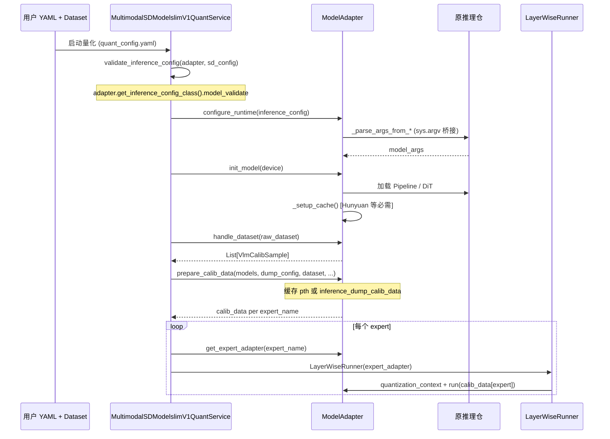
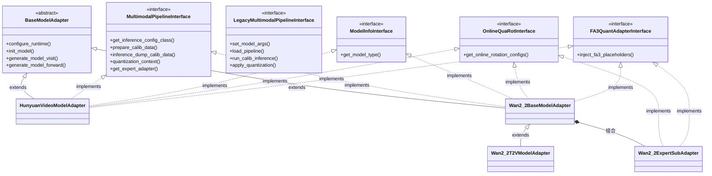
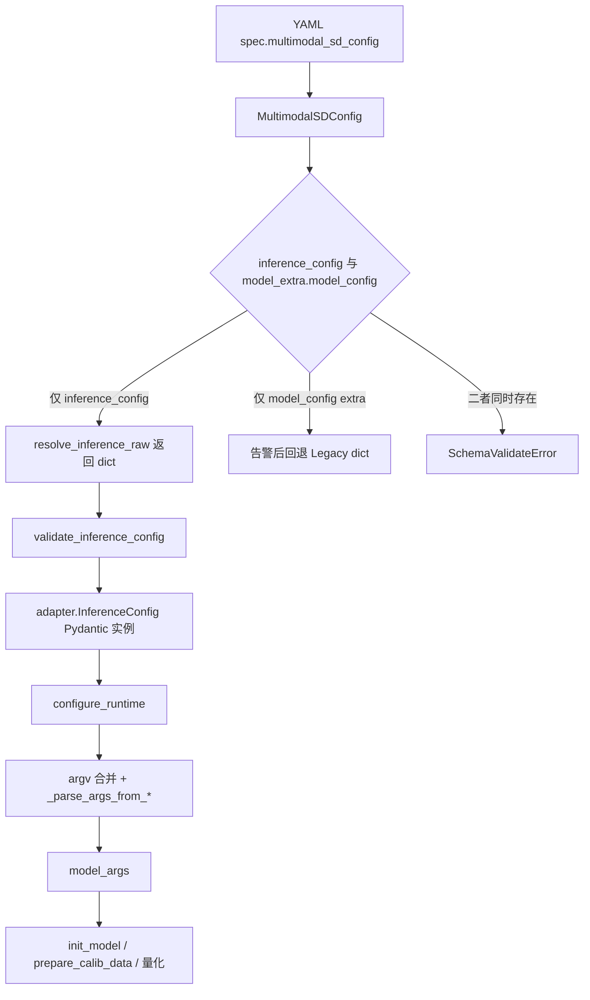

# 多模态生成模型接入指南

## 目录

1. [总体实现思路](#总体实现思路)
2. [msModelSlim 架构与编排](#msmodelslim-架构与编排)
3. [分步实现指南](#分步实现指南)
   - 3.1 [场景一：单网络 DiT（HunyuanVideo）](#场景一单网络-dithunyuanvideo)
   - 3.2 [场景二：双专家 DiT（Wan2.2）](#场景二双专家-ditwan22)
4. [量化自有模型](#量化自有模型)
5. [常见问题与排障](#常见问题与排障)
6. [参考实现](#参考实现)

---

## 总体实现思路 {#总体实现思路}

### 核心目标

将自有文生视频/图生视频模型接入 msModelSlim 的量化管线，实现**校准数据 → 推理链路重放 → DiT 逐层量化**的端到端流程。

### 与传统 LLM 量化的关键差异

| 维度 | LLM 量化 | 多模态生成量化 |
|------|---------|--------------|
| 输入处理 | Token 序列 | 图文混合（图像路径 + Prompt） |
| 主干网络 | Decoder-only Transformer | DiT（Diffusion Transformer） |
| 网络结构 | 单一堆叠 | 单网络 / 双专家 / 多模块 |
| 参数来源 | 直接可配 | 需桥接原推理仓复杂参数体系 |
| 前向方式 | 自回归 | 扩散多步去噪（需重放完整链路） |

### 接入原则

1. **配置优先于硬编码**：通过 `inference_config`（Pydantic 强校验）而非 `model_config`（字符串映射）定义参数
2. **复用原仓逻辑**：桥接原推理仓的 `parse_args` + `_validate_args`，不重复实现参数校验
3. **分层解耦**：基类管公共能力（参数桥接、缓存装配），子类管场景差异（样本校验、具体生成逻辑）
4. **双路径兼容**：新模型实现 `MultimodalPipelineInterface`；主仓已接入模型保留 `LegacyMultimodalPipelineInterface`，由 `MultimodalSDModelslimV1QuantService` 按适配器类型自动分发

---

## msModelSlim 架构与编排 {#msmodelslim-架构与编排}

### 量化服务双分支（必读）

`MultimodalSDModelslimV1QuantService` 根据适配器实现的接口类型选择编排路径：

| 路径 | 适配器接口 | 典型 `model_type` | 校准 dump | 量化调度 |
|------|------------|-------------------|-----------|----------|
| **重构** | `MultimodalPipelineInterface` | `Wan2.2-T2V-A14B`、`Wan2.2-I2V-A14B`、`Wan2.2-TI2V-5B`、`HunyuanVideo` | `prepare_calib_data` → `inference_dump_calib_data` | `get_expert_adapter` + `quantization_context` |
| **Legacy** | `LegacyMultimodalPipelineInterface` | `Wan2_2` / `Wan2.2`（单体）、`wan2_1`、`flux1`、`qwen_image_edit` 等 | `run_calib_inference` | `apply_quantization` + 切换 `transformer` |

重构路径下，`inference_config` 由 **`quant_config.validate_inference_config(adapter, sd_config)`** 统一校验（调用适配器的 `get_inference_config_class()`），适配器不再提供 `build_inference_config()`。

### 整体交互流程（重构路径）



**多专家约束**：`init_model()` 返回的每个 expert 必须在 `calib_data` 中有对应 **key**；缺 key 时量化服务 **fail-fast** 抛 `SchemaValidateError`（`calib_data[expert]=None` 表示无 dump 数据的全动态量化，仍算有效 key）。**不支持**仅量化部分专家（例如只量化 `low_noise_model`）。

### Legacy 路径（主仓兼容）

仍使用 `LegacyMultimodalPipelineInterface` 的模型（`wan2_1`、`flux1`、`qwen_image_edit`、`Wan2_2`/`Wan2.2` 单体入口等）走 `_quant_process_legacy`：

1. `set_model_args`（`model_config` 字符串映射，非 Pydantic `inference_config`）
2. `load_pipeline` → `run_calib_inference`
3. `apply_quantization(quant_model_func)`，在回调内切换 `transformer` 并调用 LayerWise

**新接入多模态生成模型应优先实现 `MultimodalPipelineInterface`**；Legacy 仅用于保持与主仓既有适配器行为一致。`wan2_2/model_adapter.py` + `config.ini` 中 `wan2_2 = Wan2_2, Wan2.2` 为旧入口，与场景化 `Wan2.2-T2V-A14B` 等重构入口并存。

**规划中的能力**：按专家独立 `process` 链（`expert_process`）尚未实现，当前所有专家共用 YAML `spec.process`。

### 核心类结构



**说明**：
- 两类场景的主适配器继承完全相同的 5 个基类/接口
- `Wan2_2ExpertSubAdapter` 是**组合关系**（非继承），由基类在分区 5 创建并持有
- 子适配器**独立实现** `OnlineQuaRotInterface` 和 `FA3QuantAdapterInterface`，供 `LayerWiseRunner` 按专家单独调度

### 配置分层模型



说明：`inference_config` 为 `MultimodalSDConfig` **声明字段**，由 Pydantic 解析到 `self.inference_config`，**不会**进入 `model_extra`；勿依赖「通过 extra 传 inference_config」。

### 代码分区规范（必读）

两类场景的分区组织略有差异，必须严格遵循源码中的分区标记：

**场景一：单网络 DiT（HunyuanVideo）—— 7 个分区**

```
分区 1：公共流水线接口       # validate_calib_samples, handle_dataset, init_model, generate_model_visit/forward, enable_kv_cache
分区 2：公共运行时配置       # get_inference_config_class, configure_runtime
分区 3：公共校准执行         # prepare_calib_data, inference_dump_calib_data, quantization_context
分区 4：运行时通用辅助       # _runtime_value（HunyuanVideo 无 _quantization_context_with_no_sync）
分区 5：私有参数桥接          # _fixed_quant_runtime_overrides, _allowed_hyvideo_config_keys, _build_default_quant_cli, _namespace_to_argv, _parse_args_from_hyvideo
分区 6：私有运行时与缓存装配   # _check_import_dependency, _setup_cache, _load_pipeline
分区 7：量化扩展接口          # get_online_rotation_configs, inject_fa3_placeholders, _attach_attention_cache_to_blocks
```

**场景二：双专家 DiT（Wan2.2）—— 8 个分区（基类）**

```
分区 1：公共流水线接口       # validate_calib_samples, handle_dataset, init_model(抽象), generate_model_visit/forward, enable_kv_cache
分区 2：公共运行时配置       # get_inference_config_class(子类), configure_runtime(基类)
分区 3：公共校准执行         # prepare_calib_data, inference_dump_calib_data(抽象), quantization_context(抽象)
分区 4：基类运行时通用辅助     # _runtime_value, _quantization_context_with_no_sync
分区 5：私有专家子适配器装配   # _bind_expert_sub_adapters, _create_expert_sub_adapter
分区 6：私有参数桥接          # _allowed_generate_config_keys, _build_default_generate_cli, _namespace_to_argv, _parse_args_from_generate
分区 7：私有运行时与缓存装配   # _check_import_dependency, _init_logging, _load_pipeline, _setup_wan_dit_runtime, _setup_*_attention_cache
分区 8：量化扩展接口          # get_online_rotation_configs, inject_fa3_placeholders, _attach_attention_cache_to_blocks
```

**关键差异说明**：
- 分区 2 的 `configure_runtime` 在两场景中都位于**分区 2**；它调用的 argv/parse_args 辅助方法分别在 HunyuanVideo **分区 5**、Wan2.2 **分区 6**
- Wan2.2 **分区 5** 为双专家特有的子适配器装配，HunyuanVideo 无对应分区
- Wan2.2 基类 **分区 4** 额外提供 `_quantization_context_with_no_sync`，供子类 `quantization_context` 复用

---

## 分步实现指南 {#分步实现指南}

### 前置准备

1. 确认原推理仓可正常运行浮点推理
2. 准备校准数据集（图文对或纯文本列表）
3. 确定 DiT 结构类型：**单网络** vs **双专家**

---

### 场景一：单网络 DiT（HunyuanVideo） {#场景一单网络-dithunyuanvideo}

**适用特征**：单个 `transformer` 主干；`init_model` 返回 `{'': self.transformer}`。

**实现顺序**：按源码分区 1 → 7 依次实现（与上文「代码分区规范」一致）。

**核心类**（示例代码均写在类体内）：

```python
class HunyuanVideoModelAdapter(
    BaseModelAdapter,
    ModelInfoInterface,
    MultimodalPipelineInterface,
    FA3QuantAdapterInterface,
    OnlineQuaRotInterface,
):
    ...
```

#### Step 0：目录结构

```
msmodelslim/model/hunyuan_video/
├── __init__.py
├── model_adapter.py      # 主适配器（含分区 1~7）
├── constants.py          # DEFAULT_VIDEO_SIZE、HYVIDEO_CLI_LIST_FIELDS 等
└── loader.py             # HunyuanVideoAdapterLoader
```

#### Step 1：分区 1 —— 公共流水线接口

**职责**：数据集校验、模型加载入口、LayerWise 所需的 visit/forward 分段。

| 方法 | 说明 |
|------|------|
| `validate_calib_samples` | 当前仅 text-only，禁止 `image` |
| `handle_dataset` | 转 `List[VlmCalibSample]` 并校验 |
| `init_model` | 调用分区 6 的 `_load_pipeline` + `_setup_cache`，返回 `{'': transformer}` |
| `generate_model_visit` | 按 `streamblock` 关键字逐层 visit |
| `generate_model_forward` | 首层 hook 截获输入后逐层 yield |

```python
class HunyuanVideoModelAdapter(
    BaseModelAdapter,
    ModelInfoInterface,
    MultimodalPipelineInterface,
    FA3QuantAdapterInterface,
    OnlineQuaRotInterface,
):
    """单网络 DiT 适配器（hunyuan_video/model_adapter.py）。"""

    _HYVIDEO_CONFIG_KEYS: ClassVar[Optional[frozenset[str]]] = None

    # ===== 分区 1：公共流水线接口 =====

    def validate_calib_samples(self, samples: List[VlmCalibSample]) -> List[VlmCalibSample]:
        """
        校验校准样本列表，确保每个样本满足 HunyuanVideo T2V（文本转视频）的输入要求。

        - 检查每个 sample 必须包含非空的 text 字段。
        - 禁止包含 image 字段（HunyuanVideo 当前仅支持 text-only 输入）。
        - 若不满足要求，则抛出 SchemaValidateError。
        """
        for idx, sample in enumerate(samples):
            # 检查文本字段必须为非空字符串
            if not sample.text or not sample.text.strip():
                raise SchemaValidateError(
                    f"hunyuan_video sample[{idx}] requires non-empty text",
                    action="Provide text in dataset entries (index.jsonl / VlmCalibSample.text)."
                )
            # 校准阶段禁止传入 image 字段，HunyuanVideo 仅支持纯文本
            if sample.image is not None:
                raise SchemaValidateError(
                    f"hunyuan_video sample[{idx}] must not include image",
                    action="HunyuanVideo T2V calibration is text-only; remove image from dataset."
                )
        return samples

    def handle_dataset(
        self,
        dataset: Any,
        device: DeviceType = DeviceType.NPU,
    ) -> List[VlmCalibSample]:
        """
        统一将输入数据集转换为 List[VlmCalibSample] 并完成校验。

        - 支持传入 None、单个 VlmCalibSample、或 VlmCalibSample 的列表/可迭代对象。
        - 校验逻辑委托给 validate_calib_samples，确保所有样本字段符合要求。
        - device 参数预留，当前未使用，便于接口一致性。
        """
        _ = device  # 设备参数当前未用，仅作占位
        if dataset is None:
            return []  # 若数据集为空，返回空列表
        if isinstance(dataset, VlmCalibSample):
            # 若为单个校准样本，包装为单元素列表后校验
            return self.validate_calib_samples([dataset])
        # 否则假定为可迭代对象，转换为列表后校验
        return self.validate_calib_samples(list(dataset))

    def init_model(self, device: DeviceType = DeviceType.NPU) -> Dict[str, nn.Module]:
        """
        初始化模型，加载主推理 pipeline，并完成必要的 cache 设置。
        - device 参数用于指定推理设备（默认为 NPU），目前主要用于接口一致性，内部未直接使用。
        - 必须先调用 _load_pipeline（实现见分区 6），保证 transformer/pipeline 被正确加载。
        - 随后必须调用 _setup_cache，这一步是因为推理仓要求每次加载模型后必须初始化 block 级 attention cache（并非 KV cache），否则部分推理流程无法正常运行，是 HunyuanVideo 推理框架的特殊要求。
        - 返回值为 dict[str, nn.Module]。
        """
        self._load_pipeline()   # 加载主推理 pipeline（见分区 6）
        self._setup_cache()     # 初始化 cache 机制（见分区 6），此步骤为必要流程
        return {'': self.transformer}  # 主体模型 transformer，key 为''（空字符串）

    def generate_model_visit(
        self,
        model: torch.nn.Module,
        transformer_blocks: Optional[List[Tuple[str, torch.nn.Module]]] = None,
    ) -> Generator[ProcessRequest, Any, None]:
        """
        逐层遍历 transformer_blocks，按 LayerWise 语义按需 yield ProcessRequest，
        用于外部流程可插桩（如量化、调试等）或定制处理。
        - 内部默认按类名中包含 'streamblock' 筛选模块列表（与 generate_model_forward 内部一致）
        - 可支持外部自定义 transformer_blocks，暂无特殊需求时可直接使用默认参数
        - 返回生成器，每层 yield ProcessRequest，封装当前块的信息与参数
        """
        return generated_decoder_layer_visit_func_with_keyword(model, keyword="streamblock")

    def generate_model_forward(
            self,
            model: torch.nn.Module,
            inputs: Any,
        ) -> Generator[ProcessRequest, Any, None]:
        """
        用于按 LayerWise 逐层截取输入与输出，支持推理链路重放、量化插桩等场景。

        通常的实现逻辑为：
        - 拦截模型的首层输入
        - 按照 “streamblock” 关键字拆分 Transformer Block
        - 每经过一层，yield 出 ProcessRequest，交由上游控制是否中断、插桩或继续前向
        - 直到所有层被遍历且前向结束

        返回的是一个生成器（Generator），
        每次 yield 提供当前层的信息及中间输入/输出，便于外部流程逐层处理
        """
        pass
```

#### Step 2：分区 2 —— 公共运行时配置

**职责**：声明 `HunyuanVideoInferenceConfig` 与 `get_inference_config_class()`；`configure_runtime` 将**已校验**的 `inference_config` 写入 `model_args`。
**校验入口**：`MultimodalSDModelslimV1QuantService` 在 `quant_process` 中调用 `validate_inference_config(adapter, sd_config)`（`quant_config.py`），内部执行 `get_inference_config_class().model_validate(raw_dict)`。
**注意**：`configure_runtime` 在分区 2，桥接方法在分区 5（`_build_default_quant_cli`、`_parse_args_from_hyvideo` 等）。

```python
class HunyuanVideoModelAdapter(
    BaseModelAdapter,
    ModelInfoInterface,
    MultimodalPipelineInterface,
    FA3QuantAdapterInterface,
    OnlineQuaRotInterface,
):
    # ===== 分区 2：公共运行时配置 =====

    class HunyuanVideoInferenceConfig(BaseModel):
        model_config = ConfigDict(extra="forbid")
        model_resolution: Optional[Literal["540p", "720p"]] = "720p"
        video_size: Optional[Union[Tuple[int, int], List[int]]] = (720, 1280)
        infer_steps: Optional[int] = 50
        # ... 与 hyvideo CLI 可对齐的字段

    def get_inference_config_class(self):
        return self.HunyuanVideoInferenceConfig

    def configure_runtime(self, inference_config: HunyuanVideoInferenceConfig) -> None:
        """
        将 YAML/Dict 格式的 inference_config 校验并转为 argparse-compatible 的 model_args。
        步骤：
        1. 对 inference_config 进行序列化（过滤 None 字段），仅允许受支持的字段（非法字段报错）。
        2. 构造基础 CLI argv（如模型路径、分辨率信息）。
        3. 将 config 字段和量化固定覆盖项加入 argv。
        4. 传递给 hyvideo 仓库的 parse_args，得到解析结果并存入 self.model_args。
        """
        override = inference_config.model_dump(exclude_none=True)
        allowed_attrs = self._allowed_hyvideo_config_keys()  # 分区 5
        # ... 非法字段校验
        argv = self._build_default_quant_cli()               # 分区 5
        argv.extend(self._namespace_to_argv(override))       # 分区 5
        argv.extend(self._namespace_to_argv(self._fixed_quant_runtime_overrides()))
        self.model_args = self._parse_args_from_hyvideo(argv) # 分区 5
```

#### Step 3：分区 3 —— 公共校准执行

**职责**：`prepare_calib_data` 负责 pth 缓存与 dump 调度；`inference_dump_calib_data` 做浮点推理重放；`quantization_context` 提供量化时的 `autocast/no_grad` 等上下文。

```python
# ===== 分区 3：公共校准执行 =====

def prepare_calib_data(self, models, dump_config, save_path, dataset, inference_config):
    """
    按 expert_name 构造 calib_data_<task>_<expert>.pth 路径；
    enable_dump 时调用 inference_dump_calib_data 生成缓存，否则加载已有 pth。
    单 DiT 时 models 仅含 key ''。
    """
    ...

def inference_dump_calib_data(self, dataset=None, inference_config=None):
    """
    执行浮点模型推理以导出校准数据，用于后续量化步骤。
    Args:
        dataset: 可迭代的校准样本集合，每个样本应包含 text 等字段。
        inference_config: 推理配置对象或字典，包含推理过程所需的参数。
    流程:
        - 遍历每个样本，统一通过 _runtime_value 动态获取配置参数（支持优先使用 inference_config, 回落到 model_args）。
        - 按样本内容及推理参数调用 hunyuan_video_sampler.predict，生成用于量化的校准数据。
    """
    for sample in tqdm(dataset):
        seed = self._runtime_value(inference_config, "seed")  # 分区 4
        self.hunyuan_video_sampler.predict(
            prompt=sample.text,
            height=video_size[0],
            # ... 其余参数均经 _runtime_value 取值
        )

def quantization_context(self):
    """
    量化相关上下文环境，通常组合如下特性：
      - amp.autocast 自动混合精度（节省显存与加速）
      - torch.no_grad 禁用梯度计算（节省内存和提升推理效率）
      - 部分模块 device 切换（如将 blocks on CPU, 其余 on NPU）
    用于量化模型推理、校准数据收集等场景。
    """
    # amp.autocast + no_grad + 模块 device 切换
    ...
```

#### Step 4：分区 4 —— 运行时通用辅助

**职责**：校准/推理执行期统一取值，避免在多处重复 `getattr(inference_config, ...) or getattr(model_args, ...)`。

```python
# ===== 分区 4：运行时通用辅助 =====

def _runtime_value(
    self,
    inference_config: Optional[Union[BaseModel, Dict[str, Any]]],
    name: str,
) -> Any:
    """
    推理执行期统一取值：优先 inference_config（Pydantic 或 dict），否则 model_args。
    dict 使用 .get(name)；None 时仅回退 model_args。
    """
    if inference_config is not None:
        if isinstance(inference_config, dict):
            val = inference_config.get(name)
        else:
            val = getattr(inference_config, name, None)
        if val is not None:
            return val
    return getattr(self.model_args, name, None)
```

#### Step 5：分区 5 —— 私有参数桥接（配置与解析）

**职责**：仅包含「把 dict/InferenceConfig 转成 argv 并调用原仓 `parse_args`」的私有方法。

| 方法 | 说明 |
|------|------|
| `_fixed_quant_runtime_overrides` | 量化固定覆盖（关并行/cache 等） |
| `_allowed_hyvideo_config_keys` | 懒探测 hyvideo 合法字段 |
| `_build_default_quant_cli` | 满足 resolution/size 约束的最小 CLI |
| `_namespace_to_argv` | dict → argv（bool/list 特殊处理） |
| `_parse_args_from_hyvideo` | 临时改写 `sys.argv` 调 `hyvideo.config.parse_args` |

```python
# ===== 分区 5：私有参数桥接（配置与解析） =====
# 由分区 2 的 configure_runtime() 调用；勿把 configure_runtime 写在本分区。

@staticmethod
def _fixed_quant_runtime_overrides() -> Dict[str, Any]:
    """
    量化校准时强制写入 parse_args 的覆盖项。

    关闭分布式并行、VAE 并行及各类 cache 优化，避免量化路径受训练/部署态配置干扰。
    DiT block 级 cache 由适配器在分区 6 的 _setup_cache() 单独装配。
    """
    return {
        "ulysses_degree": 1,
        "ring_degree": 1,
        "vae_parallel": False,
        "use_cache": False,
        "use_cache_double": False,
        "use_attentioncache": False,
    }


def _allowed_hyvideo_config_keys(self) -> frozenset[str]:
    """
    返回 hyvideo.config.parse_args 支持的 inference_config 字段名集合。

    进程内仅探测一次（类变量 _HYVIDEO_CONFIG_KEYS 缓存），避免每次量化重复 parse。
    用于 configure_runtime 中校验 YAML 是否包含非法字段。
    """
    cls = type(self)
    if cls._HYVIDEO_CONFIG_KEYS is None:
        probe = self._parse_args_from_hyvideo(self._build_default_quant_cli())
        cls._HYVIDEO_CONFIG_KEYS = frozenset(vars(probe).keys())
    return cls._HYVIDEO_CONFIG_KEYS


def _build_default_quant_cli(self) -> List[str]:
    """
    构造 configure_runtime 合并 YAML 时使用的最小 argv。

    须满足 hyvideo 对 model_resolution / video_size 的断言（见 constants.py 默认值）。
    权重路径等必填项在此补齐，保证单次 parse_args 即可通过原仓校验。
    """
    model_base = str(self.model_path)
    h, w = DEFAULT_VIDEO_SIZE
    return [
        "--model-base", model_base,
        "--prompt", PLACEHOLDER_PROMPT,
        "--model-resolution", DEFAULT_MODEL_RESOLUTION,
        "--video-size", str(h), str(w),
        "--dit-weight", str(Path(model_base).joinpath(*DIT_WEIGHT_REL)),
        "--vae-path", str(Path(model_base).joinpath(*VAE_PATH_REL)),
        "--text-encoder-path", str(Path(model_base).joinpath(*TEXT_ENCODER_PATH_REL)),
        "--text-encoder-2-path", str(Path(model_base).joinpath(*TEXT_ENCODER_2_PATH_REL)),
    ]


@staticmethod
def _namespace_to_argv(namespace_dict: Dict[str, Any]) -> List[str]:
    """
    将 Namespace 风格的 dict 转为 CLI 片段列表，供 _parse_args_from_hyvideo 使用。

    约定：
    - None：跳过（走 argparse 默认）
    - bool：仅 True 时追加 flag（store_true 语义；False 不传参）
    - list/tuple：仅 HYVIDEO_CLI_LIST_FIELDS（如 video_size）展开为 nargs="+"
    - dict：跳过
    """
    argv: List[str] = []
    for key, val in namespace_dict.items():
        if val is None:
            continue
        flag = "--" + key.replace("_", "-")
        if isinstance(val, dict):
            continue
        if isinstance(val, bool):
            if val:
                argv.append(flag)
            continue
        if isinstance(val, (list, tuple)):
            if key in HYVIDEO_CLI_LIST_FIELDS:
                argv.append(flag)
                argv.extend(str(v) for v in val)
            continue
        argv.extend([flag, str(val)])
    return argv


def _parse_args_from_hyvideo(self, cli_args: List[str]):
    """
    调用 hyvideo.config.parse_args（含 sanity_check 与任务相关 assert）。

    通过临时改写 sys.argv 模拟命令行；finally 中必须恢复，避免污染其他模块。
    注意：parse_args 的 namespace= 参数语义是“预填充对象”，不能直接传入 CLI 列表。
    """
    from hyvideo.config import parse_args

    original_argv = sys.argv
    try:
        sys.argv = ["sample_video.py", *cli_args]
        return parse_args()
    finally:
        sys.argv = original_argv
```

#### Step 6：分区 6 —— 私有运行时与缓存装配

**职责**：加载原推理仓 Pipeline/Sampler；为 DiT block 注入 `CacheAgent`（原仓 `forward` 会调用 `self.cache.apply()`，与 `use_cache` 开关无关）。

```python
# ===== 分区 6：私有运行时与缓存装配 =====

def _load_pipeline(self):
    """
    加载推理流水线，包括初始化 HunyuanVideoSampler 和 transformer。
    """
    self.hunyuan_video_sampler = HunyuanVideoSampler(...)
    self.transformer = self.hunyuan_video_sampler.pipeline.transformer

def _setup_cache(self):
    """
    为每个 block 挂载 CacheAgent，使其与 sample_video.py 保持一致。
    """
    pass
```

#### Step 7：分区 7 —— 量化扩展接口

**职责**：实现 `OnlineQuaRotInterface`、`FA3QuantAdapterInterface`；由量化服务在 LayerWise 流程中按配置调用。
**何时需要**：YAML `process` 中启用 Online QuaRot / FA3 相关算子时；未启用可暂不实现。

| 方法 | 接口 | 说明 |
|------|------|------|
| `get_online_rotation_configs` | `OnlineQuaRotInterface` | 为 DiT block 注册 `q_rot`/`k_rot` 并返回旋转配置 |
| `inject_fa3_placeholders` | `FA3QuantAdapterInterface` | 注入 `fa3_q/k/v` 占位并包裹 block 的 `forward` |

```python
# ===== 分区 7：量化扩展接口 =====

# ----- OnlineQuaRotInterface -----

def get_online_rotation_configs(self, model: Optional[nn.Module] = None):
    """
    返回在线旋转配置：对每个目标 block 的 q_rot、k_rot 配置 Hadamard 旋转。

    Args:
        model: 待量化的 DiT（通常为 self.transformer）。若提供，会先在 block 上
               register_module('q_rot'/'k_rot', nn.Identity()) 作为旋转挂载点。

    Returns:
        Dict[str, RotationConfig]: 键为模块路径（如 "blocks.0.q_rot"），值为旋转参数。

    目标 block 类型（与 hyvideo DiT 结构一致）：
        - MMDoubleStreamBlock（双流：img + txt）
        - MMSingleStreamBlock（单流）
    """
    pass


# ----- FA3QuantAdapterInterface -----

def inject_fa3_placeholders(
    self,
    root_name: str,
    root_module: nn.Module,
    should_inject: Callable[[str], bool],
) -> None:
    """
    为 HunyuanVideo DiT block 注入 FA3 量化占位，并包裹 forward 在 attention 前调用占位。

    Args:
        root_name: 当前量化子树根路径（LayerWiseRunner 传入）。
        root_module: 待处理的 nn.Module（通常为 transformer）。
        should_inject: 按全路径名过滤是否注入（支持 include/exclude 策略）。

    流程概要：
        1. 遍历 MMDoubleStreamBlock / MMSingleStreamBlock
        2. set_submodule 注入 fa3_q、fa3_k、fa3_v（FA3QuantPlaceHolder）
        3. 包裹 forward：在 Q/K/V cat 之后、attention 之前依次调用
           q_rot/k_rot（若存在）→ fa3_q/fa3_k/fa3_v
        4. forward 其余逻辑与原仓 block.forward 一致（需从原模块 import 辅助函数）

    注意：
        - 使用 `module.forward = new_forward.__get__(module, module.__class__)` 绑定实例方法
        - 完整 forward 体较长，实现时对照 hyvideo 对应 block 的 forward 复制并插入占位调用
        - 推理仓 `parse_args` 暂不支持 `args=cli_list`，须通过临时改写 `sys.argv`（finally 恢复）
    """
    pass
```

**接入新模型时的实现建议**：

1. 先确认原推理仓 DiT block 的类名与 `forward` 签名（双流/单流是否都存在）。
2. QuaRot：只需在 attention 入口为 Q/K 提供可替换的 `q_rot`/`k_rot` 子模块路径。
3. FA3：在 Q/K/V 张量就绪后、进入 attention 算子前插入三个占位调用；勿改动扩散主循环逻辑。

---

### 场景二：双专家 DiT（Wan2.2） {#场景二双专家-ditwan22}

**适用特征**：`low_noise_model` + `high_noise_model` 两个 DiT 专家；`init_model` 返回 `{"low_noise_model": ..., "high_noise_model": ...}`。
**代码分工**：`base_model_adapter.py` 实现分区 1~8 的公共能力；`t2v/`、`i2v/`、`ti2v/` 各子目录下的 `model_adapter.py` 补充分区 1~3 的场景差异；`expert_sub_adapter.py` 供 LayerWiseRunner **按专家**调度量化。

**实现顺序**：基类按分区 1 → 8；子类在对应 Step 中覆盖标注的方法。

**核心类**：

| 类 | 文件 | 说明 |
|----|------|------|
| `Wan2_2BaseModelAdapter` | `base_model_adapter.py` | 分区 1~8 公共逻辑 |
| `Wan2_2T2VModelAdapter` 等 | `t2v/model_adapter.py` 等 | 场景子类，固定 `scene_task` |
| `Wan2_2ExpertSubAdapter` | `expert_sub_adapter.py` | 单专家量化代理（非 BaseModelAdapter 子类） |

#### Step 0：目录结构

```
msmodelslim/model/wan2_2/
├── base_model_adapter.py    # 分区 1~8（基类，不可直接实例化）
├── expert_sub_adapter.py    # 专家子适配器（非 BaseModelAdapter 子类）
├── constants.py             # DEFAULT_SIZE、EXAMPLE_PROMPT、TASK_TYPES
├── model_adapter.py         # Legacy 单体适配器（LegacyMultimodalPipelineInterface，model_type=Wan2_2/Wan2.2）
├── loader.py                # Wan2_2AdapterLoader（Legacy 入口，config.ini wan2_2）
├── t2v/
│   ├── model_adapter.py     # 场景子类：T2V（scene_task=t2v-A14B）
│   └── loader.py            # Wan2_2T2VAdapterLoader
├── i2v/
│   ├── model_adapter.py     # 场景子类：I2V
│   └── loader.py            # Wan2_2I2VAdapterLoader
└── ti2v/
    ├── model_adapter.py     # 场景子类：TI2V（image 可选，无图走 T2V）
    └── loader.py            # Wan2_2TI2VAdapterLoader
```

#### Step 1：分区 1 —— 公共流水线接口（基类 + 子类）

**基类职责**：提供通用的 `handle_dataset`、`generate_model_visit/forward`（关键字 `attentionblock`）、`get_expert_adapter`、`prepare_calib_data`；`init_model` / `get_inference_config_class` 由子类实现。

**子类职责**：`validate_calib_samples`、`_build_wan_pipeline`、`init_model`、`_generate_video`（场景差异集中在此）。

| 方法 | 所在 | 说明 |
|------|------|------|
| `validate_calib_samples` | 子类 | T2V 禁图 / I2V 强制图 / TI2V 可选图 |
| `handle_dataset` | 基类 | 转 `List[VlmCalibSample]` 并委托子类 `validate_calib_samples` |
| `init_model` | 子类 | `_load_pipeline`（分区 7）→ `_bind_expert_sub_adapters`（分区 5） |
| `generate_model_visit` | 基类 | 按类名含 `attentionblock` 的模块逐层 visit |
| `generate_model_forward` | 基类 | 首层 pre_hook 截获输入后，按 attentionblock 逐层 yield |
| `get_expert_adapter` | 基类 | 按专家名返回子适配器；T2V/I2V 未绑定则 `InvalidModelError`；TI2V 仅 `''` 未绑定时回退 `self` |

```python
class Wan2_2BaseModelAdapter(
    BaseModelAdapter,
    ModelInfoInterface,
    MultimodalPipelineInterface,
    FA3QuantAdapterInterface,
    OnlineQuaRotInterface,
):
    """双专家 DiT 基类（wan2_2/base_model_adapter.py）；须通过 T2V/I2V/TI2V 子类实例化。"""

    scene_task: ClassVar[str] = ""
    _GENERATE_CONFIG_KEYS: ClassVar[Optional[frozenset[str]]] = None

    # ===== 分区 1：公共流水线接口 =====

    def validate_calib_samples(self, samples: List[VlmCalibSample]) -> List[VlmCalibSample]:
        """
        校验校准样本（基类默认透传；由 T2V/I2V/TI2V 子类覆盖）。

        - T2V：必须 text，禁止 image
        - I2V：必须 text + image
        - TI2V：必须 text，image 可选（无图时走 T2V 推理分支）
        """
        return samples

    def handle_dataset(
        self,
        dataset: Any,
        device: DeviceType = DeviceType.NPU,
    ) -> List[VlmCalibSample]:
        """
        统一将输入数据集转换为 List[VlmCalibSample] 并完成校验。

        - dump 前仅做场景校验，不执行模型 forward。
        - 支持传入 None、单个 VlmCalibSample、或可迭代对象。
        - 校验逻辑委托给子类 validate_calib_samples（T2V/I2V/TI2V 规则不同）。
        - device 参数预留，当前未使用，便于接口一致性。
        """
        _ = device
        if dataset is None:
            return []
        if isinstance(dataset, VlmCalibSample):
            return self.validate_calib_samples([dataset])
        return self.validate_calib_samples(list(dataset))

    def init_model(self, device: DeviceType = DeviceType.NPU) -> Dict[str, nn.Module]:
        """基类抛出 NotImplementedError；由场景子类实现并返回 low/high 专家 dict。"""
        raise NotImplementedError(
            f"{type(self).__name__} must implement init_model() for its Wan2.2 task.",
        )

    def generate_model_forward(
        self,
        model: torch.nn.Module,
        inputs: Any,
    ) -> Generator[ProcessRequest, Any, None]:
        """
        按 LayerWise 逐层截取输入与输出，供量化插桩与校准重放。

        实现要点（与 HunyuanVideo 类似，关键字不同）：
        - 按类名含 attentionblock 筛选 Wan DiT block 列表
        - 在首个 block 注册 forward_pre_hook，截获首层 (args, kwargs) 后抛出
          TransformersForwardBreak，避免整网前向
        - 将首层输入 to_device('cpu') 后，逐 block yield ProcessRequest(name, block, args, kwargs)
        - 每层用上一 block 的 hidden_states 作为下一层 args
        - 分布式场景下首层截获后 dist.barrier() 同步

        注意：LayerWiseRunner 对 low_noise_model / high_noise_model 分别调用时，
        model 为单个专家 DiT；关键字须与原仓 block 类名一致（非 streamblock）。
        """
        pass  # 完整实现见 base_model_adapter.py

    def generate_model_visit(
        self,
        model: torch.nn.Module,
        transformer_blocks: Optional[List[Tuple[str, torch.nn.Module]]] = None,
    ) -> Generator[ProcessRequest, Any, None]:
        """
        逐层 visit DiT block，按 LayerWise 语义 yield ProcessRequest。

        - 内部默认按类名含 attentionblock 筛选（与 generate_model_forward 一致）
        - 可传入自定义 transformer_blocks；一般使用默认即可
        - 专家子适配器通过 __getattr__ 委托本方法，访问同一套 visit 逻辑
        """
        return generated_decoder_layer_visit_func_with_keyword(model, keyword="attentionblock")

    def get_expert_adapter(self, expert_name: str):
        """
        LayerWiseRunner 按专家名（low_noise_model / high_noise_model）取子适配器。

        init_model 中 _bind_expert_sub_adapters 写入的 key 须与 QuantService 传入名一致。
        - T2V / I2V（双专家）：未绑定 → InvalidModelError
        - TI2V（单 DiT）：仅 expert_name=='' 且未绑定时回退 self
        """
        ...


# t2v/model_adapter.py —— 场景子类示例

class Wan2_2T2VModelAdapter(Wan2_2BaseModelAdapter):
    scene_task = "t2v-A14B"  # 与 config.ini 的 model_type 绑定，不由 YAML 切换

    def validate_calib_samples(self, samples: List[VlmCalibSample]) -> List[VlmCalibSample]:
        """
        校验 T2V 校准样本。

        - 每个 sample 必须包含非空 text
        - 禁止包含 image（校准图不走 inference_config，T2V 亦不从 dataset 读图）
        """
        for idx, sample in enumerate(samples):
            if not sample.text or not sample.text.strip():
                raise SchemaValidateError(
                    f"wan2_2 t2v sample[{idx}] requires non-empty text",
                    action="Provide text in dataset entries (index.jsonl / VlmCalibSample.text).",
                )
            if sample.image is not None:
                raise SchemaValidateError(
                    f"wan2_2 t2v sample[{idx}] must not include image",
                    action="Remove image field from dataset entries for T2V.",
                )
        return samples

    def init_model(self, device: DeviceType = DeviceType.NPU) -> Dict[str, nn.Module]:
        """
        初始化双专家 DiT 并绑定子适配器。

        - device 参数预留，当前未直接使用
        - _load_pipeline（分区 7）：创建 WanT2V，得到 low_noise_model / high_noise_model
        - _bind_expert_sub_adapters（分区 5）：为每个专家创建 Wan2_2ExpertSubAdapter
        - 返回 dict key 须与 QuantService / get_expert_adapter 使用的专家名一致
        """
        _ = device
        self._load_pipeline()
        experts = {
            "low_noise_model": self.low_noise_model,
            "high_noise_model": self.high_noise_model,
        }
        self._bind_expert_sub_adapters(experts)
        return experts

    def _build_wan_pipeline(self, args, cfg, device, rank) -> None:
        """创建 WanT2V，挂载 attention_cache 到双专家 DiT。"""
        self.wan_t2v = wan.WanT2V(config=cfg, checkpoint_dir=args.ckpt_dir, ...)
        self.low_noise_model = self.wan_t2v.low_noise_model
        self.high_noise_model = self.wan_t2v.high_noise_model
        self._setup_wan_dit_runtime(args, self.low_noise_model, self.high_noise_model)
```

#### Step 2：分区 2 —— 公共运行时配置（子类 InferenceConfig + 基类 configure_runtime）

**职责**：子类定义 `*InferenceConfig` 与 `get_inference_config_class()`；基类 `configure_runtime` 合并 argv 并调用 `generate._parse_args`。
**校验**：由 `validate_inference_config` 统一执行；子类可在 `InferenceConfig` 中约束 `task` 与 `scene_task` 一致。
**注意**：`configure_runtime` 在**分区 2**，桥接辅助方法在**分区 6**。

```python
class Wan2_2T2VModelAdapter(Wan2_2BaseModelAdapter):
    scene_task = "t2v-A14B"

    # ===== 分区 2：公共运行时配置（子类） =====

    class Wan2_2T2VInferenceConfig(BaseModel):
        model_config = ConfigDict(extra="forbid")
        size: Optional[str] = "1280*720"
        frame_num: Optional[int] = 81
        sample_steps: Optional[int] = 40
        sample_guide_scale: Optional[float] = None  # 省略则 generate._validate_args 用 WAN_CONFIGS 双专家默认
        base_seed: Optional[int] = None
        task: Optional[str] = "t2v-A14B"  # 若写则须与 scene_task 一致
        # ... 与 generate.py CLI 可对齐的字段

    def get_inference_config_class(self):
        return self.Wan2_2T2VInferenceConfig


class Wan2_2BaseModelAdapter(
    BaseModelAdapter,
    ModelInfoInterface,
    MultimodalPipelineInterface,
    FA3QuantAdapterInterface,
    OnlineQuaRotInterface,
):
    # ===== 分区 2：公共运行时配置（基类） =====

    def configure_runtime(self, inference_config: Any) -> None:
        """
        将 InferenceConfig 落到 model_args（仅一次 generate._parse_args）。
        argv：最小 CLI → YAML → 量化覆盖 → 强制 --task/--ckpt_dir。
        """
        from wan.configs import WAN_CONFIGS

        override = inference_config.model_dump(exclude_none=True)
        allowed_attrs = self._allowed_generate_config_keys()  # 分区 6
        # ... 非法字段校验
        quant_overrides = {...}
        argv = self._build_default_generate_cli()  # 分区 6
        argv.extend(self._namespace_to_argv(override))
        argv.extend(self._namespace_to_argv(quant_overrides))
        argv.extend(["--task", self.scene_task, "--ckpt_dir", str(self.model_path)])
        self.model_args = self._parse_args_from_generate(argv)  # 分区 6
        self.model_args.task_config = TASK_TYPES[self.scene_task]
        self.model_args.param_dtype = WAN_CONFIGS[self.scene_task].param_dtype
```

#### Step 3：分区 3 —— 公共校准执行（基类 dump + 子类 quantization_context）

**职责**：基类 `prepare_calib_data` 按专家生成/加载 `calib_data_<task>_<expert>.pth`；`inference_dump_calib_data` 遍历 dataset 调用子类 `_generate_video`；子类实现 `quantization_context`。

```python
class Wan2_2BaseModelAdapter(
    BaseModelAdapter,
    ModelInfoInterface,
    MultimodalPipelineInterface,
    FA3QuantAdapterInterface,
    OnlineQuaRotInterface,
):
    # ===== 分区 3：公共校准执行（基类） =====

    def prepare_calib_data(self, models, dump_config, save_path, dataset, inference_config):
        """双专家各一条 pth；dump 一次 inference_dump_calib_data 写满所有专家缓存。"""
        ...

    def inference_dump_calib_data(self, dataset=None, inference_config: Any = None):
        """逐条样本调用子类 _generate_video dump 校准数据。"""
        stream = torch.npu.Stream()
        for sample in tqdm(dataset, desc="Dump calib data by float model inference"):
            seed = self._runtime_value(inference_config, "base_seed")  # 分区 4
            torch.manual_seed(seed)
            torch.npu.manual_seed_all(seed)
            self._generate_video(sample.text, sample.image, inference_config)  # 子类
            stream.synchronize()


class Wan2_2T2VModelAdapter(Wan2_2BaseModelAdapter):
    # ===== 分区 3：公共校准执行（子类） =====

    def quantization_context(self):
        """双专家同时进入 autocast + no_sync 上下文。"""
        return self._quantization_context_with_no_sync(
            self.low_noise_model, self.high_noise_model,
        )

    def _generate_video(self, prompt, image_path, inference_config) -> None:
        """T2V：调用 wan_t2v.generate，参数经 _runtime_value 取值。"""
        self.wan_t2v.generate(
            prompt,
            size=SIZE_CONFIGS[self._runtime_value(inference_config, "size")],
            # ...
        )
```

#### Step 4：分区 4 —— 基类运行时通用辅助（Wan2.2 特有，HunyuanVideo 同分区 4 仅含 _runtime_value）

```python
class Wan2_2BaseModelAdapter(
    BaseModelAdapter,
    ModelInfoInterface,
    MultimodalPipelineInterface,
    FA3QuantAdapterInterface,
    OnlineQuaRotInterface,
):
    # ===== 分区 4：基类运行时通用辅助 =====

    def _runtime_value(
        self,
        inference_config: Optional[Union[BaseModel, Dict[str, Any]]],
        name: str,
    ) -> Any:
        """与 HunyuanVideo 相同：优先 inference_config（Pydantic/dict），否则 model_args。"""
        ...

    @contextmanager
    def _quantization_context_with_no_sync(self, *dit_models: nn.Module):
        """autocast + no_grad + 各 DiT no_sync（ExitStack）。"""
        import torch.cuda.amp as amp
        with amp.autocast(dtype=self.model_args.param_dtype), torch.no_grad(), ExitStack() as stack:
            for m in dit_models:
                if m is not None:
                    stack.enter_context(getattr(m, "no_sync", nullcontext)())
            yield
```

#### Step 5：分区 5 —— 私有专家子适配器装配（Wan2.2 特有）

**职责**：为 `low_noise_model` / `high_noise_model` 各创建一个 `Wan2_2ExpertSubAdapter`，供 LayerWiseRunner 按专家名调度。

| 方法 | 说明 |
|------|------|
| `_bind_expert_sub_adapters` | 遍历 expert_modules，创建并 bind 子适配器 |
| `_create_expert_sub_adapter` | 工厂：low → LowNoiseSubAdapter，high → HighNoiseSubAdapter |

```python
class Wan2_2BaseModelAdapter(
    BaseModelAdapter,
    ModelInfoInterface,
    MultimodalPipelineInterface,
    FA3QuantAdapterInterface,
    OnlineQuaRotInterface,
):
    # ===== 分区 5：私有专家子适配器装配 =====

    def _bind_expert_sub_adapters(self, expert_modules: Dict[str, nn.Module]) -> None:
        """为每个专家创建并 bind Wan2_2ExpertSubAdapter。"""
        adapters: Dict[str, Wan2_2ExpertSubAdapter] = {}
        for expert_name, module in expert_modules.items():
            sub = self._create_expert_sub_adapter(expert_name)
            sub.bind_module(module)
            adapters[expert_name] = sub
        self._expert_adapters = adapters


# expert_sub_adapter.py（独立文件）

class Wan2_2ExpertSubAdapter(OnlineQuaRotInterface, FA3QuantAdapterInterface):
    """
    单专家量化代理。必须显式继承扩展接口（不能仅靠 __getattr__），
    否则 LayerWiseRunner 的 isinstance 检查失败。

    forward/visit 委托 parent；quantization_context 仅包裹当前绑定的单个 DiT。
    """
    def quantization_context(self):
        return self._parent._quantization_context_with_no_sync(self._module)

    def get_online_rotation_configs(self, model=None):
        return self._parent.get_online_rotation_configs(model if model is not None else self._module)

    def inject_fa3_placeholders(self, root_name, root_module, should_inject):
        """FA3 注入委托父适配器，保证 per-expert LayerWise 与主适配器逻辑一致。"""
        return self._parent.inject_fa3_placeholders(root_name, root_module, should_inject)


class Wan2_2LowNoiseSubAdapter(Wan2_2ExpertSubAdapter):
    """low_noise_model 默认子适配器（可按需重写 forward/visit/context/process）。"""


class Wan2_2HighNoiseSubAdapter(Wan2_2ExpertSubAdapter):
    """high_noise_model 默认子适配器。"""
```

#### Step 6：分区 6 —— 私有参数桥接（配置与解析）

**职责**：与 HunyuanVideo 分区 5 相同；**不含** `configure_runtime`（在分区 2）。

| 方法 | 说明 |
|------|------|
| `_allowed_generate_config_keys` | 懒探测 generate 合法字段 |
| `_build_default_generate_cli` | 含 `--size` 等，满足 `generate._validate_args` 对 scene_task 的约束 |
| `_namespace_to_argv` | 与 generate.py CLI 一致：标量走 argv；tuple/list/dict 跳过（T2V/I2V 双专家 `sample_guide_scale` 省略时由 WAN_CONFIGS 回填） |
| `_parse_args_from_generate` | `sys.argv` 模拟调用 `generate._parse_args` |

```python
class Wan2_2BaseModelAdapter(
    BaseModelAdapter,
    ModelInfoInterface,
    MultimodalPipelineInterface,
    FA3QuantAdapterInterface,
    OnlineQuaRotInterface,
):
    # ===== 分区 6：私有参数桥接（配置与解析） =====
    # 由分区 2 的 configure_runtime() 调用；勿把 configure_runtime 写在本分区。

    def _allowed_generate_config_keys(self) -> frozenset[str]:
        """懒探测 generate._parse_args 合法字段（_GENERATE_CONFIG_KEYS 缓存）。"""
        ...

    def _build_default_generate_cli(self) -> List[str]:
        """最小 argv；size 须用 DEFAULT_SIZE[scene_task]。"""
        ...

    @staticmethod
    def _namespace_to_argv(namespace_dict: Dict[str, Any]) -> List[str]:
        """dict → argv；与 generate.py 一致，sample_guide_scale 仅支持标量 float。"""
        ...

    def _parse_args_from_generate(self, cli_args: List[str]):
        """临时改写 sys.argv 调用 generate._parse_args。"""
        ...
```

#### Step 7：分区 7 —— 私有运行时与缓存装配

**职责**：加载 Wan pipeline；为 DiT block 注入 `CacheAgent`（与 generate.py 一致，**始终挂载**，与 `use_attentioncache` 开关无关）。

| 方法 | 说明 |
|------|------|
| `_load_pipeline` | 分布式 rank/device、可选 prompt_extend、调用子类 `_build_wan_pipeline` |
| `_setup_wan_dit_runtime` | 1 或 2 个 DiT 上挂 attention_cache |
| `_build_wan_pipeline` | **子类实现**（WanT2V / WanI2V / WanTI2V） |

```python
class Wan2_2BaseModelAdapter(
    BaseModelAdapter,
    ModelInfoInterface,
    MultimodalPipelineInterface,
    FA3QuantAdapterInterface,
    OnlineQuaRotInterface,
):
    # ===== 分区 7：私有运行时与缓存装配 =====

    def _load_pipeline(self):
        """加载 Wan pipeline（configure_runtime 之后）；调用子类 _build_wan_pipeline。"""
        ...

    def _setup_wan_dit_runtime(self, args, *transformers: nn.Module, dual_i2v: bool = False):
        """为 1 或 2 个 DiT 注入 MindIE attention_cache。"""
        if len(transformers) == 2:
            self._setup_dual_expert_attention_cache(...)
        elif len(transformers) == 1:
            self._setup_single_transformer_attention_cache(...)
```

#### Step 8：分区 8 —— 量化扩展接口（基类实现）

**职责**：与 HunyuanVideo 分区 7 类似，目标模块为 `WanSelfAttention` / `WanCrossAttention`；子适配器委托父类实现。

| 方法 | 接口 | 说明 |
|------|------|------|
| `get_online_rotation_configs` | `OnlineQuaRotInterface` | 注册 q_rot/k_rot，返回 Hadamard 配置 |
| `inject_fa3_placeholders` | `FA3QuantAdapterInterface` | 注入 fa3_q/k/v 并包裹 attention forward |

```python
class Wan2_2BaseModelAdapter(
    BaseModelAdapter,
    ModelInfoInterface,
    MultimodalPipelineInterface,
    FA3QuantAdapterInterface,
    OnlineQuaRotInterface,
):
    # ===== 分区 8：量化扩展接口 =====

    def get_online_rotation_configs(self, model: Optional[nn.Module] = None):
        """
        OnlineQuaRotInterface：为 WanSelfAttention / WanCrossAttention 配置 q_rot、k_rot。
        目标模块与 HunyuanVideo 不同；未传 model 时回退 low/high_noise_model。
        """
        pass

    def inject_fa3_placeholders(
        self,
        root_name: str,
        root_module: nn.Module,
        should_inject: Callable[[str], bool],
    ) -> None:
        """
        FA3QuantAdapterInterface：注入 fa3_q/k/v 并包裹 attention forward。
        forward 绑定使用 new_forward.__get__(module, module.__class__)（非 MethodType 裸绑定）。
        """
        pass
```

**接入新模型时的实现建议**（Wan2.2）：

1. 先为每个 `scene_task` 建子类 + `config.ini` 的 `model_type`，勿在 YAML 用 `task` 切换场景。
2. `DEFAULT_SIZE` / `EXAMPLE_PROMPT` 须与原仓 `WAN_CONFIGS`、`SUPPORTED_SIZES` 一致，否则 `_validate_args` 失败。
3. QuaRot/FA3 在基类分区 8 实现一次；专家子适配器只做委托，并**显式继承**扩展接口。

**接入新模型时的差异要点**：

1. `scene_task` 用子类 `ClassVar` 固定，与 `config.ini` 的 `model_type` 一一对应，勿在 YAML 里切换 task。
2. 双专家必须在 `init_model` 后调用 `_bind_expert_sub_adapters`，并保证 `get_expert_adapter` 能按名取到子适配器。
3. TI2V：`image` 可选；无图时 `_generate_video` 走 T2V 分支，有图走 I2V 分支（与推理仓默认行为一致）。

---

## 量化自有模型 {#量化自有模型}

完成模型适配器编写、注册、YAML 配置与校准数据准备后，即可对自有文生视频 / 图生视频模型执行量化。本节以 **Wan2.2-T2V-A14B** 为例说明；HunyuanVideo 等单 DiT 模型流程相同，仅 `model_type`、YAML 与 `dataset` 名称不同。

### 注册模型名

在 [`config/config.ini`](https://gitcode.com/Ascend/msmodelslim/blob/master/config/config.ini) 中注册模型。多模态生成建议 **按场景拆分为独立 `model_type`**，与适配器子类的 `scene_task` 一一对应，**不要**在 YAML 里用 `task` 切换 T2V / I2V / TI2V。

```ini
[ModelAdapter]
# ...其他模型...
wan2_2 = Wan2_2, Wan2.2          # Legacy 单体入口（LegacyMultimodalPipelineInterface）
wan2_2_t2v = Wan2.2-T2V-A14B
wan2_2_i2v = Wan2.2-I2V-A14B
wan2_2_ti2v = Wan2.2-TI2V-5B
hunyuan_video = HunyuanVideo

[ModelAdapterEntryPoints]
# ...其他模型...
wan2_2 = msmodelslim.model.wan2_2.loader:Wan2_2AdapterLoader
wan2_2_t2v = msmodelslim.model.wan2_2.t2v.loader:Wan2_2T2VAdapterLoader
wan2_2_i2v = msmodelslim.model.wan2_2.i2v.loader:Wan2_2I2VAdapterLoader
wan2_2_ti2v = msmodelslim.model.wan2_2.ti2v.loader:Wan2_2TI2VAdapterLoader
hunyuan_video = msmodelslim.model.hunyuan_video.loader:HunyuanVideoAdapterLoader
```

| `model_type`（CLI `--model_type`） | 场景 | 适配器入口 | 编排 |
| :--- | :--- | :--- | :--- |
| `Wan2.2-T2V-A14B` | 文本生视频 | `Wan2_2T2VAdapterLoader` | 重构 |
| `Wan2.2-I2V-A14B` | 图像生视频 | `Wan2_2I2VAdapterLoader` | 重构 |
| `Wan2.2-TI2V-5B` | 文本+图像生视频 | `Wan2_2TI2VAdapterLoader` | 重构 |
| `HunyuanVideo` | 单 DiT 文生视频 | `HunyuanVideoAdapterLoader` | 重构 |
| `Wan2_2` / `Wan2.2` | 旧版 Wan2.2 单体 | `Wan2_2AdapterLoader` | Legacy |

### 校准数据准备

校准数据由 YAML 的 `dataset` 字段指定，可写为：

- **短名称**：在 [`lab_calib`](https://gitcode.com/Ascend/msmodelslim/tree/master/lab_calib) 下查找对应目录或文件；
- **绝对路径 / 相对路径**：指向自定义校准集。

多模态生成复用 `VlmCalibSample` 加载逻辑，常见为 **`index.json` / `index.jsonl`**，每条样本至少包含非空 **`text`**（Prompt）。字段约定与理解模型类似，详见[一键量化使用说明 — dataset 校准数据路径配置](../feature_guide/quick_quantization_v1/usage.md#dataset---校准数据路径配置)。

**各场景对样本的要求**（与适配器 `validate_calib_samples` 一致）：

| 场景 | `model_type` | 样本要求 |
| :--- | :--- | :--- |
| T2V | `Wan2.2-T2V-A14B` | 必须有 `text`，**不得**带 `image` |
| I2V | `Wan2.2-I2V-A14B` | 必须有 `text` 与可访问的 `image` |
| TI2V | `Wan2.2-TI2V-5B` | 必须有 `text`；`image` 可选（无图时走 T2V 分支） |

Wan2.2 T2V 示例配置中可使用：

```yaml
dataset: wan2_2_t2v   # 对应 lab_calib 下的校准集短名称
```

重构路径下，`prepare_calib_data` 按专家写入/加载 `calib_data_<task_config>_<expert_name>.pth`（如双专家为 `calib_data_t2v-A14B_low_noise_model.pth`）。`enable_dump: True` 时执行浮点推理 dump；已有 pth 则复用。`enable_dump: False` 时各专家 `calib_data[expert]` 可为 `None`（全动态量化），但 **dict 仍须包含每个 expert 的 key**。详见 [multimodal_sd_config — dump_config](../feature_guide/quick_quantization_v1/usage.md#dump_config---校准数据捕获配置)。

### 准备量化配置

创建量化配置文件（YAML）。Wan2.2 T2V 官方示例见 [`wan2_2_w8a8f8_mxfp_t2v.yaml`](https://gitcode.com/Ascend/msmodelslim/blob/master/lab_practice/wan2_2/wan2_2_w8a8f8_mxfp_t2v.yaml)；HunyuanVideo 可参考 [`hunyuan_video_w8a8f8_mxfp.yaml`](https://gitcode.com/Ascend/msmodelslim/blob/master/lab_practice/hunyuan_video/hunyuan_video_w8a8f8_mxfp.yaml)。

```yaml
# 量化配置（Wan2.2-T2V-A14B，W8A8 MXFP8 + QuaRot + FA3）
apiversion: multimodal_sd_modelslim_v1
metadata:
  config_id: wan2_2_w8a8f8_mxfp_t2v
  label:
    w_bit: 8
    a_bit: 8
    fa_quant: True

spec:
  process:
  # ========== 线性层 W8A8（MXFP8 per-block）==========
    - type: "linear_quant"
      qconfig:
        act:
          scope: "per_block"
          dtype: "mxfp8"
          symmetric: True
          method: "minmax"
        weight:
          scope: "per_block"
          dtype: "mxfp8"
          symmetric: True
          method: "minmax"
      include:
        - "*"
  # ========== QuaRot（跳过首层 self_attn，与原仓对齐）==========
    - type: "online_quarot"
      include:
        - "*.self_attn.*"
      exclude:
        - "*blocks.0.self_attn*"
  # ========== FA3 注意力 FP8 动态量化 ==========
    - type: "fa3_quant"
      qconfig:
        dtype: "fp8_e4m3"
        scope: "per_token"
        symmetric: True
        method: "minmax"
      include:
        - "*self_attn"
      exclude:
        - "*blocks.0.self_attn*"

  dataset: wan2_2_t2v

  save:
    - type: "mindie_format_saver"
      part_file_size: 0

  multimodal_sd_config:
    dump_config:
      enable_dump: False
      capture_mode: "args"
      dump_data_dir: ""
    inference_config:
      size: "1280*720"
      frame_num: 81
      sample_steps: 40
      convert_model_dtype: True
      task: "t2v-A14B"
```

**配置要点**：

| 区块 | 说明 |
| :--- | :--- |
| `apiversion` | 固定为 `multimodal_sd_modelslim_v1`，走多模态生成 QuantService |
| `process` | 量化处理器链：`linear_quant` / `online_quarot` / `fa3_quant` 等，字段与 modelslim_v1 一致 |
| `dataset` | 校准集；Wan2.2 各场景使用不同短名称（如 `wan2_2_i2v`、`wan2_2_ti2v`） |
| `save` | 多模态生成默认 `mindie_format_saver`，输出 MindIE-SD 格式 |
| `multimodal_sd_config.inference_config` | **推理参数桥接**（Pydantic 校验），字段须与原 Wan2.2 推理仓 CLI 一致；`task` 须与当前 `model_type` 对应（T2V 为 `t2v-A14B`） |

`process`、`save`、`multimodal_sd_config` 的完整说明见 [multimodal_sd_modelslim_v1 配置详解](../feature_guide/quick_quantization_v1/usage.md#multimodal_sd_modelslim_v1-配置详解)。I2V / TI2V 请改用 [`wan2_2_w8a8f8_mxfp_i2v.yaml`](https://gitcode.com/Ascend/msmodelslim/blob/master/lab_practice/wan2_2/wan2_2_w8a8f8_mxfp_i2v.yaml)、[`wan2_2_w8a8f8_mxfp_ti2v.yaml`](https://gitcode.com/Ascend/msmodelslim/blob/master/lab_practice/wan2_2/wan2_2_w8a8f8_mxfp_ti2v.yaml)，并匹配对应的 `model_type` 与 `dataset`。

### 执行量化

**方式一：使用官方 `quant_type` 一键量化**（推荐，无需手写 YAML）：

```bash
msmodelslim quant \
    --model_path ${MODEL_PATH} \
    --save_path ${SAVE_PATH} \
    --device npu \
    --model_type Wan2.2-T2V-A14B \
    --quant_type w8a8f8 \
    --trust_remote_code True
```

**方式二：使用自定义 YAML**：

```bash
msmodelslim quant \
    --model_path ${MODEL_PATH} \
    --save_path ${SAVE_PATH} \
    --device npu \
    --model_type Wan2.2-T2V-A14B \
    --config_path ${CONFIG_PATH} \
    --trust_remote_code True
```

**参数说明**：

- `${MODEL_PATH}`：原始浮点权重目录（须包含原推理仓所需的配置与 safetensors）。
- `${SAVE_PATH}`：量化权重输出目录。
- `${MODEL_TYPE}`：须与 `config.ini` 中注册的名称一致（如 `Wan2.2-T2V-A14B`），且与适配器 `scene_task` 绑定。
- `${CONFIG_PATH}`：上述 YAML 路径（方式二）。
- `--trust_remote_code True` 可能执行权重目录中的自定义代码，请确保模型来源可信。

更多命令示例见 [example/multimodal_sd/Wan2_2/README.md](https://gitcode.com/Ascend/msmodelslim/blob/master/example/multimodal_sd/Wan2_2/README.md)。

## 常见问题与排障 {#常见问题与排障}

### Q1: 配置报错 `SchemaValidateError: illegal config attributes`

**原因**：`inference_config` 中写了原推理仓不支持的字段。

**排查**：
1. 确认字段名与 CLI 参数对应
2. 使用 `_allowed_*_config_keys()` 探测合法字段
3. 检查 `extra="forbid"` 是否误删必要字段

### Q2: 原仓 parse_args 断言失败（如 `Unsupported size for task`）

**原因**：`_build_default_quant_cli` 提供的默认值与原仓该任务的校验冲突。

**排查**：
- 查看原仓 `_validate_args` 或 `WAN_CONFIGS` 中该任务的约束
- 确保 `scene_task` 与默认值匹配（如 ti2v-5B 只支持 704x1280 或 1280x704）

### Q3: 运行时报 `AttributeError: 'NoneType' object has no attribute 'apply'`

**原因**：DiT block 未设置 cache。

**解决**：必须在 `init_model` 中调用 `_setup_cache()`，无论 `use_cache` 配置如何。

### Q4: 子适配器未触发 QuaRot/FA3

**原因**：`LayerWiseRunner` 通过 `isinstance(adapter, OnlineQuaRotInterface)` 判断，仅通过 `__getattr__` 代理不够。

**解决**：`Wan2_2ExpertSubAdapter` 必须显式继承 `OnlineQuaRotInterface` 和 `FA3QuantAdapterInterface`。

### Q5: `calib data missing for expert 'low_noise_model'`

**原因**：`init_model()` 返回的专家名与 `prepare_calib_data` / dump 产出的 `calib_data` key 不一致，或 dump 未成功却缺少对应 key。

**排查**：
1. 确认 `init_model` 返回的 dict key 与 `get_expert_adapter`、pth 文件名中的 `expert_name` 一致（双专家为 `low_noise_model`、`high_noise_model`）。
2. 检查 `dump_config.enable_dump`、`dump_data_dir` 下 pth 是否齐全。
3. 全动态量化仍需为每个 expert 提供 key（值可为 `None`），不能只配置单个专家。

### Q6: 能否只量化 `low_noise_model`？

**不能**。量化服务对每个 `init_model` 专家循环量化，无跳过配置；需保证双专家均有合法 `calib_data` key。

---

## 参考实现 {#参考实现}

- **多模态生成量化服务**：[quant_service.py](https://gitcode.com/Ascend/msmodelslim/blob/master/msmodelslim/core/quant_service/multimodal_sd_v1/quant_service.py)
- **Pipeline 接口**：[pipeline_interface.py](https://gitcode.com/Ascend/msmodelslim/blob/master/msmodelslim/core/quant_service/multimodal_sd_v1/pipeline_interface.py)、[legacy_pipeline_interface.py](https://gitcode.com/Ascend/msmodelslim/blob/master/msmodelslim/core/quant_service/multimodal_sd_v1/legacy_pipeline_interface.py)
- **配置校验**：[quant_config.py](https://gitcode.com/Ascend/msmodelslim/blob/master/msmodelslim/core/quant_service/multimodal_sd_v1/quant_config.py)（`validate_inference_config`、`resolve_inference_raw`）
- **单网络 DiT**：[msmodelslim/model/hunyuan_video](https://gitcode.com/Ascend/msmodelslim/tree/master/msmodelslim/model/hunyuan_video)
- **双专家 DiT**：[msmodelslim/model/wan2_2](https://gitcode.com/Ascend/msmodelslim/tree/master/msmodelslim/model/wan2_2)
- **YAML 示例**：[hunyuan_video_w8a8f8_mxfp.yaml](https://gitcode.com/Ascend/msmodelslim/blob/master/lab_practice/hunyuan_video/hunyuan_video_w8a8f8_mxfp.yaml)、[wan2_2_w8a8f8_mxfp_t2v.yaml](https://gitcode.com/Ascend/msmodelslim/blob/master/lab_practice/wan2_2/wan2_2_w8a8f8_mxfp_t2v.yaml)
