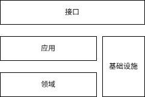

# msModelSlim 架构

msModelSlim 的核心价值在于**沉淀、管理和组织**模型量化与压缩相关的知识（如量化算法、量化格式等）。
当新模型到来时，我们能够快速复用既有知识和经验，完成新模型的量化与压缩，有效控制精度损失，提升推理性能。

## 设计理念

### 模型量化涉及多领域知识

模型量化涵盖模型结构、量化算法、量化权重格式等多个领域，各领域知识之间存在依赖关系（例如量化算法依赖于低精度数据格式、特征提取等基础能力）。
量化本身是这些知识的应用过程，我们需要将各领域知识有机串联，编排为可执行的业务流程。

msModelSlim 将`知识领域`和`知识应用`的概念直接映射到代码中：

- 在独立的**领域**目录下管理对应领域的知识及其实现，实现知识系统性分类；
- 搭建各类**应用**流程，利用知识解决模型量化端到端过程中遇到的痛点和难点。

### 模型量化涉及多个环节

模型量化是一项综合性的推理性能优化方案，通常包含以下环节：
模型画像与分析、量化方案设计、权重量化、量化算子开发、量化组图、部署与测评，以及最终的量化最佳实践（含量化权重）管理。
量化工具不仅可以用于生成量化权重，还可以介入其他环节，以简化和加速整个量化过程。

在此过程中，量化工具不试图包办一切，而是专注于量化知识本身，并与数据库、模型库、性能工具、测评工具、推理框架等外部库、工具和服务协作，共同完成量化任务。
msModelSlim 将这些外部依赖统称为`基础设施`，并在基础设施适配代码中描绘如何在量化过程中引入和协调基础设施，承载交叉领域知识。
这些知识服务于量化操作，但与特定基础设施绑定；这些知识体现了对应基础设施的特性，却又根植于量化概念。

### 模型量化涉及多种角色

量化模型的落地离不开量化权重、量化算子和推理框架三者的配合。量化算法专家、算子专家和推理专家在不同环节分工协作。
为了协调不同角色的工作，统一对量化方案的理解，我们需要一套明确的`量化描述语言`。

msModelSlim 提供基于 YAML 配置的量化方案描述语言，该语言具备良好的可读性、易调整性和可分享性，适用于大语言、多模态理解、多模态生成等多种模型。
算法配置会透传至量化算法代码，其格式允许算法专家自定义；推理专家无需编写算法代码，只需按约定格式录入算法参数即可触发量化算法执行。

### 量化是模型结构的模式识别与替换

模型通常由基础结构堆叠而成。**模型量化是将原始的模型子结构替换为性能更优的量化结构。**
量化算法需要完成三件事：

1. **模式匹配**：找到需要替换的结构位点；
2. **参数计算与结构创建**：计算量化参数并生成量化结构；
3. **结构替换**：用量化结构替换原始结构。

`量化结构`是量化算法的基础，也是量化工具、算子和推理框架交互的锚点：

- 量化工具为量化结构准备量化参数和量化权重；
- 算子提供设备亲和的量化结构实现单元；
- 框架将算子组装成完整的量化结构，并为其加载权重和参数。

msModelSlim 将量化结构抽象为`量化模式`（例如 W8A8 INT8 静态量化），并作为msModelSlim的架构基石之一。
这种抽象是形式化的，与推理设备无关，描述了量化公式和必要的参数。

## 整体架构

msModelSlim 整体分为四层：**接口层**、**应用层**、**领域层**和**基础设施层**。

### 接口层

接口层由多个`接口`组成，每个接口提供一套针对特定业务痛点的解决方案。
应用、领域和基础设施各自专注于特定方向，就像一块块积木，接口根据实际业务场景，选取积木并拼合为**可触发和执行**的业务流。
msModelSlim目前对外开放命令行工具，提供一键量化、敏感层分析和自动调优等命令行。

### 应用层

应用层由多个知识应用组成，每个应用编排知识作业流以达成特定业务目标。
例如，一键量化应用经过“加载模型信息”、“获取最佳量化方案”、“应用量化算法”实现模型量化。
应用流程本身是抽象的，必须与具体知识结合才能完成任务。
例如，一键量化应用配合DeepSeek模型适配、W8A8量化算法，实现了DeepSeek模型W8A8量化。

### 领域层

领域层由多个知识领域组成，每个领域将一类知识封闭其中。
msModelSlim不以内涵定义领域，而是以能力定义领域，具有相似能力的知识归于一个领域。
例如，基于推理校准完成模型子结构处理即认为是量化算法。
这种定义不严谨，但外延的泛化使得知识更容易接入到应用中，也更容易拓展知识库。

msModelSlim将一组相互协作的实现了领域定义的知识称为`组件`。
一方面，组件有明确的适用场景，另一方面，组件有明确的技术路径。
不同的场景和不同的技术路径的切换在msModelSlim中转化为在应用中使用不同组件。
例如，已有DeepSeek模型W8A8量化，为了追求更好的性能，要进一步W4A8量化，只需要将量化算法组件从W8A8算法切换为W4A8算法即可。

### 基础设施层

基础设施层由多个`基础设施适配`组成，每个基础设施适配在外部依赖基础上满足量化需求。
例如，Qwen 模型适配基于 transformers 库完成 Qwen 模型的加载和推理，满足量化校准的需求。
适配代码与外部依赖紧密相连，纵使量化需求不变，变换外部依赖往往需要同步更新适配代码。
例如，当 transformers 版本更新时，原有 Qwen 模型适配的逻辑可能失效，msModelSlim针对每个模型推荐量化时的 transformers 版本。

基础设施适配的量化需求并非来自基础设施本身，而是来自应用层和领域层，确保量化逻辑在msModelSlim内部闭环。
msModelSlim 要求应用、领域和组件**显式地**提出对基础设施的诉求，并将其归纳为`接口协议`。
基础设施适配响应这些诉求，借用基础设施实现接口协议。

虽然不同的应用、领域和组件等内部实体可能提出相近的接口协议，但这些接口协议源自不同实体的逻辑，理应视作相互独立，不宜混为一谈。
不过一个基础设施可以满足多项诉求，一个基础设施适配也可以同时实现多种接口协议。
例如，一键量化应用需要读取最佳实践，自动调优应用需要存储最佳实践，基于文件系统的最佳实践管理作为基础设施适配，可以同时实现读取和存储接口协议。

## 量化模式

量化带来的性能增益源于我们将原始模型结构替换为硬件亲和的量化结构，后者具有更好的推理性能。
量化结构并非模型原生，我们需要注入外部知识，推理团队会针对模型进行量化组图，算子团队会开发新的量化算子。

msModelSlim 将一类模式一致的量化结构称为一种**量化模式**（例如 W8A8 INT8 静态量化）。一旦量化模式明确，量化结构的参数集合和量化/反量化过程也随之确定，更进一步，即可预估理论性能和精度趋势。基于统一的量化模式理解和认识，量化团队、算子团队、推理团队各自独立设计和构建权重、算子和组图，但最终三者合并即可顺利验收和部署量化模型推理服务，满足精度损失约束的同时获取预期的性能收益。

msModelSlim 使用 `IR（中间表示）` 领域来具体化量化模式，并作为量化知识体系的**基石**。作为基石，IR 服务于所有推理框架和所有硬件设备。因此，IR 不应绑定任何硬件设备，不还原推理框架的实际前向过程，而是对量化模式形式化地描述，还原输入输出的映射。幸运的是，低精度数据格式的数值总能被高精度数据格式精确表示。因此我们不必依赖与硬件设备绑定的低精度量化算子，可以用各硬件设备普遍支持的高精度数值计算模拟实际推理过程。这种用高精度模拟低精度的量化推理过程称为**伪量化**。伪量化能够反馈量化精度，但失去了硬件亲和性，因此无法获得量化带来的性能收益。

## 量化算法

量化算法将原始模型的子结构替换为高性能量化结构，从而加速推理。算法需要解决以下问题：

1. 哪些子结构可以替换？
2. 替换成哪种量化模式？
3. 量化参数如何计算？
4. 量化模式如何亲和硬件？

硬件亲和问题主要由算子解决，量化工具的算法设计重点关注前三个问题。
其中，量化结构替换需要与推理框架同步完成，而量化参数计算是量化工具的核心职责。
量化是一种有损压缩，好的参数计算方法能有效降低量化后的精度损失。

根据量化参数计算是否依赖激活值特征，msModelSlim 将量化算法分为**无校准算法**和**有校准算法**：

- **有校准算法**需要在特定数据集上运行模型推理，以捕获激活值特征，辅助量化参数计算；
- **无校准算法**仅需加载权重即可完成量化参数计算。

msModelSlim 将一个量化方案多个算法基于特定校准数据集推理的参数校准分解为一系列基本校准单元，
每个校准单元可以由<一批数据,一段推理,一个量化算法>三元组表示，
即**一个算法**根据**一批数据**推理过程中的激活值特征，完成**一段推理**所涉及的量化模式识别与替换，并调整其量化参数。
通过这种细粒度拆解，msModelSlim 能够充分利用算力和内存，以较低的资源占用和耗时完成模型量化。
而算法也定义为基于推理校准的模型子结构处理，在 `Processor` 领域中管理。

## 模型适配

模型适配并非模型量化过程中固有的必需步骤。
在最朴素的量化场景中，开发者通常直接针对待量化模型的结构编写量化脚本。
这种脚本没有独立的适配逻辑，模型的结构信息散落在算法细节中，无法从算法代码中抽离。
每个新模型都需要从头编写量化脚本，即使切换同一模型的量化方案也可能需要重写脚本。

模型适配将模型相关代码抽离为独立逻辑，目的是实现量化过程的通用性和泛化性。该过程包含两个阶段：

1. **组件内解耦**：算法、调度等组件各自将代码逻辑分解为“模型适配逻辑”和“核心机制”。
   在新模型量化场景下，我们只需修改模型适配逻辑，无需改动组件的核心机制。
2. **统一适配框架**：我们将所有组件的模型适配逻辑聚合到统一的模型适配框架中。
   在新模型量化场景下，我们只需新增模式适配器，无需霰弹式修改各组件。

在 msModelSlim 中，`Model` 模型适配是一种基础设施，体现了内部知识（如算法、调度）对外部模型知识的依赖。
以 SmoothQuant 算法为例，平滑过程需要识别并处理 “Norm-Linear” 模型结构对。
目前自动化识别仍有技术挑战，我们需要针对具体模型结构定制化给出结构对的位置信息，DeepSeek 模型与 Qwen 模型有着截然不同的 “Norm-Linear” 结构对。

这些内部知识对模型的依赖根植于内部知识本身，不同内部知识的依赖相互独立。
msModelSlim 要求每个对模型有依赖的内部知识**显式地**提出对模型信息的诉求，并将其归纳为**模型适配接口协议**，模型适配器按需实现接口协议总集的子集。
例如，W8A8 MXFP8量化精度损失小，量化方案没有使用离群值抑制算法，那么就不需要实现 SmoothQuant 等离群值抑制接口协议。
倘若 W8A8 量化时实现了 QuaRot 旋转抑制接口协议，那么后续 W4A8 量化也可以继续使用旋转抑制，无需修改和拓展模型适配器。

## 量化格式

量化权重是量化工具提供给推理框架的交付件，它告知推理框架哪些位置替换为哪种量化模式、量化参数是什么，并补充整体量化信息。
量化格式则是两者之间的交互协议，明确推理框架应如何读取和解析上述信息。
量化格式服务于真实的推理过程，不可避免地需要向推理框架、量化算子乃至推理设备妥协并定制化，往往会增加框架/硬件亲和的额外参数，以加速模型加载和推理过程。

msModelSlim 使用 `Format` 领域承载量化格式知识，重点关注各量化模式参数的持久化方式以及整体量化策略的描述方式。
在多卡加速场景下，不同卡各自负责部分量化结构，因此量化格式需要考虑如何合并多片量化权重（例如平均、拼接或选取主卡结果）。
