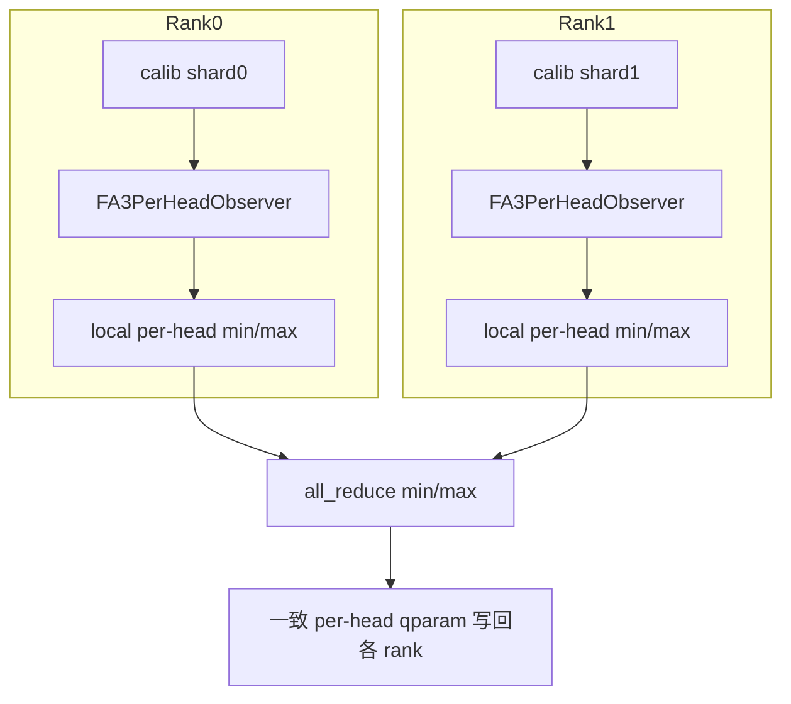

# 多卡量化适配指南

## 简介

本文档面向需要为量化算法适配支持多卡量化的开发者。

msmodelslim 通过一键量化命令中 `--device` 字段区分单卡/多卡执行量化，以 DeepSeek-V3.1 w4a8c8 量化为例，以下命令为单卡量化：

```shell
msmodelslim quant \
--model_path ${model_path} \
--save_path ${save_path} \
--model_type DeepSeek-V3.1 \
--quant_type w4a8c8 \
--trust_remote_code True
```

当需要指定使用多卡进行量化时，通过 `--device npu:0,...,N` 指定具体卡数，具体可参考以下示例命令：

```shell
msmodelslim quant \
--model_path ${model_path} \
--save_path ${save_path} \
--model_type DeepSeek-V3.1 \
--quant_type w4a8c8 \
--device npu:0,1,2,3,4,5,6,7,8 \
--trust_remote_code True
```

多卡量化相较于单卡量化的效率提升受 I/O读写、量化算法、硬件性能等多方面影响，实际收益需要具体问题具体分析。对于 DeepSeek-V3.1 w4a8c8 量化而言，8 卡量化速度约为单卡的 4 倍。

在单卡场景下，量化流程通常是：校准前向采集激活值 → 计算激活值统计量 → 计算量化参数并写回模型。启用多卡后，框架会为每张卡启动独立进程（rank），各 rank 持有完整模型副本，并处理不同的校准数据分片。量化过程中会修改 Observer、量化器等状态，进而决定量化结果，因此算法必须在合适时机通过集合通信聚合统计量或量化参数，保证多卡时跨 rank 的共享模块上的量化结果与单卡全量校准语义一致。

## 支持列表

下表汇总当前多卡量化支持情况：

| Processor | 完备性支持 | 分布式任务调度优化 |
|-----------|:----------:|:--------:|
| `AdaptRotationProcessor` | ✓ | — |
| `FA3QuantProcessor` | ✓ | — |
| `FlexSmoothQuantProcessor` | ✓ | ✓ |
| `FlexAWQSSZProcessor` | ✓ | ✓ |
| `IterSmoothProcessor` | ✓ | — |
| `LinearQuantProcessor` | ✓ | ✓ |
| `OnlineQuaRotProcessor` | ✓ | — |
| `QuaRotProcessor` | ✓ | — |

---

# 多卡量化基本概念

## 多卡量化完备性

排除专家并行（EP）的特殊影响下，多卡量化场景中各 rank 满足：

* **模型副本一致**：各 rank 持有同构、同值的完整模型副本。
* **数据分片**：校准集按 rank 切分，各 rank 仅对自己的分片做前向与统计。

基于以上概念，多卡量化解决的核心问题即“如何在各 rank 仅持有部分校准集的情况下，最终输出与持有完整校准集时等价的模型量化权重？”。解决该问题的核心思路是我们对量化算法收集的激活张量或计算的统计值在合适的时机进行跨卡同步，从而得到与持有完整校准集时等价的激活采集或统计效果。

以 **FA3 量化**为例：各 rank 对本地校准分片前向时，`_FA3PerHeadObserver` 统计各 head 的局部 `min`、`max`；然后通过集合通信对各 rank 的局部统计值做归约，从而得到与全量校准等价的全局`min`、`max`。详细适配步骤见 [适配案例：FA3Quant](#适配案例fa3quant)。



经过上述同步操作后，各 rank 基于全局`min`、`max`计算量化参数 qparam 与从完整校准集前向计算出的量化参数一致，后续各 rank 均以相同的量化参数执行后续量化，最终各 rank 产生一致的模型状态。我们将以上流程称为多卡量化的**完备性支持**：实现该适配后，多卡流程可正确跑通，且结果在数学上与单卡等价。在完备性支持下，我们使用多卡取得的时间开销收益源于对校准集的并行推理，额外产生的开销在于不同卡之间的同步操作，但由于同步开销一般相对都是较小的，整体上我们仍可以取得可观的加速收益。

## 分布式任务调度优化

在完备性支持的基础上，我们发现其中仍存在可优化点：各 rank 往往对**同一子任务**重复执行。例如量化算法内依次有子任务 T1、T2、T3、T4，默认情况下 rank0 与 rank1 都会完整运行一遍 **T1→T2→T3→T4**，总耗时仍接近单卡整条任务链的时长，多卡只加速了校准前向，却未充分利用多卡分担这些重复的算法子任务。

为缓解这一问题，本仓库引入分布式任务调度器 **DistributedTaskScheduler**（下文简称 **DTS**）。其核心思路是：把算法的执行流程拆分成若干个子任务，由不同 rank **分工执行** 这些子任务，而后在合适时机 **跨卡同步**，从而保证各 rank 的模型状态与「每个 rank 分别执行完整的任务链 T1→T2→T3→T4」等价。以两张卡为例（`world_size = 2`）：

```text
优化前

  Rank0:  T1 ──► T2 ──► T3 ──► T4
  Rank1:  T1 ──► T2 ──► T3 ──► T4

  时间开销 ≈ T1 + T2 + T3 + T4（两卡各跑一遍，子任务算力重复）


优化后
  Rank0:  T1 ──────────► T3
  Rank1:   T2 ──────────► T4
                            │
                            ▼
                    跨 rank 同步
                            │
                            ▼
                    各 rank 的模型状态 等价于 均执行过  T1 ──► T2 ──► T3 ──► T4

  时间开销 ≈ max(本 rank 子任务耗时) + 同步开销（理想情况下短于两卡各跑整条链）
```

---

# 多卡量化适配

---

## 完备性支持：接入多卡量化

**目标**：在多卡量化场景下，算法在各 rank 的量化行为与单卡时保持语义一致。

本小节介绍 msmodelslim 仓为多卡量化**完备性支持**提供的（1）基础设施：用于解决如何识别共享模块、如何实现同步的问题；（2）接入步骤：指导量化算法适配支持多卡量化；（3）适配案例：结合已有的多卡量化适配案例进一步解析适配流程。

### 基础设施

#### DistHelper

在多卡量化中，有的模块在各卡中均存在相同的副本，有的模块只在当前卡局部存在(如 EP 下的路由专家)。对于各卡都持有的共享模块，需要在合适的时机进行卡间通信以确保各卡的量化行为一致；而对于仅在局部存在的模块，则始终不应该做同步操作，否则会出现进程卡死等非预期行为。[`DistHelper`](https://gitcode.com/Ascend/msmodelslim/blob/master/msmodelslim/utils/distributed/dist_helper.py) 作为辅助工具类，在初始化时自动完成对网络模块的拓扑结构分类（区分共享/局部模块），并提供接口方法用于查询共享模块的列表。

使用方法：

* **初始化**：通过 `self.dist_helper = DistHelper(request.module, prefix=request.name)` 初始化。
* **模块注入**：通过调用 `set_dist_helper` 将 DistHelper 注入待适配算法的 Observer 或 StatsCollector 等成员中。
* **调用**：同步前调用 `dist_helper.is_shared(module_name)`查询共享模块列表，**仅对共享模块**做跨 rank 聚合。

#### 工具函数

跨 rank 聚合激活值或统计值时，可优先使用 [`msmodelslim/utils/distributed/dist_ops.py`](https://gitcode.com/Ascend/msmodelslim/blob/master/msmodelslim/utils/distributed/dist_ops.py) 中的存量工具函数：

| 函数名 | 主要入参 | 功能与典型场景 |
|------|----------|----------------|
| `sync_base_operation` | `tensor`：待规约张量（**原地**更新）；`op`：`min` / `max` / `sum` / `mean` / `prod`；`group`：进程组（可选） | 对各 rank 上的同形张量做**全归约**（`all_reduce`；`mean` 为 sum 后除以 `world_size`），结果写回同一 `tensor`。不额外分配大张量缓冲区。适用于 Observer 内累计的 min/max、channel_max 等统计量对齐。|
| `sync_gather_tensors` | `tensor`：本 rank 待收集的单个张量；`variable_shapes`：是否允许各 rank 张量形状不同（默认 `False`，仅 NPU 路径有效）；`on_cpu`：是否在 CPU 上聚合（默认 `False` ）；`group`：进程组（可选） | 将**每个 rank 的一个张量**收集为长度 `world_size` 的列表。`variable_shapes=True` 时先 gather shape 再 gather 数据。适用于需要保留各 rank 分片数据、而非合并为单一统计量的场景。 |
| `sync_gather_tensor_lists` | `tensor_list`：本 rank 的张量列表（非空）；`on_cpu`：是否在 CPU 上聚合（默认 `False`）；`group`：进程组（可选） | 收集各 rank 的**张量列表**并展平为一条大列表。适用于校准阶段按 batch 缓存的激活张量：各 rank 先本地 append，再在 `postprocess` 一次性合并，于合并结果上计算统计量。例：`FlexStatsCollector.sync_act_stats` 合并 `StatKey.TENSOR`。 |

### 接入步骤

1. **声明支持**：重写 `support_distributed()` 返回 `True`（基类默认为 `False`）。
2. **注入 DistHelper**：在 `preprocess` 创建并注入 Observer / StatsCollector 等组件。
3. **识别需全局一致的量**：明确本算法中哪些变量（如激活值统计量/量化参数/平滑系数）需要在各 rank 上保持一致。
4. **实现同步**（按算法形态二选一或组合）：
   * **Observer**：在校准前向的 `update` 中传入 `sync=True`（常结合 `DistHelper.is_shared` 判断）；在 `update` 内部调用 `sync_base_operation` 等对累计统计量做跨 rank 规约。
   * **Processor**：校准前向在 hook 中**仅做本地激活采集**；在 `postprocess` 里调用 `sync_gather_tensor_lists` 等合并各 rank 数据，再计算或规约全局统计量。

### 适配案例：FA3Quant

以 [`FA3QuantProcessor`](https://gitcode.com/Ascend/msmodelslim/blob/master/msmodelslim/processor/quant/fa3/processor.py) 的多卡量化适配为例。FA3 在默认的 `per_head` 配置下依赖校准前向收集各 head 的 min/max，再据此生成 IR `FakeQuantActivationPerHead`；多卡适配的目标是：**各 rank 得到与全量校准等价的 per-head 量化参数**。

以下按 [接入步骤](#接入步骤) 四步对照源码（[`fa3/processor.py`](https://gitcode.com/Ascend/msmodelslim/blob/master/msmodelslim/processor/quant/fa3/processor.py)、[`recall_window.py`](https://gitcode.com/Ascend/msmodelslim/blob/master/msmodelslim/core/observer/recall_window.py)）进行说明。

**步骤 1：声明支持**

`FA3QuantProcessor` 中声明支持多卡：

```python
def support_distributed(self) -> bool:
    return True
```

**步骤 2：向 `_FA3PerHeadObserver` 注入 DistHelper**

`FA3QuantProcessor.preprocess` 将占位模块换成 `_FA3PerHeadObserver` 后，在多卡时构造 `DistHelper` 并注入每个 observer：

```python
if dist.is_initialized():
    self.dist_helper = DistHelper(request.module, prefix=request.name)
    for _, submodule in request.module.named_modules(prefix=request.name):
        if not isinstance(submodule, _FA3PerHeadObserver):
            continue
        submodule.set_dist_helper(self.dist_helper)
```

**注意事项**

* `DistHelper` 在构造时对各 rank 的 `named_modules` 做一次 `all_gather`，得到 shared / local_only 等集合，**之后不会随模型改动自动刷新**。
* 若 `preprocess` 中还会插入 Observer、替换 IR 等，须在**上述结构变更全部完成之后**再执行初始化 `DistHelper(model, prefix=...)`，否则 `is_shared(name)` 按照旧的模型结构返回结构，对算法行为造成非预期的影响。

**步骤 3：识别需全局一致的量**

`FA3QuantProcessor` 在 `per_head` 模式下，量化参数由 observer 累计的 min/max 计算得到。各 rank 若要得到相同的量化参数 qparam，传入 `calculate_qparam` 的 `min_v`、`max_v` 必须一致：

```python
min_v = submodule.min_val.squeeze()   # 来自校准阶段 RecallWindowObserver 的累计极值
max_v = submodule.max_val.squeeze()

q_param = calculate_qparam(
    min_val=min_v,
    max_val=max_v,
    ...
)
```

**步骤 4：实现同步**

调用 `DistHelper` 类识别需要同步的模块，将同步标记变量 `sync` 传给内部 `RecallWindowObserver`：

```python
def forward(self, x: torch.Tensor) -> torch.Tensor:
    samples = x.contiguous().view(x.shape[1], -1)
    sync = self._dist_helper is not None and self._dist_helper.is_shared(self._name)
    self._observer.update(samples, sync=sync)
    return x
```

`sync=True` 时，`RecallWindowObserver.update` 在合并当前 batch 的本地 `min` / `max` 之后，使用同步工具函数对统计值进行跨 rank 归约，从而使实现校准结束后各 rank 上 `min` / `max` 与「全量校准集」对齐，后续各 rank 可基于 `min` / `max` 算出一致的量化参数。

```python
if sync and dist.is_initialized():
    sync_base_operation(self._min_values, op="min")
    sync_base_operation(self._max_values, op="max")
```

---

## 效率优化：分布式任务调度器接入

**目标**：在多卡量化完备性支持的基础上，减少各 rank **重复执行相同子任务** 以进一步提升运行效率。DTS 只调整 Processor **内部** 的任务执行顺序，不改变算法数学语义。

本小节介绍 msmodelslim 仓分别为多卡量化**效率提升**提供的（1）基础设施：用于解决如何分配和执行算法子任务的问题；（2）接入步骤：指导量化算法接入分布式任务调度器；（3）适配案例：结合已有的适配案例进一步解析适配流程。

### 基础设施

#### DistributedTaskScheduler

[`DistributedTaskScheduler`](https://gitcode.com/Ascend/msmodelslim/blob/master/msmodelslim/utils/distributed/task_scheduler/scheduler.py)在内部通过任务共享队列动态地向各 rank 下发任务，一个共享任务只被下发和执行一次，最终通过网络模块的同步实现各 rank 一致。开发者只需关心如何创建和提交算法子任务，DTS 内部自行完成任务调度。

使用方法：

* **初始化**：通过 `DistributedTaskScheduler(model, disable_parallel=...)` 构造调度器。
* **提交任务**：通过 `submit(fn, args=(), kwargs=None, dependencies=None, ...)` 向任务队列中提交子任务。
* **执行任务**：通过 `run()` 开始自动分配和执行任务。

```python
with DistributedTaskScheduler(self.model, disable_parallel=True) as scheduler:
    for idx in range(n_tasks):
        scheduler.submit(self._worker, args=(idx,), dependencies=deps)
    scheduler.run()
```

**`DistributedTaskScheduler` 构造参数**

| 参数 | 是否必配 | 说明 |
|------|----------|------|
| `model` | 是 | 当前 Processor 持有的 `nn.Module`，用于解析 `dependencies` 路径及默认模块同步。 |
| `disable_parallel` | 否 | 默认 `False`。为 `True` 时，该调度器内**全部** `submit` 均按「各 rank 各跑一遍」执行（等价于对本调度器内所有子任务关闭分工）；作用范围大于单次 `submit(..., parallel=False)`。另可通过类方法 `DistributedTaskScheduler.set_global_disable_parallel(True)` 全局关闭分工。 |

**`submit` 方法的参数**

| 参数 | 是否必配 | 说明 |
|------|----------|------|
| `fn` | 是 | 子任务入口函数（通常为 Processor 的实例方法，如 `self._worker_fn`）。 |
| `args` / `kwargs` | 否 | 传给 `fn` 的位置参数与关键字参数，须满足：与 `fn` 的形参匹配，`fn(*args, **kwargs)` 可正常调用。 |
| `dependencies` | 否 | 本任务涉及的**模块路径**列表（如 `[source] + list(targets)`），用于划分波次并在任务结束后触发默认模块同步；路径须能被 `model.get_submodule` 解析，不含 `None`、勿嵌套 list。 |
| `sync_fn` | 否 | 任务完成后的自定义同步回调，签名为 `(record: TaskExecutionRecord, sync_ctx: TaskSyncContext) -> None`。若提供则**替代**针对 `dependencies` 的默认同步。 |
| `parallel` | 否 | 是否对该子任务启用**跨 rank 分工**（默认 `True`）。`True`：多卡时子任务由不同 rank 分担执行（每个子任务通常只在一个 rank 上跑），`run()` 结束后按 `dependencies` / `sync_fn` 同步，使结果等价于各 rank 都执行过该子任务。`False`：多卡时**每个 rank 都会完整执行**该子任务（不分工）；适用于子任务内已有全归约等集合通信的场景。 |

**三级同步机制**

由于每个算法子任务只在分配到该任务的 rank 上执行，因而算法子任务产生的模型结构影响（如离群值抑制算法修改权重数值，量化算法替换模型结构）也只在 rank 生效，为保持多卡语义正确性，本仓引入三级同步机制以满足在不同情境下的任务同步需要。三级同步的优先级为：`sync_fn` > `DTSMixin.distributed_sync` > `default_module_state_sync`，一个子任务只进行其中一级同步，例如当 `sync_fn` 被触发时，则不会再执行 `DTSMixin.distributed_sync` 和 `default_module_state_sync`。

| 参数 / 机制 | 说明 |
|-------------|------|
| `sync_fn` | **任务级自定义同步**（`submit` 入参）；提供后**仅**执行该回调，不再对 `dependencies` 子树做下方模块级同步。适用于模型结构发生变化，如使用 IR 替换了模型结构，模块级同步无法满足需要，可自定义实现。|
| `DTSMixin.distributed_sync` | **模块级自定义同步**：若 `dependencies` 子树中某子模块的类继承 [`DTSMixin`](https://gitcode.com/Ascend/msmodelslim/blob/master/msmodelslim/utils/distributed/task_scheduler/sync.py) 并实现 `distributed_sync` 方法，则对该子模块调用自定义逻辑。适用于模型结构未产生变化，但默认同步又不能满足同步需要时，可自定义实现。|
| `default_module_state_sync` | **模块级默认同步**：以**执行该任务的 rank**（`record.executor_rank`）上的参数与 buffer 为源广播到各 rank，使各 rank 状态一致。 |

### 接入步骤

1. 先完成 [完备性支持：接入多卡量化](#完备性支持接入多卡量化) 的适配和验证。

2. **封装子任务函数（`fn`）**：将可拆分逻辑封装为 Processor 方法（如 `self._worker_fn`）。

3. **提交任务（`submit`）**：在 `with DistributedTaskScheduler(self.model, ...)` 内通过 `submit` 方法提交任务。

4. **执行调度（`run`）**：各 rank 在同一 `with` 中完成全部 `submit` 后调用 `scheduler.run()`，由 DTS 自动分发并执行子任务，调用同步方法。

**注意事项**

* **任务内 collective 与 rank 间分工不可混用**：子任务函数内不应包含同步行为，如 all_gather/ all_reduce，否则由于一个子任务只被一个 rank 执行，其他 rank 无法运行至同步位点，产生进程死锁。
* `submit` 的业务参数必须通过 `args`/`kwargs` 传入，**不得**作为 `submit` 的第二个位置参数；`args`/`kwargs` 须可序列化。

### 接入案例：FlexAWQSSZ

本小节以 [`FlexAWQSSZProcessor`](https://gitcode.com/Ascend/msmodelslim/blob/master/msmodelslim/processor/anti_outlier/flex_smooth/processor.py) 为例，说明如何在已完成 [完备性支持](#完备性支持接入多卡量化)之后接入 DTS 以进一步优化多卡量化效率。

**步骤 1：封装子任务函数**

基类 `BaseSmoothProcessor._process_subgraphs_by_priority` 在各 rank 上串行调用 `_process_single_subgraph`；FlexAWQSSZ 在基类 FlexSmoothBaseProcessor 中 **重写**该方法，将每个子图平滑注册为一条 DTS 任务。

1. **提交前**在 Processor 上准备好「子图任务表」`self.sorted_configs`（按优先级排序后的 `AdapterConfig` 列表，各 rank 内容一致）。
2. **`submit` 只传整数编号** `idx`（从 1 开始，与循环 `enumerate(..., start=1)` 一致）。
3. **执行时**（某 rank 分到该任务后），worker 用 `idx` 回查 `self.sorted_configs[idx - 1]`，再调用与单卡相同的 `_process_single_subgraph`。

```python
def _worker_fn(self, idx) -> None:
    adapter_config = self.sorted_configs[idx-1]
    priority = self.SUBGRAPH_PRIORITY.get(adapter_config.subgraph_type, 999)
    module_name = adapter_config.mapping.source \
        if adapter_config.mapping.source else adapter_config.mapping.targets[0]
    get_logger().debug(
        "  %d. %s (priority: %d) - %s", idx, adapter_config.subgraph_type, priority, module_name
    )
    self._process_single_subgraph(adapter_config)
```

**步骤 2：提交算法子任务**

按子图优先级排序后，在 `with` 中循环 `submit`；`dependencies` 用于调度器关联模块并在任务结束后同步相关状态：

```python
if not self.sorted_configs:
    get_logger().warning(f"No subgraphs to process for current layer.")
    return

with DistributedTaskScheduler(self.model) as scheduler:
    for idx, adapter_config in enumerate(self.sorted_configs, start=1):
        m = adapter_config.mapping
        is_non_fusion = (m.source is None and m.targets is not None)
        has_non_shared_module = False
        if self.dist_helper is not None:
            module_names = []
            if m.source is not None:
                module_names.append(m.source)
            if m.targets is not None:
                module_names.extend(m.targets)
            has_non_shared_module = any(
                not self.dist_helper.is_shared(name) for name in module_names
            )
        scheduler.submit(fn=self._worker_fn,
                            args=(idx,),
                            dependencies=([m.source] if m.source else []) + list(m.targets),
                            parallel=not (is_non_fusion or has_non_shared_module),
                        )
```

* `args=(idx,)`：只传整数索引，不传 `AdapterConfig` 对象（满足序列化要求）。
* `dependencies`：`[source] + list(targets)`；无 `source` 时用 `[] + targets`，避免 `None` 进入列表。
* `parallel=not (is_non_fusion or has_non_shared_module)`：以下任一情况关闭 rank 间分工，由各 rank 完整执行该任务——**非融合子图**（`source is None`）；或 `dependencies` 中任一模块经 `DistHelper.is_shared` 判定为**非 shared**（如 MoE 局部 expert）。其余子图允许分工。

**步骤 3：执行调度**

```python
with DistributedTaskScheduler(self.model) as scheduler:
    for idx, adapter_config in enumerate(self.sorted_configs, start=1):
        ... # 提交任务
    scheduler.run() # 执行调度,自动分配并执行所有子任务
```

所有 rank 必须进入同一 `with DistributedTaskScheduler(...)` 并调用 `scheduler.run()`；`run()` 返回后清理 `self.sorted_configs`。

---
